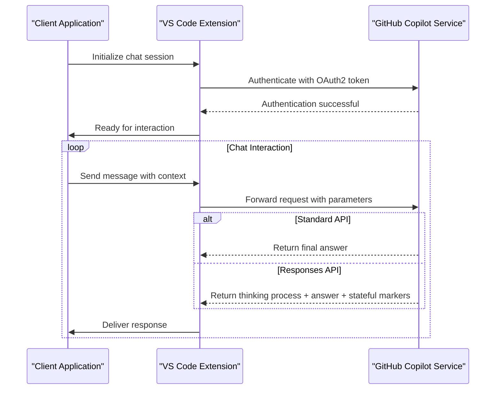
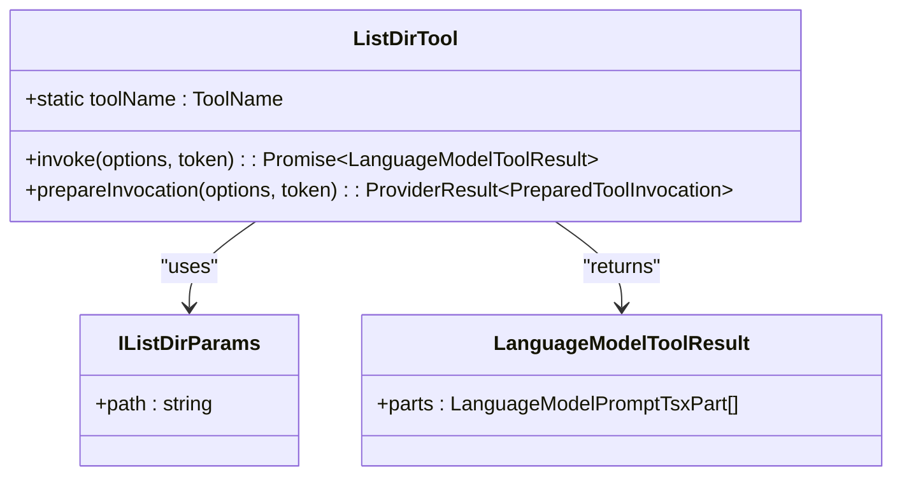
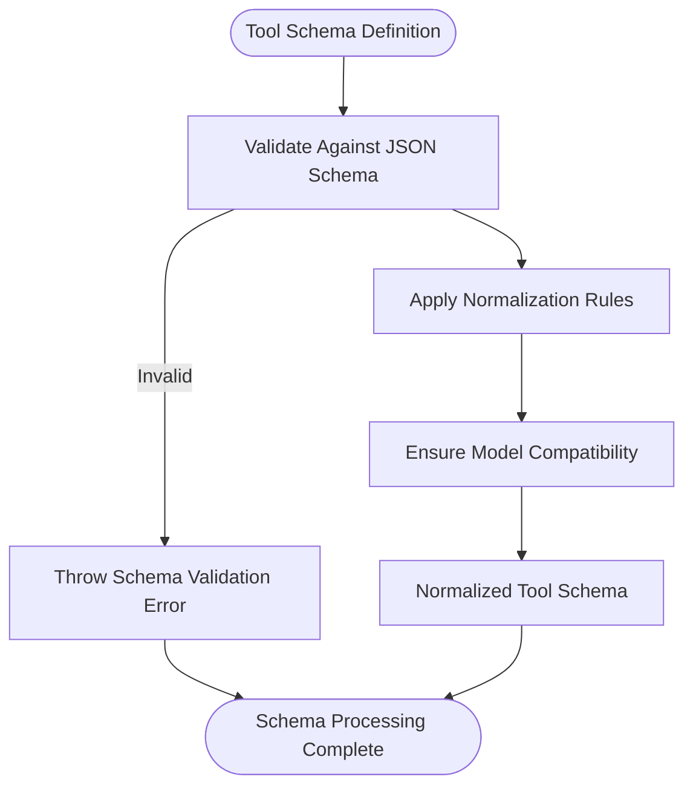
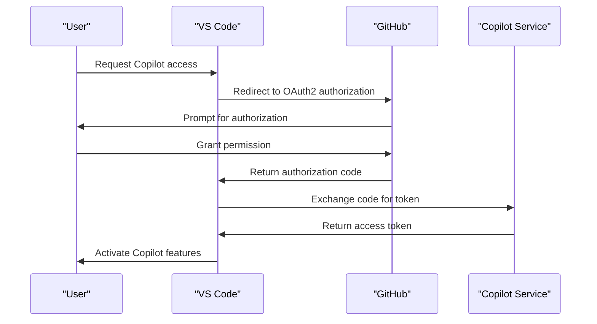

# API Reference

<cite>
**Referenced Files in This Document**   
- [api.d.ts](file://src/extension/api/vscode/api.d.ts)
- [extensionApi.ts](file://src/extension/api/vscode/extensionApi.ts)
- [listDirTool.tsx](file://src/extension/tools/node/listDirTool.tsx)
- [parseApplyPatch.ts](file://src/extension/tools/node/applyPatch/parseApplyPatch.ts)
- [COPILOT_API_SUMMARY.md](file://COPILOT_API_SUMMARY.md)
- [vscode.d.ts](file://src/extension/vscode.d.ts)
- [allTools.ts](file://src/extension/tools/node/allTools.ts)
- [toolNames.ts](file://src/extension/tools/common/toolNames.ts)
- [toolsService.ts](file://src/extension/tools/vscode-node/toolsService.ts)
- [toolSchemaNormalizer.ts](file://src/extension/tools/common/toolSchemaNormalizer.ts)
</cite>

## Table of Contents
1. [Introduction](#introduction)
2. [VS Code Language Model Chat API](#vs-code-language-model-chat-api)
3. [Custom Tool APIs](#custom-tool-apis)
4. [Tool Schema Definitions](#tool-schema-definitions)
5. [Authentication Methods](#authentication-methods)
6. [Client Implementation Guidelines](#client-implementation-guidelines)
7. [Backward Compatibility and Migration](#backward-compatibility-and-migration)
8. [Security Considerations](#security-considerations)
9. [Rate Limiting and Quotas](#rate-limiting-and-quotas)
10. [Versioning Details](#versioning-details)

## Introduction
This document provides comprehensive API documentation for the GitHub Copilot Chat extension interfaces. It covers the VS Code Language Model Chat API, custom tool APIs, authentication methods, and implementation guidelines for both internal and external consumers. The documentation includes detailed information on request/response schemas, tool schema definitions, security considerations, rate limiting, and versioning details.

The GitHub Copilot Chat extension enables advanced AI-powered coding assistance within Visual Studio Code through a combination of language model chat capabilities and code manipulation tools. This API reference serves as the authoritative guide for understanding and interacting with these interfaces.

## VS Code Language Model Chat API

The VS Code Language Model Chat API (`onLanguageModelChat:copilot`) provides the foundation for AI-powered chat interactions within the editor. This API supports both standard completion and extended Responses API features, enabling different levels of interaction complexity.

The API operates through two primary modes:
- **Standard Completion API**: For basic chat completions and code suggestions
- **Responses API**: For advanced interactions with reasoning, truncation control, and stateful conversations

The Responses API extends the standard capabilities by providing access to the model's thinking process, allowing for complex problem-solving and educational use cases. It also supports disabling context truncation and maintaining stateful conversations through caching mechanisms.

**Diagram sources**
- [COPILOT_API_SUMMARY.md](file://COPILOT_API_SUMMARY.md)
- [extensionApi.ts](file://src/extension/api/vscode/extensionApi.ts)

**Section sources**
- [COPILOT_API_SUMMARY.md](file://COPILOT_API_SUMMARY.md)
- [vscode.d.ts](file://src/extension/vscode.d.ts)

## Custom Tool APIs

The GitHub Copilot Chat extension provides several custom tool APIs that enable code manipulation and workspace operations. These tools are exposed through the language model interface and can be invoked by the AI to perform specific actions within the development environment.

### copilot_applyPatch
The `copilot_applyPatch` tool enables the application of code changes through patch operations. It supports three types of operations: file creation, file deletion, and file updates.

**Parameters:**
- `patch`: String containing the patch content with specific formatting
- The patch must begin with `*** Begin Patch` and end with `*** End Patch`
- Supports operations: `Add File`, `Delete File`, `Update File`

**Return Value:**
- Array of operation objects with type, path, and content details
- Returns null for invalid patches

**Error Handling:**
- Invalid patch format (missing prefix/suffix)
- File operations outside workspace boundaries
- Malformed operation commands

**Section sources**
- [parseApplyPatch.ts](file://src/extension/tools/node/applyPatch/parseApplyPatch.ts)
- [allTools.ts](file://src/extension/tools/node/allTools.ts)

### copilot_readFile
The `copilot_readFile` tool allows reading file contents from the workspace. This tool enables the AI to access code and configuration files for context-aware responses.

**Parameters:**
- `path`: String representing the file path to read
- Path resolution considers workspace boundaries

**Return Value:**
- File content as string
- Error if file is outside workspace

**Error Handling:**
- File not found
- Permission issues
- File outside workspace

### copilot_listDir
The `copilot_listDir` tool provides directory listing capabilities, allowing the AI to explore the project structure.

**Parameters:**
- `path`: String representing the directory path to list

**Return Value:**
- Array of file and directory names with type indicators
- "Folder is empty" message for empty directories

**Error Handling:**
- Directory outside workspace
- Permission issues
- Invalid path

**Diagram sources**
- [listDirTool.tsx](file://src/extension/tools/node/listDirTool.tsx)
- [vscode.d.ts](file://src/extension/vscode.d.ts)

**Section sources**
- [listDirTool.tsx](file://src/extension/tools/node/listDirTool.tsx)
- [toolNames.ts](file://src/extension/tools/common/toolNames.ts)

## Tool Schema Definitions

The tool schema definitions provide a structured way to describe the capabilities and requirements of each custom tool. These schemas enable proper validation and integration with the language model system.

### Schema Structure
Tool schemas follow JSON Schema standards with specific extensions for the Copilot environment. Each tool defines:
- Input parameters with type, description, and validation rules
- Required fields
- Default values where applicable

### Schema Normalization
The system includes a schema normalization process to ensure compatibility across different models and environments:

The normalization process handles various model restrictions and ensures consistent behavior across different language models. It includes special handling for edge cases and model-specific requirements.

**Section sources**
- [toolSchemaNormalizer.ts](file://src/extension/tools/common/toolSchemaNormalizer.ts)
- [toolNames.ts](file://src/extension/tools/common/toolNames.ts)

## Authentication Methods

The GitHub Copilot Chat extension uses OAuth2 authentication for secure access to the Copilot service. This authentication method ensures proper authorization and secure token management.

### OAuth2 Implementation
The authentication flow follows the standard OAuth2 protocol with GitHub-specific extensions:

**Key Requirements:**
- Use of OAuth2 tokens (not simple GitHub tokens)
- Secure token storage in VS Code credential manager
- Token refresh mechanisms for long-lived sessions

**Environment Variables:**
- `GITHUB_OAUTH_TOKEN`: For initial OAuth2 setup
- `COPILOT_TOKEN`: For Copilot service authentication

**Section sources**
- [COPILOT_API_SUMMARY.md](file://COPILOT_API_SUMMARY.md)
- [vscode.d.ts](file://src/extension/vscode.d.ts)

## Client Implementation Guidelines

### Internal Consumers
For internal extension components, implement the following patterns:

1. **Service Injection**: Use dependency injection for tool services
2. **Cancellation Support**: Always handle cancellation tokens
3. **Error Propagation**: Properly propagate and handle errors
4. **Workspace Validation**: Verify paths are within workspace boundaries

### External Consumers
For external integrations and API consumers:

1. **Authentication**: Implement secure OAuth2 flow
2. **Rate Limiting**: Respect rate limits and implement retry logic
3. **Error Handling**: Implement comprehensive error handling
4. **Schema Validation**: Validate tool inputs against schemas

**Best Practices:**
- Use streaming responses for better user experience
- Implement proper context management
- Handle partial responses gracefully
- Provide clear user feedback during operations

**Section sources**
- [extensionApi.ts](file://src/extension/api/vscode/extensionApi.ts)
- [toolsService.ts](file://src/extension/tools/vscode-node/toolsService.ts)

## Backward Compatibility and Migration

The API maintains backward compatibility through several mechanisms:

### Versioning Strategy
- Semantic versioning for public APIs
- Deprecation warnings for upcoming changes
- Long deprecation periods (minimum 6 months)

### Migration Paths
When features are deprecated:

1. **Announcement**: Clear documentation of deprecation
2. **Alternative**: Provision of recommended alternatives
3. **Transition Period**: Extended support for deprecated features
4. **Removal**: Final removal with clear communication

### Compatibility Notes
- The Responses API is backward compatible with the Standard API
- Tool schemas maintain backward compatibility through normalization
- New tool additions do not affect existing functionality

**Section sources**
- [COPILOT_API_SUMMARY.md](file://COPILOT_API_SUMMARY.md)
- [toolSchemaNormalizer.ts](file://src/extension/tools/common/toolSchemaNormalizer.ts)

## Security Considerations

### Data Protection
- All file operations are restricted to workspace boundaries
- Path validation prevents directory traversal attacks
- Sensitive operations require explicit user confirmation

### Authentication Security
- OAuth2 tokens are stored securely in the system credential manager
- Token scope is limited to necessary permissions
- Regular token rotation and refresh mechanisms

### Input Validation
- Strict validation of tool inputs against schemas
- Sanitization of file paths and content
- Prevention of code injection attacks

### Privacy
- User code and context are handled with strict privacy controls
- Optional telemetry with user consent
- Compliance with data protection regulations

**Section sources**
- [listDirTool.tsx](file://src/extension/tools/node/listDirTool.tsx)
- [parseApplyPatch.ts](file://src/extension/tools/node/applyPatch/parseApplyPatch.ts)

## Rate Limiting and Quotas

The API implements rate limiting to ensure fair usage and system stability:

### Quota Types
- **Request Rate**: Limits on requests per minute
- **Token Usage**: Limits on token consumption
- **Tool Invocation**: Limits on tool usage frequency

### Rate Limiting Strategy
- Dynamic rate limiting based on usage patterns
- Burst allowances for short-term high usage
- Graceful degradation when limits are approached

### Monitoring and Alerts
- Real-time usage monitoring
- Warning notifications before limits are reached
- Detailed usage reporting

**Section sources**
- [COPILOT_API_SUMMARY.md](file://COPILOT_API_SUMMARY.md)
- [vscode.d.ts](file://src/extension/vscode.d.ts)

## Versioning Details

The API follows semantic versioning principles:

### Version Components
- **Major**: Breaking changes to the API
- **Minor**: New features and enhancements
- **Patch**: Bug fixes and minor improvements

### Version Management
- Clear versioning in API endpoints
- Version-specific documentation
- Deprecation timelines for older versions

### Current Versions
- **VS Code Language Model Chat API**: v1
- **Custom Tool APIs**: v1
- **Authentication API**: v1

The versioning system ensures predictable evolution of the API while maintaining backward compatibility.

**Section sources**
- [extensionApi.ts](file://src/extension/api/vscode/extensionApi.ts)
- [COPILOT_API_SUMMARY.md](file://COPILOT_API_SUMMARY.md)