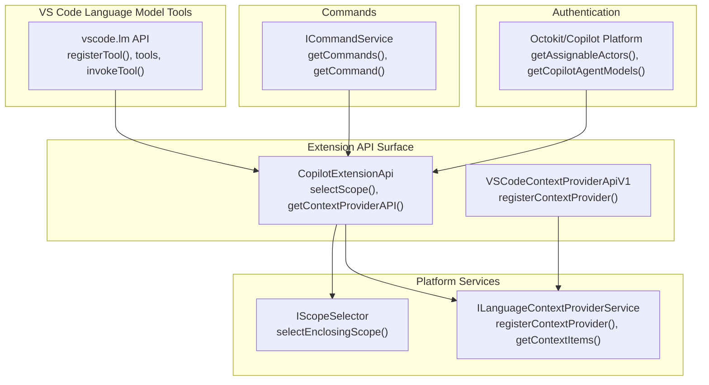
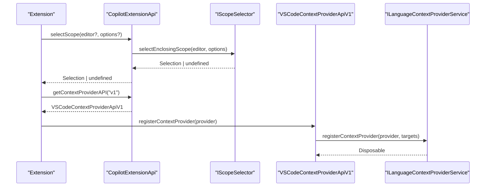
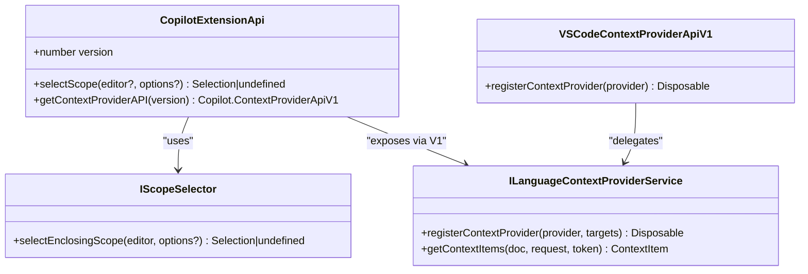

# API Reference

<cite>
**Referenced Files in This Document**
- [api.d.ts](file://src/extension/api/vscode/api.d.ts)
- [extensionApi.ts](file://src/extension/api/vscode/extensionApi.ts)
- [vscodeContextProviderApi.ts](file://src/extension/api/vscode/vscodeContextProviderApi.ts)
- [languageContextProviderService.ts](file://src/platform/languageContextProvider/common/languageContextProviderService.ts)
- [scopeSelection.ts](file://src/platform/scopeSelection/common/scopeSelection.ts)
- [api.ts](file://src/platform/inlineCompletions/common/api.ts)
- [vscode.d.ts](file://src/extension/vscode.d.ts)
- [commandService.ts](file://src/extension/commands/node/commandService.ts)
- [remoteAgents.ts](file://src/extension/conversation/vscode-node/remoteAgents.ts)
- [octoKitServiceImpl.ts](file://src/platform/github/common/octoKitServiceImpl.ts)
- [networkConfiguration.ts](file://src/extension/completions-core/vscode-node/lib/src/networkConfiguration.ts)
</cite>

## Table of Contents
1. [Introduction](#introduction)
2. [Project Structure](#project-structure)
3. [Core Components](#core-components)
4. [Architecture Overview](#architecture-overview)
5. [Detailed Component Analysis](#detailed-component-analysis)
6. [Dependency Analysis](#dependency-analysis)
7. [Performance Considerations](#performance-considerations)
8. [Troubleshooting Guide](#troubleshooting-guide)
9. [Conclusion](#conclusion)
10. [Appendices](#appendices)

## Introduction
This document describes the public APIs exposed by the VSCode Copilot Chat extension. It focuses on:
- Extension API for scope selection and context provider registration
- Language Model Tools API for custom tool development
- Agent skill integration and platform agent capabilities
- Authentication service interfaces used by the extension
- Command system for chat intents and tool equivalents
- API versioning strategy, backward compatibility, and deprecation policies
- Security considerations, rate limiting, and performance optimization guidelines

## Project Structure
The extension exposes a small set of public APIs:
- A minimal extension API for scope selection and context provider access
- The Language Model Tools API surface for registering and invoking tools
- A command service that surfaces chat intents as commands
- Authentication and platform agent integrations

```mermaid
graph TB
subgraph "Extension API Surface"
A["CopilotExtensionApi<br/>selectScope(), getContextProviderAPI()"]
B["VSCodeContextProviderApiV1<br/>registerContextProvider()"]
end
subgraph "Platform Services"
C["IScopeSelector<br/>selectEnclosingScope()"]
D["ILanguageContextProviderService<br/>registerContextProvider(), getContextItems()"]
end
subgraph "VS Code Language Model Tools"
E["vscode.lm API<br/>registerTool(), tools, invokeTool()"]
end
subgraph "Commands"
F["ICommandService<br/>getCommands(), getCommand()"]
end
subgraph "Authentication"
G["Octokit/Copilot Platform<br/>getAssignableActors(), getCopilotAgentModels()"]
end
A --> C
A --> D
B --> D
E --> A
F --> A
G --> A
```

**Diagram sources**
- [extensionApi.ts](file://src/extension/api/vscode/extensionApi.ts#L13-L32)
- [vscodeContextProviderApi.ts](file://src/extension/api/vscode/vscodeContextProviderApi.ts#L11-L21)
- [scopeSelection.ts](file://src/platform/scopeSelection/common/scopeSelection.ts#L13-L23)
- [languageContextProviderService.ts](file://src/platform/languageContextProvider/common/languageContextProviderService.ts#L18-L30)
- [api.ts](file://src/platform/inlineCompletions/common/api.ts#L37-L39)
- [vscode.d.ts](file://src/extension/vscode.d.ts#L20919-L21283)
- [commandService.ts](file://src/extension/commands/node/commandService.ts#L13-L37)
- [octoKitServiceImpl.ts](file://src/platform/github/common/octoKitServiceImpl.ts#L408-L441)

**Section sources**
- [api.d.ts](file://src/extension/api/vscode/api.d.ts#L11-L20)
- [extensionApi.ts](file://src/extension/api/vscode/extensionApi.ts#L13-L32)
- [vscodeContextProviderApi.ts](file://src/extension/api/vscode/vscodeContextProviderApi.ts#L11-L21)
- [api.ts](file://src/platform/inlineCompletions/common/api.ts#L37-L39)
- [vscode.d.ts](file://src/extension/vscode.d.ts#L20919-L21283)
- [commandService.ts](file://src/extension/commands/node/commandService.ts#L13-L37)
- [octoKitServiceImpl.ts](file://src/platform/github/common/octoKitServiceImpl.ts#L408-L441)

## Core Components
- CopilotExtensionApi: Provides scope selection and access to the context provider API.
- VSCodeContextProviderApiV1: Exposes registration of context providers for Copilot.
- Language Model Tools API: Public API for registering tools and invoking them from chat.
- Command Service: Maps chat intents to commands surfaced in chat.
- Authentication and Platform Agent Integrations: Access to platform agent models and skills via authenticated endpoints.

**Section sources**
- [extensionApi.ts](file://src/extension/api/vscode/extensionApi.ts#L13-L32)
- [vscodeContextProviderApi.ts](file://src/extension/api/vscode/vscodeContextProviderApi.ts#L11-L21)
- [api.ts](file://src/platform/inlineCompletions/common/api.ts#L37-L39)
- [vscode.d.ts](file://src/extension/vscode.d.ts#L20919-L21283)
- [commandService.ts](file://src/extension/commands/node/commandService.ts#L13-L37)
- [octoKitServiceImpl.ts](file://src/platform/github/common/octoKitServiceImpl.ts#L408-L441)

## Architecture Overview
The extension API is thin and delegates to platform services. The context provider API is versioned and backed by a service that manages providers and resolves context items. Tools are registered globally and can be invoked from chat sessions.

```mermaid
sequenceDiagram
participant Ext as "Extension"
participant API as "CopilotExtensionApi"
participant Scope as "IScopeSelector"
participant Ctx as "VSCodeContextProviderApiV1"
participant LCP as "ILanguageContextProviderService"
Ext->>API : selectScope(editor?, options?)
API->>Scope : selectEnclosingScope(editor, options)
Scope-->>API : Selection | undefined
API-->>Ext : Selection | undefined
Ext->>API : getContextProviderAPI("v1")
API-->>Ext : VSCodeContextProviderApiV1
Ext->>Ctx : registerContextProvider(provider)
Ctx->>LCP : registerContextProvider(provider, targets)
LCP-->>Ctx : Disposable
```

**Diagram sources**
- [extensionApi.ts](file://src/extension/api/vscode/extensionApi.ts#L21-L31)
- [scopeSelection.ts](file://src/platform/scopeSelection/common/scopeSelection.ts#L23)
- [vscodeContextProviderApi.ts](file://src/extension/api/vscode/vscodeContextProviderApi.ts#L18-L20)
- [languageContextProviderService.ts](file://src/platform/languageContextProvider/common/languageContextProviderService.ts#L21)

## Detailed Component Analysis

### Extension API: CopilotExtensionApi
- Purpose: Provide scope selection and access to the context provider API.
- Version: Static version property indicates API versioning.
- Methods:
  - selectScope(editor?, options?): Returns a Selection or undefined. Uses the active editor if none provided.
  - getContextProviderAPI(version): Returns the context provider API for the requested version.

Usage example references:
- [Select scope usage](file://src/extension/api/vscode/extensionApi.ts#L21-L27)
- [Context provider API access](file://src/extension/api/vscode/extensionApi.ts#L29-L31)

**Section sources**
- [api.d.ts](file://src/extension/api/vscode/api.d.ts#L11-L20)
- [extensionApi.ts](file://src/extension/api/vscode/extensionApi.ts#L13-L32)
- [scopeSelection.ts](file://src/platform/scopeSelection/common/scopeSelection.ts#L13-L23)

### Context Provider API: VSCodeContextProviderApiV1
- Purpose: Register context providers for Copilot.
- Method:
  - registerContextProvider(provider): Registers a provider targeting Completions and returns a Disposable.

Usage example references:
- [Register context provider](file://src/extension/api/vscode/vscodeContextProviderApi.ts#L18-L20)

**Section sources**
- [vscodeContextProviderApi.ts](file://src/extension/api/vscode/vscodeContextProviderApi.ts#L11-L21)
- [languageContextProviderService.ts](file://src/platform/languageContextProvider/common/languageContextProviderService.ts#L18-L30)

### Language Model Tools API
- Purpose: Allow extensions to register tools consumable by language models and chat sessions.
- Functions:
  - registerTool(name, tool): Registers a tool globally; returns a Disposable.
  - tools: List of registered tools.
  - invokeTool(toolName, options): Invokes a registered tool with input and tokenization options.

Usage example references:
- [Register tool](file://src/extension/vscode.d.ts#L20924-L20925)
- [Tools list](file://src/extension/vscode.d.ts#L20928-L20930)
- [Invoke tool](file://src/extension/vscode.d.ts#L21235-L21246)
- [Tokenization options](file://src/extension/vscode.d.ts#L21251-L21264)

**Section sources**
- [vscode.d.ts](file://src/extension/vscode.d.ts#L20919-L21283)

### Command System and Chat Intents
- Purpose: Expose chat intents as commands for use in chat experiences.
- Interfaces:
  - ICommandService: Provides command discovery and lookup by location and command ID.
- Methods:
  - getCommands(location): Returns visible commands for a location.
  - getCommand(id, location): Returns a specific command if available.

Usage example references:
- [Command service interface](file://src/extension/commands/node/commandService.ts#L13-L17)
- [Implementation](file://src/extension/commands/node/commandService.ts#L28-L36)

**Section sources**
- [commandService.ts](file://src/extension/commands/node/commandService.ts#L13-L37)

### Agent Skill Integration and Platform Agents
- Purpose: Integrate with platform agent models and skills, including GitHub platform agent capabilities.
- Capabilities:
  - Fetch assignable actors for repositories.
  - List Copilot agent models.
  - Resolve platform agent skills based on request references.

Usage example references:
- [Get agent models](file://src/platform/github/common/octoKitServiceImpl.ts#L408-L434)
- [Get assignable actors](file://src/platform/github/common/octoKitServiceImpl.ts#L436-L441)
- [Resolve platform agent skills](file://src/extension/conversation/vscode-node/remoteAgents.ts#L706-L718)

**Section sources**
- [octoKitServiceImpl.ts](file://src/platform/github/common/octoKitServiceImpl.ts#L408-L441)
- [remoteAgents.ts](file://src/extension/conversation/vscode-node/remoteAgents.ts#L706-L718)

### Authentication Service Interfaces
- Purpose: Provide authenticated access to platform endpoints for agent models and skills.
- Mechanisms:
  - Retrieve GitHub session tokens.
  - Make authenticated requests to platform endpoints.
  - Manage endpoint URLs from token or defaults.

Usage example references:
- [Authenticated requests](file://src/platform/github/common/octoKitServiceImpl.ts#L410-L420)
- [Endpoint URL resolution](file://src/extension/completions-core/vscode-node/lib/src/networkConfiguration.ts#L66-L82)

**Section sources**
- [octoKitServiceImpl.ts](file://src/platform/github/common/octoKitServiceImpl.ts#L408-L441)
- [networkConfiguration.ts](file://src/extension/completions-core/vscode-node/lib/src/networkConfiguration.ts#L66-L82)

## Dependency Analysis
The extension API delegates to platform services:
- selectScope -> IScopeSelector
- getContextProviderAPI -> ILanguageContextProviderService via VSCodeContextProviderApiV1

```mermaid
classDiagram
class CopilotExtensionApi {
+number version
+selectScope(editor?, options?) Selection|undefined
+getContextProviderAPI(version) Copilot.ContextProviderApiV1
}
class VSCodeContextProviderApiV1 {
+registerContextProvider(provider) Disposable
}
class IScopeSelector {
+selectEnclosingScope(editor, options?) Selection|undefined
}
class ILanguageContextProviderService {
+registerContextProvider(provider, targets) Disposable
+getContextItems(doc, request, token) ContextItem
}
CopilotExtensionApi --> IScopeSelector : "uses"
CopilotExtensionApi --> ILanguageContextProviderService : "exposes via V1"
VSCodeContextProviderApiV1 --> ILanguageContextProviderService : "delegates"
```

**Diagram sources**
- [extensionApi.ts](file://src/extension/api/vscode/extensionApi.ts#L13-L32)
- [vscodeContextProviderApi.ts](file://src/extension/api/vscode/vscodeContextProviderApi.ts#L11-L21)
- [scopeSelection.ts](file://src/platform/scopeSelection/common/scopeSelection.ts#L13-L23)
- [languageContextProviderService.ts](file://src/platform/languageContextProvider/common/languageContextProviderService.ts#L18-L30)

**Section sources**
- [extensionApi.ts](file://src/extension/api/vscode/extensionApi.ts#L13-L32)
- [vscodeContextProviderApi.ts](file://src/extension/api/vscode/vscodeContextProviderApi.ts#L11-L21)
- [scopeSelection.ts](file://src/platform/scopeSelection/common/scopeSelection.ts#L13-L23)
- [languageContextProviderService.ts](file://src/platform/languageContextProvider/common/languageContextProviderService.ts#L18-L30)

## Performance Considerations
- Context provider timeouts: Providers receive a time budget and must resolve within the CancellationToken deadline. Use timeoutEnd to compute remaining time and avoid long-running operations.
- Tokenization: Use tokenization options to estimate tool output sizes and manage model token budgets.
- Network endpoints: Prefer token-provided endpoints when available; fallback to defaults if missing.
- Command discovery: Filter hidden commands and limit lists to the current chat location to reduce overhead.

[No sources needed since this section provides general guidance]

## Troubleshooting Guide
- No active editor: selectScope returns undefined when no editor is active.
- Missing authentication: Platform agent model and skill queries require a valid GitHub session; ensure authentication is established before calling.
- Tool invocation errors: Validate tool names against the tools list and ensure input matches the declared schema.
- Context provider registration: Ensure the provider selector matches the document type and resolver returns conforming context items.

**Section sources**
- [extensionApi.ts](file://src/extension/api/vscode/extensionApi.ts#L21-L27)
- [octoKitServiceImpl.ts](file://src/platform/github/common/octoKitServiceImpl.ts#L410-L420)
- [vscode.d.ts](file://src/extension/vscode.d.ts#L20919-L21283)

## Conclusion
The Copilot Chat extension exposes a focused public API surface:
- A minimal extension API for scope selection and context provider access
- A versioned context provider API for integrating domain-specific context
- A robust Language Model Tools API for building custom tools
- A command system mapping chat intents to commands
- Authentication and platform agent integrations for advanced capabilities

Follow the versioning and deprecation guidance below to maintain compatibility as the extension evolves.

## Appendices

### API Versioning Strategy and Compatibility
- Extension API version: The extension API class exposes a static version number indicating the API version.
- Context provider API version: getContextProviderAPI accepts a version string and returns the corresponding API implementation.
- Backward compatibility: The extension maintains the latest version and may deprecate older versions over time. Extensions should target the latest version and handle deprecation notices.

**Section sources**
- [extensionApi.ts](file://src/extension/api/vscode/extensionApi.ts#L14)
- [extensionApi.ts](file://src/extension/api/vscode/extensionApi.ts#L29-L31)

### Deprecation Policy Highlights
- Deprecated fields: ResolveRequest.timeBudget is deprecated in favor of timeoutEnd.
- Experimental fields: ResolveRequest.source is marked experimental.
- Inline guidance: Review type comments for deprecation and experimental markers.

**Section sources**
- [api.ts](file://src/platform/inlineCompletions/common/api.ts#L138-L143)
- [api.ts](file://src/platform/inlineCompletions/common/api.ts#L162-L163)

### Security Considerations
- Authentication: Platform agent model and skill queries require a valid GitHub access token; ensure secure storage and transmission.
- Endpoint overrides: Respect token-provided endpoints; avoid hardcoding insecure endpoints.
- Tool invocation: Validate tool inputs against declared schemas and sanitize outputs.

**Section sources**
- [octoKitServiceImpl.ts](file://src/platform/github/common/octoKitServiceImpl.ts#L410-L420)
- [networkConfiguration.ts](file://src/extension/completions-core/vscode-node/lib/src/networkConfiguration.ts#L66-L82)
- [vscode.d.ts](file://src/extension/vscode.d.ts#L20919-L21283)

### Rate Limiting Guidelines
- Respect provider time budgets: Implement cooperative cancellation using the provided CancellationToken.
- Tokenization budgets: Use tokenization options to estimate tool output sizes and avoid exceeding model limits.
- Network requests: Cache results where appropriate and reuse authenticated sessions.

**Section sources**
- [api.ts](file://src/platform/inlineCompletions/common/api.ts#L130-L143)
- [vscode.d.ts](file://src/extension/vscode.d.ts#L21251-L21264)