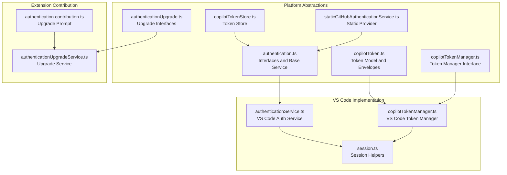
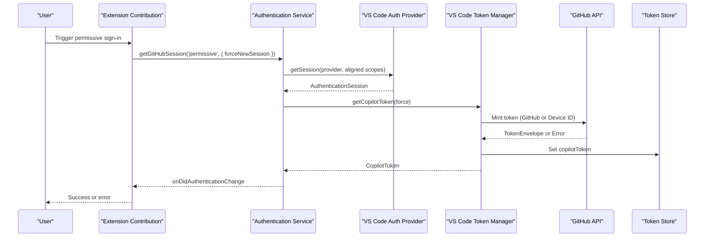
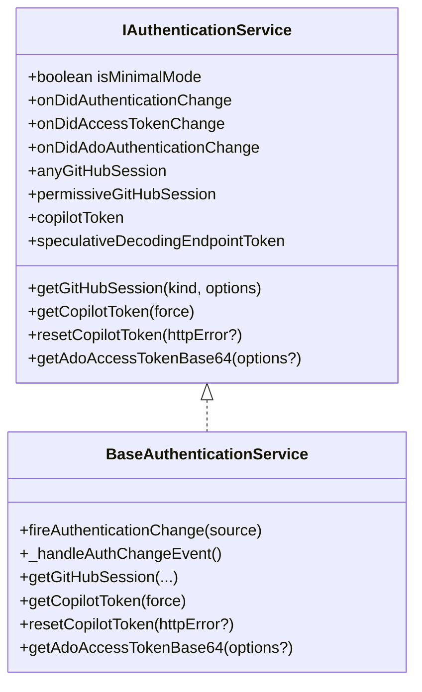
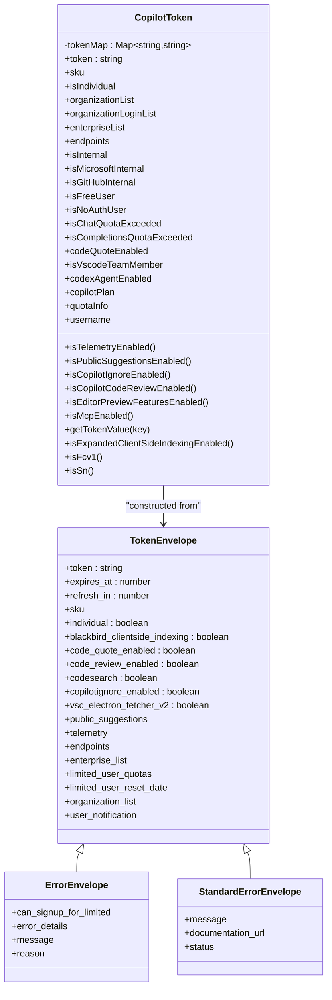
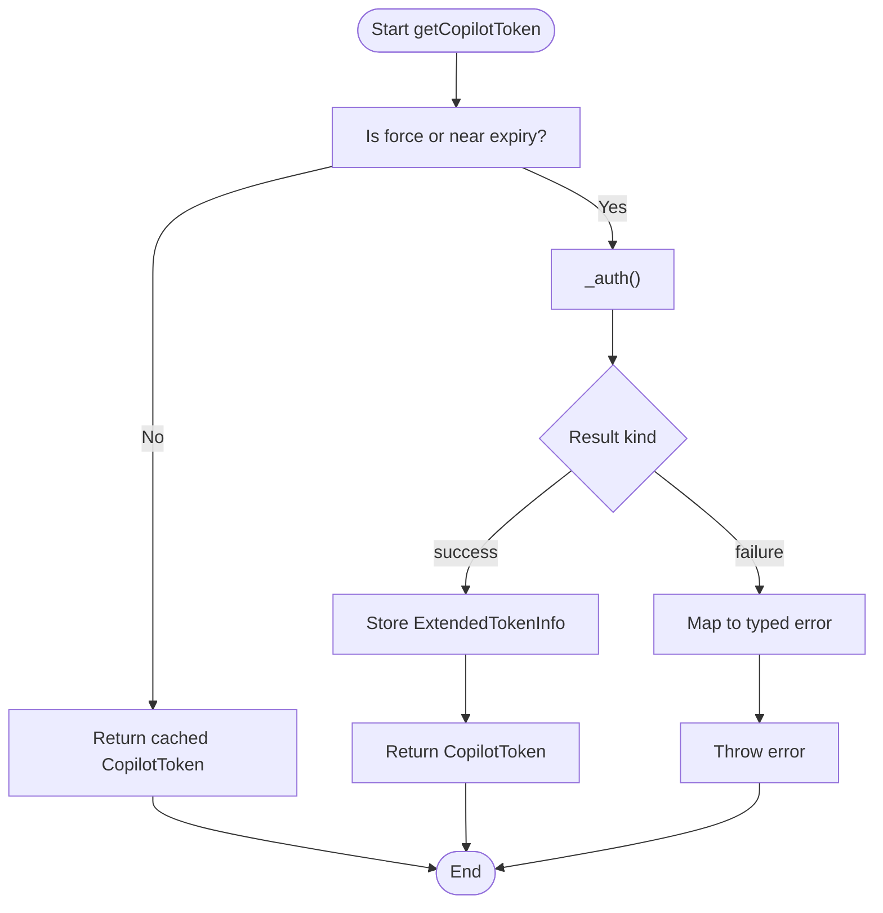
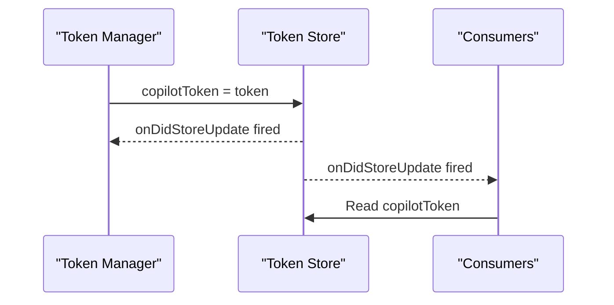
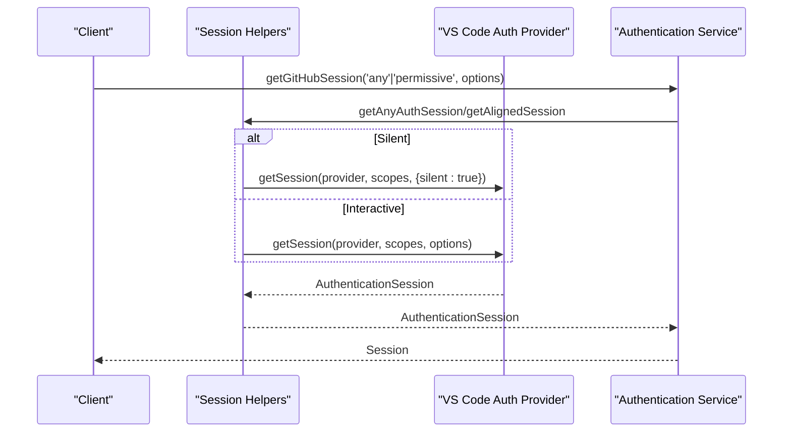
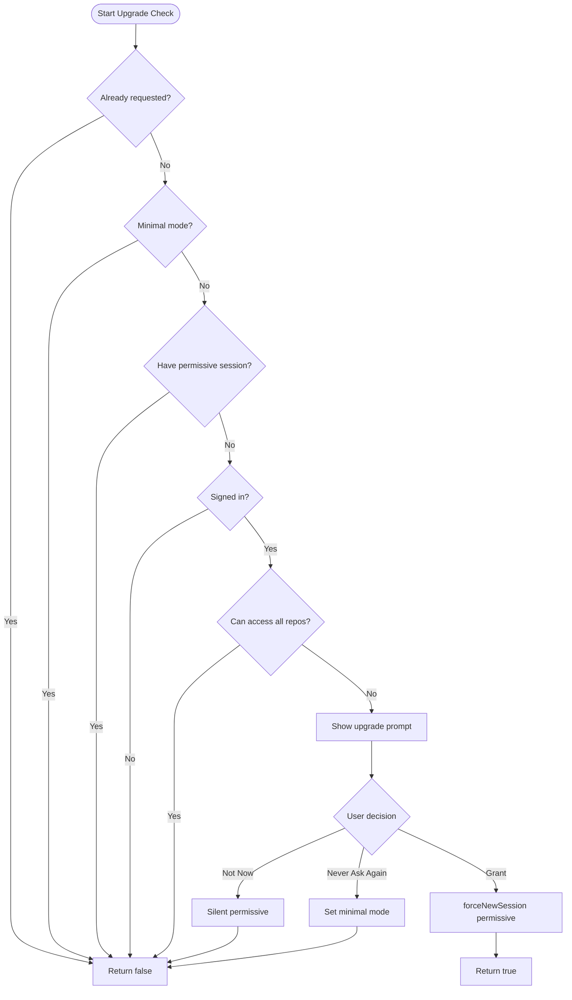
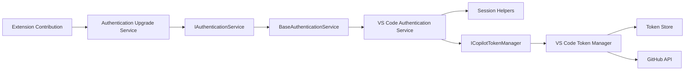

# Authentication API

<cite>
**Referenced Files in This Document**
- [authentication.ts](file://src/platform/authentication/common/authentication.ts)
- [copilotToken.ts](file://src/platform/authentication/common/copilotToken.ts)
- [copilotTokenManager.ts](file://src/platform/authentication/common/copilotTokenManager.ts)
- [copilotTokenStore.ts](file://src/platform/authentication/common/copilotTokenStore.ts)
- [staticGitHubAuthenticationService.ts](file://src/platform/authentication/common/staticGitHubAuthenticationService.ts)
- [authenticationService.ts](file://src/platform/authentication/vscode-node/authenticationService.ts)
- [copilotTokenManager.ts](file://src/platform/authentication/vscode-node/copilotTokenManager.ts)
- [session.ts](file://src/platform/authentication/vscode-node/session.ts)
- [authentication.contribution.ts](file://src/extension/authentication/vscode-node/authentication.contribution.ts)
- [authenticationUpgrade.ts](file://src/platform/authentication/common/authenticationUpgrade.ts)
- [authenticationUpgradeService.ts](file://src/platform/authentication/common/authenticationUpgradeService.ts)
</cite>

## Table of Contents
1. [Introduction](#introduction)
2. [Project Structure](#project-structure)
3. [Core Components](#core-components)
4. [Architecture Overview](#architecture-overview)
5. [Detailed Component Analysis](#detailed-component-analysis)
6. [Dependency Analysis](#dependency-analysis)
7. [Performance Considerations](#performance-considerations)
8. [Troubleshooting Guide](#troubleshooting-guide)
9. [Conclusion](#conclusion)
10. [Appendices](#appendices)

## Introduction
This document describes the authentication system used by VSCode Copilot Chat. It covers the authentication service interfaces, token management, and security protocols. It details the authentication flow from user initiation through token acquisition and validation, token lifecycle and refresh mechanisms, secure storage patterns, integration with GitHub authentication and anonymous access modes, permission management, and error handling strategies. The goal is to provide a clear, actionable guide for integrating and extending the authentication system.

## Project Structure
The authentication system is split into platform abstractions and VS Code-specific implementations:
- Platform abstractions define interfaces and core logic for authentication and token management.
- VS Code implementations integrate with the VS Code authentication provider and provide token minting and refresh logic.
- Extension contributions manage user prompts and upgrades for permissive sessions.

**Diagram sources**
- [authentication.ts](file://src/platform/authentication/common/authentication.ts#L32-L156)
- [copilotToken.ts](file://src/platform/authentication/common/copilotToken.ts#L67-L238)
- [copilotTokenManager.ts](file://src/platform/authentication/common/copilotTokenManager.ts#L10-L43)
- [copilotTokenStore.ts](file://src/platform/authentication/common/copilotTokenStore.ts#L11-L40)
- [staticGitHubAuthenticationService.ts](file://src/platform/authentication/common/staticGitHubAuthenticationService.ts#L14-L87)
- [authenticationService.ts](file://src/platform/authentication/vscode-node/authenticationService.ts#L16-L75)
- [copilotTokenManager.ts](file://src/platform/authentication/vscode-node/copilotTokenManager.ts#L32-L167)
- [session.ts](file://src/platform/authentication/vscode-node/session.ts#L25-L113)
- [authentication.contribution.ts](file://src/extension/authentication/vscode-node/authentication.contribution.ts#L17-L108)
- [authenticationUpgrade.ts](file://src/platform/authentication/common/authenticationUpgrade.ts#L11-L45)
- [authenticationUpgradeService.ts](file://src/platform/authentication/common/authenticationUpgradeService.ts#L21-L222)

**Section sources**
- [authentication.ts](file://src/platform/authentication/common/authentication.ts#L1-L341)
- [copilotToken.ts](file://src/platform/authentication/common/copilotToken.ts#L1-L615)
- [copilotTokenManager.ts](file://src/platform/authentication/common/copilotTokenManager.ts#L1-L60)
- [copilotTokenStore.ts](file://src/platform/authentication/common/copilotTokenStore.ts#L1-L41)
- [staticGitHubAuthenticationService.ts](file://src/platform/authentication/common/staticGitHubAuthenticationService.ts#L1-L88)
- [authenticationService.ts](file://src/platform/authentication/vscode-node/authenticationService.ts#L1-L76)
- [copilotTokenManager.ts](file://src/platform/authentication/vscode-node/copilotTokenManager.ts#L1-L168)
- [session.ts](file://src/platform/authentication/vscode-node/session.ts#L1-L120)
- [authentication.contribution.ts](file://src/extension/authentication/vscode-node/authentication.contribution.ts#L1-L109)
- [authenticationUpgrade.ts](file://src/platform/authentication/common/authenticationUpgrade.ts#L1-L46)
- [authenticationUpgradeService.ts](file://src/platform/authentication/common/authenticationUpgradeService.ts#L1-L223)

## Core Components
- Authentication Service Interface: Defines methods to obtain GitHub sessions (any and permissive), Copilot token retrieval and reset, and events for authentication changes. It supports minimal mode and Azure DevOps sessions.
- Token Model: Provides a structured representation of Copilot tokens, including SKU, quotas, organization lists, endpoints, and feature flags. Includes validators for strict and fallback schema validation.
- Token Manager: Retrieves and refreshes tokens, emitting refresh events and handling token resets on HTTP errors.
- Token Store: A simple store for the current Copilot token, emitting updates when the token changes.
- VS Code Authentication Service: Integrates with VS Code’s authentication provider, manages session acquisition and domain changes, and exposes permissive and any sessions.
- VS Code Token Manager: Implements token minting from GitHub or device ID, handles warnings and telemetry, and maps server errors to typed exceptions.
- Session Helpers: Utilities to fetch sessions with aligned scopes, handle minimal mode, and manage silent vs interactive flows.
- Static GitHub Authentication Service: A convenience provider for environments where a static token is supplied.
- Authentication Upgrade Service: Manages prompting users to grant permissive GitHub sessions, tracks decisions, and integrates with chat confirmations.

**Section sources**
- [authentication.ts](file://src/platform/authentication/common/authentication.ts#L32-L156)
- [copilotToken.ts](file://src/platform/authentication/common/copilotToken.ts#L67-L238)
- [copilotTokenManager.ts](file://src/platform/authentication/common/copilotTokenManager.ts#L10-L43)
- [copilotTokenStore.ts](file://src/platform/authentication/common/copilotTokenStore.ts#L11-L40)
- [authenticationService.ts](file://src/platform/authentication/vscode-node/authenticationService.ts#L16-L75)
- [copilotTokenManager.ts](file://src/platform/authentication/vscode-node/copilotTokenManager.ts#L32-L167)
- [session.ts](file://src/platform/authentication/vscode-node/session.ts#L25-L113)
- [staticGitHubAuthenticationService.ts](file://src/platform/authentication/common/staticGitHubAuthenticationService.ts#L14-L87)
- [authenticationUpgradeService.ts](file://src/platform/authentication/common/authenticationUpgradeService.ts#L21-L222)

## Architecture Overview
The authentication system follows a layered design:
- Platform layer defines interfaces and models.
- VS Code layer implements platform interfaces using VS Code APIs.
- Extension layer orchestrates user prompts and session upgrades.

**Diagram sources**
- [authentication.contribution.ts](file://src/extension/authentication/vscode-node/authentication.contribution.ts#L41-L107)
- [authentication.ts](file://src/platform/authentication/common/authentication.ts#L87-L112)
- [authenticationService.ts](file://src/platform/authentication/vscode-node/authenticationService.ts#L43-L59)
- [copilotTokenManager.ts](file://src/platform/authentication/vscode-node/copilotTokenManager.ts#L47-L101)
- [session.ts](file://src/platform/authentication/vscode-node/session.ts#L99-L113)
- [copilotTokenStore.ts](file://src/platform/authentication/common/copilotTokenStore.ts#L24-L40)

## Detailed Component Analysis

### Authentication Service Interfaces
- Purpose: Central contract for authentication operations, including session retrieval, token management, and event emission.
- Key methods:
  - getGitHubSession(kind, options): Obtain 'any' or 'permissive' GitHub sessions with support for silent, create-if-none, and force-new flows.
  - getCopilotToken(force): Retrieve a valid Copilot token, refreshing if needed.
  - resetCopilotToken(httpError?): Invalidate current token.
  - Events: onDidAuthenticationChange, onDidAccessTokenChange, onDidAdoAuthenticationChange.
- Minimal mode: When enabled, permissive sessions are unavailable via interactive flows and silent flows return undefined.

**Diagram sources**
- [authentication.ts](file://src/platform/authentication/common/authentication.ts#L32-L156)
- [authentication.ts](file://src/platform/authentication/common/authentication.ts#L158-L332)

**Section sources**
- [authentication.ts](file://src/platform/authentication/common/authentication.ts#L32-L156)
- [authentication.ts](file://src/platform/authentication/common/authentication.ts#L158-L332)

### Copilot Token Model and Validation
- Token model: Parses token fields into a map and exposes properties for SKU, quotas, organization lists, endpoints, and feature flags.
- Envelopes: TokenEnvelope (success), ErrorEnvelope (authorization failures), StandardErrorEnvelope (rate limits).
- Validation: Two-tier validation strategy validates against a strict schema and falls back to critical fields to maintain resilience.

**Diagram sources**
- [copilotToken.ts](file://src/platform/authentication/common/copilotToken.ts#L67-L238)
- [copilotToken.ts](file://src/platform/authentication/common/copilotToken.ts#L299-L345)
- [copilotToken.ts](file://src/platform/authentication/common/copilotToken.ts#L349-L368)

**Section sources**
- [copilotToken.ts](file://src/platform/authentication/common/copilotToken.ts#L67-L238)
- [copilotToken.ts](file://src/platform/authentication/common/copilotToken.ts#L299-L368)
- [copilotToken.ts](file://src/platform/authentication/common/copilotToken.ts#L449-L474)

### Token Management and Lifecycle
- Token Manager interface: Emits refresh events and provides getCopilotToken and resetCopilotToken.
- VS Code Token Manager:
  - Uses a task singler to serialize token minting attempts.
  - Determines whether to use GitHub session or device ID based on configuration and availability.
  - Handles warnings and telemetry for token retrieval outcomes.
  - Throws typed exceptions for common failure reasons (not authorized, HTTP 401, rate limited, etc.).

**Diagram sources**
- [copilotTokenManager.ts](file://src/platform/authentication/common/copilotTokenManager.ts#L10-L43)
- [copilotTokenManager.ts](file://src/platform/authentication/vscode-node/copilotTokenManager.ts#L47-L147)

**Section sources**
- [copilotTokenManager.ts](file://src/platform/authentication/common/copilotTokenManager.ts#L10-L43)
- [copilotTokenManager.ts](file://src/platform/authentication/vscode-node/copilotTokenManager.ts#L32-L167)

### Secure Storage Patterns
- Token Store: Holds the current Copilot token and emits updates when the token changes. Other services subscribe to onDidStoreUpdate to stay synchronized.
- Token lifecycle: Tokens are refreshed before expiry and reset on HTTP errors. The store ensures downstream consumers receive timely updates.

**Diagram sources**
- [copilotTokenStore.ts](file://src/platform/authentication/common/copilotTokenStore.ts#L24-L40)

**Section sources**
- [copilotTokenStore.ts](file://src/platform/authentication/common/copilotTokenStore.ts#L11-L40)

### GitHub Authentication Integration and Anonymous Access
- Session helpers:
  - getAnyAuthSession: Attempts aligned scopes first, then user email scopes, then read:user for backward compatibility.
  - getAlignedSession: Returns a session with aligned scopes; throws MinimalModeError in minimal mode for interactive flows.
- VS Code Authentication Service:
  - Subscribes to VS Code authentication changes and domain changes to trigger re-authentication.
  - Provides getAdoAccessTokenBase64 for Azure DevOps PATs.
- Static GitHub Authentication Service:
  - Supplies static sessions when a token provider is given; useful for testing or controlled environments.

**Diagram sources**
- [session.ts](file://src/platform/authentication/vscode-node/session.ts#L25-L90)
- [session.ts](file://src/platform/authentication/vscode-node/session.ts#L99-L113)
- [authenticationService.ts](file://src/platform/authentication/vscode-node/authenticationService.ts#L43-L69)

**Section sources**
- [session.ts](file://src/platform/authentication/vscode-node/session.ts#L25-L113)
- [authenticationService.ts](file://src/platform/authentication/vscode-node/authenticationService.ts#L16-L75)
- [staticGitHubAuthenticationService.ts](file://src/platform/authentication/common/staticGitHubAuthenticationService.ts#L14-L87)

### Permission Management and Upgrades
- Minimal mode: Disables permissive session acquisition in interactive flows.
- Upgrade service:
  - Determines if a permissive session is needed based on existing sessions, repository access, and user preferences.
  - Presents a modal or chat-based confirmation to upgrade permissions.
  - Persists user decisions (never ask again) and fires events on grant.

**Diagram sources**
- [authenticationUpgradeService.ts](file://src/platform/authentication/common/authenticationUpgradeService.ts#L52-L107)
- [authenticationUpgradeService.ts](file://src/platform/authentication/common/authenticationUpgradeService.ts#L109-L206)

**Section sources**
- [authenticationUpgrade.ts](file://src/platform/authentication/common/authenticationUpgrade.ts#L11-L45)
- [authenticationUpgradeService.ts](file://src/platform/authentication/common/authenticationUpgradeService.ts#L21-L222)
- [authentication.contribution.ts](file://src/extension/authentication/vscode-node/authentication.contribution.ts#L17-L108)

## Dependency Analysis
The authentication system exhibits clear separation of concerns:
- Platform abstractions decouple logic from VS Code specifics.
- VS Code implementations rely on VS Code authentication provider and domain services.
- Extension contributions orchestrate UX and upgrade flows.

**Diagram sources**
- [authentication.ts](file://src/platform/authentication/common/authentication.ts#L32-L156)
- [authenticationService.ts](file://src/platform/authentication/vscode-node/authenticationService.ts#L16-L75)
- [session.ts](file://src/platform/authentication/vscode-node/session.ts#L25-L113)
- [copilotTokenManager.ts](file://src/platform/authentication/common/copilotTokenManager.ts#L10-L43)
- [copilotTokenManager.ts](file://src/platform/authentication/vscode-node/copilotTokenManager.ts#L32-L167)
- [copilotTokenStore.ts](file://src/platform/authentication/common/copilotTokenStore.ts#L24-L40)
- [authentication.contribution.ts](file://src/extension/authentication/vscode-node/authentication.contribution.ts#L17-L108)
- [authenticationUpgradeService.ts](file://src/platform/authentication/common/authenticationUpgradeService.ts#L21-L222)

**Section sources**
- [authentication.ts](file://src/platform/authentication/common/authentication.ts#L32-L156)
- [authenticationService.ts](file://src/platform/authentication/vscode-node/authenticationService.ts#L16-L75)
- [copilotTokenManager.ts](file://src/platform/authentication/common/copilotTokenManager.ts#L10-L43)
- [copilotTokenManager.ts](file://src/platform/authentication/vscode-node/copilotTokenManager.ts#L32-L167)
- [copilotTokenStore.ts](file://src/platform/authentication/common/copilotTokenStore.ts#L11-L40)
- [authentication.contribution.ts](file://src/extension/authentication/vscode-node/authentication.contribution.ts#L17-L108)
- [authenticationUpgradeService.ts](file://src/platform/authentication/common/authenticationUpgradeService.ts#L21-L222)

## Performance Considerations
- Task singler: Both session and token minting use a task singler to serialize concurrent requests, reducing redundant work and avoiding race conditions.
- Silent sessions: Prefer silent acquisition to minimize UI interruptions; fall back to interactive flows only when necessary.
- Token refresh timing: Refresh tokens before expiry to avoid latency spikes; the token manager considers a 5-minute buffer.
- Event-driven updates: Use onDidAuthenticationChange and onDidStoreUpdate to propagate state changes efficiently without polling.

[No sources needed since this section provides general guidance]

## Troubleshooting Guide
Common issues and resolutions:
- GitHub login failed:
  - Symptom: No session available and anonymous access is disabled.
  - Resolution: Prompt the user to sign in via the VS Code accounts menu; the token manager records telemetry for this failure.
- HTTP 401 invalid token:
  - Symptom: Warning message instructing the user to sign out and sign in again.
  - Resolution: Clear cached session preference and retry; the system surfaces a warning once per session.
- Not authorized or subscription ended:
  - Symptom: Typed errors mapped to NotSignedUpError, SubscriptionExpiredError, or ContactSupportError.
  - Resolution: Present appropriate UI and guide users to resolve their subscription status.
- Rate limited:
  - Symptom: RateLimitedError thrown with guidance to retry later.
  - Resolution: Back off and retry; avoid repeated token requests.
- Minimal mode:
  - Symptom: Permissive session acquisition throws MinimalModeError in interactive flows.
  - Resolution: Advise users to adjust permissions or use 'any' scope for basic operations.

**Section sources**
- [copilotTokenManager.ts](file://src/platform/authentication/vscode-node/copilotTokenManager.ts#L103-L147)
- [authenticationService.ts](file://src/platform/authentication/vscode-node/authenticationService.ts#L27-L41)
- [session.ts](file://src/platform/authentication/vscode-node/session.ts#L100-L113)

## Conclusion
The authentication system provides a robust, extensible foundation for Copilot Chat. It cleanly separates platform logic from VS Code specifics, supports both GitHub and Azure DevOps authentication, and offers comprehensive token lifecycle management with secure storage and event-driven updates. The upgrade service and extension contribution ensure a smooth user experience while respecting user preferences and privacy.

[No sources needed since this section summarizes without analyzing specific files]

## Appendices

### API Reference Summary
- Authentication Service
  - Methods: getGitHubSession, getCopilotToken, resetCopilotToken, getAdoAccessTokenBase64
  - Events: onDidAuthenticationChange, onDidAccessTokenChange, onDidAdoAuthenticationChange
  - Properties: isMinimalMode, anyGitHubSession, permissiveGitHubSession, copilotToken
- Token Manager
  - Methods: getCopilotToken, resetCopilotToken
  - Events: onDidCopilotTokenRefresh
- Token Store
  - Properties: copilotToken, onDidStoreUpdate
- Token Model
  - Properties: token, sku, quotas, organization lists, endpoints, feature flags
  - Validation: strict and fallback schema validation

**Section sources**
- [authentication.ts](file://src/platform/authentication/common/authentication.ts#L32-L156)
- [copilotTokenManager.ts](file://src/platform/authentication/common/copilotTokenManager.ts#L10-L43)
- [copilotTokenStore.ts](file://src/platform/authentication/common/copilotTokenStore.ts#L11-L40)
- [copilotToken.ts](file://src/platform/authentication/common/copilotToken.ts#L67-L238)