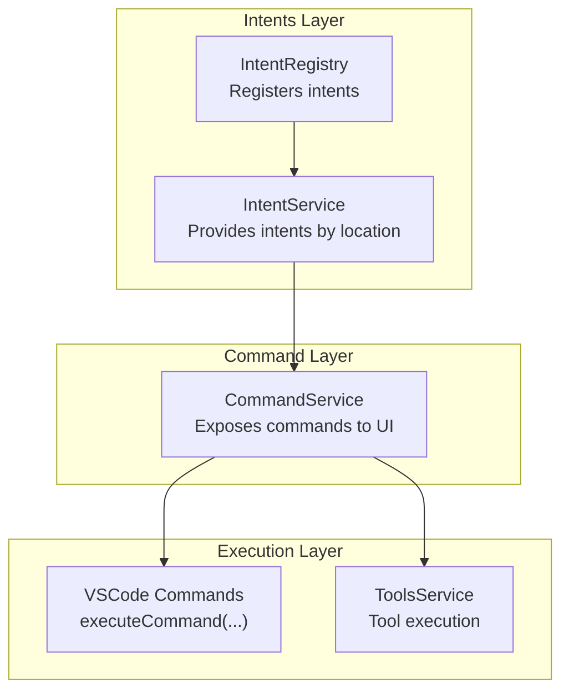
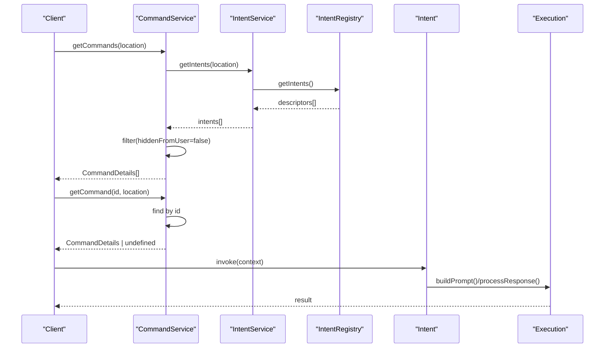
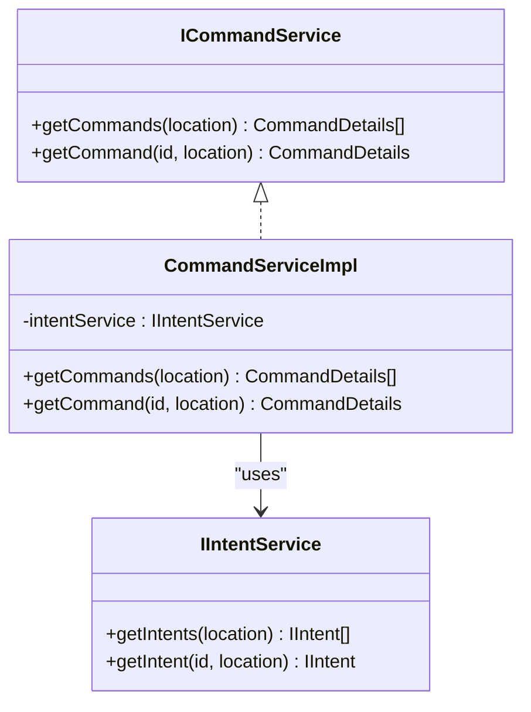
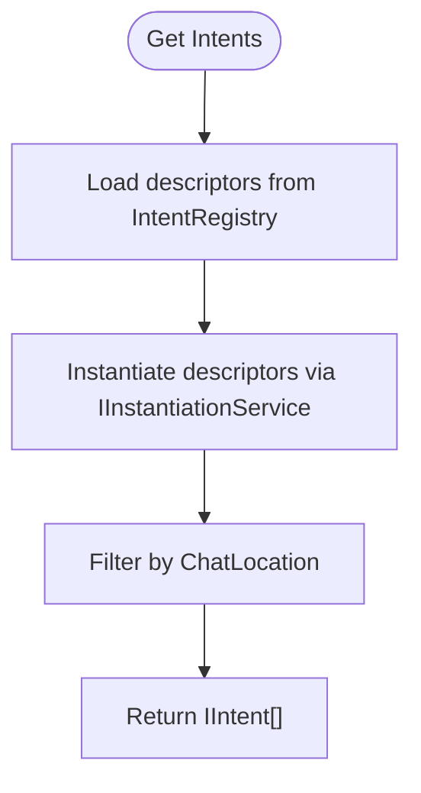
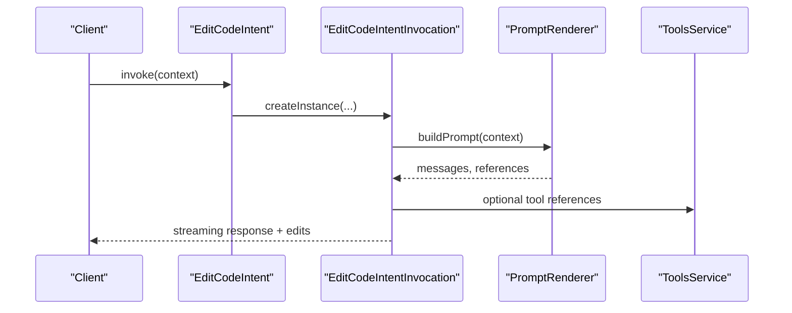
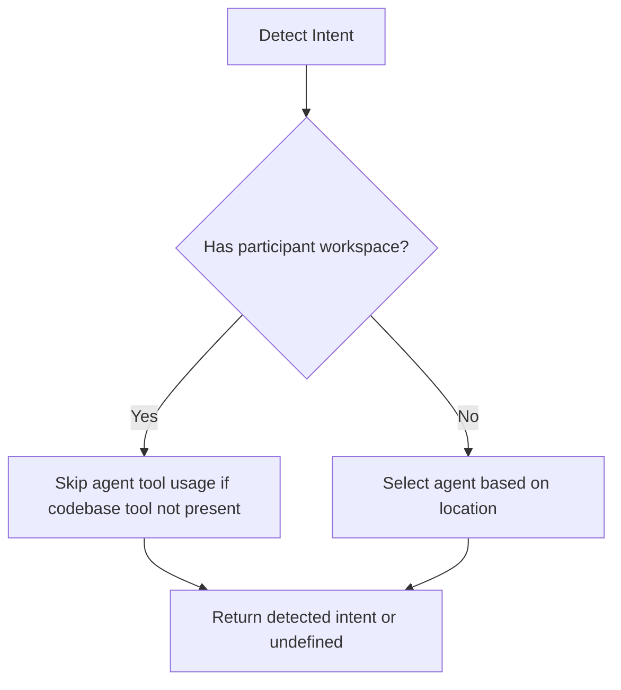
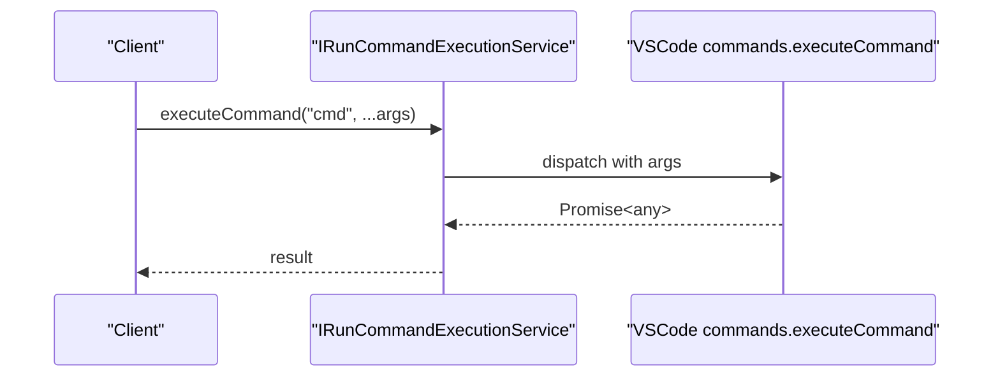
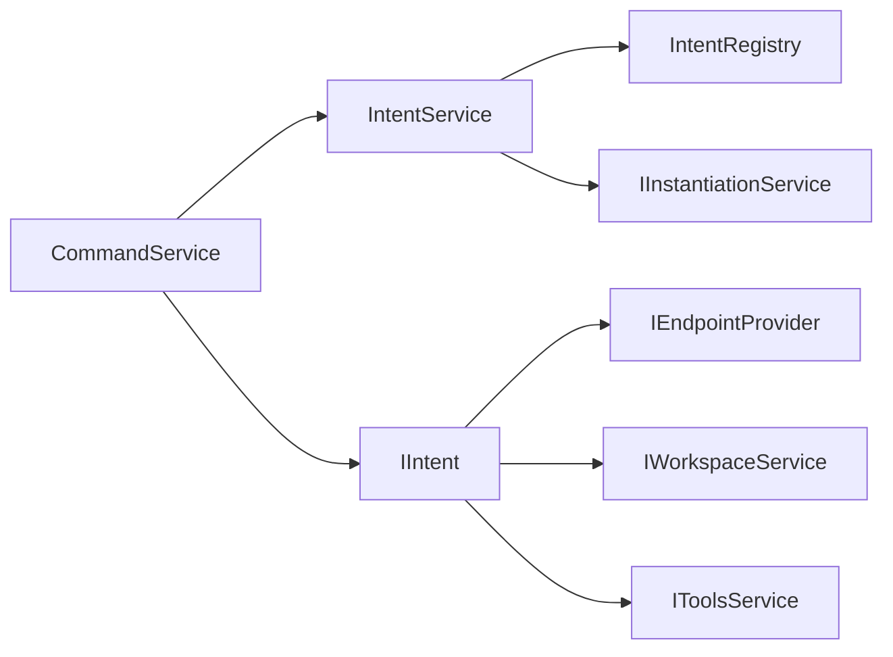

# Command API

<cite>
**Referenced Files in This Document**
- [commandService.ts](file://src/extension/commands/node/commandService.ts)
- [intentService.ts](file://src/extension/intents/node/intentService.ts)
- [intentRegistry.ts](file://src/extension/prompt/node/intentRegistry.ts)
- [editCodeIntent.ts](file://src/extension/intents/node/editCodeIntent.ts)
- [generateCodeIntent.ts](file://src/extension/intents/node/generateCodeIntent.ts)
- [explainIntent.ts](file://src/extension/intents/node/explainIntent.ts)
- [runCommandExecutionService.ts](file://src/platform/commands/common/runCommandExecutionService.ts)
- [vscode.d.ts](file://src/extension/vscode.d.ts)
- [switchAgentTool.ts](file://src/extension/tools/vscode-node/switchAgentTool.ts)
- [intentDetector.tsx](file://src/extension/prompts/node/intentDetector.tsx)
- [intent.ts](file://src/extension/intents/common/intents.ts)
</cite>

## Table of Contents
1. [Introduction](#introduction)
2. [Project Structure](#project-structure)
3. [Core Components](#core-components)
4. [Architecture Overview](#architecture-overview)
5. [Detailed Component Analysis](#detailed-component-analysis)
6. [Dependency Analysis](#dependency-analysis)
7. [Performance Considerations](#performance-considerations)
8. [Troubleshooting Guide](#troubleshooting-guide)
9. [Conclusion](#conclusion)

## Introduction
This document describes the Command API used by VSCode Copilot Chat. It focuses on the CommandService interface, command registration patterns, and execution mechanisms. It documents the command lifecycle from registration through execution, including parameter passing, context binding, and result handling. Built-in commands for chat operations, agent interactions, tool execution, and workspace management are covered, along with examples of custom command creation, command chaining, and asynchronous command patterns. Validation, error handling, and performance considerations are addressed, with guidelines for extending the command system and integrating with VSCode’s command palette and keybindings.

## Project Structure
The command system centers around three layers:
- Intent registry and service: define available commands and their lifecycles.
- Command service: exposes commands to clients and maps them to intents.
- Execution and tooling: integrates with VSCode commands and tools for runtime execution.

**Diagram sources**
- [intentRegistry.ts](file://src/extension/prompt/node/intentRegistry.ts#L19-L29)
- [intentService.ts](file://src/extension/intents/node/intentService.ts#L24-L57)
- [commandService.ts](file://src/extension/commands/node/commandService.ts#L19-L37)
- [runCommandExecutionService.ts](file://src/platform/commands/common/runCommandExecutionService.ts#L10-L13)

**Section sources**
- [intentRegistry.ts](file://src/extension/prompt/node/intentRegistry.ts#L1-L30)
- [intentService.ts](file://src/extension/intents/node/intentService.ts#L1-L58)
- [commandService.ts](file://src/extension/commands/node/commandService.ts#L1-L38)

## Core Components
- CommandService interface and implementation
  - Exposes commands filtered by location and hides user-facing commands marked as hidden.
  - Retrieves a single command by ID within a location.
- IntentService and IntentRegistry
  - IntentRegistry holds descriptors for intents; IntentService instantiates and filters intents by location.
- Intent implementations
  - EditCodeIntent, GenerateCodeIntent, ExplainIntent demonstrate intent invocation, prompt building, and response processing.
- VSCode command execution
  - The platform defines a service for executing commands asynchronously.
  - VSCode APIs enable registration and execution of commands from the palette and keybindings.

**Section sources**
- [commandService.ts](file://src/extension/commands/node/commandService.ts#L11-L37)
- [intentService.ts](file://src/extension/intents/node/intentService.ts#L14-L57)
- [intentRegistry.ts](file://src/extension/prompt/node/intentRegistry.ts#L11-L29)
- [runCommandExecutionService.ts](file://src/platform/commands/common/runCommandExecutionService.ts#L8-L13)
- [vscode.d.ts](file://src/extension/vscode.d.ts#L11131-L11154)

## Architecture Overview
The command system follows a layered architecture:
- Intents define capabilities and behaviors.
- CommandService aggregates intents into user-visible commands.
- Execution resolves commands to tools or VSCode commands.

**Diagram sources**
- [commandService.ts](file://src/extension/commands/node/commandService.ts#L28-L36)
- [intentService.ts](file://src/extension/intents/node/intentService.ts#L33-L56)
- [intentRegistry.ts](file://src/extension/prompt/node/intentRegistry.ts#L22-L28)
- [editCodeIntent.ts](file://src/extension/intents/node/editCodeIntent.ts#L179-L191)

## Detailed Component Analysis

### CommandService
- Purpose: Provide a filtered list of commands for a given chat location and resolve a specific command by ID.
- Key behaviors:
  - Filters out intents whose associated command info marks them as hidden from the user.
  - Maps intents to CommandDetails with commandId, description, locations, and optional toolEquivalent.
- Context binding: Uses ChatLocation to scope commands to Editor, Panel, or Notebook contexts.

**Diagram sources**
- [commandService.ts](file://src/extension/commands/node/commandService.ts#L11-L37)
- [intentService.ts](file://src/extension/intents/node/intentService.ts#L14-L31)

**Section sources**
- [commandService.ts](file://src/extension/commands/node/commandService.ts#L19-L37)

### IntentService and IntentRegistry
- IntentRegistry stores intent descriptors and exposes them for instantiation.
- IntentService lazily instantiates intents and filters them by location.
- Unknown intent retrieval ensures robust fallback behavior.

**Diagram sources**
- [intentRegistry.ts](file://src/extension/prompt/node/intentRegistry.ts#L19-L29)
- [intentService.ts](file://src/extension/intents/node/intentService.ts#L24-L56)

**Section sources**
- [intentRegistry.ts](file://src/extension/prompt/node/intentRegistry.ts#L19-L29)
- [intentService.ts](file://src/extension/intents/node/intentService.ts#L24-L57)

### Built-in Commands and Invocation Patterns

#### EditCodeIntent
- Purpose: Make changes to existing code in Editor, Panel, or Notebook.
- Invocation:
  - Panel/Notebook: creates a specialized invocation with working set and prompt building.
  - Editor: uses generic inline invocation with replace/insert strategies.
- Prompt building:
  - Integrates codebase references and optional command-specific details.
  - Optionally maps a command to a tool equivalent for token accounting.
- Response processing:
  - Streams markdown, extracts code blocks, maps edits, and applies confirmations.

**Diagram sources**
- [editCodeIntent.ts](file://src/extension/intents/node/editCodeIntent.ts#L179-L191)
- [editCodeIntent.ts](file://src/extension/intents/node/editCodeIntent.ts#L338-L421)
- [editCodeIntent.ts](file://src/extension/intents/node/editCodeIntent.ts#L507-L626)

**Section sources**
- [editCodeIntent.ts](file://src/extension/intents/node/editCodeIntent.ts#L81-L192)
- [editCodeIntent.ts](file://src/extension/intents/node/editCodeIntent.ts#L298-L421)
- [editCodeIntent.ts](file://src/extension/intents/node/editCodeIntent.ts#L507-L653)

#### GenerateCodeIntent
- Purpose: Generate new code in the Editor.
- Invocation:
  - Requires an open document; otherwise throws an error.
  - Forces insertion strategy for inline generation.

**Section sources**
- [generateCodeIntent.ts](file://src/extension/intents/node/generateCodeIntent.ts#L16-L39)

#### ExplainIntent
- Purpose: Explain code in the active editor or panel.
- Invocation:
  - Inline mode streams markdown replies.
  - Panel mode renders an explanation prompt with document context.

**Section sources**
- [explainIntent.ts](file://src/extension/intents/node/explainIntent.ts#L68-L90)
- [explainIntent.ts](file://src/extension/intents/node/explainIntent.ts#L25-L66)

### Command Registration and Discovery
- Command discovery:
  - CommandService derives commands from intents and filters hidden ones.
  - CommandDetails include locations and optional toolEquivalent mapping.
- Intent detection:
  - IntentDetector can override detected intents and influence agent selection based on available tools and configuration.

**Diagram sources**
- [intentDetector.tsx](file://src/extension/prompts/node/intentDetector.tsx#L87-L106)

**Section sources**
- [commandService.ts](file://src/extension/commands/node/commandService.ts#L28-L36)
- [intentRegistry.ts](file://src/extension/prompt/node/intentRegistry.ts#L11-L17)
- [intentDetector.tsx](file://src/extension/prompts/node/intentDetector.tsx#L87-L106)

### Execution Mechanisms
- VSCode command execution:
  - Platform provides a service to execute commands with arguments and await results.
  - VSCode APIs support registering commands for palette and keybindings.
- Tool execution:
  - ToolsService validates inputs and routes to tool handlers.
  - Example: SwitchAgentTool executes a VSCode command to toggle agent mode and returns a tool result.

**Diagram sources**
- [runCommandExecutionService.ts](file://src/platform/commands/common/runCommandExecutionService.ts#L10-L13)
- [vscode.d.ts](file://src/extension/vscode.d.ts#L11131-L11154)

**Section sources**
- [runCommandExecutionService.ts](file://src/platform/commands/common/runCommandExecutionService.ts#L8-L13)
- [vscode.d.ts](file://src/extension/vscode.d.ts#L11131-L11154)
- [switchAgentTool.ts](file://src/extension/tools/vscode-node/switchAgentTool.ts#L31-L39)

### Parameter Passing, Context Binding, and Result Handling
- Parameter passing:
  - Commands can carry arguments via CommandDetails or tool inputs validated by ToolsService.
- Context binding:
  - Intents bind ChatLocation, endpoint, and request context to invocations.
  - Prompt builders receive chat variables, references, and working sets.
- Result handling:
  - EditCodeIntentInvocation streams markdown, emits confirmations, and applies edits.
  - Tool results return structured LanguageModelToolResult payloads.

**Section sources**
- [intentRegistry.ts](file://src/extension/prompt/node/intentRegistry.ts#L11-L17)
- [editCodeIntent.ts](file://src/extension/intents/node/editCodeIntent.ts#L338-L421)
- [editCodeIntent.ts](file://src/extension/intents/node/editCodeIntent.ts#L507-L626)
- [switchAgentTool.ts](file://src/extension/tools/vscode-node/switchAgentTool.ts#L41-L52)

### Examples

#### Custom Command Creation
- Define a new intent by implementing IIntent and registering it via IntentRegistry.
- Provide an invoke method that returns an IIntentInvocation tailored to the desired behavior (e.g., inline or panel).
- Optionally expose a commandInfo to control visibility and integrate with CommandService.

**Section sources**
- [intentRegistry.ts](file://src/extension/prompt/node/intentRegistry.ts#L22-L28)
- [intentService.ts](file://src/extension/intents/node/intentService.ts#L33-L38)
- [intent.ts](file://src/extension/intents/common/intents.ts#L11-L27)

#### Command Chaining
- Chain commands by composing intents that produce tool references and prompt references.
- EditCodeIntent merges codebase metadata and tool call results to avoid redundant tool calls.

**Section sources**
- [editCodeIntent.ts](file://src/extension/intents/node/editCodeIntent.ts#L410-L421)
- [editCodeIntent.ts](file://src/extension/intents/node/editCodeIntent.ts#L449-L453)

#### Asynchronous Command Patterns
- Use IRunCommandExecutionService to execute commands asynchronously and await results.
- Stream response parts and handle cancellations gracefully in intent invocations.

**Section sources**
- [runCommandExecutionService.ts](file://src/platform/commands/common/runCommandExecutionService.ts#L10-L13)
- [editCodeIntent.ts](file://src/extension/intents/node/editCodeIntent.ts#L507-L626)

## Dependency Analysis
- CommandService depends on IntentService to enumerate and filter intents.
- IntentService depends on IntentRegistry and IInstantiationService to construct intent instances.
- Intents depend on endpoints, tools, and workspace services for prompt building and response processing.
- Execution relies on VSCode commands and tool services.

**Diagram sources**
- [commandService.ts](file://src/extension/commands/node/commandService.ts#L24-L26)
- [intentService.ts](file://src/extension/intents/node/intentService.ts#L29-L31)
- [intentRegistry.ts](file://src/extension/prompt/node/intentRegistry.ts#L22-L28)
- [editCodeIntent.ts](file://src/extension/intents/node/editCodeIntent.ts#L314-L332)

**Section sources**
- [commandService.ts](file://src/extension/commands/node/commandService.ts#L19-L37)
- [intentService.ts](file://src/extension/intents/node/intentService.ts#L24-L57)
- [intentRegistry.ts](file://src/extension/prompt/node/intentRegistry.ts#L19-L29)
- [editCodeIntent.ts](file://src/extension/intents/node/editCodeIntent.ts#L314-L332)

## Performance Considerations
- Token accounting:
  - EditCodeIntent adjusts endpoint token limits when tools are present to mitigate token counting overhead.
- Prompt rendering:
  - Telemetry tracks prompt render durations to understand performance characteristics.
- Streaming:
  - Streaming markdown and code blocks reduces latency and improves responsiveness during long-running operations.

**Section sources**
- [editCodeIntent.ts](file://src/extension/intents/node/editCodeIntent.ts#L366-L368)
- [editCodeIntent.ts](file://src/extension/intents/node/editCodeIntent.ts#L423-L437)

## Troubleshooting Guide
- Command not visible in UI:
  - Verify the intent’s commandInfo does not mark hiddenFromUser as true.
- Command not executing:
  - Ensure the intent is registered via IntentRegistry and instantiated by IntentService.
  - Confirm the command’s location matches the ChatLocation of the current context.
- Tool validation errors:
  - ToolsService validates inputs and returns structured error messages; inspect validation results and adjust input schemas accordingly.
- Agent switching failures:
  - SwitchAgentTool restricts supported agents; ensure the requested agent is supported before invoking.

**Section sources**
- [commandService.ts](file://src/extension/commands/node/commandService.ts#L30-L31)
- [intentService.ts](file://src/extension/intents/node/intentService.ts#L40-L47)
- [intentRegistry.ts](file://src/extension/prompt/node/intentRegistry.ts#L22-L28)
- [switchAgentTool.ts](file://src/extension/tools/vscode-node/switchAgentTool.ts#L44-L46)

## Conclusion
The Command API in VSCode Copilot Chat is centered on intents and commands, with a clear separation between discovery (CommandService), lifecycle management (IntentService), and execution (VSCode commands and tools). By registering intents, exposing filtered commands, and leveraging streaming and validation, the system supports robust chat-driven workflows across Editor, Panel, and Notebook contexts. Extending the system involves adding new intents, integrating tool equivalents, and ensuring proper context binding and result handling.