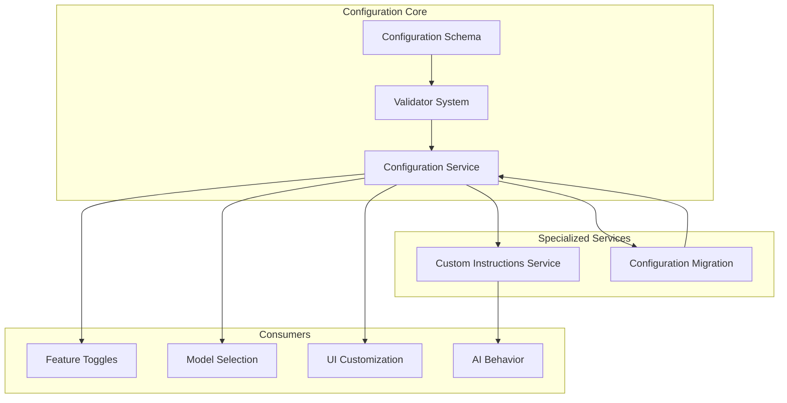
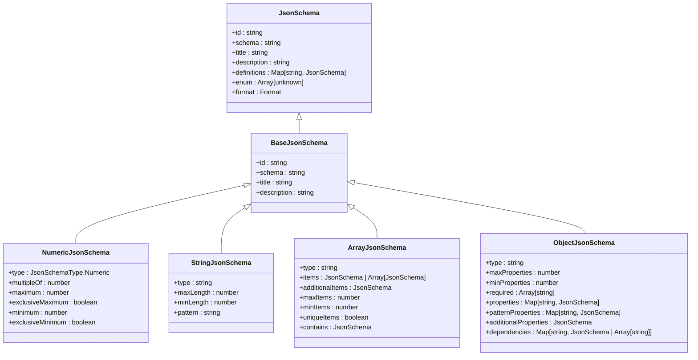
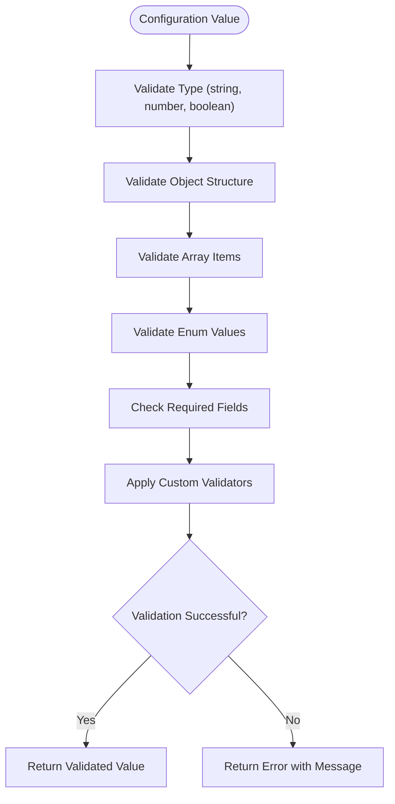
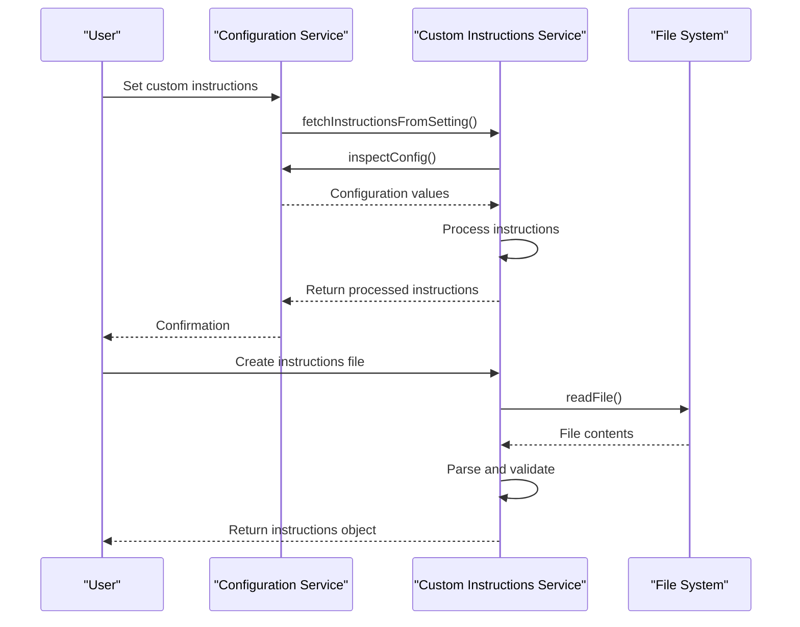
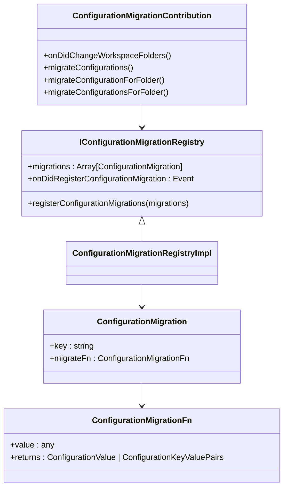
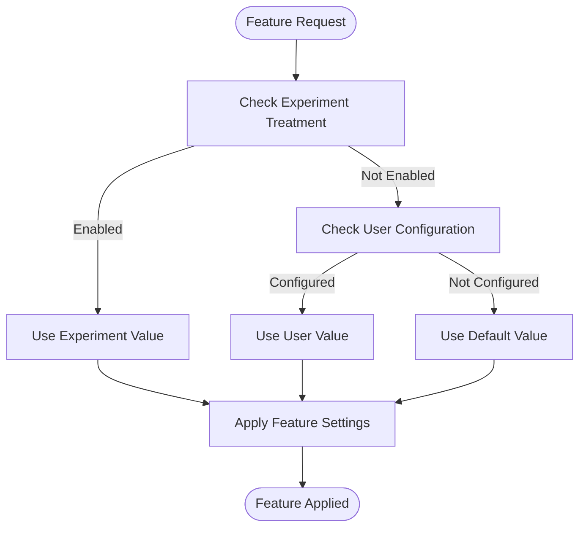
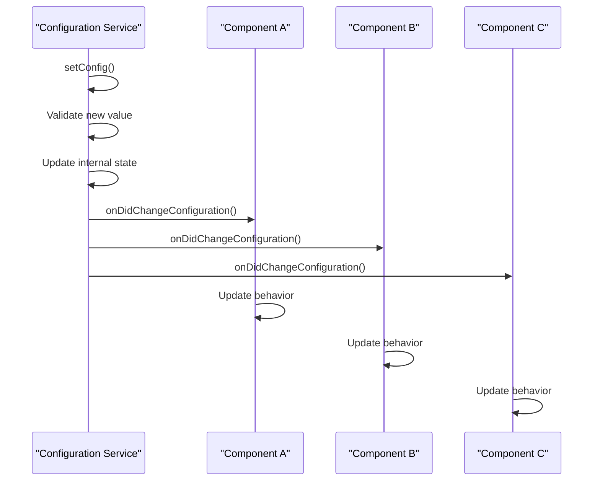
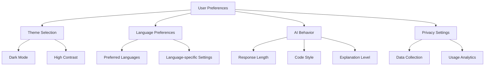

# Configuration APIs

<cite>
**Referenced Files in This Document**   
- [configurationService.ts](file://src/platform/configuration/common/configurationService.ts)
- [customInstructionsService.ts](file://src/platform/customInstructions/common/customInstructionsService.ts)
- [configurationMigration.ts](file://src/extension/configuration/vscode-node/configurationMigration.ts)
- [jsonSchema.ts](file://src/platform/configuration/common/jsonSchema.ts)
- [validator.ts](file://src/platform/configuration/common/validator.ts)
- [configurationServiceImpl.ts](file://src/platform/configuration/vscode/configurationServiceImpl.ts)
</cite>

## Table of Contents
1. [Introduction](#introduction)
2. [Configuration Architecture Overview](#configuration-architecture-overview)
3. [Configuration Schema and Validation](#configuration-schema-and-validation)
4. [Custom Instructions Service](#custom-instructions-service)
5. [Configuration Migration System](#configuration-migration-system)
6. [Configuration API Endpoints](#configuration-api-endpoints)
7. [Feature Toggles and Model Selection](#feature-toggles-and-model-selection)
8. [Configuration Change Propagation](#configuration-change-propagation)
9. [Security and Synchronization](#security-and-synchronization)
10. [Common Configuration Patterns](#common-configuration-patterns)

## Introduction

The GitHub Copilot Chat configuration system provides a comprehensive API for managing user preferences and settings. This documentation details the architecture, APIs, and mechanisms that enable personalized AI behavior, feature toggles, model selection, and UI customization. The system is designed to handle configuration changes across extension versions through a robust migration framework, ensuring backward compatibility and smooth transitions for users.

The configuration APIs are built on a layered architecture that separates concerns between configuration definition, validation, storage, and consumption. This design enables both internal components and potential external integrations to access and modify configuration settings in a consistent and secure manner.

## Configuration Architecture Overview

The configuration system in GitHub Copilot Chat follows a service-oriented architecture with clear separation of concerns. The core components include the configuration service, custom instructions service, and configuration migration system, all working together to provide a seamless user experience.



**Diagram sources**
- [configurationService.ts](file://src/platform/configuration/common/configurationService.ts)
- [customInstructionsService.ts](file://src/platform/customInstructions/common/customInstructionsService.ts)
- [configurationMigration.ts](file://src/extension/configuration/vscode-node/configurationMigration.ts)

**Section sources**
- [configurationService.ts](file://src/platform/configuration/common/configurationService.ts)
- [customInstructionsService.ts](file://src/platform/customInstructions/common/customInstructionsService.ts)

## Configuration Schema and Validation

The configuration system employs a robust schema and validation mechanism to ensure settings integrity. The schema is defined using JSON Schema standards with custom extensions for Copilot-specific requirements.

### Schema Definition

The configuration schema is implemented in the `jsonSchema.ts` file, which defines the structure for all configuration settings. The schema supports various data types including numeric, string, array, and object types, with comprehensive validation rules.



**Diagram sources**
- [jsonSchema.ts](file://src/platform/configuration/common/jsonSchema.ts)

### Validation System

The validation system ensures that all configuration values adhere to their defined schema. The validator implementation provides type-safe validation with detailed error reporting.



**Diagram sources**
- [validator.ts](file://src/platform/configuration/common/validator.ts)

**Section sources**
- [jsonSchema.ts](file://src/platform/configuration/common/jsonSchema.ts)
- [validator.ts](file://src/platform/configuration/common/validator.ts)

## Custom Instructions Service

The Custom Instructions Service allows users to personalize AI behavior by providing custom instructions that influence the AI's responses and code generation capabilities.

### Service Architecture

The custom instructions service is implemented as a standalone service that can fetch instructions from multiple sources, including user settings and external files.



**Diagram sources**
- [customInstructionsService.ts](file://src/platform/customInstructions/common/customInstructionsService.ts)

### Instruction Types and Sources

The service supports multiple types of instructions and can retrieve them from various sources:

- **Setting-based instructions**: Stored in user settings and managed through the configuration API
- **File-based instructions**: Stored in external files with `.instructions.md` extension
- **Extension-provided instructions**: Contributed by extensions through the `chatInstructions` contribution point

The service also implements a sophisticated resolution mechanism that handles instruction priority, deduplication, and file path resolution.

**Section sources**
- [customInstructionsService.ts](file://src/platform/customInstructions/common/customInstructionsService.ts)

## Configuration Migration System

The configuration migration system handles changes to configuration settings across extension versions, ensuring backward compatibility and smooth transitions for users.

### Migration Architecture

The migration system is designed to automatically handle configuration changes when users upgrade to new versions of the extension. It uses a registry pattern to manage migration functions for specific configuration keys.



**Diagram sources**
- [configurationMigration.ts](file://src/extension/configuration/vscode-node/configurationMigration.ts)

### Migration Process

The migration process follows these steps:

1. **Registration**: Migration functions are registered for specific configuration keys
2. **Detection**: The system detects when a configuration key needs to be migrated
3. **Execution**: The migration function is executed to transform the old value to the new format
4. **Update**: The configuration is updated with the new value and the old key is removed
5. **Notification**: The change is propagated through the configuration change event system

The system handles migrations for workspace, user, and folder-level configurations, ensuring consistency across all scopes.

**Section sources**
- [configurationMigration.ts](file://src/extension/configuration/vscode-node/configurationMigration.ts)

## Configuration API Endpoints

The configuration API provides a comprehensive set of endpoints for accessing and modifying configuration settings.

### Core API Endpoints

The main configuration service interface provides the following endpoints:

```typescript
interface IConfigurationService {
    getConfig<T>(key: Config<T>, scope?: ConfigurationScope): T;
    getConfigObservable<T>(key: Config<T>): IObservable<T>;
    inspectConfig<T>(key: BaseConfig<T>, scope?: ConfigurationScope): InspectConfigResult<T> | undefined;
    isConfigured<T>(key: BaseConfig<T>, scope?: ConfigurationScope): boolean;
    getNonExtensionConfig<T>(configKey: string): T | undefined;
    setConfig<T>(key: BaseConfig<T>, value: T): Thenable<void>;
    getExperimentBasedConfig<T extends ExperimentBasedConfigType>(key: ExperimentBasedConfig<T>, experimentationService: IExperimentationService, scope?: ConfigurationScope): T;
    getExperimentBasedConfigObservable<T extends ExperimentBasedConfigType>(key: ExperimentBasedConfig<T>, experimentationService: IExperimentationService): IObservable<T>;
    getConfigMixedWithDefaults<T>(key: Config<T>): T;
    getDefaultValue<T>(key: Config<T>): T;
    onDidChangeConfiguration: Event<ConfigurationChangeEvent>;
    updateExperimentBasedConfiguration(treatments: string[]): void;
    dumpConfig(): { [key: string]: string };
}
```

### Configuration Key Types

The system supports two main types of configuration keys:

- **Simple Config**: Standard configuration settings with a fixed default value
- **ExperimentBasedConfig**: Configuration settings that can be controlled through experimentation frameworks

The API also supports advanced configuration options such as internal settings, team-specific defaults, and rollout percentages for gradual feature releases.

**Section sources**
- [configurationService.ts](file://src/platform/configuration/common/configurationService.ts)

## Feature Toggles and Model Selection

The configuration system provides extensive support for feature toggles and model selection, enabling fine-grained control over AI capabilities.

### Feature Toggle Management

Feature toggles are implemented using the experiment-based configuration system, allowing for controlled rollouts and A/B testing:



**Diagram sources**
- [configurationService.ts](file://src/platform/configuration/common/configurationService.ts)

### Model Selection

The system supports multiple AI models with configurable selection:

- **GPT-4 variants**: Including GPT-4.1, GPT-4o-mini, and specialized variants
- **Claude models**: Claude-3.5-sonnet and Claude-3.7-sonnet
- **Gemini models**: Gemini 2.5-pro, Gemini 2.0-pro, and Gemini Flash
- **Specialized models**: For specific tasks like code generation, debugging, and testing

Model selection can be controlled through configuration settings, allowing users to choose their preferred model or let the system automatically select the best model for each task.

**Section sources**
- [configurationService.ts](file://src/platform/configuration/common/configurationService.ts)

## Configuration Change Propagation

The configuration system implements a robust change propagation mechanism that ensures all components are notified of configuration changes.

### Event System

The system uses an event-driven architecture to propagate configuration changes:



**Diagram sources**
- [configurationServiceImpl.ts](file://src/platform/configuration/vscode/configurationServiceImpl.ts)

### Observable Pattern

For components that need to react to configuration changes, the system provides observable patterns:

- **getConfigObservable**: Returns an observable that emits the current configuration value and updates when the configuration changes
- **getExperimentBasedConfigObservable**: Similar to getConfigObservable but for experiment-based configurations
- **onDidChangeConfiguration**: Event that fires when any configuration changes, with a predicate to check if a specific configuration is affected

This pattern enables efficient reactivity without requiring components to poll for configuration changes.

**Section sources**
- [configurationService.ts](file://src/platform/configuration/common/configurationService.ts)
- [configurationServiceImpl.ts](file://src/platform/configuration/vscode/configurationServiceImpl.ts)

## Security and Synchronization

The configuration system implements several security measures to protect sensitive data and ensure proper synchronization across devices.

### Security Considerations

The system includes the following security features:

- **Internal-only settings**: Configuration options that are only available to internal users and team members
- **Value restriction**: Settings that are ignored for external users to prevent configuration of internal features
- **Team-specific defaults**: Different default values for team members and internal users with controlled rollout percentages
- **Sensitive data filtering**: Automatic filtering of sensitive configuration values (e.g., secret keys) when dumping configuration

### Synchronization Across Devices

While the current implementation primarily focuses on local configuration, the architecture supports potential future synchronization features:

- **Configuration scope management**: Support for global, workspace, and folder-level configurations that can be synchronized
- **Portable configuration format**: JSON-based configuration that can be easily transferred between devices
- **Extension contribution points**: Mechanism for extensions to contribute configuration that can be synchronized

The system is designed to work with VS Code's existing settings sync capabilities, allowing user preferences to be synchronized across devices when enabled.

**Section sources**
- [configurationService.ts](file://src/platform/configuration/common/configurationService.ts)
- [customInstructionsService.ts](file://src/platform/customInstructions/common/customInstructionsService.ts)

## Common Configuration Patterns

The configuration system supports several common patterns for managing user preferences and AI behavior.

### Configuration Patterns

#### User Preferences Pattern


**Diagram sources**
- [configurationService.ts](file://src/platform/configuration/common/configurationService.ts)

#### AI Behavior Customization
The system allows extensive customization of AI behavior through various configuration options:

- **Code generation instructions**: Custom instructions for code generation tasks
- **Test generation instructions**: Specific guidance for test generation
- **Commit message generation**: Instructions for generating commit messages
- **Pull request descriptions**: Guidance for creating pull request descriptions

These instructions can be provided through settings or external files, allowing users to create comprehensive style guides for the AI.

#### Advanced Configuration
The system supports advanced configuration patterns for power users and developers:

- **Experimental features**: Access to beta features through experiment-based configurations
- **Debug settings**: Internal settings for troubleshooting and development
- **Performance tuning**: Configuration options for optimizing AI performance
- **Integration settings**: Configuration for third-party service integrations

**Section sources**
- [configurationService.ts](file://src/platform/configuration/common/configurationService.ts)
- [customInstructionsService.ts](file://src/platform/customInstructions/common/customInstructionsService.ts)