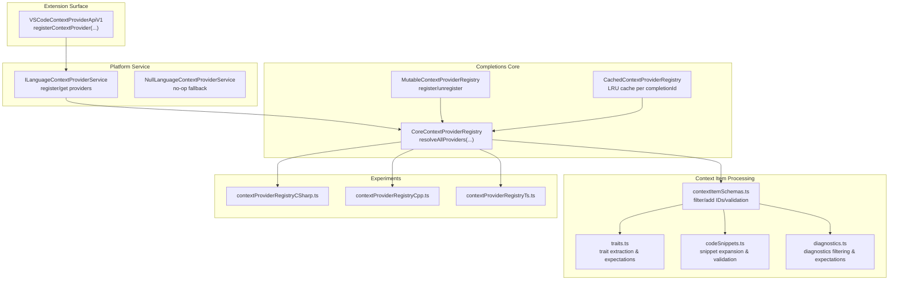
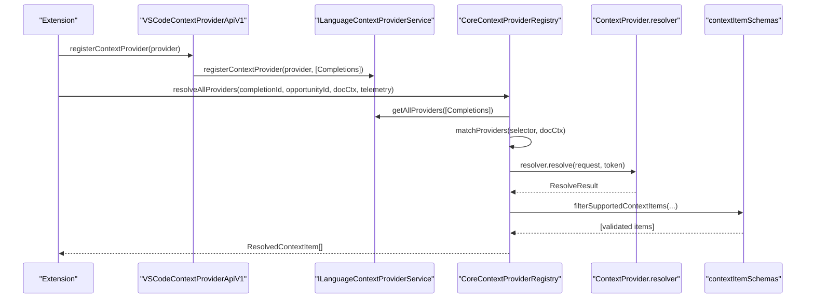
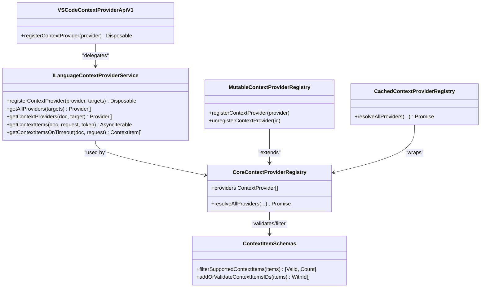

# Context Provider API

<cite>
**Referenced Files in This Document**
- [vscodeContextProviderApi.ts](file://src/extension/api/vscode/vscodeContextProviderApi.ts)
- [languageContextProviderService.ts](file://src/platform/languageContextProvider/common/languageContextProviderService.ts)
- [nullLanguageContextProviderService.ts](file://src/platform/languageContextProvider/common/nullLanguageContextProviderService.ts)
- [contextProviderRegistry.ts](file://src/extension/completions-core/vscode-node/lib/src/prompt/contextProviderRegistry.ts)
- [contextItemSchemas.ts](file://src/extension/completions-core/vscode-node/lib/src/prompt/contextProviders/contextItemSchemas.ts)
- [traits.ts](file://src/extension/completions-core/vscode-node/lib/src/prompt/contextProviders/traits.ts)
- [codeSnippets.ts](file://src/extension/completions-core/vscode-node/lib/src/prompt/contextProviders/codeSnippets.ts)
- [diagnostics.ts](file://src/extension/completions-core/vscode-node/lib/src/prompt/contextProviders/diagnostics.ts)
- [contextProviderRegistryCSharp.ts](file://src/extension/completions-core/vscode-node/lib/src/prompt/contextProviderRegistryCSharp.ts)
- [contextProviderRegistryCpp.ts](file://src/extension/completions-core/vscode-node/lib/src/prompt/contextProviderRegistryCpp.ts)
- [contextProviderRegistryTs.ts](file://src/extension/completions-core/vscode-node/lib/src/prompt/contextProviderRegistryTs.ts)
</cite>

## Table of Contents
1. [Introduction](#introduction)
2. [Project Structure](#project-structure)
3. [Core Components](#core-components)
4. [Architecture Overview](#architecture-overview)
5. [Detailed Component Analysis](#detailed-component-analysis)
6. [Dependency Analysis](#dependency-analysis)
7. [Performance Considerations](#performance-considerations)
8. [Troubleshooting Guide](#troubleshooting-guide)
9. [Conclusion](#conclusion)
10. [Appendices](#appendices)

## Introduction
This document describes the Context Provider API used by VSCode Copilot Chat. It explains the interfaces, registration mechanisms, and data flow patterns for collecting contextual information during code completion. It covers how to implement custom context providers for workspace information, file context, project metadata, and custom data sources. It also documents the context collection lifecycle, priority and matching systems, conflict and validation strategies, performance optimization, caching, real-time updates, and testing and debugging guidelines.

## Project Structure
The Context Provider system spans several layers:
- Extension API surface for registering providers
- Platform service abstraction for provider lifecycle and selection
- Completions core registry for orchestration, matching, timeouts, and caching
- Context item schemas and transformers for validation and enrichment
- Language-specific experiment integrations

**Diagram sources**
- [vscodeContextProviderApi.ts](file://src/extension/api/vscode/vscodeContextProviderApi.ts#L11-L21)
- [languageContextProviderService.ts](file://src/platform/languageContextProvider/common/languageContextProviderService.ts#L11-L30)
- [nullLanguageContextProviderService.ts](file://src/platform/languageContextProvider/common/nullLanguageContextProviderService.ts#L12-L38)
- [contextProviderRegistry.ts](file://src/extension/completions-core/vscode-node/lib/src/prompt/contextProviderRegistry.ts#L109-L337)
- [contextItemSchemas.ts](file://src/extension/completions-core/vscode-node/lib/src/prompt/contextProviders/contextItemSchemas.ts#L119-L201)
- [traits.ts](file://src/extension/completions-core/vscode-node/lib/src/prompt/contextProviders/traits.ts#L13-L29)
- [codeSnippets.ts](file://src/extension/completions-core/vscode-node/lib/src/prompt/contextProviders/codeSnippets.ts#L20-L68)
- [diagnostics.ts](file://src/extension/completions-core/vscode-node/lib/src/prompt/contextProviders/diagnostics.ts#L15-L69)
- [contextProviderRegistryCSharp.ts](file://src/extension/completions-core/vscode-node/lib/src/prompt/contextProviderRegistryCSharp.ts#L16-L39)
- [contextProviderRegistryCpp.ts](file://src/extension/completions-core/vscode-node/lib/src/prompt/contextProviderRegistryCpp.ts#L26-L62)
- [contextProviderRegistryTs.ts](file://src/extension/completions-core/vscode-node/lib/src/prompt/contextProviderRegistryTs.ts#L18-L49)

**Section sources**
- [vscodeContextProviderApi.ts](file://src/extension/api/vscode/vscodeContextProviderApi.ts#L11-L21)
- [languageContextProviderService.ts](file://src/platform/languageContextProvider/common/languageContextProviderService.ts#L11-L30)
- [contextProviderRegistry.ts](file://src/extension/completions-core/vscode-node/lib/src/prompt/contextProviderRegistry.ts#L109-L337)

## Core Components
- VSCode Context Provider API v1: Provides a thin wrapper around the platform service to register providers targeting the Completions subsystem.
- Language Context Provider Service: Defines the contract for registering, discovering, and resolving context providers for a given document and target.
- Core Registry: Orchestrates provider matching, timeout budgeting, cancellation, fallback resolution, schema validation, and statistics.
- Mutable Registry: Extends the core registry to support dynamic registration and unregistration.
- Cached Registry: Adds LRU caching keyed by completionId to reuse results within a single completion request.
- Context Item Schemas: Validates and enriches context items, assigns IDs, and filters unsupported types.
- Transformers: Extract and prepare specific context item types (traits, code snippets, diagnostics) for downstream consumption.
- Experiment Integrations: Inject language-specific active experiments into provider resolution requests.

**Section sources**
- [vscodeContextProviderApi.ts](file://src/extension/api/vscode/vscodeContextProviderApi.ts#L11-L21)
- [languageContextProviderService.ts](file://src/platform/languageContextProvider/common/languageContextProviderService.ts#L11-L30)
- [contextProviderRegistry.ts](file://src/extension/completions-core/vscode-node/lib/src/prompt/contextProviderRegistry.ts#L109-L337)
- [contextItemSchemas.ts](file://src/extension/completions-core/vscode-node/lib/src/prompt/contextProviders/contextItemSchemas.ts#L119-L201)
- [traits.ts](file://src/extension/completions-core/vscode-node/lib/src/prompt/contextProviders/traits.ts#L13-L29)
- [codeSnippets.ts](file://src/extension/completions-core/vscode-node/lib/src/prompt/contextProviders/codeSnippets.ts#L20-L68)
- [diagnostics.ts](file://src/extension/completions-core/vscode-node/lib/src/prompt/contextProviders/diagnostics.ts#L15-L69)
- [contextProviderRegistryCSharp.ts](file://src/extension/completions-core/vscode-node/lib/src/prompt/contextProviderRegistryCSharp.ts#L16-L39)
- [contextProviderRegistryCpp.ts](file://src/extension/completions-core/vscode-node/lib/src/prompt/contextProviderRegistryCpp.ts#L26-L62)
- [contextProviderRegistryTs.ts](file://src/extension/completions-core/vscode-node/lib/src/prompt/contextProviderRegistryTs.ts#L18-L49)

## Architecture Overview
The system follows a layered design:
- Extension surface registers providers via a stable API.
- The platform service maintains provider lists and resolves them for a given document and target.
- The completions registry matches providers against the current document, enforces time budgets, supports fallbacks, validates results, and caches within a request.
- Context item transformers process and filter results into typed, validated artifacts for downstream use.

**Diagram sources**
- [vscodeContextProviderApi.ts](file://src/extension/api/vscode/vscodeContextProviderApi.ts#L18-L20)
- [languageContextProviderService.ts](file://src/platform/languageContextProvider/common/languageContextProviderService.ts#L21-L29)
- [contextProviderRegistry.ts](file://src/extension/completions-core/vscode-node/lib/src/prompt/contextProviderRegistry.ts#L137-L315)
- [contextItemSchemas.ts](file://src/extension/completions-core/vscode-node/lib/src/prompt/contextProviders/contextItemSchemas.ts#L142-L161)

## Detailed Component Analysis

### VSCode Context Provider API v1
- Purpose: Exposes a stable registration surface for context providers targeting the Completions subsystem.
- Registration: Wraps the platform service’s register method and pins the target to Completions.
- Lifecycle: Returns a Disposable to allow cleanup.

Implementation highlights:
- Registers a provider with the platform service for the Completions target.

**Section sources**
- [vscodeContextProviderApi.ts](file://src/extension/api/vscode/vscodeContextProviderApi.ts#L11-L21)

### Language Context Provider Service
- Purpose: Abstraction for managing context providers and resolving them for a given document and target.
- Targets: Supports Completions and NES targets.
- Methods:
  - Register a provider for one or more targets.
  - Retrieve all providers or providers applicable to a document and target.
  - Resolve context items asynchronously with cancellation support.
  - Provide fallback items on timeout.

Implementation highlights:
- Enumerated targets and service identifier define the contract.
- Null implementation provides no-op behavior for environments without providers.

**Section sources**
- [languageContextProviderService.ts](file://src/platform/languageContextProvider/common/languageContextProviderService.ts#L11-L30)
- [nullLanguageContextProviderService.ts](file://src/platform/languageContextProvider/common/nullLanguageContextProviderService.ts#L12-L38)

### Core Context Provider Registry
- Purpose: Central orchestrator for provider resolution, matching, timeout handling, fallbacks, and statistics.
- Matching: Computes match scores per provider based on selector and active provider lists.
- Time Budget: Enforces a configurable time budget; cancels long-running providers and optionally invokes resolveOnTimeout.
- Validation: Filters unsupported context item types and assigns/normalizes IDs.
- Statistics: Tracks resolution status and usage expectations per provider and completion.

Key behaviors:
- Builds a list of matched/unmatched providers and records empty results for unmatched providers.
- Applies language-specific active experiments to the request.
- Uses a cancellation token derived from the completion token to coordinate timeouts.
- Sorts results by match score to prioritize higher-quality context.

**Section sources**
- [contextProviderRegistry.ts](file://src/extension/completions-core/vscode-node/lib/src/prompt/contextProviderRegistry.ts#L109-L337)

### Mutable Context Provider Registry
- Purpose: Extends the core registry to support dynamic registration and unregistration.
- Constraints: Validates provider IDs and prevents duplicates.

**Section sources**
- [contextProviderRegistry.ts](file://src/extension/completions-core/vscode-node/lib/src/prompt/contextProviderRegistry.ts#L339-L373)

### Cached Context Provider Registry
- Purpose: Caches resolved context items per completionId for the duration of a single completion request.
- Cache: LRU cache with small capacity to minimize memory footprint.

**Section sources**
- [contextProviderRegistry.ts](file://src/extension/completions-core/vscode-node/lib/src/prompt/contextProviderRegistry.ts#L375-L432)

### Context Item Schemas and Validation
- Purpose: Define supported context item types and enforce strict schemas.
- Types: Traits, CodeSnippets, DiagnosticBags.
- Validation: Ensures numeric importance range, origin correctness, and structural integrity.
- ID Management: Assigns or replaces invalid or duplicate IDs and logs errors to avoid dropping items.

**Section sources**
- [contextItemSchemas.ts](file://src/extension/completions-core/vscode-node/lib/src/prompt/contextProviders/contextItemSchemas.ts#L21-L95)
- [contextItemSchemas.ts](file://src/extension/completions-core/vscode-node/lib/src/prompt/contextProviders/contextItemSchemas.ts#L119-L201)

### Traits Transformer
- Purpose: Extract traits from resolved context items and set expectations for inclusion.
- Sorting: Orders traits by importance for downstream use.

**Section sources**
- [traits.ts](file://src/extension/completions-core/vscode-node/lib/src/prompt/contextProviders/traits.ts#L13-L29)

### Code Snippets Transformer
- Purpose: Extract code snippets, expand URIs, validate document validity, and set expectations.
- Relative Paths: Optionally attaches relative paths for display.

**Section sources**
- [codeSnippets.ts](file://src/extension/completions-core/vscode-node/lib/src/prompt/contextProviders/codeSnippets.ts#L20-L68)

### Diagnostics Transformer
- Purpose: Extract diagnostic bags, validate document URIs, and set expectations for inclusion.
- Sorting: Orders by importance.

**Section sources**
- [diagnostics.ts](file://src/extension/completions-core/vscode-node/lib/src/prompt/contextProviders/diagnostics.ts#L15-L69)

### Language-Specific Experiment Integrations
- C#: Parses and injects active experiment parameters for C# context providers.
- C++: Applies defaults and merges feature flags for the VS Code C++ provider when matched.
- TypeScript: Injects active experiment parameters for the TypeScript AI context provider when matched.

**Section sources**
- [contextProviderRegistryCSharp.ts](file://src/extension/completions-core/vscode-node/lib/src/prompt/contextProviderRegistryCSharp.ts#L16-L39)
- [contextProviderRegistryCpp.ts](file://src/extension/completions-core/vscode-node/lib/src/prompt/contextProviderRegistryCpp.ts#L26-L62)
- [contextProviderRegistryTs.ts](file://src/extension/completions-core/vscode-node/lib/src/prompt/contextProviderRegistryTs.ts#L18-L49)

## Dependency Analysis
The following diagram shows key dependencies among the core components:

**Diagram sources**
- [vscodeContextProviderApi.ts](file://src/extension/api/vscode/vscodeContextProviderApi.ts#L11-L21)
- [languageContextProviderService.ts](file://src/platform/languageContextProvider/common/languageContextProviderService.ts#L18-L30)
- [contextProviderRegistry.ts](file://src/extension/completions-core/vscode-node/lib/src/prompt/contextProviderRegistry.ts#L109-L337)
- [contextItemSchemas.ts](file://src/extension/completions-core/vscode-node/lib/src/prompt/contextProviders/contextItemSchemas.ts#L142-L201)

**Section sources**
- [contextProviderRegistry.ts](file://src/extension/completions-core/vscode-node/lib/src/prompt/contextProviderRegistry.ts#L109-L337)
- [contextItemSchemas.ts](file://src/extension/completions-core/vscode-node/lib/src/prompt/contextProviders/contextItemSchemas.ts#L142-L201)

## Performance Considerations
- Time Budget and Cancellation: The registry enforces a time budget per completion and cancels providers that exceed it. Providers can supply a resolveOnTimeout callback to return partial results.
- Matching and Filtering: Matching is performed per provider; only matched providers are resolved. Unmatched providers contribute empty results to maintain telemetry parity.
- Caching: Cached registry reuses results within a single completion request to avoid redundant work.
- Validation Overhead: Validation and ID normalization occur after resolution; keep provider payloads minimal to reduce overhead.
- Asynchronous Work: Parallel validation of URIs reduces latency for document checks.

[No sources needed since this section provides general guidance]

## Troubleshooting Guide
Common issues and resolutions:
- Provider not invoked
  - Verify registration via the API and that the provider’s selector matches the current document.
  - Confirm the provider is included in the active provider list for the language.
- No context items returned
  - Check that the provider returns supported context item types; unsupported items are filtered out.
  - Ensure IDs are valid and unique; invalid IDs are replaced and logged.
- Timeout errors
  - Reduce payload size or complexity.
  - Implement resolveOnTimeout to return partial results.
- Unexpected telemetry
  - Expectations are recorded per provider and completion; verify expectations align with actual usage.

**Section sources**
- [contextProviderRegistry.ts](file://src/extension/completions-core/vscode-node/lib/src/prompt/contextProviderRegistry.ts#L208-L220)
- [contextItemSchemas.ts](file://src/extension/completions-core/vscode-node/lib/src/prompt/contextProviders/contextItemSchemas.ts#L177-L201)

## Conclusion
The Context Provider API offers a robust, extensible mechanism to integrate diverse context sources into the completion pipeline. By leveraging the platform service, the completions registry, and typed transformers, providers can deliver high-quality, validated context while respecting performance constraints. Experiment integrations further tailor behavior per language, and caching improves throughput for repeated requests.

[No sources needed since this section summarizes without analyzing specific files]

## Appendices

### Implementation Recipes

- Workspace Information Provider
  - Define a provider with a selector matching workspace documents.
  - Emit context items representing project metadata or configuration.
  - Validate and assign IDs using the schema utilities.

- File Context Provider
  - Emit code snippets and diagnostics for relevant files.
  - Use the snippets and diagnostics transformers to validate and attach expectations.

- Custom Data Source Provider
  - Normalize data into supported context item types.
  - Use the schema filter to ensure compatibility.

- Real-Time Updates
  - Re-run resolution on document changes or explicit triggers.
  - Use the cached registry to avoid recomputation within a single completion.

- Testing and Debugging
  - Use the null service in headless environments to validate registration.
  - Enable debug mode to activate all providers and inspect telemetry.
  - Log errors and warnings emitted by the schema and registry layers.

**Section sources**
- [contextItemSchemas.ts](file://src/extension/completions-core/vscode-node/lib/src/prompt/contextProviders/contextItemSchemas.ts#L142-L201)
- [codeSnippets.ts](file://src/extension/completions-core/vscode-node/lib/src/prompt/contextProviders/codeSnippets.ts#L20-L68)
- [diagnostics.ts](file://src/extension/completions-core/vscode-node/lib/src/prompt/contextProviders/diagnostics.ts#L15-L69)
- [contextProviderRegistry.ts](file://src/extension/completions-core/vscode-node/lib/src/prompt/contextProviderRegistry.ts#L375-L432)
- [nullLanguageContextProviderService.ts](file://src/platform/languageContextProvider/common/nullLanguageContextProviderService.ts#L12-L38)