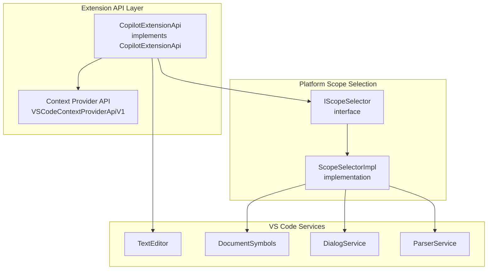
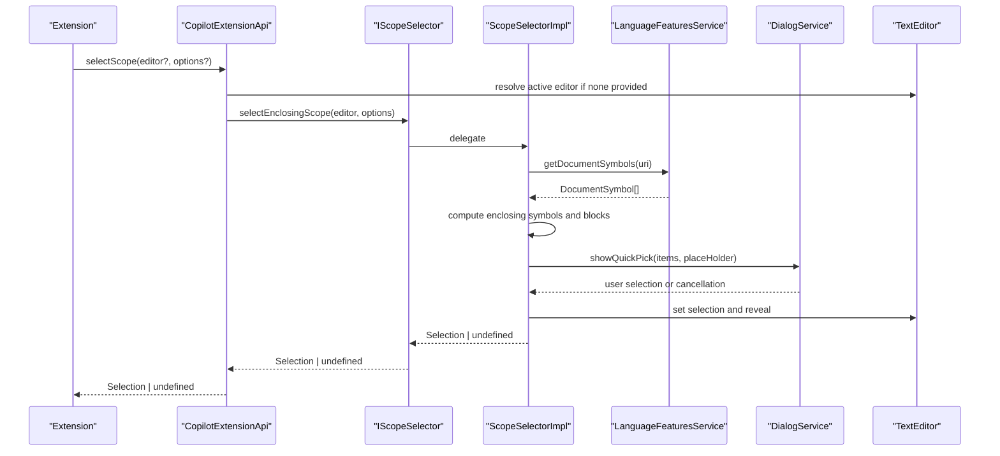
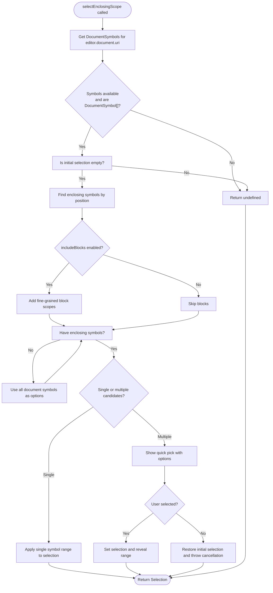
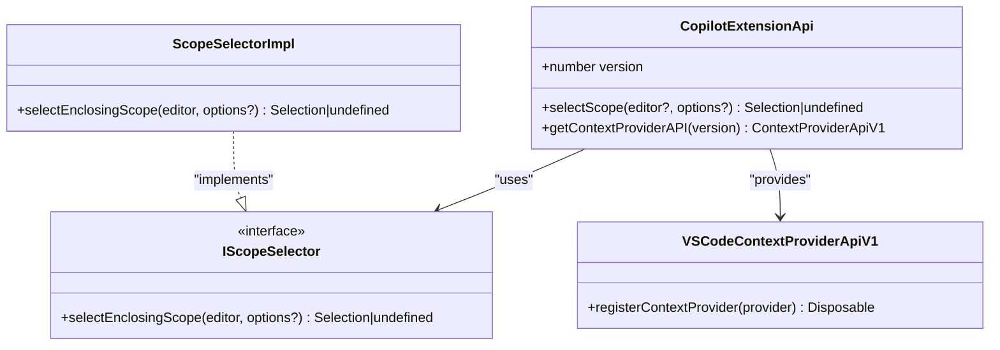

# Extension API

<cite>
**Referenced Files in This Document**
- [extensionApi.ts](file://src/extension/api/vscode/extensionApi.ts)
- [api.d.ts](file://src/extension/api/vscode/api.d.ts)
- [scopeSelection.ts](file://src/platform/scopeSelection/common/scopeSelection.ts)
- [scopeSelectionImpl.ts](file://src/platform/scopeSelection/vscode-node/scopeSelectionImpl.ts)
- [symbolAtCursor.tsx](file://src/extension/prompts/node/panel/symbolAtCursor.tsx)
- [vscodeContextProviderApi.ts](file://src/extension/api/vscode/vscodeContextProviderApi.ts)
- [api.ts](file://src/platform/inlineCompletions/common/api.ts)
</cite>

## Table of Contents
1. [Introduction](#introduction)
2. [Project Structure](#project-structure)
3. [Core Components](#core-components)
4. [Architecture Overview](#architecture-overview)
5. [Detailed Component Analysis](#detailed-component-analysis)
6. [Dependency Analysis](#dependency-analysis)
7. [Performance Considerations](#performance-considerations)
8. [Troubleshooting Guide](#troubleshooting-guide)
9. [Conclusion](#conclusion)
10. [Appendices](#appendices)

## Introduction
This document describes the main Copilot extension API surface for VS Code, focusing on the CopilotExtensionApi interface and its selectScope method. It explains the API contract, method signatures, integration patterns with VS Code’s TextEditor objects, and practical usage scenarios such as code refactoring, explanation requests, and code generation. It also covers error handling, edge cases, best practices, and compatibility considerations for extension developers.

## Project Structure
The Copilot extension exposes a public API via a dedicated module. The API surface is defined in TypeScript declaration files and implemented by a concrete class. The selectScope functionality delegates to a scope selection service that leverages language features and parsing capabilities.

**Diagram sources**
- [extensionApi.ts](file://src/extension/api/vscode/extensionApi.ts#L13-L32)
- [scopeSelection.ts](file://src/platform/scopeSelection/common/scopeSelection.ts#L9-L24)
- [scopeSelectionImpl.ts](file://src/platform/scopeSelection/vscode-node/scopeSelectionImpl.ts#L22-L108)

**Section sources**
- [extensionApi.ts](file://src/extension/api/vscode/extensionApi.ts#L1-L33)
- [api.d.ts](file://src/extension/api/vscode/api.d.ts#L1-L21)

## Core Components
- CopilotExtensionApi: The primary API class exposing selectScope and getContextProviderAPI.
- IScopeSelector: The platform service interface for selecting enclosing scopes.
- ScopeSelectorImpl: The VS Code-specific implementation that computes and presents scope options.
- VSCodeContextProviderApiV1: The context provider API bound to the extension.

Key responsibilities:
- selectScope: Computes and applies a selection range based on the editor’s context.
- getContextProviderAPI: Returns a context provider API instance for registering additional context providers.

**Section sources**
- [extensionApi.ts](file://src/extension/api/vscode/extensionApi.ts#L13-L32)
- [scopeSelection.ts](file://src/platform/scopeSelection/common/scopeSelection.ts#L9-L24)
- [scopeSelectionImpl.ts](file://src/platform/scopeSelection/vscode-node/scopeSelectionImpl.ts#L22-L108)
- [vscodeContextProviderApi.ts](file://src/extension/api/vscode/vscodeContextProviderApi.ts#L11-L22)

## Architecture Overview
The API integrates with VS Code’s language services and parser to discover document symbols and Tree-sitter scopes. It then offers a quick pick UI to let users choose an enclosing scope, updating the editor selection accordingly.

**Diagram sources**
- [extensionApi.ts](file://src/extension/api/vscode/extensionApi.ts#L21-L27)
- [scopeSelection.ts](file://src/platform/scopeSelection/common/scopeSelection.ts#L23)
- [scopeSelectionImpl.ts](file://src/platform/scopeSelection/vscode-node/scopeSelectionImpl.ts#L56-L107)

## Detailed Component Analysis

### CopilotExtensionApi
- Purpose: Public API entry point for extensions to integrate with Copilot’s scope selection and context provider capabilities.
- Versioning: Exposes a static version property indicating API version 1.
- Methods:
  - selectScope(editor?: TextEditor, options?: { reason?: string }): Promise<Selection | undefined>
  - getContextProviderAPI(version: 'v1'): Copilot.ContextProviderApiV1

Behavior highlights:
- If no editor is provided, defaults to the active text editor.
- Delegates scope selection to the injected IScopeSelector.
- Provides a context provider API for registering additional context items.

Integration patterns:
- Extensions can obtain the API via VS Code’s extension exports and call selectScope to narrow the user’s intent before invoking Copilot features.

**Section sources**
- [extensionApi.ts](file://src/extension/api/vscode/extensionApi.ts#L13-L32)
- [api.d.ts](file://src/extension/api/vscode/api.d.ts#L11-L20)

### selectScope Method
- Contract:
  - Parameters:
    - editor: Optional TextEditor. Defaults to the active editor if omitted.
    - options.reason: Optional string used as the quick pick placeholder.
  - Returns: Promise resolving to a Selection or undefined.
- Behavior:
  - Validates presence of an editor; returns early if none.
  - Delegates to IScopeSelector.selectEnclosingScope with the same options.
  - The underlying implementation computes enclosing symbols and optionally includes fine-grained blocks, then presents a quick pick UI for selection.

Usage scenarios:
- Code refactoring: Narrow selection to a method or class before applying refactorings.
- Explanation requests: Ensure the selected scope corresponds to the intended symbol or block.
- Code generation: Limit the generation context to a specific function, class, or block.

Edge cases and error handling:
- No active editor: Returns undefined immediately.
- Empty initial selection: Proceeds to compute enclosing scopes.
- No enclosing symbols: Falls back to listing all document symbols.
- Cancellation: Throws a cancellation error when the user dismisses the quick pick.

Best practices:
- Always pass a reason for clarity in the quick pick UI.
- Consider includeBlocks for block-level scoping when appropriate.
- Handle undefined returns gracefully in calling code.

**Section sources**
- [extensionApi.ts](file://src/extension/api/vscode/extensionApi.ts#L21-L27)
- [scopeSelection.ts](file://src/platform/scopeSelection/common/scopeSelection.ts#L23)
- [scopeSelectionImpl.ts](file://src/platform/scopeSelection/vscode-node/scopeSelectionImpl.ts#L56-L107)

### Scope Selection Implementation
- Enclosing symbols: Uses DocumentSymbol[] from language features to find the smallest enclosing symbol around the cursor.
- Fine-grained blocks: Optionally augments results with Tree-sitter fine scopes for statement-level blocks.
- Quick pick UX: Presents a sorted list of candidate scopes with icons and line range metadata; reveals the chosen range in the editor.

**Diagram sources**
- [scopeSelectionImpl.ts](file://src/platform/scopeSelection/vscode-node/scopeSelectionImpl.ts#L56-L107)

**Section sources**
- [scopeSelectionImpl.ts](file://src/platform/scopeSelection/vscode-node/scopeSelectionImpl.ts#L22-L108)

### Context Provider API
- Purpose: Allow extensions to register additional context items that Copilot can use in prompts.
- Binding: Provided via getContextProviderAPI('v1'), returning VSCodeContextProviderApiV1.
- Registration: Delegates to the language context provider service targeting completion contexts.

**Section sources**
- [vscodeContextProviderApi.ts](file://src/extension/api/vscode/vscodeContextProviderApi.ts#L11-L22)
- [api.ts](file://src/platform/inlineCompletions/common/api.ts#L21-L39)

## Dependency Analysis
- CopilotExtensionApi depends on:
  - IScopeSelector for scope computation.
  - ILanguageContextProviderService for context provider registration.
- ScopeSelectorImpl depends on:
  - LanguageFeaturesService for document symbols.
  - ParserService for Tree-sitter AST and fine scopes.
  - DialogService for quick pick UI.

**Diagram sources**
- [extensionApi.ts](file://src/extension/api/vscode/extensionApi.ts#L13-L32)
- [scopeSelection.ts](file://src/platform/scopeSelection/common/scopeSelection.ts#L9-L24)
- [scopeSelectionImpl.ts](file://src/platform/scopeSelection/vscode-node/scopeSelectionImpl.ts#L22-L28)
- [vscodeContextProviderApi.ts](file://src/extension/api/vscode/vscodeContextProviderApi.ts#L11-L22)

**Section sources**
- [extensionApi.ts](file://src/extension/api/vscode/extensionApi.ts#L16-L19)
- [scopeSelectionImpl.ts](file://src/platform/scopeSelection/vscode-node/scopeSelectionImpl.ts#L25-L27)

## Performance Considerations
- Scope computation relies on language features and Tree-sitter parsing. For large files, consider limiting scope selection to smaller regions or disabling includeBlocks when unnecessary.
- Quick pick rendering sorts candidates by line position; keep the number of candidates reasonable to avoid UI lag.
- Avoid repeated invocations in tight loops; cache results when appropriate.

## Troubleshooting Guide
Common issues and resolutions:
- No active editor: selectScope returns undefined. Ensure an editor is focused or pass an explicit editor.
- Empty selection requirement: The method expects an empty selection; if the current selection is not empty, it returns undefined. Clear the selection before invoking.
- No symbols available: If document symbols are unavailable or not DocumentSymbol[], the method returns undefined. Verify language support and symbol provider availability.
- Cancellation: Dismissing the quick pick restores the previous selection and throws a cancellation error. Handle this in calling code to avoid unexpected failures.
- Block inclusion: includeBlocks requires Tree-sitter support; if unavailable, the method falls back to symbol-based scopes.

**Section sources**
- [scopeSelectionImpl.ts](file://src/platform/scopeSelection/vscode-node/scopeSelectionImpl.ts#L56-L107)

## Conclusion
The CopilotExtensionApi provides a concise and powerful way to integrate Copilot with editor-driven workflows. The selectScope method enables precise scoping for refactoring, explanation, and generation tasks, while the context provider API extends Copilot’s contextual awareness. By following the best practices and handling edge cases, extension authors can deliver robust integrations that improve developer productivity.

## Appendices

### API Contract Summary
- selectScope(editor?: TextEditor, options?: { reason?: string }): Promise<Selection | undefined>
  - editor: Optional TextEditor; defaults to active editor.
  - options.reason: Optional placeholder text for the quick pick.
  - Returns: Selected range or undefined if no selection is made or conditions are not met.

Integration pattern with VS Code TextEditor:
- Obtain the API from the Copilot extension exports.
- Call selectScope with desired options.
- Use the returned Selection to constrain subsequent Copilot operations.

**Section sources**
- [api.d.ts](file://src/extension/api/vscode/api.d.ts#L11-L20)
- [extensionApi.ts](file://src/extension/api/vscode/extensionApi.ts#L21-L27)

### Usage Examples (paths only)
- Refactoring with explicit scope:
  - [symbolAtCursor.tsx](file://src/extension/prompts/node/panel/symbolAtCursor.tsx#L125-L148)
- Explanation request with block inclusion:
  - [symbolAtCursor.tsx](file://src/extension/prompts/node/panel/symbolAtCursor.tsx#L125-L148)
- Code generation scoped to a function/class:
  - [scopeSelectionImpl.ts](file://src/platform/scopeSelection/vscode-node/scopeSelectionImpl.ts#L87-L105)

### API Versioning and Compatibility
- Version: The API exposes a static version property indicating API version 1.
- Compatibility: Extensions should guard against version mismatches and handle unknown versions gracefully.
- Migration guidelines:
  - Maintain backward compatibility for selectScope signature and behavior.
  - Introduce new methods as optional additions to preserve existing integrations.
  - Document breaking changes and provide deprecation timelines when evolving the API.

**Section sources**
- [extensionApi.ts](file://src/extension/api/vscode/extensionApi.ts#L14)