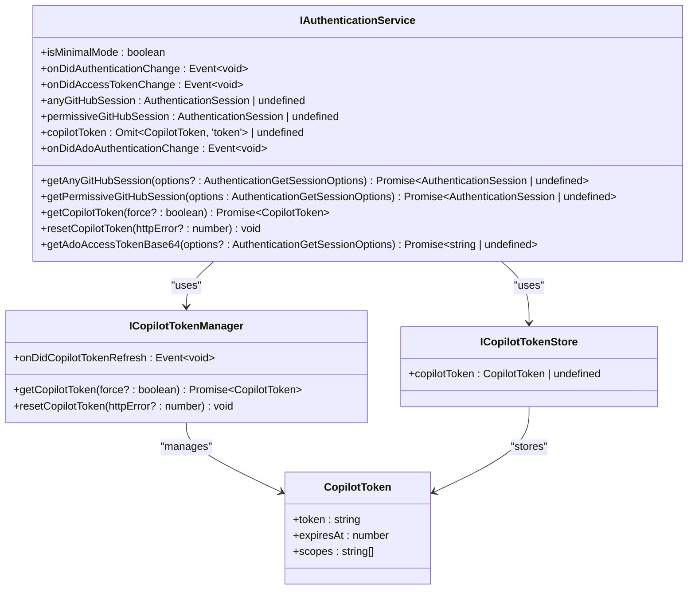
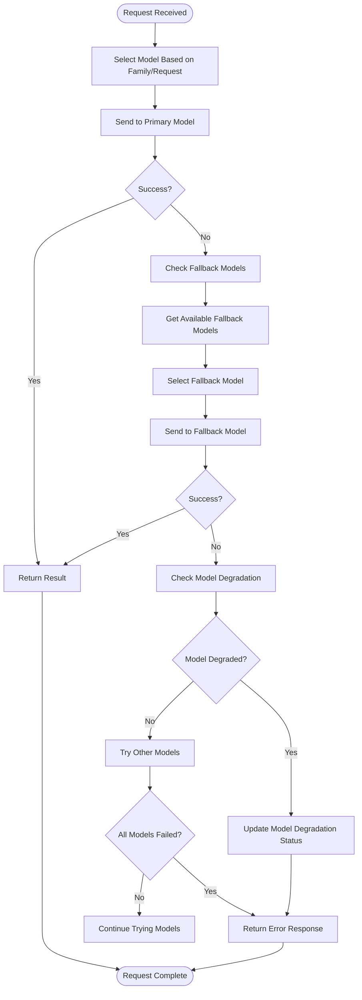
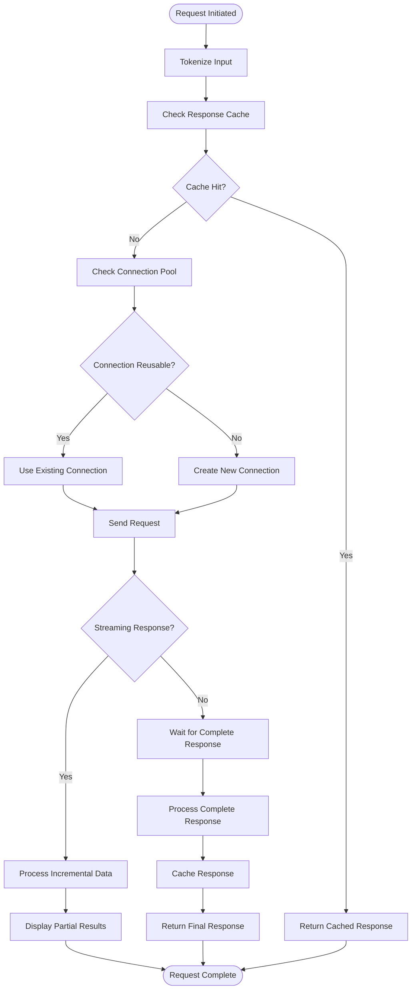
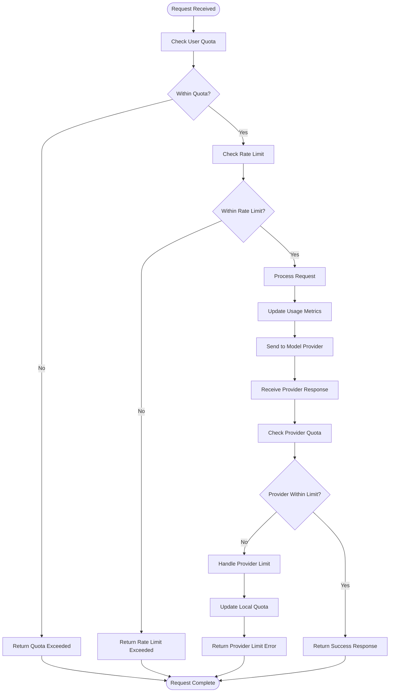
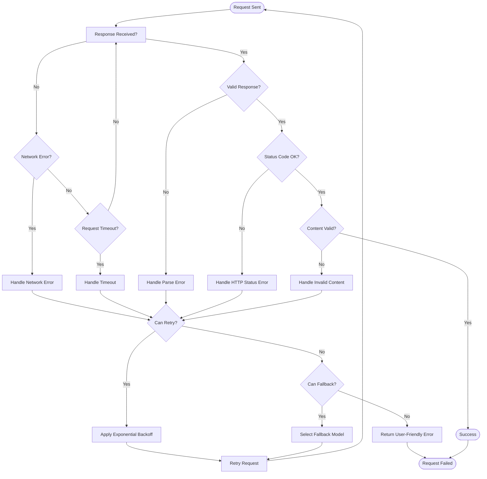

# Language Model APIs

<cite>
**Referenced Files in This Document**   
- [endpointProvider.ts](file://src/platform/endpoint/common/endpointProvider.ts)
- [chatModelCapabilities.ts](file://src/platform/endpoint/common/chatModelCapabilities.ts)
- [capiClient.ts](file://src/platform/endpoint/common/capiClient.ts)
- [capiClientImpl.ts](file://src/platform/endpoint/node/capiClientImpl.ts)
- [copilotChatEndpoint.ts](file://src/platform/endpoint/node/copilotChatEndpoint.ts)
- [authentication.ts](file://src/platform/authentication/common/authentication.ts)
- [networking.ts](file://src/platform/networking/common/networking.ts)
- [claudeTools.ts](file://src/extension/agents/claude/common/claudeTools.ts)
- [toolInvocationFormatter.ts](file://src/extension/agents/claude/common/toolInvocationFormatter.ts)
- [copilotcliAgentManager.ts](file://src/extension/agents/copilotcli/node/copilotcliAgentManager.ts)
</cite>

## Table of Contents
1. [Introduction](#introduction)
2. [Endpoint Provider Interface](#endpoint-provider-interface)
3. [Chat Model Capabilities System](#chat-model-capabilities-system)
4. [Request/Response Schemas](#requestresponse-schemas)
5. [Authentication Mechanisms](#authentication-mechanisms)
6. [Model Selection and Fallback Strategies](#model-selection-and-fallback-strategies)
7. [Performance Considerations](#performance-considerations)
8. [Rate Limiting and Quota Management](#rate-limiting-and-quota-management)
9. [Error Handling Strategies](#error-handling-strategies)
10. [Agent Implementations](#agent-implementations)

## Introduction
This document provides comprehensive documentation for the language model APIs that power GitHub Copilot Chat. It covers the endpoint provider interface, chat model capabilities system, request/response schemas, authentication mechanisms, model selection strategies, and error handling approaches. The documentation explains how different AI models (Claude, Copilot CLI, etc.) are integrated and how their capabilities are exposed to the extension for code suggestions and chat interactions.

## Endpoint Provider Interface
The endpoint provider interface serves as the central abstraction for managing language model endpoints in GitHub Copilot Chat. It provides a unified way to access different AI models through a consistent API, enabling the system to support multiple providers while maintaining a clean separation between the core functionality and specific model implementations.

The `IEndpointProvider` interface defines the contract for endpoint providers, including methods to retrieve completion models, chat endpoints, and embeddings endpoints. It supports dynamic model discovery and allows for the integration of new models without requiring changes to the core system. The interface also handles the routing of chat requests to appropriate endpoints based on model family or specific requirements.

```mermaid
classDiagram
class IEndpointProvider {
+getAllCompletionModels(forceRefresh? : boolean) Promise~ICompletionModelInformation[]~
+getAllChatEndpoints() Promise~IChatEndpoint[]~
+getChatEndpoint(requestOrFamily : LanguageModelChat | ChatRequest | ChatEndpointFamily) Promise~IChatEndpoint~
+getEmbeddingsEndpoint(family? : EmbeddingsEndpointFamily) Promise~IEmbeddingsEndpoint~
}
class IChatEndpoint {
+urlOrRequestMetadata : string | RequestMetadata
+modelMaxPromptTokens : number
+name : string
+version : string
+family : string
+tokenizer : TokenizerType
+maxOutputTokens : number
+model : string
+apiType? : string
+supportsThinkingContentInHistory? : boolean
+supportsToolCalls : boolean
+supportsVision : boolean
+supportsPrediction : boolean
+supportedEditTools? : readonly EndpointEditToolName[]
+showInModelPicker : boolean
+isPremium? : boolean
+degradationReason? : string
+multiplier? : number
+restrictedToSkus? : string[]
+isDefault : boolean
+isFallback : boolean
+customModel? : CustomModel
+isExtensionContributed? : boolean
+policy : 'enabled' | { terms : string }
+processResponseFromChatEndpoint(telemetryService : ITelemetryService, logService : ILogService, response : Response, expectedNumChoices : number, finishCallback : FinishedCallback, telemetryData : TelemetryData, cancellationToken? : CancellationToken) Promise~AsyncIterableObject~ChatCompletion~~
+acceptChatPolicy() Promise~boolean~
+makeChatRequest(debugName : string, messages : Raw.ChatMessage[], finishedCb : FinishedCallback | undefined, token : CancellationToken, location : ChatLocation, source? : Source, requestOptions? : Omit~OptionalChatRequestParams, 'n'~, userInitiatedRequest? : boolean, telemetryProperties? : TelemetryProperties) Promise~ChatResponse~
+makeChatRequest2(options : IMakeChatRequestOptions, token : CancellationToken) Promise~ChatResponse~
+createRequestBody(options : ICreateEndpointBodyOptions) IEndpointBody
+cloneWithTokenOverride(modelMaxPromptTokens : number) IChatEndpoint
}
class IEmbeddingsEndpoint {
+maxBatchSize : number
}
IEndpointProvider --> IChatEndpoint : "provides"
IEndpointProvider --> IEmbeddingsEndpoint : "provides"
```

**Diagram sources**
- [endpointProvider.ts](file://src/platform/endpoint/common/endpointProvider.ts#L119-L145)

**Section sources**
- [endpointProvider.ts](file://src/platform/endpoint/common/endpointProvider.ts#L1-L145)

## Chat Model Capabilities System
The chat model capabilities system exposes model features to the extension by providing detailed information about what each model can do. This system enables the extension to adapt its behavior based on the capabilities of the selected model, ensuring optimal performance and feature utilization.

The capabilities are defined through interfaces that describe various aspects of model functionality, including supported features like tool calls, streaming, vision, and prediction. The system also includes model-specific preferences and requirements, such as whether instructions should be given in user messages or after history, and which edit tools are supported.

```mermaid
classDiagram
class IChatModelCapabilities {
+type : 'chat'
+family : string
+tokenizer : TokenizerType
+limits? : {
max_prompt_tokens? : number
max_output_tokens? : number
max_context_window_tokens? : number
}
+supports : {
parallel_tool_calls? : boolean
tool_calls? : boolean
streaming : boolean | undefined
vision? : boolean
prediction? : boolean
thinking? : boolean
}
}
class IEmbeddingModelCapabilities {
+type : 'embeddings'
+family : string
+tokenizer : TokenizerType
+limits? : { max_inputs? : number }
}
class ICompletionModelCapabilities {
+type : 'completion'
+family : string
+tokenizer : TokenizerType
}
class ModelSupportedEndpoint {
+ChatCompletions = '/chat/completions'
+Responses = '/responses'
}
class IModelAPIResponse {
+id : string
+name : string
+policy? : ModelPolicy
+model_picker_enabled : boolean
+preview? : boolean
+is_chat_default : boolean
+is_chat_fallback : boolean
+version : string
+warning_messages? : { code : string; message : string }[]
+info_messages? : { code : string; message : string }[]
+billing? : { is_premium : boolean; multiplier : number; restricted_to? : string[] }
+capabilities : IChatModelCapabilities | ICompletionModelCapabilities | IEmbeddingModelCapabilities
+supported_endpoints? : ModelSupportedEndpoint[]
+custom_model? : { key_name : string; owner_name : string }
}
IChatModelCapabilities <|-- IModelAPIResponse
IEmbeddingModelCapabilities <|-- IModelAPIResponse
ICompletionModelCapabilities <|-- IModelAPIResponse
```

**Diagram sources**
- [endpointProvider.ts](file://src/platform/endpoint/common/endpointProvider.ts#L37-L90)

**Section sources**
- [endpointProvider.ts](file://src/platform/endpoint/common/endpointProvider.ts#L37-L90)
- [chatModelCapabilities.ts](file://src/platform/endpoint/common/chatModelCapabilities.ts#L1-L147)

## Request/Response Schemas
The request/response schemas define the structure of interactions between the extension and language model providers. These schemas ensure consistent communication across different models and providers, enabling the system to handle various types of requests and responses in a standardized way.

The request schema includes parameters such as messages, model selection, temperature, top_p, and streaming preferences. It also supports advanced features like tool calls, prediction, and intent detection. The response schema handles both streaming and non-streaming responses, with support for multiple choices and detailed telemetry data.

```mermaid
classDiagram
class IEndpointBody {
+tools? : (OpenAiFunctionTool | OpenAiResponsesFunctionTool)[]
+model? : string
+previous_response_id? : string
+max_tokens? : number
+max_output_tokens? : number
+max_completion_tokens? : number
+temperature? : number
+top_p? : number
+stream? : boolean
+prediction? : Prediction
+messages? : any[]
+n? : number
+reasoning? : { effort? : string; summary? : string }
+tool_choice? : OptionalChatRequestParams['tool_choice'] | { type : 'function'; name : string }
+top_logprobs? : number
+intent? : boolean
+intent_threshold? : number
+state? : 'enabled'
+snippy? : { enabled : boolean }
+stream_options? : { include_usage? : boolean }
+prompt? : string
+dimensions? : number
+embed? : boolean
+qos? : any
+content? : string
+path? : string
+local_hashes? : string[]
+language_id? : number
+query? : string
+scopingQuery? : string
+limit? : number
+similarity? : number
+scoping_query? : string
+input? : readonly any[]
+truncation? : 'auto' | 'disabled'
+include? : ['reasoning.encrypted_content']
+store? : boolean
}
class IMakeChatRequestOptions {
+debugName : string
+messages : Raw.ChatMessage[]
+ignoreStatefulMarker? : boolean
+finishedCb : FinishedCallback | undefined
+location : ChatLocation
+source? : Source
+requestOptions? : Omit~OptionalChatRequestParams, 'n'~
+userInitiatedRequest? : boolean
+telemetryProperties? : TelemetryProperties
+enableRetryOnFilter? : boolean
+enableRetryOnError? : boolean
+useFetcher? : FetcherId
}
class ICreateEndpointBodyOptions {
+requestId : string
+postOptions : OptionalChatRequestParams
}
class ChatCompletion {
+id : string
+object : string
+created : number
+model : string
+choices : Array~{
index : number
message : {
role : string
content : string
tool_calls? : Array~{
id : string
type : string
function : {
name : string
arguments : string
}
}~
}
finish_reason : string
}~
+usage? : {
prompt_tokens : number
completion_tokens : number
total_tokens : number
}
}
IEndpointBody <|-- ICreateEndpointBodyOptions
ICreateEndpointBodyOptions <|-- IMakeChatRequestOptions
IMakeChatRequestOptions --> ChatCompletion : "produces"
```

**Diagram sources**
- [networking.ts](file://src/platform/networking/common/networking.ts#L59-L104)
- [networking.ts](file://src/platform/networking/common/networking.ts#L134-L158)
- [networking.ts](file://src/platform/networking/common/networking.ts#L247-L263)

**Section sources**
- [networking.ts](file://src/platform/networking/common/networking.ts#L59-L104)
- [networking.ts](file://src/platform/networking/common/networking.ts#L134-L158)
- [networking.ts](file://src/platform/networking/common/networking.ts#L247-L263)

## Authentication Mechanisms
The authentication system for GitHub Copilot Chat manages access to language model providers through a multi-layered approach that includes GitHub authentication, Copilot token management, and session handling. This system ensures secure access to AI models while providing flexibility for different authentication scenarios.

The authentication service handles both minimal and permissive modes, with different scope requirements for each. It manages GitHub sessions with various scope levels (user:email, read:user, repo, workflow) and coordinates with the Copilot token manager to maintain valid authentication tokens. The system also supports Azure DevOps authentication for enterprise scenarios.



**Diagram sources**
- [authentication.ts](file://src/platform/authentication/common/authentication.ts#L32-L143)

**Section sources**
- [authentication.ts](file://src/platform/authentication/common/authentication.ts#L32-L143)
- [capiClient.ts](file://src/platform/endpoint/common/capiClient.ts#L15-L39)
- [capiClientImpl.ts](file://src/platform/endpoint/node/capiClientImpl.ts#L10-L23)

## Model Selection and Fallback Strategies
The model selection system in GitHub Copilot Chat provides intelligent routing of requests to appropriate language models based on various factors including model capabilities, availability, and user preferences. The system implements robust fallback strategies to ensure service continuity when primary models are unavailable.

Model selection is based on the `ChatEndpointFamily` enumeration which includes families like 'gpt-4.1', 'gpt-5-mini', 'copilot-base', and 'copilot-fast'. The system can route requests to specific models based on their family or capabilities, and automatically falls back to alternative models when necessary. The fallback strategy considers factors such as model degradation, quota limits, and service availability.



**Diagram sources**
- [endpointProvider.ts](file://src/platform/endpoint/common/endpointProvider.ts#L116-L117)
- [networking.ts](file://src/platform/networking/common/networking.ts#L177-L180)

**Section sources**
- [endpointProvider.ts](file://src/platform/endpoint/common/endpointProvider.ts#L116-L117)
- [networking.ts](file://src/platform/networking/common/networking.ts#L177-L180)

## Performance Considerations
The language model API system incorporates several performance optimizations to ensure responsive interactions and efficient resource utilization. These optimizations include request batching, connection pooling, caching strategies, and intelligent throttling mechanisms.

The system implements streaming responses to provide incremental results to users, reducing perceived latency. It also uses efficient tokenization methods and maintains tokenizer instances to minimize processing overhead. Network requests are optimized with appropriate timeout settings and retry mechanisms to handle transient failures without impacting user experience.



**Diagram sources**
- [networking.ts](file://src/platform/networking/common/networking.ts#L52-L53)
- [networking.ts](file://src/platform/networking/common/networking.ts#L310-L313)
- [networking.ts](file://src/platform/networking/common/networking.ts#L347-L357)

**Section sources**
- [networking.ts](file://src/platform/networking/common/networking.ts#L52-L53)
- [networking.ts](file://src/platform/networking/common/networking.ts#L310-L313)
- [networking.ts](file://src/platform/networking/common/networking.ts#L347-L357)

## Rate Limiting and Quota Management
The rate limiting and quota management system protects language model providers from excessive usage while ensuring fair access for all users. This system implements both client-side and server-side controls to manage request frequency and volume.

Client-side rate limiting prevents users from overwhelming the service with rapid successive requests. The system tracks usage metrics and enforces limits based on user tier, subscription level, and provider constraints. Quota management includes monitoring of token usage, request counts, and other resource consumption metrics to prevent abuse and ensure service stability.



**Diagram sources**
- [networking.ts](file://src/platform/networking/common/networking.ts#L210-L211)
- [authentication.ts](file://src/platform/authentication/common/authentication.ts#L126-L132)

**Section sources**
- [networking.ts](file://src/platform/networking/common/networking.ts#L210-L211)
- [authentication.ts](file://src/platform/authentication/common/authentication.ts#L126-L132)

## Error Handling Strategies
The error handling system for unreliable model responses implements comprehensive strategies to maintain service reliability and user experience. This system handles various types of errors including network failures, model timeouts, invalid responses, and authentication issues.

The error handling approach includes retry mechanisms with exponential backoff, fallback to alternative models, graceful degradation of features, and informative error messages to users. The system also implements circuit breaker patterns to prevent cascading failures and provides detailed telemetry for monitoring and debugging.



**Diagram sources**
- [networking.ts](file://src/platform/networking/common/networking.ts#L347-L357)
- [networking.ts](file://src/platform/networking/common/networking.ts#L329-L335)
- [authentication.ts](file://src/platform/authentication/common/authentication.ts#L236-L239)

**Section sources**
- [networking.ts](file://src/platform/networking/common/networking.ts#L347-L357)
- [authentication.ts](file://src/platform/authentication/common/authentication.ts#L236-L239)

## Agent Implementations
The agent implementations for different AI models (Claude, Copilot CLI, etc.) provide specialized interfaces that adapt the generic endpoint provider functionality to the specific requirements of each model. These implementations handle model-specific features, tool calling patterns, and response formatting.

The Claude agent implementation includes support for Anthropic's tool calling format and specific message formatting requirements. The Copilot CLI agent handles command-line interface interactions and integrates with local development tools. Each agent implementation extends the base functionality to provide optimal performance and feature support for its target model.

```mermaid
classDiagram
class IChatEndpoint {
+processResponseFromChatEndpoint(telemetryService : ITelemetryService, logService : ILogService, response : Response, expectedNumChoices : number, finishCallback : FinishedCallback, telemetryData : TelemetryData, cancellationToken? : CancellationToken) Promise~AsyncIterableObject~ChatCompletion~~
+makeChatRequest(debugName : string, messages : Raw.ChatMessage[], finishedCb : FinishedCallback | undefined, token : CancellationToken, location : ChatLocation, source? : Source, requestOptions? : Omit~OptionalChatRequestParams, 'n'~, userInitiatedRequest? : boolean, telemetryProperties? : TelemetryProperties) Promise~ChatResponse~
+createRequestBody(options : ICreateEndpointBodyOptions) IEndpointBody
}
class ClaudeAgent {
+createRequestBody(options : ICreateEndpointBodyOptions) IEndpointBody
+processResponseFromChatEndpoint(telemetryService : ITelemetryService, logService : ILogService, response : Response, expectedNumChoices : number, finishCallback : FinishedCallback, telemetryData : TelemetryData, cancellationToken? : CancellationToken) Promise~AsyncIterableObject~ChatCompletion~~
+formatToolCalls(toolCalls : {name : string, arguments : string}[]) string
+parseToolResponses(response : string) {toolName : string, result : string}[]
}
class CopilotCliAgent {
+createRequestBody(options : ICreateEndpointBodyOptions) IEndpointBody
+processResponseFromChatEndpoint(telemetryService : ITelemetryService, logService : ILogService, response : Response, expectedNumChoices : number, finishCallback : FinishedCallback, telemetryData : TelemetryData, cancellationToken? : CancellationToken) Promise~AsyncIterableObject~ChatCompletion~~
+executeCommand(command : string) Promise~string~
+getAvailableTools() {name : string, description : string}[]
}
IChatEndpoint <|-- ClaudeAgent
IChatEndpoint <|-- CopilotCliAgent
```

**Diagram sources**
- [claudeTools.ts](file://src/extension/agents/claude/common/claudeTools.ts)
- [toolInvocationFormatter.ts](file://src/extension/agents/claude/common/toolInvocationFormatter.ts)
- [copilotcliAgentManager.ts](file://src/extension/agents/copilotcli/node/copilotcliAgentManager.ts)

**Section sources**
- [claudeTools.ts](file://src/extension/agents/claude/common/claudeTools.ts)
- [toolInvocationFormatter.ts](file://src/extension/agents/claude/common/toolInvocationFormatter.ts)
- [copilotcliAgentManager.ts](file://src/extension/agents/copilotcli/node/copilotcliAgentManager.ts)