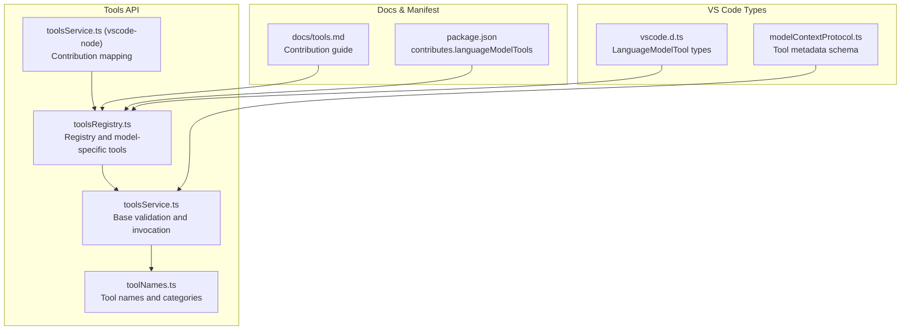
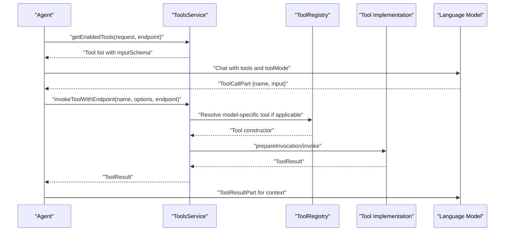
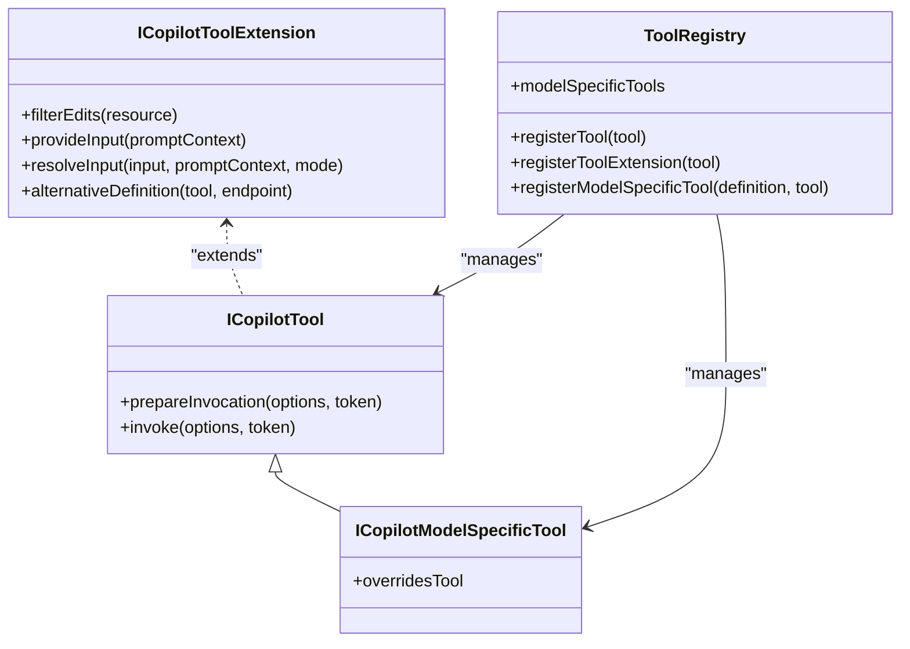
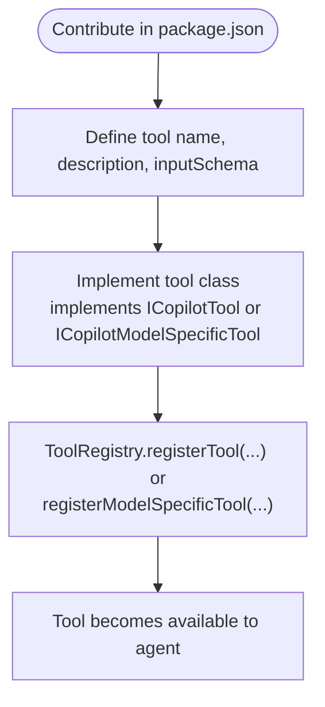
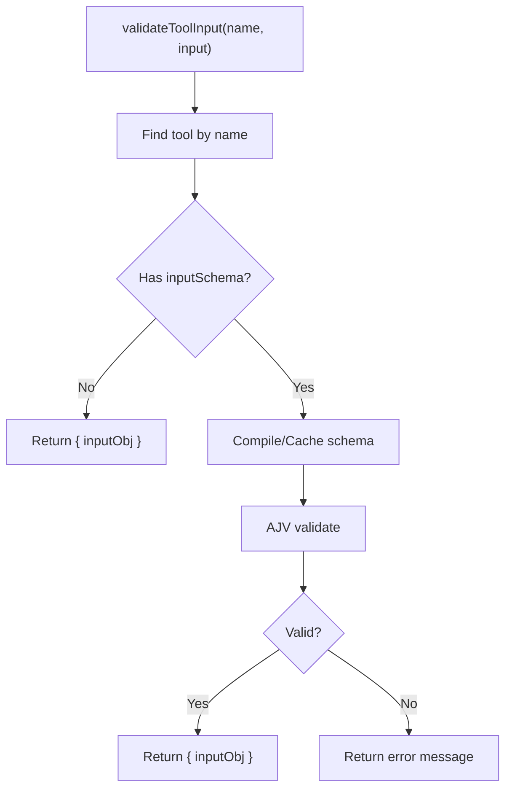
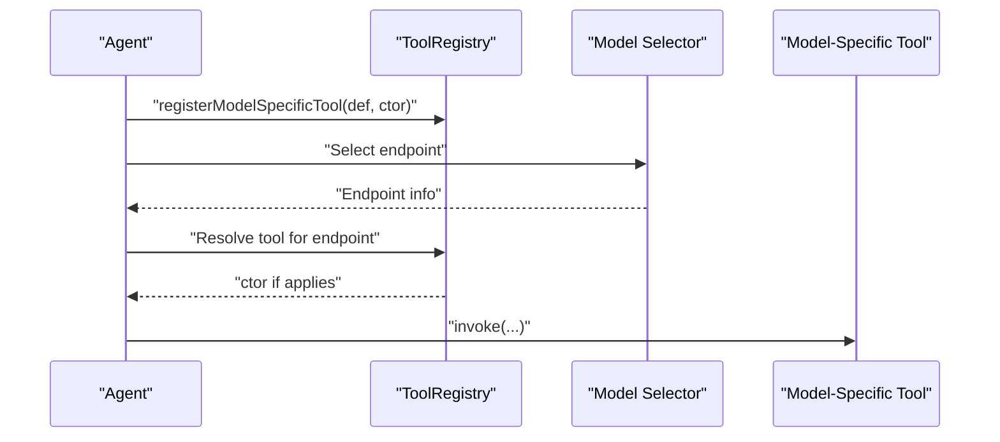
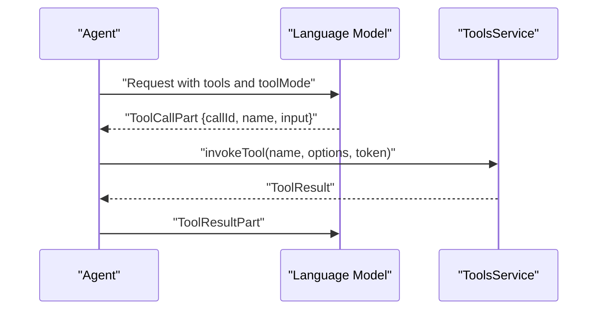
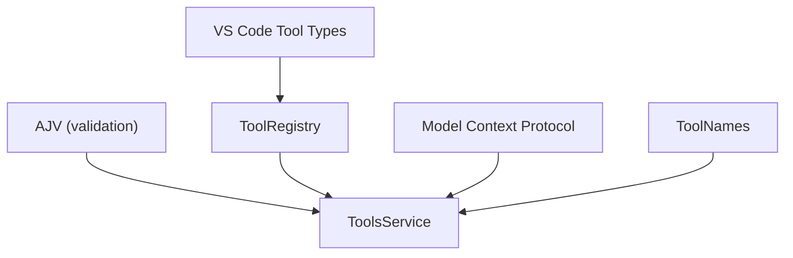

# Language Model Tools API

<cite>
**Referenced Files in This Document**
- [tools.md](file://docs/tools.md)
- [toolsRegistry.ts](file://src/extension/tools/common/toolsRegistry.ts)
- [toolsService.ts](file://src/extension/tools/common/toolsService.ts)
- [toolNames.ts](file://src/extension/tools/common/toolNames.ts)
- [toolsService.ts (vscode-node)](file://src/extension/tools/vscode-node/toolsService.ts)
- [vscode.d.ts](file://src/extension/vscode.d.ts)
- [modelContextProtocol.ts](file://src/extension/common/modelContextProtocol.ts)
- [package.json](file://package.json)
</cite>

## Table of Contents
1. [Introduction](#introduction)
2. [Project Structure](#project-structure)
3. [Core Components](#core-components)
4. [Architecture Overview](#architecture-overview)
5. [Detailed Component Analysis](#detailed-component-analysis)
6. [Dependency Analysis](#dependency-analysis)
7. [Performance Considerations](#performance-considerations)
8. [Troubleshooting Guide](#troubleshooting-guide)
9. [Conclusion](#conclusion)
10. [Appendices](#appendices)

## Introduction
This document describes the Language Model Tools API used for building custom tools in VSCode Copilot Chat. It covers tool interface contracts, schema definitions, registration and invocation patterns, parameter validation, result formatting, built-in tools, and advanced patterns such as model-specific tools and tool composition. It also provides guidance on security, sandboxing, resource limits, testing, debugging, performance optimization, and versioning/migration strategies.

## Project Structure
The Tools API spans several modules:
- Tool definitions and registry: tools/common
- Tool service and validation: tools/common
- VS Code node-side tool service: tools/vscode-node
- Tool naming and categorization: tools/common
- VS Code language model tool types: extension/vscode.d.ts
- Model context protocol (tool metadata): extension/common/modelContextProtocol.ts
- Documentation and contribution guide: docs/tools.md
- Extension manifest: package.json

**Diagram sources**
- [toolsRegistry.ts](file://src/extension/tools/common/toolsRegistry.ts#L105-L143)
- [toolsService.ts](file://src/extension/tools/common/toolsService.ts#L175-L255)
- [toolNames.ts](file://src/extension/tools/common/toolNames.ts#L21-L71)
- [toolsService.ts (vscode-node)](file://src/extension/tools/vscode-node/toolsService.ts#L63-L89)
- [vscode.d.ts](file://src/extension/vscode.d.ts#L20709-L21076)
- [modelContextProtocol.ts](file://src/extension/common/modelContextProtocol.ts#L1264-L1317)
- [tools.md](file://docs/tools.md#L17-L41)
- [package.json](file://package.json)

**Section sources**
- [toolsRegistry.ts](file://src/extension/tools/common/toolsRegistry.ts#L105-L143)
- [toolsService.ts](file://src/extension/tools/common/toolsService.ts#L175-L255)
- [toolNames.ts](file://src/extension/tools/common/toolNames.ts#L21-L71)
- [toolsService.ts (vscode-node)](file://src/extension/tools/vscode-node/toolsService.ts#L63-L89)
- [vscode.d.ts](file://src/extension/vscode.d.ts#L20709-L21076)
- [modelContextProtocol.ts](file://src/extension/common/modelContextProtocol.ts#L1264-L1317)
- [tools.md](file://docs/tools.md#L17-L41)
- [package.json](file://package.json)

## Core Components
- Tool Registry: central registry for tools, tool extensions, and model-specific tools. Supports registration, lookup, and model-family filtering.
- Tools Service: validates tool inputs using JSON Schema, resolves tool invocations, and exposes enabled tools per request and endpoint.
- Tool Names and Categories: enumerations and mappings for tool identity and categorization.
- VS Code Language Model Tool Types: defines tool call/request/response types and modes.
- Model Context Protocol: defines tool metadata structures used by the agent system.

Key responsibilities:
- Registration: contribute tools via package.json and register implementations.
- Validation: enforce inputSchema and provide helpful error messages.
- Invocation: route to model-specific or generic tool implementations.
- Formatting: produce structured tool results suitable for agent consumption.

**Section sources**
- [toolsRegistry.ts](file://src/extension/tools/common/toolsRegistry.ts#L105-L143)
- [toolsService.ts](file://src/extension/tools/common/toolsService.ts#L175-L255)
- [toolNames.ts](file://src/extension/tools/common/toolNames.ts#L21-L71)
- [vscode.d.ts](file://src/extension/vscode.d.ts#L20709-L21076)
- [modelContextProtocol.ts](file://src/extension/common/modelContextProtocol.ts#L1264-L1317)

## Architecture Overview
The Tools API integrates with the agent system and VS Code’s language model tooling. The flow below shows how a tool is discovered, validated, invoked, and how results are returned to the LLM.

**Diagram sources**
- [toolsService.ts](file://src/extension/tools/common/toolsService.ts#L196-L198)
- [toolsRegistry.ts](file://src/extension/tools/common/toolsRegistry.ts#L126-L138)
- [vscode.d.ts](file://src/extension/vscode.d.ts#L21021-L21076)

## Detailed Component Analysis

### Tool Interface Contracts
- ICopilotTool: optional methods prepareInvocation and invoke, plus extension hooks (filterEdits, provideInput, resolveInput, alternativeDefinition).
- ICopilotModelSpecificTool: extends ICopilotTool with optional overridesTool to replace a base tool for specific models.
- ToolRegistry: registers tools, tool extensions, and model-specific tools; provides model applicability checks.

**Diagram sources**
- [toolsRegistry.ts](file://src/extension/tools/common/toolsRegistry.ts#L31-L85)
- [toolsRegistry.ts](file://src/extension/tools/common/toolsRegistry.ts#L105-L143)

**Section sources**
- [toolsRegistry.ts](file://src/extension/tools/common/toolsRegistry.ts#L31-L85)
- [toolsRegistry.ts](file://src/extension/tools/common/toolsRegistry.ts#L105-L143)

### Tool Registration and Contribution
- Contribute tools in package.json under contributes.languageModelTools with name, description, inputSchema, and toolReferenceName.
- Implement tool classes and register via ToolRegistry.registerTool or ToolRegistry.registerModelSpecificTool.
- Built-in tools are enumerated and categorized for discovery and selection.

**Diagram sources**
- [tools.md](file://docs/tools.md#L17-L41)
- [toolsRegistry.ts](file://src/extension/tools/common/toolsRegistry.ts#L114-L138)

**Section sources**
- [tools.md](file://docs/tools.md#L17-L41)
- [toolsRegistry.ts](file://src/extension/tools/common/toolsRegistry.ts#L114-L138)
- [toolNames.ts](file://src/extension/tools/common/toolNames.ts#L21-L71)

### Parameter Validation and Schema Enforcement
- ToolsService.validateToolInput parses and validates tool input against the tool’s inputSchema using AJV.
- Supports JSON string inputs and attempts coercion for nested JSON strings.
- Returns either validated input or a structured error message.

**Diagram sources**
- [toolsService.ts](file://src/extension/tools/common/toolsService.ts#L210-L247)

**Section sources**
- [toolsService.ts](file://src/extension/tools/common/toolsService.ts#L210-L247)

### Result Formatting and Presentation
- Tools should return results compatible with LanguageModelToolResult structures.
- UI-friendly messages and details can be provided via PreparedToolInvocation fields and ExtendedLanguageModelToolResult fields.
- Markdown and clickable widgets are supported for rich presentation.

**Section sources**
- [tools.md](file://docs/tools.md#L55-L67)

### Model-Specific Tools and Overrides
- Use ToolRegistry.registerModelSpecificTool to target specific models by id, version, family, or vendor.
- overridesTool enables replacing a base tool for specific models without exposing the replacement in the UI.

**Diagram sources**
- [toolsRegistry.ts](file://src/extension/tools/common/toolsRegistry.ts#L126-L138)
- [toolsRegistry.ts](file://src/extension/tools/common/toolsRegistry.ts#L145-L165)

**Section sources**
- [toolsRegistry.ts](file://src/extension/tools/common/toolsRegistry.ts#L126-L138)
- [toolsRegistry.ts](file://src/extension/tools/common/toolsRegistry.ts#L145-L165)
- [tools.md](file://docs/tools.md#L87-L149)

### Built-in Tools
The repository defines a comprehensive set of built-in tools covering:
- File operations: read_file, list_dir, create_file, create_directory, insert_edit_into_file, replace_string_in_file, multi_replace_string_in_file, apply_patch, read_project_structure
- Code search: grep_search, semantic_search, search_workspace_symbols, test_search
- Workspace management: get_changed_files, get_vscode_api, create_new_workspace, run_vscode_command
- Terminal and tasks: run_in_terminal, get_terminal_output, terminal_selection, terminal_last_command, create_and_run_task, run_task, get_task_output, runTests
- Jupyter notebook: create_new_jupyter_notebook, edit_notebook_file, run_notebook_cell, copilot_getNotebookSummary, read_notebook_cell_output
- Web interaction: fetch_webpage, github_repo
- Diagnostics and SCM: get_errors, get_search_view_results
- Memory and orchestration: memory, manage_todo_list, runSubagent, search_subagent, vscode_get_confirmation, vscode_get_terminal_confirmation, vscode_askQuestions, switch_agent, tool_replay, tool_search

These tools are enumerated and categorized for discoverability and grouping.

**Section sources**
- [toolNames.ts](file://src/extension/tools/common/toolNames.ts#L21-L71)
- [toolNames.ts](file://src/extension/tools/common/toolNames.ts#L155-L220)

### Tool Execution Patterns
- Auto vs Required tool mode: LanguageModelChatToolMode supports automatic tool selection or mandatory tool use.
- Tool call lifecycle: Agent constructs tool call parts, ToolsService resolves and invokes tools, and results are returned as tool result parts.

**Diagram sources**
- [vscode.d.ts](file://src/extension/vscode.d.ts#L21045-L21056)
- [vscode.d.ts](file://src/extension/vscode.d.ts#L21062-L21076)
- [toolsService.ts](file://src/extension/tools/common/toolsService.ts#L194-L198)

**Section sources**
- [vscode.d.ts](file://src/extension/vscode.d.ts#L21045-L21056)
- [vscode.d.ts](file://src/extension/vscode.d.ts#L21062-L21076)
- [toolsService.ts](file://src/extension/tools/common/toolsService.ts#L194-L198)

### Tool Composition and Advanced Patterns
- Prompt-driven input resolution: tools can provideInput and resolveInput to integrate with agent prompting loops.
- Edit filtering: filterEdits allows tools to request confirmation for edits.
- Alternative definitions: alternativeDefinition allows endpoint-aware customization of tool definitions.

**Section sources**
- [toolsRegistry.ts](file://src/extension/tools/common/toolsRegistry.ts#L31-L68)

## Dependency Analysis
- ToolsService depends on AJV for schema validation and caches compiled validators.
- ToolRegistry manages tool constructors and model-specific overlays.
- VS Code types define the contract for tool invocation and result structures.
- Model context protocol defines tool metadata structures used by the agent system.

**Diagram sources**
- [toolsService.ts](file://src/extension/tools/common/toolsService.ts#L184-L186)
- [toolsRegistry.ts](file://src/extension/tools/common/toolsRegistry.ts#L105-L143)
- [modelContextProtocol.ts](file://src/extension/common/modelContextProtocol.ts#L1264-L1317)
- [toolNames.ts](file://src/extension/tools/common/toolNames.ts#L21-L71)

**Section sources**
- [toolsService.ts](file://src/extension/tools/common/toolsService.ts#L184-L186)
- [toolsRegistry.ts](file://src/extension/tools/common/toolsRegistry.ts#L105-L143)
- [modelContextProtocol.ts](file://src/extension/common/modelContextProtocol.ts#L1264-L1317)
- [toolNames.ts](file://src/extension/tools/common/toolNames.ts#L21-L71)

## Performance Considerations
- Schema compilation is cached to avoid repeated validation overhead.
- Input parsing and coercion reduce validation failures and retries.
- Prefer lightweight tool results and avoid large payloads when possible.
- Use toolMode Auto to minimize forced tool calls when not needed.

[No sources needed since this section provides general guidance]

## Troubleshooting Guide
Common issues and remedies:
- Invalid tool input: validateToolInput returns structured errors; ensure input matches inputSchema and required fields.
- Tool not found: validateToolName normalizes names; verify tool name exists in tools list.
- Model-specific tool not applied: ensure models selector matches endpoint properties (id, version, family, vendor).
- Confirmation prompts: for potentially destructive actions, provide confirmation messages to guide the model.

**Section sources**
- [toolsService.ts](file://src/extension/tools/common/toolsService.ts#L210-L255)
- [toolsRegistry.ts](file://src/extension/tools/common/toolsRegistry.ts#L145-L165)
- [tools.md](file://docs/tools.md#L51-L53)

## Conclusion
The Language Model Tools API provides a robust framework for building, registering, validating, and invoking tools in VSCode Copilot Chat. By adhering to the schema contracts, leveraging the registry and service abstractions, and following the contribution and formatting guidelines, developers can create secure, performant, and user-friendly tools that integrate seamlessly with the agent system.

[No sources needed since this section summarizes without analyzing specific files]

## Appendices

### Tool Metadata and Schemas
- Tool metadata includes description, inputSchema, optional outputSchema, and annotations.
- ToolsService exposes tool information and validates inputs against schemas.

**Section sources**
- [modelContextProtocol.ts](file://src/extension/common/modelContextProtocol.ts#L1264-L1317)
- [toolsService.ts](file://src/extension/tools/common/toolsService.ts#L175-L255)

### Tool Registration Checklist
- Define tool in package.json with name, description, inputSchema, and toolReferenceName.
- Implement tool class and register via ToolRegistry.
- Provide user-facing messages and UI-friendly results.
- Consider model-specific variants and overrides where appropriate.

**Section sources**
- [tools.md](file://docs/tools.md#L17-L41)
- [toolsRegistry.ts](file://src/extension/tools/common/toolsRegistry.ts#L126-L138)

### Security and Sandboxing
- Validate all inputs against inputSchema.
- Request user confirmation for potentially destructive actions.
- Limit tool scope to least privilege necessary.
- Avoid executing untrusted commands or scripts.

**Section sources**
- [tools.md](file://docs/tools.md#L47-L67)
- [tools.md](file://docs/tools.md#L51-L53)

### Testing and Debugging
- Write unit tests that invoke tools with controlled inputs and assert results.
- Use debug views and logs to inspect tool invocations and errors.
- Snapshot tests help maintain result stability.

**Section sources**
- [tools.md](file://docs/tools.md#L69-L71)
- [tools.md](file://docs/tools.md#L150-L156)

### Versioning and Migration
- Keep tool names stable; use toolReferenceName for UI identifiers.
- When evolving schemas, maintain backward compatibility or introduce model-specific overrides.
- Use overridesTool to phase out base tools while preserving compatibility.

**Section sources**
- [tools.md](file://docs/tools.md#L122-L149)
- [toolNames.ts](file://src/extension/tools/common/toolNames.ts#L130-L136)