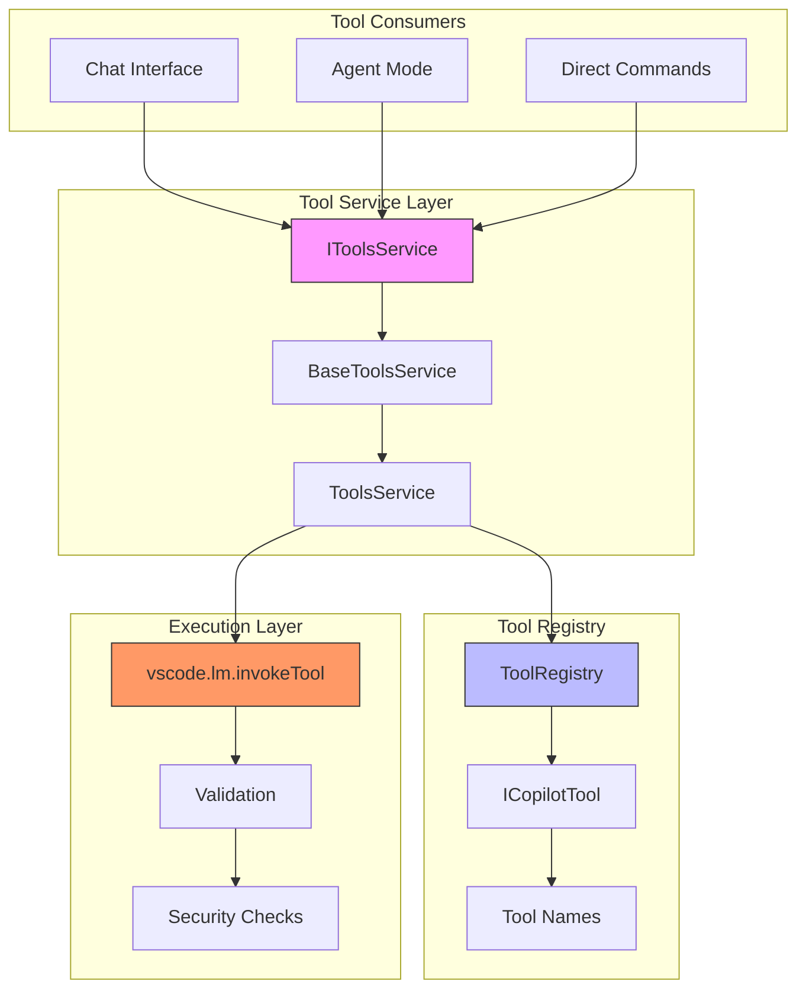
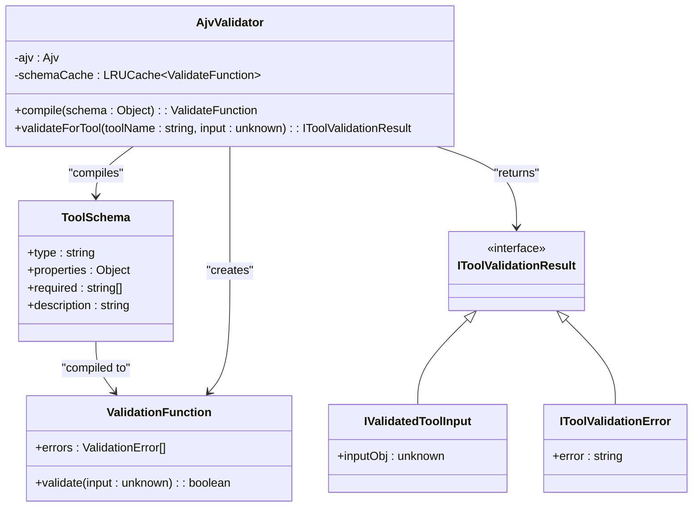
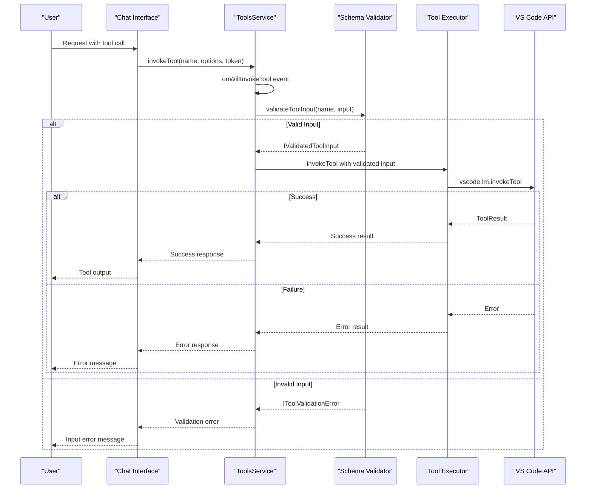
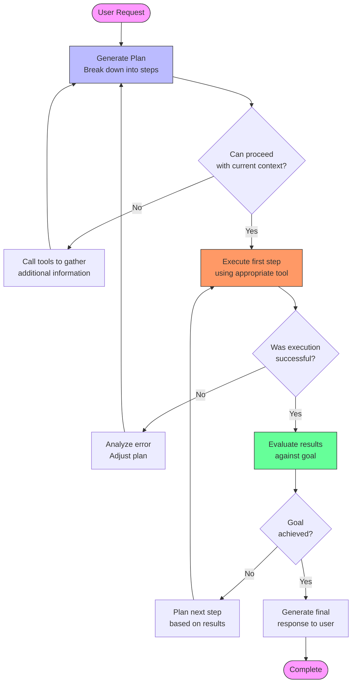
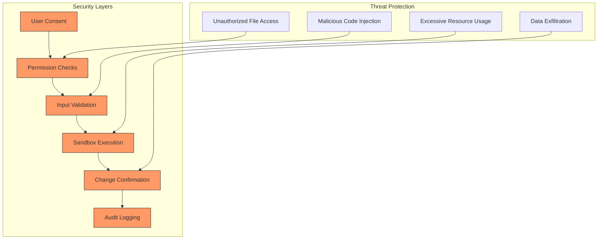
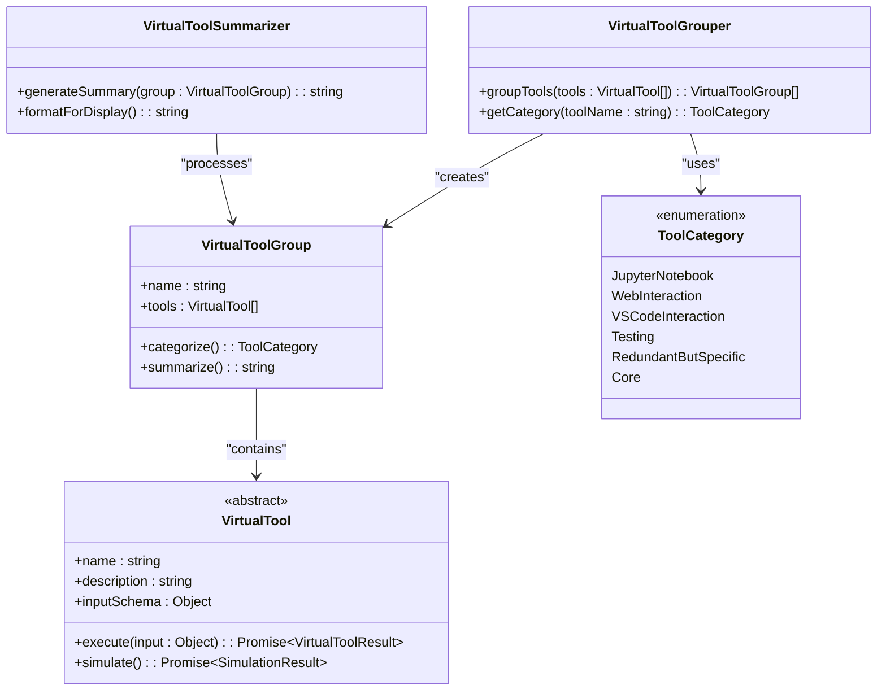

# Tool APIs

<cite>
**Referenced Files in This Document**   
- [toolsService.ts](file://src/extension/tools/common/toolsService.ts)
- [toolsRegistry.ts](file://src/extension/tools/common/toolsRegistry.ts)
- [toolNames.ts](file://src/extension/tools/common/toolNames.ts)
- [tools.ts](file://src/extension/tools/vscode-node/tools.ts)
- [toolsService.ts](file://src/extension/tools/vscode-node/toolsService.ts)
- [package.json](file://package.json)
- [virtualTool.ts](file://src/extension/tools/common/virtualTools/virtualTool.ts)
- [virtualToolGrouper.ts](file://src/extension/tools/common/virtualTools/virtualToolGrouper.ts)
- [virtualToolSummarizer.tsx](file://src/extension/tools/common/virtualTools/virtualToolSummarizer.tsx)
- [tools.stest.ts](file://test/e2e/tools.stest.ts)
</cite>

## Table of Contents
1. [Introduction](#introduction)
2. [Tool System Architecture](#tool-system-architecture)
3. [Core Tool APIs](#core-tool-apis)
4. [Tool Schema Definitions](#tool-schema-definitions)
5. [Tool Calling Lifecycle](#tool-calling-lifecycle)
6. [Agent Mode and Multi-Step Tasks](#agent-mode-and-multi-step-tasks)
7. [Security and Sandboxing](#security-and-sandboxing)
8. [Virtual Tools System](#virtual-tools-system)
9. [Conclusion](#conclusion)

## Introduction
The GitHub Copilot Chat tool APIs provide a comprehensive system for code manipulation within the editor environment. These APIs enable safe, structured interactions between the AI assistant and the development environment, allowing for file operations, code modifications, and workspace management. The tool system is designed with security, reliability, and user experience as primary considerations, implementing strict validation, permission controls, and sandboxing mechanisms to prevent unintended or malicious code modifications.

The tool architecture follows a modular design with clear separation between tool registration, discovery, execution, and result handling. Tools are exposed through a well-defined interface that ensures consistent behavior across different tool types while allowing for specialized functionality where needed. The system supports both direct tool calls and agent-driven workflows, enabling complex multi-step operations that can adapt to changing requirements and user feedback.

**Section sources**
- [toolsService.ts](file://src/extension/tools/common/toolsService.ts#L1-L253)
- [toolsRegistry.ts](file://src/extension/tools/common/toolsRegistry.ts#L1-L76)

## Tool System Architecture

The tool system architecture in GitHub Copilot Chat is built around a service-oriented design that separates concerns between tool registration, management, and execution. At the core of this architecture is the `IToolsService` interface, which defines the contract for tool operations and provides a consistent API for interacting with tools across the application.

The architecture follows a layered approach with the following key components:

**Diagram sources**
- [toolsService.ts](file://src/extension/tools/common/toolsService.ts#L46-L79)
- [toolsRegistry.ts](file://src/extension/tools/common/toolsRegistry.ts#L65-L75)
- [toolsService.ts](file://src/extension/tools/vscode-node/toolsService.ts#L15-L133)

The `IToolsService` interface serves as the primary entry point for tool operations, providing methods for tool discovery, invocation, and validation. The service implementation follows the dependency injection pattern, with the `ToolsService` class extending `BaseToolsService` to provide concrete implementations of the interface methods. This design allows for easy extension and testing of the tool system while maintaining a stable public API.

Tool registration is handled through the `ToolRegistry` class, which maintains a collection of tool constructors that can be instantiated as needed. This lazy instantiation approach improves startup performance and memory usage by only creating tool instances when they are actually needed. The registry pattern also enables dynamic tool discovery and loading, allowing for extensibility through extensions and plugins.

**Section sources**
- [toolsService.ts](file://src/extension/tools/common/toolsService.ts#L154-L253)
- [toolsRegistry.ts](file://src/extension/tools/common/toolsRegistry.ts#L65-L75)
- [toolsService.ts](file://src/extension/tools/vscode-node/toolsService.ts#L15-L133)

## Core Tool APIs

The core tool APIs in GitHub Copilot Chat provide essential functionality for code manipulation and workspace management. These APIs are designed to be safe, reliable, and easy to use, with clear parameter requirements and well-defined error conditions.

### copilot_applyPatch
The `copilot_applyPatch` tool enables precise code modifications through a diff/patch format. This tool is particularly useful for making targeted changes to existing code without requiring full file replacement.

**Parameters:**
- `input` (string, required): The edit patch to apply in V4A diff format
- `explanation` (string, required): Description of the intended changes

**Return Value:**
- Success: Confirmation of patch application
- Failure: Error message describing the validation failure

**Error Conditions:**
- Invalid patch format
- Non-existent file path
- Conflicting changes
- Permission denied

**Section sources**
- [package.json](file://package.json#L327-L349)

### copilot_readFile
The `copilot_readFile` tool allows reading specific portions of files, enabling efficient context retrieval without loading entire files into memory.

**Parameters:**
- `filePath` (string, required): Absolute path of the file to read
- `startLine` (number, required): 1-based line number to start reading from
- `endLine` (number, required): 1-based inclusive line number to end reading at

**Return Value:**
- Success: File content within the specified line range
- Failure: Error message with reason for failure

**Error Conditions:**
- File not found
- Invalid line range
- Permission denied
- File too large

**Section sources**
- [package.json](file://package.json#L351-L379)

### copilot_listDir
The `copilot_listDir` tool provides directory listing functionality, enabling exploration of the workspace structure.

**Parameters:**
- `path` (string, required): Absolute path to the directory to list

**Return Value:**
- Success: Array of directory contents with file/folder indicators
- Failure: Error message with reason for failure

**Error Conditions:**
- Directory not found
- Permission denied
- Invalid path

**Section sources**
- [package.json](file://package.json#L382-L401)

### copilot_createFile
The `copilot_createFile` tool enables creation of new files in the workspace with specified content.

**Parameters:**
- `filePath` (string, required): Absolute path to the file to create
- `content` (string, required): Content to write to the file

**Return Value:**
- Success: Confirmation of file creation
- Failure: Error message with reason for failure

**Error Conditions:**
- File already exists
- Invalid path
- Permission denied
- Directory creation failed

**Section sources**
- [package.json](file://package.json#L657-L680)

### copilot_replaceString
The `copilot_replaceString` tool allows for precise string replacement within existing files, enabling targeted code modifications.

**Parameters:**
- `filePath` (string, required): Absolute path to the file to edit
- `oldString` (string, required): Exact literal text to replace
- `newString` (string, required): Exact literal text to replace with

**Return Value:**
- Success: Confirmation of replacement
- Failure: Error message with reason for failure

**Error Conditions:**
- File not found
- `oldString` not found or not unique
- Permission denied
- Invalid string format

**Section sources**
- [package.json](file://package.json#L723-L749)

## Tool Schema Definitions

The tool schema definitions in GitHub Copilot Chat provide a structured approach to tool parameter validation and documentation. These schemas are defined using JSON Schema format and are used to validate tool inputs before execution, ensuring that only properly formatted requests are processed.

The schema system serves multiple purposes:
- Input validation to prevent malformed requests
- Documentation for tool parameters and requirements
- Type safety and consistency across tool implementations
- Error reporting with specific validation feedback

**Diagram sources**
- [toolsService.ts](file://src/extension/tools/common/toolsService.ts#L18-L34)
- [toolsService.ts](file://src/extension/tools/common/toolsService.ts#L112-L152)

The validation process follows a multi-step approach:
1. JSON parsing of the input string
2. Schema compilation using AJV (Another JSON Schema Validator)
3. Input validation against the compiled schema
4. Special handling for nested JSON strings
5. Error aggregation and formatting

The system implements caching for compiled schemas to improve performance, using an LRU (Least Recently Used) cache to store compiled validation functions. This optimization reduces the overhead of schema compilation for frequently used tools while maintaining memory efficiency.

**Section sources**
- [toolsService.ts](file://src/extension/tools/common/toolsService.ts#L163-L216)

## Tool Calling Lifecycle

The tool calling lifecycle in GitHub Copilot Chat defines the complete process from user request to execution and result handling. This lifecycle ensures consistent behavior across all tool invocations while providing hooks for validation, security checks, and error handling.

**Diagram sources**
- [toolsService.ts](file://src/extension/tools/common/toolsService.ts#L62-L63)
- [toolsService.ts](file://src/extension/tools/vscode-node/toolsService.ts#L75-L78)
- [toolsService.ts](file://src/extension/tools/common/toolsService.ts#L179-L216)

The lifecycle begins with a user request that includes a tool call specification. The request is passed to the `invokeTool` method of the `ToolsService`, which first fires an `onWillInvokeTool` event to notify listeners of the impending tool execution. This event can be used for logging, telemetry, or UI updates.

Next, the input validation process begins with a call to `validateToolInput`, which parses the input string and validates it against the tool's schema. If validation fails, an error response is returned immediately with details about the validation failure. This early validation helps prevent unnecessary processing of malformed requests.

Upon successful validation, the tool invocation proceeds to the execution phase, where the request is forwarded to the VS Code language model API via `vscode.lm.invokeTool`. The execution is performed with the provided cancellation token, allowing for graceful termination of long-running operations if needed.

The result is then returned through the call chain back to the chat interface, which formats the response for display to the user. Throughout this process, error handling is implemented at multiple levels to ensure that failures are properly reported and do not crash the application.

**Section sources**
- [toolsService.ts](file://src/extension/tools/common/toolsService.ts#L62-L63)
- [toolsService.ts](file://src/extension/tools/vscode-node/toolsService.ts#L75-L78)
- [toolsService.ts](file://src/extension/tools/common/toolsService.ts#L179-L216)

## Agent Mode and Multi-Step Tasks

Agent mode in GitHub Copilot Chat enables complex, multi-step tasks by allowing the AI assistant to plan and execute sequences of tool calls to achieve a specific goal. This mode transforms the assistant from a reactive tool into an autonomous agent capable of problem-solving and decision-making.

The agent mode workflow follows a planning-execution-evaluation cycle:

**Diagram sources**
- [tools.stest.ts](file://test/e2e/tools.stest.ts#L1-L100)
- [toolsRegistry.ts](file://src/extension/tools/common/toolsRegistry.ts#L28-L58)

In agent mode, the assistant can use tools like `copilot_listDir` and `copilot_readFile` to explore the codebase and gather context before making modifications. This exploration phase is crucial for understanding the existing code structure and identifying the appropriate files and locations for changes.

The multi-step nature of agent mode allows for complex workflows such as:
- Refactoring across multiple files
- Implementing features that require changes to both code and configuration files
- Debugging issues by reproducing problems and testing fixes
- Creating new components with associated tests and documentation

Each step in the process is validated and executed independently, with the results feeding into the planning of subsequent steps. This iterative approach enables the agent to adapt to unexpected conditions and adjust its strategy as needed.

**Section sources**
- [tools.stest.ts](file://test/e2e/tools.stest.ts#L1-L100)
- [toolsRegistry.ts](file://src/extension/tools/common/toolsRegistry.ts#L28-L58)

## Security and Sandboxing

The security model for GitHub Copilot Chat tool APIs is designed to prevent malicious code modifications while enabling legitimate development tasks. The system implements multiple layers of protection, including permission controls, input validation, and sandboxing mechanisms.

The security architecture follows the principle of least privilege, ensuring that tools can only perform actions within their intended scope:

**Diagram sources**
- [toolsService.ts](file://src/extension/tools/common/toolsService.ts#L69-L72)
- [package.json](file://package.json#L327-L849)

Permission requirements are enforced through multiple mechanisms:
- Explicit user consent for potentially destructive operations
- Context-based permission checks that consider the current workspace and file types
- Configuration settings that allow users to disable specific tools
- Runtime checks that verify the user's intent before executing changes

Sandboxing mechanisms include:
- Input validation using JSON Schema to prevent malformed requests
- String matching requirements for `oldString` in `copilot_replaceString` to prevent unintended replacements
- Line range restrictions in `copilot_readFile` to prevent excessive data access
- Path validation to prevent directory traversal attacks

The system also implements change confirmation workflows for significant modifications, requiring explicit user approval before applying changes. This ensures that users maintain control over their codebase while still benefiting from automated assistance.

**Section sources**
- [toolsService.ts](file://src/extension/tools/common/toolsService.ts#L69-L72)
- [package.json](file://package.json#L327-L849)

## Virtual Tools System

The virtual tools system in GitHub Copilot Chat provides a simulation and testing framework for tool behavior. This system enables safe experimentation with tool functionality without affecting the actual development environment.

The virtual tools architecture is designed to mirror the production tool system while providing additional capabilities for testing and simulation:

**Diagram sources**
- [virtualTool.ts](file://src/extension/tools/common/virtualTools/virtualTool.ts#L1-L50)
- [virtualToolGrouper.ts](file://src/extension/tools/common/virtualTools/virtualToolGrouper.ts#L1-L100)
- [virtualToolSummarizer.tsx](file://src/extension/tools/common/virtualTools/virtualToolSummarizer.tsx#L1-L50)

The virtual tools system serves several key purposes:
- Testing tool behavior in isolated environments
- Demonstrating tool capabilities to users
- Validating tool interactions before production deployment
- Providing a safe sandbox for learning and experimentation

The system categorizes tools into groups based on their functionality, making it easier to understand and manage large numbers of tools. These categories include Jupyter Notebook tools, Web Interaction tools, VS Code Interaction tools, Testing tools, and others. The categorization helps users discover relevant tools and understand their capabilities.

Virtual tool simulation enables testing of complex workflows without risking actual code changes. This is particularly valuable for agent mode operations, where multiple tools may be chained together in a sequence. The simulation results can be analyzed to identify potential issues or optimize the workflow before executing in the production environment.

**Section sources**
- [virtualTool.ts](file://src/extension/tools/common/virtualTools/virtualTool.ts#L1-L50)
- [virtualToolGrouper.ts](file://src/extension/tools/common/virtualTools/virtualToolGrouper.ts#L1-L100)
- [virtualToolSummarizer.tsx](file://src/extension/tools/common/virtualTools/virtualToolSummarizer.tsx#L1-L50)

## Conclusion
The GitHub Copilot Chat tool APIs provide a robust and secure framework for code manipulation within the development environment. The system's architecture balances flexibility with safety, enabling powerful automation capabilities while protecting against unintended or malicious changes.

Key strengths of the tool system include:
- Comprehensive validation and error handling
- Clear separation of concerns in the architecture
- Strong security and sandboxing mechanisms
- Support for both direct and agent-driven workflows
- Extensive testing and simulation capabilities

The tool APIs are designed to enhance developer productivity by automating routine tasks and providing intelligent assistance with complex operations. By following established patterns for tool registration, discovery, and execution, the system ensures consistent behavior across different tool types while allowing for specialized functionality where needed.

As the system continues to evolve, the virtual tools framework provides a solid foundation for testing and validating new features before deployment. This approach enables rapid innovation while maintaining the stability and reliability expected in a development environment.