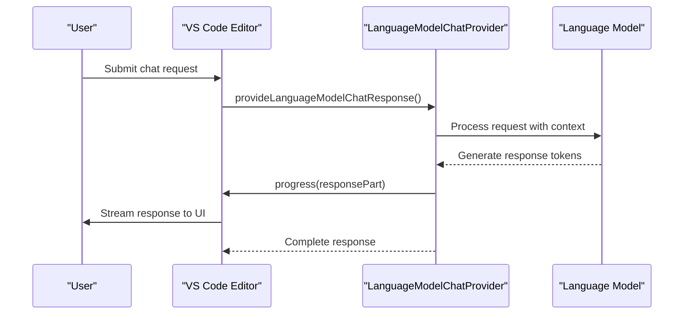
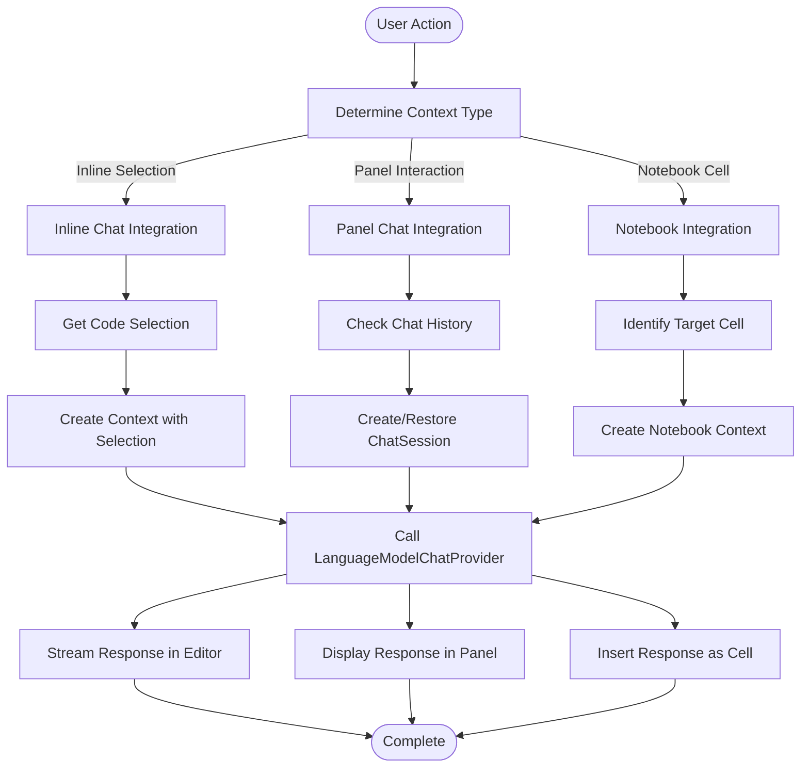

# VS Code Integration APIs

<cite>
**Referenced Files in This Document**   
- [api.d.ts](file://src/extension/api/vscode/api.d.ts)
- [extensionApi.ts](file://src/extension/api/vscode/extensionApi.ts)
- [vscodeContextProviderApi.ts](file://src/extension/api/vscode/vscodeContextProviderApi.ts)
- [vscode.proposed.chatProvider.d.ts](file://src/extension/vscode.proposed.chatProvider.d.ts)
- [vscode.proposed.chatSessionsProvider.d.ts](file://src/extension/vscode.proposed.chatSessionsProvider.d.ts)
- [vscode.proposed.chatStatusItem.d.ts](file://src/extension/vscode.proposed.chatStatusItem.d.ts)
- [vscode.proposed.defaultChatParticipant.d.ts](file://src/extension/vscode.proposed.defaultChatParticipant.d.ts)
- [authentication.contribution.ts](file://src/extension/authentication/vscode-node/authentication.contribution.ts)
- [chatQuota.contribution.ts](file://src/extension/chat/vscode-node/chatQuota.contribution.ts)
- [contextKeys.contribution.ts](file://src/extension/contextKeys/vscode-node/contextKeys.contribution.ts)
- [chatBlockLanguageFeatures.contribution.ts](file://src/extension/codeBlocks/vscode-node/chatBlockLanguageFeatures.contribution.ts)
</cite>

## Table of Contents
1. [Introduction](#introduction)
2. [Activation Event Lifecycle](#activation-event-lifecycle)
3. [Chat Session Management](#chat-session-management)
4. [Participant Registration and Message Handling](#participant-registration-and-message-handling)
5. [Proposed VS Code APIs](#proposed-vs-code-apis)
6. [UI Contribution Points](#ui-contribution-points)
7. [Integration Examples](#integration-examples)
8. [Authentication and Rate Limiting](#authentication-and-rate-limiting)
9. [Version Compatibility and Backward Compatibility](#version-compatibility-and-backward-compatibility)
10. [Conclusion](#conclusion)

## Introduction
This document provides comprehensive documentation for the VS Code integration interfaces used by GitHub Copilot Chat. It details the activation events, API endpoints, proposed VS Code APIs, and integration patterns that enable seamless interaction between Copilot Chat and the VS Code editor. The documentation covers the complete lifecycle from activation to session management, participant registration, and message handling.

## Activation Event Lifecycle
The onLanguageModelChat:copilot activation event initiates the Copilot Chat integration within VS Code. This event triggers when a user engages with any chat functionality, including inline chat, panel chat, or notebook integration. The activation process follows a dependency injection pattern where core services are instantiated and registered with the VS Code extension host.

The activation lifecycle begins with the registration of contribution points in various vscode-node directories, which initialize authentication, context keys, chat quotas, and language features. These contributions ensure that all necessary services are available when the chat interface is first accessed. The activation sequence ensures that authentication is established, context providers are registered, and UI elements are properly initialized before any chat interactions occur.

**Section sources**
- [authentication.contribution.ts](file://src/extension/authentication/vscode-node/authentication.contribution.ts#L1-L20)
- [contextKeys.contribution.ts](file://src/extension/contextKeys/vscode-node/contextKeys.contribution.ts#L1-L15)
- [chatQuota.contribution.ts](file://src/extension/chat/vscode-node/chatQuota.contribution.ts#L1-L10)

## Chat Session Management
Chat session management is implemented through the ChatSessionContentProvider and ChatSessionItemProvider interfaces defined in the proposed VS Code APIs. These interfaces enable the creation, persistence, and restoration of chat sessions across editor restarts.

The ChatSession interface provides methods for handling chat history, active responses, and request processing. Each session maintains a complete history of requests and responses through the `history` property, which contains an array of ChatRequestTurn and ChatResponseTurn2 objects. Sessions can be in various states (InProgress, Completed, Failed) as defined by the ChatSessionStatus enum.

Session content providers are registered using the `registerChatSessionContentProvider` function, which associates a URI scheme with a specific provider implementation. This allows different types of chat sessions (e.g., regular chat, notebook chat) to have their own content management logic while maintaining a consistent interface.

```mermaid
classDiagram
class ChatSession {
+history : ReadonlyArray<ChatRequestTurn | ChatResponseTurn2>
+options? : Record<string, string>
+activeResponseCallback? : (stream : ChatResponseStream, token : CancellationToken) => Thenable<void>
+requestHandler : ChatRequestHandler | undefined
}
class ChatSessionItem {
+resource : Uri
+label : string
+iconPath? : IconPath
+description? : string | MarkdownString
+status? : ChatSessionStatus
+tooltip? : string | MarkdownString
+timing? : { startTime : number, endTime? : number }
+statistics? : { insertions : number, deletions : number }
}
class ChatSessionItemProvider {
+onDidChangeChatSessionItems : Event<void>
+provideChatSessionItems(token : CancellationToken) : ProviderResult<ChatSessionItem[]>
+onDidCommitChatSessionItem : Event<{ original : ChatSessionItem; modified : ChatSessionItem }>
}
class ChatSessionContentProvider {
+provideChatSessionContent(resource : Uri, token : CancellationToken) : Thenable<ChatSession> | ChatSession
+provideHandleOptionsChange?(resource : Uri, updates : ReadonlyArray<ChatSessionOptionUpdate>, token : CancellationToken) : void
+provideChatSessionProviderOptions?(token : CancellationToken) : Thenable<ChatSessionProviderOptions> | ChatSessionProviderOptions
}
ChatSessionItemProvider --> ChatSessionItem : "provides"
ChatSessionContentProvider --> ChatSession : "provides"
ChatSession --> ChatRequestTurn : "contains"
ChatSession --> ChatResponseTurn2 : "contains"
```

**Diagram sources**
- [vscode.proposed.chatSessionsProvider.d.ts](file://src/extension/vscode.proposed.chatSessionsProvider.d.ts#L75-L173)

**Section sources**
- [vscode.proposed.chatSessionsProvider.d.ts](file://src/extension/vscode.proposed.chatSessionsProvider.d.ts#L1-L309)

## Participant Registration and Message Handling
Participant registration and message handling are managed through the LanguageModelChatProvider interface, which allows extensions to contribute language models to the VS Code chat system. The provider interface enables Copilot to register itself as a chat participant and handle incoming chat requests.

When a chat request is made, the provideLanguageModelChatResponse method is invoked with the model, messages, options, progress callback, and cancellation token. The provider processes the request and streams responses back through the progress callback, allowing for incremental response rendering in the UI.

The LanguageModelChatInformation interface provides metadata about the language model, including authorization requirements, default status, user selectability, and categorization. This information is used by the VS Code UI to present model options to users and manage access control.



**Diagram sources**
- [vscode.proposed.chatProvider.d.ts](file://src/extension/vscode.proposed.chatProvider.d.ts#L80-L83)

**Section sources**
- [vscode.proposed.chatProvider.d.ts](file://src/extension/vscode.proposed.chatProvider.d.ts#L1-L84)

## Proposed VS Code APIs
The GitHub Copilot Chat integration utilizes several proposed VS Code APIs that extend the editor's capabilities for AI-powered features. These APIs are defined in .d.ts files within the src/extension directory and represent the contract between the Copilot extension and the VS Code platform.

Key proposed APIs include:
- chatProvider.d.ts: Defines the LanguageModelChatProvider interface for contributing language models
- chatSessionsProvider.d.ts: Provides interfaces for managing chat sessions and their content
- chatStatusItem.d.ts: Enables creation of status indicators in the chat interface
- defaultChatParticipant.d.ts: Defines extensions to the ChatParticipant interface for customizing chat behavior

The CopilotExtensionApi interface provides additional functionality beyond the proposed VS Code APIs, including scope selection and context provider access. This API is implemented in extensionApi.ts and exposes methods like selectScope for selecting code scopes and getContextProviderAPI for accessing language context providers.

```mermaid
classDiagram
class LanguageModelChatProvider {
+provideLanguageModelChatResponse(model : T, messages : readonly LanguageModelChatRequestMessage[], options : ProvideLanguageModelChatResponseOptions, progress : Progress<LanguageModelResponsePart2>, token : CancellationToken) : Thenable<void>
}
class LanguageModelChatInformation {
+requiresAuthorization? : true | { label : string }
+isDefault? : boolean
+isUserSelectable? : boolean
+category? : { label : string; order : number }
+statusIcon? : ThemeIcon
}
class LanguageModelChatCapabilities {
+editTools? : string[]
}
class ChatStatusItem {
+id : string
+title : string | { label : string; link : string }
+description : string
+detail : string | undefined
+show() : void
+hide() : void
+dispose() : void
}
class CopilotExtensionApi {
+static version : 1
+selectScope(editor? : TextEditor, options? : { reason? : string }) : Promise<Selection | undefined>
+getContextProviderAPI(version : 'v1') : Copilot.ContextProviderApiV1
}
LanguageModelChatProvider --> LanguageModelChatInformation : "uses"
LanguageModelChatProvider --> LanguageModelChatCapabilities : "uses"
window --> ChatStatusItem : "creates"
CopilotExtensionApi --> LanguageModelChatProvider : "implements"
```

**Diagram sources**
- [vscode.proposed.chatProvider.d.ts](file://src/extension/vscode.proposed.chatProvider.d.ts#L80-L83)
- [vscode.proposed.chatStatusItem.d.ts](file://src/extension/vscode.proposed.chatStatusItem.d.ts#L8-L48)
- [vscode.proposed.defaultChatParticipant.d.ts](file://src/extension/vscode.proposed.defaultChatParticipant.d.ts#L36-L52)
- [extensionApi.ts](file://src/extension/api/vscode/extensionApi.ts#L13-L32)

**Section sources**
- [vscode.proposed.chatProvider.d.ts](file://src/extension/vscode.proposed.chatProvider.d.ts#L1-L84)
- [vscode.proposed.chatSessionsProvider.d.ts](file://src/extension/vscode.proposed.chatSessionsProvider.d.ts#L1-L309)
- [vscode.proposed.chatStatusItem.d.ts](file://src/extension/vscode.proposed.chatStatusItem.d.ts#L1-L61)
- [vscode.proposed.defaultChatParticipant.d.ts](file://src/extension/vscode.proposed.defaultChatParticipant.d.ts#L1-L53)
- [extensionApi.ts](file://src/extension/api/vscode/extensionApi.ts#L1-L33)

## UI Contribution Points
The Copilot Chat integration contributes several UI elements to the VS Code interface through various contribution points. These contributions are implemented in .contribution.ts files across the vscode-node directories and are registered during the extension activation process.

Key UI contributions include:
- Authentication UI elements for managing user identity and access
- Context keys that enable conditional rendering of UI elements based on chat state
- Chat quota indicators that display usage limits and remaining capacity
- Language feature enhancements that provide syntax highlighting and code intelligence within chat messages
- Status items that show real-time information about chat operations

The chatBlockLanguageFeatures.contribution.ts file specifically enhances the editing experience by providing language-specific features for code blocks within chat messages, including syntax highlighting, bracket matching, and code folding.

**Section sources**
- [chatBlockLanguageFeatures.contribution.ts](file://src/extension/codeBlocks/vscode-node/chatBlockLanguageFeatures.contribution.ts#L1-L15)
- [contextKeys.contribution.ts](file://src/extension/contextKeys/vscode-node/contextKeys.contribution.ts#L1-L20)

## Integration Examples
The VS Code integration APIs enable several key integration scenarios that enhance the developer experience:

### Inline Chat Integration
Inline chat is implemented by combining the selectScope functionality with the chat provider API. When a user invokes inline chat, the selectScope method identifies the relevant code context, which is then passed to the language model along with the user's query. The response is streamed directly in the editor context, allowing for immediate code suggestions and explanations.

### Panel Chat Integration
Panel chat utilizes the full chat session management capabilities, maintaining conversation history and context across multiple interactions. The chat interface in the panel supports rich content including code blocks, markdown formatting, and interactive elements like follow-up actions.

### Notebook Integration
Notebook integration leverages the same chat provider API but adapts the user interface to the notebook context. Chat interactions are tied to specific notebook cells, allowing for cell-specific context and responses. The integration supports both code generation and explanation within the notebook environment.



**Diagram sources**
- [extensionApi.ts](file://src/extension/api/vscode/extensionApi.ts#L21-L27)
- [vscode.proposed.chatProvider.d.ts](file://src/extension/vscode.proposed.chatProvider.d.ts#L80-L83)
- [vscode.proposed.chatSessionsProvider.d.ts](file://src/extension/vscode.proposed.chatSessionsProvider.d.ts#L138-L173)

## Authentication and Rate Limiting
Authentication for the Copilot Chat integration is managed through the authentication.contribution.ts file, which implements the necessary authentication flows and token management. The system integrates with GitHub's authentication infrastructure to verify user identity and subscription status.

Rate limiting considerations are handled through the chatQuota.contribution.ts implementation, which tracks usage against subscription limits and provides feedback to users when they approach or exceed their quotas. The quota system monitors both request frequency and computational resource usage to ensure fair access to the language models.

The requiresAuthorization property in the LanguageModelChatInformation interface enables fine-grained access control, requiring user approval when other extensions request access to Copilot's language models. This security feature protects user subscriptions and ensures transparency in model usage.

**Section sources**
- [authentication.contribution.ts](file://src/extension/authentication/vscode-node/authentication.contribution.ts#L1-L30)
- [chatQuota.contribution.ts](file://src/extension/chat/vscode-node/chatQuota.contribution.ts#L1-L25)

## Version Compatibility and Backward Compatibility
The VS Code integration APIs are designed with version compatibility and backward compatibility in mind. The proposed APIs follow a versioning scheme indicated by comments at the top of each .d.ts file (e.g., "// version: 4"), which allows for evolutionary changes while maintaining stability.

The CopilotExtensionApi class includes a static version property that enables clients to verify API compatibility. This versioning system allows the extension to support multiple API versions simultaneously, ensuring that features continue to work across different VS Code releases.

For deprecated API usage, the system implements migration paths through gradual deprecation rather than abrupt removal. Deprecated interfaces are maintained with warning annotations, and alternative approaches are documented to guide developers through the transition process. The onDidCommitChatSessionItem event in the ChatSessionItemProvider interface exemplifies this approach, providing a mechanism for gracefully migrating users from old to new chat sessions.

**Section sources**
- [extensionApi.ts](file://src/extension/api/vscode/extensionApi.ts#L14-L14)
- [vscode.proposed.chatProvider.d.ts](file://src/extension/vscode.proposed.chatProvider.d.ts#L6-L6)
- [vscode.proposed.chatSessionsProvider.d.ts](file://src/extension/vscode.proposed.chatSessionsProvider.d.ts#L6-L6)

## Conclusion
The VS Code integration APIs for GitHub Copilot Chat provide a comprehensive framework for seamless AI-powered assistance within the development environment. Through well-defined activation events, chat session management, participant registration, and UI contribution points, the integration delivers a cohesive experience across inline chat, panel chat, and notebook contexts.

The proposed VS Code APIs represent a forward-looking approach to AI integration in code editors, balancing innovation with stability through careful versioning and backward compatibility measures. As these APIs evolve from proposed to stable status, they will continue to enhance the developer experience while maintaining the reliability expected from professional development tools.