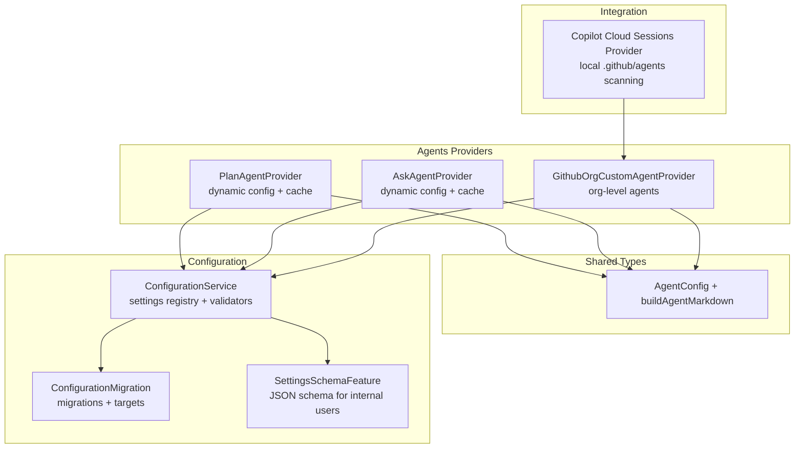
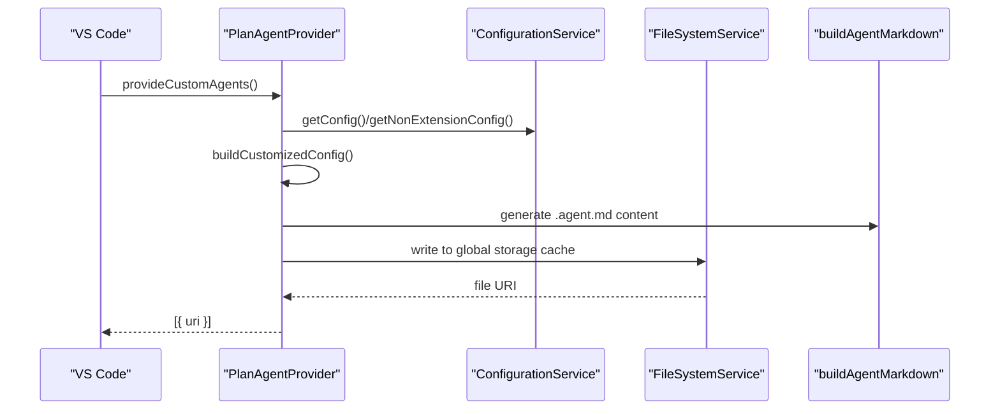
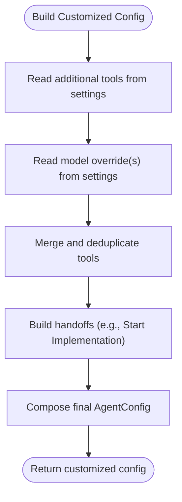
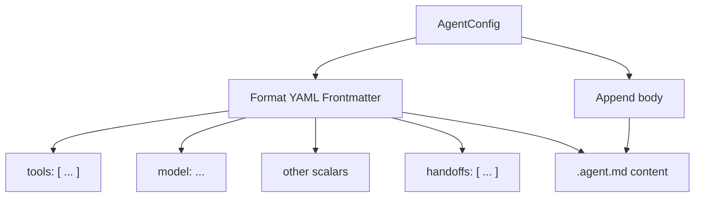
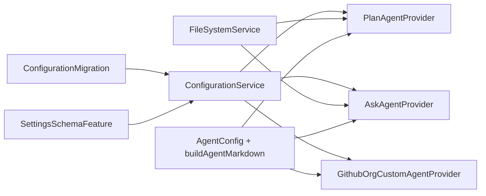

# Agent Configuration & Customization

<cite>
**Referenced Files in This Document**
- [planAgentProvider.ts](file://src/extension/agents/vscode-node/planAgentProvider.ts)
- [askAgentProvider.ts](file://src/extension/agents/vscode-node/askAgentProvider.ts)
- [agentTypes.ts](file://src/extension/agents/vscode-node/agentTypes.ts)
- [configurationMigration.ts](file://src/extension/configuration/vscode-node/configurationMigration.ts)
- [configurationService.ts](file://src/platform/configuration/common/configurationService.ts)
- [settingsSchemaFeature.ts](file://src/extension/settingsSchema/vscode-node/settingsSchemaFeature.ts)
- [create-agent.prompt.md](file://assets/prompts/create-agent.prompt.md)
- [githubOrgCustomAgentProvider.ts](file://src/extension/agents/vscode-node/githubOrgCustomAgentProvider.ts)
- [copilotCloudSessionsProvider.ts](file://src/extension/chatSessions/vscode-node/copilotCloudSessionsProvider.ts)
</cite>

## Table of Contents
1. [Introduction](#introduction)
2. [Project Structure](#project-structure)
3. [Core Components](#core-components)
4. [Architecture Overview](#architecture-overview)
5. [Detailed Component Analysis](#detailed-component-analysis)
6. [Dependency Analysis](#dependency-analysis)
7. [Performance Considerations](#performance-considerations)
8. [Troubleshooting Guide](#troubleshooting-guide)
9. [Conclusion](#conclusion)
10. [Appendices](#appendices)

## Introduction
This document explains the agent configuration and customization mechanisms in the repository. It covers dynamic configuration generation, settings-based customization, runtime parameter adjustments, configuration inheritance patterns, the agent file format (.agent.md), validation and error handling, persistence and migration, and integration with external configuration sources. It also provides practical examples for team-specific, project-specific, and organizational customizations.

## Project Structure
Agent configuration is implemented primarily in the agents providers and shared types, backed by a robust configuration service and migration infrastructure. The key areas include:
- Dynamic agent providers that generate .agent.md content from embedded base configurations and user settings
- Shared agent configuration types and Markdown generator
- Configuration service and migration registry for settings and schema validation
- Organization-level agent providers and cloud session integrations

**Diagram sources**
- [planAgentProvider.ts](file://src/extension/agents/vscode-node/planAgentProvider.ts#L41-L85)
- [askAgentProvider.ts](file://src/extension/agents/vscode-node/askAgentProvider.ts#L42-L75)
- [agentTypes.ts](file://src/extension/agents/vscode-node/agentTypes.ts#L18-L120)
- [configurationService.ts](file://src/platform/configuration/common/configurationService.ts#L448-L535)
- [configurationMigration.ts](file://src/extension/configuration/vscode-node/configurationMigration.ts#L38-L113)
- [settingsSchemaFeature.ts](file://src/extension/settingsSchema/vscode-node/settingsSchemaFeature.ts#L14-L55)
- [copilotCloudSessionsProvider.ts](file://src/extension/chatSessions/vscode-node/copilotCloudSessionsProvider.ts#L638-L674)

**Section sources**
- [planAgentProvider.ts](file://src/extension/agents/vscode-node/planAgentProvider.ts#L1-L243)
- [askAgentProvider.ts](file://src/extension/agents/vscode-node/askAgentProvider.ts#L1-L152)
- [agentTypes.ts](file://src/extension/agents/vscode-node/agentTypes.ts#L1-L121)
- [configurationService.ts](file://src/platform/configuration/common/configurationService.ts#L448-L535)
- [configurationMigration.ts](file://src/extension/configuration/vscode-node/configurationMigration.ts#L1-L181)
- [settingsSchemaFeature.ts](file://src/extension/settingsSchema/vscode-node/settingsSchemaFeature.ts#L1-L56)
- [copilotCloudSessionsProvider.ts](file://src/extension/chatSessions/vscode-node/copilotCloudSessionsProvider.ts#L638-L674)

## Core Components
- AgentConfig and buildAgentMarkdown define the agent schema and generate .agent.md content without requiring external YAML libraries.
- PlanAgentProvider and AskAgentProvider embed base configurations and merge settings-based customizations (tools, model overrides, handoffs).
- ConfigurationService registers settings, validates defaults, and exposes change events for runtime updates.
- ConfigurationMigration handles migration of legacy keys to new ones across global and workspace targets.
- SettingsSchemaFeature publishes a JSON schema for internal users to validate advanced settings.
- GithubOrgCustomAgentProvider generates .agent.md content from organization-provided agent details.
- Copilot Cloud Sessions Provider scans local .github/agents/ for local-only and matching agents.

**Section sources**
- [agentTypes.ts](file://src/extension/agents/vscode-node/agentTypes.ts#L18-L120)
- [planAgentProvider.ts](file://src/extension/agents/vscode-node/planAgentProvider.ts#L19-L85)
- [askAgentProvider.ts](file://src/extension/agents/vscode-node/askAgentProvider.ts#L20-L75)
- [configurationService.ts](file://src/platform/configuration/common/configurationService.ts#L448-L535)
- [configurationMigration.ts](file://src/extension/configuration/vscode-node/configurationMigration.ts#L38-L113)
- [settingsSchemaFeature.ts](file://src/extension/settingsSchema/vscode-node/settingsSchemaFeature.ts#L14-L55)
- [githubOrgCustomAgentProvider.ts](file://src/extension/agents/vscode-node/githubOrgCustomAgentProvider.ts#L118-L156)
- [copilotCloudSessionsProvider.ts](file://src/extension/chatSessions/vscode-node/copilotCloudSessionsProvider.ts#L638-L674)

## Architecture Overview
The system builds agents dynamically at runtime by combining:
- Embedded base configuration objects
- Settings-driven customizations (tools, model overrides)
- Generated .agent.md content via a lightweight Markdown builder
- Persistent caching in global storage for immediate consumption by VS Code’s chat agent system

**Diagram sources**
- [planAgentProvider.ts](file://src/extension/agents/vscode-node/planAgentProvider.ts#L72-L104)
- [agentTypes.ts](file://src/extension/agents/vscode-node/agentTypes.ts#L56-L120)
- [configurationService.ts](file://src/platform/configuration/common/configurationService.ts#L448-L535)

## Detailed Component Analysis

### Dynamic Configuration Generation and Settings-Based Customization
- Base configurations are embedded in providers (PlanAgentProvider and AskAgentProvider) to avoid runtime file loading and YAML parsing dependencies.
- Customization is achieved by reading settings (e.g., additional tools, model overrides) and merging them into the base configuration.
- The providers listen to configuration changes and emit events to refresh agents when relevant settings change.

**Diagram sources**
- [planAgentProvider.ts](file://src/extension/agents/vscode-node/planAgentProvider.ts#L198-L241)
- [askAgentProvider.ts](file://src/extension/agents/vscode-node/askAgentProvider.ts#L129-L150)

**Section sources**
- [planAgentProvider.ts](file://src/extension/agents/vscode-node/planAgentProvider.ts#L19-L85)
- [askAgentProvider.ts](file://src/extension/agents/vscode-node/askAgentProvider.ts#L20-L75)

### Runtime Parameter Adjustment
- Providers subscribe to configuration change events and trigger agent refreshes when settings affecting agents change.
- Model overrides and additional tools are applied at runtime to adjust agent behavior without restarting the extension.

**Section sources**
- [planAgentProvider.ts](file://src/extension/agents/vscode-node/planAgentProvider.ts#L58-L70)
- [askAgentProvider.ts](file://src/extension/agents/vscode-node/askAgentProvider.ts#L59-L65)

### Configuration Inheritance Patterns
- Base configuration objects define shared defaults (name, description, argument hint, target, tools, agents).
- Providers extend base configs with:
  - Additional tools (union with base tools)
  - Optional model overrides
  - Dynamic handoffs (e.g., Plan → Agent handoff with optional model override)
- The merged configuration becomes the source for .agent.md generation.

**Section sources**
- [agentTypes.ts](file://src/extension/agents/vscode-node/agentTypes.ts#L18-L51)
- [planAgentProvider.ts](file://src/extension/agents/vscode-node/planAgentProvider.ts#L198-L241)
- [askAgentProvider.ts](file://src/extension/agents/vscode-node/askAgentProvider.ts#L129-L150)

### Agent File Format (.agent.md)
- .agent.md is generated from AgentConfig using a string-based YAML frontmatter builder.
- Supported frontmatter fields include name, description, argument-hint, tools, model (scalar or list), target, disable-model-invocation, user-invocable, agents, and handoffs.
- Body is appended after the frontmatter boundary.

**Diagram sources**
- [agentTypes.ts](file://src/extension/agents/vscode-node/agentTypes.ts#L56-L120)

**Section sources**
- [agentTypes.ts](file://src/extension/agents/vscode-node/agentTypes.ts#L56-L120)

### Organization-Level Customization
- Organization-provided agents are transformed into .agent.md content with frontmatter fields derived from agent details.
- The generator constructs frontmatter safely, quoting strings and controlling multi-line behavior to ensure compatibility with the custom YAML parser.

**Section sources**
- [githubOrgCustomAgentProvider.ts](file://src/extension/agents/vscode-node/githubOrgCustomAgentProvider.ts#L118-L156)

### Integration with External Configuration Sources
- Local scanning of .github/agents/ enables local-only agents when no remote match exists.
- Providers coordinate with workspace folders and cloud sessions to surface available agents.

**Section sources**
- [copilotCloudSessionsProvider.ts](file://src/extension/chatSessions/vscode-node/copilotCloudSessionsProvider.ts#L638-L674)

### Examples of Configuration Customization
- Team-specific agents: Use settings to add domain-specific tools and override models for the Plan and Ask agents.
- Project-specific configurations: Persist project-level settings; migrations ensure legacy keys are moved to current keys.
- Organizational customizations: Publish agent details via organization repositories; providers generate .agent.md content dynamically.

**Section sources**
- [planAgentProvider.ts](file://src/extension/agents/vscode-node/planAgentProvider.ts#L198-L241)
- [askAgentProvider.ts](file://src/extension/agents/vscode-node/askAgentProvider.ts#L129-L150)
- [configurationMigration.ts](file://src/extension/configuration/vscode-node/configurationMigration.ts#L115-L181)
- [githubOrgCustomAgentProvider.ts](file://src/extension/agents/vscode-node/githubOrgCustomAgentProvider.ts#L118-L156)

## Dependency Analysis
The agent configuration system exhibits low coupling and high cohesion:
- Providers depend on ConfigurationService for settings and on FileSystemService for caching.
- AgentConfig and buildAgentMarkdown are shared utilities with no external dependencies.
- Migration and schema features are orthogonal concerns that enhance reliability and UX.

**Diagram sources**
- [planAgentProvider.ts](file://src/extension/agents/vscode-node/planAgentProvider.ts#L50-L85)
- [askAgentProvider.ts](file://src/extension/agents/vscode-node/askAgentProvider.ts#L51-L75)
- [agentTypes.ts](file://src/extension/agents/vscode-node/agentTypes.ts#L18-L120)
- [configurationMigration.ts](file://src/extension/configuration/vscode-node/configurationMigration.ts#L38-L113)
- [settingsSchemaFeature.ts](file://src/extension/settingsSchema/vscode-node/settingsSchemaFeature.ts#L14-L55)

**Section sources**
- [planAgentProvider.ts](file://src/extension/agents/vscode-node/planAgentProvider.ts#L50-L85)
- [askAgentProvider.ts](file://src/extension/agents/vscode-node/askAgentProvider.ts#L51-L75)
- [agentTypes.ts](file://src/extension/agents/vscode-node/agentTypes.ts#L18-L120)
- [configurationMigration.ts](file://src/extension/configuration/vscode-node/configurationMigration.ts#L38-L113)
- [settingsSchemaFeature.ts](file://src/extension/settingsSchema/vscode-node/settingsSchemaFeature.ts#L14-L55)

## Performance Considerations
- Dynamic generation avoids repeated file I/O by caching .agent.md in global storage.
- Deduplication of tools ensures minimal overhead when merging additional tools.
- Lightweight Markdown builder avoids external YAML dependencies, reducing startup and runtime costs.

[No sources needed since this section provides general guidance]

## Troubleshooting Guide
- Invalid settings: Use the JSON schema published for internal users to validate advanced settings and detect unknown or deprecated keys.
- Legacy keys: Rely on configuration migrations to move values from old keys to new keys across global and workspace targets.
- Agent not refreshing: Verify that configuration change events are firing for the affected settings; providers listen for changes and emit agent refresh signals.
- Organization agents not appearing: Confirm that organization agents are retrievable and that local .github/agents/ scanning is enabled and functional.

**Section sources**
- [settingsSchemaFeature.ts](file://src/extension/settingsSchema/vscode-node/settingsSchemaFeature.ts#L31-L55)
- [configurationMigration.ts](file://src/extension/configuration/vscode-node/configurationMigration.ts#L115-L181)
- [planAgentProvider.ts](file://src/extension/agents/vscode-node/planAgentProvider.ts#L58-L70)
- [copilotCloudSessionsProvider.ts](file://src/extension/chatSessions/vscode-node/copilotCloudSessionsProvider.ts#L638-L674)

## Conclusion
The agent configuration system combines embedded base configurations with settings-driven customization to produce .agent.md files dynamically. It leverages a robust configuration service, migrations, and schema validation to ensure correctness and maintainability. Organization-level customization and local scanning integrate seamlessly, enabling scalable, team-, project-, and organizational-wide agent standardization.

[No sources needed since this section summarizes without analyzing specific files]

## Appendices

### Configuration Validation and Error Handling
- ConfigurationService enforces default parity between code and package.json and registers validators for settings.
- ConfigurationMigration applies safe migrations across targets and logs failures to preserve data integrity.
- SettingsSchemaFeature publishes a JSON schema for internal users to validate advanced settings.

**Section sources**
- [configurationService.ts](file://src/platform/configuration/common/configurationService.ts#L448-L535)
- [configurationMigration.ts](file://src/extension/configuration/vscode-node/configurationMigration.ts#L115-L181)
- [settingsSchemaFeature.ts](file://src/extension/settingsSchema/vscode-node/settingsSchemaFeature.ts#L31-L55)

### Persistence, Versioning, and Migration Strategies
- Agents are persisted as .agent.md files in global storage for fast access.
- Configuration keys are migrated from legacy to current keys with target preservation.
- Organization agents can be cached locally and scanned alongside remote agents.

**Section sources**
- [planAgentProvider.ts](file://src/extension/agents/vscode-node/planAgentProvider.ts#L87-L104)
- [askAgentProvider.ts](file://src/extension/agents/vscode-node/askAgentProvider.ts#L77-L93)
- [configurationMigration.ts](file://src/extension/configuration/vscode-node/configurationMigration.ts#L64-L99)
- [copilotCloudSessionsProvider.ts](file://src/extension/chatSessions/vscode-node/copilotCloudSessionsProvider.ts#L638-L674)

### Creating Custom Agents
- Use the guided prompt to create a custom .agent.md with a clear role, tool preferences, and scope.
- Follow the agent-customization guidelines to ensure effectiveness and consistency.

**Section sources**
- [create-agent.prompt.md](file://assets/prompts/create-agent.prompt.md#L1-L29)