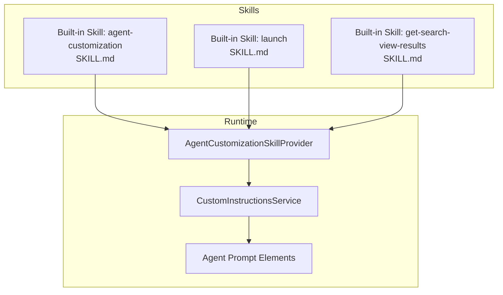
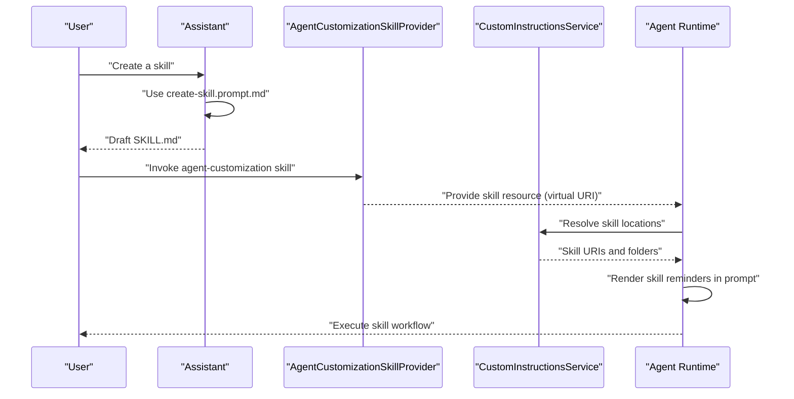
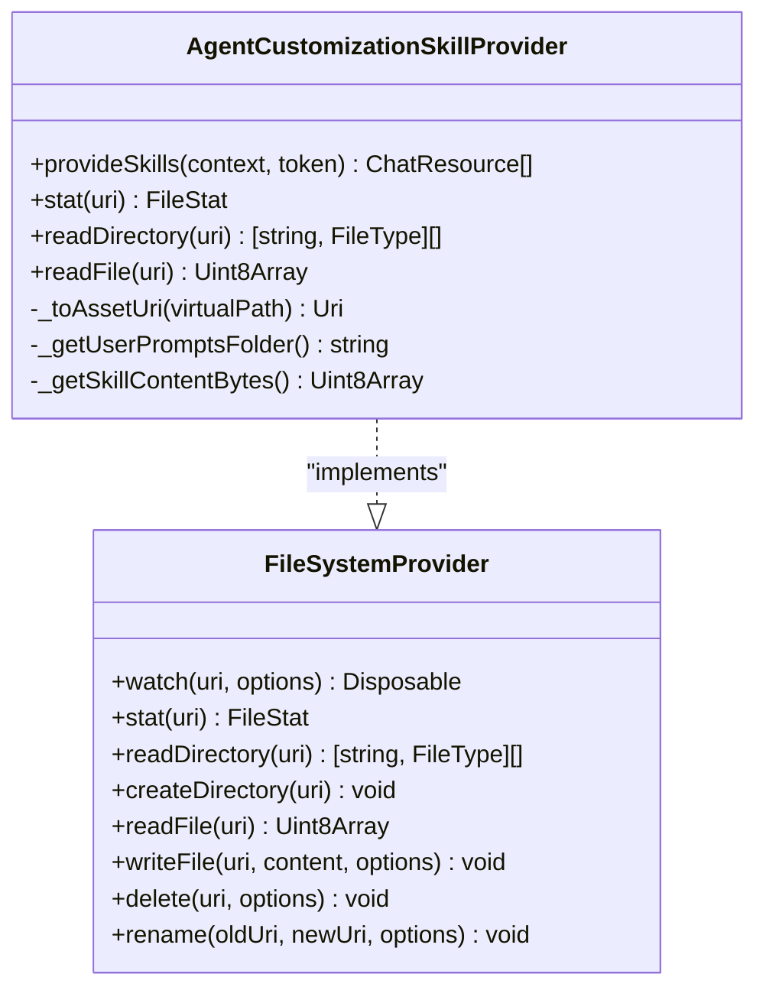
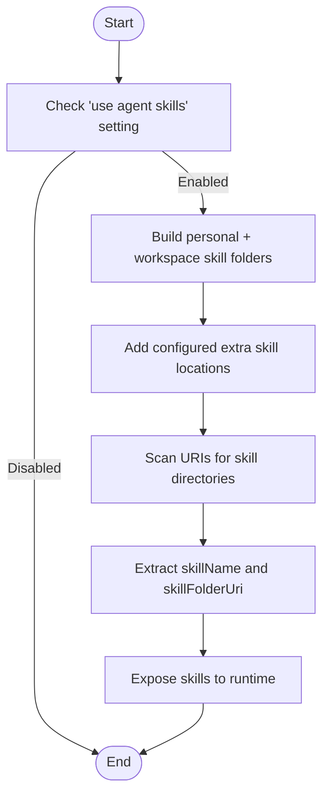
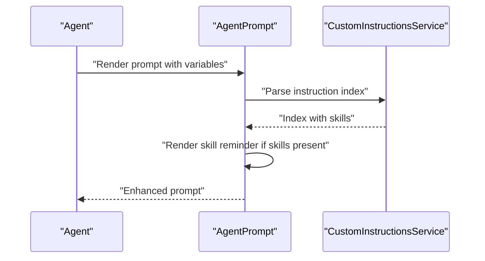
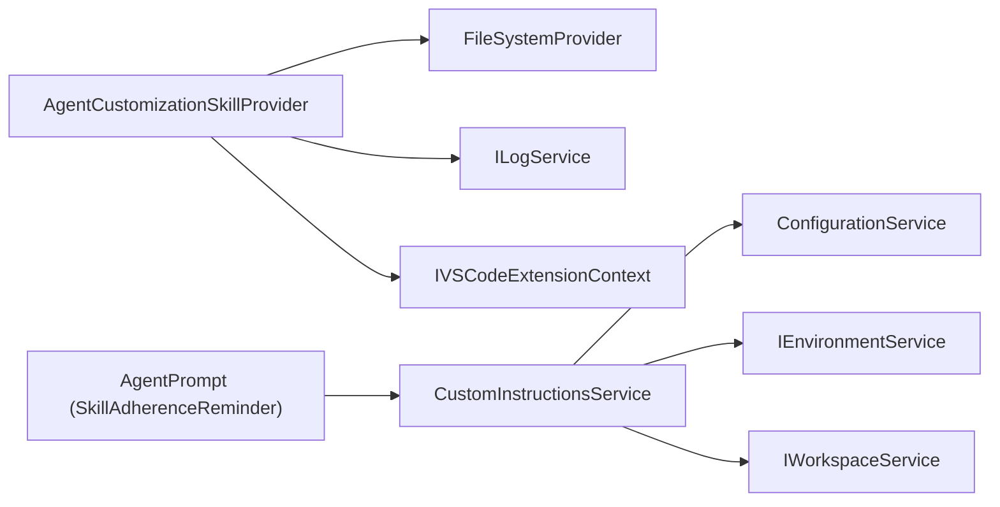

# Agent Skills & Capabilities

<cite>
**Referenced Files in This Document**
- [README.md](file://README.md)
- [create-skill.prompt.md](file://assets/prompts/create-skill.prompt.md)
- [create-agent.prompt.md](file://assets/prompts/create-agent.prompt.md)
- [SKILL.md (agent-customization)](file://assets/prompts/skills/agent-customization/agent-customization/SKILL.md)
- [SKILL.md (get-search-view-results)](file://assets/prompts/skills/get-search-view-results/SKILL.md)
- [SKILL.md (launch)](.agents/skills/launch/SKILL.md)
- [agentCustomizationSkillProvider.ts](file://src/extension/agents/vscode-node/agentCustomizationSkillProvider.ts)
- [customInstructionsService.ts](file://src/platform/customInstructions/common/customInstructionsService.ts)
- [agentPrompt.tsx](file://src/extension/prompts/node/agent/agentPrompt.tsx)
- [testCustomInstructionsService.ts](file://src/platform/test/common/testCustomInstructionsService.ts)
</cite>

## Table of Contents
1. [Introduction](#introduction)
2. [Project Structure](#project-structure)
3. [Core Components](#core-components)
4. [Architecture Overview](#architecture-overview)
5. [Detailed Component Analysis](#detailed-component-analysis)
6. [Dependency Analysis](#dependency-analysis)
7. [Performance Considerations](#performance-considerations)
8. [Troubleshooting Guide](#troubleshooting-guide)
9. [Conclusion](#conclusion)
10. [Appendices](#appendices)

## Introduction
This document explains the agent skills and capabilities system that enables agents to perform specialized tasks through modular, reusable workflows. It covers the skill architecture, discovery, registration, execution, configuration, composition, and best practices for performance and error handling. Practical examples include built-in skills such as agent customization guidance and VS Code UI automation, along with patterns for integrating specialized tools and composing multiple skills to achieve complex outcomes.

## Project Structure
The skills system centers around:
- Built-in and user-defined skills packaged as SKILL.md files
- A skill provider that registers and serves skills to the agent runtime
- A custom instructions service that discovers skills from configured locations
- Prompt elements that guide the model to adhere to discovered skills
- Templates and prompts to author new skills and agents

**Diagram sources**
- [agentCustomizationSkillProvider.ts](file://src/extension/agents/vscode-node/agentCustomizationSkillProvider.ts#L29-L56)
- [customInstructionsService.ts](file://src/platform/customInstructions/common/customInstructionsService.ts#L212-L275)
- [agentPrompt.tsx](file://src/extension/prompts/node/agent/agentPrompt.tsx#L501-L521)

**Section sources**
- [README.md](file://README.md)
- [agentCustomizationSkillProvider.ts](file://src/extension/agents/vscode-node/agentCustomizationSkillProvider.ts#L29-L56)
- [customInstructionsService.ts](file://src/platform/customInstructions/common/customInstructionsService.ts#L212-L275)
- [agentPrompt.tsx](file://src/extension/prompts/node/agent/agentPrompt.tsx#L501-L521)

## Core Components
- Skill definition and packaging: SKILL.md files define a skill’s name, description, metadata, and step-by-step workflow. They can include tool allowances and references to assets.
- Built-in skill provider: A VS Code ChatSkillProvider and FileSystemProvider that registers and serves built-in skills to the agent runtime.
- Discovery and indexing: A custom instructions service scans configured locations for skills and exposes them to the agent.
- Prompt integration: Prompt elements remind the model to consult discovered skills and integrate their guidance into reasoning and actions.

Practical examples:
- Agent customization skill: Guides creation, review, and troubleshooting of agent customization primitives.
- VS Code UI automation skill: Automates VS Code Insiders via agent-browser and Chrome DevTools Protocol.
- Search view results skill: Retrieves current search results using a VS Code command.

**Section sources**
- [SKILL.md (agent-customization)](file://assets/prompts/skills/agent-customization/agent-customization/SKILL.md#L1-L83)
- [SKILL.md (launch)](.agents/skills/launch/SKILL.md#L1-L265)
- [SKILL.md (get-search-view-results)](file://assets/prompts/skills/get-search-view-results/SKILL.md#L1-L10)
- [agentCustomizationSkillProvider.ts](file://src/extension/agents/vscode-node/agentCustomizationSkillProvider.ts#L29-L56)
- [customInstructionsService.ts](file://src/platform/customInstructions/common/customInstructionsService.ts#L212-L275)
- [agentPrompt.tsx](file://src/extension/prompts/node/agent/agentPrompt.tsx#L501-L521)

## Architecture Overview
The skills system integrates the following layers:
- Authoring: Users and assistants create SKILL.md files using guided prompts and templates.
- Registration: Built-in skills are registered via a skill provider that also acts as a read-only file system provider.
- Discovery: The custom instructions service enumerates configured skill locations and extracts skill metadata.
- Execution: Prompt elements surface discovered skills to the model, which then follows the skill’s workflow to perform tasks.

**Diagram sources**
- [create-skill.prompt.md](file://assets/prompts/create-skill.prompt.md#L1-L29)
- [agentCustomizationSkillProvider.ts](file://src/extension/agents/vscode-node/agentCustomizationSkillProvider.ts#L236-L252)
- [customInstructionsService.ts](file://src/platform/customInstructions/common/customInstructionsService.ts#L212-L275)
- [agentPrompt.tsx](file://src/extension/prompts/node/agent/agentPrompt.tsx#L501-L521)

## Detailed Component Analysis

### Built-in Agent Customization Skill Provider
The provider registers a virtual scheme and file system to serve the built-in agent-customization skill. It dynamically injects the user prompts folder path into the skill template and exposes it as a chat resource.

**Diagram sources**
- [agentCustomizationSkillProvider.ts](file://src/extension/agents/vscode-node/agentCustomizationSkillProvider.ts#L29-L56)
- [agentCustomizationSkillProvider.ts](file://src/extension/agents/vscode-node/agentCustomizationSkillProvider.ts#L91-L177)

**Section sources**
- [agentCustomizationSkillProvider.ts](file://src/extension/agents/vscode-node/agentCustomizationSkillProvider.ts#L29-L56)
- [agentCustomizationSkillProvider.ts](file://src/extension/agents/vscode-node/agentCustomizationSkillProvider.ts#L148-L177)
- [agentCustomizationSkillProvider.ts](file://src/extension/agents/vscode-node/agentCustomizationSkillProvider.ts#L202-L234)
- [agentCustomizationSkillProvider.ts](file://src/extension/agents/vscode-node/agentCustomizationSkillProvider.ts#L236-L252)

### Skill Discovery and Indexing
The custom instructions service discovers skills from:
- Personal and workspace skill folders
- Additional locations configured via settings
It identifies skill directories and exposes them to the agent runtime.

**Diagram sources**
- [customInstructionsService.ts](file://src/platform/customInstructions/common/customInstructionsService.ts#L212-L275)
- [customInstructionsService.ts](file://src/platform/customInstructions/common/customInstructionsService.ts#L527-L543)

**Section sources**
- [customInstructionsService.ts](file://src/platform/customInstructions/common/customInstructionsService.ts#L212-L275)
- [customInstructionsService.ts](file://src/platform/customInstructions/common/customInstructionsService.ts#L527-L543)

### Prompt Integration and Skill Adherence Reminder
When skills are available, prompt elements render reminders instructing the model to follow discovered skills. This ensures the agent consistently applies curated workflows.

**Diagram sources**
- [agentPrompt.tsx](file://src/extension/prompts/node/agent/agentPrompt.tsx#L501-L521)
- [customInstructionsService.ts](file://src/platform/customInstructions/common/customInstructionsService.ts#L516-L519)

**Section sources**
- [agentPrompt.tsx](file://src/extension/prompts/node/agent/agentPrompt.tsx#L501-L521)
- [customInstructionsService.ts](file://src/platform/customInstructions/common/customInstructionsService.ts#L516-L519)

### Built-in Skills Examples

#### Agent Customization Skill
Guides creation, updates, and troubleshooting of customization primitives (.instructions.md, .prompt.md, .agent.md, SKILL.md, copilot-instructions.md, AGENTS.md). Includes decision flow, quick reference, creation process, edge cases, and pitfalls.

**Section sources**
- [SKILL.md (agent-customization)](file://assets/prompts/skills/agent-customization/agent-customization/SKILL.md#L1-L83)

#### VS Code UI Automation Skill (Launch)
Enables automation of VS Code Insiders using agent-browser and Chrome DevTools Protocol. Covers prerequisites, core workflow, connecting, tab management, launching extensions for debugging, interacting with Monaco editor, troubleshooting, and cleanup.

**Section sources**
- [.agents/skills/launch/SKILL.md](file://.agents/skills/launch/SKILL.md#L1-L265)

#### Get Search View Results Skill
Provides a concise workflow to retrieve current search results from the VS Code Search view using a specific command executed via a tool.

**Section sources**
- [SKILL.md (get-search-view-results)](file://assets/prompts/skills/get-search-view-results/SKILL.md#L1-L10)

### Skill Composition Patterns
Multiple skills can be composed to achieve complex tasks:
- Multi-stage workflows: Use a custom agent for context isolation and staged tool restrictions, while leveraging skills for domain-specific steps.
- Asset bundling: Skills can bundle scripts and templates referenced by the workflow.
- Tool orchestration: Skills can declare allowed tools and sequences, enabling safe and repeatable automation.

Composition guidelines:
- Prefer skills for on-demand, reusable workflows with bundled assets.
- Use prompts for single-focused tasks with parameterized inputs.
- Use custom agents when context isolation or different tool restrictions per stage are required.

**Section sources**
- [SKILL.md (agent-customization)](file://assets/prompts/skills/agent-customization/agent-customization/SKILL.md#L66-L75)

### Skill Configuration and Customization
- Locations: Personal and workspace skill folders are scanned by default; additional locations can be configured via settings.
- Frontmatter: Use meaningful descriptions and metadata to improve discovery and adherence.
- Asset organization: Keep related assets under the skill directory for portability and clarity.

Configuration highlights:
- Personal and workspace skill folders are enumerated and scanned for top-level skill directories.
- Configured extra locations support absolute, tilde-expanded, and workspace-relative paths.
- Skill name and folder are derived from the first path segment under the skill root.

**Section sources**
- [customInstructionsService.ts](file://src/platform/customInstructions/common/customInstructionsService.ts#L212-L275)
- [customInstructionsService.ts](file://src/platform/customInstructions/common/customInstructionsService.ts#L527-L543)
- [SKILL.md (agent-customization)](file://assets/prompts/skills/agent-customization/agent-customization/SKILL.md#L76-L83)

### Skill Development Framework
- Authoring: Use the guided prompt to draft SKILL.md files, iterating on clarity and completeness.
- Templates: Follow the agent-customization skill’s decision flow and reference materials.
- Validation: Ensure frontmatter syntax, meaningful descriptions, and correct asset placement.

Authoring resources:
- Create skill prompt: Guides multi-step workflow extraction and iteration.
- Agent customization skill: Provides templates, decision flow, and pitfalls.

**Section sources**
- [create-skill.prompt.md](file://assets/prompts/create-skill.prompt.md#L1-L29)
- [SKILL.md (agent-customization)](file://assets/prompts/skills/agent-customization/agent-customization/SKILL.md#L36-L83)

## Dependency Analysis
The system exhibits clear separation of concerns:
- The provider depends on the extension context and logs, and implements both a chat skill provider and a file system provider.
- The custom instructions service depends on configuration, environment, and workspace services to resolve skill locations.
- Prompt elements depend on the custom instructions service to render skill reminders.

**Diagram sources**
- [agentCustomizationSkillProvider.ts](file://src/extension/agents/vscode-node/agentCustomizationSkillProvider.ts#L40-L56)
- [customInstructionsService.ts](file://src/platform/customInstructions/common/customInstructionsService.ts#L194-L210)
- [agentPrompt.tsx](file://src/extension/prompts/node/agent/agentPrompt.tsx#L501-L521)

**Section sources**
- [agentCustomizationSkillProvider.ts](file://src/extension/agents/vscode-node/agentCustomizationSkillProvider.ts#L40-L56)
- [customInstructionsService.ts](file://src/platform/customInstructions/common/customInstructionsService.ts#L194-L210)
- [agentPrompt.tsx](file://src/extension/prompts/node/agent/agentPrompt.tsx#L501-L521)

## Performance Considerations
- Minimize repeated scanning: Cache resolved skill URIs and folders to avoid redundant scans.
- Efficient discovery: Limit configured extra skill locations to necessary paths and avoid overly broad globs.
- Lazy loading: Serve skill content on demand and avoid heavy precomputation.
- Logging overhead: Use trace-level logs sparingly during normal operation; reserve errors for exceptional conditions.

[No sources needed since this section provides general guidance]

## Troubleshooting Guide
Common issues and resolutions:
- Skill not discovered
  - Verify the “use agent skills” setting is enabled.
  - Confirm the skill resides under a personal/workspace skill folder or a configured extra location.
  - Ensure the skill directory contains a SKILL.md file with valid frontmatter.
- Frontmatter errors
  - Use proper YAML syntax and quoting for values containing colons.
  - Match the skill name with the directory name.
- Tool restrictions
  - Review the skill’s declared allowed tools and ensure they are available in the environment.
- Prompt integration
  - If the model ignores a skill, ensure the description includes trigger phrases and the skill appears in the instruction index.

**Section sources**
- [customInstructionsService.ts](file://src/platform/customInstructions/common/customInstructionsService.ts#L212-L275)
- [SKILL.md (agent-customization)](file://assets/prompts/skills/agent-customization/agent-customization/SKILL.md#L76-L83)
- [agentPrompt.tsx](file://src/extension/prompts/node/agent/agentPrompt.tsx#L501-L521)

## Conclusion
The skills and capabilities system provides a robust, modular foundation for extending agent behavior. Through SKILL.md-based workflows, a dedicated provider, discovery service, and prompt integration, agents can reliably execute specialized tasks, compose multiple skills, and adapt to diverse use cases. Following the provided patterns and configurations ensures maintainability, discoverability, and performance.

[No sources needed since this section summarizes without analyzing specific files]

## Appendices

### Appendix A: Example Authoring Prompts
- Create a skill: Guides multi-step workflow extraction and iteration.
- Create an agent: Helps generalize specialized agent behavior into a reusable .agent.md.

**Section sources**
- [create-skill.prompt.md](file://assets/prompts/create-skill.prompt.md#L1-L29)
- [create-agent.prompt.md](file://assets/prompts/create-agent.prompt.md#L1-L29)

### Appendix B: Test Utilities for Skills
Mock implementations demonstrate how to recognize skill files, compute skill names and folders, and resolve SKILL.md URIs for testing.

**Section sources**
- [testCustomInstructionsService.ts](file://src/platform/test/common/testCustomInstructionsService.ts#L65-L99)