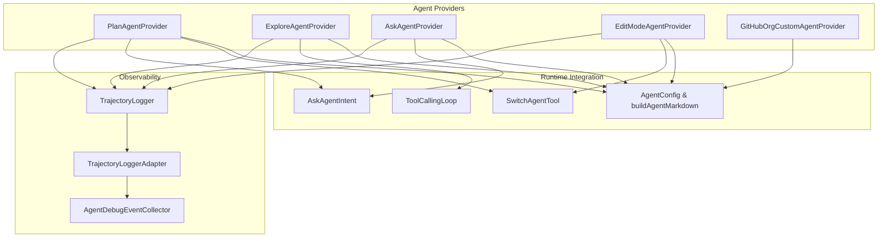
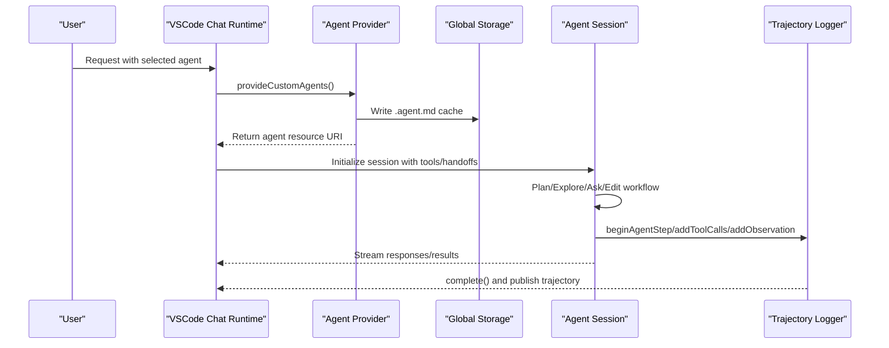
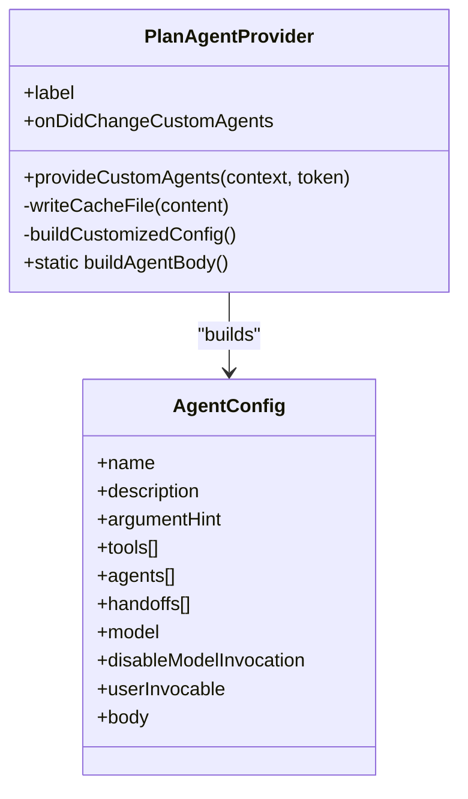
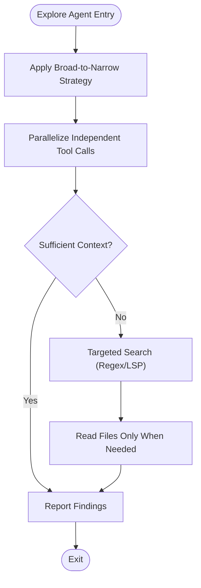
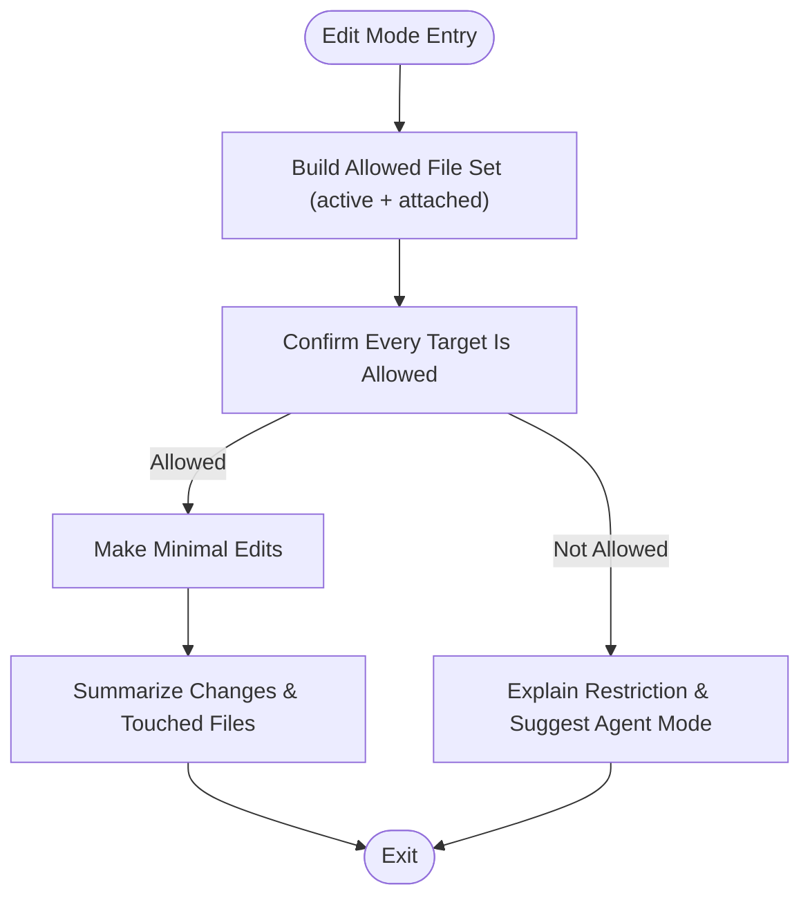
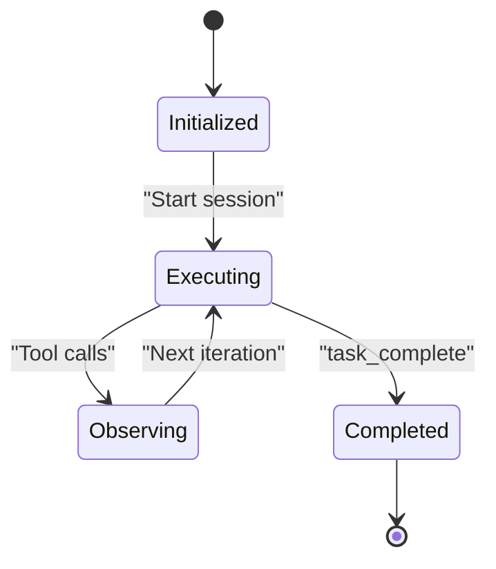
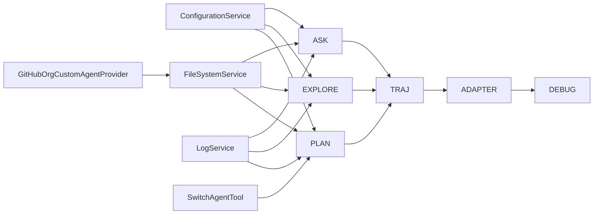

# Agent Types & Roles

<cite>
**Referenced Files in This Document**
- [planAgentProvider.ts](file://src/extension/agents/vscode-node/planAgentProvider.ts)
- [exploreAgentProvider.ts](file://src/extension/agents/vscode-node/exploreAgentProvider.ts)
- [askAgentProvider.ts](file://src/extension/agents/vscode-node/askAgentProvider.ts)
- [editModeAgentProvider.ts](file://src/extension/agents/vscode-node/editModeAgentProvider.ts)
- [agentTypes.ts](file://src/extension/agents/vscode-node/agentTypes.ts)
- [switchAgentTool.ts](file://src/extension/tools/vscode-node/switchAgentTool.ts)
- [trajectoryLogger.ts](file://src/platform/trajectory/node/trajectoryLogger.ts)
- [trajectoryLoggerAdapter.ts](file://src/platform/trajectory/node/trajectoryLoggerAdapter.ts)
- [agentDebugEventCollector.ts](file://src/extension/agentDebug/node/agentDebugEventCollector.ts)
- [toolCallingLoop.ts](file://src/extension/intents/node/toolCallingLoop.ts)
- [askAgentIntent.ts](file://src/extension/intents/node/askAgentIntent.ts)
- [searchSubagentToolCallingLoop.ts](file://src/extension/prompt/node/searchSubagentToolCallingLoop.ts)
- [githubOrgCustomAgentProvider.ts](file://src/extension/agents/vscode-node/githubOrgCustomAgentProvider.ts)
- [SKILL.md](file://assets/prompts/skills/agent-customization/SKILL.md)
</cite>

## Table of Contents
1. [Introduction](#introduction)
2. [Project Structure](#project-structure)
3. [Core Components](#core-components)
4. [Architecture Overview](#architecture-overview)
5. [Detailed Component Analysis](#detailed-component-analysis)
6. [Dependency Analysis](#dependency-analysis)
7. [Performance Considerations](#performance-considerations)
8. [Troubleshooting Guide](#troubleshooting-guide)
9. [Conclusion](#conclusion)

## Introduction
This document explains the agent types and roles within the VSCode Copilot Chat system. It covers Plan agents for strategic planning, Explore agents for research and investigation, Edit Mode agents for code modification, and Ask agents for direct question answering. It also documents agent selection criteria, decision-making processes, lifecycle stages, specialization patterns, and practical implementation examples derived from the repository’s agent providers and related infrastructure.

## Project Structure
The agent ecosystem is implemented as custom agent providers that generate .agent.md files consumed by the VSCode chat runtime. Providers encapsulate:
- Agent configuration (name, description, tools, handoffs, model overrides)
- Dynamic customization based on settings
- Persistent caching of generated agent definitions
- Optional integration with subagents and tool orchestration



**Diagram sources**
- [planAgentProvider.ts](file://src/extension/agents/vscode-node/planAgentProvider.ts#L41-L85)
- [exploreAgentProvider.ts](file://src/extension/agents/vscode-node/exploreAgentProvider.ts#L50-L83)
- [askAgentProvider.ts](file://src/extension/agents/vscode-node/askAgentProvider.ts#L42-L75)
- [editModeAgentProvider.ts](file://src/extension/agents/vscode-node/editModeAgentProvider.ts#L49-L89)
- [agentTypes.ts](file://src/extension/agents/vscode-node/agentTypes.ts#L22-L120)
- [switchAgentTool.ts](file://src/extension/tools/vscode-node/switchAgentTool.ts#L28-L55)
- [askAgentIntent.ts](file://src/extension/intents/node/askAgentIntent.ts#L98-L106)
- [toolCallingLoop.ts](file://src/extension/intents/node/toolCallingLoop.ts#L368-L397)
- [trajectoryLogger.ts](file://src/platform/trajectory/node/trajectoryLogger.ts#L71-L108)
- [trajectoryLoggerAdapter.ts](file://src/platform/trajectory/node/trajectoryLoggerAdapter.ts#L322-L346)
- [agentDebugEventCollector.ts](file://src/extension/agentDebug/node/agentDebugEventCollector.ts#L250-L294)

**Section sources**
- [planAgentProvider.ts](file://src/extension/agents/vscode-node/planAgentProvider.ts#L1-L243)
- [exploreAgentProvider.ts](file://src/extension/agents/vscode-node/exploreAgentProvider.ts#L1-L149)
- [askAgentProvider.ts](file://src/extension/agents/vscode-node/askAgentProvider.ts#L1-L152)
- [editModeAgentProvider.ts](file://src/extension/agents/vscode-node/editModeAgentProvider.ts#L1-L89)
- [agentTypes.ts](file://src/extension/agents/vscode-node/agentTypes.ts#L1-L121)

## Core Components
- AgentConfig: Defines the schema for agent frontmatter (name, description, tools, agents, handoffs, model, flags) and a builder that emits YAML frontmatter + body.
- DEFAULT_READ_TOOLS: Shared read-only tool set used across agents.
- Provider classes:
  - PlanAgentProvider: Generates a planning agent with dynamic tools and handoffs to an implementation agent.
  - ExploreAgentProvider: Generates a read-only subagent optimized for fast search and Q&A.
  - AskAgentProvider: Generates a read-only agent for Q&A and explanations.
  - EditModeAgentProvider: Generates a focused editing agent restricted to active and attached files.
- SwitchAgentTool: Enables switching to a named agent (e.g., Plan) from within a conversation.
- Trajectory logging: Captures agent steps, tool calls, observations, and subagent references for observability and debugging.

**Section sources**
- [agentTypes.ts](file://src/extension/agents/vscode-node/agentTypes.ts#L9-L34)
- [agentTypes.ts](file://src/extension/agents/vscode-node/agentTypes.ts#L40-L50)
- [agentTypes.ts](file://src/extension/agents/vscode-node/agentTypes.ts#L56-L120)
- [planAgentProvider.ts](file://src/extension/agents/vscode-node/planAgentProvider.ts#L19-L32)
- [exploreAgentProvider.ts](file://src/extension/agents/vscode-node/exploreAgentProvider.ts#L30-L41)
- [askAgentProvider.ts](file://src/extension/agents/vscode-node/askAgentProvider.ts#L20-L32)
- [editModeAgentProvider.ts](file://src/extension/agents/vscode-node/editModeAgentProvider.ts#L14-L47)
- [switchAgentTool.ts](file://src/extension/tools/vscode-node/switchAgentTool.ts#L28-L55)
- [trajectoryLogger.ts](file://src/platform/trajectory/node/trajectoryLogger.ts#L71-L108)

## Architecture Overview
The agent lifecycle spans initialization, customization, execution, and completion. Providers generate .agent.md files and cache them. During execution, agents may:
- Invoke tools (search, read, web, memory, etc.)
- Delegate to subagents (e.g., Explore)
- Transition to other agents (handoffs)
- Persist results and maintain trajectories for observability



**Diagram sources**
- [planAgentProvider.ts](file://src/extension/agents/vscode-node/planAgentProvider.ts#L72-L85)
- [exploreAgentProvider.ts](file://src/extension/agents/vscode-node/exploreAgentProvider.ts#L75-L83)
- [askAgentProvider.ts](file://src/extension/agents/vscode-node/askAgentProvider.ts#L67-L75)
- [trajectoryLogger.ts](file://src/platform/trajectory/node/trajectoryLogger.ts#L71-L92)

## Detailed Component Analysis

### Plan Agent
Responsibilities:
- Research and outline multi-step plans
- Coordinate with Explore subagents for discovery
- Clarify ambiguity with askQuestions tool
- Persist plan to memory and offer handoffs to an implementation agent

Capabilities:
- Tools: read-only tools + agent (subagent invocation)
- Handoffs: Start Implementation (to agent), Open in Editor (to agent)
- Model override: configurable default and implementation model

Use cases:
- Feature design and refactoring planning
- Multi-area investigations requiring parallel subagents
- Collaborative planning with user clarification

Implementation highlights:
- Dynamic tool addition and deduplication
- Dynamic handoff generation with optional model override
- Embedded workflow and style guide for plan artifacts



**Diagram sources**
- [planAgentProvider.ts](file://src/extension/agents/vscode-node/planAgentProvider.ts#L41-L85)
- [agentTypes.ts](file://src/extension/agents/vscode-node/agentTypes.ts#L22-L34)

**Section sources**
- [planAgentProvider.ts](file://src/extension/agents/vscode-node/planAgentProvider.ts#L19-L32)
- [planAgentProvider.ts](file://src/extension/agents/vscode-node/planAgentProvider.ts#L106-L196)
- [planAgentProvider.ts](file://src/extension/agents/vscode-node/planAgentProvider.ts#L198-L241)
- [agentTypes.ts](file://src/extension/agents/vscode-node/agentTypes.ts#L40-L50)

### Explore Agent
Responsibilities:
- Fast, read-only exploration of the codebase
- Autonomous research using broad-to-narrow search strategies
- Parallelization and targeted searches for speed

Capabilities:
- Tools: DEFAULT_READ_TOOLS
- Model: prioritized fallback list or configured model
- Not user-invocable (subagent)

Use cases:
- Investigating ambiguous tasks
- Finding analogous features and implementation templates
- Supporting Plan agent discovery phase

Implementation highlights:
- Speed-first principles: parallelize independent tool calls, stop early with sufficient context
- Broad-to-narrow search strategy with LSP usages and glob/semantic search



**Diagram sources**
- [exploreAgentProvider.ts](file://src/extension/agents/vscode-node/exploreAgentProvider.ts#L103-L133)
- [agentTypes.ts](file://src/extension/agents/vscode-node/agentTypes.ts#L40-L50)

**Section sources**
- [exploreAgentProvider.ts](file://src/extension/agents/vscode-node/exploreAgentProvider.ts#L30-L41)
- [exploreAgentProvider.ts](file://src/extension/agents/vscode-node/exploreAgentProvider.ts#L103-L133)
- [exploreAgentProvider.ts](file://src/extension/agents/vscode-node/exploreAgentProvider.ts#L135-L147)

### Ask Agent
Responsibilities:
- Answer questions, explain code, and provide information
- Strictly read-only; no modifications to the workspace

Capabilities:
- Tools: DEFAULT_READ_TOOLS + mermaid rendering
- Additional tools: configurable via settings
- Model override: configurable

Use cases:
- Codebase Q&A
- Concept explanations
- Architecture and debugging guidance

Implementation highlights:
- Workflow: Understand → Research → Clarify → Answer
- Always includes askQuestions tool for ambiguity resolution

```mermaid
sequenceDiagram
participant User as "User"
participant Ask as "AskAgentProvider"
participant Intent as "AskAgentIntent"
participant Loop as "ToolCallingLoop"
User->>Ask : provideCustomAgents()
Ask-->>User : .agent.md resource
User->>Intent : Submit request
Intent->>Loop : Execute tool calls (search/read)
Loop-->>Intent : Results
Intent-->>User : Answer with references
```

**Diagram sources**
- [askAgentProvider.ts](file://src/extension/agents/vscode-node/askAgentProvider.ts#L67-L75)
- [askAgentIntent.ts](file://src/extension/intents/node/askAgentIntent.ts#L98-L106)
- [toolCallingLoop.ts](file://src/extension/intents/node/toolCallingLoop.ts#L368-L397)

**Section sources**
- [askAgentProvider.ts](file://src/extension/agents/vscode-node/askAgentProvider.ts#L20-L32)
- [askAgentProvider.ts](file://src/extension/agents/vscode-node/askAgentProvider.ts#L95-L127)
- [askAgentProvider.ts](file://src/extension/agents/vscode-node/askAgentProvider.ts#L129-L150)
- [askAgentIntent.ts](file://src/extension/intents/node/askAgentIntent.ts#L98-L106)

### Edit Mode Agent
Responsibilities:
- Edit-only mode restricted to the active file and explicitly attached files
- Enforce allowlist; prevent changes outside the allowlist
- Suggest continuing in unrestricted Agent Mode when needed

Capabilities:
- Tools: read, edit
- Handoff: Continue with Agent Mode

Use cases:
- Small, scoped edits within current context
- Safe editing when broader access is undesired

Implementation highlights:
- Strict allowlist enforcement
- Clear workflow: build allowed set → confirm targets → minimal edits → summarize and suggest continuation



**Diagram sources**
- [editModeAgentProvider.ts](file://src/extension/agents/vscode-node/editModeAgentProvider.ts#L14-L47)

**Section sources**
- [editModeAgentProvider.ts](file://src/extension/agents/vscode-node/editModeAgentProvider.ts#L14-L47)
- [editModeAgentProvider.ts](file://src/extension/agents/vscode-node/editModeAgentProvider.ts#L49-L89)

### Agent Selection Criteria and Decision-Making
- Plan agent: Choose when a multi-step plan is needed, especially for ambiguous or complex tasks. It coordinates Explore subagents and offers handoffs to an implementation agent.
- Explore agent: Choose when fast, autonomous research is required; often invoked by Plan.
- Ask agent: Choose for strictly read-only Q&A and explanations; integrates askQuestions to reduce ambiguity.
- Edit Mode agent: Choose for small, scoped edits within the active file and attached files; suggests continuing in Agent Mode otherwise.

Decision flow reference:
- Workspace Instructions, File Instructions, MCP, Hooks, Custom Agents, Prompts, Skills

**Section sources**
- [SKILL.md](file://assets/prompts/skills/agent-customization/SKILL.md#L8-L22)
- [planAgentProvider.ts](file://src/extension/agents/vscode-node/planAgentProvider.ts#L106-L196)
- [exploreAgentProvider.ts](file://src/extension/agents/vscode-node/exploreAgentProvider.ts#L103-L133)
- [askAgentProvider.ts](file://src/extension/agents/vscode-node/askAgentProvider.ts#L95-L127)
- [editModeAgentProvider.ts](file://src/extension/agents/vscode-node/editModeAgentProvider.ts#L14-L47)

### Implementation Examples
- Plan agent processing:
  - Provider builds a customized config with dynamic tools and handoffs.
  - Generates .agent.md and caches it.
  - On execution, invokes Explore subagents and persists plan to memory.
- Explore agent processing:
  - Provider selects model priority and writes .agent.md.
  - Execution follows broad-to-narrow search with parallelization and targeted reads.
- Ask agent processing:
  - Provider merges additional tools and model overrides.
  - Execution uses ToolCallingLoop to search/read and answer with references.
- Edit Mode processing:
  - Provider enforces allowlist and suggests continuing in Agent Mode when needed.

**Section sources**
- [planAgentProvider.ts](file://src/extension/agents/vscode-node/planAgentProvider.ts#L72-L85)
- [exploreAgentProvider.ts](file://src/extension/agents/vscode-node/exploreAgentProvider.ts#L75-L83)
- [askAgentProvider.ts](file://src/extension/agents/vscode-node/askAgentProvider.ts#L67-L75)
- [editModeAgentProvider.ts](file://src/extension/agents/vscode-node/editModeAgentProvider.ts#L63-L75)

### Agent Lifecycle
- Initialization: Provider constructs AgentConfig, builds body, and writes .agent.md to global storage.
- Execution: Agent runs tool loops, may invoke subagents, and updates trajectory logs.
- Completion: Agent streams results; trajectory is finalized and published.



**Diagram sources**
- [trajectoryLogger.ts](file://src/platform/trajectory/node/trajectoryLogger.ts#L71-L108)
- [trajectoryLoggerAdapter.ts](file://src/platform/trajectory/node/trajectoryLoggerAdapter.ts#L322-L346)
- [toolCallingLoop.ts](file://src/extension/intents/node/toolCallingLoop.ts#L368-L397)

**Section sources**
- [trajectoryLogger.ts](file://src/platform/trajectory/node/trajectoryLogger.ts#L71-L108)
- [trajectoryLoggerAdapter.ts](file://src/platform/trajectory/node/trajectoryLoggerAdapter.ts#L322-L346)
- [toolCallingLoop.ts](file://src/extension/intents/node/toolCallingLoop.ts#L368-L397)

### Specialization Patterns and Adaptation
- Plan agent specialization:
  - Adds tools dynamically based on settings.
  - Generates handoffs with optional model overrides for implementation.
  - Encourages parallel Explore subagents for multi-area tasks.
- Explore agent specialization:
  - Uses a fallback model list or configured model.
  - Emphasizes speed-first strategies and targeted searches.
- Ask agent specialization:
  - Merges additional tools and model overrides from configuration.
  - Always includes askQuestions to reduce ambiguity.
- Edit Mode specialization:
  - Enforces strict allowlist and suggests continuing in Agent Mode when broader access is needed.

**Section sources**
- [planAgentProvider.ts](file://src/extension/agents/vscode-node/planAgentProvider.ts#L198-L241)
- [exploreAgentProvider.ts](file://src/extension/agents/vscode-node/exploreAgentProvider.ts#L135-L147)
- [askAgentProvider.ts](file://src/extension/agents/vscode-node/askAgentProvider.ts#L129-L150)
- [editModeAgentProvider.ts](file://src/extension/agents/vscode-node/editModeAgentProvider.ts#L14-L47)

## Dependency Analysis
- Providers depend on:
  - Configuration service for settings-driven customization
  - File system service for caching .agent.md
  - Logging service for trace-level diagnostics
- Trajectory logger and adapter capture tool calls, observations, and subagent references for observability.
- SwitchAgentTool enables runtime switching to a named agent (e.g., Plan).
- GitHubOrgCustomAgentProvider demonstrates organizational agent distribution and caching.



**Diagram sources**
- [planAgentProvider.ts](file://src/extension/agents/vscode-node/planAgentProvider.ts#L50-L70)
- [exploreAgentProvider.ts](file://src/extension/agents/vscode-node/exploreAgentProvider.ts#L59-L73)
- [askAgentProvider.ts](file://src/extension/agents/vscode-node/askAgentProvider.ts#L51-L65)
- [trajectoryLogger.ts](file://src/platform/trajectory/node/trajectoryLogger.ts#L71-L108)
- [trajectoryLoggerAdapter.ts](file://src/platform/trajectory/node/trajectoryLoggerAdapter.ts#L322-L346)
- [agentDebugEventCollector.ts](file://src/extension/agentDebug/node/agentDebugEventCollector.ts#L250-L294)
- [switchAgentTool.ts](file://src/extension/tools/vscode-node/switchAgentTool.ts#L28-L55)
- [githubOrgCustomAgentProvider.ts](file://src/extension/agents/vscode-node/githubOrgCustomAgentProvider.ts#L20-L33)

**Section sources**
- [planAgentProvider.ts](file://src/extension/agents/vscode-node/planAgentProvider.ts#L50-L70)
- [exploreAgentProvider.ts](file://src/extension/agents/vscode-node/exploreAgentProvider.ts#L59-L73)
- [askAgentProvider.ts](file://src/extension/agents/vscode-node/askAgentProvider.ts#L51-L65)
- [trajectoryLogger.ts](file://src/platform/trajectory/node/trajectoryLogger.ts#L71-L108)
- [trajectoryLoggerAdapter.ts](file://src/platform/trajectory/node/trajectoryLoggerAdapter.ts#L322-L346)
- [agentDebugEventCollector.ts](file://src/extension/agentDebug/node/agentDebugEventCollector.ts#L250-L294)
- [switchAgentTool.ts](file://src/extension/tools/vscode-node/switchAgentTool.ts#L28-L55)
- [githubOrgCustomAgentProvider.ts](file://src/extension/agents/vscode-node/githubOrgCustomAgentProvider.ts#L20-L33)

## Performance Considerations
- Explore agent emphasizes speed-first strategies: parallelize independent tool calls, stop early with sufficient context, and use targeted searches.
- Plan agent encourages launching multiple Explore subagents in parallel for multi-area tasks to reduce total latency.
- Ask agent leverages ToolCallingLoop with auto-retry controls for autoApprove/autopilot modes, excluding rate limits and quota exceeded errors.

**Section sources**
- [exploreAgentProvider.ts](file://src/extension/agents/vscode-node/exploreAgentProvider.ts#L103-L133)
- [planAgentProvider.ts](file://src/extension/agents/vscode-node/planAgentProvider.ts#L106-L111)
- [toolCallingLoop.ts](file://src/extension/intents/node/toolCallingLoop.ts#L383-L397)

## Troubleshooting Guide
- Agent not updating after configuration changes:
  - Providers listen for configuration changes and fire onDidChangeCustomAgents to refresh cached .agent.md files.
- Trajectory visibility:
  - TrajectoryLogger captures steps, tool calls, observations, and subagent references; Adapter resolves subagent sessions and completes steps.
- Debug events:
  - AgentDebugEventCollector records loop control events with details such as tool calls, observations, and metrics.

**Section sources**
- [planAgentProvider.ts](file://src/extension/agents/vscode-node/planAgentProvider.ts#L58-L70)
- [exploreAgentProvider.ts](file://src/extension/agents/vscode-node/exploreAgentProvider.ts#L67-L73)
- [askAgentProvider.ts](file://src/extension/agents/vscode-node/askAgentProvider.ts#L59-L65)
- [trajectoryLogger.ts](file://src/platform/trajectory/node/trajectoryLogger.ts#L71-L108)
- [trajectoryLoggerAdapter.ts](file://src/platform/trajectory/node/trajectoryLoggerAdapter.ts#L322-L346)
- [agentDebugEventCollector.ts](file://src/extension/agentDebug/node/agentDebugEventCollector.ts#L250-L294)

## Conclusion
The VSCode Copilot Chat system provides a flexible, configuration-driven agent ecosystem. Plan agents orchestrate research and planning, Explore agents accelerate discovery, Ask agents handle strictly read-only Q&A, and Edit Mode agents enforce safe, scoped editing. Providers generate and cache .agent.md definitions, while trajectory logging and debugging tools enable robust observability and troubleshooting.