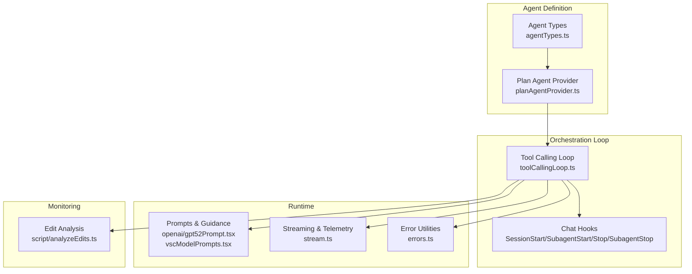
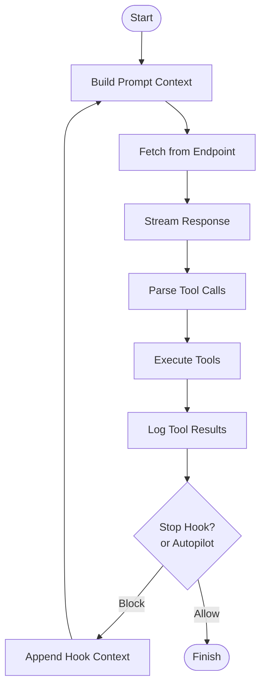
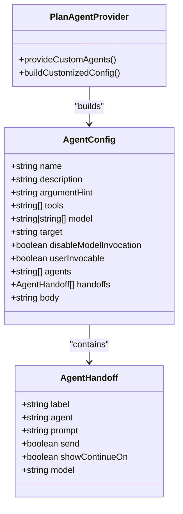
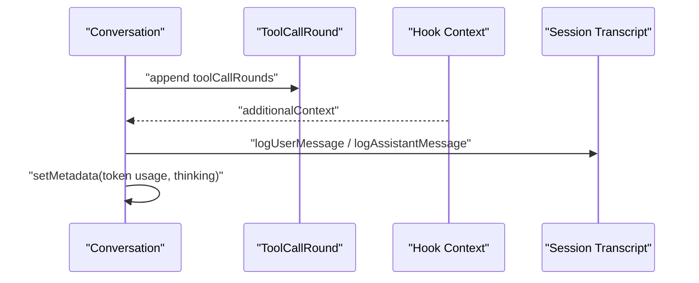
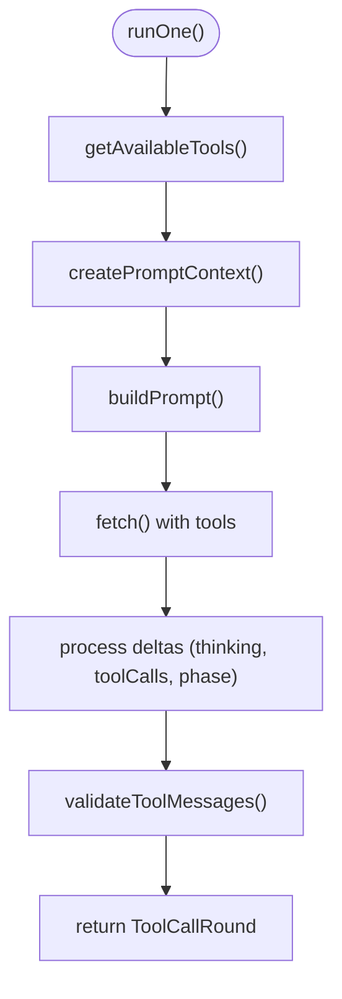
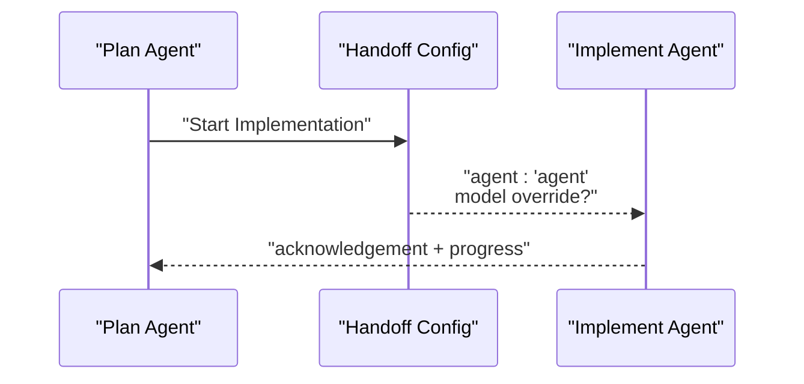
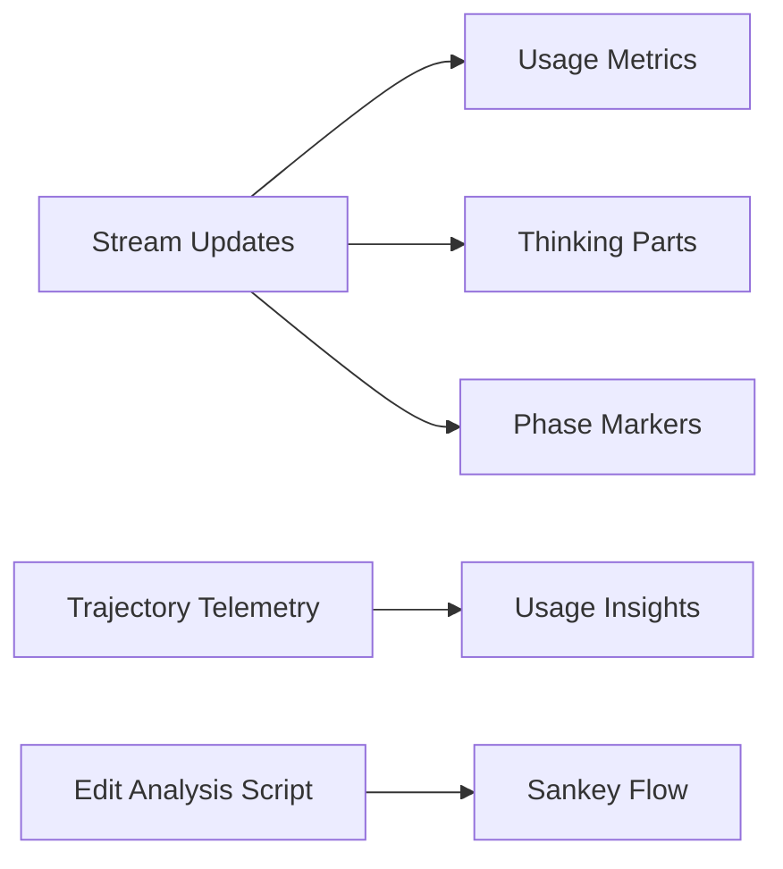
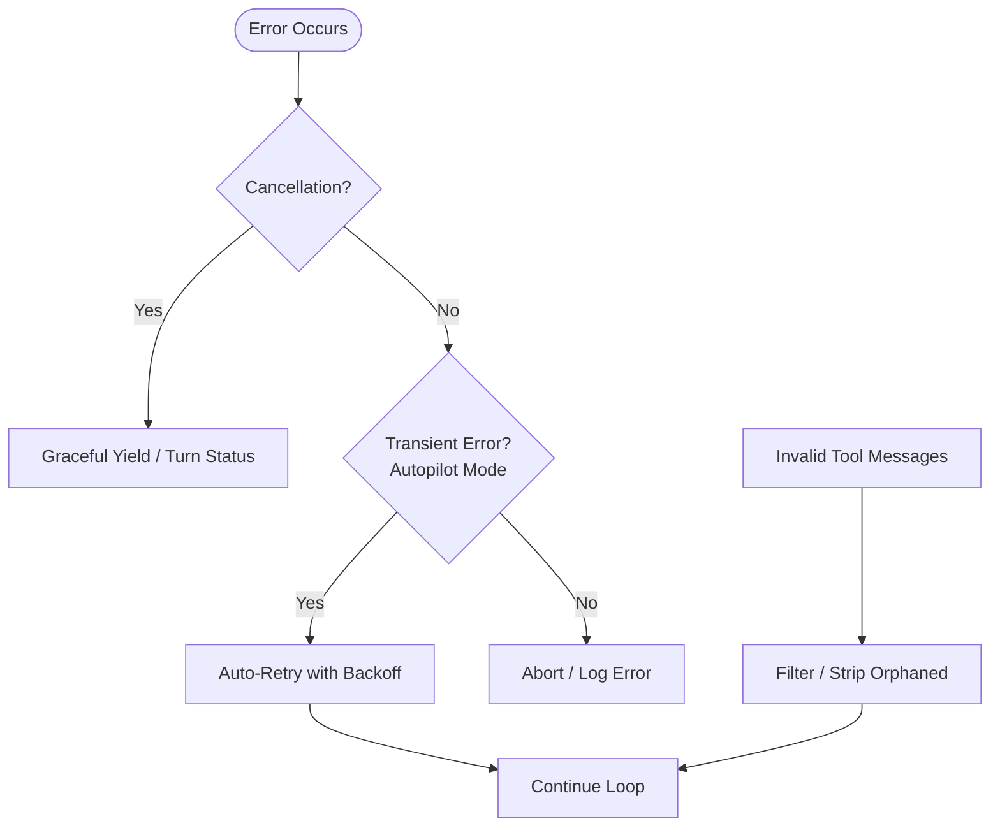
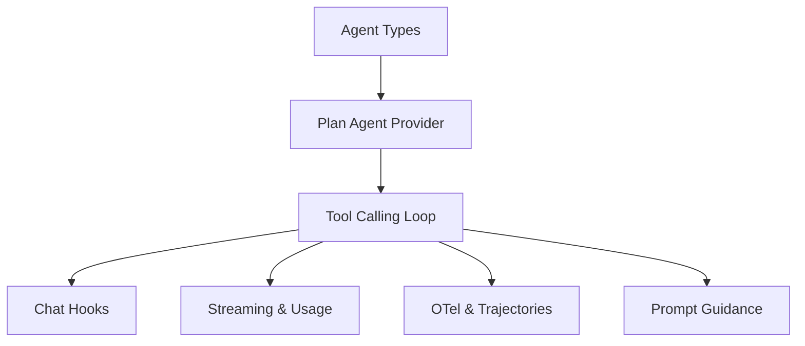

# Agent Workflows & Orchestration

<cite>
**Referenced Files in This Document**
- [toolCallingLoop.ts](file://src/extension/intents/node/toolCallingLoop.ts)
- [agentTypes.ts](file://src/extension/agents/vscode-node/agentTypes.ts)
- [planAgentProvider.ts](file://src/extension/agents/vscode-node/planAgentProvider.ts)
- [planAgentProvider.spec.ts](file://src/extension/agents/vscode-node/test/planAgentProvider.spec.ts)
- [errors.ts](file://src/util/vs/base/common/errors.ts)
- [gpt52Prompt.tsx](file://src/extension/prompts/node/agent/openai/gpt52Prompt.tsx)
- [vscModelPrompts.tsx](file://src/extension/prompts/node/agent/vscModelPrompts.tsx)
- [analyzeEdits.ts](file://script/analyzeEdits.ts)
- [stream.ts](file://src/platform/networking/node/stream.ts)
</cite>

## Table of Contents
1. [Introduction](#introduction)
2. [Project Structure](#project-structure)
3. [Core Components](#core-components)
4. [Architecture Overview](#architecture-overview)
5. [Detailed Component Analysis](#detailed-component-analysis)
6. [Dependency Analysis](#dependency-analysis)
7. [Performance Considerations](#performance-considerations)
8. [Troubleshooting Guide](#troubleshooting-guide)
9. [Conclusion](#conclusion)
10. [Appendices](#appendices)

## Introduction
This document explains the agent workflows and orchestration patterns implemented in the repository. It covers multi-agent collaboration, agent handoffs, task delegation, the tool calling loop mechanism, workflow state management, and how agents maintain context across interactions. It also documents monitoring, progress tracking, result synthesis, error handling and recovery strategies, and practical guidelines for designing efficient agent workflows.

## Project Structure
The agent orchestration system centers around a reusable tool calling loop that integrates with VS Code’s chat and tool ecosystem. Agents are defined declaratively and can hand off to other agents or subagents. Hooks enable dynamic context injection and gating of stop conditions. The loop manages conversation history, tool call rounds, and telemetry.



**Diagram sources**
- [agentTypes.ts](file://src/extension/agents/vscode-node/agentTypes.ts#L1-L121)
- [planAgentProvider.ts](file://src/extension/agents/vscode-node/planAgentProvider.ts#L1-L243)
- [toolCallingLoop.ts](file://src/extension/intents/node/toolCallingLoop.ts#L160-L740)
- [gpt52Prompt.tsx](file://src/extension/prompts/node/agent/openai/gpt52Prompt.tsx#L64-L76)
- [vscModelPrompts.tsx](file://src/extension/prompts/node/agent/vscModelPrompts.tsx#L129-L136)
- [stream.ts](file://src/platform/networking/node/stream.ts#L589-L614)
- [errors.ts](file://src/util/vs/base/common/errors.ts#L95-L343)
- [analyzeEdits.ts](file://script/analyzeEdits.ts#L227-L533)

**Section sources**
- [agentTypes.ts](file://src/extension/agents/vscode-node/agentTypes.ts#L1-L121)
- [planAgentProvider.ts](file://src/extension/agents/vscode-node/planAgentProvider.ts#L1-L243)
- [toolCallingLoop.ts](file://src/extension/intents/node/toolCallingLoop.ts#L160-L740)

## Core Components
- Agent configuration and handoffs: Declarative agent definitions with tools, optional models, and handoff targets.
- Plan agent provider: Dynamically builds a customized agent definition with configurable tools and model overrides.
- Tool calling loop: A robust loop that builds prompts, invokes the language model, executes tool calls, applies hooks, and manages state across iterations.
- Hooks: SessionStart, SubagentStart, Stop, and SubagentStop hooks for context injection and gating of stopping.
- Streaming and telemetry: Real-time streaming updates, token usage, and structured telemetry for monitoring.

**Section sources**
- [agentTypes.ts](file://src/extension/agents/vscode-node/agentTypes.ts#L1-L121)
- [planAgentProvider.ts](file://src/extension/agents/vscode-node/planAgentProvider.ts#L198-L241)
- [toolCallingLoop.ts](file://src/extension/intents/node/toolCallingLoop.ts#L160-L740)

## Architecture Overview
The orchestration architecture couples agent definitions with a loop that:
- Builds a prompt context from conversation history, tool call results, and hook-provided context.
- Invokes the language model and streams responses.
- Parses tool calls, executes tools, and records results.
- Applies stop hooks and autopilot rules to ensure task completion.
- Maintains session transcripts and emits telemetry.

```mermaid
sequenceDiagram
participant User as "User"
participant Agent as "Agent (Plan)"
participant Loop as "ToolCallingLoop"
participant Hooks as "Chat Hooks"
participant Model as "Language Model Endpoint"
participant Tools as "Tools"
User->>Agent : "Ask a task"
Agent->>Loop : "runStartHooks()"
Loop->>Hooks : "SessionStart/SubagentStart"
Hooks-->>Loop : "additionalContext?"
Loop->>Loop : "createPromptContext(history, results, hooks)"
Loop->>Model : "fetch(messages, tools)"
Model-->>Loop : "stream deltas (thinking, toolCalls, phase)"
Loop->>Tools : "execute tool calls"
Tools-->>Loop : "tool results"
Loop->>Hooks : "Stop/SubagentStop"
Hooks-->>Loop : "shouldContinue?"
alt Continue
Loop->>Loop : "append hookContext and continue"
else Stop
Loop-->>Agent : "final result"
end
```

**Diagram sources**
- [toolCallingLoop.ts](file://src/extension/intents/node/toolCallingLoop.ts#L570-L857)
- [planAgentProvider.ts](file://src/extension/agents/vscode-node/planAgentProvider.ts#L198-L241)

## Detailed Component Analysis

### Tool Calling Loop
The loop encapsulates the core orchestration logic:
- Prompt building with conversation history, tool call results, and hook context.
- Streaming response processing and early stop signaling.
- Tool call parsing, execution, and result logging.
- Stop hooks and autopilot enforcement to ensure task completion.
- Session transcript logging and OTel telemetry.



**Diagram sources**
- [toolCallingLoop.ts](file://src/extension/intents/node/toolCallingLoop.ts#L742-L885)

**Section sources**
- [toolCallingLoop.ts](file://src/extension/intents/node/toolCallingLoop.ts#L160-L740)
- [toolCallingLoop.ts](file://src/extension/intents/node/toolCallingLoop.ts#L742-L885)
- [toolCallingLoop.ts](file://src/extension/intents/node/toolCallingLoop.ts#L1002-L1232)

### Agent Definitions and Handoffs
Agents are defined with:
- Name, description, tools, optional model(s), and handoffs.
- Dynamic generation of handoff entries, including model overrides for specific transitions.



**Diagram sources**
- [agentTypes.ts](file://src/extension/agents/vscode-node/agentTypes.ts#L9-L34)
- [planAgentProvider.ts](file://src/extension/agents/vscode-node/planAgentProvider.ts#L198-L241)

**Section sources**
- [agentTypes.ts](file://src/extension/agents/vscode-node/agentTypes.ts#L1-L121)
- [planAgentProvider.ts](file://src/extension/agents/vscode-node/planAgentProvider.ts#L198-L241)
- [planAgentProvider.spec.ts](file://src/extension/agents/vscode-node/test/planAgentProvider.spec.ts#L315-L347)

### Workflow State Management and Context
- Conversation turns and tool call rounds preserve state across iterations.
- Hook context and additional context injected by hooks persist across turns.
- Session transcripts record user and assistant messages, tool requests, and thinking text.
- Token usage and prompt token details are tracked for observability.



**Diagram sources**
- [toolCallingLoop.ts](file://src/extension/intents/node/toolCallingLoop.ts#L592-L630)
- [toolCallingLoop.ts](file://src/extension/intents/node/toolCallingLoop.ts#L1192-L1204)

**Section sources**
- [toolCallingLoop.ts](file://src/extension/intents/node/toolCallingLoop.ts#L570-L630)
- [toolCallingLoop.ts](file://src/extension/intents/node/toolCallingLoop.ts#L1192-L1204)

### Tool Calling Loop Mechanism
- Iterative loop with configurable tool call limits and autopilot behavior.
- Validation of tool messages to prevent orphaned tool calls and mismatches.
- Early stop signaling via response processors to reduce latency and cost.
- Streaming updates for thinking, tool calls, phase markers, and context compaction.



**Diagram sources**
- [toolCallingLoop.ts](file://src/extension/intents/node/toolCallingLoop.ts#L1002-L1232)
- [toolCallingLoop.ts](file://src/extension/intents/node/toolCallingLoop.ts#L1307-L1400)

**Section sources**
- [toolCallingLoop.ts](file://src/extension/intents/node/toolCallingLoop.ts#L1002-L1232)
- [toolCallingLoop.ts](file://src/extension/intents/node/toolCallingLoop.ts#L1307-L1400)

### Agent Communication Protocols and Handoffs
- Agents declare handoffs with labels, target agents, prompts, and optional model overrides.
- Handoffs can be configured to send messages automatically and control continue-on behavior.
- The plan agent provider dynamically constructs handoffs, including a model override for implementation handoffs.



**Diagram sources**
- [planAgentProvider.ts](file://src/extension/agents/vscode-node/planAgentProvider.ts#L205-L220)
- [planAgentProvider.spec.ts](file://src/extension/agents/vscode-node/test/planAgentProvider.spec.ts#L325-L337)

**Section sources**
- [agentTypes.ts](file://src/extension/agents/vscode-node/agentTypes.ts#L9-L34)
- [planAgentProvider.ts](file://src/extension/agents/vscode-node/planAgentProvider.ts#L205-L220)
- [planAgentProvider.spec.ts](file://src/extension/agents/vscode-node/test/planAgentProvider.spec.ts#L315-L347)

### Monitoring, Progress Tracking, and Result Synthesis
- Streaming usage updates and prompt token details for UI rendering.
- OTel spans for session start, agent turns, and tool definitions.
- Trajectory telemetry for tool usage patterns (e.g., read_file).
- Edit analysis script for Sankey-style flow visualization and retry tracking.



**Diagram sources**
- [toolCallingLoop.ts](file://src/extension/intents/node/toolCallingLoop.ts#L1155-L1163)
- [toolCallingLoop.ts](file://src/extension/intents/node/toolCallingLoop.ts#L887-L969)
- [analyzeEdits.ts](file://script/analyzeEdits.ts#L246-L288)

**Section sources**
- [toolCallingLoop.ts](file://src/extension/intents/node/toolCallingLoop.ts#L1155-L1163)
- [toolCallingLoop.ts](file://src/extension/intents/node/toolCallingLoop.ts#L887-L969)
- [analyzeEdits.ts](file://script/analyzeEdits.ts#L227-L533)

### Error Handling and Recovery Strategies
- Cancellation handling with graceful yields and turn status updates.
- Auto-retry in autopilot/auto-approve modes for transient errors.
- Tool input failure retries and validation of tool messages to avoid malformed prompts.
- Hook abort errors and stop hook blocking reasons surfaced to the model.



**Diagram sources**
- [toolCallingLoop.ts](file://src/extension/intents/node/toolCallingLoop.ts#L555-L560)
- [toolCallingLoop.ts](file://src/extension/intents/node/toolCallingLoop.ts#L798-L805)
- [toolCallingLoop.ts](file://src/extension/intents/node/toolCallingLoop.ts#L1307-L1400)
- [errors.ts](file://src/util/vs/base/common/errors.ts#L95-L343)

**Section sources**
- [toolCallingLoop.ts](file://src/extension/intents/node/toolCallingLoop.ts#L555-L560)
- [toolCallingLoop.ts](file://src/extension/intents/node/toolCallingLoop.ts#L798-L805)
- [toolCallingLoop.ts](file://src/extension/intents/node/toolCallingLoop.ts#L1307-L1400)
- [errors.ts](file://src/util/vs/base/common/errors.ts#L95-L343)

### Common Workflow Patterns
- Research-to-implementation pipeline:
  - Discovery and alignment with the plan agent.
  - Design and refinement leading to a concrete plan.
  - Handoff to an implementation agent with model override.
- Iterative refinement:
  - Continuous prompting with hook context to address blocking reasons.
  - Autopilot enforcement to ensure task completion.
- Collaborative problem-solving:
  - Subagents launched in parallel for independent areas.
  - SessionStart/SubagentStart hooks injecting domain-specific context.

**Section sources**
- [planAgentProvider.ts](file://src/extension/agents/vscode-node/planAgentProvider.ts#L106-L196)
- [toolCallingLoop.ts](file://src/extension/intents/node/toolCallingLoop.ts#L570-L630)
- [toolCallingLoop.ts](file://src/extension/intents/node/toolCallingLoop.ts#L806-L857)

## Dependency Analysis
The orchestration depends on:
- Agent types and providers for declarative agent configuration.
- Tool calling loop for the execution engine.
- Hooks for dynamic context and gating.
- Streaming and telemetry for observability.
- Prompt guidance for structured workflows.



**Diagram sources**
- [agentTypes.ts](file://src/extension/agents/vscode-node/agentTypes.ts#L1-L121)
- [planAgentProvider.ts](file://src/extension/agents/vscode-node/planAgentProvider.ts#L1-L243)
- [toolCallingLoop.ts](file://src/extension/intents/node/toolCallingLoop.ts#L160-L740)

**Section sources**
- [agentTypes.ts](file://src/extension/agents/vscode-node/agentTypes.ts#L1-L121)
- [planAgentProvider.ts](file://src/extension/agents/vscode-node/planAgentProvider.ts#L1-L243)
- [toolCallingLoop.ts](file://src/extension/intents/node/toolCallingLoop.ts#L160-L740)

## Performance Considerations
- Limit tool call iterations and auto-increase in autopilot mode to balance thoroughness and cost.
- Use streaming to reduce perceived latency and enable early stop signaling.
- Validate tool messages to avoid unnecessary retries and malformed prompts.
- Track token usage and prompt token details to inform context window management.

[No sources needed since this section provides general guidance]

## Troubleshooting Guide
- If the agent stops prematurely, check stop hooks and autopilot enforcement for blocking reasons.
- For tool-related errors, review tool message validation and orphaned tool call stripping.
- Use telemetry and stream usage updates to diagnose performance bottlenecks.
- Inspect hook abort errors and cancellation handling for unexpected termination.

**Section sources**
- [toolCallingLoop.ts](file://src/extension/intents/node/toolCallingLoop.ts#L806-L857)
- [toolCallingLoop.ts](file://src/extension/intents/node/toolCallingLoop.ts#L1307-L1400)
- [errors.ts](file://src/util/vs/base/common/errors.ts#L95-L343)

## Conclusion
The agent orchestration system combines declarative agent definitions, a robust tool calling loop, and dynamic hooks to support multi-agent collaboration, handoffs, and iterative refinement. By leveraging streaming, telemetry, and structured workflows, it enables reliable, observable, and efficient agent-driven problem solving.

[No sources needed since this section summarizes without analyzing specific files]

## Appendices

### Prompt Guidance References
- Planning and todo list guidance for structured workflows.
- Debugging phases emphasizing root cause, patterns, hypotheses, and implementation.

**Section sources**
- [gpt52Prompt.tsx](file://src/extension/prompts/node/agent/openai/gpt52Prompt.tsx#L64-L76)
- [vscModelPrompts.tsx](file://src/extension/prompts/node/agent/vscModelPrompts.tsx#L129-L136)