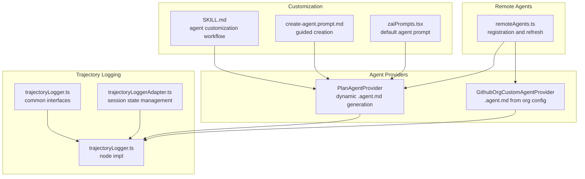
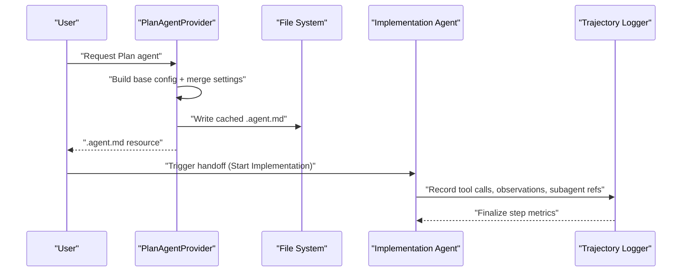
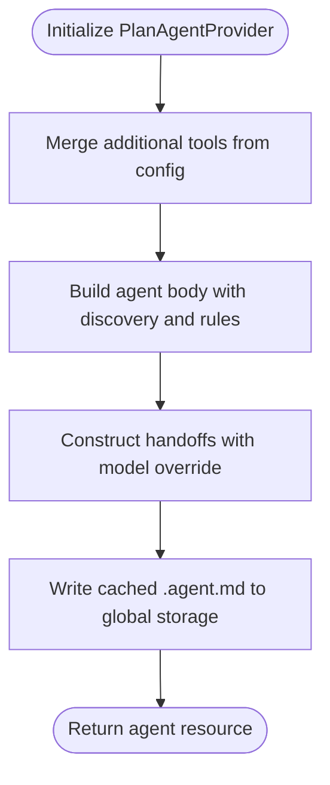
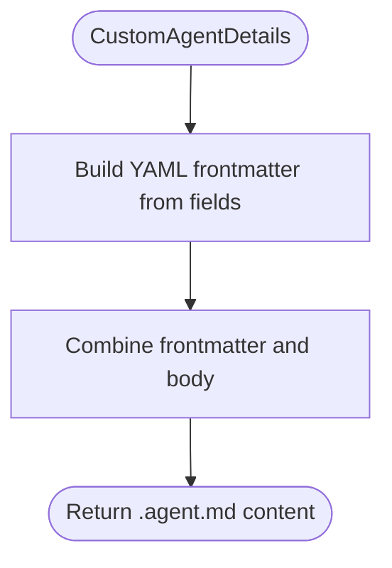
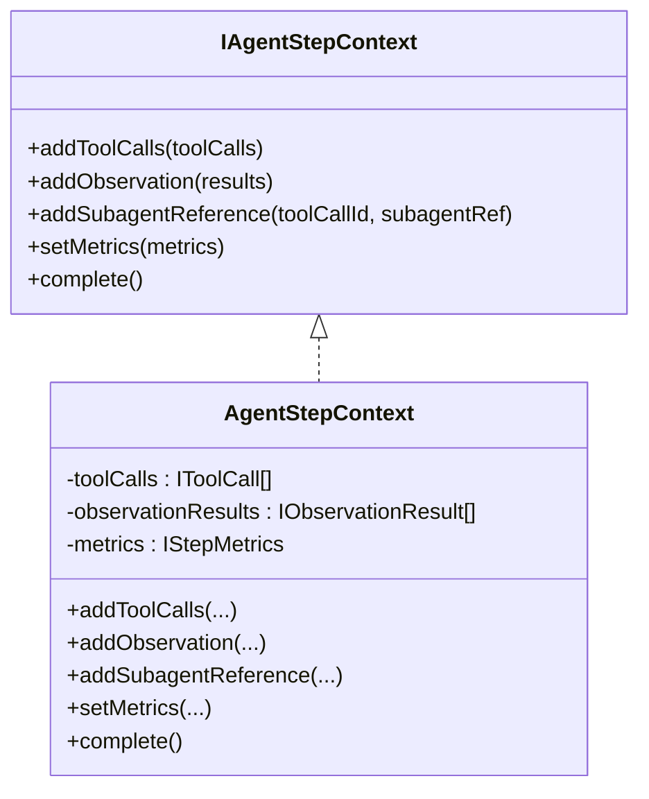
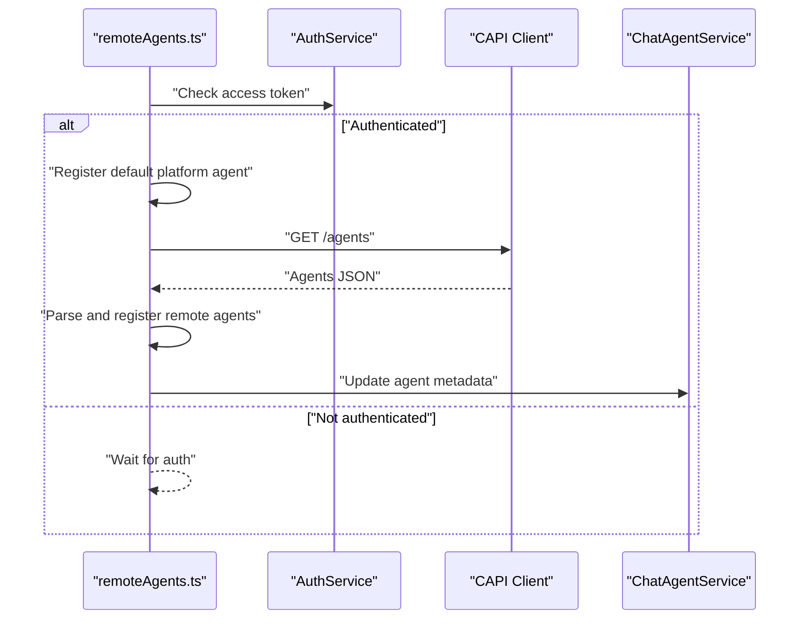
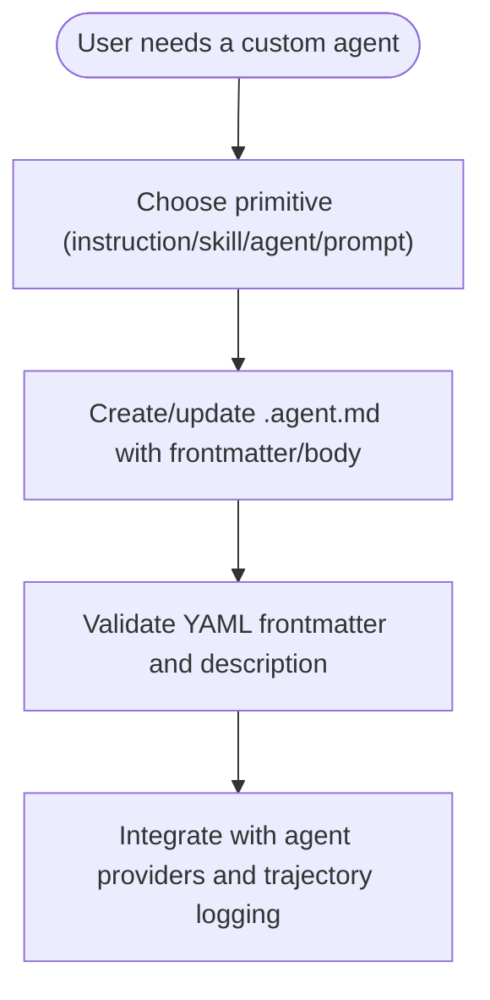
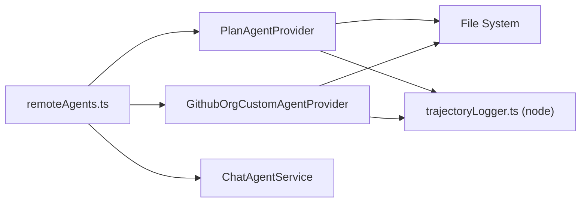

# Agents System

<cite>
**Referenced Files in This Document**
- [README.md](file://README.md)
- [SKILL.md](file://assets/prompts/skills/agent-customization/SKILL.md)
- [create-agent.prompt.md](file://assets/prompts/create-agent.prompt.md)
- [planAgentProvider.ts](file://src/extension/agents/vscode-node/planAgentProvider.ts)
- [planAgentProvider.spec.ts](file://src/extension/agents/vscode-node/test/planAgentProvider.spec.ts)
- [githubOrgCustomAgentProvider.ts](file://src/extension/agents/vscode-node/githubOrgCustomAgentProvider.ts)
- [trajectoryLogger.ts](file://src/platform/trajectory/common/trajectoryLogger.ts)
- [trajectoryLogger.ts (node)](file://src/platform/trajectory/node/trajectoryLogger.ts)
- [trajectoryLoggerAdapter.ts](file://src/platform/trajectory/node/trajectoryLoggerAdapter.ts)
- [remoteAgents.ts](file://src/extension/conversation/vscode-node/remoteAgents.ts)
- [customInstructionsService.ts](file://src/platform/customInstructions/common/customInstructionsService.ts)
- [zaiPrompts.tsx](file://src/extension/prompts/node/agent/zaiPrompts.tsx)
- [mainThreadChatAgents2.ts](file://test/simulation/fixtures/editing/mainThreadChatAgents2.ts)
</cite>

## Table of Contents
1. [Introduction](#introduction)
2. [Project Structure](#project-structure)
3. [Core Components](#core-components)
4. [Architecture Overview](#architecture-overview)
5. [Detailed Component Analysis](#detailed-component-analysis)
6. [Dependency Analysis](#dependency-analysis)
7. [Performance Considerations](#performance-considerations)
8. [Troubleshooting Guide](#troubleshooting-guide)
9. [Conclusion](#conclusion)
10. [Appendices](#appendices)

## Introduction
This document explains the multi-agent system architecture, focusing on how agents are managed, selected, and configured. It covers agent types (Plan agents, Implementation agents, and specialized agents), agent lifecycle and state management, communication and context preservation across transitions, agent skills and persona configuration, and the orchestration of tools. It also documents integration with external providers and how context is maintained consistently across agent handoffs.

## Project Structure
The repository organizes agent-related capabilities across extension providers, platform trajectory logging, and prompt-driven customization assets. Key areas include:
- Agent providers and configuration (Plan agent, custom agents)
- Trajectory logging for step-level observability and subagent references
- Remote agent registration and provider metadata
- Prompt-driven agent customization and skills
- Tool orchestration and agent persona rendering

**Diagram sources**
- [planAgentProvider.ts](file://src/extension/agents/vscode-node/planAgentProvider.ts#L15-L212)
- [githubOrgCustomAgentProvider.ts](file://src/extension/agents/vscode-node/githubOrgCustomAgentProvider.ts#L118-L156)
- [trajectoryLogger.ts](file://src/platform/trajectory/common/trajectoryLogger.ts#L85-L140)
- [trajectoryLogger.ts (node)](file://src/platform/trajectory/node/trajectoryLogger.ts#L267-L314)
- [trajectoryLoggerAdapter.ts](file://src/platform/trajectory/node/trajectoryLoggerAdapter.ts#L529-L564)
- [remoteAgents.ts](file://src/extension/conversation/vscode-node/remoteAgents.ts#L132-L169)
- [SKILL.md](file://assets/prompts/skills/agent-customization/SKILL.md#L1-L83)
- [create-agent.prompt.md](file://assets/prompts/create-agent.prompt.md#L1-L29)
- [zaiPrompts.tsx](file://src/extension/prompts/node/agent/zaiPrompts.tsx#L20-L35)

**Section sources**
- [README.md](file://README.md#L18-L28)
- [planAgentProvider.ts](file://src/extension/agents/vscode-node/planAgentProvider.ts#L15-L212)
- [trajectoryLogger.ts](file://src/platform/trajectory/common/trajectoryLogger.ts#L85-L140)
- [remoteAgents.ts](file://src/extension/conversation/vscode-node/remoteAgents.ts#L132-L169)
- [SKILL.md](file://assets/prompts/skills/agent-customization/SKILL.md#L1-L83)

## Core Components
- PlanAgentProvider: Generates a dynamic Plan agent definition with customizable tools and model overrides, writes a cached .agent.md file, and supports handoffs to an Implementation agent.
- GithubOrgCustomAgentProvider: Produces .agent.md content from organization-provided agent details, including frontmatter and body.
- Trajectory logging: Interfaces and implementations that capture steps, tool calls, observations, subagent references, and metrics; supports session state cleanup.
- Remote agents: Registers default platform agents and refreshes additional agents from a remote source when authenticated.
- Customization assets: Skill documentation and guided prompts for creating agents, plus default prompt rendering for agent persona.

**Section sources**
- [planAgentProvider.ts](file://src/extension/agents/vscode-node/planAgentProvider.ts#L15-L212)
- [githubOrgCustomAgentProvider.ts](file://src/extension/agents/vscode-node/githubOrgCustomAgentProvider.ts#L118-L156)
- [trajectoryLogger.ts](file://src/platform/trajectory/common/trajectoryLogger.ts#L85-L140)
- [trajectoryLogger.ts (node)](file://src/platform/trajectory/node/trajectoryLogger.ts#L267-L314)
- [trajectoryLoggerAdapter.ts](file://src/platform/trajectory/node/trajectoryLoggerAdapter.ts#L529-L564)
- [remoteAgents.ts](file://src/extension/conversation/vscode-node/remoteAgents.ts#L132-L169)
- [SKILL.md](file://assets/prompts/skills/agent-customization/SKILL.md#L1-L83)
- [create-agent.prompt.md](file://assets/prompts/create-agent.prompt.md#L1-L29)
- [zaiPrompts.tsx](file://src/extension/prompts/node/agent/zaiPrompts.tsx#L20-L35)

## Architecture Overview
The system orchestrates agents through providers that materialize .agent.md configurations, integrates with trajectory logging for step-level observability, and coordinates remote agent registration. Agents can be customized via skills and prompts, and can hand off to other agents while preserving context.

**Diagram sources**
- [planAgentProvider.ts](file://src/extension/agents/vscode-node/planAgentProvider.ts#L15-L212)
- [trajectoryLogger.ts (node)](file://src/platform/trajectory/node/trajectoryLogger.ts#L267-L314)

## Detailed Component Analysis

### Plan Agent Provider
The PlanAgentProvider embeds a base configuration and dynamically builds a Plan agent body and handoffs. It merges additional tools and model overrides from configuration, writes a cached .agent.md file to global storage, and exposes a label for display. Tests validate tool merging, model override behavior, and content preservation.

Key behaviors:
- Embedded base configuration defines name, description, target, tool set, and subagents.
- Dynamic body generation includes discovery guidance and style rules.
- Handoffs are constructed with optional model overrides for downstream agents.
- Cached .agent.md is written to a dedicated cache directory for reuse.

**Diagram sources**
- [planAgentProvider.ts](file://src/extension/agents/vscode-node/planAgentProvider.ts#L15-L212)

**Section sources**
- [planAgentProvider.ts](file://src/extension/agents/vscode-node/planAgentProvider.ts#L15-L212)
- [planAgentProvider.spec.ts](file://src/extension/agents/vscode-node/test/planAgentProvider.spec.ts#L24-L315)

### Custom Agent Provider (Organization)
The GithubOrgCustomAgentProvider converts organization-provided agent details into a .agent.md file with frontmatter and body. It handles optional fields such as name, description, tools, argument hint, target, model, invocation flags, and user invocability, then emits a YAML frontmatter block followed by the prompt body.

**Diagram sources**
- [githubOrgCustomAgentProvider.ts](file://src/extension/agents/vscode-node/githubOrgCustomAgentProvider.ts#L118-L156)

**Section sources**
- [githubOrgCustomAgentProvider.ts](file://src/extension/agents/vscode-node/githubOrgCustomAgentProvider.ts#L118-L156)

### Trajectory Logging and Step Context
Trajectory logging captures agent steps, tool calls, observations, and subagent references. The common interface defines methods to add tool calls, observations, subagent references, set metrics, and complete a step. The node implementation aggregates these into a trajectory and supports session state cleanup.

**Diagram sources**
- [trajectoryLogger.ts](file://src/platform/trajectory/common/trajectoryLogger.ts#L85-L140)
- [trajectoryLogger.ts (node)](file://src/platform/trajectory/node/trajectoryLogger.ts#L267-L314)

**Section sources**
- [trajectoryLogger.ts](file://src/platform/trajectory/common/trajectoryLogger.ts#L85-L140)
- [trajectoryLogger.ts (node)](file://src/platform/trajectory/node/trajectoryLogger.ts#L267-L314)
- [trajectoryLoggerAdapter.ts](file://src/platform/trajectory/node/trajectoryLoggerAdapter.ts#L529-L564)

### Remote Agent Registration and Metadata
Remote agents are refreshed when authenticated, with default platform agents registered first. The provider fetches remote agent definitions and registers them, handling invalid responses and access denials gracefully. Agent metadata updates propagate to the chat agent service.

**Diagram sources**
- [remoteAgents.ts](file://src/extension/conversation/vscode-node/remoteAgents.ts#L132-L169)
- [mainThreadChatAgents2.ts](file://test/simulation/fixtures/editing/mainThreadChatAgents2.ts#L99-L125)

**Section sources**
- [remoteAgents.ts](file://src/extension/conversation/vscode-node/remoteAgents.ts#L132-L169)
- [mainThreadChatAgents2.ts](file://test/simulation/fixtures/editing/mainThreadChatAgents2.ts#L99-L125)

### Agent Customization and Skills
Agent customization is guided by a skill workflow that helps create, update, review, and debug agent files. It distinguishes between primitives (workspace instructions, file instructions, MCP, hooks, custom agents, prompts, skills) and provides decision flow guidance. The create-agent prompt assists in generating .agent.md files with proper frontmatter and body.

**Diagram sources**
- [SKILL.md](file://assets/prompts/skills/agent-customization/SKILL.md#L1-L83)
- [create-agent.prompt.md](file://assets/prompts/create-agent.prompt.md#L1-L29)

**Section sources**
- [SKILL.md](file://assets/prompts/skills/agent-customization/SKILL.md#L1-L83)
- [create-agent.prompt.md](file://assets/prompts/create-agent.prompt.md#L1-L29)

### Agent Persona and Default Prompt Rendering
Default agent prompts are rendered with explicit role assignments and constraints. The renderer detects tool capabilities and composes a structured instruction message, front-loading critical rules and persona to guide consistent behavior.

**Section sources**
- [zaiPrompts.tsx](file://src/extension/prompts/node/agent/zaiPrompts.tsx#L20-L35)

### Agent Types and Selection Mechanisms
- Plan agents: Specialized for research and outlining multi-step plans, with subagents for exploration and dynamic handoffs to implementation agents.
- Implementation agents: Execute planned tasks, orchestrated via handoffs from Plan agents and integrated with trajectory logging.
- Specialized agents: Created via customization skills and organization-provided details, enabling domain-specific personas and tool restrictions.

Selection occurs through provider-generated resources and user-triggered handoffs, with context preserved across transitions.

**Section sources**
- [planAgentProvider.ts](file://src/extension/agents/vscode-node/planAgentProvider.ts#L15-L212)
- [githubOrgCustomAgentProvider.ts](file://src/extension/agents/vscode-node/githubOrgCustomAgentProvider.ts#L118-L156)
- [README.md](file://README.md#L18-L28)

### Agent Lifecycle Management
Lifecycle encompasses initialization, configuration merging, resource emission, and handoff. Trajectory logging tracks each step, tool calls, observations, and subagent references, enabling progress tracking and result synthesis. Session state is managed and cleared appropriately to prevent memory leaks.

**Section sources**
- [planAgentProvider.spec.ts](file://src/extension/agents/vscode-node/test/planAgentProvider.spec.ts#L24-L315)
- [trajectoryLoggerAdapter.ts](file://src/platform/trajectory/node/trajectoryLoggerAdapter.ts#L529-L564)

### Communication Protocols and Context Preservation
Communication relies on provider metadata updates and chat agent service integration. Context preservation is achieved through trajectory logs that record tool calls and subagent references, ensuring continuity across agent transitions.

**Section sources**
- [mainThreadChatAgents2.ts](file://test/simulation/fixtures/editing/mainThreadChatAgents2.ts#L99-L125)
- [trajectoryLogger.ts (node)](file://src/platform/trajectory/node/trajectoryLogger.ts#L267-L314)

### Agent Skills, Customization, and Persona Configuration
Skills enable bundling assets and multi-step workflows. Custom agents are configured via frontmatter fields and bodies, with guidance on YAML syntax and discovery surfaces. Default prompts establish persona and constraints.

**Section sources**
- [SKILL.md](file://assets/prompts/skills/agent-customization/SKILL.md#L1-L83)
- [create-agent.prompt.md](file://assets/prompts/create-agent.prompt.md#L1-L29)
- [zaiPrompts.tsx](file://src/extension/prompts/node/agent/zaiPrompts.tsx#L20-L35)

### Relationship Between Agents and Tools
Agents orchestrate tool usage by declaring tool sets in their configuration and through trajectory logging that records tool calls and observations. Subagent references are captured to maintain traceability across nested agent executions.

**Section sources**
- [planAgentProvider.ts](file://src/extension/agents/vscode-node/planAgentProvider.ts#L15-L212)
- [trajectoryLogger.ts (node)](file://src/platform/trajectory/node/trajectoryLogger.ts#L267-L314)

### Practical Examples of Agent Workflows
- Task delegation: Plan agent explores context, builds a plan, and triggers a handoff to an Implementation agent with model override.
- Progress tracking: Trajectory logs record tool calls and observations per step, enabling visibility into agent actions.
- Result synthesis: Final metrics and step completion finalize the trajectory, capturing outcomes and costs.

**Section sources**
- [planAgentProvider.ts](file://src/extension/agents/vscode-node/planAgentProvider.ts#L15-L212)
- [trajectoryLogger.ts (node)](file://src/platform/trajectory/node/trajectoryLogger.ts#L267-L314)

### Agent State Management, Error Handling, and Recovery
- State management: Trajectory adapter maintains per-session state and cleans it on demand to prevent leaks.
- Error handling: Remote agent refresh handles invalid responses and access denials gracefully; provider tests validate robustness against empty or fallback settings.
- Recovery: Retry mechanisms exist for connectivity issues elsewhere in the platform, supporting resilience.

**Section sources**
- [trajectoryLoggerAdapter.ts](file://src/platform/trajectory/node/trajectoryLoggerAdapter.ts#L529-L564)
- [planAgentProvider.spec.ts](file://src/extension/agents/vscode-node/test/planAgentProvider.spec.ts#L24-L315)
- [remoteAgents.ts](file://src/extension/conversation/vscode-node/remoteAgents.ts#L132-L169)

### Integration with External Providers (Claude and Codex)
Integration with external providers is supported through remote agent registration and chat agent service updates. Authentication tokens are used to fetch remote agents, and metadata updates propagate to the client.

**Section sources**
- [remoteAgents.ts](file://src/extension/conversation/vscode-node/remoteAgents.ts#L132-L169)
- [mainThreadChatAgents2.ts](file://test/simulation/fixtures/editing/mainThreadChatAgents2.ts#L99-L125)

## Dependency Analysis
The following diagram highlights key dependencies among agent providers, trajectory logging, and remote agent registration.

**Diagram sources**
- [planAgentProvider.ts](file://src/extension/agents/vscode-node/planAgentProvider.ts#L15-L212)
- [githubOrgCustomAgentProvider.ts](file://src/extension/agents/vscode-node/githubOrgCustomAgentProvider.ts#L118-L156)
- [remoteAgents.ts](file://src/extension/conversation/vscode-node/remoteAgents.ts#L132-L169)
- [trajectoryLogger.ts (node)](file://src/platform/trajectory/node/trajectoryLogger.ts#L267-L314)

**Section sources**
- [planAgentProvider.ts](file://src/extension/agents/vscode-node/planAgentProvider.ts#L15-L212)
- [githubOrgCustomAgentProvider.ts](file://src/extension/agents/vscode-node/githubOrgCustomAgentProvider.ts#L118-L156)
- [remoteAgents.ts](file://src/extension/conversation/vscode-node/remoteAgents.ts#L132-L169)
- [trajectoryLogger.ts (node)](file://src/platform/trajectory/node/trajectoryLogger.ts#L267-L314)

## Performance Considerations
- Caching: Plan agent content is cached to global storage to avoid repeated computation and file I/O overhead.
- Trajectory aggregation: Steps and metrics are aggregated efficiently; ensure session state cleanup to prevent memory growth.
- Connectivity: Retry mechanisms for connectivity support resilience; monitor retry attempts and backoff behavior.

[No sources needed since this section provides general guidance]

## Troubleshooting Guide
- YAML frontmatter issues: Validate frontmatter syntax and ensure meaningful descriptions for discoverability.
- Model overrides: Verify model settings precedence and fallback behavior when core defaults are empty.
- Remote agent access: Confirm authentication tokens and inspect warnings for invalid responses or access denials.
- Session state leaks: Use adapter methods to clear session state when trajectories are reset.

**Section sources**
- [SKILL.md](file://assets/prompts/skills/agent-customization/SKILL.md#L76-L83)
- [planAgentProvider.spec.ts](file://src/extension/agents/vscode-node/test/planAgentProvider.spec.ts#L24-L315)
- [remoteAgents.ts](file://src/extension/conversation/vscode-node/remoteAgents.ts#L132-L169)
- [trajectoryLoggerAdapter.ts](file://src/platform/trajectory/node/trajectoryLoggerAdapter.ts#L529-L564)

## Conclusion
The multi-agent system combines dynamic agent providers, robust trajectory logging, and remote agent integration to enable sophisticated task planning, execution, and context preservation. Customization through skills and prompts, along with clear selection and handoff mechanisms, supports diverse agent types and specialized workflows while maintaining consistency across transitions and external provider integrations.

[No sources needed since this section summarizes without analyzing specific files]

## Appendices
- Agent customization references and decision flow are documented in the agent customization skill.
- Plan agent prompt and body construction are implemented in the PlanAgentProvider.
- Trajectory logging interfaces and implementations provide step-level observability and subagent tracing.

**Section sources**
- [SKILL.md](file://assets/prompts/skills/agent-customization/SKILL.md#L1-L83)
- [planAgentProvider.ts](file://src/extension/agents/vscode-node/planAgentProvider.ts#L15-L212)
- [trajectoryLogger.ts](file://src/platform/trajectory/common/trajectoryLogger.ts#L85-L140)
- [trajectoryLogger.ts (node)](file://src/platform/trajectory/node/trajectoryLogger.ts#L267-L314)