# Architecture & Design

<cite>
**Referenced Files in This Document**
- [README.md](file://README.md)
- [package.json](file://package.json)
- [src/extension/extension/vscode-node/extension.ts](file://src/extension/extension/vscode-node/extension.ts)
- [src/platform/extContext/common/extensionContext.ts](file://src/platform/extContext/common/extensionContext.ts)
- [src/util/vs/platform/instantiation/common/instantiationService.ts](file://src/util/vs/platform/instantiation/common/instantiationService.ts)
- [src/extension/conversation/vscode-node/conversationFeature.ts](file://src/extension/conversation/vscode-node/conversationFeature.ts)
- [src/extension/agents/vscode-node/agentTypes.ts](file://src/extension/agents/vscode-node/agentTypes.ts)
- [src/platform/telemetry/vscode-node/telemetryServiceImpl.ts](file://src/platform/telemetry/vscode-node/telemetryServiceImpl.ts)
- [src/platform/authentication/common/authentication.ts](file://src/platform/authentication/common/authentication.ts)
- [src/platform/chat/common/chatAgents.ts](file://src/platform/chat/common/chatAgents.ts)
- [src/platform/configuration/common/configurationService.ts](file://src/platform/configuration/common/configurationService.ts)
- [src/platform/embeddings/common/vscodeIndex.ts](file://src/platform/embeddings/common/vscodeIndex.ts)
- [src/platform/git/common/gitCommitMessageService.ts](file://src/platform/git/common/gitCommitMessageService.ts)
- [src/platform/log/common/logService.ts](file://src/platform/log/common/logService.ts)
- [src/platform/settingsEditor/common/settingsEditorSearchService.ts](file://src/platform/settingsEditor/common/settingsEditorSearchService.ts)
- [src/platform/workspaceSemanticSearch/node/semanticSearchTextSearchProvider.ts](file://src/platform/workspaceSemanticSearch/node/semanticSearchTextSearchProvider.ts)
- [src/extension/git/common/mergeConflictService.ts](file://src/extension/git/common/mergeConflictService.ts)
- [src/extension/linkify/common/linkifyService.ts](file://src/extension/linkify/common/linkifyService.ts)
- [src/extension/prompt/node/intentDetector.ts](file://src/extension/prompt/node/intentDetector.ts)
- [src/extension/chatSessions/vscode-node/chatSessions.ts](file://src/extension/chatSessions/vscode-node/chatSessions.ts)
- [src/extension/chatSessions/vscode/chatSessionsUriHandler.ts](file://src/extension/chatSessions/vscode/chatSessionsUriHandler.ts)
- [src/extension/mcp/vscode-node/mcpService.ts](file://src/extension/mcp/vscode-node/mcpService.ts)
- [src/extension/githubMcp/vscode-node/githubMcpService.ts](file://src/extension/githubMcp/vscode-node/githubMcpService.ts)
- [src/extension/tools/common/agentMemoryService.ts](file://src/extension/tools/common/agentMemoryService.ts)
- [src/extension/context/vscode/contextService.ts](file://src/extension/context/vscode/contextService.ts)
- [src/extension/context/node/resolvers/resolver.ts](file://src/extension/context/node/resolvers/resolver.ts)
- [src/platform/networking/common/networkService.ts](file://src/platform/networking/common/networkService.ts)
- [src/platform/endpoint/common/domainService.ts](file://src/platform/endpoint/common/domainService.ts)
- [src/platform/otel/vscode-node/otelContrib.ts](file://src/platform/otel/vscode-node/otelContrib.ts)
- [src/platform/proxyModels/common/proxyModelService.ts](file://src/platform/proxyModels/common/proxyModelService.ts)
- [src/platform/openai/node/fetch.ts](file://src/platform/openai/node/fetch.ts)
- [src/platform/remoteCodeSearch/common/remoteCodeSearchService.ts](file://src/platform/remoteCodeSearch/common/remoteCodeSearchService.ts)
- [src/platform/remoteSearch/common/remoteSearchService.ts](file://src/platform/remoteSearch/common/remoteSearchService.ts)
- [src/platform/tokenizer/node/tokenizer.ts](file://src/platform/tokenizer/node/tokenizer.ts)
- [src/platform/tfidf/node/tfidf.ts](file://src/platform/tfidf/node/tfidf.ts)
- [src/platform/tfidf/node/tfidfWorker.ts](file://src/platform/tfidf/node/tfidfWorker.ts)
- [src/platform/tfidf/node/tfidfMessaging.ts](file://src/platform/tfidf/node/tfidfMessaging.ts)
- [src/platform/thinking/common/thinking.ts](file://src/platform/thinking/common/thinking.ts)
- [src/platform/terminal/common/terminalService.ts](file://src/platform/terminal/common/terminalService.ts)
- [src/platform/workbench/common/workbenchService.ts](file://src/platform/workbench/common/workbenchService.ts)
- [src/platform/workspace/common/workspaceService.ts](file://src/platform/workspace/common/workspaceService.ts)
- [src/platform/notebook/common/notebookService.ts](file://src/platform/notebook/common/notebookService.ts)
- [src/platform/review/common/reviewService.ts](file://src/platform/review/common/reviewService.ts)
- [src/platform/tasks/common/tasksService.ts](file://src/platform/tasks/common/tasksService.ts)
- [src/platform/dialog/common/dialogService.ts](file://src/platform/dialog/common/dialogService.ts)
- [src/platform/notification/common/notificationService.ts](file://src/platform/notification/common/notificationService.ts)
- [src/platform/power/common/powerService.ts](file://src/platform/power/common/powerService.ts)
- [src/platform/byok/common/byokService.ts](file://src/platform/byok/common/byokService.ts)
- [src/platform/inlineEdits/common/inlineEditsService.ts](file://src/platform/inlineEdits/common/inlineEditsService.ts)
- [src/platform/editing/common/editingService.ts](file://src/platform/editing/common/editingService.ts)
- [src/platform/diff/common/diffService.ts](file://src/platform/diff/common/diffService.ts)
- [src/platform/multiFileEdit/common/multiFileEditService.ts](file://src/platform/multiFileEdit/common/multiFileEditService.ts)
- [src/platform/nesFetch/common/nesFetchService.ts](file://src/platform/nesFetch/common/nesFetchService.ts)
- [src/platform/parser/common/parserService.ts](file://src/platform/parser/common/parserService.ts)
- [src/platform/projectTemplatesIndex/common/projectTemplatesIndex.ts](file://src/platform/projectTemplatesIndex/common/projectTemplatesIndex.ts)
- [src/platform/promptFiles/common/promptsService.ts](file://src/platform/promptFiles/common/promptsService.ts)
- [src/platform/snippy/common/snippyService.ts](file://src/platform/snippy/common/snippyService.ts)
- [src/platform/survey/common/surveyService.ts](file://src/platform/survey/common/surveyService.ts)
- [src/platform/trajectory/common/trajectoryService.ts](file://src/platform/trajectory/common/trajectoryService.ts)
- [src/platform/urlChunkSearch/node/urlChunkEmbeddingsIndex.ts](file://src/platform/urlChunkSearch/node/urlChunkEmbeddingsIndex.ts)
- [src/platform/workspaceChunkSearch/common/workspaceChunkSearchService.ts](file://src/platform/workspaceChunkSearch/common/workspaceChunkSearchService.ts)
- [src/platform/workspaceRecorder/common/workspaceLog.ts](file://src/platform/workspaceRecorder/common/workspaceLog.ts)
- [src/platform/xTab/common/xTabService.ts](file://src/platform/xTab/common/xTabService.ts)
- [src/platform/xtab/common/xtabService.ts](file://src/platform/xtab/common/xtabService.ts)
- [src/platform/xtab/node/xtabNodeService.ts](file://src/platform/xtab/node/xtabNodeService.ts)
- [src/platform/xtab/vscode-node/xtabVscodeNodeService.ts](file://src/platform/xtab/vscode-node/xtabVscodeNodeService.ts)
- [src/platform/xtab/vscode/xtabVscodeService.ts](file://src/platform/xtab/vscode/xtabVscodeService.ts)
- [src/platform/xtab/vscode-node/xtabVscodeNodeService.ts](file://src/platform/xtab/vscode-node/xtabVscodeNodeService.ts)
- [src/platform/xtab/vscode/xtabVscodeService.ts](file://src/platform/xtab/vscode/xtabVscodeService.ts)
- [src/platform/xtab/node/xtabNodeService.ts](file://src/platform/xtab/node/xtabNodeService.ts)
- [src/platform/xtab/common/xtabService.ts](file://src/platform/xtab/common/xtabService.ts)
- [src/platform/xtab/vscode-node/xtabVscodeNodeService.ts](file://src/platform/xtab/vscode-node/xtabVscodeNodeService.ts)
- [src/platform/xtab/vscode/xtabVscodeService.ts](file://src/platform/xtab/vscode/xtabVscodeService.ts)
- [src/platform/xtab/node/xtabNodeService.ts](file://src/platform/xtab/node/xtabNodeService.ts)
- [src/platform/xtab/common/xtabService.ts](file://src/platform/xtab/common/xtabService.ts)
- [src/platform/xtab/vscode-node/xtabVscodeNodeService.ts](file://src/platform/xtab/vscode-node/xtabVscodeNodeService.ts)
- [src/platform/xtab/vscode/xtabVscodeService.ts](file://src/platform/xtab/vscode/xtabVscodeService.ts)
- [src/platform/xtab/node/xtabNodeService.ts](file://src/platform/xtab/node/xtabNodeService.ts)
- [src/platform/xtab/common/xtabService.ts](file://src/platform/xtab/common/xtabService.ts)
- [src/platform/xtab/vscode-node/xtabVscodeNodeService.ts](file://src/platform/xtab/vscode-node/xtabVscodeNodeService.ts)
- [src/platform/xtab/vscode/xtabVscodeService.ts](file://src/platform/xtab/vscode/xtabVscodeService.ts)
- [src/platform/xtab/node/xtabNodeService.ts](file://src/platform/xtab/node/xtabNodeService.ts)
- [src/platform/xtab/common/xtabService.ts](file://src/platform/xtab/common/xtabService.ts)
- [src/platform/xtab/vscode-node/xtabVscodeNodeService.ts](file://src/platform/xtab/vscode-node/xtabVscodeNodeService.ts)
- [src/platform/xtab/vscode/xtabVscodeService.ts](file://src/platform/xtab/vscode/xtabVscodeService.ts)
- [src/platform/xtab/node/xtabNodeService.ts](file://src/platform/xtab/node/xtabNodeService.ts)
- [src/platform/xtab/common/xtabService.ts](file://src/platform/xtab/common/xtabService.ts)
- [src/platform/xtab/vscode-node/xtabVscodeNodeService.ts](file://src/platform/xtab/vscode-node/xtabVscodeNodeService.ts)
- [src/platform/xtab/vscode/xtabVscodeService.ts](file://src/platform/xtab/vscode/xtabVscodeService.ts)
- [src/platform/xtab/node/xtabNodeService.ts](file://src/platform/xtab/node/xtabNodeService.ts)
- [src/platform/xtab/common/xtabService.ts](file://src/platform/xtab/common/xtabService.ts)
- [src/platform/xtab/vscode-node/xtabVscodeNodeService.ts](file://src/platform/xtab/vscode-node/xtabVscodeNodeService.ts)
- [src/platform/xtab/vscode/xtabVscodeService.ts](file://src/platform/xtab/vscode/xtabVscodeService.ts)
- [src/platform/xtab/node/xtabNodeService.ts](file://src/platform/xtab/node/xtabNodeService.ts)
- [src/platform/xtab/common/xtabService.ts](file://src/platform/xtab/common/xtab......)
</cite>

## Table of Contents
1. [Introduction](#introduction)
2. [Project Structure](#project-structure)
3. [Core Components](#core-components)
4. [Architecture Overview](#architecture-overview)
5. [Detailed Component Analysis](#detailed-component-analysis)
6. [Dependency Analysis](#dependency-analysis)
7. [Performance Considerations](#performance-considerations)
8. [Troubleshooting Guide](#troubleshooting-guide)
9. [Conclusion](#conclusion)
10. [Appendices](#appendices)

## Introduction
This document describes the architecture and design of GitHub Copilot Chat for VS Code. It explains the extension host model, service-oriented architecture, and multi-agent system design. It documents component interactions between the extension layer, platform services, and agent management systems, and covers technical decisions such as the modular monolith approach, dependency injection via IInstantiationService, and event-driven communication. It also outlines infrastructure requirements, VS Code extension API integration patterns, the plugin system for tools and agents, system context diagrams, cross-cutting concerns (authentication, context management, telemetry), and scalability considerations.

## Project Structure
The repository follows a modular monolith layout:
- src/extension: Extension-layer features (UI integrations, commands, agents, chats, tools, MCP, etc.)
- src/platform: Cross-platform services and platform abstractions (authentication, telemetry, embeddings, networking, etc.)
- src/util: Shared utilities and VS Code platform copies (instantiation, base types, async, etc.)
- src/lib: Platform-specific libraries (node, vscode-node)
- docs: Monitoring and operational guidance
- script: Build and tooling helpers
- chat-lib: Internal chat library and configuration

```mermaid
graph TB
subgraph "Extension Layer (src/extension)"
EXT_CONV["Conversation Feature<br/>conversationFeature.ts"]
EXT_AGENTS["Agent Types & Skills<br/>agents/vscode-node/agentTypes.ts"]
EXT_CHAT_SESSIONS["Chat Sessions<br/>chatSessions/vscode-node/chatSessions.ts"]
EXT_MCP["MCP Integration<br/>mcp/vscode-node/mcpService.ts"]
EXT_GITHUB_MCP["GitHub MCP Integration<br/>githubMcp/vscode-node/githubMcpService.ts"]
end
subgraph "Platform Layer (src/platform)"
P_AUTH["Authentication Service<br/>authentication/common/authentication.ts"]
P_CHAT["Chat Agent Service<br/>chat/common/chatAgents.ts"]
P_CFG["Configuration Service<br/>configuration/common/configurationService.ts"]
P_EMB["Embeddings Index<br/>embeddings/common/vscodeIndex.ts"]
P_NET["Networking<br/>networking/common/networkService.ts"]
P_TEL["Telemetry Service<br/>telemetry/vscode-node/telemetryServiceImpl.ts"]
P_SEM["Semantic Search Provider<br/>workspaceSemanticSearch/node/semanticSearchTextSearchProvider.ts"]
end
subgraph "Utilities (src/util)"
U_INST["Instantiation Service<br/>instantiation/common/instantiationService.ts"]
U_CTX["VS Code Extension Context<br/>extContext/common/extensionContext.ts"]
end
EXT_CONV --> P_AUTH
EXT_CONV --> P_CHAT
EXT_CONV --> P_CFG
EXT_CONV --> P_EMB
EXT_CONV --> P_SEM
EXT_CONV --> U_INST
EXT_CONV --> U_CTX
EXT_AGENTS --> U_INST
EXT_CHAT_SESSIONS --> U_INST
EXT_MCP --> U_INST
EXT_GITHUB_MCP --> U_INST
```

**Diagram sources**
- [src/extension/conversation/vscode-node/conversationFeature.ts](file://src/extension/conversation/vscode-node/conversationFeature.ts#L1-L394)
- [src/extension/agents/vscode-node/agentTypes.ts](file://src/extension/agents/vscode-node/agentTypes.ts#L1-L121)
- [src/extension/chatSessions/vscode-node/chatSessions.ts](file://src/extension/chatSessions/vscode-node/chatSessions.ts)
- [src/extension/mcp/vscode-node/mcpService.ts](file://src/extension/mcp/vscode-node/mcpService.ts)
- [src/extension/githubMcp/vscode-node/githubMcpService.ts](file://src/extension/githubMcp/vscode-node/githubMcpService.ts)
- [src/platform/authentication/common/authentication.ts](file://src/platform/authentication/common/authentication.ts)
- [src/platform/chat/common/chatAgents.ts](file://src/platform/chat/common/chatAgents.ts)
- [src/platform/configuration/common/configurationService.ts](file://src/platform/configuration/common/configurationService.ts)
- [src/platform/embeddings/common/vscodeIndex.ts](file://src/platform/embeddings/common/vscodeIndex.ts)
- [src/platform/workspaceSemanticSearch/node/semanticSearchTextSearchProvider.ts](file://src/platform/workspaceSemanticSearch/node/semanticSearchTextSearchProvider.ts)
- [src/util/vs/platform/instantiation/common/instantiationService.ts](file://src/util/vs/platform/instantiation/common/instantiationService.ts#L30-L397)
- [src/platform/extContext/common/extensionContext.ts](file://src/platform/extContext/common/extensionContext.ts#L1-L14)

**Section sources**
- [README.md](file://README.md#L1-L91)
- [package.json](file://package.json#L1-L800)

## Core Components
- Extension Host Activation and Contributions
  - The extension activates via a dedicated Node-side entry that delegates to a shared base activation routine and registers services and contributions.
  - The activation uses a strict service container and contributes runtime-specific features.

- Service-Oriented Architecture
  - Services are registered in a global ServiceCollection and retrieved via IInstantiationService, enabling dependency injection and lazy instantiation.
  - Platform services encapsulate cross-cutting concerns (authentication, telemetry, embeddings, networking) and are consumed by extension-layer features.

- Multi-Agent System
  - Agents are configured declaratively with tools, handoffs, and optional model preferences.
  - Conversations integrate agent participants and orchestrate intent detection and tool execution.

- Plugin System for Tools and Agents
  - The extension contributes language model tools and MCP servers, enabling external capabilities and agent interoperability.

**Section sources**
- [src/extension/extension/vscode-node/extension.ts](file://src/extension/extension/vscode-node/extension.ts#L35-L43)
- [src/util/vs/platform/instantiation/common/instantiationService.ts](file://src/util/vs/platform/instantiation/common/instantiationService.ts#L30-L397)
- [src/platform/extContext/common/extensionContext.ts](file://src/platform/extContext/common/extensionContext.ts#L1-L14)
- [src/extension/agents/vscode-node/agentTypes.ts](file://src/extension/agents/vscode-node/agentTypes.ts#L1-L121)
- [package.json](file://package.json#L150-L600)

## Architecture Overview
The system is built around the VS Code extension host model with a service-oriented architecture and a multi-agent orchestration layer. The extension layer registers providers, commands, and participants; platform services provide authentication, telemetry, embeddings, and networking; and the instantiation service manages DI and lifecycle.

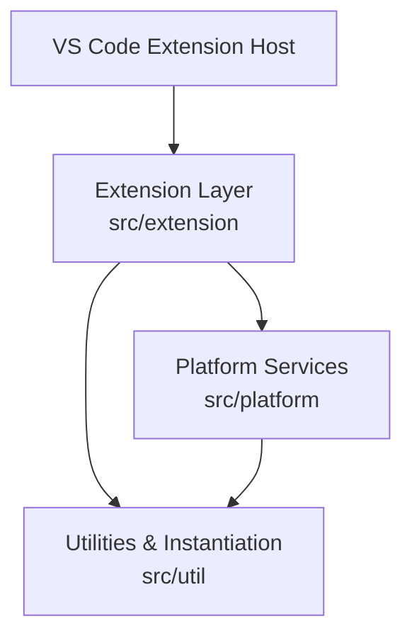

**Diagram sources**
- [src/extension/conversation/vscode-node/conversationFeature.ts](file://src/extension/conversation/vscode-node/conversationFeature.ts#L1-L394)
- [src/util/vs/platform/instantiation/common/instantiationService.ts](file://src/util/vs/platform/instantiation/common/instantiationService.ts#L30-L397)
- [src/platform/extContext/common/extensionContext.ts](file://src/platform/extContext/common/extensionContext.ts#L1-L14)

## Detailed Component Analysis

### Extension Host Activation and Contributions
- The Node-side extension entry activates the base extension with a service registration callback and a contribution set. It also configures development packages and ensures the extension runs only in the Node extension host.

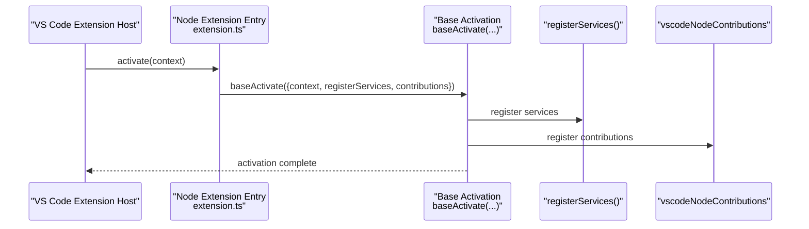

**Diagram sources**
- [src/extension/extension/vscode-node/extension.ts](file://src/extension/extension/vscode-node/extension.ts#L35-L43)

**Section sources**
- [src/extension/extension/vscode-node/extension.ts](file://src/extension/extension/vscode-node/extension.ts#L1-L44)

### Service-Oriented Architecture and Dependency Injection
- The instantiation service implements a robust DI container with:
  - Strict mode for missing services
  - Lazy instantiation with support for delayed instantiation proxies
  - Cycle detection and dependency graph traversal
  - Child service scopes for scoped lifetimes
- Platform services are registered globally and retrieved via IInstantiationService, ensuring loose coupling and testability.

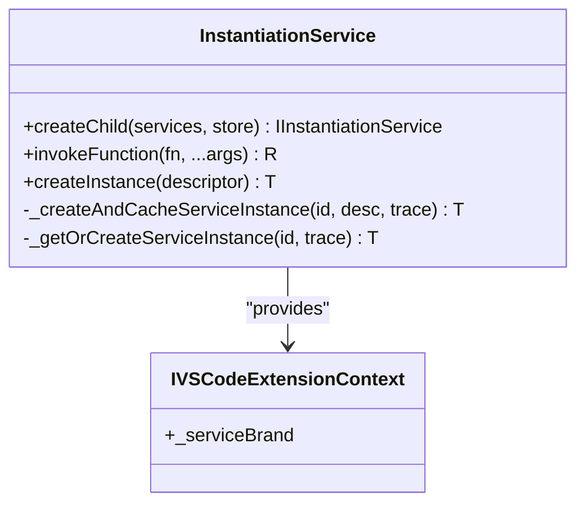

**Diagram sources**
- [src/util/vs/platform/instantiation/common/instantiationService.ts](file://src/util/vs/platform/instantiation/common/instantiationService.ts#L30-L397)
- [src/platform/extContext/common/extensionContext.ts](file://src/platform/extContext/common/extensionContext.ts#L1-L14)

**Section sources**
- [src/util/vs/platform/instantiation/common/instantiationService.ts](file://src/util/vs/platform/instantiation/common/instantiationService.ts#L30-L397)
- [src/platform/extContext/common/extensionContext.ts](file://src/platform/extContext/common/extensionContext.ts#L1-L14)

### Multi-Agent System and Agent Management
- Agents are configured via a declarative schema supporting:
  - Name, description, argument hint
  - Tools and optional subagents
  - Handoffs with labels, targets, prompts, and optional model selection
  - Optional disabling of model invocation and user invocability
- The conversation feature orchestrates agent registration, intent detection, and provider registration.

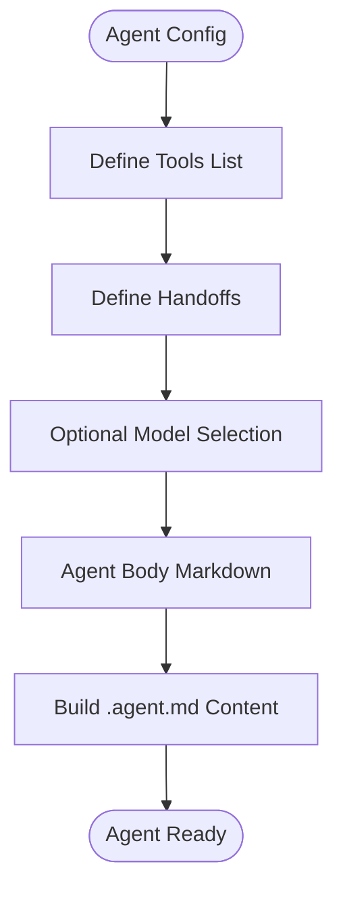

**Diagram sources**
- [src/extension/agents/vscode-node/agentTypes.ts](file://src/extension/agents/vscode-node/agentTypes.ts#L1-L121)

**Section sources**
- [src/extension/agents/vscode-node/agentTypes.ts](file://src/extension/agents/vscode-node/agentTypes.ts#L1-L121)
- [src/extension/conversation/vscode-node/conversationFeature.ts](file://src/extension/conversation/vscode-node/conversationFeature.ts#L158-L162)

### Plugin System for Tools and Agents
- The extension contributes language model tools and MCP servers, enabling external capabilities and agent interoperability.
- Tools include workspace search, file operations, terminal commands, and more, with explicit input schemas and tags.
- MCP integration allows connecting to external servers for tool discovery and execution.

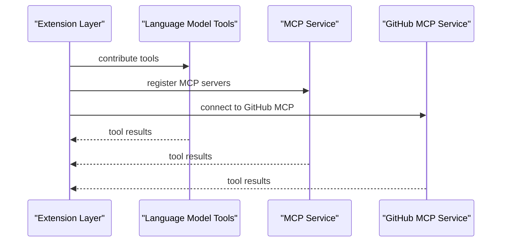

**Diagram sources**
- [package.json](file://package.json#L150-L600)
- [src/extension/mcp/vscode-node/mcpService.ts](file://src/extension/mcp/vscode-node/mcpService.ts)
- [src/extension/githubMcp/vscode-node/githubMcpService.ts](file://src/extension/githubMcp/vscode-node/githubMcpService.ts)

**Section sources**
- [package.json](file://package.json#L150-L600)

### Authentication Flow
- The conversation feature listens for authentication changes and gates feature activation on a valid Copilot token.
- Authentication service emits events when the token state changes, enabling dynamic enablement/disablement of providers and commands.

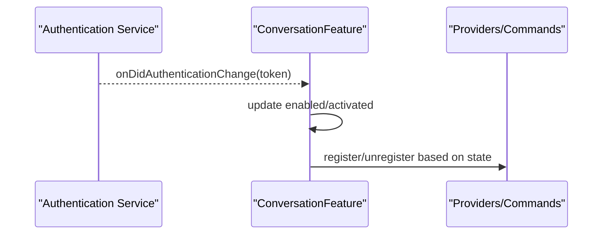

**Diagram sources**
- [src/extension/conversation/vscode-node/conversationFeature.ts](file://src/extension/conversation/vscode-node/conversationFeature.ts#L90-L111)
- [src/platform/authentication/common/authentication.ts](file://src/platform/authentication/common/authentication.ts)

**Section sources**
- [src/extension/conversation/vscode-node/conversationFeature.ts](file://src/extension/conversation/vscode-node/conversationFeature.ts#L90-L111)

### Context Management
- Workspace semantic search leverages embeddings indices to provide AI-powered text search.
- Linkify services register global linkifiers for inline and notebook contexts.
- Intent detection identifies chat participants and routes queries appropriately.

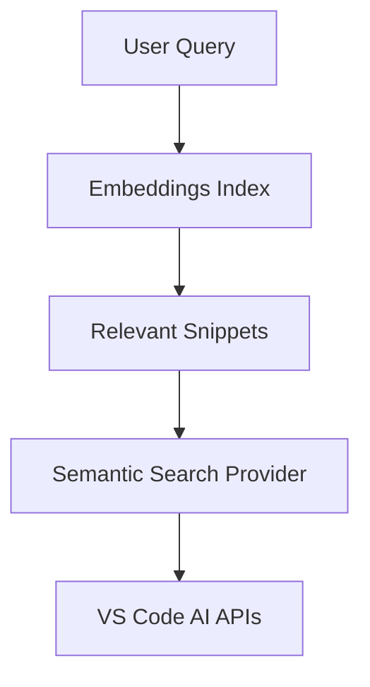

**Diagram sources**
- [src/platform/embeddings/common/vscodeIndex.ts](file://src/platform/embeddings/common/vscodeIndex.ts)
- [src/platform/workspaceSemanticSearch/node/semanticSearchTextSearchProvider.ts](file://src/platform/workspaceSemanticSearch/node/semanticSearchTextSearchProvider.ts)
- [src/extension/conversation/vscode-node/conversationFeature.ts](file://src/extension/conversation/vscode-node/conversationFeature.ts#L164-L178)

**Section sources**
- [src/extension/conversation/vscode-node/conversationFeature.ts](file://src/extension/conversation/vscode-node/conversationFeature.ts#L164-L178)
- [src/extension/linkify/common/linkifyService.ts](file://src/extension/linkify/common/linkifyService.ts)
- [src/extension/prompt/node/intentDetector.ts](file://src/extension/prompt/node/intentDetector.ts)

### Telemetry Collection
- Telemetry service is provided by the platform and used throughout the extension to collect usage metrics and diagnostics.
- Telemetry is integrated into various subsystems (chat, agents, tools, MCP) to monitor performance and user interactions.

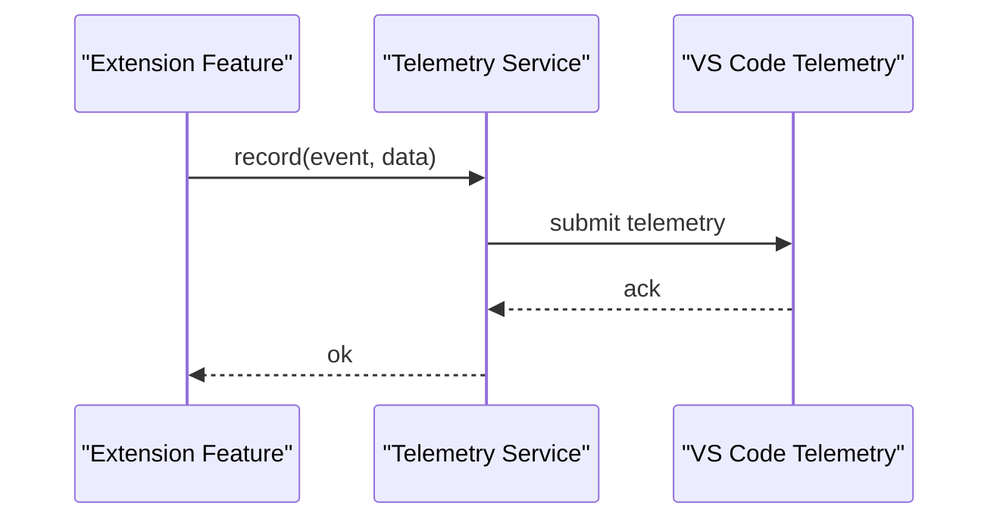

**Diagram sources**
- [src/platform/telemetry/vscode-node/telemetryServiceImpl.ts](file://src/platform/telemetry/vscode-node/telemetryServiceImpl.ts)
- [src/extension/conversation/vscode-node/conversationFeature.ts](file://src/extension/conversation/vscode-node/conversationFeature.ts#L72-L74)

**Section sources**
- [src/platform/telemetry/vscode-node/telemetryServiceImpl.ts](file://src/platform/telemetry/vscode-node/telemetryServiceImpl.ts)
- [src/extension/conversation/vscode-node/conversationFeature.ts](file://src/extension/conversation/vscode-node/conversationFeature.ts#L72-L74)

### Chat Sessions and URI Handling
- Chat sessions are managed by a dedicated service and exposed via URI handlers for deep linking and session restoration.
- Session URIs enable seamless navigation to specific chat states.

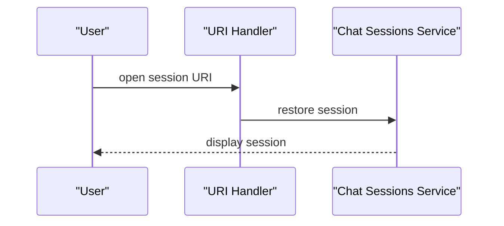

**Diagram sources**
- [src/extension/chatSessions/vscode/chatSessionsUriHandler.ts](file://src/extension/chatSessions/vscode/chatSessionsUriHandler.ts)
- [src/extension/chatSessions/vscode-node/chatSessions.ts](file://src/extension/chatSessions/vscode-node/chatSessions.ts)

**Section sources**
- [src/extension/chatSessions/vscode/chatSessionsUriHandler.ts](file://src/extension/chatSessions/vscode/chatSessionsUriHandler.ts)
- [src/extension/chatSessions/vscode-node/chatSessions.ts](file://src/extension/chatSessions/vscode-node/chatSessions.ts)

### Cross-Cutting Concerns: Logging, Networking, and Remote Services
- Logging service provides structured logs for diagnostics.
- Networking service abstracts outbound requests.
- Remote services (code search, remote search) provide distributed capabilities for large workspaces.

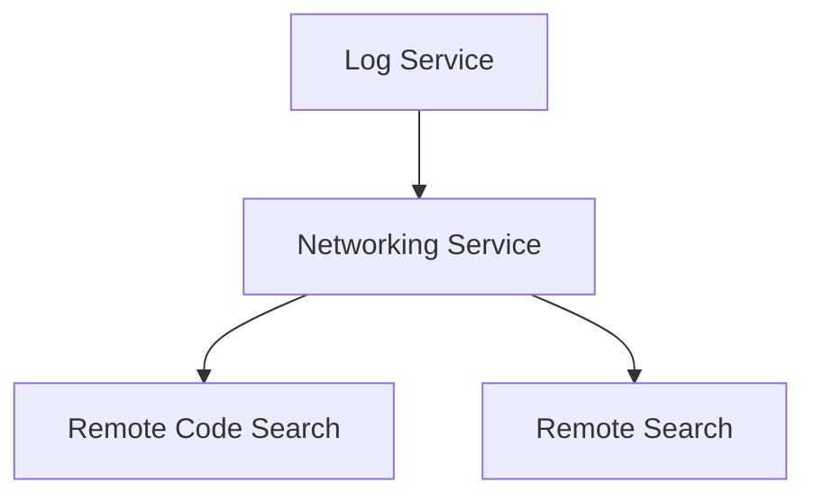

**Diagram sources**
- [src/platform/log/common/logService.ts](file://src/platform/log/common/logService.ts)
- [src/platform/networking/common/networkService.ts](file://src/platform/networking/common/networkService.ts)
- [src/platform/remoteCodeSearch/common/remoteCodeSearchService.ts](file://src/platform/remoteCodeSearch/common/remoteCodeSearchService.ts)
- [src/platform/remoteSearch/common/remoteSearchService.ts](file://src/platform/remoteSearch/common/remoteSearchService.ts)

**Section sources**
- [src/platform/log/common/logService.ts](file://src/platform/log/common/logService.ts)
- [src/platform/networking/common/networkService.ts](file://src/platform/networking/common/networkService.ts)
- [src/platform/remoteCodeSearch/common/remoteCodeSearchService.ts](file://src/platform/remoteCodeSearch/common/remoteCodeSearchService.ts)
- [src/platform/remoteSearch/common/remoteSearchService.ts](file://src/platform/remoteSearch/common/remoteSearchService.ts)

## Dependency Analysis
The system exhibits high cohesion within functional domains and low coupling through interfaces and DI:
- Extension layer depends on platform services via typed interfaces.
- Platform services depend on utilities and base abstractions.
- Instantiation service mediates all service creation and lifecycle.

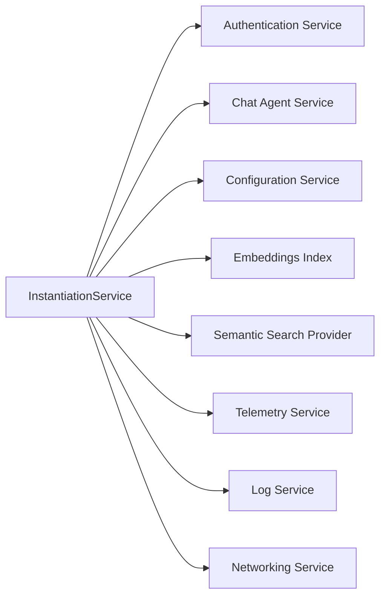

**Diagram sources**
- [src/util/vs/platform/instantiation/common/instantiationService.ts](file://src/util/vs/platform/instantiation/common/instantiationService.ts#L30-L397)
- [src/platform/authentication/common/authentication.ts](file://src/platform/authentication/common/authentication.ts)
- [src/platform/chat/common/chatAgents.ts](file://src/platform/chat/common/chatAgents.ts)
- [src/platform/configuration/common/configurationService.ts](file://src/platform/configuration/common/configurationService.ts)
- [src/platform/embeddings/common/vscodeIndex.ts](file://src/platform/embeddings/common/vscodeIndex.ts)
- [src/platform/workspaceSemanticSearch/node/semanticSearchTextSearchProvider.ts](file://src/platform/workspaceSemanticSearch/node/semanticSearchTextSearchProvider.ts)
- [src/platform/telemetry/vscode-node/telemetryServiceImpl.ts](file://src/platform/telemetry/vscode-node/telemetryServiceImpl.ts)
- [src/platform/log/common/logService.ts](file://src/platform/log/common/logService.ts)
- [src/platform/networking/common/networkService.ts](file://src/platform/networking/common/networkService.ts)

**Section sources**
- [src/util/vs/platform/instantiation/common/instantiationService.ts](file://src/util/vs/platform/instantiation/common/instantiationService.ts#L30-L397)

## Performance Considerations
- Lazy instantiation and delayed instantiation proxies minimize startup overhead.
- Embedding-based semantic search reduces full-text scanning costs for large workspaces.
- Tokenization and TF-IDF indexing support efficient local search.
- Telemetry sampling and batching reduce overhead in production.

[No sources needed since this section provides general guidance]

## Troubleshooting Guide
- Authentication failures: Verify token availability and onDidAuthenticationChange handling; ensure the conversation feature is enabled only when a valid token is present.
- Provider registration errors: Check embedding index readiness and search provider registration guards for no-auth users.
- Telemetry issues: Confirm telemetry service initialization and submission paths.
- Memory and lifecycle: Ensure disposables are properly tracked and disposed to avoid leaks.

**Section sources**
- [src/extension/conversation/vscode-node/conversationFeature.ts](file://src/extension/conversation/vscode-node/conversationFeature.ts#L90-L111)
- [src/extension/conversation/vscode-node/conversationFeature.ts](file://src/extension/conversation/vscode-node/conversationFeature.ts#L164-L178)
- [src/platform/telemetry/vscode-node/telemetryServiceImpl.ts](file://src/platform/telemetry/vscode-node/telemetryServiceImpl.ts)

## Conclusion
GitHub Copilot Chat employs a modular monolith architecture with a strong emphasis on service orientation and dependency injection. The extension host model, combined with a robust instantiation service, enables a clean separation of concerns across the extension and platform layers. The multi-agent system, plugin-friendly tooling, and event-driven design deliver a scalable and extensible foundation for AI-assisted development within VS Code.

[No sources needed since this section summarizes without analyzing specific files]

## Appendices

### System Context Diagrams
- VS Code Integration
  - The extension integrates with VS Code through activation events, proposed APIs, and contribution points. It registers chat participants, commands, and AI-related providers.

- GitHub Copilot Backend Integration
  - Authentication and token-based gating control feature enablement. Domain services and endpoints manage backend connectivity.

- External AI Model Providers
  - Through language model tools and MCP, the extension can delegate to external providers while preserving context and tooling.

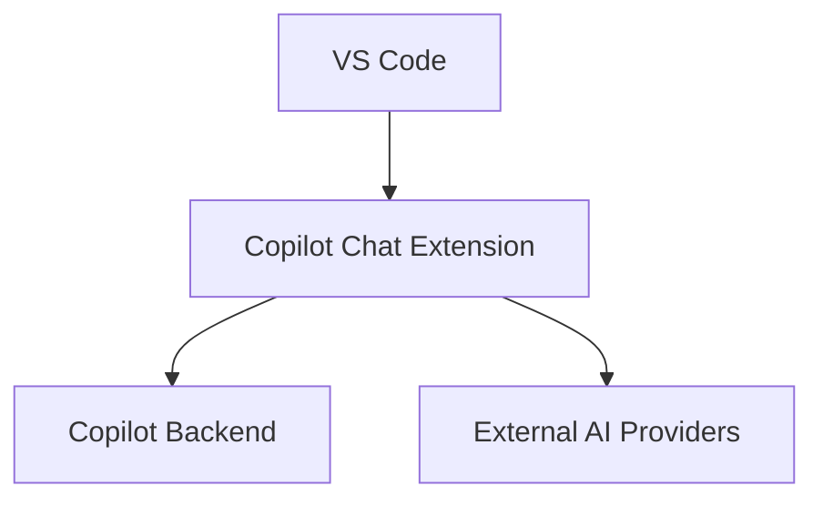

**Diagram sources**
- [package.json](file://package.json#L81-L149)
- [src/extension/conversation/vscode-node/conversationFeature.ts](file://src/extension/conversation/vscode-node/conversationFeature.ts#L90-L111)
- [src/platform/endpoint/common/domainService.ts](file://src/platform/endpoint/common/domainService.ts)

**Section sources**
- [package.json](file://package.json#L81-L149)
- [src/extension/conversation/vscode-node/conversationFeature.ts](file://src/extension/conversation/vscode-node/conversationFeature.ts#L90-L111)

### Technology Stack
- Language and Runtime: TypeScript, Node.js, VS Code Extension Host
- Core Libraries: VS Code platform APIs, proposed APIs, extension contribution points
- Backend Integration: GitHub Copilot services, domain endpoints, telemetry
- Tooling: MCP servers, language model tools, embedding and search indexes

**Section sources**
- [README.md](file://README.md#L1-L91)
- [package.json](file://package.json#L1-L800)

### Scalability and Deployment Topology
- Local Development: Runs within VS Code extension host; relies on local embeddings and tools.
- Distributed Scenarios: Remote search and code search services enable scaling across large repositories.
- Observability: OpenTelemetry contributions and telemetry services support monitoring and alerting.

[No sources needed since this section provides general guidance]