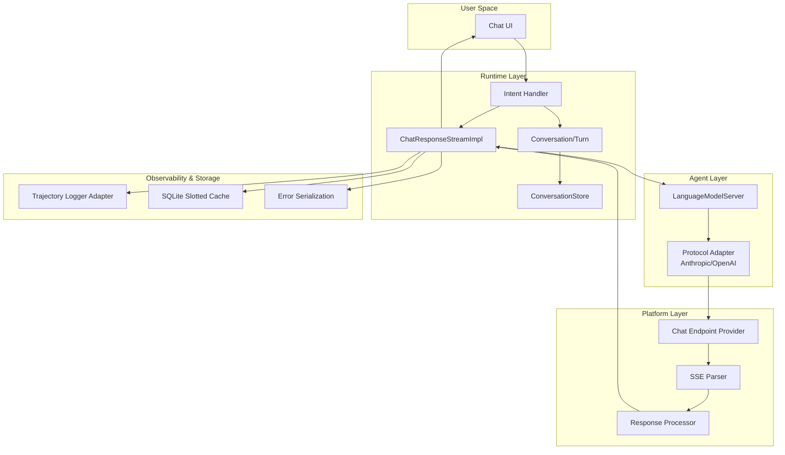
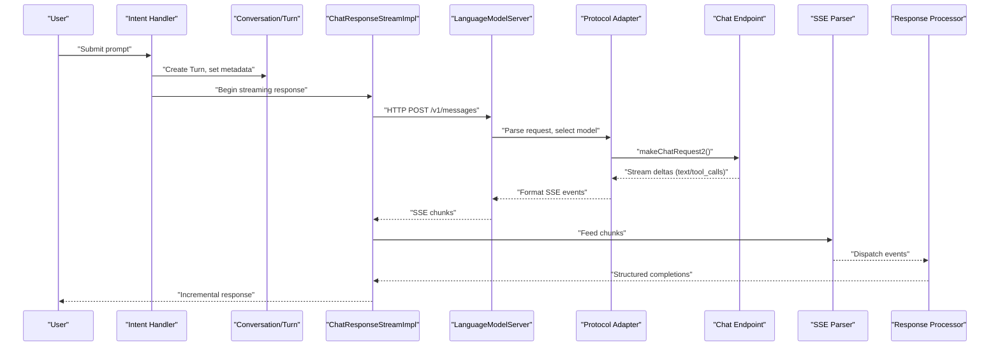
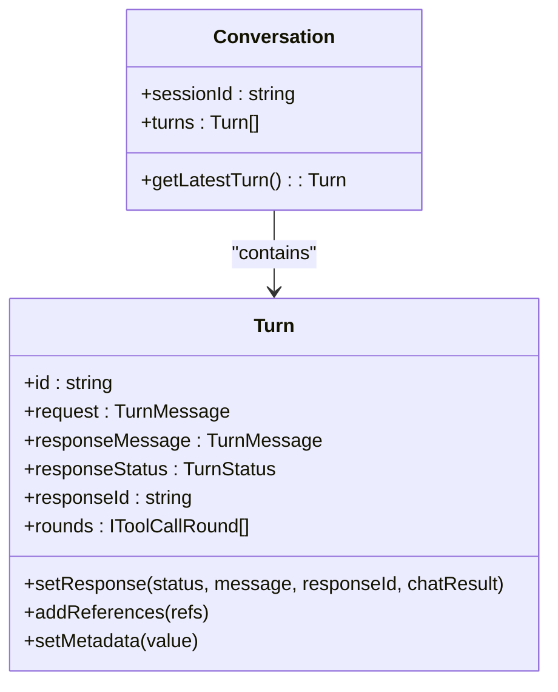
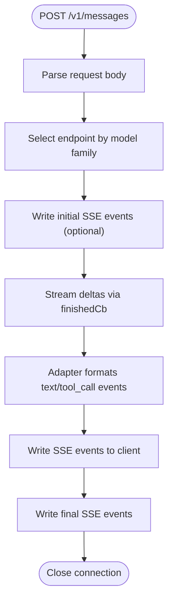
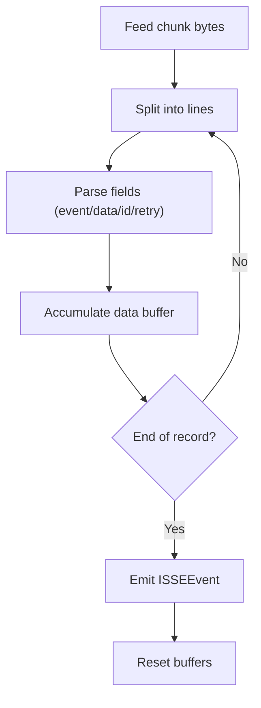
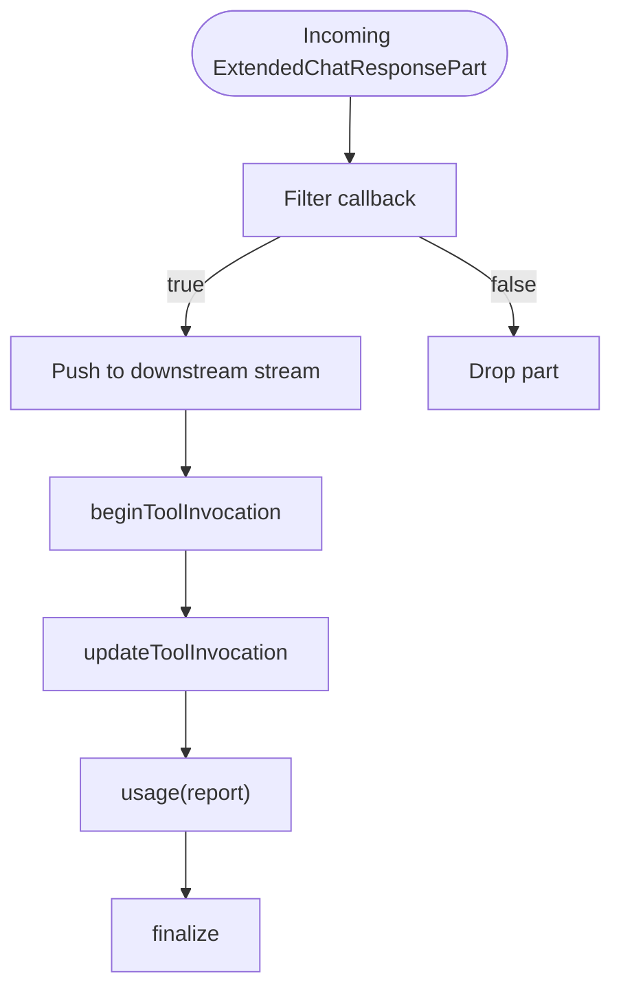
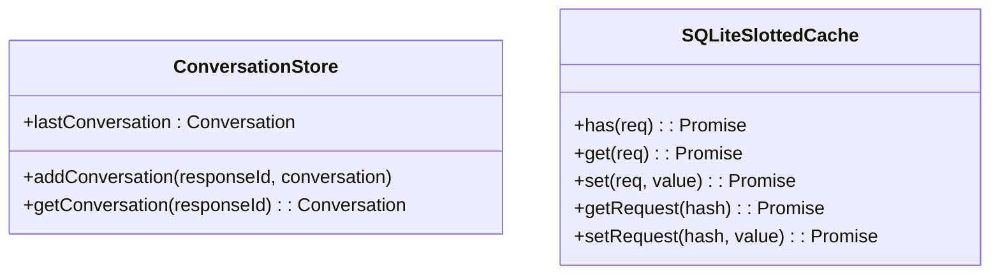
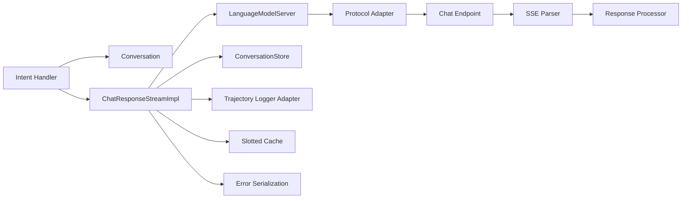

# Data Flow & Communication Patterns

<cite>
**Referenced Files in This Document**
- [conversation.ts](file://src/extension/prompt/common/conversation.ts)
- [langModelServer.ts](file://src/extension/agents/node/langModelServer.ts)
- [anthropicAdapter.ts](file://src/extension/agents/node/adapters/anthropicAdapter.ts)
- [openaiAdapterForSTests.ts](file://src/extension/agents/node/adapters/openaiAdapterForSTests.ts)
- [sseParser.ts](file://src/util/vs/base/common/sseParser.ts)
- [responsesApi.ts](file://src/platform/endpoint/node/responsesApi.ts)
- [chatEndpoint.ts](file://src/platform/endpoint/node/chatEndpoint.ts)
- [chatResponseStreamImpl.ts](file://src/util/common/chatResponseStreamImpl.ts)
- [defaultIntentRequestHandler.ts](file://src/extension/prompt/node/defaultIntentRequestHandler.ts)
- [conversationStore.ts](file://src/extension/conversationStore/node/conversationStore.ts)
- [rpc.ts](file://src/util/vs/base/common/observableInternal/logging/debugger/rpc.ts)
- [event.ts](file://src/util/vs/base/common/event.ts)
- [cache.ts](file://test/base/cache.ts)
- [trajectoryLoggerAdapter.ts](file://src/platform/trajectory/node/trajectoryLoggerAdapter.ts)
- [workspaceChunkSearchService.ts](file://src/platform/workspaceChunkSearch/node/workspaceChunkSearchService.ts)
- [errors.ts](file://src/util/vs/base/common/errors.ts)
</cite>

## Table of Contents
1. [Introduction](#introduction)
2. [Project Structure](#project-structure)
3. [Core Components](#core-components)
4. [Architecture Overview](#architecture-overview)
5. [Detailed Component Analysis](#detailed-component-analysis)
6. [Dependency Analysis](#dependency-analysis)
7. [Performance Considerations](#performance-considerations)
8. [Troubleshooting Guide](#troubleshooting-guide)
9. [Conclusion](#conclusion)

## Introduction
This document explains the data flow and communication patterns in VSCode Copilot Chat. It focuses on the asynchronous architecture, event-driven processing, and message passing across components. It documents the end-to-end conversation flow from user input through agent processing to streamed response generation, including streaming semantics, real-time communication with AI models, caching strategies, and performance optimizations. It also covers error handling, retries, and coordination of distributed operations.

## Project Structure
The system is organized around:
- Prompt and conversation modeling for structured turn-based exchanges
- Streaming server and protocol adapters for real-time model responses
- SSE parsing and response processors for incremental delivery
- Chat session orchestration and response stream transformations
- Caching and trajectory logging for observability and performance

**Diagram sources**
- [langModelServer.ts](file://src/extension/agents/node/langModelServer.ts#L33-L114)
- [anthropicAdapter.ts](file://src/extension/agents/node/adapters/anthropicAdapter.ts#L218-L261)
- [openaiAdapterForSTests.ts](file://src/extension/agents/node/adapters/openaiAdapterForSTests.ts#L145-L173)
- [sseParser.ts](file://src/util/vs/base/common/sseParser.ts#L53-L245)
- [responsesApi.ts](file://src/platform/endpoint/node/responsesApi.ts#L424-L448)
- [chatEndpoint.ts](file://src/platform/endpoint/node/chatEndpoint.ts#L42-L62)
- [chatResponseStreamImpl.ts](file://src/util/common/chatResponseStreamImpl.ts#L53-L102)
- [conversation.ts](file://src/extension/prompt/common/conversation.ts#L224-L243)
- [conversationStore.ts](file://src/extension/conversationStore/node/conversationStore.ts#L20-L39)
- [trajectoryLoggerAdapter.ts](file://src/platform/trajectory/node/trajectoryLoggerAdapter.ts#L125-L166)
- [cache.ts](file://test/base/cache.ts#L341-L381)
- [errors.ts](file://src/util/vs/base/common/errors.ts#L135-L178)

**Section sources**
- [langModelServer.ts](file://src/extension/agents/node/langModelServer.ts#L33-L114)
- [conversation.ts](file://src/extension/prompt/common/conversation.ts#L224-L243)
- [sseParser.ts](file://src/util/vs/base/common/sseParser.ts#L53-L245)
- [responsesApi.ts](file://src/platform/endpoint/node/responsesApi.ts#L424-L448)
- [chatEndpoint.ts](file://src/platform/endpoint/node/chatEndpoint.ts#L42-L62)
- [chatResponseStreamImpl.ts](file://src/util/common/chatResponseStreamImpl.ts#L53-L102)
- [conversationStore.ts](file://src/extension/conversationStore/node/conversationStore.ts#L20-L39)
- [trajectoryLoggerAdapter.ts](file://src/platform/trajectory/node/trajectoryLoggerAdapter.ts#L125-L166)
- [cache.ts](file://test/base/cache.ts#L341-L381)
- [errors.ts](file://src/util/vs/base/common/errors.ts#L135-L178)

## Core Components
- Conversation and Turn modeling define the lifecycle of a chat exchange, including metadata, tool call rounds, and token usage.
- LanguageModelServer exposes a local HTTP endpoint that accepts model requests, streams incremental responses via SSE, and integrates with protocol adapters.
- Protocol adapters translate between internal streaming blocks and provider-specific SSE events.
- SSE parsing and response processors convert raw chunks into structured completions and telemetry.
- ChatResponseStreamImpl transforms and filters response parts, coordinates tool invocations, and manages finalization.
- Intent handlers orchestrate per-intent processing and update conversation state.
- ConversationStore caches recent conversations for quick retrieval.
- Trajectory logger adapter records agent steps and reasoning deltas for observability.
- Slotted cache stores request/response pairs keyed by hashes and slots for reuse.

**Section sources**
- [conversation.ts](file://src/extension/prompt/common/conversation.ts#L224-L243)
- [langModelServer.ts](file://src/extension/agents/node/langModelServer.ts#L33-L114)
- [anthropicAdapter.ts](file://src/extension/agents/node/adapters/anthropicAdapter.ts#L218-L261)
- [openaiAdapterForSTests.ts](file://src/extension/agents/node/adapters/openaiAdapterForSTests.ts#L145-L173)
- [sseParser.ts](file://src/util/vs/base/common/sseParser.ts#L53-L245)
- [responsesApi.ts](file://src/platform/endpoint/node/responsesApi.ts#L424-L448)
- [chatEndpoint.ts](file://src/platform/endpoint/node/chatEndpoint.ts#L42-L62)
- [chatResponseStreamImpl.ts](file://src/util/common/chatResponseStreamImpl.ts#L53-L102)
- [defaultIntentRequestHandler.ts](file://src/extension/prompt/node/defaultIntentRequestHandler.ts#L105-L129)
- [conversationStore.ts](file://src/extension/conversationStore/node/conversationStore.ts#L20-L39)
- [trajectoryLoggerAdapter.ts](file://src/platform/trajectory/node/trajectoryLoggerAdapter.ts#L125-L166)
- [cache.ts](file://test/base/cache.ts#L341-L381)

## Architecture Overview
The system follows an event-driven, streaming-first architecture:
- User input enters via an intent handler that builds a Turn and updates conversation state.
- The agent invokes a language model server that selects an endpoint, streams incremental deltas, and formats them via adapters.
- SSE chunks are parsed and processed into structured completions, which are emitted through a response stream.
- Observability and caching layers record trajectories and persist responses for reuse.

**Diagram sources**
- [defaultIntentRequestHandler.ts](file://src/extension/prompt/node/defaultIntentRequestHandler.ts#L105-L129)
- [conversation.ts](file://src/extension/prompt/common/conversation.ts#L224-L243)
- [chatResponseStreamImpl.ts](file://src/util/common/chatResponseStreamImpl.ts#L53-L102)
- [langModelServer.ts](file://src/extension/agents/node/langModelServer.ts#L143-L288)
- [anthropicAdapter.ts](file://src/extension/agents/node/adapters/anthropicAdapter.ts#L218-L261)
- [responsesApi.ts](file://src/platform/endpoint/node/responsesApi.ts#L424-L448)
- [sseParser.ts](file://src/util/vs/base/common/sseParser.ts#L53-L245)

## Detailed Component Analysis

### Conversation and Turn Lifecycle
- Turns encapsulate a single exchange with status tracking, references, and tool call rounds.
- Conversations maintain ordered turns and expose helpers to access the latest turn.
- Token usage metadata and rendered content enable summarization and caching.

**Diagram sources**
- [conversation.ts](file://src/extension/prompt/common/conversation.ts#L224-L243)
- [conversation.ts](file://src/extension/prompt/common/conversation.ts#L58-L189)

**Section sources**
- [conversation.ts](file://src/extension/prompt/common/conversation.ts#L224-L243)
- [conversation.ts](file://src/extension/prompt/common/conversation.ts#L58-L189)

### Streaming Server and Protocol Adapters
- The LanguageModelServer creates an HTTP server, authenticates via nonce, parses requests, selects endpoints, and streams deltas to clients.
- Protocol adapters generate initial/final SSE events and format incremental blocks (text/tool calls) into provider-specific event payloads.
- Token usage adjustments account for model context windows and scaling factors.

**Diagram sources**
- [langModelServer.ts](file://src/extension/agents/node/langModelServer.ts#L143-L288)
- [anthropicAdapter.ts](file://src/extension/agents/node/adapters/anthropicAdapter.ts#L218-L261)
- [openaiAdapterForSTests.ts](file://src/extension/agents/node/adapters/openaiAdapterForSTests.ts#L145-L173)

**Section sources**
- [langModelServer.ts](file://src/extension/agents/node/langModelServer.ts#L143-L288)
- [anthropicAdapter.ts](file://src/extension/agents/node/adapters/anthropicAdapter.ts#L218-L261)
- [openaiAdapterForSTests.ts](file://src/extension/agents/node/adapters/openaiAdapterForSTests.ts#L145-L173)

### SSE Parsing and Response Processing
- SSEParser interprets event-stream frames and dispatches typed events.
- Response processors convert SSE payloads into structured completions, emit telemetry, and feed results to consumers.

**Diagram sources**
- [sseParser.ts](file://src/util/vs/base/common/sseParser.ts#L53-L245)
- [responsesApi.ts](file://src/platform/endpoint/node/responsesApi.ts#L424-L448)
- [chatEndpoint.ts](file://src/platform/endpoint/node/chatEndpoint.ts#L42-L62)

**Section sources**
- [sseParser.ts](file://src/util/vs/base/common/sseParser.ts#L53-L245)
- [responsesApi.ts](file://src/platform/endpoint/node/responsesApi.ts#L424-L448)
- [chatEndpoint.ts](file://src/platform/endpoint/node/chatEndpoint.ts#L42-L62)

### Response Stream Transformation Pipeline
- ChatResponseStreamImpl provides filtering and mapping of response parts, tool invocation coordination, and usage reporting.
- It integrates with downstream UI and tooling by forwarding deltas and managing lifecycle events.

**Diagram sources**
- [chatResponseStreamImpl.ts](file://src/util/common/chatResponseStreamImpl.ts#L53-L102)

**Section sources**
- [chatResponseStreamImpl.ts](file://src/util/common/chatResponseStreamImpl.ts#L53-L102)

### Intent Handling and Conversation Updates
- The default intent request handler orchestrates intent invocation, sets metadata, and writes friendly messages on cancellation.
- It updates the current Turn with invocation metadata and drives the conversation forward.

**Section sources**
- [defaultIntentRequestHandler.ts](file://src/extension/prompt/node/defaultIntentRequestHandler.ts#L105-L129)

### Conversation Store and Caching Strategies
- ConversationStore maintains an LRU cache keyed by responseId for quick retrieval of recent conversations.
- Test-level slotted cache persists request/response pairs with request hashing and slotting to support deterministic reuse.

**Diagram sources**
- [conversationStore.ts](file://src/extension/conversationStore/node/conversationStore.ts#L20-L39)
- [cache.ts](file://test/base/cache.ts#L341-L381)

**Section sources**
- [conversationStore.ts](file://src/extension/conversationStore/node/conversationStore.ts#L20-L39)
- [cache.ts](file://test/base/cache.ts#L341-L381)

### Observability and Trajectory Logging
- Trajectory logger adapter extracts reasoning deltas and records agent steps with model name and timestamps for traceability.

**Section sources**
- [trajectoryLoggerAdapter.ts](file://src/platform/trajectory/node/trajectoryLoggerAdapter.ts#L125-L166)

### Distributed Coordination and RPC
- A lightweight RPC abstraction enables typed notifications and requests across sides, with error propagation and result handling.

**Section sources**
- [rpc.ts](file://src/util/vs/base/common/observableInternal/logging/debugger/rpc.ts#L39-L98)

### Event-Driven Infrastructure
- Event emitters and async emitters coordinate asynchronous dispatch, listener error handling, and performance monitoring for queued deliveries.

**Section sources**
- [event.ts](file://src/util/vs/base/common/event.ts#L1285-L1394)

### Error Handling and Serialization
- Errors are transformed for serialization/deserialization to preserve stack traces, codes, and causal chains across boundaries.

**Section sources**
- [errors.ts](file://src/util/vs/base/common/errors.ts#L135-L178)

## Dependency Analysis
The following diagram highlights key dependencies among streaming and orchestration components:

**Diagram sources**
- [defaultIntentRequestHandler.ts](file://src/extension/prompt/node/defaultIntentRequestHandler.ts#L105-L129)
- [conversation.ts](file://src/extension/prompt/common/conversation.ts#L224-L243)
- [chatResponseStreamImpl.ts](file://src/util/common/chatResponseStreamImpl.ts#L53-L102)
- [langModelServer.ts](file://src/extension/agents/node/langModelServer.ts#L143-L288)
- [anthropicAdapter.ts](file://src/extension/agents/node/adapters/anthropicAdapter.ts#L218-L261)
- [responsesApi.ts](file://src/platform/endpoint/node/responsesApi.ts#L424-L448)
- [sseParser.ts](file://src/util/vs/base/common/sseParser.ts#L53-L245)
- [conversationStore.ts](file://src/extension/conversationStore/node/conversationStore.ts#L20-L39)
- [trajectoryLoggerAdapter.ts](file://src/platform/trajectory/node/trajectoryLoggerAdapter.ts#L125-L166)
- [cache.ts](file://test/base/cache.ts#L341-L381)
- [errors.ts](file://src/util/vs/base/common/errors.ts#L135-L178)

**Section sources**
- [langModelServer.ts](file://src/extension/agents/node/langModelServer.ts#L143-L288)
- [responsesApi.ts](file://src/platform/endpoint/node/responsesApi.ts#L424-L448)
- [chatResponseStreamImpl.ts](file://src/util/common/chatResponseStreamImpl.ts#L53-L102)
- [conversationStore.ts](file://src/extension/conversationStore/node/conversationStore.ts#L20-L39)
- [trajectoryLoggerAdapter.ts](file://src/platform/trajectory/node/trajectoryLoggerAdapter.ts#L125-L166)
- [cache.ts](file://test/base/cache.ts#L341-L381)
- [errors.ts](file://src/util/vs/base/common/errors.ts#L135-L178)

## Performance Considerations
- Streaming-first design minimizes latency by delivering incremental tokens and tool calls as soon as available.
- SSE parsing is optimized for incremental chunk processing with minimal allocations.
- Endpoint selection and model mapping reduce overhead by choosing appropriate providers.
- Slotted caching reduces repeated computation by storing request/response pairs keyed by hash and slot.
- Token usage adjustments and summarization metadata help manage context window pressure and long conversations.

[No sources needed since this section provides general guidance]

## Troubleshooting Guide
- Streaming disconnects: The server cancels the request token on client close and writes final events before ending the response.
- SSE parsing errors: Broken or incomplete JSON is skipped; ensure the provider emits valid SSE frames.
- Cancellation: Client-initiated cancellations stop delta emission and finalize the stream gracefully.
- Error serialization: Errors are transformed for cross-boundary transport while preserving stack and codes.

**Section sources**
- [langModelServer.ts](file://src/extension/agents/node/langModelServer.ts#L174-L183)
- [sseParser.ts](file://src/util/vs/base/common/sseParser.ts#L132-L200)
- [chatEndpoint.ts](file://src/platform/endpoint/node/chatEndpoint.ts#L42-L62)
- [errors.ts](file://src/util/vs/base/common/errors.ts#L135-L178)

## Conclusion
VSCode Copilot Chat’s architecture emphasizes asynchronous, event-driven communication with a strong focus on streaming responses and real-time model interaction. The layered design—intent orchestration, streaming server, SSE parsing, and response transformation—enables responsive, observable, and efficient chat experiences. Robust caching, trajectory logging, and error handling further enhance reliability and performance across distributed operations.