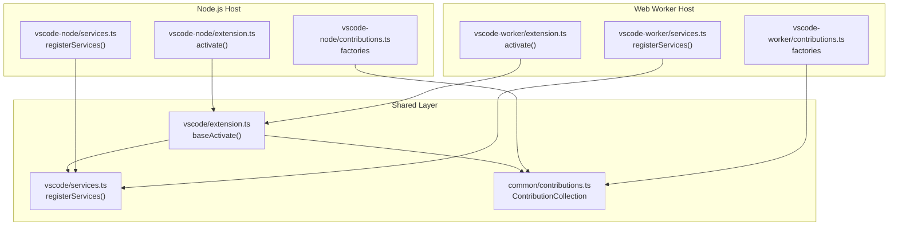
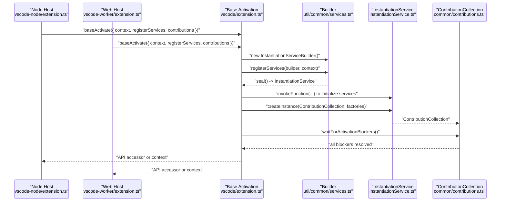
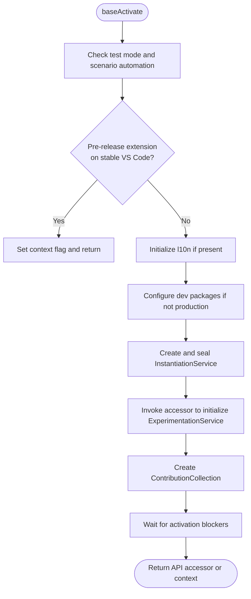
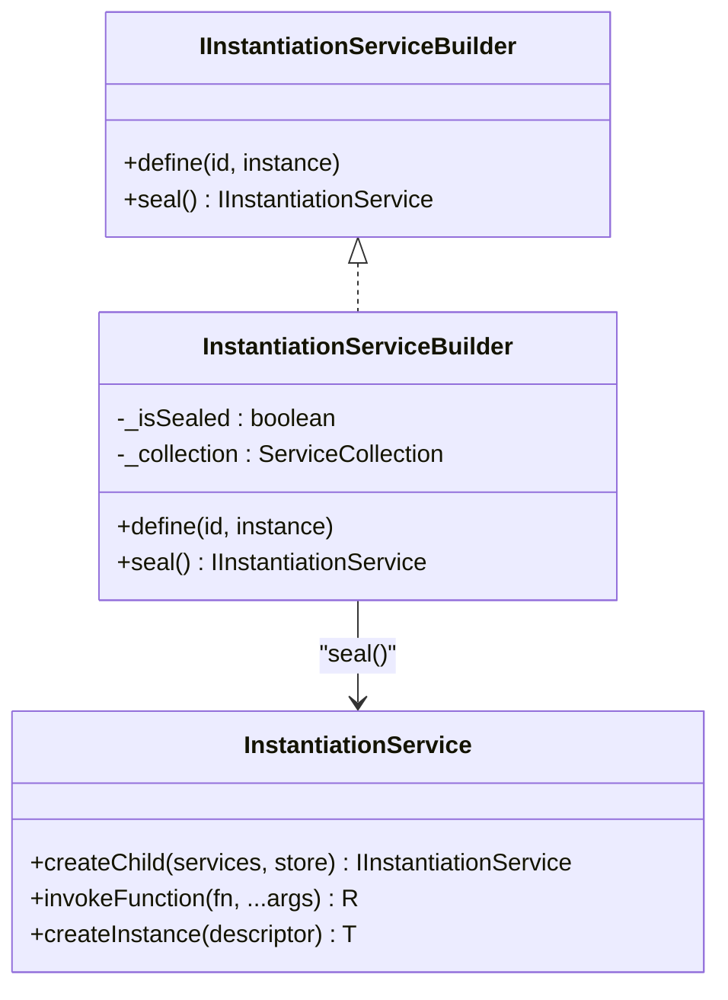
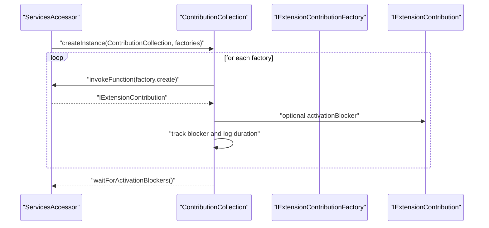
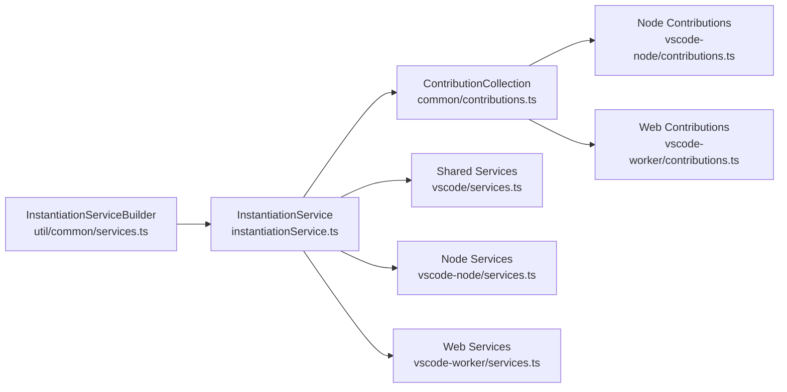

# Extension Host Model

<cite>
**Referenced Files in This Document**
- [src/extension/extension/vscode/extension.ts](file://src/extension/extension/vscode/extension.ts)
- [src/extension/extension/vscode-node/extension.ts](file://src/extension/extension/vscode-node/extension.ts)
- [src/extension/extension/vscode-worker/extension.ts](file://src/extension/extension/vscode-worker/extension.ts)
- [src/extension/extension/vscode/contributions.ts](file://src/extension/extension/vscode/contributions.ts)
- [src/extension/extension/vscode-node/contributions.ts](file://src/extension/extension/vscode-node/contributions.ts)
- [src/extension/extension/vscode-worker/contributions.ts](file://src/extension/extension/vscode-worker/contributions.ts)
- [src/extension/extension/vscode/services.ts](file://src/extension/extension/vscode/services.ts)
- [src/extension/extension/vscode-node/services.ts](file://src/extension/extension/vscode-node/services.ts)
- [src/extension/extension/vscode-worker/services.ts](file://src/extension/extension/vscode-worker/services.ts)
- [src/util/common/services.ts](file://src/util/common/services.ts)
- [src/util/vs/platform/instantiation/common/instantiationService.ts](file://src/util/vs/platform/instantiation/common/instantiationService.ts)
- [src/util/vs/platform/instantiation/common/instantiation.ts](file://src/util/vs/platform/instantiation/common/instantiation.ts)
- [CONTRIBUTING.md](file://CONTRIBUTING.md)
- [src/extension/common/contributions.ts](file://src/extension/common/contributions.ts)
- [src/platform/env/common/envService.ts](file://src/platform/env/common/envService.ts)
- [src/util/common/vscodeVersion.ts](file://src/util/common/vscodeVersion.ts)
</cite>

## Table of Contents
1. [Introduction](#introduction)
2. [Project Structure](#project-structure)
3. [Core Components](#core-components)
4. [Architecture Overview](#architecture-overview)
5. [Detailed Component Analysis](#detailed-component-analysis)
6. [Dependency Analysis](#dependency-analysis)
7. [Performance Considerations](#performance-considerations)
8. [Troubleshooting Guide](#troubleshooting-guide)
9. [Conclusion](#conclusion)

## Introduction
This document explains the extension host model used by the VSCode Copilot Chat extension. It focuses on the dual-host architecture supporting both Node.js and Web (worker) extension hosts, the base activation pattern, and the service initialization workflow. It documents the IInstantiationServiceBuilder pattern for dependency injection, the ContributionCollection system for managing extension contributions, and the activation lifecycle including pre-release version handling. It also covers how the extension handles different VSCode environments (stable, insiders, OSS) and the service registration process, with practical examples of service creation, contribution registration, and the relationship between extension activation and platform services. Finally, it outlines the technical decisions behind supporting multiple extension hosts and the benefits for cross-platform compatibility.

## Project Structure
The extension is organized around a shared activation layer and host-specific layers:
- Shared activation and services live under the vscode layer.
- Node.js-specific contributions and services live under the vscode-node layer.
- Web worker-specific contributions live under the vscode-worker layer.
- A lightweight builder pattern encapsulates dependency injection and service sealing.

**Diagram sources**
- [src/extension/extension/vscode/extension.ts](file://src/extension/extension/vscode/extension.ts#L33-L107)
- [src/extension/extension/vscode/services.ts](file://src/extension/extension/vscode/services.ts#L113-L179)
- [src/extension/common/contributions.ts](file://src/extension/common/contributions.ts#L41-L77)
- [src/extension/extension/vscode-node/extension.ts](file://src/extension/extension/vscode-node/extension.ts#L35-L43)
- [src/extension/extension/vscode-node/contributions.ts](file://src/extension/extension/vscode-node/contributions.ts#L68-L106)
- [src/extension/extension/vscode-node/services.ts](file://src/extension/extension/vscode-node/services.ts#L153-L288)
- [src/extension/extension/vscode-worker/extension.ts](file://src/extension/extension/vscode-worker/extension.ts#L19-L26)
- [src/extension/extension/vscode-worker/contributions.ts](file://src/extension/extension/vscode-worker/contributions.ts#L17-L19)
- [src/extension/extension/vscode-worker/services.ts](file://src/extension/extension/vscode-worker/services.ts#L18-L20)

**Section sources**
- [src/extension/extension/vscode/extension.ts](file://src/extension/extension/vscode/extension.ts#L17-L31)
- [CONTRIBUTING.md](file://CONTRIBUTING.md#L230-L251)

## Core Components
- Dual-host activation entry points:
  - Node.js host: [src/extension/extension/vscode-node/extension.ts](file://src/extension/extension/vscode-node/extension.ts#L35-L43)
  - Web worker host: [src/extension/extension/vscode-worker/extension.ts](file://src/extension/extension/vscode-worker/extension.ts#L19-L26)
- Shared activation and DI:
  - Base activation: [src/extension/extension/vscode/extension.ts](file://src/extension/extension/vscode/extension.ts#L33-L107)
  - Service builder: [src/util/common/services.ts](file://src/util/common/services.ts#L13-L43)
  - Instantiation service: [src/util/vs/platform/instantiation/common/instantiationService.ts](file://src/util/vs/platform/instantiation/common/instantiationService.ts#L75-L134)
- Contributions:
  - Shared contributions: [src/extension/extension/vscode/contributions.ts](file://src/extension/extension/vscode/contributions.ts#L20-L25)
  - Node contributions: [src/extension/extension/vscode-node/contributions.ts](file://src/extension/extension/vscode-node/contributions.ts#L68-L106)
  - Web contributions: [src/extension/extension/vscode-worker/contributions.ts](file://src/extension/extension/vscode-worker/contributions.ts#L17-L19)
  - Collection and activation blocker: [src/extension/common/contributions.ts](file://src/extension/common/contributions.ts#L41-L77)

**Section sources**
- [src/extension/extension/vscode/extension.ts](file://src/extension/extension/vscode/extension.ts#L33-L107)
- [src/util/common/services.ts](file://src/util/common/services.ts#L13-L43)
- [src/util/vs/platform/instantiation/common/instantiationService.ts](file://src/util/vs/platform/instantiation/common/instantiationService.ts#L75-L134)
- [src/extension/common/contributions.ts](file://src/extension/common/contributions.ts#L41-L77)
- [src/extension/extension/vscode/contributions.ts](file://src/extension/extension/vscode/contributions.ts#L20-L25)
- [src/extension/extension/vscode-node/contributions.ts](file://src/extension/extension/vscode-node/contributions.ts#L68-L106)
- [src/extension/extension/vscode-worker/contributions.ts](file://src/extension/extension/vscode-worker/contributions.ts#L17-L19)

## Architecture Overview
The extension uses a layered architecture:
- Host-specific entry points call a shared base activation routine.
- The base routine initializes an instantiation service via a builder, registers services, and then constructs and awaits contribution activation blockers.
- Contributions are grouped into factories and executed through a collection that tracks activation blockers.

**Diagram sources**
- [src/extension/extension/vscode-node/extension.ts](file://src/extension/extension/vscode-node/extension.ts#L35-L43)
- [src/extension/extension/vscode-worker/extension.ts](file://src/extension/extension/vscode-worker/extension.ts#L19-L26)
- [src/extension/extension/vscode/extension.ts](file://src/extension/extension/vscode/extension.ts#L33-L107)
- [src/util/common/services.ts](file://src/util/common/services.ts#L36-L42)
- [src/util/vs/platform/instantiation/common/instantiationService.ts](file://src/util/vs/platform/instantiation/common/instantiationService.ts#L91-L134)
- [src/extension/common/contributions.ts](file://src/extension/common/contributions.ts#L41-L77)

## Detailed Component Analysis

### Base Activation Pattern and Pre-release Handling
- Entry point and guard conditions:
  - Test-mode gating and scenario automation checks.
  - Pre-release version detection against VS Code app name to prevent activation on stable VS Code when using a pre-release extension.
- Initialization:
  - Creates the instantiation service via a builder, seals it, and subscribes it to the extension context.
  - Initializes experimentation service and ignore service asynchronously.
  - Constructs ContributionCollection and waits for activation blockers.

**Diagram sources**
- [src/extension/extension/vscode/extension.ts](file://src/extension/extension/vscode/extension.ts#L33-L107)

**Section sources**
- [src/extension/extension/vscode/extension.ts](file://src/extension/extension/vscode/extension.ts#L33-L107)
- [src/platform/env/common/envService.ts](file://src/platform/env/common/envService.ts#L1-L31)

### IInstantiationServiceBuilder Pattern and Service Registration
- Builder contract:
  - Define services with identifiers and descriptors.
  - Seal to produce a strict instantiation service.
- Registration:
  - Shared services are registered in the vscode layer.
  - Node-specific services are registered in the vscode-node layer.
  - Web worker services register only the shared subset.

**Diagram sources**
- [src/util/common/services.ts](file://src/util/common/services.ts#L13-L43)
- [src/util/vs/platform/instantiation/common/instantiationService.ts](file://src/util/vs/platform/instantiation/common/instantiationService.ts#L75-L134)

**Section sources**
- [src/util/common/services.ts](file://src/util/common/services.ts#L13-L43)
- [src/extension/extension/vscode/services.ts](file://src/extension/extension/vscode/services.ts#L113-L179)
- [src/extension/extension/vscode-node/services.ts](file://src/extension/extension/vscode-node/services.ts#L153-L288)
- [src/extension/extension/vscode-worker/services.ts](file://src/extension/extension/vscode-worker/services.ts#L18-L20)

### ContributionCollection and Activation Blockers
- ContributionCollection:
  - Iterates factories, invokes them via the accessor, and registers disposables.
  - Tracks activationBlocker promises and logs timing.
- Usage:
  - Created during base activation and awaited before returning control.

**Diagram sources**
- [src/extension/common/contributions.ts](file://src/extension/common/contributions.ts#L41-L77)

**Section sources**
- [src/extension/common/contributions.ts](file://src/extension/common/contributions.ts#L11-L25)
- [src/extension/common/contributions.ts](file://src/extension/common/contributions.ts#L41-L77)

### Host-Specific Contributions and Services
- Node.js host:
  - Entry point: [src/extension/extension/vscode-node/extension.ts](file://src/extension/extension/vscode-node/extension.ts#L35-L43)
  - Contributions: [src/extension/extension/vscode-node/contributions.ts](file://src/extension/extension/vscode-node/contributions.ts#L68-L106)
  - Services: [src/extension/extension/vscode-node/services.ts](file://src/extension/extension/vscode-node/services.ts#L153-L288)
- Web worker host:
  - Entry point: [src/extension/extension/vscode-worker/extension.ts](file://src/extension/extension/vscode-worker/extension.ts#L19-L26)
  - Contributions: [src/extension/extension/vscode-worker/contributions.ts](file://src/extension/extension/vscode-worker/contributions.ts#L17-L19)
  - Services: [src/extension/extension/vscode-worker/services.ts](file://src/extension/extension/vscode-worker/services.ts#L18-L20)

**Section sources**
- [src/extension/extension/vscode-node/extension.ts](file://src/extension/extension/vscode-node/extension.ts#L35-L43)
- [src/extension/extension/vscode-node/contributions.ts](file://src/extension/extension/vscode-node/contributions.ts#L68-L106)
- [src/extension/extension/vscode-node/services.ts](file://src/extension/extension/vscode-node/services.ts#L153-L288)
- [src/extension/extension/vscode-worker/extension.ts](file://src/extension/extension/vscode-worker/extension.ts#L19-L26)
- [src/extension/extension/vscode-worker/contributions.ts](file://src/extension/extension/vscode-worker/contributions.ts#L17-L19)
- [src/extension/extension/vscode-worker/services.ts](file://src/extension/extension/vscode-worker/services.ts#L18-L20)

### Practical Examples
- Creating a service instance:
  - Use the accessor obtained from instantiation service invocation to create instances of registered services.
  - Example path: [src/extension/extension/vscode/extension.ts](file://src/extension/extension/vscode/extension.ts#L63-L75)
- Registering a service:
  - Add a define call in the host-specific registerServices function with a SyncDescriptor or instance.
  - Example path: [src/extension/extension/vscode-node/services.ts](file://src/extension/extension/vscode-node/services.ts#L158-L160)
- Registering a contribution:
  - Export an IExtensionContributionFactory from the host-specific contributions file and include it in the host’s array.
  - Example path: [src/extension/extension/vscode-node/contributions.ts](file://src/extension/extension/vscode-node/contributions.ts#L68-L70)

**Section sources**
- [src/extension/extension/vscode/extension.ts](file://src/extension/extension/vscode/extension.ts#L63-L75)
- [src/extension/extension/vscode-node/services.ts](file://src/extension/extension/vscode-node/services.ts#L158-L160)
- [src/extension/extension/vscode-node/contributions.ts](file://src/extension/extension/vscode-node/contributions.ts#L68-L70)

## Dependency Analysis
The following diagram shows how the activation flow depends on builder, instantiation service, and contribution collection.

**Diagram sources**
- [src/util/common/services.ts](file://src/util/common/services.ts#L13-L43)
- [src/util/vs/platform/instantiation/common/instantiationService.ts](file://src/util/vs/platform/instantiation/common/instantiationService.ts#L75-L134)
- [src/extension/common/contributions.ts](file://src/extension/common/contributions.ts#L41-L77)
- [src/extension/extension/vscode/contributions.ts](file://src/extension/extension/vscode/contributions.ts#L20-L25)
- [src/extension/extension/vscode-node/contributions.ts](file://src/extension/extension/vscode-node/contributions.ts#L68-L106)
- [src/extension/extension/vscode-worker/contributions.ts](file://src/extension/extension/vscode-worker/contributions.ts#L17-L19)
- [src/extension/extension/vscode/services.ts](file://src/extension/extension/vscode/services.ts#L113-L179)
- [src/extension/extension/vscode-node/services.ts](file://src/extension/extension/vscode-node/services.ts#L153-L288)
- [src/extension/extension/vscode-worker/services.ts](file://src/extension/extension/vscode-worker/services.ts#L18-L20)

**Section sources**
- [src/util/common/services.ts](file://src/util/common/services.ts#L13-L43)
- [src/util/vs/platform/instantiation/common/instantiationService.ts](file://src/util/vs/platform/instantiation/common/instantiationService.ts#L75-L134)
- [src/extension/common/contributions.ts](file://src/extension/common/contributions.ts#L41-L77)
- [src/extension/extension/vscode/services.ts](file://src/extension/extension/vscode/services.ts#L113-L179)
- [src/extension/extension/vscode-node/services.ts](file://src/extension/extension/vscode-node/services.ts#L153-L288)
- [src/extension/extension/vscode-worker/services.ts](file://src/extension/extension/vscode-worker/services.ts#L18-L20)

## Performance Considerations
- Lazy instantiation and delayed instantiation:
  - The instantiation service supports delayed instantiation and global idle values to defer expensive initialization until needed.
  - Reference: [src/util/vs/platform/instantiation/common/instantiationService.ts](file://src/util/vs/platform/instantiation/common/instantiationService.ts#L301-L334)
- Cycle detection and recursion prevention:
  - Active instantiation tracking prevents recursive instantiation cycles.
  - Reference: [src/util/vs/platform/instantiation/common/instantiationService.ts](file://src/util/vs/platform/instantiation/common/instantiationService.ts#L199-L212)
- Contribution activation blockers:
  - Contributions can expose activationBlocker promises to defer completion of activation until readiness.
  - Reference: [src/extension/common/contributions.ts](file://src/extension/common/contributions.ts#L20-L24)

[No sources needed since this section provides general guidance]

## Troubleshooting Guide
- Pre-release extension on stable VS Code:
  - The extension sets a context key to guide users to switch channels when a pre-release extension is detected on a stable VS Code app.
  - Reference: [src/extension/extension/vscode/extension.ts](file://src/extension/extension/vscode/extension.ts#L41-L50)
- Sanitized VS Code version handling:
  - Utilities exist to sanitize VS Code versions for compatibility checks.
  - Reference: [src/util/common/vscodeVersion.ts](file://src/util/common/vscodeVersion.ts#L11-L14)
- Environment checks:
  - Environment service exposes identifiers and helpers used across the platform.
  - Reference: [src/platform/env/common/envService.ts](file://src/platform/env/common/envService.ts#L31)

**Section sources**
- [src/extension/extension/vscode/extension.ts](file://src/extension/extension/vscode/extension.ts#L41-L50)
- [src/util/common/vscodeVersion.ts](file://src/util/common/vscodeVersion.ts#L11-L14)
- [src/platform/env/common/envService.ts](file://src/platform/env/common/envService.ts#L31)

## Conclusion
The extension host model leverages a shared base activation routine and a builder-based dependency injection system to support both Node.js and Web worker extension hosts. Contributions are managed through a collection that allows controlled activation via activation blockers. The architecture ensures cross-host compatibility, defers expensive initialization, and provides clear separation between shared and host-specific services and contributions. This design enables robust operation across different VSCode environments (stable, insiders, OSS) and facilitates maintainability and extensibility.