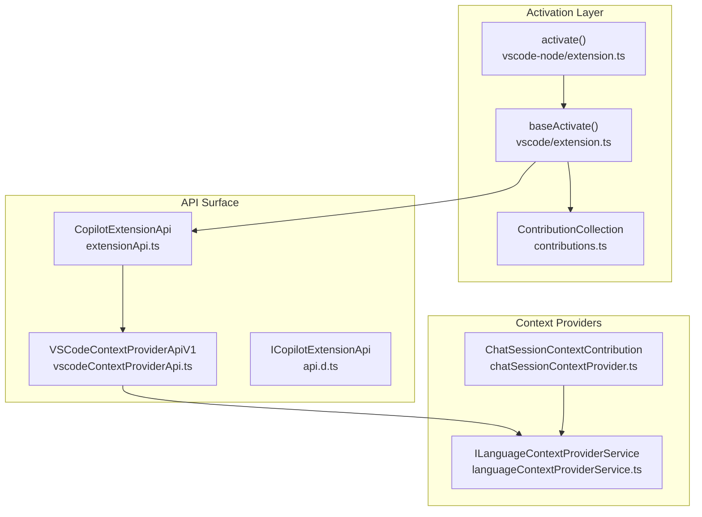
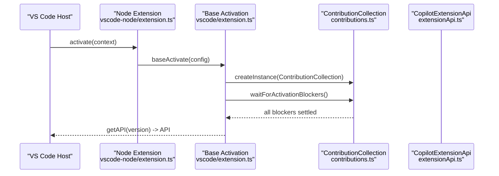
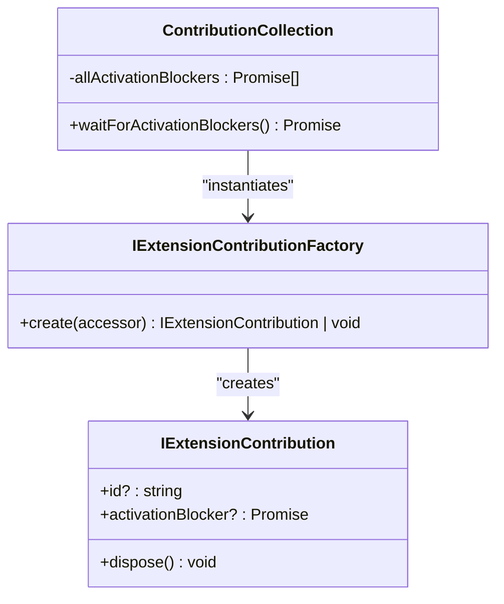
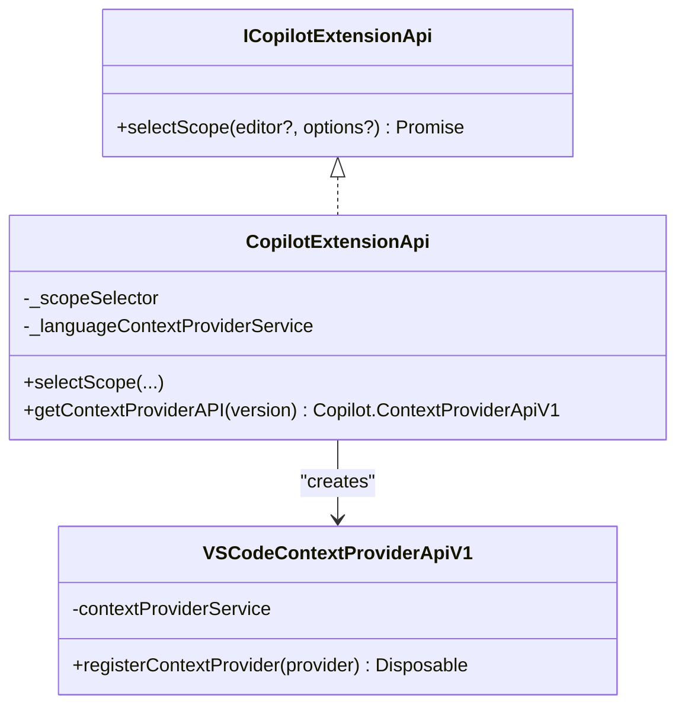
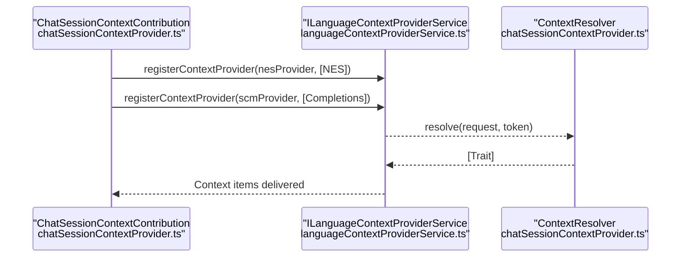
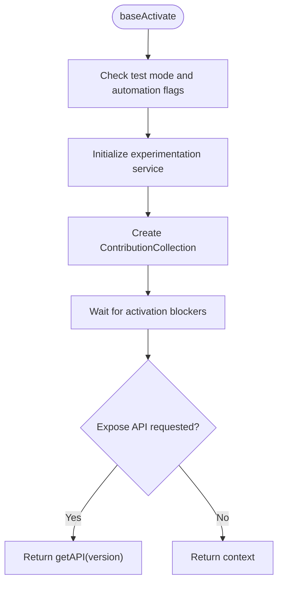
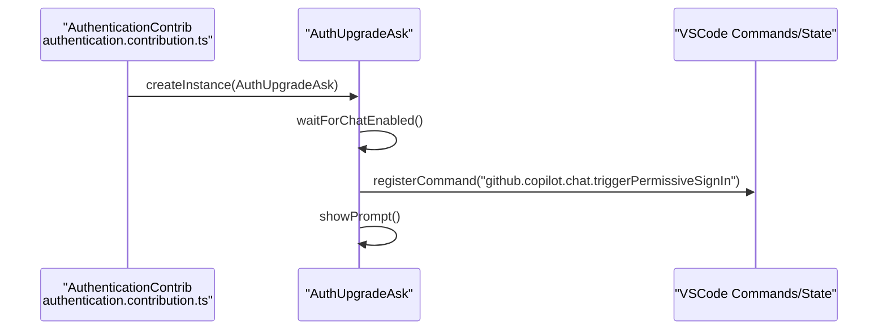
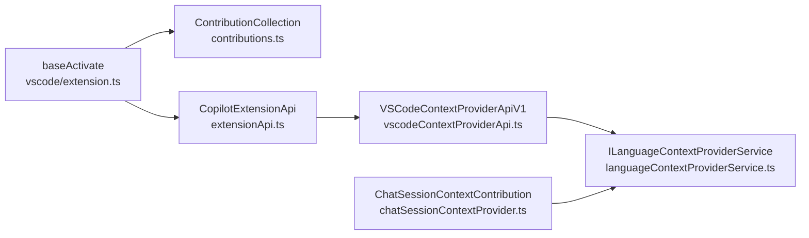

# Integration & Extension Patterns

<cite>
**Referenced Files in This Document**
- [contributions.ts](file://src/extension/common/contributions.ts)
- [extension.ts (base)](file://src/extension/extension/vscode/extension.ts)
- [extension.ts (node)](file://src/extension/extension/vscode-node/extension.ts)
- [extensionApi.ts](file://src/extension/api/vscode/extensionApi.ts)
- [api.d.ts](file://src/extension/api/vscode/api.d.ts)
- [vscodeContextProviderApi.ts](file://src/extension/api/vscode/vscodeContextProviderApi.ts)
- [languageContextProviderService.ts](file://src/platform/languageContextProvider/common/languageContextProviderService.ts)
- [chatSessionContextProvider.ts](file://src/extension/chatSessionContext/vscode-node/chatSessionContextProvider.ts)
- [authentication.contribution.ts](file://src/extension/authentication/vscode-node/authentication.contribution.ts)
- [contextKeys.contribution.ts](file://src/extension/contextKeys/vscode-node/contextKeys.contribution.ts)
</cite>

## Table of Contents
1. [Introduction](#introduction)
2. [Project Structure](#project-structure)
3. [Core Components](#core-components)
4. [Architecture Overview](#architecture-overview)
5. [Detailed Component Analysis](#detailed-component-analysis)
6. [Dependency Analysis](#dependency-analysis)
7. [Performance Considerations](#performance-considerations)
8. [Troubleshooting Guide](#troubleshooting-guide)
9. [Conclusion](#conclusion)

## Introduction
This document explains how VSCode Copilot Chat integrates and extends functionality through a robust extension contribution system, a well-defined API surface, and a flexible plugin architecture for tools and agents. It covers how external components register contributions, how the core activation pipeline orchestrates initialization, how VSCode APIs are integrated, and how context providers extend functionality. It also provides practical guidance for building compatible extensions and maintaining backward compatibility.

## Project Structure
At a high level, the extension is activated via a shared activation routine that supports both web and Node.js hosts. Contributions are collected and instantiated through a factory pattern, enabling modular initialization with optional activation blockers. The API surface exposes a versioned extension API and a context provider API for integrating with Copilot’s language model context system.

**Diagram sources**
- [extension.ts (base)](file://src/extension/extension/vscode/extension.ts#L33-L90)
- [extension.ts (node)](file://src/extension/extension/vscode-node/extension.ts#L35-L43)
- [contributions.ts](file://src/extension/common/contributions.ts#L41-L77)
- [extensionApi.ts](file://src/extension/api/vscode/extensionApi.ts#L13-L32)
- [vscodeContextProviderApi.ts](file://src/extension/api/vscode/vscodeContextProviderApi.ts#L11-L21)
- [languageContextProviderService.ts](file://src/platform/languageContextProvider/common/languageContextProviderService.ts#L16-L30)
- [chatSessionContextProvider.ts](file://src/extension/chatSessionContext/vscode-node/chatSessionContextProvider.ts#L28-L110)

**Section sources**
- [extension.ts (base)](file://src/extension/extension/vscode/extension.ts#L17-L108)
- [extension.ts (node)](file://src/extension/extension/vscode-node/extension.ts#L1-L44)
- [contributions.ts](file://src/extension/common/contributions.ts#L11-L78)
- [languageContextProviderService.ts](file://src/platform/languageContextProvider/common/languageContextProviderService.ts#L11-L31)

## Core Components
- Extension activation and contribution orchestration:
  - Shared activation routine initializes services, waits for activation blockers, and exposes a versioned API.
  - Contribution factories instantiate contributions lazily and collect optional activation blockers.
- API surface:
  - A versioned extension API provides scoped capabilities and a context provider API for registering context providers.
- Context provider system:
  - A service registers and resolves context providers targeting different subsystems (e.g., completion engine, NES).

Key responsibilities:
- Activation: [baseActivate](file://src/extension/extension/vscode/extension.ts#L33-L90)
- Contribution collection: [ContributionCollection](file://src/extension/common/contributions.ts#L41-L77)
- Extension API: [CopilotExtensionApi](file://src/extension/api/vscode/extensionApi.ts#L13-L32), [ICopilotExtensionApi](file://src/extension/api/vscode/api.d.ts#L11-L20)
- Context provider API: [VSCodeContextProviderApiV1](file://src/extension/api/vscode/vscodeContextProviderApi.ts#L11-L21)
- Context provider service: [ILanguageContextProviderService](file://src/platform/languageContextProvider/common/languageContextProviderService.ts#L16-L30)

**Section sources**
- [extension.ts (base)](file://src/extension/extension/vscode/extension.ts#L33-L90)
- [contributions.ts](file://src/extension/common/contributions.ts#L41-L77)
- [extensionApi.ts](file://src/extension/api/vscode/extensionApi.ts#L13-L32)
- [api.d.ts](file://src/extension/api/vscode/api.d.ts#L11-L21)
- [vscodeContextProviderApi.ts](file://src/extension/api/vscode/vscodeContextProviderApi.ts#L11-L21)
- [languageContextProviderService.ts](file://src/platform/languageContextProvider/common/languageContextProviderService.ts#L16-L30)

## Architecture Overview
The extension uses a layered architecture:
- Activation layer: Initializes services, registers contributions, and exposes the extension API.
- Contribution layer: Provides modular initialization hooks with optional activation blockers.
- API layer: Exposes a versioned extension API and a context provider API.
- Context provider layer: Integrates with Copilot’s language model context resolution pipeline.

**Diagram sources**
- [extension.ts (node)](file://src/extension/extension/vscode-node/extension.ts#L35-L43)
- [extension.ts (base)](file://src/extension/extension/vscode/extension.ts#L33-L90)
- [contributions.ts](file://src/extension/common/contributions.ts#L73-L77)
- [extensionApi.ts](file://src/extension/api/vscode/extensionApi.ts#L13-L32)

## Detailed Component Analysis

### Extension Contribution System
- Contribution interface and factory:
  - Contributions implement a simple lifecycle with optional activation blockers and disposal.
  - Factories construct contributions via the instantiation service, enabling DI and isolation.
- Collection and activation:
  - Contributions are invoked during activation, registered for disposal, and activation blockers are awaited to avoid premature readiness.

**Diagram sources**
- [contributions.ts](file://src/extension/common/contributions.ts#L11-L39)
- [contributions.ts](file://src/extension/common/contributions.ts#L41-L77)

**Section sources**
- [contributions.ts](file://src/extension/common/contributions.ts#L11-L78)

### API Surface Design
- Versioned extension API:
  - Exposed via a version gate to maintain backward compatibility.
  - Provides scoped capabilities (e.g., selection helpers) and delegates to internal services.
- Context provider API:
  - Thin wrapper around the language context provider service, enabling registration of context providers for specific targets.

**Diagram sources**
- [api.d.ts](file://src/extension/api/vscode/api.d.ts#L11-L21)
- [extensionApi.ts](file://src/extension/api/vscode/extensionApi.ts#L13-L32)
- [vscodeContextProviderApi.ts](file://src/extension/api/vscode/vscodeContextProviderApi.ts#L11-L21)

**Section sources**
- [extensionApi.ts](file://src/extension/api/vscode/extensionApi.ts#L13-L32)
- [api.d.ts](file://src/extension/api/vscode/api.d.ts#L11-L21)
- [vscodeContextProviderApi.ts](file://src/extension/api/vscode/vscodeContextProviderApi.ts#L11-L21)

### Plugin Architecture for Tools and Agents
- Context provider plugins:
  - Plugins register providers via the context provider API, targeting specific subsystems (e.g., completions, NES).
  - Providers supply context items dynamically based on document state and request context.
- Example: Chat session context provider
  - Registers two providers (general and SCM input) and resolves context items by summarizing the last conversation, with caching and truncation logic.

**Diagram sources**
- [chatSessionContextProvider.ts](file://src/extension/chatSessionContext/vscode-node/chatSessionContextProvider.ts#L83-L110)
- [languageContextProviderService.ts](file://src/platform/languageContextProvider/common/languageContextProviderService.ts#L16-L30)
- [chatSessionContextProvider.ts](file://src/extension/chatSessionContext/vscode-node/chatSessionContextProvider.ts#L112-L166)

**Section sources**
- [chatSessionContextProvider.ts](file://src/extension/chatSessionContext/vscode-node/chatSessionContextProvider.ts#L28-L110)
- [languageContextProviderService.ts](file://src/platform/languageContextProvider/common/languageContextProviderService.ts#L16-L30)

### Extension Point System and Contribution Collection Mechanism
- Activation configuration:
  - The activation routine accepts a list of contribution factories, a service registration callback, and optional developer package configuration.
- Contribution collection:
  - Iterates factories, instantiates contributions, tracks disposables, and aggregates activation blockers.
- Backward compatibility:
  - The extension API exposes a version, and the activation routine enforces version checks before exposing the API.

**Diagram sources**
- [extension.ts (base)](file://src/extension/extension/vscode/extension.ts#L33-L90)
- [contributions.ts](file://src/extension/common/contributions.ts#L73-L77)

**Section sources**
- [extension.ts (base)](file://src/extension/extension/vscode/extension.ts#L25-L90)
- [contributions.ts](file://src/extension/common/contributions.ts#L41-L77)

### VSCode API Integration Patterns
- Authentication and context keys:
  - Contributions listen to authentication changes and update context keys accordingly, reflecting state for UI visibility and behavior.
- Command integration:
  - Commands are registered to trigger upgrades or toggle debug views, interacting with VSCode’s command system and extension context.

**Diagram sources**
- [authentication.contribution.ts](file://src/extension/authentication/vscode-node/authentication.contribution.ts#L17-L26)
- [authentication.contribution.ts](file://src/extension/authentication/vscode-node/authentication.contribution.ts#L46-L108)

**Section sources**
- [authentication.contribution.ts](file://src/extension/authentication/vscode-node/authentication.contribution.ts#L17-L109)
- [contextKeys.contribution.ts](file://src/extension/contextKeys/vscode-node/contextKeys.contribution.ts#L44-L85)

### Implementing Custom Contributions
- Implement a contribution class that adheres to the contribution contract (optional id, optional activation blocker, optional dispose).
- Provide a factory that constructs the contribution via the instantiation service.
- Register the factory in the activation configuration’s contribution list.
- Use the activation blocker sparingly to defer readiness until necessary asynchronous setup completes.

Best practices:
- Keep contributions lightweight; defer heavy work to activation blockers.
- Use disposables to manage subscriptions and timers.
- Log timing for activation blockers to detect slow contributions.

**Section sources**
- [contributions.ts](file://src/extension/common/contributions.ts#L11-L39)
- [contributions.ts](file://src/extension/common/contributions.ts#L41-L77)
- [extension.ts (base)](file://src/extension/extension/vscode/extension.ts#L33-L90)

### Creating Extension APIs
- Define a stable interface and version:
  - Expose a version property and guard API access with a version check.
- Delegate to internal services:
  - The API should delegate to platform services rather than duplicating functionality.
- Provide thin wrappers for specialized integrations:
  - Example: context provider API wraps the language context provider service.

Backward compatibility:
- Enforce version checks in the activation routine before exposing the API.
- Avoid breaking changes; introduce new versions rather than altering existing ones.

**Section sources**
- [extensionApi.ts](file://src/extension/api/vscode/extensionApi.ts#L13-L32)
- [api.d.ts](file://src/extension/api/vscode/api.d.ts#L11-L21)
- [extension.ts (base)](file://src/extension/extension/vscode/extension.ts#L82-L89)

### Extending Functionality Through Contributions
- Context providers:
  - Register providers via the context provider API to contribute dynamic context items for language model requests.
- Authentication and UX signals:
  - Use context keys to reflect authentication state and feature availability to the UI.
- Commands:
  - Register commands to expose actions that integrate with the extension’s services.

**Section sources**
- [vscodeContextProviderApi.ts](file://src/extension/api/vscode/vscodeContextProviderApi.ts#L11-L21)
- [languageContextProviderService.ts](file://src/platform/languageContextProvider/common/languageContextProviderService.ts#L16-L30)
- [contextKeys.contribution.ts](file://src/extension/contextKeys/vscode-node/contextKeys.contribution.ts#L44-L85)

## Dependency Analysis
The activation layer depends on the contribution collection, which in turn depends on the instantiation service and logging. The extension API depends on internal services and the context provider API. Context providers depend on the language context provider service and platform services.

**Diagram sources**
- [extension.ts (base)](file://src/extension/extension/vscode/extension.ts#L33-L90)
- [contributions.ts](file://src/extension/common/contributions.ts#L41-L77)
- [extensionApi.ts](file://src/extension/api/vscode/extensionApi.ts#L13-L32)
- [vscodeContextProviderApi.ts](file://src/extension/api/vscode/vscodeContextProviderApi.ts#L11-L21)
- [languageContextProviderService.ts](file://src/platform/languageContextProvider/common/languageContextProviderService.ts#L16-L30)
- [chatSessionContextProvider.ts](file://src/extension/chatSessionContext/vscode-node/chatSessionContextProvider.ts#L28-L110)

**Section sources**
- [extension.ts (base)](file://src/extension/extension/vscode/extension.ts#L33-L90)
- [contributions.ts](file://src/extension/common/contributions.ts#L41-L77)
- [extensionApi.ts](file://src/extension/api/vscode/extensionApi.ts#L13-L32)
- [vscodeContextProviderApi.ts](file://src/extension/api/vscode/vscodeContextProviderApi.ts#L11-L21)
- [languageContextProviderService.ts](file://src/platform/languageContextProvider/common/languageContextProviderService.ts#L16-L30)
- [chatSessionContextProvider.ts](file://src/extension/chatSessionContext/vscode-node/chatSessionContextProvider.ts#L28-L110)

## Performance Considerations
- Minimize synchronous work during activation; use activation blockers for asynchronous initialization.
- Cache expensive computations (e.g., summaries) and invalidate on relevant state changes.
- Limit context item sizes and total lengths to keep requests efficient.
- Avoid blocking activation on slow providers; prefer lazy initialization and background updates.

## Troubleshooting Guide
- Activation delays:
  - Investigate activation blockers reported by the contribution collection logs.
- Context provider errors:
  - Review logs from the context provider resolver and ensure providers return valid context items.
- Authentication prompts:
  - Verify authentication change events and context key updates; ensure prompts are shown only when appropriate.

**Section sources**
- [contributions.ts](file://src/extension/common/contributions.ts#L60-L66)
- [chatSessionContextProvider.ts](file://src/extension/chatSessionContext/vscode-node/chatSessionContextProvider.ts#L162-L166)
- [contextKeys.contribution.ts](file://src/extension/contextKeys/vscode-node/contextKeys.contribution.ts#L116-L176)

## Conclusion
VSCode Copilot Chat’s extensibility hinges on a clean separation of concerns: a robust activation and contribution system, a versioned API surface, and a flexible context provider architecture. By following the patterns outlined here—implementing contributions with activation blockers, delegating to internal services, and registering context providers—you can extend the core system reliably and maintain backward compatibility.