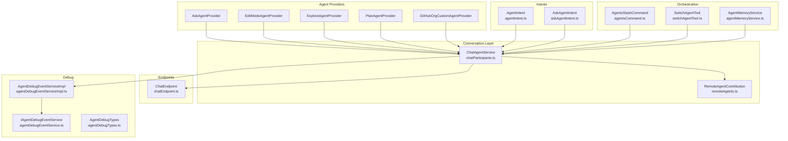
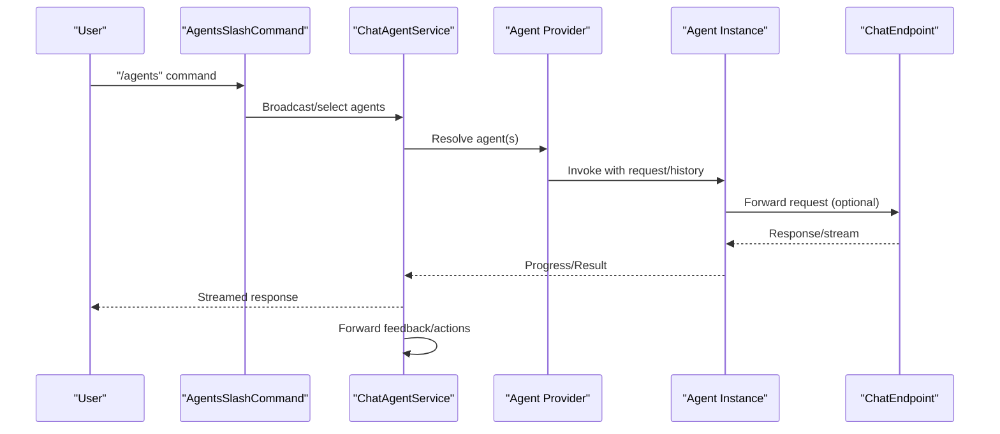
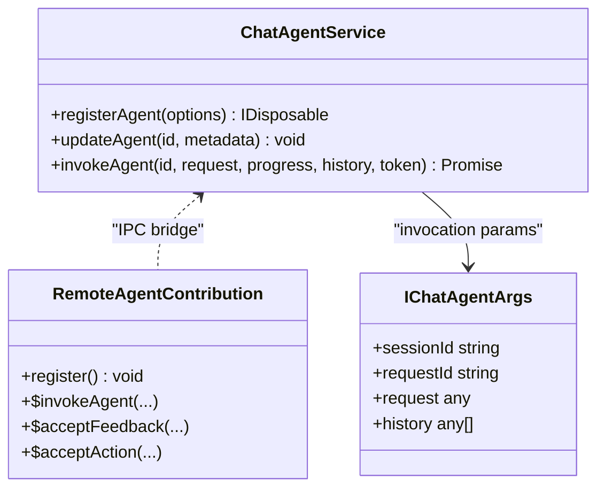
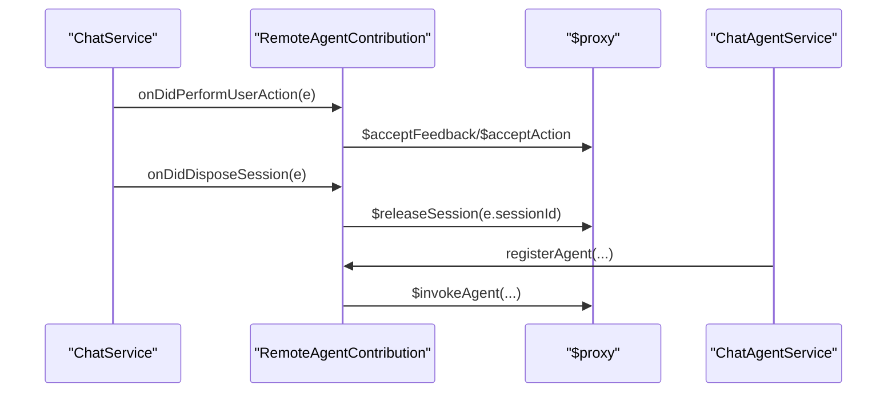
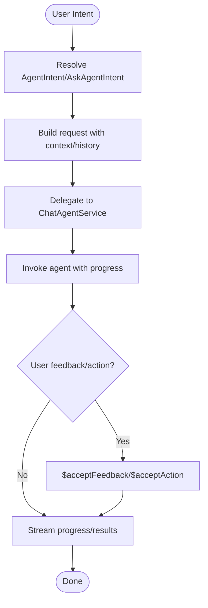
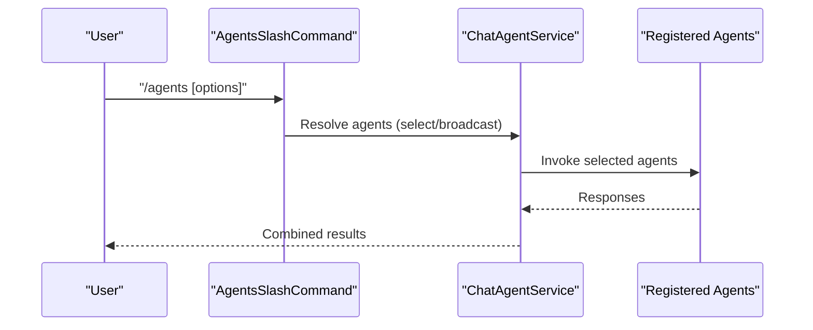
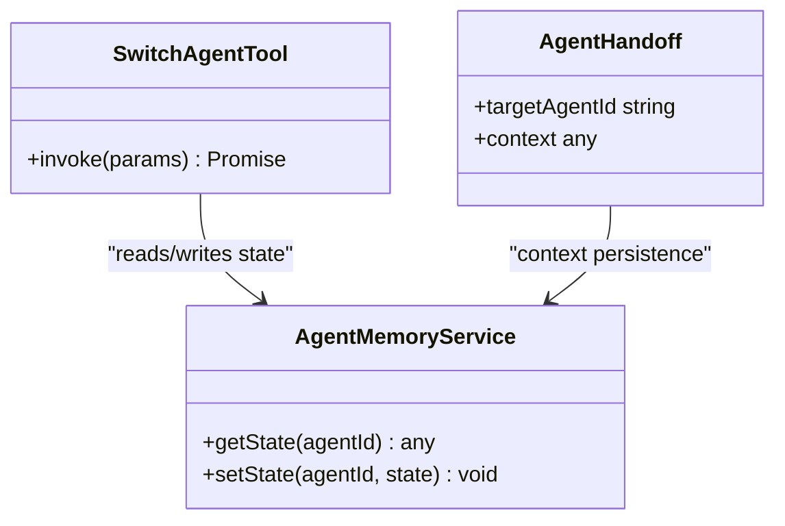
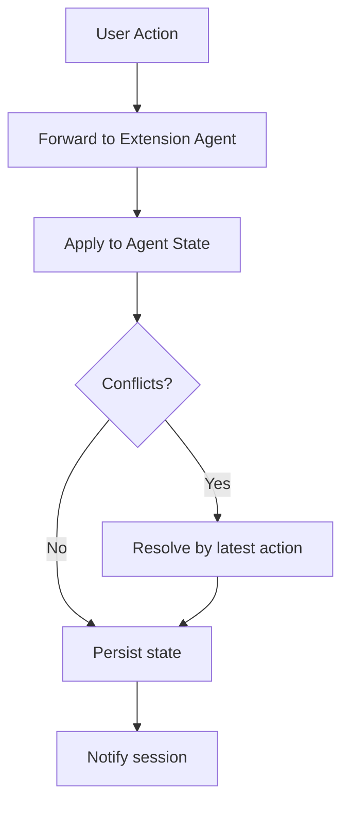
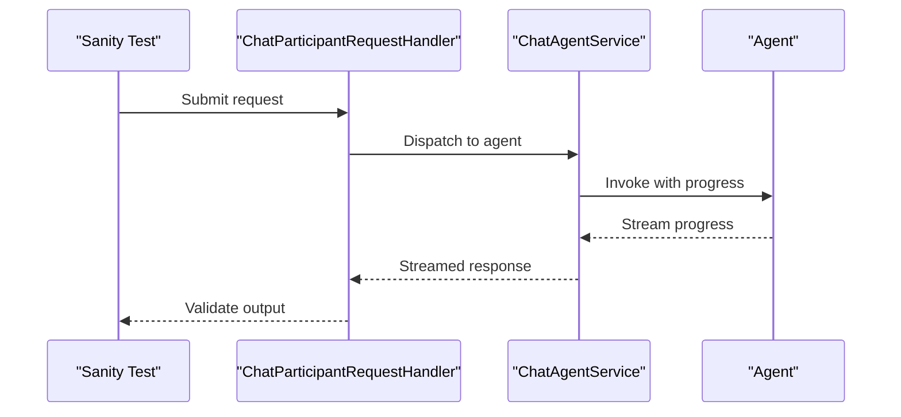
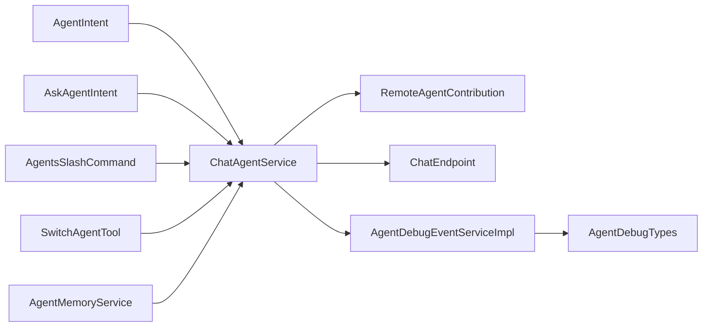

# Agent Communication & Coordination

<cite>
**Referenced Files in This Document**
- [mainThreadChatAgents2.ts](file://test/simulation/fixtures/editing/mainThreadChatAgents2.ts)
- [chatParticipants.ts](file://src/extension/conversation/vscode-node/chatParticipants.ts)
- [remoteAgents.ts](file://src/extension/conversation/vscode-node/remoteAgents.ts)
- [agentIntent.ts](file://src/extension/intents/node/agentIntent.ts)
- [askAgentIntent.ts](file://src/extension/intents/node/askAgentIntent.ts)
- [copilotCli.ts](file://src/extension/chatSessions/copilotcli/node/copilotCli.ts)
- [agentsCommand.ts](file://src/extension/chatSessions/claude/vscode-node/slashCommands/agentsCommand.ts)
- [agentTypes.ts](file://src/extension/agents/vscode-node/agentTypes.ts)
- [agentMemoryService.ts](file://src/extension/tools/common/agentMemoryService.ts)
- [switchAgentTool.ts](file://src/extension/tools/vscode-node/switchAgentTool.ts)
- [chatParticipantRequestHandler.ts](file://src/extension/prompt/node/chatParticipantRequestHandler.ts)
- [chatEndpoint.ts](file://src/platform/endpoint/node/chatEndpoint.ts)
- [sanity.sanity-test.ts](file://src/extension/test/vscode-node/sanity.sanity-test.ts)
- [agentDebugEventServiceImpl.ts](file://src/extension/agentDebug/node/agentDebugEventServiceImpl.ts)
- [agentDebugEventService.ts](file://src/extension/agentDebug/common/agentDebugEventService.ts)
- [agentDebugTypes.ts](file://src/extension/agentDebug/common/agentDebugTypes.ts)
- [chatDebug.d.ts](file://src/extension/vscode.proposed.chatDebug.d.ts)
</cite>

## Table of Contents
1. [Introduction](#introduction)
2. [Project Structure](#project-structure)
3. [Core Components](#core-components)
4. [Architecture Overview](#architecture-overview)
5. [Detailed Component Analysis](#detailed-component-analysis)
6. [Dependency Analysis](#dependency-analysis)
7. [Performance Considerations](#performance-considerations)
8. [Troubleshooting Guide](#troubleshooting-guide)
9. [Conclusion](#conclusion)
10. [Appendices](#appendices)

## Introduction
This document explains the agent communication patterns and coordination mechanisms in the multi-agent system. It covers message passing protocols, inter-agent communication channels, and coordination strategies between multiple agents. It documents the agent-to-agent messaging system, broadcast mechanisms, and selective communication patterns. It also describes the agent orchestration layer, task delegation mechanisms, and collaborative problem-solving approaches, including state synchronization, conflict resolution strategies, and consensus building. Practical multi-agent workflows, collaboration patterns, and advanced coordination scenarios are included, along with performance considerations, scalability challenges, and debugging techniques for complex agent interactions.

## Project Structure
The multi-agent system spans several subsystems:
- Conversation orchestration and agent registration
- Remote agent contribution and endpoint bridging
- Intent-driven agent invocation and delegation
- Slash command orchestration for agent selection and broadcasting
- Debugging and event capture for agent interactions
- Memory and tooling for agent state and switching

**Diagram sources**
- [chatParticipants.ts](file://src/extension/conversation/vscode-node/chatParticipants.ts#L26-L120)
- [remoteAgents.ts](file://src/extension/conversation/vscode-node/remoteAgents.ts#L89-L120)
- [agentIntent.ts](file://src/extension/intents/node/agentIntent.ts#L149-L220)
- [askAgentIntent.ts](file://src/extension/intents/node/askAgentIntent.ts#L49-L120)
- [agentsCommand.ts](file://src/extension/chatSessions/claude/vscode-node/slashCommands/agentsCommand.ts#L171-L220)
- [switchAgentTool.ts](file://src/extension/tools/vscode-node/switchAgentTool.ts#L16-L40)
- [agentMemoryService.ts](file://src/extension/tools/common/agentMemoryService.ts#L106-L160)
- [chatEndpoint.ts](file://src/platform/endpoint/node/chatEndpoint.ts#L461-L520)
- [agentDebugEventServiceImpl.ts](file://src/extension/agentDebug/node/agentDebugEventServiceImpl.ts#L79-L120)
- [agentDebugEventService.ts](file://src/extension/agentDebug/common/agentDebugEventService.ts#L18-L40)
- [agentDebugTypes.ts](file://src/extension/agentDebug/common/agentDebugTypes.ts#L25-L120)

**Section sources**
- [chatParticipants.ts](file://src/extension/conversation/vscode-node/chatParticipants.ts#L26-L120)
- [remoteAgents.ts](file://src/extension/conversation/vscode-node/remoteAgents.ts#L89-L120)
- [agentIntent.ts](file://src/extension/intents/node/agentIntent.ts#L149-L220)
- [askAgentIntent.ts](file://src/extension/intents/node/askAgentIntent.ts#L49-L120)
- [agentsCommand.ts](file://src/extension/chatSessions/claude/vscode-node/slashCommands/agentsCommand.ts#L171-L220)
- [switchAgentTool.ts](file://src/extension/tools/vscode-node/switchAgentTool.ts#L16-L40)
- [agentMemoryService.ts](file://src/extension/tools/common/agentMemoryService.ts#L106-L160)
- [chatEndpoint.ts](file://src/platform/endpoint/node/chatEndpoint.ts#L461-L520)
- [agentDebugEventServiceImpl.ts](file://src/extension/agentDebug/node/agentDebugEventServiceImpl.ts#L79-L120)
- [agentDebugEventService.ts](file://src/extension/agentDebug/common/agentDebugEventService.ts#L18-L40)
- [agentDebugTypes.ts](file://src/extension/agentDebug/common/agentDebugTypes.ts#L25-L120)

## Core Components
- ChatAgentService: Central agent registry and invocation bridge. Manages agent lifecycle, metadata updates, and IPC to extension-side agents.
- RemoteAgentContribution: Bridges local and remote agents via endpoints and handles session events.
- Agent providers: Specialized providers for ask, edit-mode, explore, plan, and GitHub org agents.
- Intents: AgentIntent and AskAgentIntent orchestrate agent invocation and delegation based on user intent.
- Orchestration tools: AgentsSlashCommand for selecting/broadcasting agents; SwitchAgentTool for dynamic agent switching; AgentMemoryService for persistent agent state.
- Endpoint: ChatEndpoint connects to remote agents and exposes a unified invocation surface.
- Debugging: AgentDebugEventServiceImpl captures structured debug events for agent interactions.

Key responsibilities:
- Message passing: Request/response via invoke, progress callbacks, and feedback forwarding.
- Broadcasting: Slash command handlers can broadcast to multiple agents.
- Coordination: Intent-driven delegation, memory-backed state, and tool-based handoffs.

**Section sources**
- [chatParticipants.ts](file://src/extension/conversation/vscode-node/chatParticipants.ts#L26-L120)
- [remoteAgents.ts](file://src/extension/conversation/vscode-node/remoteAgents.ts#L89-L120)
- [agentIntent.ts](file://src/extension/intents/node/agentIntent.ts#L149-L220)
- [askAgentIntent.ts](file://src/extension/intents/node/askAgentIntent.ts#L49-L120)
- [agentsCommand.ts](file://src/extension/chatSessions/claude/vscode-node/slashCommands/agentsCommand.ts#L171-L220)
- [switchAgentTool.ts](file://src/extension/tools/vscode-node/switchAgentTool.ts#L16-L40)
- [agentMemoryService.ts](file://src/extension/tools/common/agentMemoryService.ts#L106-L160)
- [chatEndpoint.ts](file://src/platform/endpoint/node/chatEndpoint.ts#L461-L520)
- [agentDebugEventServiceImpl.ts](file://src/extension/agentDebug/node/agentDebugEventServiceImpl.ts#L79-L120)

## Architecture Overview
The system coordinates agents through a central ChatAgentService that registers providers, forwards requests, and manages progress and feedback. Remote agents are integrated via RemoteAgentContribution and ChatEndpoint. Intents drive invocation and delegation, while slash commands enable user-driven orchestration. Debugging hooks capture structured events for observability.

**Diagram sources**
- [agentsCommand.ts](file://src/extension/chatSessions/claude/vscode-node/slashCommands/agentsCommand.ts#L171-L220)
- [chatParticipants.ts](file://src/extension/conversation/vscode-node/chatParticipants.ts#L26-L120)
- [chatEndpoint.ts](file://src/platform/endpoint/node/chatEndpoint.ts#L461-L520)

## Detailed Component Analysis

### ChatAgentService and Agent Registration
- Registers agents with metadata and invokes them with request, progress, history, and cancellation tokens.
- Forwards user actions (votes, feedback, actions) to the extension-side agent via IPC.
- Updates agent metadata dynamically and supports optional follow-ups and slash commands.

**Diagram sources**
- [chatParticipants.ts](file://src/extension/conversation/vscode-node/chatParticipants.ts#L26-L120)
- [remoteAgents.ts](file://src/extension/conversation/vscode-node/remoteAgents.ts#L89-L120)
- [chatParticipantRequestHandler.ts](file://src/extension/prompt/node/chatParticipantRequestHandler.ts#L45-L80)

**Section sources**
- [chatParticipants.ts](file://src/extension/conversation/vscode-node/chatParticipants.ts#L26-L120)
- [remoteAgents.ts](file://src/extension/conversation/vscode-node/remoteAgents.ts#L89-L120)
- [chatParticipantRequestHandler.ts](file://src/extension/prompt/node/chatParticipantRequestHandler.ts#L45-L80)

### Remote Agent Contribution and Endpoint Bridging
- Handles session lifecycle events and forwards them to the extension-side agent.
- Provides IPC methods for invoking agents, accepting feedback, and accepting actions.
- Integrates with ChatEndpoint to route remote requests.

**Diagram sources**
- [mainThreadChatAgents2.ts](file://test/simulation/fixtures/editing/mainThreadChatAgents2.ts#L59-L125)
- [remoteAgents.ts](file://src/extension/conversation/vscode-node/remoteAgents.ts#L89-L120)
- [chatEndpoint.ts](file://src/platform/endpoint/node/chatEndpoint.ts#L461-L520)

**Section sources**
- [mainThreadChatAgents2.ts](file://test/simulation/fixtures/editing/mainThreadChatAgents2.ts#L59-L125)
- [remoteAgents.ts](file://src/extension/conversation/vscode-node/remoteAgents.ts#L89-L120)
- [chatEndpoint.ts](file://src/platform/endpoint/node/chatEndpoint.ts#L461-L520)

### Intent-Driven Agent Invocation and Delegation
- AgentIntent and AskAgentIntent encapsulate invocation logic and delegation to specific agents.
- Provide structured invocation flows and integrate with the agent orchestration layer.

**Diagram sources**
- [agentIntent.ts](file://src/extension/intents/node/agentIntent.ts#L149-L220)
- [askAgentIntent.ts](file://src/extension/intents/node/askAgentIntent.ts#L49-L120)
- [chatParticipants.ts](file://src/extension/conversation/vscode-node/chatParticipants.ts#L26-L120)

**Section sources**
- [agentIntent.ts](file://src/extension/intents/node/agentIntent.ts#L149-L220)
- [askAgentIntent.ts](file://src/extension/intents/node/askAgentIntent.ts#L49-L120)
- [chatParticipants.ts](file://src/extension/conversation/vscode-node/chatParticipants.ts#L26-L120)

### Slash Command Orchestration and Broadcasting
- AgentsSlashCommand provides a slash command handler to select or broadcast agents.
- Supports agent location and configuration, enabling flexible orchestration.

**Diagram sources**
- [agentsCommand.ts](file://src/extension/chatSessions/claude/vscode-node/slashCommands/agentsCommand.ts#L171-L220)
- [chatParticipants.ts](file://src/extension/conversation/vscode-node/chatParticipants.ts#L26-L120)

**Section sources**
- [agentsCommand.ts](file://src/extension/chatSessions/claude/vscode-node/slashCommands/agentsCommand.ts#L171-L220)
- [chatParticipants.ts](file://src/extension/conversation/vscode-node/chatParticipants.ts#L26-L120)

### Task Delegation Mechanisms and Collaborative Problem-Solving
- SwitchAgentTool enables dynamic switching between agents during a session.
- AgentMemoryService persists agent state and context for continuity across steps.
- Agent handoff is modeled via AgentHandoff and agent types.

**Diagram sources**
- [switchAgentTool.ts](file://src/extension/tools/vscode-node/switchAgentTool.ts#L16-L40)
- [agentMemoryService.ts](file://src/extension/tools/common/agentMemoryService.ts#L106-L160)
- [agentTypes.ts](file://src/extension/agents/vscode-node/agentTypes.ts#L8-L40)

**Section sources**
- [switchAgentTool.ts](file://src/extension/tools/vscode-node/switchAgentTool.ts#L16-L40)
- [agentMemoryService.ts](file://src/extension/tools/common/agentMemoryService.ts#L106-L160)
- [agentTypes.ts](file://src/extension/agents/vscode-node/agentTypes.ts#L8-L40)

### Agent State Synchronization, Conflict Resolution, and Consensus
- State synchronization: AgentMemoryService maintains per-agent state; RemoteAgentContribution forwards user actions to keep state consistent across sessions.
- Conflict resolution: User actions (votes, feedback) are forwarded to the extension-side agent; the system resolves conflicts by applying the latest action.
- Consensus building: Slash commands can broadcast to multiple agents; results are aggregated by the orchestration layer.

**Diagram sources**
- [mainThreadChatAgents2.ts](file://test/simulation/fixtures/editing/mainThreadChatAgents2.ts#L59-L125)
- [agentMemoryService.ts](file://src/extension/tools/common/agentMemoryService.ts#L106-L160)

**Section sources**
- [mainThreadChatAgents2.ts](file://test/simulation/fixtures/editing/mainThreadChatAgents2.ts#L59-L125)
- [agentMemoryService.ts](file://src/extension/tools/common/agentMemoryService.ts#L106-L160)

### Practical Multi-Agent Workflows and Collaboration Patterns
- Production agent mode E2E tests demonstrate multi-round interactions and streaming progress.
- Workflows include iterative refinement, tool usage, and cross-agent handoffs.

**Diagram sources**
- [sanity.sanity-test.ts](file://src/extension/test/vscode-node/sanity.sanity-test.ts#L106-L148)
- [chatParticipantRequestHandler.ts](file://src/extension/prompt/node/chatParticipantRequestHandler.ts#L45-L80)
- [chatParticipants.ts](file://src/extension/conversation/vscode-node/chatParticipants.ts#L26-L120)

**Section sources**
- [sanity.sanity-test.ts](file://src/extension/test/vscode-node/sanity.sanity-test.ts#L106-L148)
- [chatParticipantRequestHandler.ts](file://src/extension/prompt/node/chatParticipantRequestHandler.ts#L45-L80)
- [chatParticipants.ts](file://src/extension/conversation/vscode-node/chatParticipants.ts#L26-L120)

## Dependency Analysis
- ChatAgentService depends on agent providers and the endpoint for remote agents.
- RemoteAgentContribution bridges session events to extension-side agents.
- Intents depend on ChatAgentService for invocation.
- Debugging depends on IAgentDebugEventService and AgentDebugTypes.

**Diagram sources**
- [chatParticipants.ts](file://src/extension/conversation/vscode-node/chatParticipants.ts#L26-L120)
- [remoteAgents.ts](file://src/extension/conversation/vscode-node/remoteAgents.ts#L89-L120)
- [chatEndpoint.ts](file://src/platform/endpoint/node/chatEndpoint.ts#L461-L520)
- [agentIntent.ts](file://src/extension/intents/node/agentIntent.ts#L149-L220)
- [askAgentIntent.ts](file://src/extension/intents/node/askAgentIntent.ts#L49-L120)
- [agentsCommand.ts](file://src/extension/chatSessions/claude/vscode-node/slashCommands/agentsCommand.ts#L171-L220)
- [switchAgentTool.ts](file://src/extension/tools/vscode-node/switchAgentTool.ts#L16-L40)
- [agentMemoryService.ts](file://src/extension/tools/common/agentMemoryService.ts#L106-L160)
- [agentDebugEventServiceImpl.ts](file://src/extension/agentDebug/node/agentDebugEventServiceImpl.ts#L79-L120)
- [agentDebugTypes.ts](file://src/extension/agentDebug/common/agentDebugTypes.ts#L25-L120)

**Section sources**
- [chatParticipants.ts](file://src/extension/conversation/vscode-node/chatParticipants.ts#L26-L120)
- [remoteAgents.ts](file://src/extension/conversation/vscode-node/remoteAgents.ts#L89-L120)
- [chatEndpoint.ts](file://src/platform/endpoint/node/chatEndpoint.ts#L461-L520)
- [agentIntent.ts](file://src/extension/intents/node/agentIntent.ts#L149-L220)
- [askAgentIntent.ts](file://src/extension/intents/node/askAgentIntent.ts#L49-L120)
- [agentsCommand.ts](file://src/extension/chatSessions/claude/vscode-node/slashCommands/agentsCommand.ts#L171-L220)
- [switchAgentTool.ts](file://src/extension/tools/vscode-node/switchAgentTool.ts#L16-L40)
- [agentMemoryService.ts](file://src/extension/tools/common/agentMemoryService.ts#L106-L160)
- [agentDebugEventServiceImpl.ts](file://src/extension/agentDebug/node/agentDebugEventServiceImpl.ts#L79-L120)
- [agentDebugTypes.ts](file://src/extension/agentDebug/common/agentDebugTypes.ts#L25-L120)

## Performance Considerations
- Minimize IPC overhead by batching follow-ups and slash command checks when metadata indicates no follow-ups or slash commands are present.
- Use streaming progress to avoid large intermediate payloads.
- Cache active sessions and invalidate when idle to reduce polling overhead.
- Parallelize context gathering and independent operations where appropriate to improve throughput.

[No sources needed since this section provides general guidance]

## Troubleshooting Guide
- Enable agent debug events to capture discovery, tool calls, LLM requests, errors, and loop control events.
- Filter and inspect events via IAgentDebugEventFilter to isolate problematic interactions.
- Validate agent registration and metadata updates; ensure updateAgent is called when metadata changes.
- Confirm session lifecycle events are forwarded (dispose, user actions) to prevent stale state.

**Section sources**
- [agentDebugEventServiceImpl.ts](file://src/extension/agentDebug/node/agentDebugEventServiceImpl.ts#L79-L120)
- [agentDebugEventService.ts](file://src/extension/agentDebug/common/agentDebugEventService.ts#L18-L40)
- [agentDebugTypes.ts](file://src/extension/agentDebug/common/agentDebugTypes.ts#L25-L120)
- [chatDebug.d.ts](file://src/extension/vscode.proposed.chatDebug.d.ts#L362-L420)

## Conclusion
The multi-agent system integrates a central ChatAgentService with remote endpoints, intent-driven invocation, slash command orchestration, and robust debugging. It supports selective and broadcast communication, dynamic agent switching, and state synchronization. By leveraging streaming progress, metadata-aware IPC, and structured debug events, the system achieves scalable and observable agent coordination suitable for complex collaborative workflows.

[No sources needed since this section summarizes without analyzing specific files]

## Appendices
- Example references for production agent mode and sanity tests demonstrate end-to-end agent invocation and streaming behavior.

**Section sources**
- [sanity.sanity-test.ts](file://src/extension/test/vscode-node/sanity.sanity-test.ts#L106-L148)