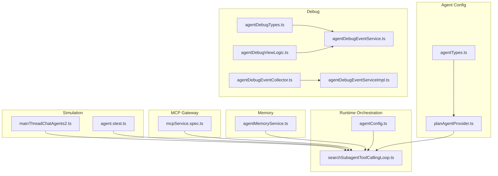
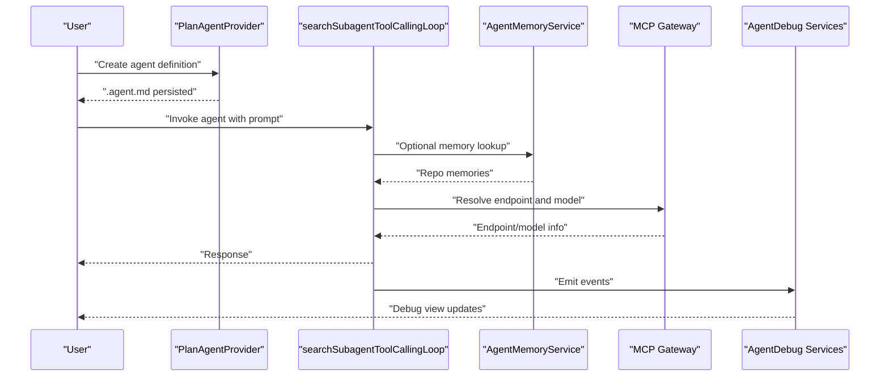
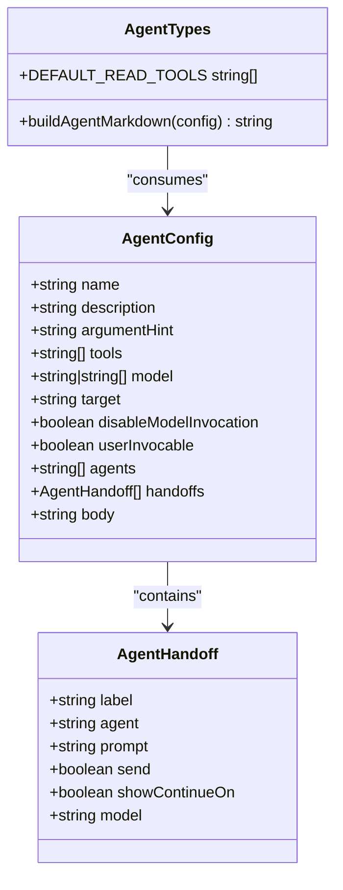
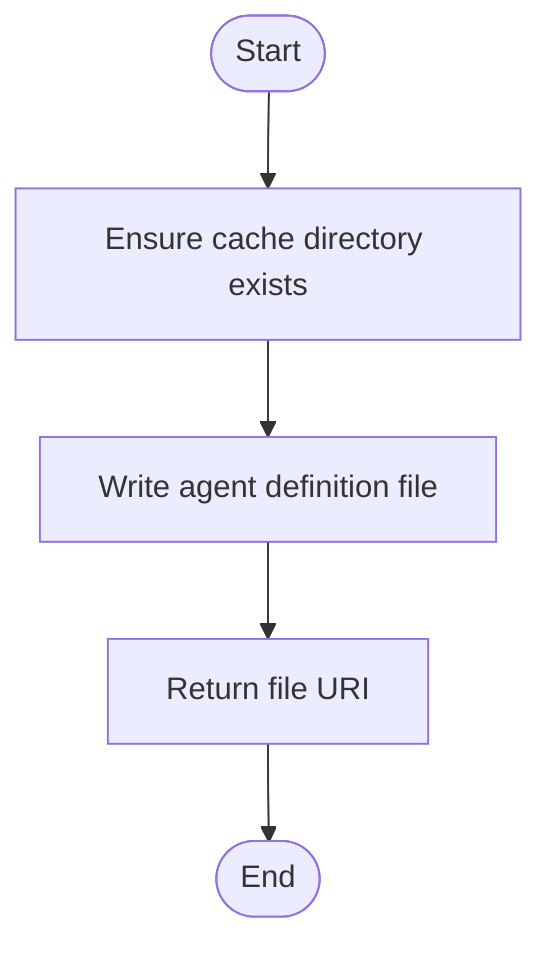
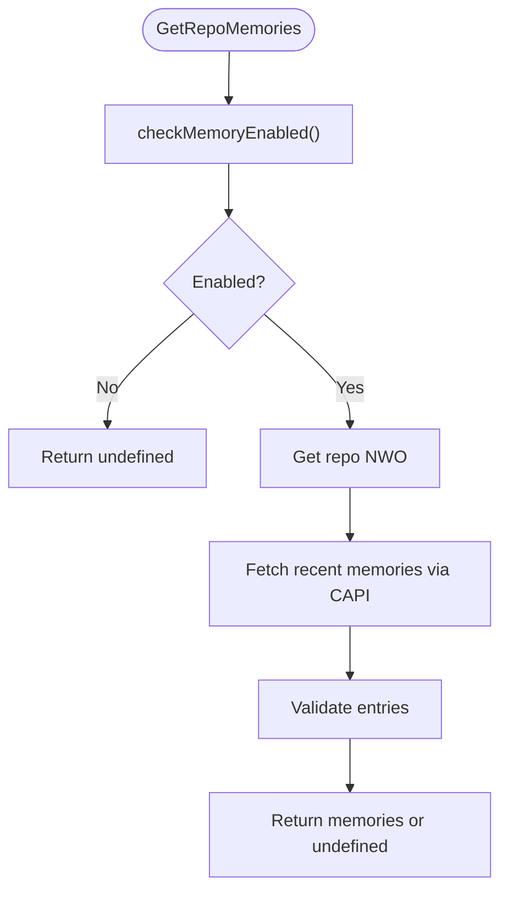
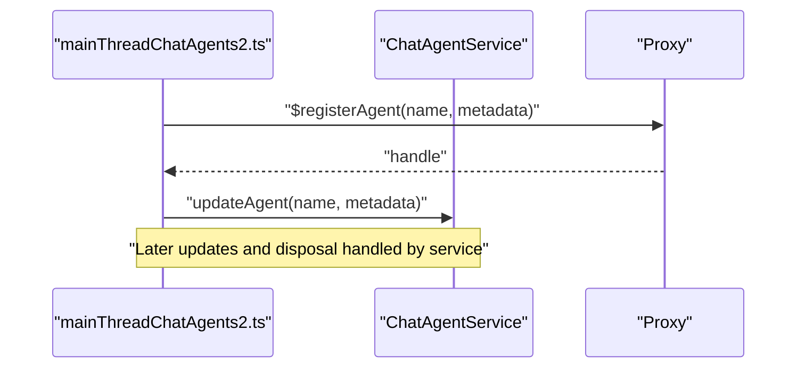
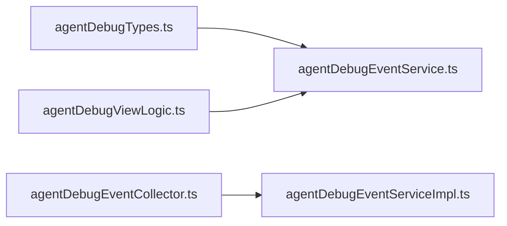
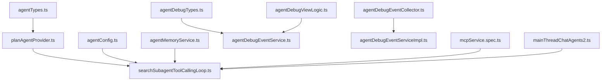

# Agent Management & Lifecycle

<cite>
**Referenced Files in This Document**
- [agentTypes.ts](file://src/extension/agents/vscode-node/agentTypes.ts)
- [agentConfig.ts](file://src/extension/intents/common/agentConfig.ts)
- [agentMemoryService.ts](file://src/extension/tools/common/agentMemoryService.ts)
- [planAgentProvider.ts](file://src/extension/agents/vscode-node/planAgentProvider.ts)
- [searchSubagentToolCallingLoop.ts](file://src/extension/prompt/node/searchSubagentToolCallingLoop.ts)
- [agentDebugEventService.ts](file://src/extension/agentDebug/common/agentDebugEventService.ts)
- [agentDebugEventCollector.ts](file://src/extension/agentDebug/node/agentDebugEventCollector.ts)
- [agentDebugEventServiceImpl.ts](file://src/extension/agentDebug/node/agentDebugEventServiceImpl.ts)
- [agentDebugViewLogic.ts](file://src/extension/agentDebug/common/agentDebugViewLogic.ts)
- [agentDebugTypes.ts](file://src/extension/agentDebug/common/agentDebugTypes.ts)
- [mcpService.spec.ts](file://src/platform/mcp/vscode/test/mcpService.spec.ts)
- [mainThreadChatAgents2.ts](file://test/simulation/fixtures/editing/mainThreadChatAgents2.ts)
- [agent.stest.ts](file://test/inline/agent.stest.ts)
</cite>

## Table of Contents
1. [Introduction](#introduction)
2. [Project Structure](#project-structure)
3. [Core Components](#core-components)
4. [Architecture Overview](#architecture-overview)
5. [Detailed Component Analysis](#detailed-component-analysis)
6. [Dependency Analysis](#dependency-analysis)
7. [Performance Considerations](#performance-considerations)
8. [Troubleshooting Guide](#troubleshooting-guide)
9. [Conclusion](#conclusion)
10. [Appendices](#appendices)

## Introduction
This document explains agent management and lifecycle in the VSCode Copilot Chat multi-agent system. It covers agent creation, initialization, configuration, and destruction; state management including active/inactive states and recovery; selection and prioritization; registry and discovery; dynamic provisioning; communication and coordination; and practical examples for configuration and custom agent development.

## Project Structure
The multi-agent system spans several subsystems:
- Agent configuration and Markdown generation
- Agent runtime orchestration and handoffs
- Memory and persistence for agent knowledge
- Debugging and observability
- MCP gateway lifecycle for external agent connectivity
- Simulation and tests validating agent behavior



**Diagram sources**
- [agentTypes.ts](file://src/extension/agents/vscode-node/agentTypes.ts#L1-L121)
- [planAgentProvider.ts](file://src/extension/agents/vscode-node/planAgentProvider.ts#L82-L113)
- [searchSubagentToolCallingLoop.ts](file://src/extension/prompt/node/searchSubagentToolCallingLoop.ts#L58-L85)
- [agentConfig.ts](file://src/extension/intents/common/agentConfig.ts#L10-L14)
- [agentMemoryService.ts](file://src/extension/tools/common/agentMemoryService.ts#L107-L334)
- [agentDebugTypes.ts](file://src/extension/agentDebug/common/agentDebugTypes.ts)
- [agentDebugEventService.ts](file://src/extension/agentDebug/common/agentDebugEventService.ts)
- [agentDebugEventCollector.ts](file://src/extension/agentDebug/node/agentDebugEventCollector.ts)
- [agentDebugEventServiceImpl.ts](file://src/extension/agentDebug/node/agentDebugEventServiceImpl.ts)
- [agentDebugViewLogic.ts](file://src/extension/agentDebug/common/agentDebugViewLogic.ts)
- [mcpService.spec.ts](file://src/platform/mcp/vscode/test/mcpService.spec.ts#L45-L180)
- [mainThreadChatAgents2.ts](file://test/simulation/fixtures/editing/mainThreadChatAgents2.ts#L99-L125)
- [agent.stest.ts](file://test/inline/agent.stest.ts)

**Section sources**
- [agentTypes.ts](file://src/extension/agents/vscode-node/agentTypes.ts#L1-L121)
- [planAgentProvider.ts](file://src/extension/agents/vscode-node/planAgentProvider.ts#L82-L113)
- [searchSubagentToolCallingLoop.ts](file://src/extension/prompt/node/searchSubagentToolCallingLoop.ts#L58-L85)
- [agentConfig.ts](file://src/extension/intents/common/agentConfig.ts#L10-L14)
- [agentMemoryService.ts](file://src/extension/tools/common/agentMemoryService.ts#L107-L334)
- [agentDebugTypes.ts](file://src/extension/agentDebug/common/agentDebugTypes.ts)
- [agentDebugEventService.ts](file://src/extension/agentDebug/common/agentDebugEventService.ts)
- [agentDebugEventCollector.ts](file://src/extension/agentDebug/node/agentDebugEventCollector.ts)
- [agentDebugEventServiceImpl.ts](file://src/extension/agentDebug/node/agentDebugEventServiceImpl.ts)
- [agentDebugViewLogic.ts](file://src/extension/agentDebug/common/agentDebugViewLogic.ts)
- [mcpService.spec.ts](file://src/platform/mcp/vscode/test/mcpService.spec.ts#L45-L180)
- [mainThreadChatAgents2.ts](file://test/simulation/fixtures/editing/mainThreadChatAgents2.ts#L99-L125)
- [agent.stest.ts](file://test/inline/agent.stest.ts)

## Core Components
- Agent configuration model and Markdown builder define agent identity, capabilities, tools, subagents, and handoffs.
- PlanAgentProvider builds and persists agent definition files for planning agents.
- Runtime orchestration integrates subagent loops and configuration-driven limits.
- AgentMemoryService manages repository-backed memory via Copilot Memory APIs.
- Debug services capture and expose agent events and states for diagnostics.
- MCP gateway lifecycle ensures stable external agent connections with deduplication and disposal semantics.
- Simulation fixtures and tests validate agent registration, updates, and lifecycle behaviors.

**Section sources**
- [agentTypes.ts](file://src/extension/agents/vscode-node/agentTypes.ts#L9-L34)
- [planAgentProvider.ts](file://src/extension/agents/vscode-node/planAgentProvider.ts#L82-L113)
- [searchSubagentToolCallingLoop.ts](file://src/extension/prompt/node/searchSubagentToolCallingLoop.ts#L58-L85)
- [agentConfig.ts](file://src/extension/intents/common/agentConfig.ts#L10-L14)
- [agentMemoryService.ts](file://src/extension/tools/common/agentMemoryService.ts#L107-L334)
- [mcpService.spec.ts](file://src/platform/mcp/vscode/test/mcpService.spec.ts#L45-L180)
- [mainThreadChatAgents2.ts](file://test/simulation/fixtures/editing/mainThreadChatAgents2.ts#L99-L125)
- [agent.stest.ts](file://test/inline/agent.stest.ts)

## Architecture Overview
The multi-agent system orchestrates agents through:
- Configuration-driven agent definitions and Markdown generation
- Runtime selection and invocation of subagents (e.g., search)
- Memory-backed knowledge retrieval and storage
- Debug instrumentation for event capture and UI visualization
- MCP gateway lifecycle for external agent connectivity



**Diagram sources**
- [planAgentProvider.ts](file://src/extension/agents/vscode-node/planAgentProvider.ts#L82-L113)
- [searchSubagentToolCallingLoop.ts](file://src/extension/prompt/node/searchSubagentToolCallingLoop.ts#L58-L85)
- [agentMemoryService.ts](file://src/extension/tools/common/agentMemoryService.ts#L208-L276)
- [agentDebugEventService.ts](file://src/extension/agentDebug/common/agentDebugEventService.ts)
- [agentDebugEventCollector.ts](file://src/extension/agentDebug/node/agentDebugEventCollector.ts)
- [agentDebugEventServiceImpl.ts](file://src/extension/agentDebug/node/agentDebugEventServiceImpl.ts)
- [agentDebugViewLogic.ts](file://src/extension/agentDebug/common/agentDebugViewLogic.ts)

## Detailed Component Analysis

### Agent Configuration and Definition
- AgentConfig defines agent metadata, tools, subagents, handoffs, and model preferences.
- buildAgentMarkdown generates YAML frontmatter and body content for agent definition files.
- DEFAULT_READ_TOOLS enumerates read-only inspection tools shared across agents.



**Diagram sources**
- [agentTypes.ts](file://src/extension/agents/vscode-node/agentTypes.ts#L9-L34)
- [agentTypes.ts](file://src/extension/agents/vscode-node/agentTypes.ts#L56-L120)

**Section sources**
- [agentTypes.ts](file://src/extension/agents/vscode-node/agentTypes.ts#L9-L34)
- [agentTypes.ts](file://src/extension/agents/vscode-node/agentTypes.ts#L56-L120)

### Plan Agent Provider and Dynamic Provisioning
- PlanAgentProvider writes agent definition files to global storage and returns a URI for consumption.
- Ensures cache directory existence and traces write operations.



**Diagram sources**
- [planAgentProvider.ts](file://src/extension/agents/vscode-node/planAgentProvider.ts#L82-L113)

**Section sources**
- [planAgentProvider.ts](file://src/extension/agents/vscode-node/planAgentProvider.ts#L82-L113)

### Runtime Orchestration and Subagent Selection
- searchSubagentToolCallingLoop constructs prompt context with subagent metadata and selects endpoint/model based on configuration and experiments.
- Integrates with configuration services to derive model family and proxy behavior.

```mermaid
sequenceDiagram
participant Caller as "Caller"
participant Loop as "searchSubagentToolCallingLoop"
participant Cfg as "ConfigurationService"
participant Exp as "ExperimentationService"
Caller->>Loop : "invoke(promptText, options)"
Loop->>Cfg : "getExperimentBasedConfig(SearchSubagentModel)"
Loop->>Exp : "getExperimentBasedConfig(SearchSubagentUseAgenticProxy)"
Loop-->>Caller : "endpoint/model selection"
```

**Diagram sources**
- [searchSubagentToolCallingLoop.ts](file://src/extension/prompt/node/searchSubagentToolCallingLoop.ts#L58-L85)

**Section sources**
- [searchSubagentToolCallingLoop.ts](file://src/extension/prompt/node/searchSubagentToolCallingLoop.ts#L58-L85)

### Agent Memory Service and Persistence
- AgentMemoryService checks repository memory enablement, retrieves recent memories, and stores new memories via CAPI.
- Normalizes citations and validates memory entries for compatibility.



**Diagram sources**
- [agentMemoryService.ts](file://src/extension/tools/common/agentMemoryService.ts#L208-L276)

**Section sources**
- [agentMemoryService.ts](file://src/extension/tools/common/agentMemoryService.ts#L107-L334)

### Agent Registry and Lifecycle (Registration, Updates, Disposal)
- Simulation fixture demonstrates agent registration, metadata updates, and lifecycle disposal.
- Tests verify deduplication and disposal semantics for MCP gateways.



**Diagram sources**
- [mainThreadChatAgents2.ts](file://test/simulation/fixtures/editing/mainThreadChatAgents2.ts#L99-L125)

**Section sources**
- [mainThreadChatAgents2.ts](file://test/simulation/fixtures/editing/mainThreadChatAgents2.ts#L99-L125)
- [mcpService.spec.ts](file://src/platform/mcp/vscode/test/mcpService.spec.ts#L45-L180)

### Debugging and Observability
- AgentDebug services collect and emit events, maintain event streams, and support UI logic for visualization.
- Types and event collectors coordinate across node and common layers.



**Diagram sources**
- [agentDebugTypes.ts](file://src/extension/agentDebug/common/agentDebugTypes.ts)
- [agentDebugEventService.ts](file://src/extension/agentDebug/common/agentDebugEventService.ts)
- [agentDebugEventCollector.ts](file://src/extension/agentDebug/node/agentDebugEventCollector.ts)
- [agentDebugEventServiceImpl.ts](file://src/extension/agentDebug/node/agentDebugEventServiceImpl.ts)
- [agentDebugViewLogic.ts](file://src/extension/agentDebug/common/agentDebugViewLogic.ts)

**Section sources**
- [agentDebugTypes.ts](file://src/extension/agentDebug/common/agentDebugTypes.ts)
- [agentDebugEventService.ts](file://src/extension/agentDebug/common/agentDebugEventService.ts)
- [agentDebugEventCollector.ts](file://src/extension/agentDebug/node/agentDebugEventCollector.ts)
- [agentDebugEventServiceImpl.ts](file://src/extension/agentDebug/node/agentDebugEventServiceImpl.ts)
- [agentDebugViewLogic.ts](file://src/extension/agentDebug/common/agentDebugViewLogic.ts)

### Practical Examples

#### Example: Agent Configuration
- Define agent metadata, tools, and handoffs using AgentConfig.
- Generate agent definition Markdown with buildAgentMarkdown.
- Persist the definition via PlanAgentProvider.

**Section sources**
- [agentTypes.ts](file://src/extension/agents/vscode-node/agentTypes.ts#L56-L120)
- [planAgentProvider.ts](file://src/extension/agents/vscode-node/planAgentProvider.ts#L82-L113)

#### Example: Custom Agent Development
- Create a custom agent by defining tools, subagents, and handoffs.
- Use DEFAULT_READ_TOOLS for read-only inspection capabilities.
- Persist and load the agent definition for runtime use.

**Section sources**
- [agentTypes.ts](file://src/extension/agents/vscode-node/agentTypes.ts#L40-L50)
- [agentTypes.ts](file://src/extension/agents/vscode-node/agentTypes.ts#L56-L120)

#### Example: Integration Patterns
- Integrate AgentMemoryService to enrich agent responses with repository memories.
- Use configuration-driven model selection in orchestration loops.
- Emit and observe agent debug events for diagnostics.

**Section sources**
- [agentMemoryService.ts](file://src/extension/tools/common/agentMemoryService.ts#L208-L276)
- [searchSubagentToolCallingLoop.ts](file://src/extension/prompt/node/searchSubagentToolCallingLoop.ts#L58-L85)
- [agentDebugEventService.ts](file://src/extension/agentDebug/common/agentDebugEventService.ts)

## Dependency Analysis
- Agent configuration depends on runtime orchestration for model and endpoint selection.
- Memory service depends on authentication and CAPI client services.
- Debug services depend on event collectors and UI logic.
- MCP gateway lifecycle depends on service disposal semantics and deduplication.



**Diagram sources**
- [agentTypes.ts](file://src/extension/agents/vscode-node/agentTypes.ts#L1-L121)
- [planAgentProvider.ts](file://src/extension/agents/vscode-node/planAgentProvider.ts#L82-L113)
- [searchSubagentToolCallingLoop.ts](file://src/extension/prompt/node/searchSubagentToolCallingLoop.ts#L58-L85)
- [agentConfig.ts](file://src/extension/intents/common/agentConfig.ts#L10-L14)
- [agentMemoryService.ts](file://src/extension/tools/common/agentMemoryService.ts#L107-L334)
- [agentDebugTypes.ts](file://src/extension/agentDebug/common/agentDebugTypes.ts)
- [agentDebugEventService.ts](file://src/extension/agentDebug/common/agentDebugEventService.ts)
- [agentDebugEventCollector.ts](file://src/extension/agentDebug/node/agentDebugEventCollector.ts)
- [agentDebugEventServiceImpl.ts](file://src/extension/agentDebug/node/agentDebugEventServiceImpl.ts)
- [agentDebugViewLogic.ts](file://src/extension/agentDebug/common/agentDebugViewLogic.ts)
- [mcpService.spec.ts](file://src/platform/mcp/vscode/test/mcpService.spec.ts#L45-L180)
- [mainThreadChatAgents2.ts](file://test/simulation/fixtures/editing/mainThreadChatAgents2.ts#L99-L125)

**Section sources**
- [agentTypes.ts](file://src/extension/agents/vscode-node/agentTypes.ts#L1-L121)
- [planAgentProvider.ts](file://src/extension/agents/vscode-node/planAgentProvider.ts#L82-L113)
- [searchSubagentToolCallingLoop.ts](file://src/extension/prompt/node/searchSubagentToolCallingLoop.ts#L58-L85)
- [agentConfig.ts](file://src/extension/intents/common/agentConfig.ts#L10-L14)
- [agentMemoryService.ts](file://src/extension/tools/common/agentMemoryService.ts#L107-L334)
- [agentDebugTypes.ts](file://src/extension/agentDebug/common/agentDebugTypes.ts)
- [agentDebugEventService.ts](file://src/extension/agentDebug/common/agentDebugEventService.ts)
- [agentDebugEventCollector.ts](file://src/extension/agentDebug/node/agentDebugEventCollector.ts)
- [agentDebugEventServiceImpl.ts](file://src/extension/agentDebug/node/agentDebugEventServiceImpl.ts)
- [agentDebugViewLogic.ts](file://src/extension/agentDebug/common/agentDebugViewLogic.ts)
- [mcpService.spec.ts](file://src/platform/mcp/vscode/test/mcpService.spec.ts#L45-L180)
- [mainThreadChatAgents2.ts](file://test/simulation/fixtures/editing/mainThreadChatAgents2.ts#L99-L125)

## Performance Considerations
- Prefer cached agent definitions and deterministic endpoint/model resolution to minimize overhead.
- Limit memory fetches to necessary scopes and sizes; leverage pagination or limits where supported.
- Deduplicate MCP gateway creation and reuse instances for the same resource to reduce connection churn.
- Use asynchronous disposal patterns to avoid blocking the main thread during shutdown.

## Troubleshooting Guide
- Agent registration failures: Verify agent metadata updates and handle missing handles gracefully.
- Memory enablement errors: Confirm configuration flags and authentication sessions before attempting fetch/store operations.
- MCP gateway lifecycle: Ensure individual disposal does not conflict with service-wide disposal; confirm deduplication behavior.
- Debug visibility: Confirm event collectors and UI logic are wired correctly to receive and render agent events.

**Section sources**
- [mainThreadChatAgents2.ts](file://test/simulation/fixtures/editing/mainThreadChatAgents2.ts#L99-L125)
- [agentMemoryService.ts](file://src/extension/tools/common/agentMemoryService.ts#L161-L206)
- [mcpService.spec.ts](file://src/platform/mcp/vscode/test/mcpService.spec.ts#L161-L179)
- [agentDebugEventService.ts](file://src/extension/agentDebug/common/agentDebugEventService.ts)
- [agentDebugEventCollector.ts](file://src/extension/agentDebug/node/agentDebugEventCollector.ts)
- [agentDebugEventServiceImpl.ts](file://src/extension/agentDebug/node/agentDebugEventServiceImpl.ts)
- [agentDebugViewLogic.ts](file://src/extension/agentDebug/common/agentDebugViewLogic.ts)

## Conclusion
The VSCode Copilot Chat multi-agent system combines declarative agent configuration, runtime orchestration, memory-backed knowledge, and robust debugging to deliver a flexible and observable agent framework. By leveraging configuration-driven selection, persistent definitions, and lifecycle-aware services, teams can develop, deploy, and operate agents effectively across diverse workflows.

## Appendices
- Agent lifecycle tests validate registration, updates, and disposal semantics.
- Inline agent tests demonstrate agent behavior in interactive scenarios.

**Section sources**
- [agent.stest.ts](file://test/inline/agent.stest.ts)
- [mcpService.spec.ts](file://src/platform/mcp/vscode/test/mcpService.spec.ts#L45-L180)