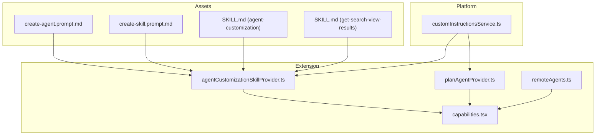
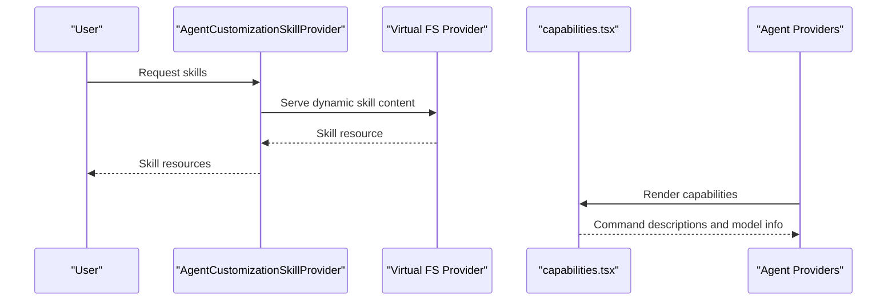
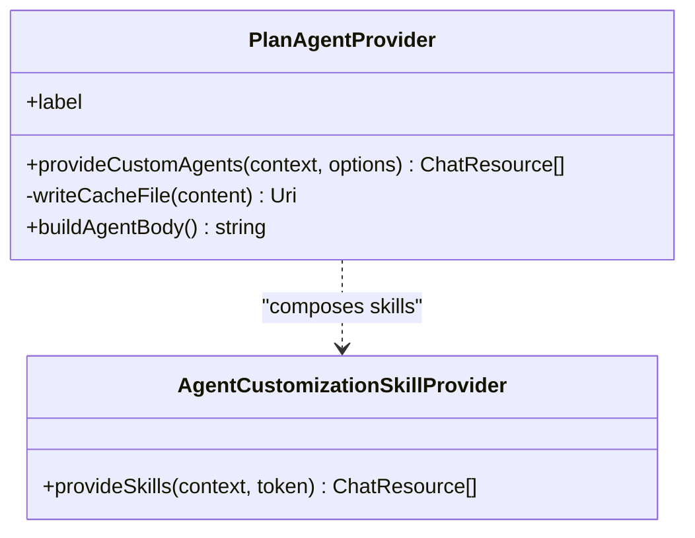
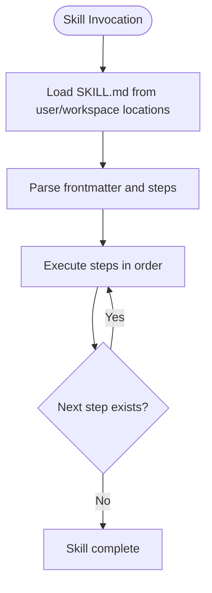
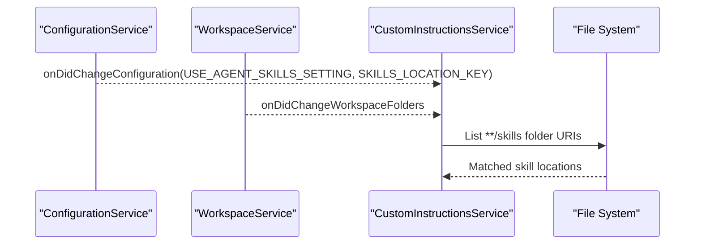
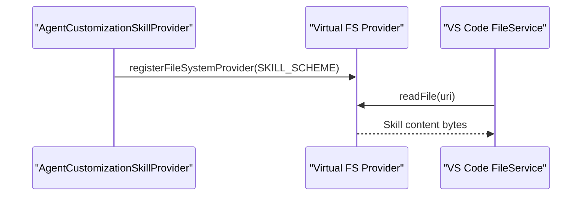
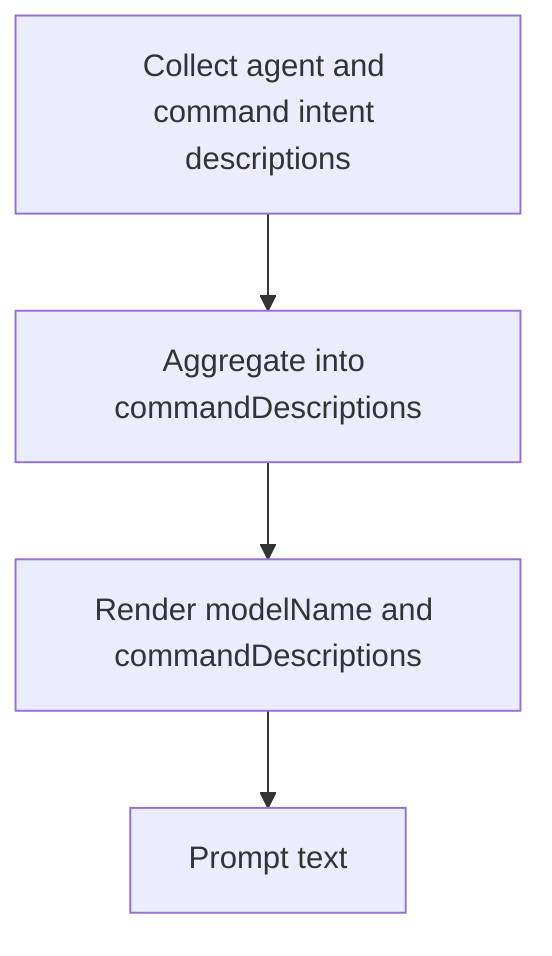
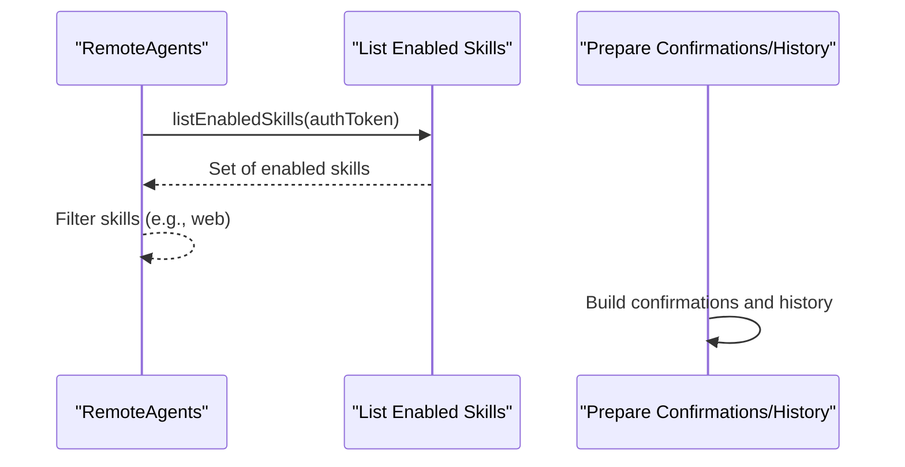

# Agent Skills & Capabilities

<cite>
**Referenced Files in This Document**
- [README.md](file://README.md)
- [create-agent.prompt.md](file://assets/prompts/create-agent.prompt.md)
- [create-skill.prompt.md](file://assets/prompts/create-skill.prompt.md)
- [SKILL.md (agent-customization)](file://assets/prompts/skills/agent-customization/SKILL.md)
- [SKILL.md (get-search-view-results)](file://assets/prompts/skills/get-search-view-results/SKILL.md)
- [agentCustomizationSkillProvider.ts](file://src/extension/agents/vscode-node/agentCustomizationSkillProvider.ts)
- [planAgentProvider.ts](file://src/extension/agents/vscode-node/planAgentProvider.ts)
- [customInstructionsService.ts](file://src/platform/customInstructions/common/customInstructionsService.ts)
- [capabilities.tsx](file://src/extension/prompts/node/base/capabilities.tsx)
- [remoteAgents.ts](file://src/extension/conversation/vscode-node/remoteAgents.ts)
</cite>

## Table of Contents
1. [Introduction](#introduction)
2. [Project Structure](#project-structure)
3. [Core Components](#core-components)
4. [Architecture Overview](#architecture-overview)
5. [Detailed Component Analysis](#detailed-component-analysis)
6. [Dependency Analysis](#dependency-analysis)
7. [Performance Considerations](#performance-considerations)
8. [Troubleshooting Guide](#troubleshooting-guide)
9. [Conclusion](#conclusion)
10. [Appendices](#appendices)

## Introduction
This document explains the agent skills and capabilities system in VSCode Copilot Chat. It covers the different agent types (ask agents, edit mode agents, explore agents, and plan agents), the skill-based architecture that composes agents from specialized skills, and the mechanisms for registering, invoking, and chaining skills. It also documents the launch skill system, custom skill development, configuration options, practical implementation patterns, advanced use cases, performance optimization, error handling, and debugging techniques for custom skills.

## Project Structure
The repository organizes agent and skill-related functionality across:
- Assets: Skill templates and prompts for authoring agents and skills
- Platform: Instruction and skill discovery and configuration
- Extension: Agent providers, skill providers, and capability rendering
- Conversation: Remote agent integration and capability preparation

**Diagram sources**
- [create-agent.prompt.md](file://assets/prompts/create-agent.prompt.md#L1-L29)
- [create-skill.prompt.md](file://assets/prompts/create-skill.prompt.md#L1-L29)
- [SKILL.md (agent-customization)](file://assets/prompts/skills/agent-customization/SKILL.md#L1-L83)
- [SKILL.md (get-search-view-results)](file://assets/prompts/skills/get-search-view-results/SKILL.md#L1-L10)
- [agentCustomizationSkillProvider.ts](file://src/extension/agents/vscode-node/agentCustomizationSkillProvider.ts#L31-L253)
- [planAgentProvider.ts](file://src/extension/agents/vscode-node/planAgentProvider.ts#L15-L113)
- [customInstructionsService.ts](file://src/platform/customInstructions/common/customInstructionsService.ts#L194-L218)
- [capabilities.tsx](file://src/extension/prompts/node/base/capabilities.tsx#L40-L73)
- [remoteAgents.ts](file://src/extension/conversation/vscode-node/remoteAgents.ts#L725-L732)

**Section sources**
- [README.md](file://README.md#L18-L50)
- [create-agent.prompt.md](file://assets/prompts/create-agent.prompt.md#L1-L29)
- [create-skill.prompt.md](file://assets/prompts/create-skill.prompt.md#L1-L29)
- [SKILL.md (agent-customization)](file://assets/prompts/skills/agent-customization/SKILL.md#L1-L83)
- [SKILL.md (get-search-view-results)](file://assets/prompts/skills/get-search-view-results/SKILL.md#L1-L10)
- [agentCustomizationSkillProvider.ts](file://src/extension/agents/vscode-node/agentCustomizationSkillProvider.ts#L31-L253)
- [planAgentProvider.ts](file://src/extension/agents/vscode-node/planAgentProvider.ts#L15-L113)
- [customInstructionsService.ts](file://src/platform/customInstructions/common/customInstructionsService.ts#L194-L218)
- [capabilities.tsx](file://src/extension/prompts/node/base/capabilities.tsx#L40-L73)
- [remoteAgents.ts](file://src/extension/conversation/vscode-node/remoteAgents.ts#L725-L732)

## Core Components
- Agent types and roles:
  - Ask agents: General-purpose agents for answering questions and performing tasks.
  - Edit mode agents: Specialized for in-editor edits and refactorings.
  - Explore agents: Context-gathering agents that search and discover relevant information.
  - Plan agents: Planning agents that outline multi-step implementation plans and coordinate exploration.
- Skill-based architecture:
  - Agents are composed of multiple specialized skills.
  - Skills are authored as SKILL.md files with frontmatter and stepwise workflows.
  - Skills can be packaged as standalone reusable workflows or integrated into agents.
- Skill registration and discovery:
  - Skills are discovered from user and workspace locations.
  - Dynamic skill content can be served via a virtual file system provider.
- Capability rendering:
  - Agent capabilities are rendered into prompts to inform the model of available commands and abilities.

**Section sources**
- [README.md](file://README.md#L18-L50)
- [SKILL.md (agent-customization)](file://assets/prompts/skills/agent-customization/SKILL.md#L1-L83)
- [agentCustomizationSkillProvider.ts](file://src/extension/agents/vscode-node/agentCustomizationSkillProvider.ts#L31-L253)
- [customInstructionsService.ts](file://src/platform/customInstructions/common/customInstructionsService.ts#L194-L218)
- [capabilities.tsx](file://src/extension/prompts/node/base/capabilities.tsx#L40-L73)

## Architecture Overview
The system integrates skill and agent discovery with capability rendering and remote agent support.

**Diagram sources**
- [agentCustomizationSkillProvider.ts](file://src/extension/agents/vscode-node/agentCustomizationSkillProvider.ts#L236-L253)
- [capabilities.tsx](file://src/extension/prompts/node/base/capabilities.tsx#L40-L73)

## Detailed Component Analysis

### Agent Types and Composition
- Ask agents: General-purpose agents for answering questions and performing tasks.
- Edit mode agents: Specialized for in-editor edits and refactorings.
- Explore agents: Context-gathering agents that search and discover relevant information.
- Plan agents: Planning agents that outline multi-step implementation plans and coordinate exploration.

**Diagram sources**
- [planAgentProvider.ts](file://src/extension/agents/vscode-node/planAgentProvider.ts#L15-L113)
- [agentCustomizationSkillProvider.ts](file://src/extension/agents/vscode-node/agentCustomizationSkillProvider.ts#L236-L253)

**Section sources**
- [README.md](file://README.md#L18-L50)
- [planAgentProvider.ts](file://src/extension/agents/vscode-node/planAgentProvider.ts#L15-L113)

### Skill-Based Architecture and Invocation Patterns
- Skills are authored as SKILL.md files with frontmatter and stepwise workflows.
- Skills can be invoked as standalone workflows or integrated into agents.
- The agent-customization skill provides a guided workflow for creating and maintaining agent customization files.

**Diagram sources**
- [SKILL.md (agent-customization)](file://assets/prompts/skills/agent-customization/SKILL.md#L1-L83)

**Section sources**
- [SKILL.md (agent-customization)](file://assets/prompts/skills/agent-customization/SKILL.md#L1-L83)
- [create-skill.prompt.md](file://assets/prompts/create-skill.prompt.md#L1-L29)

### Skill Registration and Discovery
- Skills are discovered from user and workspace locations using a service that observes configuration changes and workspace folders.
- The discovery service constructs top-level skills folder URIs and caches matched locations.

**Diagram sources**
- [customInstructionsService.ts](file://src/platform/customInstructions/common/customInstructionsService.ts#L194-L218)

**Section sources**
- [customInstructionsService.ts](file://src/platform/customInstructions/common/customInstructionsService.ts#L194-L218)

### Dynamic Skill Content and Virtual File System
- A virtual file system provider serves dynamic skill content to VS Code’s file service.
- The provider exposes a read-only file system scheme and returns a URI for the skill content.

**Diagram sources**
- [agentCustomizationSkillProvider.ts](file://src/extension/agents/vscode-node/agentCustomizationSkillProvider.ts#L31-L56)
- [agentCustomizationSkillProvider.ts](file://src/extension/agents/vscode-node/agentCustomizationSkillProvider.ts#L236-L253)

**Section sources**
- [agentCustomizationSkillProvider.ts](file://src/extension/agents/vscode-node/agentCustomizationSkillProvider.ts#L31-L56)
- [agentCustomizationSkillProvider.ts](file://src/extension/agents/vscode-node/agentCustomizationSkillProvider.ts#L236-L253)

### Capability Rendering and Model Information
- Capabilities are rendered into prompts to inform the model of available commands and the selected model name.
- The renderer aggregates intent descriptions from agents and commands.

**Diagram sources**
- [capabilities.tsx](file://src/extension/prompts/node/base/capabilities.tsx#L40-L73)

**Section sources**
- [capabilities.tsx](file://src/extension/prompts/node/base/capabilities.tsx#L40-L73)

### Remote Agent Integration and Capability Preparation
- Remote agents can expose additional skills (for example, web search) filtered by availability.
- Agent history and confirmations are prepared for remote agent requests.

**Diagram sources**
- [remoteAgents.ts](file://src/extension/conversation/vscode-node/remoteAgents.ts#L725-L732)
- [remoteAgents.ts](file://src/extension/conversation/vscode-node/remoteAgents.ts#L735-L742)

**Section sources**
- [remoteAgents.ts](file://src/extension/conversation/vscode-node/remoteAgents.ts#L725-L732)
- [remoteAgents.ts](file://src/extension/conversation/vscode-node/remoteAgents.ts#L735-L742)

### Practical Examples and Implementation Patterns
- Creating a custom agent:
  - Use the create-agent prompt to guide the user through extracting a specialized workflow, clarifying intent, iterating on the draft, and summarizing outcomes.
- Creating a reusable skill:
  - Use the create-skill prompt to guide the user through extracting a multi-step workflow, clarifying scope, iterating on the draft, and summarizing outcomes.
- Example skill: get-search-view-results
  - Demonstrates a simple, single-purpose skill that retrieves current search results from the Search view using a VS Code command.

**Section sources**
- [create-agent.prompt.md](file://assets/prompts/create-agent.prompt.md#L1-L29)
- [create-skill.prompt.md](file://assets/prompts/create-skill.prompt.md#L1-L29)
- [SKILL.md (get-search-view-results)](file://assets/prompts/skills/get-search-view-results/SKILL.md#L1-L10)

### Advanced Use Cases
- Plan agent orchestration:
  - The Plan agent provider embeds a base configuration and dynamically builds agent bodies with settings-based customization, enabling additional tools and model overrides while preserving body content.
- Agent customization skill:
  - Guides users through choosing the right customization primitive (workspace instructions, file instructions, hooks, custom agents, prompts, skills), validating frontmatter, and avoiding common pitfalls.

**Section sources**
- [planAgentProvider.ts](file://src/extension/agents/vscode-node/planAgentProvider.ts#L15-L113)
- [SKILL.md (agent-customization)](file://assets/prompts/skills/agent-customization/SKILL.md#L1-L83)

## Dependency Analysis
The system exhibits clear separation of concerns:
- Assets provide templates and prompts for authoring agents and skills.
- Platform services manage discovery and configuration.
- Extension components implement providers and capability rendering.
- Conversation components integrate remote agents.

**Diagram sources**
- [customInstructionsService.ts](file://src/platform/customInstructions/common/customInstructionsService.ts#L194-L218)
- [agentCustomizationSkillProvider.ts](file://src/extension/agents/vscode-node/agentCustomizationSkillProvider.ts#L31-L253)
- [capabilities.tsx](file://src/extension/prompts/node/base/capabilities.tsx#L40-L73)
- [remoteAgents.ts](file://src/extension/conversation/vscode-node/remoteAgents.ts#L725-L732)

**Section sources**
- [customInstructionsService.ts](file://src/platform/customInstructions/common/customInstructionsService.ts#L194-L218)
- [agentCustomizationSkillProvider.ts](file://src/extension/agents/vscode-node/agentCustomizationSkillProvider.ts#L31-L253)
- [capabilities.tsx](file://src/extension/prompts/node/base/capabilities.tsx#L40-L73)
- [remoteAgents.ts](file://src/extension/conversation/vscode-node/remoteAgents.ts#L725-L732)

## Performance Considerations
- Minimize unnecessary file reads:
  - Use virtual file system providers for dynamic content to avoid repeated disk I/O.
- Optimize discovery:
  - Observe configuration and workspace changes efficiently to refresh skill locations only when needed.
- Cache agent configurations:
  - Persist generated agent content to reduce repeated computation and file writes.
- Limit context inflation:
  - Avoid broad applyTo patterns that continuously inflate context windows; prefer specific globs for file instructions.

[No sources needed since this section provides general guidance]

## Troubleshooting Guide
- Skill not found:
  - Verify the description field triggers the skill and that frontmatter syntax is valid.
  - Ensure the skill resides in a recognized skills location (user or workspace).
- Silent failures:
  - Check for unescaped colons, tabs instead of spaces, and mismatched names in frontmatter.
- ApplyTo misuse:
  - Avoid overly broad patterns that load instructions on every interaction; use specific globs.
- Debugging custom skills:
  - Use tracing logs from the skill provider and capability renderer.
  - Validate dynamic content via the virtual file system provider.

**Section sources**
- [SKILL.md (agent-customization)](file://assets/prompts/skills/agent-customization/SKILL.md#L76-L83)
- [agentCustomizationSkillProvider.ts](file://src/extension/agents/vscode-node/agentCustomizationSkillProvider.ts#L236-L253)
- [capabilities.tsx](file://src/extension/prompts/node/base/capabilities.tsx#L40-L73)

## Conclusion
The agent skills and capabilities system in VSCode Copilot Chat enables flexible, composable agent behavior through a robust skill architecture. By leveraging dynamic skill providers, capability rendering, and configuration-driven discovery, developers can create powerful, reusable skills and agents tailored to specific workflows. Following the documented patterns and best practices ensures reliable invocation, maintainable compositions, and efficient performance.

[No sources needed since this section summarizes without analyzing specific files]

## Appendices
- Related prompts and templates:
  - Create agent prompt
  - Create skill prompt
  - Agent customization skill
  - Get search view results skill

**Section sources**
- [create-agent.prompt.md](file://assets/prompts/create-agent.prompt.md#L1-L29)
- [create-skill.prompt.md](file://assets/prompts/create-skill.prompt.md#L1-L29)
- [SKILL.md (agent-customization)](file://assets/prompts/skills/agent-customization/SKILL.md#L1-L83)
- [SKILL.md (get-search-view-results)](file://assets/prompts/skills/get-search-view-results/SKILL.md#L1-L10)