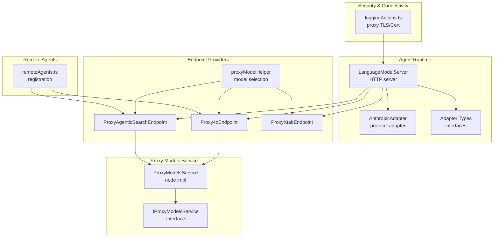
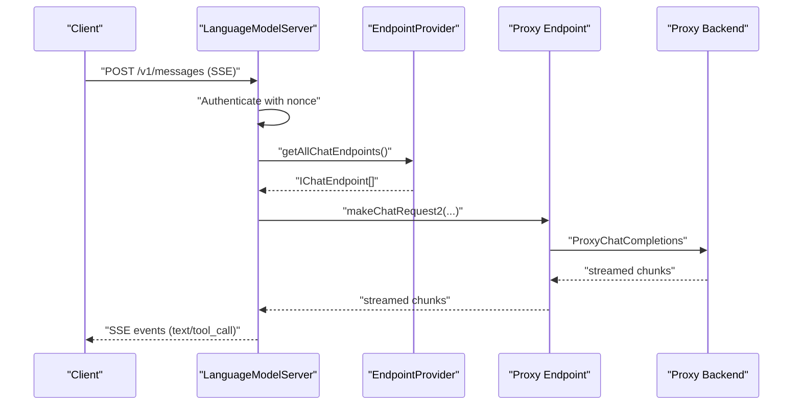
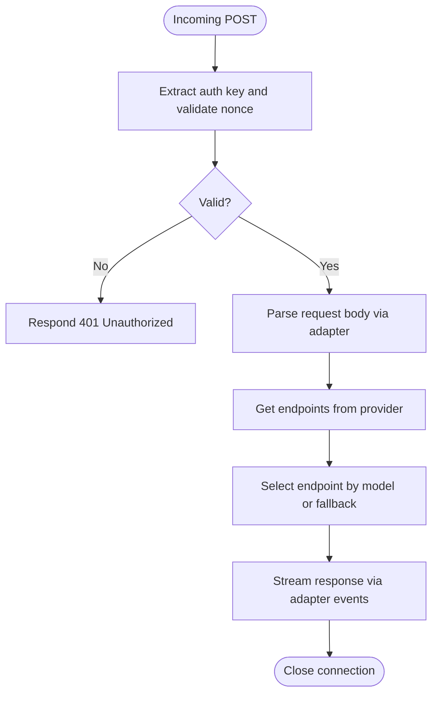
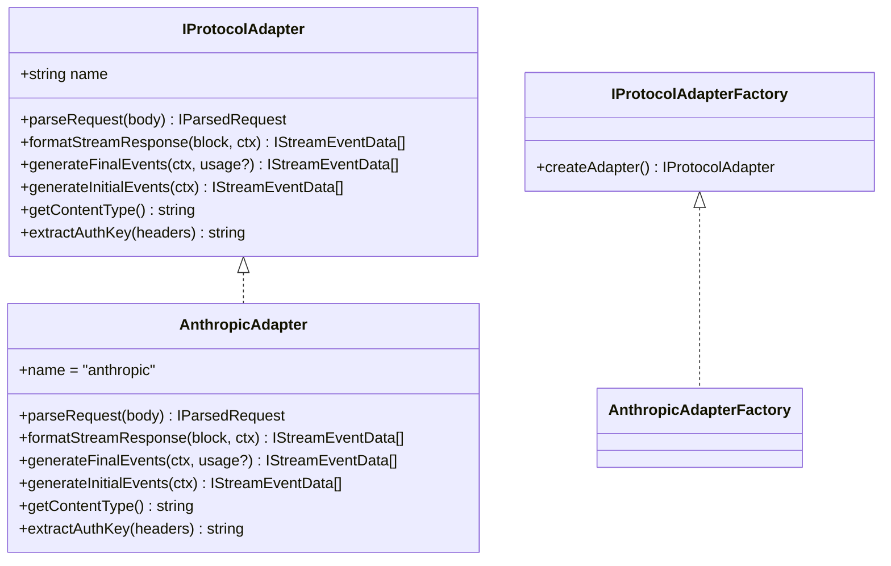
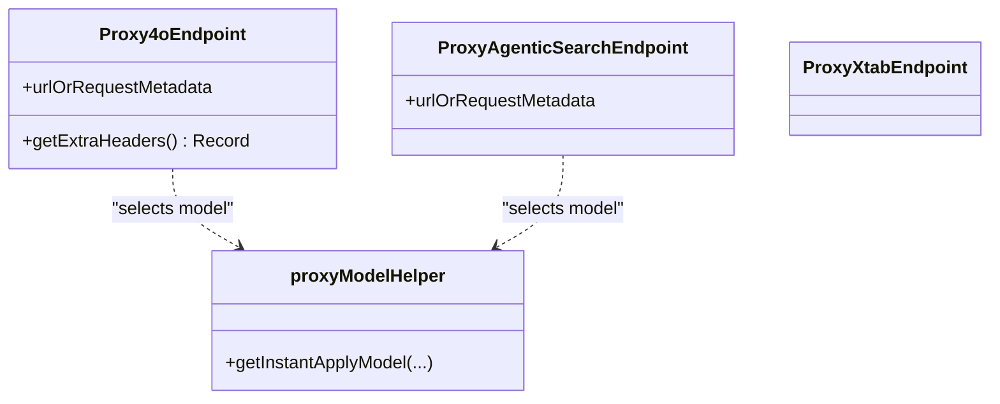
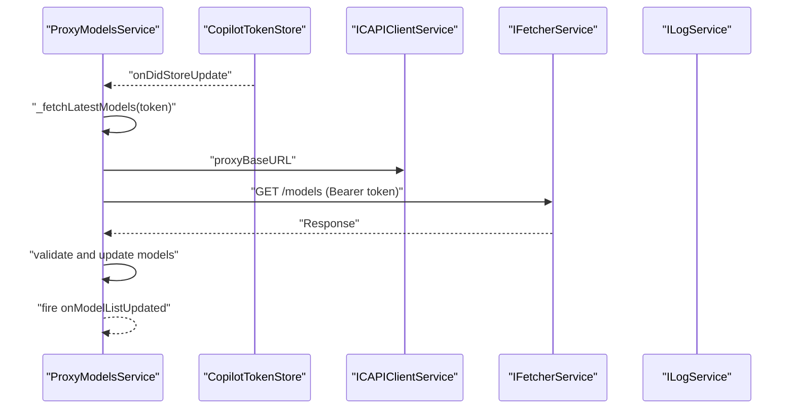
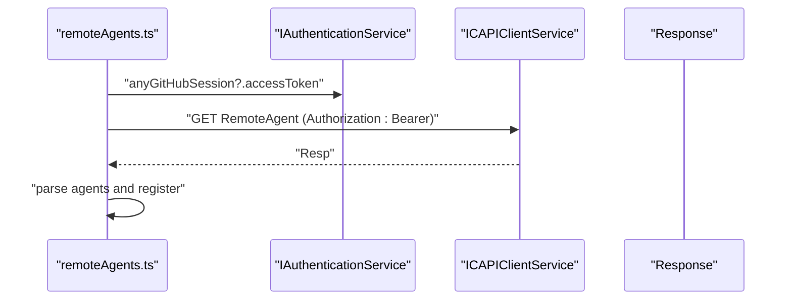
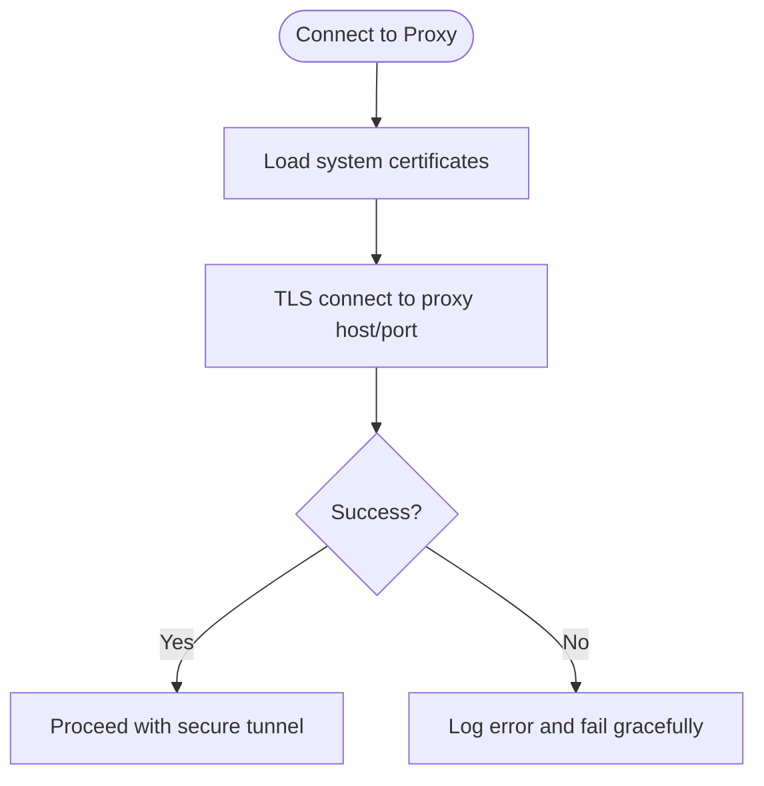
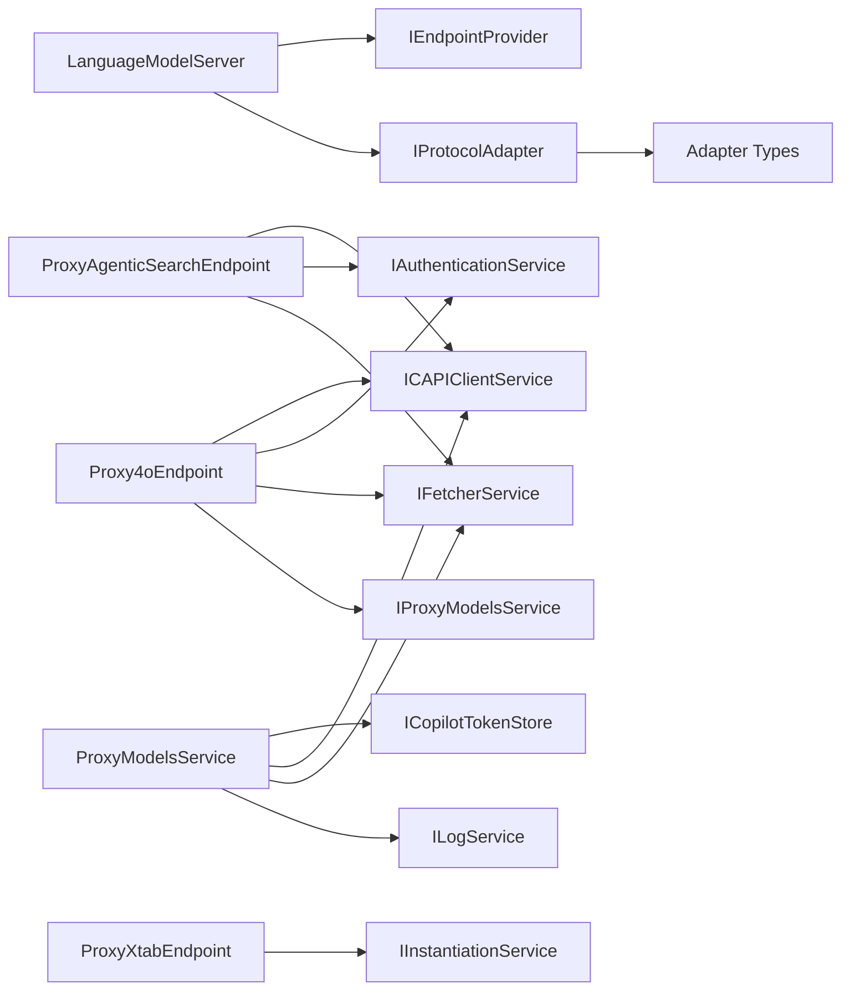

# External Agents & Proxy Integration

<cite>
**Referenced Files in This Document**
- [langModelServer.ts](file://src/extension/agents/node/langModelServer.ts)
- [types.ts](file://src/extension/agents/node/adapters/types.ts)
- [anthropicAdapter.ts](file://src/extension/agents/node/adapters/anthropicAdapter.ts)
- [proxyModelsService.ts](file://src/platform/proxyModels/common/proxyModelsService.ts)
- [proxyModelsService.ts](file://src/platform/proxyModels/node/proxyModelsService.ts)
- [proxyModelHelper.ts](file://src/platform/endpoint/node/proxyModelHelper.ts)
- [proxy4oEndpoint.ts](file://src/platform/endpoint/node/proxy4oEndpoint.ts)
- [proxyAgenticSearchEndpoint.ts](file://src/platform/endpoint/node/proxyAgenticSearchEndpoint.ts)
- [proxyXtabEndpoint.ts](file://src/platform/endpoint/node/proxyXtabEndpoint.ts)
- [loggingActions.ts](file://src/extension/log/vscode-node/loggingActions.ts)
- [remoteAgents.ts](file://src/extension/conversation/vscode-node/remoteAgents.ts)
</cite>

## Table of Contents
1. [Introduction](#introduction)
2. [Project Structure](#project-structure)
3. [Core Components](#core-components)
4. [Architecture Overview](#architecture-overview)
5. [Detailed Component Analysis](#detailed-component-analysis)
6. [Dependency Analysis](#dependency-analysis)
7. [Performance Considerations](#performance-considerations)
8. [Troubleshooting Guide](#troubleshooting-guide)
9. [Conclusion](#conclusion)
10. [Appendices](#appendices)

## Introduction
This document explains the external agents and proxy integration capabilities in the multi-agent system. It focuses on:
- Agent proxy architecture enabling integration with external AI services and language models
- Model proxy provider system and proxy communication protocols
- External endpoint configuration and selection
- Integration with external language model servers and third-party AI services
- Proxy contribution system, external agent registration, and secure communication patterns
- Practical examples and guidance for setting up external agents, configuring proxy endpoints, and optimizing performance and security

## Project Structure
The external agent and proxy integration spans several subsystems:
- Agent runtime and protocol adapters for local proxy servers
- Endpoint providers for proxy-backed language models
- Model metadata and selection via a proxy models service
- Remote agent registration and authentication flows
- Secure proxy connectivity utilities

**Diagram sources**
- [langModelServer.ts](file://src/extension/agents/node/langModelServer.ts#L33-L52)
- [anthropicAdapter.ts](file://src/extension/agents/node/adapters/anthropicAdapter.ts#L15-L19)
- [types.ts](file://src/extension/agents/node/adapters/types.ts#L37-L82)
- [proxy4oEndpoint.ts](file://src/platform/endpoint/node/proxy4oEndpoint.ts#L25-L81)
- [proxyAgenticSearchEndpoint.ts](file://src/platform/endpoint/node/proxyAgenticSearchEndpoint.ts#L23-L71)
- [proxyXtabEndpoint.ts](file://src/platform/endpoint/node/proxyXtabEndpoint.ts#L13-L43)
- [proxyModelHelper.ts](file://src/platform/endpoint/node/proxyModelHelper.ts#L13-L30)
- [proxyModelsService.ts](file://src/platform/proxyModels/common/proxyModelsService.ts#L10-L20)
- [proxyModelsService.ts](file://src/platform/proxyModels/node/proxyModelsService.ts#L20-L59)
- [remoteAgents.ts](file://src/extension/conversation/vscode-node/remoteAgents.ts#L95-L169)
- [loggingActions.ts](file://src/extension/log/vscode-node/loggingActions.ts#L37-L53)

**Section sources**
- [langModelServer.ts](file://src/extension/agents/node/langModelServer.ts#L33-L52)
- [proxy4oEndpoint.ts](file://src/platform/endpoint/node/proxy4oEndpoint.ts#L25-L81)
- [proxyAgenticSearchEndpoint.ts](file://src/platform/endpoint/node/proxyAgenticSearchEndpoint.ts#L23-L71)
- [proxyXtabEndpoint.ts](file://src/platform/endpoint/node/proxyXtabEndpoint.ts#L13-L43)
- [proxyModelsService.ts](file://src/platform/proxyModels/node/proxyModelsService.ts#L20-L59)
- [remoteAgents.ts](file://src/extension/conversation/vscode-node/remoteAgents.ts#L95-L169)
- [loggingActions.ts](file://src/extension/log/vscode-node/loggingActions.ts#L37-L53)

## Core Components
- LanguageModelServer: A local HTTP server that accepts requests, authenticates via a nonce, adapts protocol formats, selects proxy endpoints, streams responses, and emits SSE-like events.
- Protocol Adapters: Convert between external protocol formats (e.g., Anthropic-style) and internal streaming blocks, emitting structured events for clients.
- Endpoint Providers: Proxy-backed endpoints that encapsulate model metadata, capabilities, and request routing to the proxy infrastructure.
- Proxy Models Service: Fetches and exposes model lists from the proxy backend, enabling dynamic model selection and capability discovery.
- Remote Agents: Registers and manages external agents using authenticated requests against the proxy backend.

**Section sources**
- [langModelServer.ts](file://src/extension/agents/node/langModelServer.ts#L25-L31)
- [types.ts](file://src/extension/agents/node/adapters/types.ts#L37-L82)
- [anthropicAdapter.ts](file://src/extension/agents/node/adapters/anthropicAdapter.ts#L21-L75)
- [proxy4oEndpoint.ts](file://src/platform/endpoint/node/proxy4oEndpoint.ts#L25-L95)
- [proxyAgenticSearchEndpoint.ts](file://src/platform/endpoint/node/proxyAgenticSearchEndpoint.ts#L23-L77)
- [proxyXtabEndpoint.ts](file://src/platform/endpoint/node/proxyXtabEndpoint.ts#L13-L43)
- [proxyModelsService.ts](file://src/platform/proxyModels/common/proxyModelsService.ts#L10-L20)
- [proxyModelsService.ts](file://src/platform/proxyModels/node/proxyModelsService.ts#L20-L121)
- [remoteAgents.ts](file://src/extension/conversation/vscode-node/remoteAgents.ts#L124-L169)

## Architecture Overview
The system integrates external AI services through a local proxy server and endpoint providers:
- Clients send requests to the local LanguageModelServer.
- The server authenticates, parses the request, selects an appropriate endpoint, and streams responses back to the client.
- Endpoint providers route requests to proxy backends and attach model metadata and capabilities.
- The proxy models service supplies model lists and metadata to inform selection.

**Diagram sources**
- [langModelServer.ts](file://src/extension/agents/node/langModelServer.ts#L143-L288)
- [proxy4oEndpoint.ts](file://src/platform/endpoint/node/proxy4oEndpoint.ts#L92-L95)
- [proxyAgenticSearchEndpoint.ts](file://src/platform/endpoint/node/proxyAgenticSearchEndpoint.ts#L73-L76)

## Detailed Component Analysis

### LanguageModelServer
- Purpose: Hosts a local HTTP server that accepts chat requests, authenticates via a nonce header, selects endpoints, and streams responses.
- Authentication: Validates an API key/nonce header against an in-memory nonce.
- Streaming: Emits structured events for text deltas and tool calls; generates initial and final events via adapters.
- Endpoint Selection: Chooses endpoints by model family/name and applies model aliasing/mapping for Anthropic models.
- Telemetry: Attaches telemetry properties for tracing and usage capture.

**Diagram sources**
- [langModelServer.ts](file://src/extension/agents/node/langModelServer.ts#L54-L114)
- [langModelServer.ts](file://src/extension/agents/node/langModelServer.ts#L143-L288)

**Section sources**
- [langModelServer.ts](file://src/extension/agents/node/langModelServer.ts#L33-L52)
- [langModelServer.ts](file://src/extension/agents/node/langModelServer.ts#L143-L288)

### Protocol Adapters
- Role: Translate between external protocol formats and internal streaming blocks.
- Example: AnthropicAdapter converts Anthropic-style requests to internal messages, emits content_block events, and formats final events including adjusted token usage.

**Diagram sources**
- [types.ts](file://src/extension/agents/node/adapters/types.ts#L37-L82)
- [anthropicAdapter.ts](file://src/extension/agents/node/adapters/anthropicAdapter.ts#L15-L19)
- [anthropicAdapter.ts](file://src/extension/agents/node/adapters/anthropicAdapter.ts#L21-L75)

**Section sources**
- [types.ts](file://src/extension/agents/node/adapters/types.ts#L11-L91)
- [anthropicAdapter.ts](file://src/extension/agents/node/adapters/anthropicAdapter.ts#L21-L75)

### Endpoint Providers and Model Selection
- Proxy4oEndpoint: Provides a proxy-backed chat endpoint with streaming support and speculative decoding headers; selects model via proxy models service or configuration.
- ProxyAgenticSearchEndpoint: Provides a proxy-backed endpoint optimized for agentic search with tool-call support.
- ProxyXtabEndpoint: Creates a proxy endpoint with fixed capabilities and limits for xtab scenarios.
- proxyModelHelper: Chooses the model for instant apply endpoints using either proxy models service or configuration.

**Diagram sources**
- [proxy4oEndpoint.ts](file://src/platform/endpoint/node/proxy4oEndpoint.ts#L25-L95)
- [proxyAgenticSearchEndpoint.ts](file://src/platform/endpoint/node/proxyAgenticSearchEndpoint.ts#L23-L77)
- [proxyXtabEndpoint.ts](file://src/platform/endpoint/node/proxyXtabEndpoint.ts#L13-L43)
- [proxyModelHelper.ts](file://src/platform/endpoint/node/proxyModelHelper.ts#L13-L30)

**Section sources**
- [proxy4oEndpoint.ts](file://src/platform/endpoint/node/proxy4oEndpoint.ts#L25-L95)
- [proxyAgenticSearchEndpoint.ts](file://src/platform/endpoint/node/proxyAgenticSearchEndpoint.ts#L23-L77)
- [proxyXtabEndpoint.ts](file://src/platform/endpoint/node/proxyXtabEndpoint.ts#L13-L43)
- [proxyModelHelper.ts](file://src/platform/endpoint/node/proxyModelHelper.ts#L13-L30)

### Proxy Models Service
- Purpose: Fetches model lists from the proxy backend using a Copilot token, validates wire types, and emits updates.
- Exposes: Models, NES models, and Instant Apply models for downstream selection.

**Diagram sources**
- [proxyModelsService.ts](file://src/platform/proxyModels/node/proxyModelsService.ts#L20-L59)
- [proxyModelsService.ts](file://src/platform/proxyModels/node/proxyModelsService.ts#L73-L118)

**Section sources**
- [proxyModelsService.ts](file://src/platform/proxyModels/common/proxyModelsService.ts#L10-L39)
- [proxyModelsService.ts](file://src/platform/proxyModels/node/proxyModelsService.ts#L20-L121)

### Remote Agents Registration
- Purpose: Registers default and remote agents using authenticated requests against the proxy backend.
- Authentication: Uses GitHub access token for Authorization header.
- Behavior: Silently waits for authentication; registers platform agent and fetches remote agents.

**Diagram sources**
- [remoteAgents.ts](file://src/extension/conversation/vscode-node/remoteAgents.ts#L124-L169)

**Section sources**
- [remoteAgents.ts](file://src/extension/conversation/vscode-node/remoteAgents.ts#L95-L169)

### Secure Communication Patterns
- Proxy TLS and Certificates: Utilities to load system certificates and test TLS connectivity to a proxy URL, forwarding logs to the extension’s log service.
- Proxy URL Resolution: Optional proxy URL resolution hook for clients that support it.

**Diagram sources**
- [loggingActions.ts](file://src/extension/log/vscode-node/loggingActions.ts#L37-L53)
- [loggingActions.ts](file://src/extension/log/vscode-node/loggingActions.ts#L299-L342)

**Section sources**
- [loggingActions.ts](file://src/extension/log/vscode-node/loggingActions.ts#L37-L53)
- [loggingActions.ts](file://src/extension/log/vscode-node/loggingActions.ts#L299-L342)

## Dependency Analysis
- LanguageModelServer depends on:
  - IEndpointProvider for endpoint discovery
  - Adapter factories for protocol conversion
  - Logging for trace/error reporting
- Endpoint providers depend on:
  - ICAPIClientService for proxy base URL
  - IAuthenticationService for optional session tokens
  - IChatWebSocketManager and IFetcherService for transport
  - IProxyModelsService for model selection
- ProxyModelsService depends on:
  - ICopilotTokenStore for credentials
  - ICAPIClientService and IFetcherService for fetching and validating model lists
  - ILogService for error logging

**Diagram sources**
- [langModelServer.ts](file://src/extension/agents/node/langModelServer.ts#L40-L43)
- [proxy4oEndpoint.ts](file://src/platform/endpoint/node/proxy4oEndpoint.ts#L29-L43)
- [proxyAgenticSearchEndpoint.ts](file://src/platform/endpoint/node/proxyAgenticSearchEndpoint.ts#L25-L39)
- [proxyXtabEndpoint.ts](file://src/platform/endpoint/node/proxyXtabEndpoint.ts#L13-L23)
- [proxyModelsService.ts](file://src/platform/proxyModels/node/proxyModelsService.ts#L28-L34)

**Section sources**
- [langModelServer.ts](file://src/extension/agents/node/langModelServer.ts#L40-L43)
- [proxy4oEndpoint.ts](file://src/platform/endpoint/node/proxy4oEndpoint.ts#L29-L43)
- [proxyAgenticSearchEndpoint.ts](file://src/platform/endpoint/node/proxyAgenticSearchEndpoint.ts#L25-L39)
- [proxyModelsService.ts](file://src/platform/proxyModels/node/proxyModelsService.ts#L28-L34)

## Performance Considerations
- Streaming: Prefer SSE-like streaming to reduce latency and memory overhead during long responses.
- Endpoint Selection: Use model mapping and capability checks to avoid unnecessary retries and mismatches.
- Token Usage Adjustment: Adjust reported token usage to align agent assumptions with real model limits, preventing over/under estimation.
- Cancellation: Respect client disconnects and cancel in-flight requests promptly to free resources.
- Model List Caching: Reuse fetched model lists and subscribe to updates rather than polling continuously.

[No sources needed since this section provides general guidance]

## Troubleshooting Guide
- Authentication Failures:
  - Ensure the nonce/API key matches the server’s configured value.
  - Verify headers and request paths for the adapter.
- No Models Available:
  - Confirm endpoint discovery returns at least one endpoint.
  - Check model selection logic and aliasing rules.
- Proxy Connectivity Issues:
  - Validate proxy URL and certificate chain.
  - Test TLS connectivity using provided utilities.
- Remote Agent Registration:
  - Ensure authentication tokens are present before attempting registration.
  - Inspect network responses and error logs for invalid payloads.

**Section sources**
- [langModelServer.ts](file://src/extension/agents/node/langModelServer.ts#L78-L96)
- [anthropicAdapter.ts](file://src/extension/agents/node/adapters/anthropicAdapter.ts#L302-L304)
- [loggingActions.ts](file://src/extension/log/vscode-node/loggingActions.ts#L328-L342)
- [remoteAgents.ts](file://src/extension/conversation/vscode-node/remoteAgents.ts#L136-L141)

## Conclusion
The external agents and proxy integration architecture centers on a local LanguageModelServer that authenticates clients, adapts protocols, selects proxy endpoints, and streams responses. Endpoint providers encapsulate model metadata and routing to proxy backends, while the proxy models service supplies dynamic model lists. Remote agents are registered securely using authenticated requests. Security and performance are addressed through certificate loading, TLS connectivity checks, and efficient streaming.

[No sources needed since this section summarizes without analyzing specific files]

## Appendices

### Practical Setup Examples
- Setting up a Local Agent Proxy Server:
  - Start the LanguageModelServer and note the assigned port and nonce.
  - Configure clients to send POST requests to the server with the expected protocol and nonce header.
  - Reference: [langModelServer.ts](file://src/extension/agents/node/langModelServer.ts#L323-L345), [anthropicAdapter.ts](file://src/extension/agents/node/adapters/anthropicAdapter.ts#L21-L75)

- Configuring Proxy Endpoints:
  - Use Proxy4oEndpoint or ProxyAgenticSearchEndpoint to define model capabilities and streaming support.
  - Override model names or capabilities as needed for specialized scenarios.
  - Reference: [proxy4oEndpoint.ts](file://src/platform/endpoint/node/proxy4oEndpoint.ts#L25-L95), [proxyAgenticSearchEndpoint.ts](file://src/platform/endpoint/node/proxyAgenticSearchEndpoint.ts#L23-L77), [proxyXtabEndpoint.ts](file://src/platform/endpoint/node/proxyXtabEndpoint.ts#L13-L43)

- Integrating with Proxy Models Service:
  - Subscribe to model list updates and filter models by service type (e.g., NESChat, InstantApplyChat).
  - Reference: [proxyModelsService.ts](file://src/platform/proxyModels/common/proxyModelsService.ts#L10-L20), [proxyModelsService.ts](file://src/platform/proxyModels/node/proxyModelsService.ts#L65-L71)

- External Agent Registration:
  - Register default and remote agents using authenticated requests against the proxy backend.
  - Reference: [remoteAgents.ts](file://src/extension/conversation/vscode-node/remoteAgents.ts#L124-L169)

- Secure Communication:
  - Load system certificates and test TLS connectivity to the proxy URL.
  - Reference: [loggingActions.ts](file://src/extension/log/vscode-node/loggingActions.ts#L299-L342)