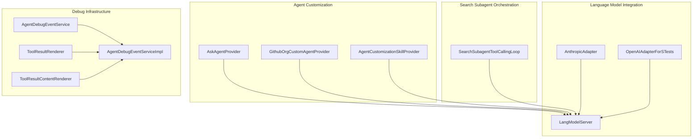
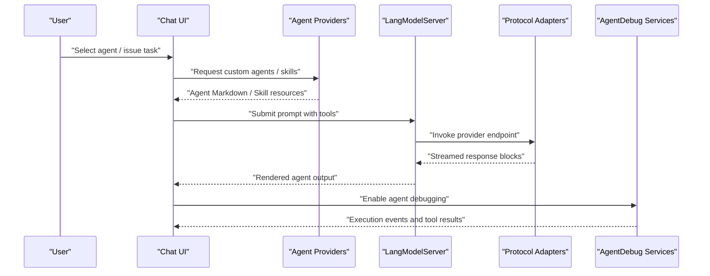
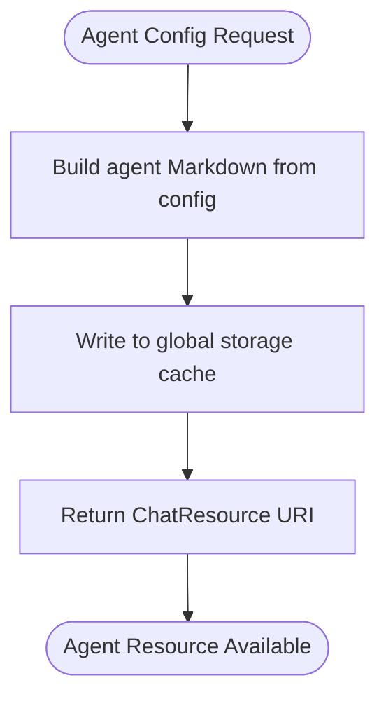
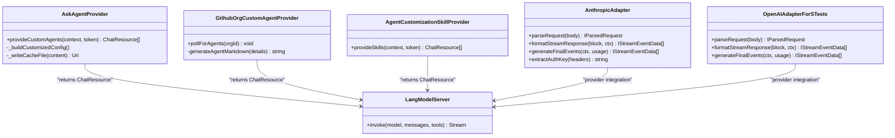
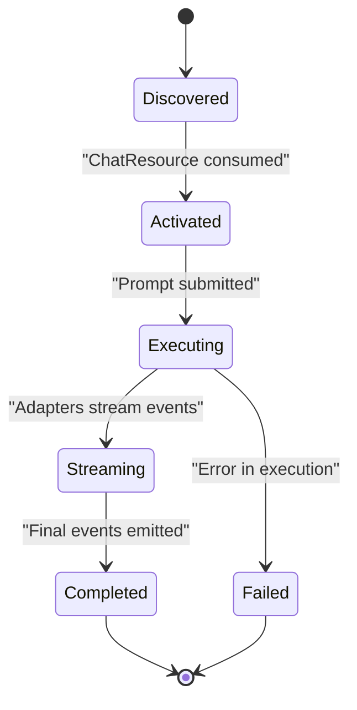
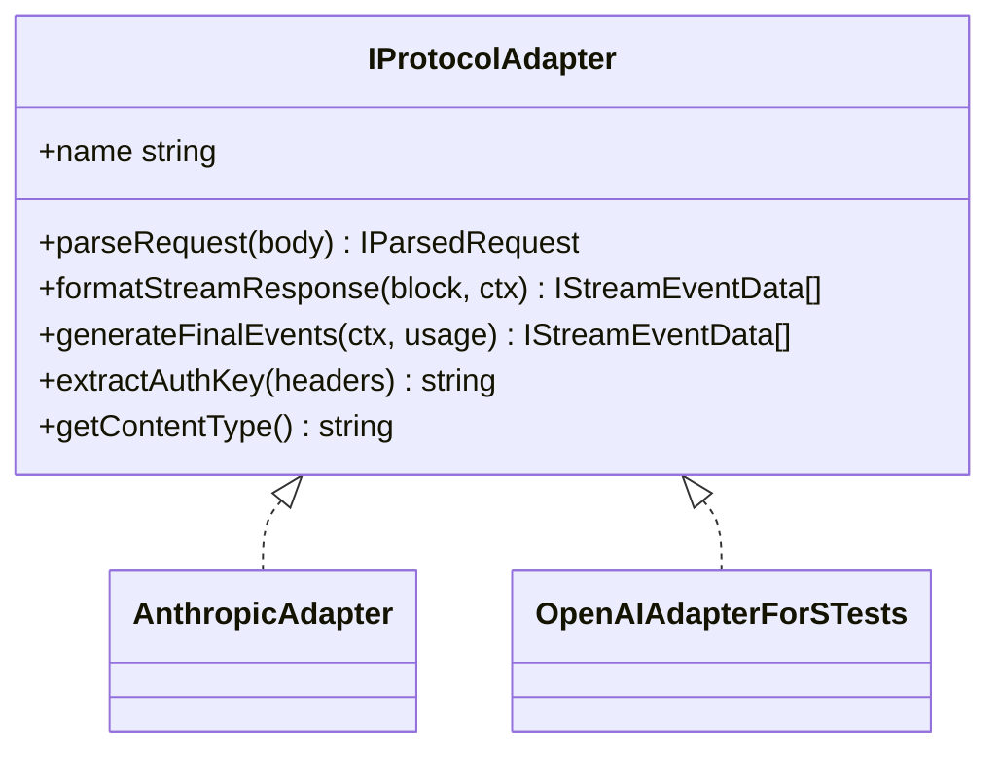
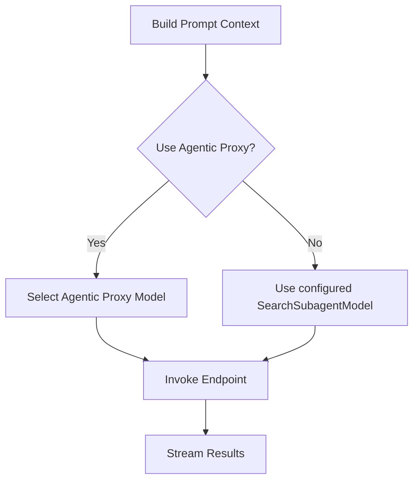
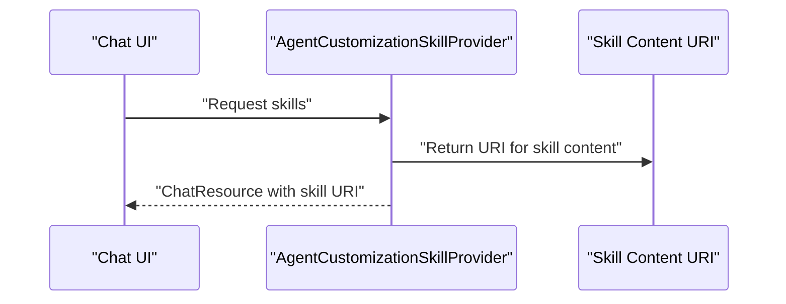
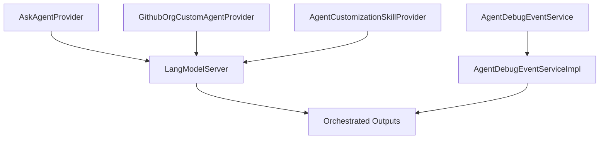
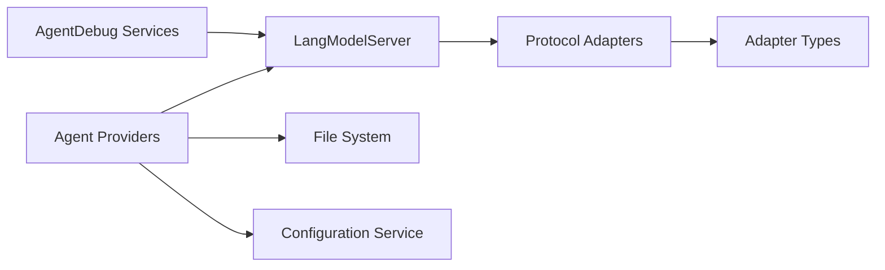

# Multi-Agent System Design

<cite>
**Referenced Files in This Document**
- [README.md](file://README.md)
- [agents.md](file://assets/prompts/skills/agent-customization/references/agents.md)
- [zaiPrompts.tsx](file://src/extension/prompts/node/agent/zaiPrompts.tsx)
- [searchSubagentToolCallingLoop.ts](file://src/extension/prompt/node/searchSubagentToolCallingLoop.ts)
- [agentCustomizationSkillProvider.ts](file://src/extension/agents/vscode-node/agentCustomizationSkillProvider.ts)
- [askAgentProvider.ts](file://src/extension/agents/vscode-node/askAgentProvider.ts)
- [githubOrgCustomAgentProvider.ts](file://src/extension/agents/vscode-node/githubOrgCustomAgentProvider.ts)
- [githubOrgChatResourcesService.ts](file://src/extension/agents/vscode-node/githubOrgChatResourcesService.ts)
- [types.ts](file://src/extension/agents/node/adapters/types.ts)
- [anthropicAdapter.ts](file://src/extension/agents/node/adapters/anthropicAdapter.ts)
- [openaiAdapterForSTests.ts](file://src/extension/agents/node/adapters/openaiAdapterForSTests.ts)
- [langModelServer.ts](file://src/extension/agents/node/langModelServer.ts)
- [agentDebugEventService.ts](file://src/extension/agentDebug/common/agentDebugEventService.ts)
- [agentDebugEventServiceImpl.ts](file://src/extension/agentDebug/node/agentDebugEventServiceImpl.ts)
- [toolResultRenderer.ts](file://src/extension/agentDebug/common/toolResultRenderer.ts)
- [toolResultContentRenderer.ts](file://src/extension/agentDebug/vscode-node/toolResultContentRenderer.ts)
- [agentDebugViewLogic.ts](file://src/extension/agentDebug/common/agentDebugViewLogic.ts)
- [agentDebugTypes.ts](file://src/extension/agentDebug/common/agentDebugTypes.ts)
- [agentDebugEventCollector.ts](file://src/extension/agentDebug/node/agentDebugEventCollector.ts)
- [agentDebugViewLogic.ts](file://src/extension/agentDebug/vscode-node/agentDebugViewLogic.ts)
- [agentDebugEventServiceImpl.ts](file://src/extension/agentDebug/vscode-node/agentDebugEventServiceImpl.ts)
- [agentDebugEventService.ts](file://src/extension/agentDebug/common/agentDebugEventService.ts)
- [agentDebugTypes.ts](file://src/extension/agentDebug/common/agentDebugTypes.ts)
- [agentDebugViewLogic.ts](file://src/extension/agentDebug/common/agentDebugViewLogic.ts)
- [toolResultRenderer.ts](file://src/extension/agentDebug/common/toolResultRenderer.ts)
- [toolResultContentRenderer.ts](file://src/extension/agentDebug/vscode-node/toolResultContentRenderer.ts)
- [agentDebugEventCollector.ts](file://src/extension/agentDebug/node/agentDebugEventCollector.ts)
- [agentDebugViewLogic.ts](file://src/extension/agentDebug/vscode-node/agentDebugViewLogic.ts)
- [agentDebugEventServiceImpl.ts](file://src/extension/agentDebug/vscode-node/agentDebugEventServiceImpl.ts)
- [agentDebugEventService.ts](file://src/extension/agentDebug/common/agentDebugEventService.ts)
- [agentDebugTypes.ts](file://src/extension/agentDebug/common/agentDebugTypes.ts)
- [agentDebugViewLogic.ts](file://src/extension/agentDebug/common/agentDebugViewLogic.ts)
- [toolResultRenderer.ts](file://src/extension/agentDebug/common/toolResultRenderer.ts)
- [toolResultContentRenderer.ts](file://src/extension/agentDebug/vscode-node/toolResultContentRenderer.ts)
- [agentDebugEventCollector.ts](file://src/extension/agentDebug/node/agentDebugEventCollector.ts)
- [agentDebugViewLogic.ts](file://src/extension/agentDebug/vscode-node/agentDebugViewLogic.ts)
- [agentDebugEventServiceImpl.ts](file://src/extension/agentDebug/vscode-node/agentDebugEventServiceImpl.ts)
- [agentDebugEventService.ts](file://src/extension/agentDebug/common/agentDebugEventService.ts)
- [agentDebugTypes.ts](file://src/extension/agentDebug/common/agentDebugTypes.ts)
- [agentDebugViewLogic.ts](file://src/extension/agentDebug/common/agentDebugViewLogic.ts)
- [toolResultRenderer.ts](file://src/extension/agentDebug/common/toolResultRenderer.ts)
- [toolResultContentRenderer.ts](file://src/extension/agentDebug/vscode-node/toolResultContentRenderer.ts)
- [agentDebugEventCollector.ts](file://src/extension/agentDebug/node/agentDebugEventCollector.ts)
- [agentDebugViewLogic.ts](file://src/extension/agentDebug/vscode-node/agentDebugViewLogic.ts)
- [agentDebugEventServiceImpl.ts](file://src/extension/agentDebug/vscode-node/agentDebugEventServiceImpl.ts)
- [agentDebugEventService.ts](file://src/extension/agentDebug/common/agentDebugEventService.ts)
- [agentDebugTypes.ts](file://src/extension/agentDebug/common/agentDebugTypes.ts)
- [agentDebugViewLogic.ts](file://src/extension/agentDebug/common/agentDebugViewLogic.ts)
- [toolResultRenderer.ts](file://src/extension/agentDebug/common/toolResultRenderer.ts)
- [toolResultContentRenderer.ts](file://src/extension/agentDebug/vscode-node/toolResultContentRenderer.ts)
- [agentDebugEventCollector.ts](file://src/extension/agentDebug/node/agentDebugEventCollector.ts)
- [agentDebugViewLogic.ts](file://src/extension/agentDebug/vscode-node/agentDebugViewLogic.ts)
- [agentDebugEventServiceImpl.ts](file://src/extension/agentDebug/vscode-node/agentDebugEventServiceImpl.ts)
- [agentDebugEventService.ts](file://src/extension/agentDebug/common/agentDebugEventService.ts)
- [agentDebugTypes.ts](file://src/extension/agentDebug/common/agentDebugTypes.ts)
- [agentDebugViewLogic.ts](file://src/extension/agentDebug/common/agentDebugViewLogic.ts)
- [toolResultRenderer.ts](file://src/extension/agentDebug/common/toolResultRenderer.ts)
- [toolResultContentRenderer.ts](file://src/extension/agentDebug/vscode-node/toolResultContentRenderer.ts)
- [agentDebugEventCollector.ts](file://src/extension/agentDebug/node/agentDebugEventCollector.ts)
- [agentDebugViewLogic.ts](file://src/extension/agentDebug/vscode-node/agentDebugViewLogic.ts)
- [agentDebugEventServiceImpl.ts](file://src/extension/agentDebug/vscode-node/agentDebugEventServiceImpl.ts)
- [agentDebugEventService.ts](file://src/extension/agentDebug/common/agentDebugEventService.ts)
- [agentDebugTypes.ts](file://src/extension/agentDebug/common/agentDebugTypes.ts)
- [agentDebugViewLogic.ts](file://src/extension/agentDebug/common/agentDebugViewLogic.ts)
- [toolResultRenderer.ts](file://src/extension/agentDebug/common/toolResultRenderer.ts)
- [toolResultContentRenderer.ts](file://src/extension/agentDebug/vscode-node/toolResultContentRenderer.ts)
- [agentDebugEventCollector.ts](file://......)
</cite>

## Table of Contents
1. [Introduction](#introduction)
2. [Project Structure](#project-structure)
3. [Core Components](#core-components)
4. [Architecture Overview](#architecture-overview)
5. [Detailed Component Analysis](#detailed-component-analysis)
6. [Dependency Analysis](#dependency-analysis)
7. [Performance Considerations](#performance-considerations)
8. [Troubleshooting Guide](#troubleshooting-guide)
9. [Conclusion](#conclusion)
10. [Appendices](#appendices)

## Introduction
This document explains the multi-agent system design in VSCode Copilot Chat. It covers how agents are selected, configured, and orchestrated; how they communicate with the main extension; how the agent lifecycle and state are managed; how agents interact with language model providers; the agent proxy system for external agents; the agent skill system for specialized capabilities; and coordination mechanisms among multiple agents. Practical examples and integration guidance for external AI services are included, along with technical challenges around managing multiple agents, resource allocation, and performance optimization.

## Project Structure
The multi-agent system spans several subsystems:
- Agent customization and skill providers that surface custom agents and skills to the chat UI
- Protocol adapters and language model server for provider integrations
- Debug infrastructure for agent execution visibility and diagnostics
- Search subagent orchestration and proxy model selection
- GitHub organization-backed agent distribution and caching

**Diagram sources**
- [askAgentProvider.ts](file://src/extension/agents/vscode-node/askAgentProvider.ts#L67-L75)
- [githubOrgCustomAgentProvider.ts](file://src/extension/agents/vscode-node/githubOrgCustomAgentProvider.ts#L87-L116)
- [agentCustomizationSkillProvider.ts](file://src/extension/agents/vscode-node/agentCustomizationSkillProvider.ts#L236-L253)
- [anthropicAdapter.ts](file://src/extension/agents/node/adapters/anthropicAdapter.ts)
- [openaiAdapterForSTests.ts](file://src/extension/agents/node/adapters/openaiAdapterForSTests.ts)
- [langModelServer.ts](file://src/extension/agents/node/langModelServer.ts)
- [searchSubagentToolCallingLoop.ts](file://src/extension/prompt/node/searchSubagentToolCallingLoop.ts#L58-L85)
- [agentDebugEventService.ts](file://src/extension/agentDebug/common/agentDebugEventService.ts)
- [agentDebugEventServiceImpl.ts](file://src/extension/agentDebug/node/agentDebugEventServiceImpl.ts)
- [toolResultRenderer.ts](file://src/extension/agentDebug/common/toolResultRenderer.ts)
- [toolResultContentRenderer.ts](file://src/extension/agentDebug/vscode-node/toolResultContentRenderer.ts)

**Section sources**
- [README.md](file://README.md#L18-L50)

## Core Components
- Agent customization providers:
  - AskAgentProvider: builds and caches a custom agent Markdown resource based on configuration and exposes it to the chat UI.
  - GithubOrgCustomAgentProvider: synchronizes organization-defined agents from GitHub and writes them to the local cache, emitting change notifications.
  - AgentCustomizationSkillProvider: surfaces a skill resource for agent customization prompts.
- Language model integration:
  - Protocol adapters (AnthropicAdapter, OpenAIAdapterForSTests) translate between provider-specific formats and internal streaming events.
  - LangModelServer: central server coordinating model interactions and streaming.
- Search subagent orchestration:
  - SearchSubagentToolCallingLoop: constructs prompts for a dedicated search subagent, selects endpoint/model, and supports an agentic proxy model path.
- Debug infrastructure:
  - AgentDebugEventService and AgentDebugEventServiceImpl: collect and emit agent execution events.
  - ToolResultRenderer and ToolResultContentRenderer: render tool execution results in the UI.

**Section sources**
- [askAgentProvider.ts](file://src/extension/agents/vscode-node/askAgentProvider.ts#L67-L75)
- [githubOrgCustomAgentProvider.ts](file://src/extension/agents/vscode-node/githubOrgCustomAgentProvider.ts#L87-L116)
- [agentCustomizationSkillProvider.ts](file://src/extension/agents/vscode-node/agentCustomizationSkillProvider.ts#L236-L253)
- [anthropicAdapter.ts](file://src/extension/agents/node/adapters/anthropicAdapter.ts)
- [openaiAdapterForSTests.ts](file://src/extension/agents/node/adapters/openaiAdapterForSTests.ts)
- [langModelServer.ts](file://src/extension/agents/node/langModelServer.ts)
- [searchSubagentToolCallingLoop.ts](file://src/extension/prompt/node/searchSubagentToolCallingLoop.ts#L58-L85)
- [agentDebugEventService.ts](file://src/extension/agentDebug/common/agentDebugEventService.ts)
- [agentDebugEventServiceImpl.ts](file://src/extension/agentDebug/node/agentDebugEventServiceImpl.ts)
- [toolResultRenderer.ts](file://src/extension/agentDebug/common/toolResultRenderer.ts)
- [toolResultContentRenderer.ts](file://src/extension/agentDebug/vscode-node/toolResultContentRenderer.ts)

## Architecture Overview
The multi-agent system integrates customization, orchestration, provider adapters, and debugging into a cohesive pipeline:
- Custom agents and skills are provided to the chat UI via providers.
- The main extension orchestrates agent selection and delegates tasks to the language model server.
- Providers adapt streaming responses and manage authentication and content types.
- Search subagents are invoked with explicit prompts and optional proxy models.
- Debug services capture and render agent execution traces.

**Diagram sources**
- [askAgentProvider.ts](file://src/extension/agents/vscode-node/askAgentProvider.ts#L67-L75)
- [githubOrgCustomAgentProvider.ts](file://src/extension/agents/vscode-node/githubOrgCustomAgentProvider.ts#L87-L116)
- [agentCustomizationSkillProvider.ts](file://src/extension/agents/vscode-node/agentCustomizationSkillProvider.ts#L236-L253)
- [langModelServer.ts](file://src/extension/agents/node/langModelServer.ts)
- [anthropicAdapter.ts](file://src/extension/agents/node/adapters/anthropicAdapter.ts)
- [openaiAdapterForSTests.ts](file://src/extension/agents/node/adapters/openaiAdapterForSTests.ts)
- [agentDebugEventService.ts](file://src/extension/agentDebug/common/agentDebugEventService.ts)
- [agentDebugEventServiceImpl.ts](file://src/extension/agentDebug/node/agentDebugEventServiceImpl.ts)

## Detailed Component Analysis

### Agent Selection and Configuration Management
- AskAgentProvider builds a custom agent Markdown from configuration and writes it to a cache directory in global storage, returning a URI resource for the chat UI.
- GithubOrgCustomAgentProvider periodically polls organization-defined agents, writes them to cache, prunes removed agents, and fires change notifications.
- AgentCustomizationSkillProvider exposes a skill resource for customization prompts.

**Diagram sources**
- [askAgentProvider.ts](file://src/extension/agents/vscode-node/askAgentProvider.ts#L67-L75)
- [askAgentProvider.ts](file://src/extension/agents/vscode-node/askAgentProvider.ts#L77-L87)

**Section sources**
- [askAgentProvider.ts](file://src/extension/agents/vscode-node/askAgentProvider.ts#L67-L75)
- [askAgentProvider.ts](file://src/extension/agents/vscode-node/askAgentProvider.ts#L77-L87)
- [githubOrgCustomAgentProvider.ts](file://src/extension/agents/vscode-node/githubOrgCustomAgentProvider.ts#L87-L116)
- [agentCustomizationSkillProvider.ts](file://src/extension/agents/vscode-node/agentCustomizationSkillProvider.ts#L236-L253)

### Communication Patterns Between Agents and the Main Extension
- Providers return ChatResource objects to the extension, enabling the UI to consume agent definitions and skills.
- LangModelServer coordinates model interactions and streams responses to the UI.
- Protocol adapters encapsulate provider-specific parsing and streaming event generation.

**Diagram sources**
- [askAgentProvider.ts](file://src/extension/agents/vscode-node/askAgentProvider.ts#L67-L75)
- [githubOrgCustomAgentProvider.ts](file://src/extension/agents/vscode-node/githubOrgCustomAgentProvider.ts#L87-L116)
- [agentCustomizationSkillProvider.ts](file://src/extension/agents/vscode-node/agentCustomizationSkillProvider.ts#L236-L253)
- [langModelServer.ts](file://src/extension/agents/node/langModelServer.ts)
- [anthropicAdapter.ts](file://src/extension/agents/node/adapters/anthropicAdapter.ts)
- [openaiAdapterForSTests.ts](file://src/extension/agents/node/adapters/openaiAdapterForSTests.ts)

**Section sources**
- [askAgentProvider.ts](file://src/extension/agents/vscode-node/askAgentProvider.ts#L67-L75)
- [githubOrgCustomAgentProvider.ts](file://src/extension/agents/vscode-node/githubOrgCustomAgentProvider.ts#L87-L116)
- [agentCustomizationSkillProvider.ts](file://src/extension/agents/vscode-node/agentCustomizationSkillProvider.ts#L236-L253)
- [anthropicAdapter.ts](file://src/extension/agents/node/adapters/anthropicAdapter.ts)
- [openaiAdapterForSTests.ts](file://src/extension/agents/node/adapters/openaiAdapterForSTests.ts)
- [types.ts](file://src/extension/agents/node/adapters/types.ts#L37-L90)

### Agent Lifecycle and State Management
- Lifecycle stages:
  - Discovery: Providers discover and materialize agent definitions (local cache or GitHub org).
  - Activation: The UI consumes ChatResource URIs to activate agents.
  - Execution: LangModelServer handles prompting, tool invocation, and streaming.
  - Debugging: AgentDebug services capture and render execution traces.
- State management:
  - Configuration changes trigger provider refreshes and change notifications.
  - Caching ensures fast activation and reduces network overhead.
  - Debug events maintain stateless visibility into agent actions.

**Diagram sources**
- [askAgentProvider.ts](file://src/extension/agents/vscode-node/askAgentProvider.ts#L67-L75)
- [githubOrgCustomAgentProvider.ts](file://src/extension/agents/vscode-node/githubOrgCustomAgentProvider.ts#L87-L116)
- [agentDebugEventService.ts](file://src/extension/agentDebug/common/agentDebugEventService.ts)
- [agentDebugEventServiceImpl.ts](file://src/extension/agentDebug/node/agentDebugEventServiceImpl.ts)

**Section sources**
- [askAgentProvider.ts](file://src/extension/agents/vscode-node/askAgentProvider.ts#L67-L75)
- [githubOrgCustomAgentProvider.ts](file://src/extension/agents/vscode-node/githubOrgCustomAgentProvider.ts#L87-L116)
- [agentDebugEventService.ts](file://src/extension/agentDebug/common/agentDebugEventService.ts)
- [agentDebugEventServiceImpl.ts](file://src/extension/agentDebug/node/agentDebugEventServiceImpl.ts)

### Interaction with Language Model Providers
- Protocol adapters define a common interface for parsing requests, formatting streaming events, generating final events, extracting auth keys, and determining content types.
- AnthropicAdapter and OpenAIAdapterForSTests implement provider-specific logic to integrate with their APIs.

**Diagram sources**
- [types.ts](file://src/extension/agents/node/adapters/types.ts#L37-L90)
- [anthropicAdapter.ts](file://src/extension/agents/node/adapters/anthropicAdapter.ts)
- [openaiAdapterForSTests.ts](file://src/extension/agents/node/adapters/openaiAdapterForSTests.ts)

**Section sources**
- [types.ts](file://src/extension/agents/node/adapters/types.ts#L37-L90)
- [anthropicAdapter.ts](file://src/extension/agents/node/adapters/anthropicAdapter.ts)
- [openaiAdapterForSTests.ts](file://src/extension/agents/node/adapters/openaiAdapterForSTests.ts)

### Agent Proxy System for External Agents
- SearchSubagentToolCallingLoop constructs a dedicated search subagent prompt and selects an endpoint/model. When enabled, it can route through an agentic proxy model with a default fallback.

**Diagram sources**
- [searchSubagentToolCallingLoop.ts](file://src/extension/prompt/node/searchSubagentToolCallingLoop.ts#L58-L85)

**Section sources**
- [searchSubagentToolCallingLoop.ts](file://src/extension/prompt/node/searchSubagentToolCallingLoop.ts#L58-L85)

### Agent Skill System for Specialized Capabilities
- AgentCustomizationSkillProvider exposes a skill resource for agent customization prompts, enabling specialized capabilities through prompt-driven customization.

**Diagram sources**
- [agentCustomizationSkillProvider.ts](file://src/extension/agents/vscode-node/agentCustomizationSkillProvider.ts#L236-L253)

**Section sources**
- [agentCustomizationSkillProvider.ts](file://src/extension/agents/vscode-node/agentCustomizationSkillProvider.ts#L236-L253)

### Coordination Mechanisms Between Multiple Agents
- Providers coordinate agent discovery and caching, emitting change events when configurations or organization resources update.
- LangModelServer orchestrates model interactions and tool invocation across agents.
- Debug services provide cross-agent visibility into execution and tool results.

**Diagram sources**
- [askAgentProvider.ts](file://src/extension/agents/vscode-node/askAgentProvider.ts#L67-L75)
- [githubOrgCustomAgentProvider.ts](file://src/extension/agents/vscode-node/githubOrgCustomAgentProvider.ts#L87-L116)
- [agentCustomizationSkillProvider.ts](file://src/extension/agents/vscode-node/agentCustomizationSkillProvider.ts#L236-L253)
- [langModelServer.ts](file://src/extension/agents/node/langModelServer.ts)
- [agentDebugEventService.ts](file://src/extension/agentDebug/common/agentDebugEventService.ts)
- [agentDebugEventServiceImpl.ts](file://src/extension/agentDebug/node/agentDebugEventServiceImpl.ts)

**Section sources**
- [askAgentProvider.ts](file://src/extension/agents/vscode-node/askAgentProvider.ts#L67-L75)
- [githubOrgCustomAgentProvider.ts](file://src/extension/agents/vscode-node/githubOrgCustomAgentProvider.ts#L87-L116)
- [agentCustomizationSkillProvider.ts](file://src/extension/agents/vscode-node/agentCustomizationSkillProvider.ts#L236-L253)
- [langModelServer.ts](file://src/extension/agents/node/langModelServer.ts)
- [agentDebugEventService.ts](file://src/extension/agentDebug/common/agentDebugEventService.ts)
- [agentDebugEventServiceImpl.ts](file://src/extension/agentDebug/node/agentDebugEventServiceImpl.ts)

### Practical Examples and Integration Guidance
- Agent configuration:
  - Use AskAgentProvider to generate a custom agent Markdown from configuration and expose it via a ChatResource.
  - Reference agent customization guidance for best practices and anti-patterns.
- Custom agent development:
  - Implement a provider similar to GithubOrgCustomAgentProvider to synchronize agents from an external source (e.g., GitHub organization) and write them to cache.
- Integration with external AI services:
  - Implement a new protocol adapter following IProtocolAdapter to support a new provider.
  - Route requests through LangModelServer and ensure proper authentication key extraction and content-type handling.

**Section sources**
- [askAgentProvider.ts](file://src/extension/agents/vscode-node/askAgentProvider.ts#L67-L75)
- [githubOrgCustomAgentProvider.ts](file://src/extension/agents/vscode-node/githubOrgCustomAgentProvider.ts#L87-L116)
- [agents.md](file://assets/prompts/skills/agent-customization/references/agents.md#L106-L111)
- [types.ts](file://src/extension/agents/node/adapters/types.ts#L37-L90)

## Dependency Analysis
The multi-agent system exhibits clear separation of concerns:
- Providers depend on configuration services and file systems to materialize agent resources.
- Protocol adapters depend on the internal streaming and usage models.
- LangModelServer depends on adapters and configuration services to route requests.
- Debug services are decoupled and observe execution via event emission.

**Diagram sources**
- [askAgentProvider.ts](file://src/extension/agents/vscode-node/askAgentProvider.ts#L67-L75)
- [githubOrgCustomAgentProvider.ts](file://src/extension/agents/vscode-node/githubOrgCustomAgentProvider.ts#L87-L116)
- [agentCustomizationSkillProvider.ts](file://src/extension/agents/vscode-node/agentCustomizationSkillProvider.ts#L236-L253)
- [langModelServer.ts](file://src/extension/agents/node/langModelServer.ts)
- [types.ts](file://src/extension/agents/node/adapters/types.ts#L37-L90)
- [agentDebugEventService.ts](file://src/extension/agentDebug/common/agentDebugEventService.ts)
- [agentDebugEventServiceImpl.ts](file://src/extension/agentDebug/node/agentDebugEventServiceImpl.ts)

**Section sources**
- [askAgentProvider.ts](file://src/extension/agents/vscode-node/askAgentProvider.ts#L67-L75)
- [githubOrgCustomAgentProvider.ts](file://src/extension/agents/vscode-node/githubOrgCustomAgentProvider.ts#L87-L116)
- [agentCustomizationSkillProvider.ts](file://src/extension/agents/vscode-node/agentCustomizationSkillProvider.ts#L236-L253)
- [types.ts](file://src/extension/agents/node/adapters/types.ts#L37-L90)
- [agentDebugEventService.ts](file://src/extension/agentDebug/common/agentDebugEventService.ts)
- [agentDebugEventServiceImpl.ts](file://src/extension/agentDebug/node/agentDebugEventServiceImpl.ts)

## Performance Considerations
- Caching:
  - Use AskAgentProvider and GithubOrgCustomAgentProvider caching to minimize repeated computation and network calls.
- Streaming:
  - Protocol adapters should efficiently parse and format streaming events to reduce latency.
- Resource allocation:
  - Limit concurrent agent invocations and batch tool calls where appropriate.
- Proxy routing:
  - Prefer agentic proxy models for search subagents when beneficial, selecting appropriate models per experiment configuration.

[No sources needed since this section provides general guidance]

## Troubleshooting Guide
- Debugging agent execution:
  - Enable agent debugging to capture execution events and tool results.
  - Use ToolResultRenderer and ToolResultContentRenderer to visualize tool outputs in the UI.
- Event collection:
  - AgentDebugEventService and AgentDebugEventServiceImpl provide centralized event emission and collection.
- Common issues:
  - Authentication failures: verify adapter auth key extraction and header handling.
  - Streaming anomalies: confirm adapter content type and event formatting.
  - Missing agents: ensure providers have refreshed cache and emitted change notifications.

**Section sources**
- [agentDebugEventService.ts](file://src/extension/agentDebug/common/agentDebugEventService.ts)
- [agentDebugEventServiceImpl.ts](file://src/extension/agentDebug/node/agentDebugEventServiceImpl.ts)
- [toolResultRenderer.ts](file://src/extension/agentDebug/common/toolResultRenderer.ts)
- [toolResultContentRenderer.ts](file://src/extension/agentDebug/vscode-node/toolResultContentRenderer.ts)
- [agentDebugEventCollector.ts](file://src/extension/agentDebug/node/agentDebugEventCollector.ts)
- [agentDebugViewLogic.ts](file://src/extension/agentDebug/vscode-node/agentDebugViewLogic.ts)

## Conclusion
The multi-agent system in VSCode Copilot Chat is designed around modular providers, robust protocol adapters, and a central language model server. It supports dynamic agent customization, specialized skills, coordinated orchestration, and comprehensive debugging. By leveraging caching, efficient streaming, and proxy routing, the system scales to manage multiple agents while maintaining responsiveness and observability.

[No sources needed since this section summarizes without analyzing specific files]

## Appendices
- Agent customization guidance and anti-patterns are documented in the agent customization references.
- Example prompt templates for agent creation and skills are available in the assets prompts directory.

**Section sources**
- [agents.md](file://assets/prompts/skills/agent-customization/references/agents.md#L106-L111)
- [zaiPrompts.tsx](file://src/extension/prompts/node/agent/zaiPrompts.tsx#L20-L35)