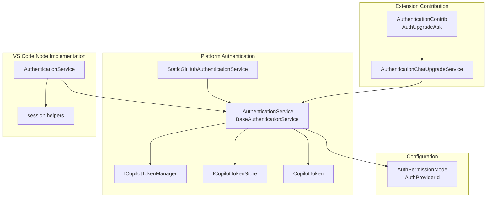
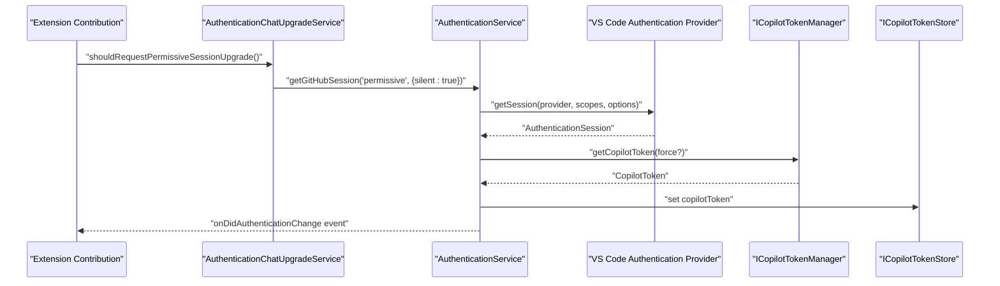
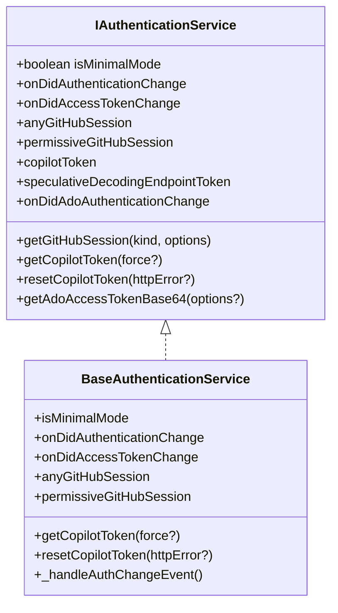
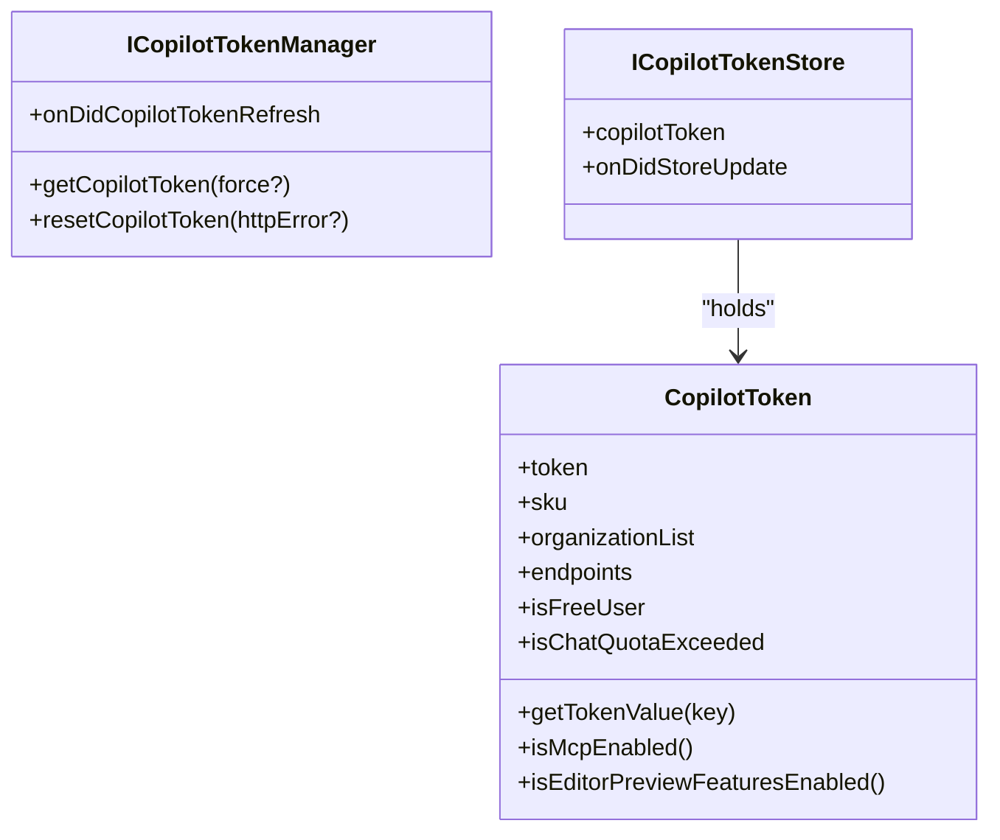
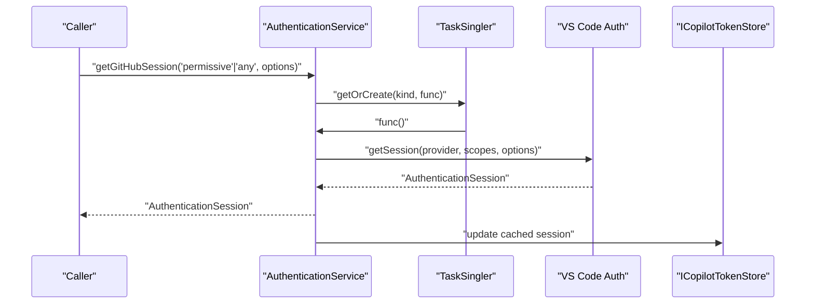
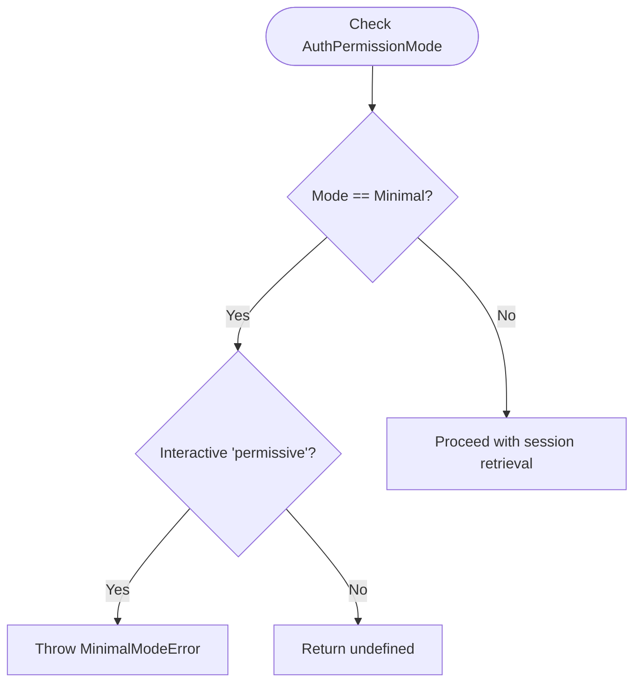
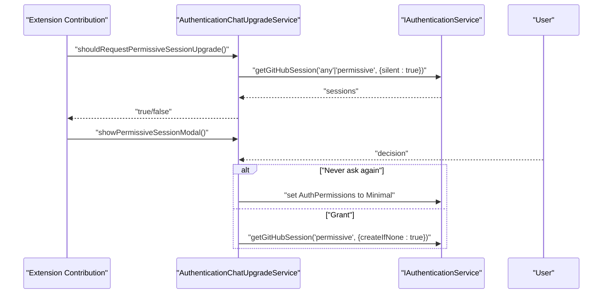
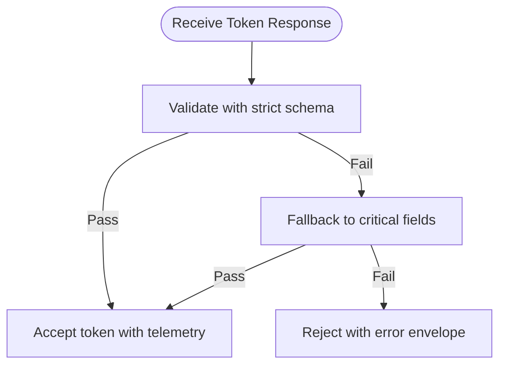
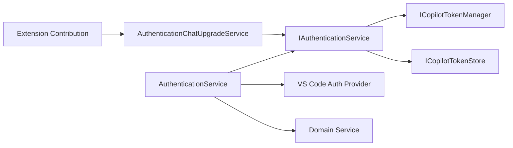

# Authentication Service

<cite>
**Referenced Files in This Document**
- [authentication.ts](file://src/platform/authentication/common/authentication.ts)
- [copilotToken.ts](file://src/platform/authentication/common/copilotToken.ts)
- [copilotTokenManager.ts](file://src/platform/authentication/common/copilotTokenManager.ts)
- [copilotTokenStore.ts](file://src/platform/authentication/common/copilotTokenStore.ts)
- [staticGitHubAuthenticationService.ts](file://src/platform/authentication/common/staticGitHubAuthenticationService.ts)
- [authenticationService.ts](file://src/platform/authentication/vscode-node/authenticationService.ts)
- [session.ts](file://src/platform/authentication/vscode-node/session.ts)
- [configurationService.ts](file://src/platform/configuration/common/configurationService.ts)
- [authenticationUpgradeService.ts](file://src/platform/authentication/common/authenticationUpgradeService.ts)
- [authentication.contribution.ts](file://src/extension/authentication/vscode-node/authentication.contribution.ts)
</cite>

## Table of Contents
1. [Introduction](#introduction)
2. [Project Structure](#project-structure)
3. [Core Components](#core-components)
4. [Architecture Overview](#architecture-overview)
5. [Detailed Component Analysis](#detailed-component-analysis)
6. [Dependency Analysis](#dependency-analysis)
7. [Performance Considerations](#performance-considerations)
8. [Troubleshooting Guide](#troubleshooting-guide)
9. [Conclusion](#conclusion)

## Introduction
This document describes the authentication service architecture in the platform layer, focusing on how user authentication, token lifecycle, and secure credential storage are managed. It covers the Copilot token management system, integration with GitHub authentication, anonymous access modes, permission management, and how the service coordinates with endpoint providers to maintain authenticated sessions across the extension. It also includes examples of authentication flows, token validation, and error handling for authentication failures, along with security considerations and token rotation strategies.

## Project Structure
The authentication subsystem is organized into:
- Platform-level interfaces and abstractions for authentication and token management
- VS Code node implementation that integrates with the VS Code authentication provider
- Configuration services that govern authentication permissions and provider selection
- Extension-level contributions that orchestrate user-facing authentication experiences

**Diagram sources**
- [authentication.ts](file://src/platform/authentication/common/authentication.ts#L32-L156)
- [copilotTokenManager.ts](file://src/platform/authentication/common/copilotTokenManager.ts#L10-L43)
- [copilotTokenStore.ts](file://src/platform/authentication/common/copilotTokenStore.ts#L11-L22)
- [copilotToken.ts](file://src/platform/authentication/common/copilotToken.ts#L67-L238)
- [staticGitHubAuthenticationService.ts](file://src/platform/authentication/common/staticGitHubAuthenticationService.ts#L14-L80)
- [authenticationService.ts](file://src/platform/authentication/vscode-node/authenticationService.ts#L16-L75)
- [session.ts](file://src/platform/authentication/vscode-node/session.ts#L25-L113)
- [configurationService.ts](file://src/platform/configuration/common/configurationService.ts#L598-L602)
- [authentication.contribution.ts](file://src/extension/authentication/vscode-node/authentication.contribution.ts#L17-L108)
- [authenticationUpgradeService.ts](file://src/platform/authentication/common/authenticationUpgradeService.ts#L21-L222)

**Section sources**
- [authentication.ts](file://src/platform/authentication/common/authentication.ts#L1-L341)
- [authenticationService.ts](file://src/platform/authentication/vscode-node/authenticationService.ts#L1-L76)
- [session.ts](file://src/platform/authentication/vscode-node/session.ts#L1-L120)
- [configurationService.ts](file://src/platform/configuration/common/configurationService.ts#L598-L602)
- [authentication.contribution.ts](file://src/extension/authentication/vscode-node/authentication.contribution.ts#L1-L109)
- [authenticationUpgradeService.ts](file://src/platform/authentication/common/authenticationUpgradeService.ts#L1-L223)

## Core Components
- IAuthenticationService: Defines the contract for authentication operations, including GitHub session retrieval, Copilot token management, and events for authentication state changes.
- BaseAuthenticationService: Implements shared logic for handling authentication changes, updating cached sessions, and refreshing tokens.
- ICopilotTokenManager: Manages the lifecycle of Copilot tokens, including fetching, refreshing, and resetting tokens.
- ICopilotTokenStore: Provides a simple store for the current Copilot token, decoupling consumers from the authentication service.
- CopilotToken: Encapsulates the token payload, metadata, SKU, quotas, and helper methods to interpret token flags and endpoints.
- AuthenticationService (VS Code node): Integrates with the VS Code authentication provider, manages permissive and any-session retrieval, and coordinates domain changes.
- StaticGitHubAuthenticationService: A convenience implementation for environments where a token provider is injected directly.
- AuthenticationChatUpgradeService: Orchestrates permission upgrades (e.g., requesting permissive GitHub scopes) and persists user decisions.
- session helpers: Utility functions to retrieve sessions with aligned scopes and handle silent vs interactive flows.
- Configuration: AuthPermissionMode and AuthProviderId drive minimal vs default permission behavior and provider selection.

**Section sources**
- [authentication.ts](file://src/platform/authentication/common/authentication.ts#L32-L156)
- [copilotTokenManager.ts](file://src/platform/authentication/common/copilotTokenManager.ts#L10-L43)
- [copilotTokenStore.ts](file://src/platform/authentication/common/copilotTokenStore.ts#L11-L22)
- [copilotToken.ts](file://src/platform/authentication/common/copilotToken.ts#L67-L238)
- [authenticationService.ts](file://src/platform/authentication/vscode-node/authenticationService.ts#L16-L75)
- [staticGitHubAuthenticationService.ts](file://src/platform/authentication/common/staticGitHubAuthenticationService.ts#L14-L80)
- [authenticationUpgradeService.ts](file://src/platform/authentication/common/authenticationUpgradeService.ts#L21-L222)
- [session.ts](file://src/platform/authentication/vscode-node/session.ts#L25-L113)
- [configurationService.ts](file://src/platform/configuration/common/configurationService.ts#L598-L602)

## Architecture Overview
The authentication service is layered:
- Platform interfaces define capabilities and token models.
- VS Code node implementation bridges to the VS Code authentication provider and domain service.
- Configuration controls permission modes and provider identity.
- Extension contributions surface user prompts and upgrade flows.

**Diagram sources**
- [authentication.contribution.ts](file://src/extension/authentication/vscode-node/authentication.contribution.ts#L46-L107)
- [authenticationUpgradeService.ts](file://src/platform/authentication/common/authenticationUpgradeService.ts#L52-L107)
- [authenticationService.ts](file://src/platform/authentication/vscode-node/authenticationService.ts#L43-L59)
- [session.ts](file://src/platform/authentication/vscode-node/session.ts#L99-L113)
- [copilotTokenManager.ts](file://src/platform/authentication/common/copilotTokenManager.ts#L36-L42)
- [copilotTokenStore.ts](file://src/platform/authentication/common/copilotTokenStore.ts#L24-L40)

## Detailed Component Analysis

### IAuthenticationService and BaseAuthenticationService
- Responsibilities:
  - Manage GitHub sessions ('any' and 'permissive'), with support for silent, create-if-none, and force-new flows.
  - Provide Copilot token access with automatic refresh and reset on HTTP errors.
  - Emit events for authentication and access token changes, and for Azure DevOps authentication changes.
  - Track minimal mode and enforce restrictions accordingly.
- Key behaviors:
  - On authentication changes, refresh cached sessions and optionally mint a new Copilot token.
  - Maintain separate caches for any/permissive GitHub sessions and Azure DevOps sessions.
  - Fire events to notify consumers of state changes.

**Diagram sources**
- [authentication.ts](file://src/platform/authentication/common/authentication.ts#L32-L156)
- [authentication.ts](file://src/platform/authentication/common/authentication.ts#L158-L332)

**Section sources**
- [authentication.ts](file://src/platform/authentication/common/authentication.ts#L32-L156)
- [authentication.ts](file://src/platform/authentication/common/authentication.ts#L158-L332)

### Copilot Token Management
- ICopilotTokenManager:
  - Emits refresh events for dependent systems.
  - Retrieves or refreshes a valid Copilot token, honoring telemetry consent and optional force-refresh.
- ICopilotTokenStore:
  - Holds the current Copilot token and emits updates when it changes.
- CopilotToken:
  - Parses token fields and exposes SKU, quotas, organization lists, endpoints, and feature flags.
  - Provides helpers to evaluate plan type, quota status, and feature toggles.

**Diagram sources**
- [copilotTokenManager.ts](file://src/platform/authentication/common/copilotTokenManager.ts#L10-L43)
- [copilotTokenStore.ts](file://src/platform/authentication/common/copilotTokenStore.ts#L11-L22)
- [copilotToken.ts](file://src/platform/authentication/common/copilotToken.ts#L67-L238)

**Section sources**
- [copilotTokenManager.ts](file://src/platform/authentication/common/copilotTokenManager.ts#L10-L43)
- [copilotTokenStore.ts](file://src/platform/authentication/common/copilotTokenStore.ts#L11-L22)
- [copilotToken.ts](file://src/platform/authentication/common/copilotToken.ts#L67-L238)

### VS Code Node AuthenticationService
- Integrates with the VS Code authentication provider and domain service.
- Retrieves 'any' and 'permissive' sessions with a task singler to avoid concurrent flows interfering with user choices.
- Handles Azure DevOps PAT retrieval and base64 encoding for downstream consumers.
- Reacts to session and domain changes to update cached sessions and tokens.

**Diagram sources**
- [authenticationService.ts](file://src/platform/authentication/vscode-node/authenticationService.ts#L16-L75)
- [session.ts](file://src/platform/authentication/vscode-node/session.ts#L25-L55)

**Section sources**
- [authenticationService.ts](file://src/platform/authentication/vscode-node/authenticationService.ts#L16-L75)
- [session.ts](file://src/platform/authentication/vscode-node/session.ts#L25-L113)

### StaticGitHubAuthenticationService
- Provides a static token provider for environments where tokens are injected externally.
- Supports 'any' and 'permissive' sessions with aligned scopes and minimal-mode enforcement.
- Allows manual setting of a Copilot token and triggers authentication change events.

**Section sources**
- [staticGitHubAuthenticationService.ts](file://src/platform/authentication/common/staticGitHubAuthenticationService.ts#L14-L80)

### Permission Management and Anonymous Access Modes
- AuthPermissionMode:
  - Default: normal operation with permissive scopes when available.
  - Minimal: restricts permissive session acquisition; interactive flows throw an error; silent flows return undefined.
- AuthProviderId:
  - Selects GitHub or GitHub Enterprise provider.
- Configuration keys:
  - advanced.authProvider and advanced.authPermissions control provider and permission mode.

**Diagram sources**
- [configurationService.ts](file://src/platform/configuration/common/configurationService.ts#L598-L602)
- [authentication.ts](file://src/platform/authentication/common/authentication.ts#L190-L194)
- [session.ts](file://src/platform/authentication/vscode-node/session.ts#L99-L113)
- [staticGitHubAuthenticationService.ts](file://src/platform/authentication/common/staticGitHubAuthenticationService.ts#L46-L61)

**Section sources**
- [configurationService.ts](file://src/platform/configuration/common/configurationService.ts#L598-L602)
- [authentication.ts](file://src/platform/authentication/common/authentication.ts#L190-L194)
- [session.ts](file://src/platform/authentication/vscode-node/session.ts#L99-L113)
- [staticGitHubAuthenticationService.ts](file://src/platform/authentication/common/staticGitHubAuthenticationService.ts#L46-L61)

### Authentication Upgrade Flow (Permissive Scopes)
- AuthenticationChatUpgradeService:
  - Determines whether to request permissive scopes based on existing sessions, repository access, and user state.
  - Presents modal prompts in UI or chat, supports 'grant', 'not now', and 'never ask again'.
  - Persists user decision by switching to minimal mode if chosen.
- Extension contribution:
  - Triggers upgrade prompts and listens for authentication changes to decide when to show prompts.

**Diagram sources**
- [authenticationUpgradeService.ts](file://src/platform/authentication/common/authenticationUpgradeService.ts#L52-L107)
- [authenticationUpgradeService.ts](file://src/platform/authentication/common/authenticationUpgradeService.ts#L130-L206)
- [authentication.contribution.ts](file://src/extension/authentication/vscode-node/authentication.contribution.ts#L46-L107)

**Section sources**
- [authenticationUpgradeService.ts](file://src/platform/authentication/common/authenticationUpgradeService.ts#L21-L222)
- [authentication.contribution.ts](file://src/extension/authentication/vscode-node/authentication.contribution.ts#L17-L108)

### Token Validation and Error Handling
- Token envelopes:
  - Strict validation against a comprehensive schema, with fallback validation on critical fields to tolerate server schema changes.
  - Error envelopes differentiate between authorization failures, request failures, parsing errors, HTTP 401, and rate limits.
- Error propagation:
  - Authentication service catches token errors, clears stored token, and fires authentication change events when the error state changes.

**Diagram sources**
- [copilotToken.ts](file://src/platform/authentication/common/copilotToken.ts#L449-L474)
- [copilotToken.ts](file://src/platform/authentication/common/copilotToken.ts#L349-L386)

**Section sources**
- [copilotToken.ts](file://src/platform/authentication/common/copilotToken.ts#L349-L386)
- [copilotToken.ts](file://src/platform/authentication/common/copilotToken.ts#L449-L474)
- [authentication.ts](file://src/platform/authentication/common/authentication.ts#L240-L259)

## Dependency Analysis
- Coupling:
  - IAuthenticationService depends on ICopilotTokenManager and ICopilotTokenStore to manage tokens.
  - VS Code node implementation depends on VS Code authentication provider and domain service.
  - Extension contributions depend on the authentication service and upgrade service.
- Cohesion:
  - Token management is cohesive within CopilotToken, ICopilotTokenManager, and ICopilotTokenStore.
  - Permission mode and provider selection are centralized in configuration services.
- External dependencies:
  - VS Code authentication provider for session retrieval.
  - Domain service for endpoint/domain changes.

**Diagram sources**
- [authentication.ts](file://src/platform/authentication/common/authentication.ts#L176-L187)
- [authenticationService.ts](file://src/platform/authentication/vscode-node/authenticationService.ts#L26-L41)
- [authentication.contribution.ts](file://src/extension/authentication/vscode-node/authentication.contribution.ts#L34-L44)
- [authenticationUpgradeService.ts](file://src/platform/authentication/common/authenticationUpgradeService.ts#L36-L50)

**Section sources**
- [authentication.ts](file://src/platform/authentication/common/authentication.ts#L176-L187)
- [authenticationService.ts](file://src/platform/authentication/vscode-node/authenticationService.ts#L26-L41)
- [authentication.contribution.ts](file://src/extension/authentication/vscode-node/authentication.contribution.ts#L34-L44)
- [authenticationUpgradeService.ts](file://src/platform/authentication/common/authenticationUpgradeService.ts#L36-L50)

## Performance Considerations
- Session retrieval is guarded by a task singler to prevent concurrent interactive flows from conflicting with user choices.
- Silent session retrieval avoids network calls when cached sessions are available.
- Token refresh is triggered only when necessary, and errors are handled gracefully to minimize retries.
- Event-driven updates reduce polling and keep caches synchronized.

[No sources needed since this section provides general guidance]

## Troubleshooting Guide
Common issues and resolutions:
- Minimal mode prevents permissive session acquisition:
  - Symptom: Interactive 'permissive' session requests fail with a minimal mode error.
  - Resolution: Switch to default permission mode or use 'any' sessions for read-only operations.
- No Copilot token after authentication:
  - Symptom: getCopilotToken throws or returns undefined.
  - Resolution: Ensure a valid GitHub session exists; trigger a refresh; verify telemetry consent; check for HTTP 403 or rate limit responses.
- Rate limiting or parse failures:
  - Symptom: Token retrieval fails with rate limit or parse error.
  - Resolution: Retry after backoff; inspect error envelopes for actionable messages; verify server schema stability.
- Domain changes:
  - Symptom: Authentication state not updating after domain changes.
  - Resolution: Ensure domain service events are registered and handled to refresh sessions and tokens.

**Section sources**
- [session.ts](file://src/platform/authentication/vscode-node/session.ts#L99-L113)
- [authentication.ts](file://src/platform/authentication/common/authentication.ts#L240-L259)
- [copilotToken.ts](file://src/platform/authentication/common/copilotToken.ts#L349-L386)
- [authenticationService.ts](file://src/platform/authentication/vscode-node/authenticationService.ts#L27-L38)

## Conclusion
The authentication service provides a robust, layered architecture for managing GitHub authentication, Copilot token lifecycle, and secure credential storage. It supports flexible permission modes, integrates seamlessly with VS Code’s authentication provider, and offers upgrade flows for enhanced repository access. By centralizing token validation, event-driven updates, and configuration-driven behavior, it enables reliable authenticated sessions across the extension while maintaining strong security practices.