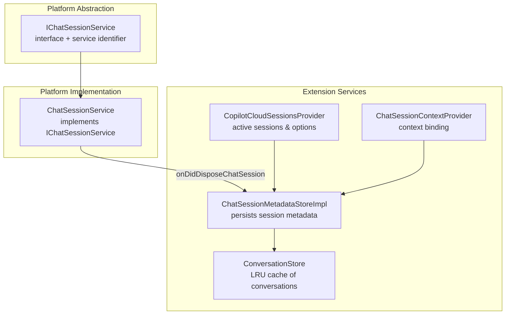
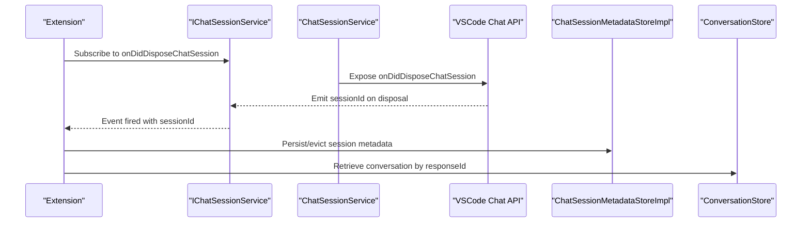
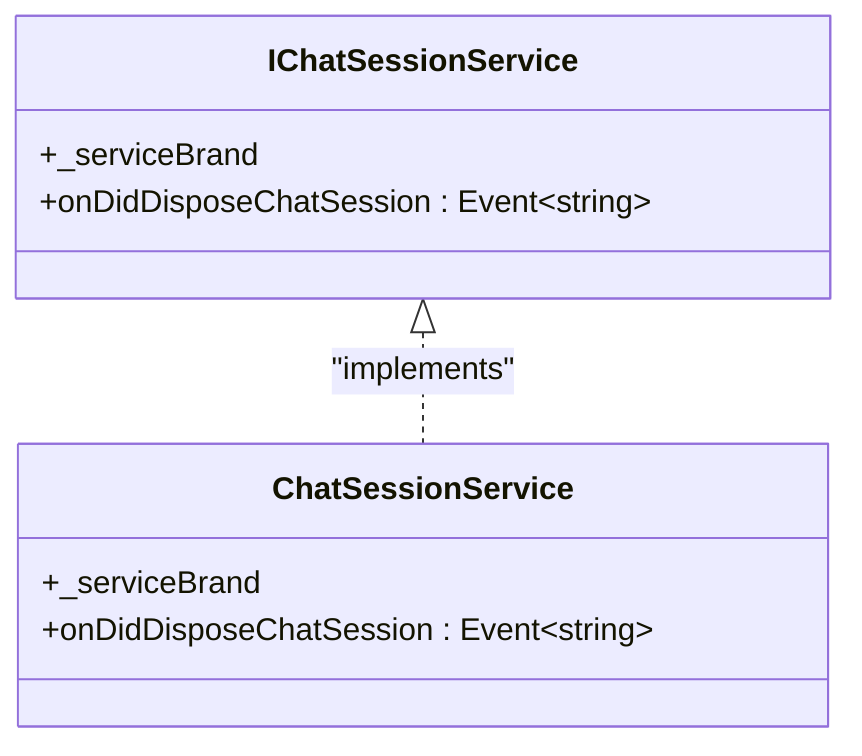
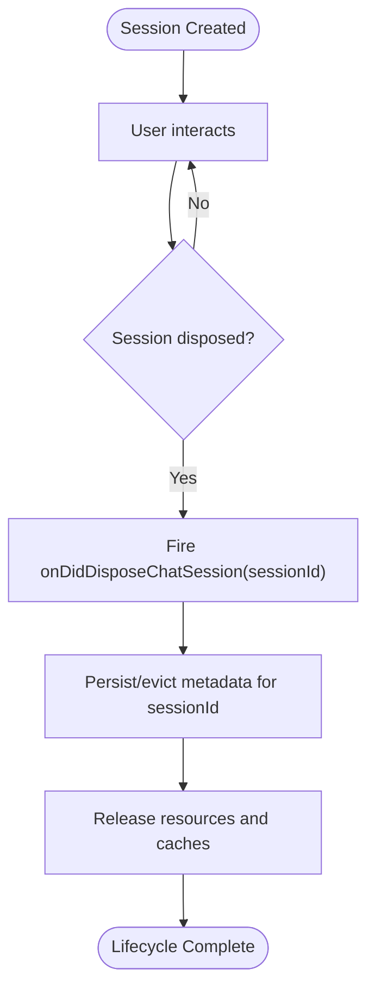
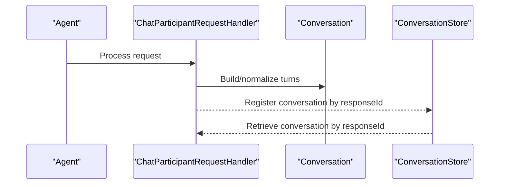
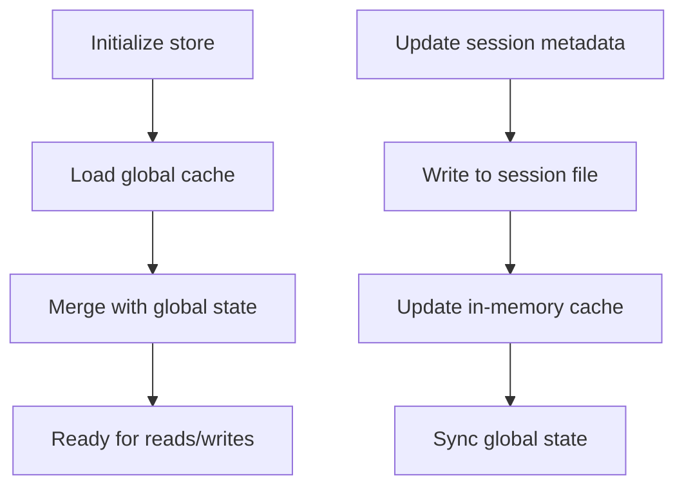
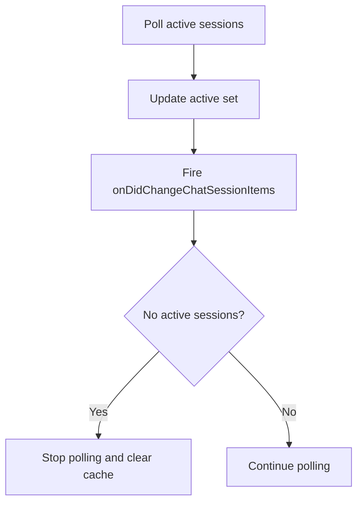
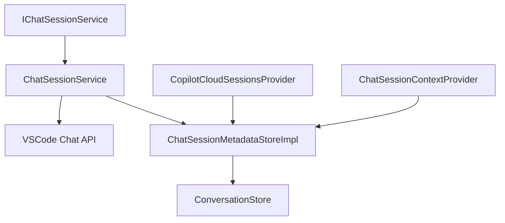

# Chat Session Service

<cite>
**Referenced Files in This Document**
- [chatSessionService.ts](file://src/platform/chat/common/chatSessionService.ts)
- [chatSessionService.ts](file://src/platform/chat/vscode/chatSessionService.ts)
- [chatSessionMetadataStoreImpl.ts](file://src/extension/chatSessions/vscode-node/chatSessionMetadataStoreImpl.ts)
- [conversation.ts](file://src/extension/prompt/common/conversation.ts)
- [conversationStore.ts](file://src/extension/conversationStore/node/conversationStore.ts)
- [copilotCloudSessionsProvider.ts](file://src/extension/chatSessions/vscode-node/copilotCloudSessionsProvider.ts)
- [chatSessionContextProvider.ts](file://src/extension/chatSessionContext/vscode-node/chatSessionContextProvider.ts)
- [sanity.sanity-test.ts](file://src/extension/test/vscode-node/sanity.sanity-test.ts)
</cite>

## Table of Contents
1. [Introduction](#introduction)
2. [Project Structure](#project-structure)
3. [Core Components](#core-components)
4. [Architecture Overview](#architecture-overview)
5. [Detailed Component Analysis](#detailed-component-analysis)
6. [Dependency Analysis](#dependency-analysis)
7. [Performance Considerations](#performance-considerations)
8. [Troubleshooting Guide](#troubleshooting-guide)
9. [Conclusion](#conclusion)

## Introduction
This document explains the chat session service architecture in the VSCode Copilot Chat extension. It focuses on the IChatSessionService interface and its role in managing chat conversations, the onDidDisposeChatSession event mechanism for cleanup, the relationship between chat sessions and agents, and how conversations are maintained, persisted, and disposed. It also covers lifecycle management, state handling, error handling patterns, recovery mechanisms, and coordination with endpoint providers and tool systems.

## Project Structure
The chat session service spans platform abstractions and extension-specific implementations:
- Platform abstraction defines the service interface and identifier.
- Platform implementation bridges to the VSCode chat API.
- Extension-side stores and providers manage session metadata, conversation persistence, and session lists.

**Diagram sources**
- [chatSessionService.ts](file://src/platform/chat/common/chatSessionService.ts#L9-L15)
- [chatSessionService.ts](file://src/platform/chat/vscode/chatSessionService.ts#L10-L16)
- [chatSessionMetadataStoreImpl.ts](file://src/extension/chatSessions/vscode-node/chatSessionMetadataStoreImpl.ts#L49-L311)
- [conversationStore.ts](file://src/extension/conversationStore/node/conversationStore.ts#L10-L38)
- [copilotCloudSessionsProvider.ts](file://src/extension/chatSessions/vscode-node/copilotCloudSessionsProvider.ts#L461-L944)
- [chatSessionContextProvider.ts](file://src/extension/chatSessionContext/vscode-node/chatSessionContextProvider.ts)

**Section sources**
- [chatSessionService.ts](file://src/platform/chat/common/chatSessionService.ts#L1-L15)
- [chatSessionService.ts](file://src/platform/chat/vscode/chatSessionService.ts#L1-L16)

## Core Components
- IChatSessionService: Defines the service contract and exposes onDidDisposeChatSession to observe session disposal events.
- ChatSessionService: Implements the platform service by delegating to the VSCode chat API’s disposal event.
- ChatSessionMetadataStoreImpl: Persists and manages per-session metadata, including workspace folders and timestamps, and maintains a global cache.
- ConversationStore: LRU-backed store keyed by responseId for retrieving conversations after requests complete.
- CopilotCloudSessionsProvider: Manages active sessions, polling, and option updates for session participants.
- ChatSessionContextProvider: Provides contextual bindings for sessions.

Key responsibilities:
- Event-driven disposal: onDidDisposeChatSession signals when a session is closed, enabling cleanup.
- Persistence: Metadata is written to disk and cached globally to survive restarts.
- Conversation retrieval: After a request completes, the resulting conversation can be fetched via responseId.
- Active session tracking: Provider keeps track of active sessions and updates options dynamically.

**Section sources**
- [chatSessionService.ts](file://src/platform/chat/common/chatSessionService.ts#L9-L15)
- [chatSessionService.ts](file://src/platform/chat/vscode/chatSessionService.ts#L10-L16)
- [chatSessionMetadataStoreImpl.ts](file://src/extension/chatSessions/vscode-node/chatSessionMetadataStoreImpl.ts#L49-L311)
- [conversationStore.ts](file://src/extension/conversationStore/node/conversationStore.ts#L10-L38)
- [copilotCloudSessionsProvider.ts](file://src/extension/chatSessions/vscode-node/copilotCloudSessionsProvider.ts#L461-L944)
- [chatSessionContextProvider.ts](file://src/extension/chatSessionContext/vscode-node/chatSessionContextProvider.ts)

## Architecture Overview
The service layer coordinates session lifecycle, conversation state, and integration with endpoint providers and tool systems.

**Diagram sources**
- [chatSessionService.ts](file://src/platform/chat/common/chatSessionService.ts#L9-L15)
- [chatSessionService.ts](file://src/platform/chat/vscode/chatSessionService.ts#L10-L16)
- [chatSessionMetadataStoreImpl.ts](file://src/extension/chatSessions/vscode-node/chatSessionMetadataStoreImpl.ts#L49-L311)
- [conversationStore.ts](file://src/extension/conversationStore/node/conversationStore.ts#L10-L38)

## Detailed Component Analysis

### IChatSessionService and ChatSessionService
- IChatSessionService defines the service identifier and the onDidDisposeChatSession event contract.
- ChatSessionService implements the interface by forwarding the VSCode chat disposal event.

**Diagram sources**
- [chatSessionService.ts](file://src/platform/chat/common/chatSessionService.ts#L9-L15)
- [chatSessionService.ts](file://src/platform/chat/vscode/chatSessionService.ts#L10-L16)

**Section sources**
- [chatSessionService.ts](file://src/platform/chat/common/chatSessionService.ts#L9-L15)
- [chatSessionService.ts](file://src/platform/chat/vscode/chatSessionService.ts#L10-L16)

### Chat Session Lifecycle and Disposal
- Sessions are identified by sessionId.
- onDidDisposeChatSession emits when a session closes; consumers subscribe to clean up resources.
- Untitled sessions are ignored for persistence to avoid unnecessary writes.
- Metadata is persisted to a per-session file and synchronized with global state.

**Diagram sources**
- [chatSessionService.ts](file://src/platform/chat/common/chatSessionService.ts#L9-L15)
- [chatSessionMetadataStoreImpl.ts](file://src/extension/chatSessions/vscode-node/chatSessionMetadataStoreImpl.ts#L49-L311)

**Section sources**
- [chatSessionService.ts](file://src/platform/chat/common/chatSessionService.ts#L9-L15)
- [chatSessionMetadataStoreImpl.ts](file://src/extension/chatSessions/vscode-node/chatSessionMetadataStoreImpl.ts#L49-L311)

### Relationship Between Sessions and Agents
- Agents participate in chat through registered chat participants and intent-driven handlers.
- Conversations are built from VSCode chat history and normalized into turns and rounds.
- After a request completes, the resulting conversation can be retrieved from ConversationStore using the responseId.

**Diagram sources**
- [conversation.ts](file://src/extension/prompt/common/conversation.ts#L220-L238)
- [conversationStore.ts](file://src/extension/conversationStore/node/conversationStore.ts#L10-L38)
- [sanity.sanity-test.ts](file://src/extension/test/vscode-node/sanity.sanity-test.ts#L127-L148)

**Section sources**
- [conversation.ts](file://src/extension/prompt/common/conversation.ts#L220-L238)
- [conversationStore.ts](file://src/extension/conversationStore/node/conversationStore.ts#L10-L38)
- [sanity.sanity-test.ts](file://src/extension/test/vscode-node/sanity.sanity-test.ts#L127-L148)

### Conversation State Handling and Persistence
- ChatSessionMetadataStoreImpl persists session metadata to disk and maintains a global cache.
- It handles initialization, recovery, and ensures metadata is written only for non-untitled sessions.
- Global state merges with cached data to reconcile missing or stale entries.

**Diagram sources**
- [chatSessionMetadataStoreImpl.ts](file://src/extension/chatSessions/vscode-node/chatSessionMetadataStoreImpl.ts#L49-L311)

**Section sources**
- [chatSessionMetadataStoreImpl.ts](file://src/extension/chatSessions/vscode-node/chatSessionMetadataStoreImpl.ts#L49-L311)

### Active Sessions and Options Management
- CopilotCloudSessionsProvider tracks active sessions, polls for updates, and fires change events.
- It supports dynamic option updates (custom agents, models, partner agents, repositories) and logs changes.
- Refresh logic clears caches and stops polling when no active sessions remain.

**Diagram sources**
- [copilotCloudSessionsProvider.ts](file://src/extension/chatSessions/vscode-node/copilotCloudSessionsProvider.ts#L461-L944)

**Section sources**
- [copilotCloudSessionsProvider.ts](file://src/extension/chatSessions/vscode-node/copilotCloudSessionsProvider.ts#L461-L944)

### Integration with Context Providers
- ChatSessionContextProvider binds session context to enable richer interactions and tooling.
- It collaborates with session metadata to provide accurate workspace and session-aware capabilities.

**Section sources**
- [chatSessionContextProvider.ts](file://src/extension/chatSessionContext/vscode-node/chatSessionContextProvider.ts)

## Dependency Analysis
The following diagram shows key dependencies among the components:

**Diagram sources**
- [chatSessionService.ts](file://src/platform/chat/common/chatSessionService.ts#L9-L15)
- [chatSessionService.ts](file://src/platform/chat/vscode/chatSessionService.ts#L10-L16)
- [chatSessionMetadataStoreImpl.ts](file://src/extension/chatSessions/vscode-node/chatSessionMetadataStoreImpl.ts#L49-L311)
- [conversationStore.ts](file://src/extension/conversationStore/node/conversationStore.ts#L10-L38)
- [copilotCloudSessionsProvider.ts](file://src/extension/chatSessions/vscode-node/copilotCloudSessionsProvider.ts#L461-L944)
- [chatSessionContextProvider.ts](file://src/extension/chatSessionContext/vscode-node/chatSessionContextProvider.ts)

**Section sources**
- [chatSessionService.ts](file://src/platform/chat/common/chatSessionService.ts#L9-L15)
- [chatSessionService.ts](file://src/platform/chat/vscode/chatSessionService.ts#L10-L16)
- [chatSessionMetadataStoreImpl.ts](file://src/extension/chatSessions/vscode-node/chatSessionMetadataStoreImpl.ts#L49-L311)
- [conversationStore.ts](file://src/extension/conversationStore/node/conversationStore.ts#L10-L38)
- [copilotCloudSessionsProvider.ts](file://src/extension/chatSessions/vscode-node/copilotCloudSessionsProvider.ts#L461-L944)
- [chatSessionContextProvider.ts](file://src/extension/chatSessionContext/vscode-node/chatSessionContextProvider.ts)

## Performance Considerations
- Event-driven disposal avoids polling for session state; rely on onDidDisposeChatSession to trigger cleanup promptly.
- Metadata persistence is debounced and batched to reduce I/O overhead.
- ConversationStore uses an LRU cache to cap memory usage while enabling fast retrieval by responseId.
- Active session polling is stopped when no sessions remain to conserve resources.

[No sources needed since this section provides general guidance]

## Troubleshooting Guide
Common issues and remedies:
- Session not persisting: Verify that the session is not untitled and that metadata is written to the session file and global state. Check for errors during write operations and ensure the cache is updated.
- No disposal event received: Confirm subscription to onDidDisposeChatSession and verify that the VSCode chat API emits the event on session close.
- Conversation not found by responseId: Ensure the conversation was registered in ConversationStore after the request completed and that the responseId matches the expected value.
- Active sessions not updating: Check provider polling logic and option update handlers; confirm that change events are fired and caches are refreshed appropriately.

**Section sources**
- [chatSessionMetadataStoreImpl.ts](file://src/extension/chatSessions/vscode-node/chatSessionMetadataStoreImpl.ts#L49-L311)
- [conversationStore.ts](file://src/extension/conversationStore/node/conversationStore.ts#L10-L38)
- [copilotCloudSessionsProvider.ts](file://src/extension/chatSessions/vscode-node/copilotCloudSessionsProvider.ts#L461-L944)

## Conclusion
The chat session service architecture centers on IChatSessionService and its disposal event to coordinate lifecycle management. ChatSessionService bridges to the VSCode chat API, while ChatSessionMetadataStoreImpl persists session metadata and integrates with ConversationStore for state retrieval. CopilotCloudSessionsProvider manages active sessions and dynamic options, and ChatSessionContextProvider supplies session-aware context. Together, these components provide robust session lifecycle handling, conversation state management, and integration with endpoint providers and tool systems.