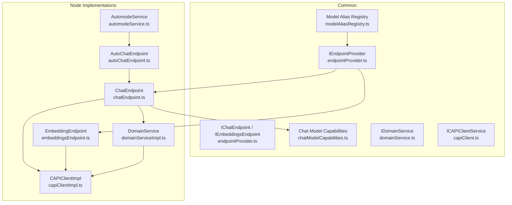
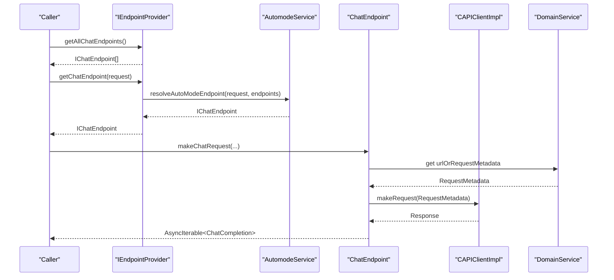
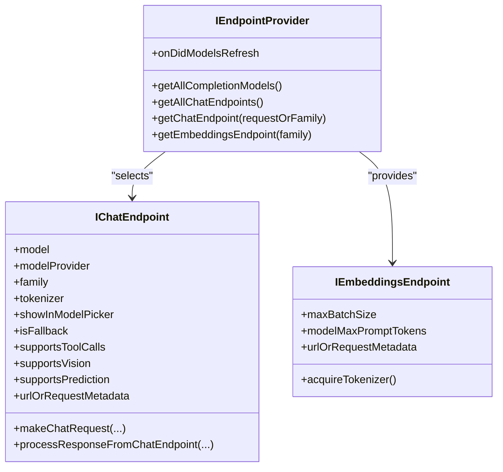
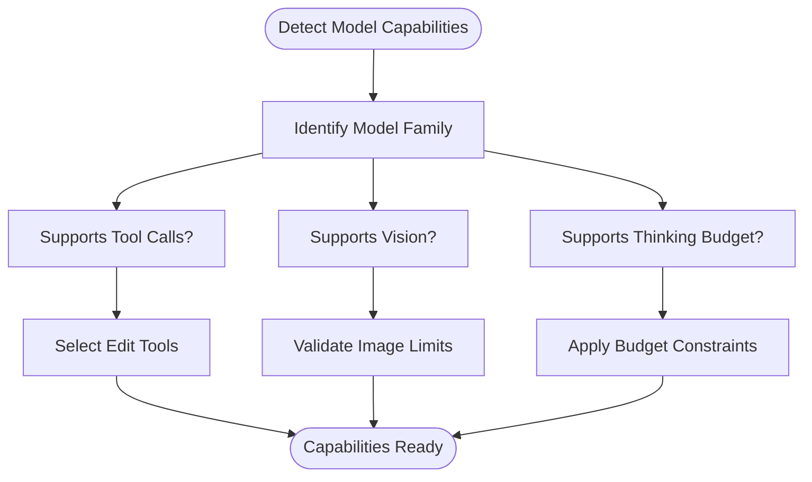
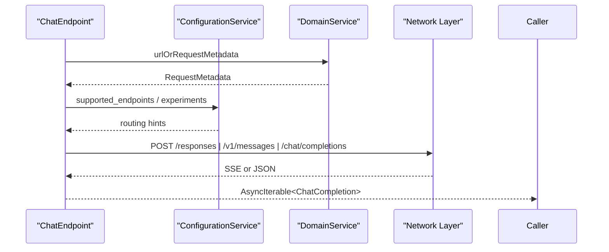
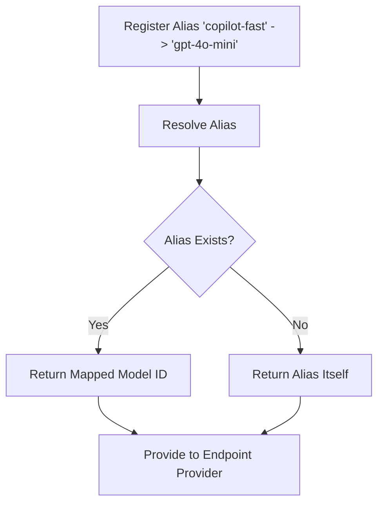
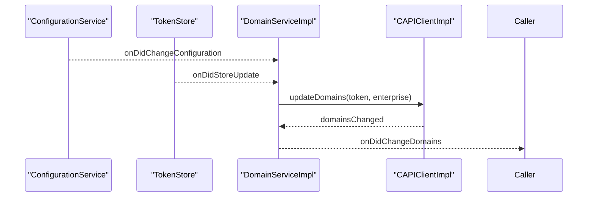
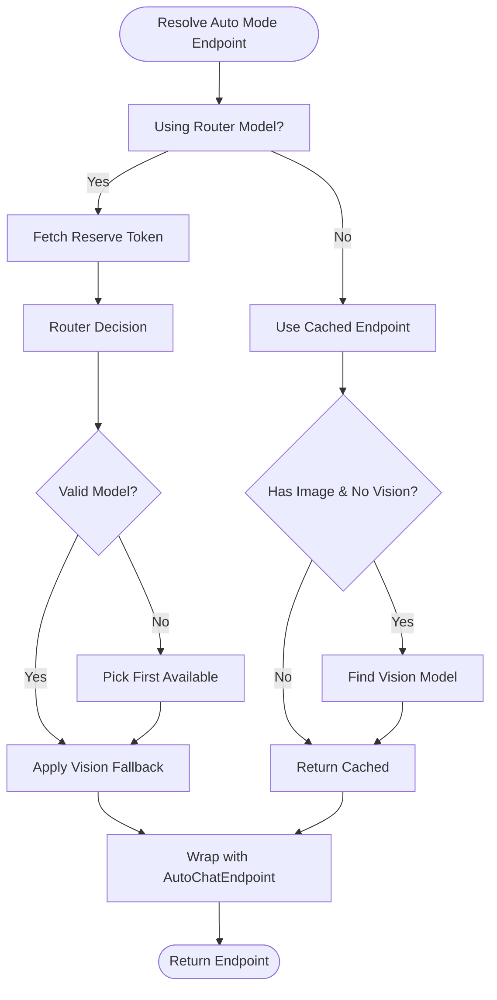
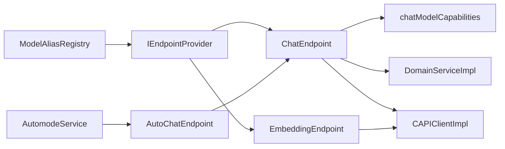

# Endpoint Provider Service

<cite>
**Referenced Files in This Document**
- [endpointProvider.ts](file://src/platform/endpoint/common/endpointProvider.ts)
- [endpointTypes.ts](file://src/platform/endpoint/common/endpointTypes.ts)
- [chatModelCapabilities.ts](file://src/platform/endpoint/common/chatModelCapabilities.ts)
- [modelAliasRegistry.ts](file://src/platform/endpoint/common/modelAliasRegistry.ts)
- [domainService.ts](file://src/platform/endpoint/common/domainService.ts)
- [capiClient.ts](file://src/platform/endpoint/common/capiClient.ts)
- [capiClientImpl.ts](file://src/platform/endpoint/node/capiClientImpl.ts)
- [chatEndpoint.ts](file://src/platform/endpoint/node/chatEndpoint.ts)
- [embeddingsEndpoint.ts](file://src/platform/endpoint/node/embeddingsEndpoint.ts)
- [domainServiceImpl.ts](file://src/platform/endpoint/node/domainServiceImpl.ts)
- [autoChatEndpoint.ts](file://src/platform/endpoint/node/autoChatEndpoint.ts)
- [automodeService.ts](file://src/platform/endpoint/node/automodeService.ts)
- [endpointProviderImpl.ts](file://src/extension/prompt/vscode-node/endpointProviderImpl.ts)
</cite>

## Table of Contents
1. [Introduction](#introduction)
2. [Project Structure](#project-structure)
3. [Core Components](#core-components)
4. [Architecture Overview](#architecture-overview)
5. [Detailed Component Analysis](#detailed-component-analysis)
6. [Dependency Analysis](#dependency-analysis)
7. [Performance Considerations](#performance-considerations)
8. [Troubleshooting Guide](#troubleshooting-guide)
9. [Conclusion](#conclusion)

## Introduction
This document explains the endpoint provider service architecture that abstracts AI model communications across providers such as OpenAI, Anthropic, and Google. It covers the endpoint provider interface, model capability detection, endpoint routing and selection, provider abstraction patterns, model alias registry, domain service coordination, and how the service enables pluggable AI model support. It also documents model capability negotiation, error handling for provider-specific issues, and the service’s role in load balancing and failover while maintaining consistent interfaces.

## Project Structure
The endpoint provider service spans common interfaces and provider-specific implementations:
- Common interfaces and types define the contract for model metadata, capabilities, and endpoint selection.
- Provider-specific endpoint implementations encapsulate differences in request/response formats, streaming, and provider-specific headers.
- Domain and capability services coordinate dynamic endpoint configuration and model availability.
- Auto mode routing selects optimal endpoints based on request characteristics and availability.

**Diagram sources**
- [endpointProvider.ts](file://src/platform/endpoint/common/endpointProvider.ts#L124-L156)
- [chatEndpoint.ts](file://src/platform/endpoint/node/chatEndpoint.ts#L114-L174)
- [embeddingsEndpoint.ts](file://src/platform/endpoint/node/embeddingsEndpoint.ts#L13-L37)
- [domainServiceImpl.ts](file://src/platform/endpoint/node/domainServiceImpl.ts#L17-L81)
- [capiClientImpl.ts](file://src/platform/endpoint/node/capiClientImpl.ts#L10-L22)
- [autoChatEndpoint.ts](file://src/platform/endpoint/node/autoChatEndpoint.ts#L28-L66)
- [automodeService.ts](file://src/platform/endpoint/node/automodeService.ts#L146-L186)
- [chatModelCapabilities.ts](file://src/platform/endpoint/common/chatModelCapabilities.ts#L1-L312)
- [modelAliasRegistry.ts](file://src/platform/endpoint/common/modelAliasRegistry.ts#L6-L48)
- [domainService.ts](file://src/platform/endpoint/common/domainService.ts#L23-L27)
- [capiClient.ts](file://src/platform/endpoint/common/capiClient.ts#L15-L51)

**Section sources**
- [endpointProvider.ts](file://src/platform/endpoint/common/endpointProvider.ts#L124-L156)
- [chatEndpoint.ts](file://src/platform/endpoint/node/chatEndpoint.ts#L114-L174)
- [embeddingsEndpoint.ts](file://src/platform/endpoint/node/embeddingsEndpoint.ts#L13-L37)
- [domainServiceImpl.ts](file://src/platform/endpoint/node/domainServiceImpl.ts#L17-L81)
- [capiClientImpl.ts](file://src/platform/endpoint/node/capiClientImpl.ts#L10-L22)
- [autoChatEndpoint.ts](file://src/platform/endpoint/node/autoChatEndpoint.ts#L28-L66)
- [automodeService.ts](file://src/platform/endpoint/node/automodeService.ts#L146-L186)
- [chatModelCapabilities.ts](file://src/platform/endpoint/common/chatModelCapabilities.ts#L1-L312)
- [modelAliasRegistry.ts](file://src/platform/endpoint/common/modelAliasRegistry.ts#L6-L48)
- [domainService.ts](file://src/platform/endpoint/common/domainService.ts#L23-L27)
- [capiClient.ts](file://src/platform/endpoint/common/capiClient.ts#L15-L51)

## Core Components
- Endpoint provider interface: Defines discovery and selection of chat and embedding endpoints, and emits model refresh events.
- Chat endpoint abstraction: Encapsulates provider-specific request construction, streaming/non-streaming response processing, and endpoint routing decisions.
- Embedding endpoint abstraction: Provides a uniform interface for embedding generation with batch sizing and tokenization.
- Capability detection: Centralizes model family detection and feature preferences (tool calls, vision, thinking, etc.).
- Domain service: Dynamically updates API endpoints and telemetry URLs based on configuration and authentication state.
- Auto mode routing: Selects optimal endpoints based on availability, provider affinity, and request characteristics (with optional router-driven selection).
- Model alias registry: Maps human-friendly aliases to model IDs for flexible configuration.

**Section sources**
- [endpointProvider.ts](file://src/platform/endpoint/common/endpointProvider.ts#L124-L156)
- [chatEndpoint.ts](file://src/platform/endpoint/node/chatEndpoint.ts#L114-L174)
- [embeddingsEndpoint.ts](file://src/platform/endpoint/node/embeddingsEndpoint.ts#L13-L37)
- [chatModelCapabilities.ts](file://src/platform/endpoint/common/chatModelCapabilities.ts#L1-L312)
- [domainService.ts](file://src/platform/endpoint/common/domainService.ts#L23-L27)
- [domainServiceImpl.ts](file://src/platform/endpoint/node/domainServiceImpl.ts#L17-L81)
- [automodeService.ts](file://src/platform/endpoint/node/automodeService.ts#L146-L186)
- [autoChatEndpoint.ts](file://src/platform/endpoint/node/autoChatEndpoint.ts#L28-L66)
- [modelAliasRegistry.ts](file://src/platform/endpoint/common/modelAliasRegistry.ts#L6-L48)

## Architecture Overview
The endpoint provider service separates concerns between discovery, selection, and execution:
- Discovery: The endpoint provider queries model metadata and capabilities.
- Selection: Routing logic chooses among available endpoints, considering request features (vision, tool calls) and provider availability.
- Execution: Provider-specific endpoints handle request shaping, streaming, and response parsing.
- Coordination: Domain and capability services update endpoints and feature flags dynamically.

**Diagram sources**
- [endpointProvider.ts](file://src/platform/endpoint/common/endpointProvider.ts#L133-L152)
- [automodeService.ts](file://src/platform/endpoint/node/automodeService.ts#L191-L203)
- [chatEndpoint.ts](file://src/platform/endpoint/node/chatEndpoint.ts#L396-L453)
- [capiClientImpl.ts](file://src/platform/endpoint/node/capiClientImpl.ts#L10-L22)
- [domainServiceImpl.ts](file://src/platform/endpoint/node/domainServiceImpl.ts#L45-L72)

## Detailed Component Analysis

### Endpoint Provider Interface and Abstractions
- IEndpointProvider defines model discovery and endpoint selection APIs, including chat endpoints retrieval, embeddings endpoint retrieval, and model refresh events.
- IChatEndpoint and IEmbeddingsEndpoint provide a unified interface for making requests and accessing metadata such as tokenizer, limits, and provider-specific flags.
- Model families and capabilities are represented by typed capability structures, enabling consistent negotiation across providers.

**Diagram sources**
- [endpointProvider.ts](file://src/platform/endpoint/common/endpointProvider.ts#L124-L156)

**Section sources**
- [endpointProvider.ts](file://src/platform/endpoint/common/endpointProvider.ts#L124-L156)

### Model Capability Detection System
- Capability detection centralizes model family checks and feature preferences (tool calls, vision, thinking budgets, etc.) to normalize provider differences.
- Functions classify models by family (e.g., GPT, Claude, Gemini) and derive behavior such as instruction placement, edit tool preferences, and image URL support.

**Diagram sources**
- [chatModelCapabilities.ts](file://src/platform/endpoint/common/chatModelCapabilities.ts#L118-L311)

**Section sources**
- [chatModelCapabilities.ts](file://src/platform/endpoint/common/chatModelCapabilities.ts#L1-L312)

### Endpoint Routing Mechanisms and Provider Abstraction
- ChatEndpoint encapsulates provider-specific logic:
  - Endpoint routing: Chooses between responses, messages, or chat-completions APIs based on model metadata and configuration.
  - Streaming vs non-streaming: Normalizes response processing across providers.
  - Body customization: Adapts request bodies for provider quirks (e.g., o1 special handling, Gemini function calling modes).
  - Headers: Adds provider-specific headers (e.g., anthropic-beta) and model provider preferences.
- EmbeddingEndpoint provides a consistent interface for embeddings with batch sizing and tokenizer acquisition.

**Diagram sources**
- [chatEndpoint.ts](file://src/platform/endpoint/node/chatEndpoint.ts#L237-L255)
- [chatEndpoint.ts](file://src/platform/endpoint/node/chatEndpoint.ts#L295-L315)
- [chatEndpoint.ts](file://src/platform/endpoint/node/chatEndpoint.ts#L372-L390)
- [domainServiceImpl.ts](file://src/platform/endpoint/node/domainServiceImpl.ts#L45-L72)

**Section sources**
- [chatEndpoint.ts](file://src/platform/endpoint/node/chatEndpoint.ts#L114-L174)
- [chatEndpoint.ts](file://src/platform/endpoint/node/chatEndpoint.ts#L237-L255)
- [chatEndpoint.ts](file://src/platform/endpoint/node/chatEndpoint.ts#L295-L315)
- [chatEndpoint.ts](file://src/platform/endpoint/node/chatEndpoint.ts#L372-L390)
- [embeddingsEndpoint.ts](file://src/platform/endpoint/node/embeddingsEndpoint.ts#L13-L37)

### Model Alias Registry Functionality
- The model alias registry maps human-friendly aliases (e.g., “copilot-fast”) to concrete model IDs, enabling flexible configuration and user-facing naming.
- It maintains bidirectional mappings and resolves aliases to underlying model IDs.

**Diagram sources**
- [modelAliasRegistry.ts](file://src/platform/endpoint/common/modelAliasRegistry.ts#L28-L47)

**Section sources**
- [modelAliasRegistry.ts](file://src/platform/endpoint/common/modelAliasRegistry.ts#L6-L48)

### Domain Service Coordination
- IDomainService exposes domain change events and coordinates updates to CAPI, proxy, telemetry, and origin tracker endpoints.
- DomainServiceImpl listens to configuration changes and authentication updates to refresh domain endpoints and notify subscribers.

**Diagram sources**
- [domainServiceImpl.ts](file://src/platform/endpoint/node/domainServiceImpl.ts#L35-L72)
- [domainService.ts](file://src/platform/endpoint/common/domainService.ts#L23-L27)
- [capiClientImpl.ts](file://src/platform/endpoint/node/capiClientImpl.ts#L10-L22)

**Section sources**
- [domainServiceImpl.ts](file://src/platform/endpoint/node/domainServiceImpl.ts#L17-L81)
- [domainService.ts](file://src/platform/endpoint/common/domainService.ts#L23-L27)
- [capiClientImpl.ts](file://src/platform/endpoint/node/capiClientImpl.ts#L10-L22)

### Auto Mode Routing and Failover
- AutomodeService selects endpoints using a double-buffer strategy and a global reserve token bank:
  - Router model path: Optionally uses a router decision fetcher to choose the best model based on prompt and availability.
  - Non-router path: Uses cached endpoints or reserve tokens, preferring same-provider models when session tokens change.
  - Vision fallback: Falls back to a vision-capable model when the request contains images but the selected model lacks vision support.
- AutoChatEndpoint wraps a selected endpoint and injects session tokens and billing multipliers.

**Diagram sources**
- [automodeService.ts](file://src/platform/endpoint/node/automodeService.ts#L191-L203)
- [automodeService.ts](file://src/platform/endpoint/node/automodeService.ts#L209-L297)
- [automodeService.ts](file://src/platform/endpoint/node/automodeService.ts#L302-L351)
- [automodeService.ts](file://src/platform/endpoint/node/automodeService.ts#L384-L397)
- [autoChatEndpoint.ts](file://src/platform/endpoint/node/autoChatEndpoint.ts#L69-L125)

**Section sources**
- [automodeService.ts](file://src/platform/endpoint/node/automodeService.ts#L146-L186)
- [automodeService.ts](file://src/platform/endpoint/node/automodeService.ts#L191-L203)
- [automodeService.ts](file://src/platform/endpoint/node/automodeService.ts#L209-L297)
- [automodeService.ts](file://src/platform/endpoint/node/automodeService.ts#L302-L351)
- [automodeService.ts](file://src/platform/endpoint/node/automodeService.ts#L384-L397)
- [autoChatEndpoint.ts](file://src/platform/endpoint/node/autoChatEndpoint.ts#L28-L66)
- [autoChatEndpoint.ts](file://src/platform/endpoint/node/autoChatEndpoint.ts#L69-L125)

### Provider Abstraction Patterns
- Provider-specific endpoint implementations encapsulate differences in:
  - Request body construction and normalization.
  - Streaming and non-streaming response processing.
  - Header injection for provider-specific features.
- Capability detection functions ensure consistent behavior regardless of provider.

**Section sources**
- [chatEndpoint.ts](file://src/platform/endpoint/node/chatEndpoint.ts#L237-L255)
- [chatEndpoint.ts](file://src/platform/endpoint/node/chatEndpoint.ts#L295-L315)
- [chatEndpoint.ts](file://src/platform/endpoint/node/chatEndpoint.ts#L372-L390)
- [chatModelCapabilities.ts](file://src/platform/endpoint/common/chatModelCapabilities.ts#L118-L311)

### Examples of Endpoint Provider Implementation and Model Capability Negotiation
- Example path for selecting a chat endpoint:
  - Discover endpoints via IEndpointProvider.getAllChatEndpoints().
  - Resolve a specific endpoint via IEndpointProvider.getChatEndpoint(requestOrFamily).
  - AutomodeService.resolveAutoModeEndpoint(request, endpoints) selects the best endpoint considering availability and request features.
- Example path for capability negotiation:
  - Use chatModelCapabilities to determine tool-call support, vision support, and thinking budget applicability.
  - ChatEndpoint interceptBody removes unsupported features and adapts request bodies accordingly.

**Section sources**
- [endpointProvider.ts](file://src/platform/endpoint/common/endpointProvider.ts#L133-L152)
- [automodeService.ts](file://src/platform/endpoint/node/automodeService.ts#L191-L203)
- [chatModelCapabilities.ts](file://src/platform/endpoint/common/chatModelCapabilities.ts#L118-L311)
- [chatEndpoint.ts](file://src/platform/endpoint/node/chatEndpoint.ts#L266-L293)

### Error Handling for Provider-Specific Issues
- Vision limit enforcement: ChatEndpoint validates image counts against model limits and throws descriptive errors when exceeded.
- WebSocket state handling: ChatEndpoint retries requests with stateful marker ignored when invalid markers are detected.
- Router fallback telemetry: AutomodeService emits telemetry when router-based routing fails and falls back to reserve tokens.

**Section sources**
- [chatEndpoint.ts](file://src/platform/endpoint/node/chatEndpoint.ts#L296-L303)
- [chatEndpoint.ts](file://src/platform/endpoint/node/chatEndpoint.ts#L414-L421)
- [automodeService.ts](file://src/platform/endpoint/node/automodeService.ts#L264-L284)

## Dependency Analysis
The endpoint provider service exhibits strong separation of concerns:
- Common interfaces decouple consumers from provider specifics.
- Node implementations encapsulate provider differences.
- Domain and capability services provide dynamic configuration and feature flags.
- Auto mode service orchestrates routing and failover.

**Diagram sources**
- [endpointProvider.ts](file://src/platform/endpoint/common/endpointProvider.ts#L124-L156)
- [chatEndpoint.ts](file://src/platform/endpoint/node/chatEndpoint.ts#L114-L174)
- [embeddingsEndpoint.ts](file://src/platform/endpoint/node/embeddingsEndpoint.ts#L13-L37)
- [chatModelCapabilities.ts](file://src/platform/endpoint/common/chatModelCapabilities.ts#L1-L312)
- [domainServiceImpl.ts](file://src/platform/endpoint/node/domainServiceImpl.ts#L17-L81)
- [capiClientImpl.ts](file://src/platform/endpoint/node/capiClientImpl.ts#L10-L22)
- [autoChatEndpoint.ts](file://src/platform/endpoint/node/autoChatEndpoint.ts#L28-L66)
- [automodeService.ts](file://src/platform/endpoint/node/automodeService.ts#L146-L186)
- [modelAliasRegistry.ts](file://src/platform/endpoint/common/modelAliasRegistry.ts#L6-L48)

**Section sources**
- [endpointProvider.ts](file://src/platform/endpoint/common/endpointProvider.ts#L124-L156)
- [chatEndpoint.ts](file://src/platform/endpoint/node/chatEndpoint.ts#L114-L174)
- [embeddingsEndpoint.ts](file://src/platform/endpoint/node/embeddingsEndpoint.ts#L13-L37)
- [chatModelCapabilities.ts](file://src/platform/endpoint/common/chatModelCapabilities.ts#L1-L312)
- [domainServiceImpl.ts](file://src/platform/endpoint/node/domainServiceImpl.ts#L17-L81)
- [capiClientImpl.ts](file://src/platform/endpoint/node/capiClientImpl.ts#L10-L22)
- [autoChatEndpoint.ts](file://src/platform/endpoint/node/autoChatEndpoint.ts#L28-L66)
- [automodeService.ts](file://src/platform/endpoint/node/automodeService.ts#L146-L186)
- [modelAliasRegistry.ts](file://src/platform/endpoint/common/modelAliasRegistry.ts#L6-L48)

## Performance Considerations
- Streaming-first design: Prefer streaming responses when supported to reduce latency and improve responsiveness.
- Endpoint caching: Reuse endpoints across requests within a conversation to minimize repeated selection overhead.
- Vision fallback: Detect image presence early and pre-select a vision-capable model to avoid retry loops.
- Router model path: Experimental router-based selection should be gated behind configuration to avoid unnecessary latency in inline chat.

## Troubleshooting Guide
- Vision limit exceeded: If a request exceeds the model’s image limit, ChatEndpoint throws an error. Reduce image count or switch to a vision-capable model.
- Invalid stateful marker: If a WebSocket response indicates an invalid stateful marker, the endpoint retries with marker ignored.
- Router fallback: When router-based routing fails, AutomodeService falls back to reserve tokens and emits telemetry for diagnostics.
- Domain changes: If endpoints appear unreachable, verify domain updates via DomainServiceImpl and ensure authentication tokens are current.

**Section sources**
- [chatEndpoint.ts](file://src/platform/endpoint/node/chatEndpoint.ts#L296-L303)
- [chatEndpoint.ts](file://src/platform/endpoint/node/chatEndpoint.ts#L414-L421)
- [automodeService.ts](file://src/platform/endpoint/node/automodeService.ts#L264-L284)
- [domainServiceImpl.ts](file://src/platform/endpoint/node/domainServiceImpl.ts#L45-L72)

## Conclusion
The endpoint provider service delivers a robust, pluggable abstraction for AI model communications across providers. By centralizing capability detection, routing, and provider-specific adaptations, it ensures consistent interfaces while accommodating provider differences. Dynamic domain updates, model aliasing, and intelligent auto mode routing further enhance reliability and flexibility. The architecture supports scalable enhancements for new providers and evolving model capabilities.