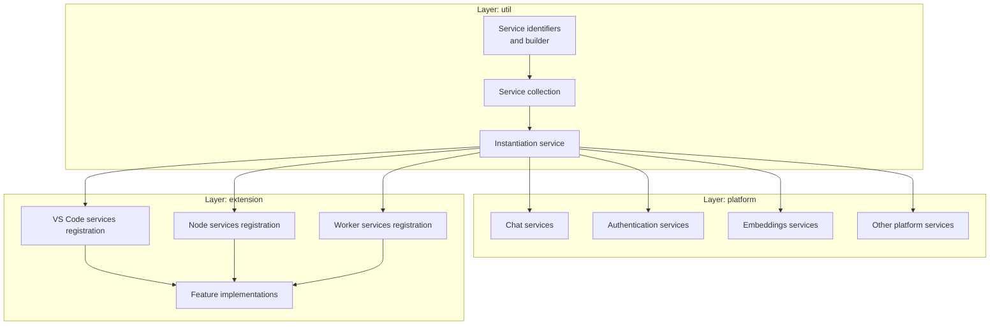
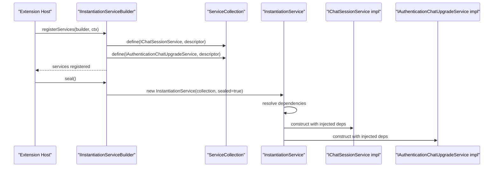
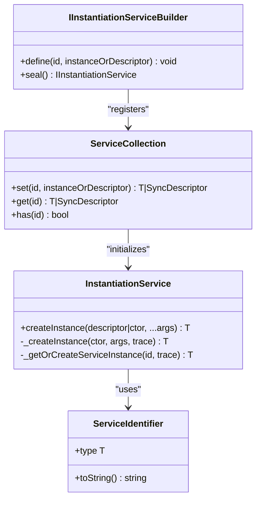
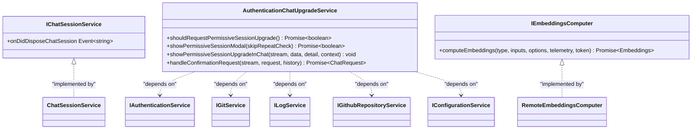
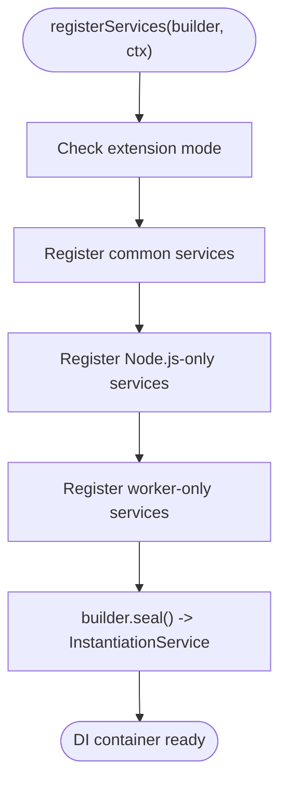
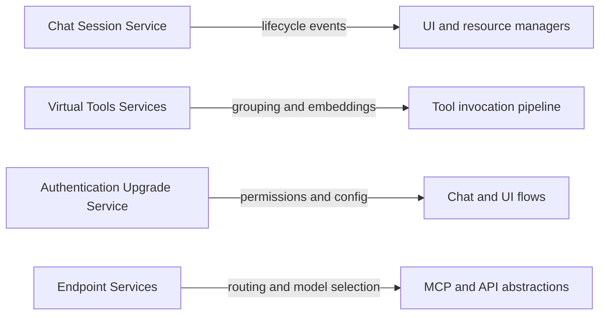
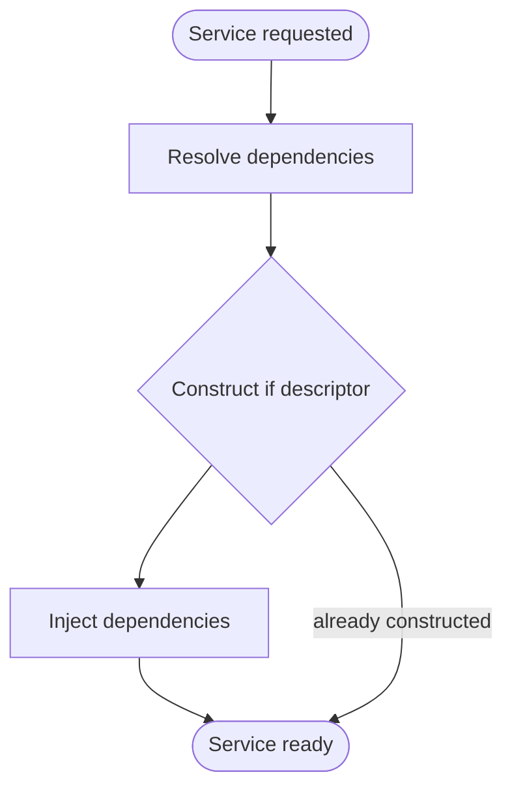
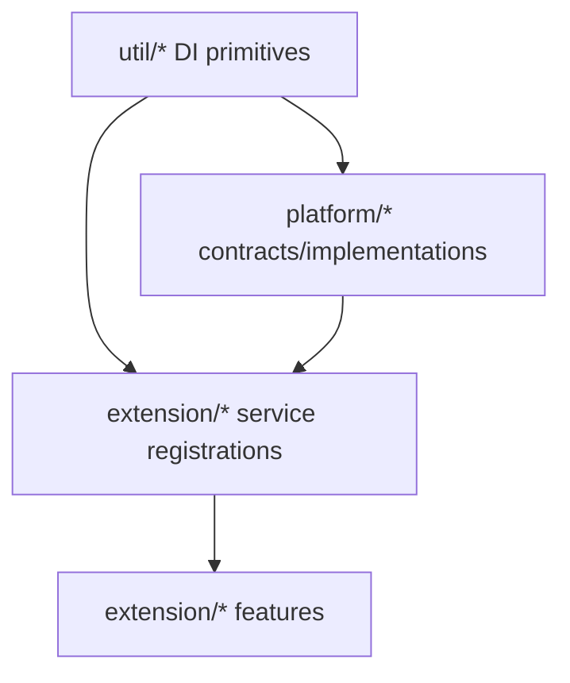

# Service Layer Architecture

<cite>
**Referenced Files in This Document**
- [services.ts](file://src/extension/extension/vscode/services.ts)
- [services.ts](file://src/extension/extension/vscode-node/services.ts)
- [services.ts](file://src/extension/extension/vscode-worker/services.ts)
- [services.ts](file://src/platform/test/node/services.ts)
- [services.ts](file://src/util/common/services.ts)
- [serviceCollection.ts](file://src/util/vs/platform/instantiation/common/serviceCollection.ts)
- [instantiationService.ts](file://src/util/vs/platform/instantiation/common/instantiationService.ts)
- [instantiation.ts](file://src/util/vs/platform/instantiation/common/instantiation.ts)
- [chatSessionService.ts](file://src/platform/chat/common/chatSessionService.ts)
- [authenticationUpgradeService.ts](file://src/platform/authentication/common/authenticationUpgradeService.ts)
- [embeddingsComputer.ts](file://src/platform/embeddings/common/embeddingsComputer.ts)
- [CONTRIBUTING.md](file://CONTRIBUTING.md)
- [.github/copilot-instructions.md](file://.github/copilot-instructions.md)
</cite>

## Table of Contents
1. [Introduction](#introduction)
2. [Project Structure](#project-structure)
3. [Core Components](#core-components)
4. [Architecture Overview](#architecture-overview)
5. [Detailed Component Analysis](#detailed-component-analysis)
6. [Dependency Analysis](#dependency-analysis)
7. [Performance Considerations](#performance-considerations)
8. [Troubleshooting Guide](#troubleshooting-guide)
9. [Conclusion](#conclusion)

## Introduction
This document explains the service layer architecture of VSCode Copilot Chat, focusing on how platform services and extension services are separated, registered, and composed through a dependency injection framework. It details the service contracts for chat sessions, tools, authentication, and endpoint management, and demonstrates how the architecture enables pluggability, testing, and maintainability through clear separation of concerns.

## Project Structure
The repository organizes code into layers and logical domains:
- util: Cross-cutting utilities and DI infrastructure
- platform: Platform services used by extensions (e.g., chat, authentication, embeddings)
- extension: Feature-rich implementation that consumes platform services and contributes VS Code integrations
- test: Tests that can import from base/ but not extension/

**Diagram sources**
- [CONTRIBUTING.md](file://CONTRIBUTING.md#L200-L228)
- [services.ts](file://src/extension/extension/vscode/services.ts#L105-L179)
- [services.ts](file://src/extension/extension/vscode-node/services.ts#L140-L151)
- [services.ts](file://src/extension/extension/vscode-worker/services.ts#L10-L20)

**Section sources**
- [CONTRIBUTING.md](file://CONTRIBUTING.md#L200-L228)

## Core Components
- Service identifiers and builder: Utilities define typed service identifiers and a builder that registers services into a sealed instantiation service.
- Service collection: A registry mapping service identifiers to instances or descriptors.
- Instantiation service: Creates services, resolves dependencies, and prevents cycles during construction.
- Platform services: Abstractions and implementations for chat, authentication, embeddings, and other cross-cutting capabilities.
- Extension service registrations: Bind platform abstractions to concrete implementations for VS Code, Node.js, and web worker hosts.

Key responsibilities:
- Separation between platform (common) and extension (VS Code-specific) layers
- Centralized registration and lifecycle management via DI
- Stable contracts enabling swapping implementations without changing consumers

**Section sources**
- [services.ts](file://src/util/common/services.ts#L13-L44)
- [serviceCollection.ts](file://src/util/vs/platform/instantiation/common/serviceCollection.ts#L11-L35)
- [instantiationService.ts](file://src/util/vs/platform/instantiation/common/instantiationService.ts#L118-L292)
- [instantiation.ts](file://src/util/vs/platform/instantiation/common/instantiation.ts#L93-L132)

## Architecture Overview
The service layer follows a layered architecture:
- util provides DI primitives and service identifiers
- platform defines contracts and common implementations
- extension binds platform contracts to VS Code-specific implementations and registers them for different execution contexts

**Diagram sources**
- [services.ts](file://src/extension/extension/vscode/services.ts#L113-L179)
- [services.ts](file://src/util/common/services.ts#L20-L44)
- [serviceCollection.ts](file://src/util/vs/platform/instantiation/common/serviceCollection.ts#L11-L35)
- [instantiationService.ts](file://src/util/vs/platform/instantiation/common/instantiationService.ts#L186-L282)

## Detailed Component Analysis

### Service Registration Patterns and Dependency Injection
- Service identifiers are created via a decorator that captures dependency metadata for constructor injection.
- The builder pattern registers services into a sealed collection, preventing further modifications after sealing.
- The instantiation service lazily constructs services, resolving dependencies and avoiding cycles.

**Diagram sources**
- [instantiation.ts](file://src/util/vs/platform/instantiation/common/instantiation.ts#L93-L132)
- [services.ts](file://src/util/common/services.ts#L13-L44)
- [serviceCollection.ts](file://src/util/vs/platform/instantiation/common/serviceCollection.ts#L11-L35)
- [instantiationService.ts](file://src/util/vs/platform/instantiation/common/instantiationService.ts#L118-L292)

**Section sources**
- [instantiation.ts](file://src/util/vs/platform/instantiation/common/instantiation.ts#L93-L132)
- [services.ts](file://src/util/common/services.ts#L13-L44)
- [serviceCollection.ts](file://src/util/vs/platform/instantiation/common/serviceCollection.ts#L11-L35)
- [instantiationService.ts](file://src/util/vs/platform/instantiation/common/instantiationService.ts#L118-L292)

### Platform Services: Contracts and Implementations
- Chat session service: Defines a contract for chat session lifecycle events.
- Authentication upgrade service: Manages permissive session upgrades and integrates with configuration and logging.
- Embeddings computer: Provides a contract for computing and ranking embeddings.

**Diagram sources**
- [chatSessionService.ts](file://src/platform/chat/common/chatSessionService.ts#L9-L15)
- [authenticationUpgradeService.ts](file://src/platform/authentication/common/authenticationUpgradeService.ts#L21-L223)
- [embeddingsComputer.ts](file://src/platform/embeddings/common/embeddingsComputer.ts#L107-L133)

**Section sources**
- [chatSessionService.ts](file://src/platform/chat/common/chatSessionService.ts#L9-L15)
- [authenticationUpgradeService.ts](file://src/platform/authentication/common/authenticationUpgradeService.ts#L21-L223)
- [embeddingsComputer.ts](file://src/platform/embeddings/common/embeddingsComputer.ts#L107-L133)

### Extension Service Registration: Platform vs Extension
- VS Code services registration: Centralizes service bindings for the VS Code extension host, including chat, configuration, dialogs, telemetry, and more.
- Node services registration: Extends the common set with Node.js-specific services.
- Worker services registration: Reuses the common registration for web worker contexts.

**Diagram sources**
- [services.ts](file://src/extension/extension/vscode/services.ts#L113-L179)
- [services.ts](file://src/extension/extension/vscode-node/services.ts#L140-L151)
- [services.ts](file://src/extension/extension/vscode-worker/services.ts#L18-L20)

**Section sources**
- [services.ts](file://src/extension/extension/vscode/services.ts#L113-L179)
- [services.ts](file://src/extension/extension/vscode-node/services.ts#L140-L151)
- [services.ts](file://src/extension/extension/vscode-worker/services.ts#L18-L20)

### Service Contracts: Chat Sessions, Tools, Authentication, Endpoint Management
- Chat sessions: Consumers subscribe to disposal events to manage resources and UI state.
- Tools: Virtual tools and grouping services enable tool discovery and embeddings computation.
- Authentication: Upgrade service coordinates permissive session requests and integrates with configuration and logging.
- Endpoint management: Platform endpoint services route model selection and integrate with MCP and API abstractions.

**Diagram sources**
- [chatSessionService.ts](file://src/platform/chat/common/chatSessionService.ts#L9-L15)
- [authenticationUpgradeService.ts](file://src/platform/authentication/common/authenticationUpgradeService.ts#L21-L223)
- [.github/copilot-instructions.md](file://.github/copilot-instructions.md#L324-L345)

**Section sources**
- [chatSessionService.ts](file://src/platform/chat/common/chatSessionService.ts#L9-L15)
- [authenticationUpgradeService.ts](file://src/platform/authentication/common/authenticationUpgradeService.ts#L21-L223)
- [.github/copilot-instructions.md](file://.github/copilot-instructions.md#L324-L345)

### Implementation Patterns and Error Handling Strategies
- Constructor injection: Services declare dependencies via decorators; instantiation service resolves them automatically.
- Lazy instantiation: Services are constructed only when needed, reducing startup overhead.
- Cycle detection: The instantiation service tracks active instantiations to prevent recursive construction.
- Graceful fallbacks: Some services conditionally register null or stub implementations in specific modes (e.g., tests).

**Diagram sources**
- [instantiationService.ts](file://src/util/vs/platform/instantiation/common/instantiationService.ts#L186-L282)
- [serviceCollection.ts](file://src/util/vs/platform/instantiation/common/serviceCollection.ts#L11-L35)

**Section sources**
- [instantiationService.ts](file://src/util/vs/platform/instantiation/common/instantiationService.ts#L186-L282)
- [serviceCollection.ts](file://src/util/vs/platform/instantiation/common/serviceCollection.ts#L11-L35)

### Relationship Between Services and Platform Implementations
- Platform abstractions live in platform/*/common and are implemented in platform/*/vscode or platform/*/node.
- Extension registrations bind these abstractions to concrete implementations for VS Code, Node.js, and web workers.
- This ensures that feature code in extension/ remains agnostic of platform specifics while still leveraging platform capabilities.

**Section sources**
- [services.ts](file://src/extension/extension/vscode/services.ts#L113-L179)
- [CONTRIBUTING.md](file://CONTRIBUTING.md#L200-L228)

## Dependency Analysis
The service layer exhibits low coupling and high cohesion:
- util provides DI primitives consumed by both platform and extension layers
- platform defines contracts and common logic
- extension composes platform services into concrete implementations for different hosts

**Diagram sources**
- [services.ts](file://src/util/common/services.ts#L13-L44)
- [services.ts](file://src/extension/extension/vscode/services.ts#L113-L179)
- [CONTRIBUTING.md](file://CONTRIBUTING.md#L200-L228)

**Section sources**
- [services.ts](file://src/util/common/services.ts#L13-L44)
- [services.ts](file://src/extension/extension/vscode/services.ts#L113-L179)
- [CONTRIBUTING.md](file://CONTRIBUTING.md#L200-L228)

## Performance Considerations
- Lazy instantiation reduces cold-start costs by constructing services only when needed.
- Sealed builders prevent accidental reconfiguration and improve predictability.
- Embedding computations and ranking utilities are designed for efficient vector operations and optional filtering thresholds.

[No sources needed since this section provides general guidance]

## Troubleshooting Guide
- Unknown service dependency errors indicate missing registration or incorrect service identifier usage.
- Recursive instantiation errors suggest circular dependencies among services; review constructor dependencies.
- Test mode behavior: Certain services may switch to null/stub implementations depending on extension mode and automation flags.

**Section sources**
- [instantiationService.ts](file://src/util/vs/platform/instantiation/common/instantiationService.ts#L142-L147)
- [services.ts](file://src/extension/extension/vscode/services.ts#L113-L179)

## Conclusion
The service layer architecture cleanly separates platform abstractions from extension implementations, enabling pluggability, testability, and maintainability. Through a robust DI framework, services are registered centrally, resolved lazily, and composed consistently across VS Code, Node.js, and web worker environments. The documented contracts and patterns provide a foundation for extending chat sessions, tools, authentication, and endpoint management while preserving separation of concerns.