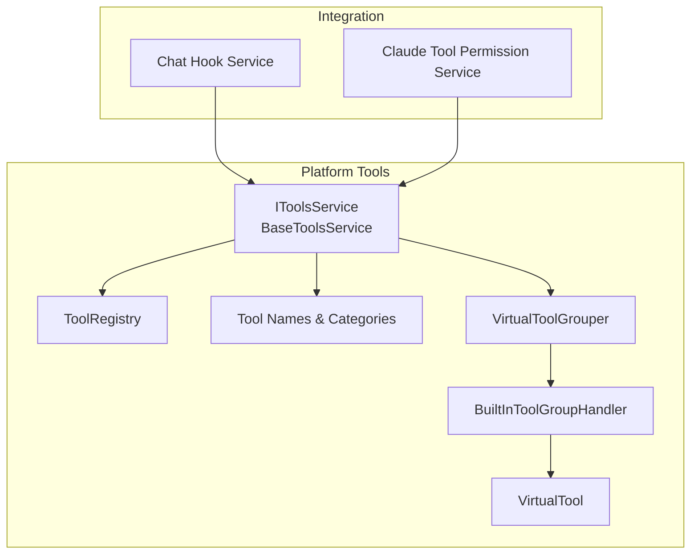
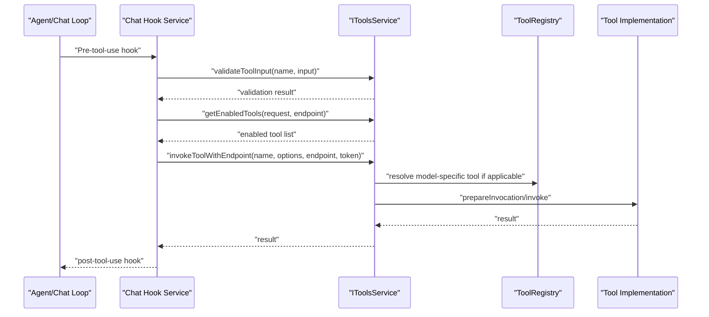
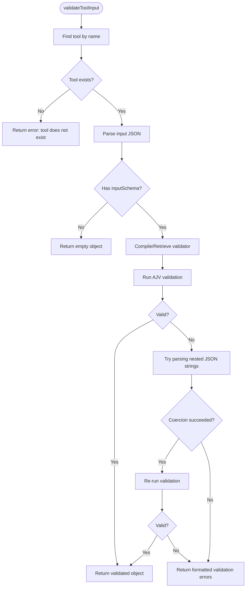
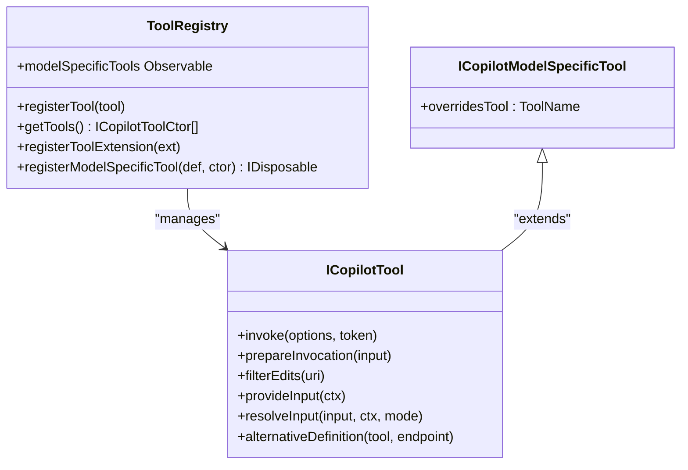
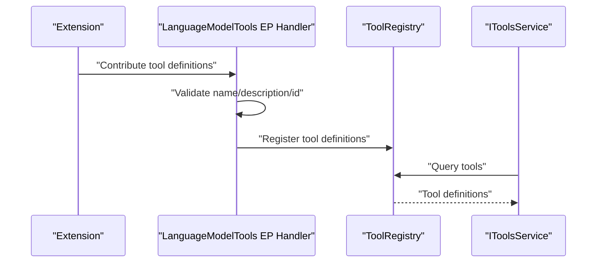
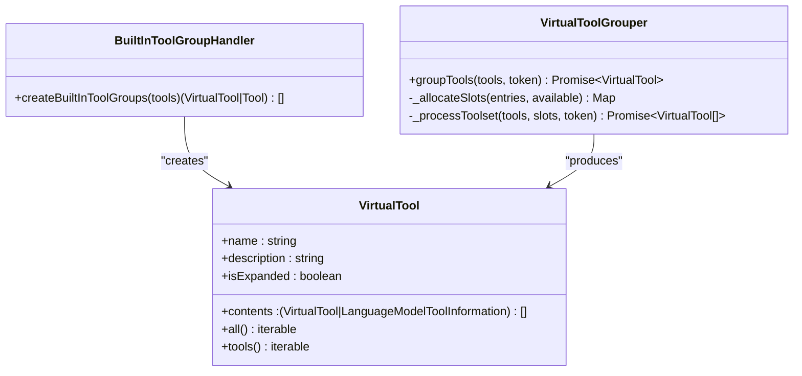
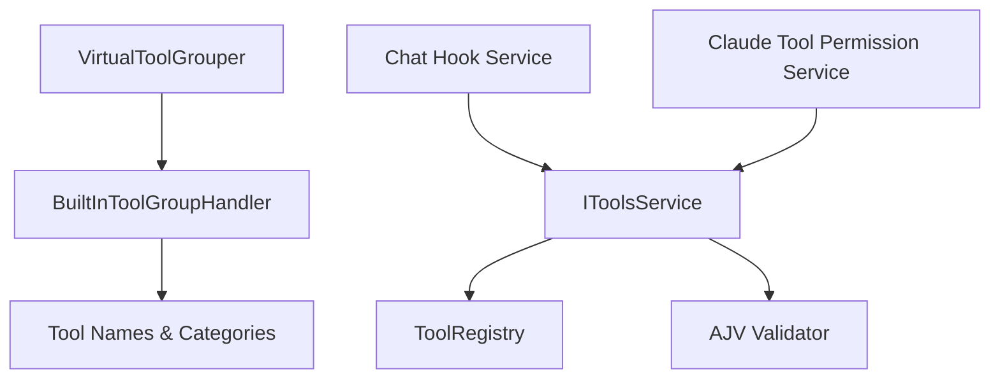

# Tools Service

<cite>
**Referenced Files in This Document**
- [toolsService.ts](file://src/extension/tools/common/toolsService.ts)
- [toolsRegistry.ts](file://src/extension/tools/common/toolsRegistry.ts)
- [toolNames.ts](file://src/extension/tools/common/toolNames.ts)
- [tools.md](file://docs/tools.md)
- [virtualToolGrouper.ts](file://src/extension/tools/common/virtualTools/virtualToolGrouper.ts)
- [builtInToolGroupHandler.ts](file://src/extension/tools/common/virtualTools/builtInToolGroupHandler.ts)
- [virtualTool.ts](file://src/extension/tools/common/virtualTools/virtualTool.ts)
- [toolService.spec.ts](file://src/extension/tools/common/test/toolService.spec.ts)
- [testToolsService.ts](file://src/extension/agents/node/test/testToolsService.ts)
- [languageModelToolsContribution.ts](file://test/simulation/fixtures/edits/issue-7202/languageModelToolsContribution.ts)
- [chatHookService.ts](file://src/extension/chat/vscode-node/chatHookService.ts)
- [claudeToolPermissionService.ts](file://src/extension/chatSessions/claude/common/claudeToolPermissionService.ts)
- [claudeToolPermission.ts](file://src/extension/chatSessions/claude/common/claudeToolPermission.ts)
</cite>

## Table of Contents
1. [Introduction](#introduction)
2. [Project Structure](#project-structure)
3. [Core Components](#core-components)
4. [Architecture Overview](#architecture-overview)
5. [Detailed Component Analysis](#detailed-component-analysis)
6. [Dependency Analysis](#dependency-analysis)
7. [Performance Considerations](#performance-considerations)
8. [Troubleshooting Guide](#troubleshooting-guide)
9. [Conclusion](#conclusion)
10. [Appendices](#appendices)

## Introduction
This document describes the tools service architecture within the platform layer of the VSCode Copilot Chat ecosystem. It explains how tools are registered, discovered, validated, invoked, and managed during chat sessions and agent workflows. It covers the tools registry pattern, dynamic loading, execution pipeline, parameter validation, result processing, security and confirmation mechanisms, and the relationship between platform tools and extension-specific tool implementations.

## Project Structure
The tools service spans several modules:
- Platform-level tool service interface and base implementation
- Tool registry for registration and model-specific overrides
- Tool naming and categorization for grouping and selection
- Virtual tools subsystem for grouping and presentation
- Integration points with chat hooks and session permissions

**Diagram sources**
- [toolsService.ts](file://src/extension/tools/common/toolsService.ts#L48-L100)
- [toolsRegistry.ts](file://src/extension/tools/common/toolsRegistry.ts#L105-L143)
- [toolNames.ts](file://src/extension/tools/common/toolNames.ts#L21-L246)
- [virtualToolGrouper.ts](file://src/extension/tools/common/virtualTools/virtualToolGrouper.ts#L108-L130)
- [builtInToolGroupHandler.ts](file://src/extension/tools/common/virtualTools/builtInToolGroupHandler.ts#L42-L85)
- [virtualTool.ts](file://src/extension/tools/common/virtualTools/virtualTool.ts#L90-L124)
- [chatHookService.ts](file://src/extension/chat/vscode-node/chatHookService.ts#L18-L40)
- [claudeToolPermissionService.ts](file://src/extension/chatSessions/claude/common/claudeToolPermissionService.ts#L44-L51)

**Section sources**
- [toolsService.ts](file://src/extension/tools/common/toolsService.ts#L1-L284)
- [toolsRegistry.ts](file://src/extension/tools/common/toolsRegistry.ts#L1-L165)
- [toolNames.ts](file://src/extension/tools/common/toolNames.ts#L1-L246)

## Core Components
- Tools Service Interface and Base Implementation
  - Defines the contract for tool discovery, validation, invocation, and model-specific tool observability.
  - Provides event emission for pre-invocation hooks and caches compiled JSON schemas for validation performance.
- Tool Registry
  - Central registry for built-in tools, extension-provided tool behaviors, and model-specific tool overrides.
  - Supports runtime registration of model-specific tools and filtering by endpoint/model families.
- Tool Names and Categories
  - Enumerations and mappings for tool identity and categorization.
  - Enables grouping of related tools into virtual groups while keeping core tools ungrouped.
- Virtual Tools Subsystem
  - Groups tools into collapsible virtual groups and manages expansion, deduplication, and limits.
  - Applies clustering and slot allocation for extension/MCP tools.

**Section sources**
- [toolsService.ts](file://src/extension/tools/common/toolsService.ts#L48-L100)
- [toolsService.ts](file://src/extension/tools/common/toolsService.ts#L175-L255)
- [toolsRegistry.ts](file://src/extension/tools/common/toolsRegistry.ts#L105-L143)
- [toolNames.ts](file://src/extension/tools/common/toolNames.ts#L21-L246)
- [virtualToolGrouper.ts](file://src/extension/tools/common/virtualTools/virtualToolGrouper.ts#L108-L130)
- [builtInToolGroupHandler.ts](file://src/extension/tools/common/virtualTools/builtInToolGroupHandler.ts#L42-L85)

## Architecture Overview
The tools service architecture integrates with chat sessions and agents through a layered design:
- Tool Discovery: Tools are represented as LanguageModelToolInformation and can be contributed by extensions or provided by the platform.
- Tool Registration: Built-in tools and extension behaviors are registered via the ToolRegistry; model-specific tools can be registered at runtime.
- Tool Invocation: The Tools Service validates inputs, selects the appropriate tool implementation, and executes it, emitting pre-invocation events.
- Virtual Grouping: Tools are grouped into virtual groups for discoverability while preserving core tools’ visibility.
- Session Permissions: Session-specific permission handlers coordinate tool confirmations and restrictions.

**Diagram sources**
- [chatHookService.ts](file://src/extension/chat/vscode-node/chatHookService.ts#L18-L40)
- [toolsService.ts](file://src/extension/tools/common/toolsService.ts#L74-L100)
- [toolsRegistry.ts](file://src/extension/tools/common/toolsRegistry.ts#L126-L143)

## Detailed Component Analysis

### Tools Service Interface and Validation Pipeline
- Responsibilities
  - Expose tool metadata, copilot tool implementations, and model-specific tool observables.
  - Validate tool inputs using JSON Schema with AJV, including coercion and nested JSON string handling.
  - Select and invoke tools with endpoint-aware overrides.
  - Emit pre-invocation events for integrations.
- Validation Logic
  - Parses input JSON and compiles/validates against the tool’s input schema.
  - Handles nested JSON strings by attempting to parse and retry validation.
  - Caches compiled validators to reduce overhead.
- Invocation
  - Provides both generic and endpoint-aware invocation methods.
  - Emits onWillInvokeTool for integrations to observe or intercept.

**Diagram sources**
- [toolsService.ts](file://src/extension/tools/common/toolsService.ts#L210-L247)

**Section sources**
- [toolsService.ts](file://src/extension/tools/common/toolsService.ts#L48-L100)
- [toolsService.ts](file://src/extension/tools/common/toolsService.ts#L175-L255)
- [toolsService.spec.ts](file://src/extension/tools/common/test/toolService.spec.ts#L1-L26)

### Tool Registry Pattern and Model-Specific Overrides
- Registration
  - Built-in tools: register via ToolRegistry.registerTool.
  - Extensions: register tool behaviors via ToolRegistry.registerToolExtension.
  - Model-specific tools: register via ToolRegistry.registerModelSpecificTool with model selectors.
- Resolution
  - Endpoint-aware selection uses modelSpecificToolApplies to filter compatible model-specific tools.
- Lifecycle
  - Model-specific registrations are observable and can be disposed.

**Diagram sources**
- [toolsRegistry.ts](file://src/extension/tools/common/toolsRegistry.ts#L105-L143)
- [toolsRegistry.ts](file://src/extension/tools/common/toolsRegistry.ts#L70-L85)

**Section sources**
- [toolsRegistry.ts](file://src/extension/tools/common/toolsRegistry.ts#L105-L143)
- [toolsRegistry.ts](file://src/extension/tools/common/toolsRegistry.ts#L145-L165)

### Tool Discovery and Extension Contributions
- Discovery
  - Tools are exposed as LanguageModelToolInformation and can be contributed by extensions.
  - The platform maintains a registry of tools and supports model-specific overrides.
- Extension Point Handling
  - Extensions contribute tools via a workbench extension point handler that validates and logs invalid contributions.
- Tool Naming and Reference Names
  - ToolName and ContributedToolName enums define canonical and user-facing names.
  - Utilities map between contributed and canonical names for descriptions and schemas.

**Diagram sources**
- [languageModelToolsContribution.ts](file://test/simulation/fixtures/edits/issue-7202/languageModelToolsContribution.ts#L100-L120)
- [toolsRegistry.ts](file://src/extension/tools/common/toolsRegistry.ts#L105-L143)
- [toolNames.ts](file://src/extension/tools/common/toolNames.ts#L130-L148)

**Section sources**
- [languageModelToolsContribution.ts](file://test/simulation/fixtures/edits/issue-7202/languageModelToolsContribution.ts#L100-L120)
- [toolNames.ts](file://src/extension/tools/common/toolNames.ts#L130-L148)

### Virtual Tools Grouping and Presentation
- Grouping Strategy
  - Built-in tools are grouped by category except for “Core” tools, which remain individual.
  - VirtualTool nodes can expand to reveal contained tools or collapse to summarize.
- Slot Allocation and Limits
  - VirtualToolGrouper allocates slots proportionally among toolsets and applies limits to avoid overwhelming the UI.
  - Deduplication ensures consistent presentation across groups.
- Embeddings and Clustering
  - Tool embeddings are computed and clustered to form groups; tuning adjusts thresholds and cluster counts.

**Diagram sources**
- [virtualTool.ts](file://src/extension/tools/common/virtualTools/virtualTool.ts#L90-L124)
- [builtInToolGroupHandler.ts](file://src/extension/tools/common/virtualTools/builtInToolGroupHandler.ts#L42-L85)
- [virtualToolGrouper.ts](file://src/extension/tools/common/virtualTools/virtualToolGrouper.ts#L108-L130)

**Section sources**
- [builtInToolGroupHandler.ts](file://src/extension/tools/common/virtualTools/builtInToolGroupHandler.ts#L42-L85)
- [virtualToolGrouper.ts](file://src/extension/tools/common/virtualTools/virtualToolGrouper.ts#L108-L130)
- [virtualTool.ts](file://src/extension/tools/common/virtualTools/virtualTool.ts#L90-L124)

### Tool Execution Pipeline and Result Processing
- Execution Flow
  - Chat hooks validate inputs and select enabled tools.
  - Tools Service resolves model-specific implementations and invokes them.
  - Results are returned to the chat loop for rendering and further processing.
- Result Formatting
  - Tools can produce structured content suitable for chat UI rendering.
  - Message customization and expandable details are supported for richer UX.

**Section sources**
- [chatHookService.ts](file://src/extension/chat/vscode-node/chatHookService.ts#L18-L40)
- [toolsService.ts](file://src/extension/tools/common/toolsService.ts#L74-L100)

### Security, Confirmations, and Sandbox Considerations
- Confirmations
  - Potentially risky tools must request user confirmation before execution.
  - Confirmation messages should clearly explain risks and outcomes.
- Sandbox and Safety
  - While the platform does not implement a dedicated sandbox, tools should minimize side effects and rely on explicit user confirmations for high-risk actions.
- Error Handling
  - Tools should throw meaningful errors that help the model recover or retry with corrected inputs.
  - The platform surfaces validation errors and tool invocation errors to the agent.

**Section sources**
- [tools.md](file://docs/tools.md#L47-L61)
- [tools.md](file://docs/tools.md#L51-L53)

### Relationship Between Platform Tools and Extension-Specific Implementations
- Platform Tools
  - Core tools and built-in implementations are provided by the platform.
  - Tool names and categories are standardized to ensure consistent behavior and grouping.
- Extension-Specific Implementations
  - Extensions can contribute tools and override behaviors via the extension point.
  - Model-specific tools can overlay base tools for particular language models.
- Integration Examples
  - Tests demonstrate tool discovery and filtering based on disabled tools and environment conditions.
  - Chat hooks integrate with the tools service to validate inputs and orchestrate invocations.

**Section sources**
- [testToolsService.ts](file://src/extension/agents/node/test/testToolsService.ts#L94-L103)
- [chatHookService.ts](file://src/extension/chat/vscode-node/chatHookService.ts#L18-L40)

## Dependency Analysis
- Internal Dependencies
  - Tools Service depends on ToolRegistry for tool resolution and on AJV for validation.
  - Virtual tools subsystem depends on tool categories and grouping utilities.
- External Integrations
  - Chat hooks and session permission services depend on the tools service for validation and invocation.
  - Model-specific tools depend on endpoint metadata to apply overrides.

**Diagram sources**
- [toolsService.ts](file://src/extension/tools/common/toolsService.ts#L184-L186)
- [toolsRegistry.ts](file://src/extension/tools/common/toolsRegistry.ts#L105-L143)
- [toolNames.ts](file://src/extension/tools/common/toolNames.ts#L21-L246)
- [virtualToolGrouper.ts](file://src/extension/tools/common/virtualTools/virtualToolGrouper.ts#L108-L130)
- [builtInToolGroupHandler.ts](file://src/extension/tools/common/virtualTools/builtInToolGroupHandler.ts#L42-L85)
- [chatHookService.ts](file://src/extension/chat/vscode-node/chatHookService.ts#L18-L40)
- [claudeToolPermissionService.ts](file://src/extension/chatSessions/claude/common/claudeToolPermissionService.ts#L44-L51)

**Section sources**
- [toolsService.ts](file://src/extension/tools/common/toolsService.ts#L184-L186)
- [toolsRegistry.ts](file://src/extension/tools/common/toolsRegistry.ts#L105-L143)
- [toolNames.ts](file://src/extension/tools/common/toolNames.ts#L21-L246)

## Performance Considerations
- Schema Validation Caching
  - Compiled validators are cached to avoid repeated compilation overhead.
- Lightweight Parsing
  - Nested JSON string coercion is attempted only when validation fails with type mismatches.
- Virtual Grouping Limits
  - Slot allocation and limits prevent excessive grouping and maintain UI responsiveness.

[No sources needed since this section provides general guidance]

## Troubleshooting Guide
- Non-existent Tool Name
  - Validation returns an error indicating the tool does not exist.
- Invalid JSON Input
  - Parsing errors are reported; ensure inputs are valid JSON.
- Schema Validation Failures
  - Errors include instance paths and messages; correct the input according to the schema.
- Model-Specific Tool Not Applied
  - Verify model selectors and endpoint metadata; ensure the tool is registered and not overridden unexpectedly.

**Section sources**
- [toolService.spec.ts](file://src/extension/tools/common/test/toolService.spec.ts#L20-L26)
- [toolsService.ts](file://src/extension/tools/common/toolsService.ts#L210-L247)

## Conclusion
The tools service architecture provides a robust, extensible foundation for tool registration, discovery, validation, and execution within VSCode Copilot Chat. It supports both platform-built tools and extension-contributed implementations, with model-specific overrides and virtual grouping for improved discoverability. Integration with chat hooks and session permissions ensures safe, user-aware tool usage, while validation and error handling improve reliability and usability.

## Appendices
- Best Practices
  - Keep tool descriptions and schemas precise and localized for LLMs.
  - Use confirmations for high-risk tools and provide clear invocation messages.
  - Leverage virtual grouping for related tools while preserving core tools’ visibility.

**Section sources**
- [tools.md](file://docs/tools.md#L15-L72)