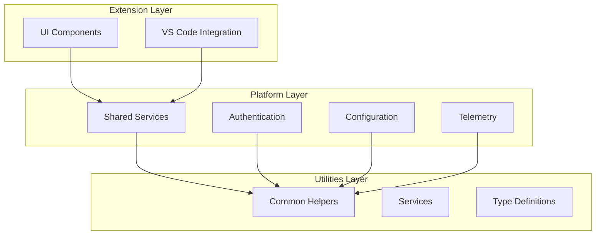
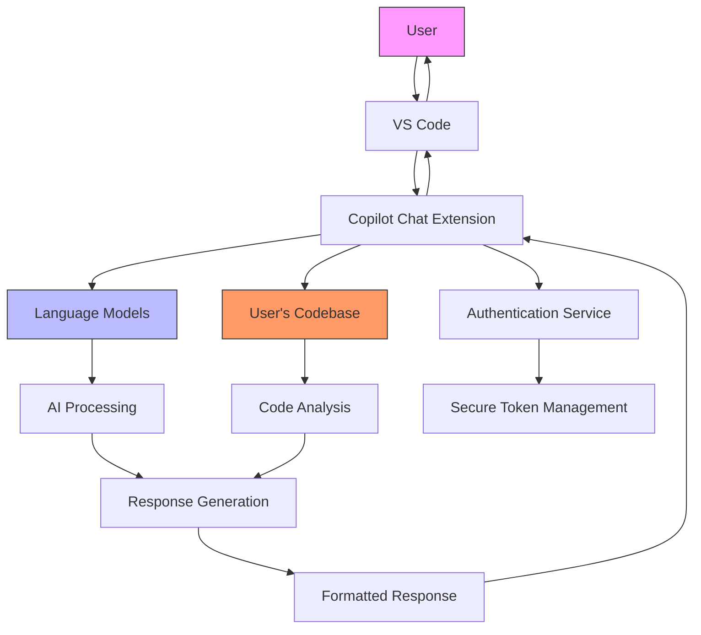
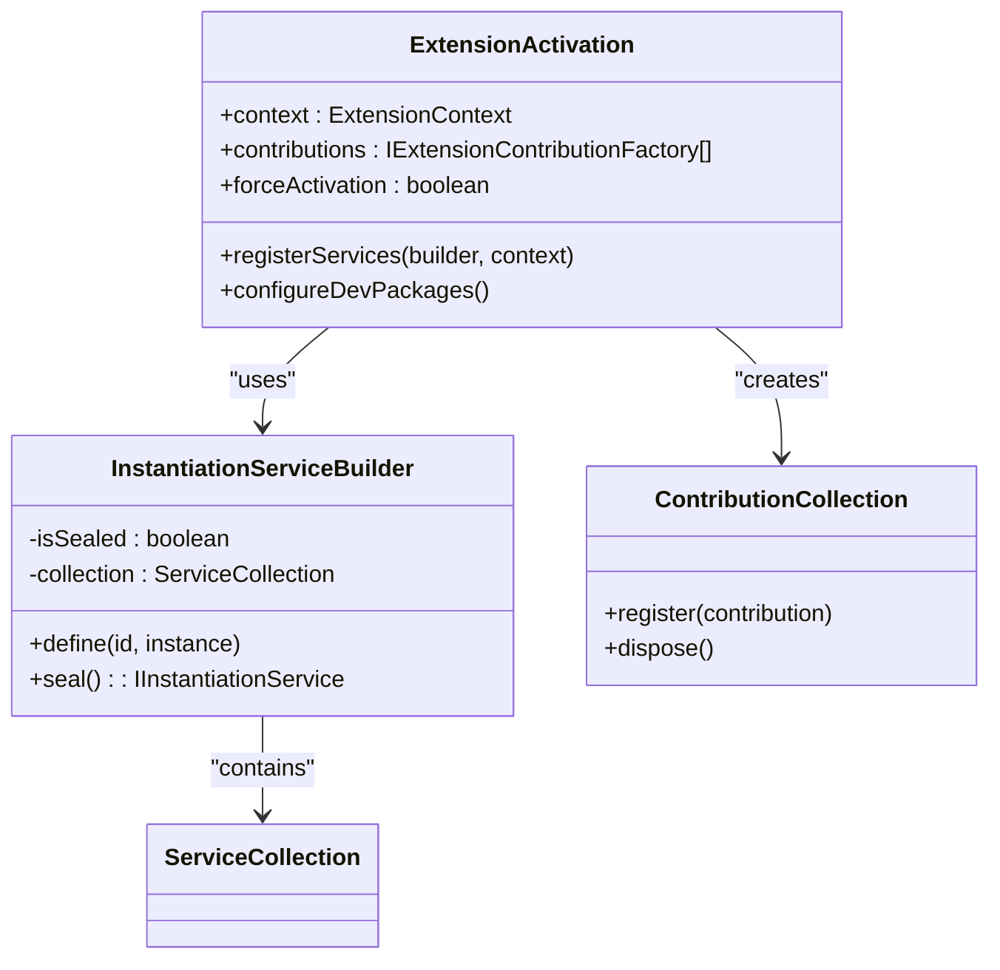
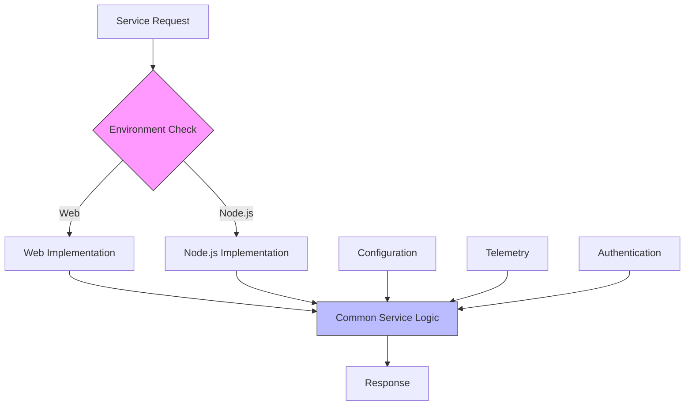
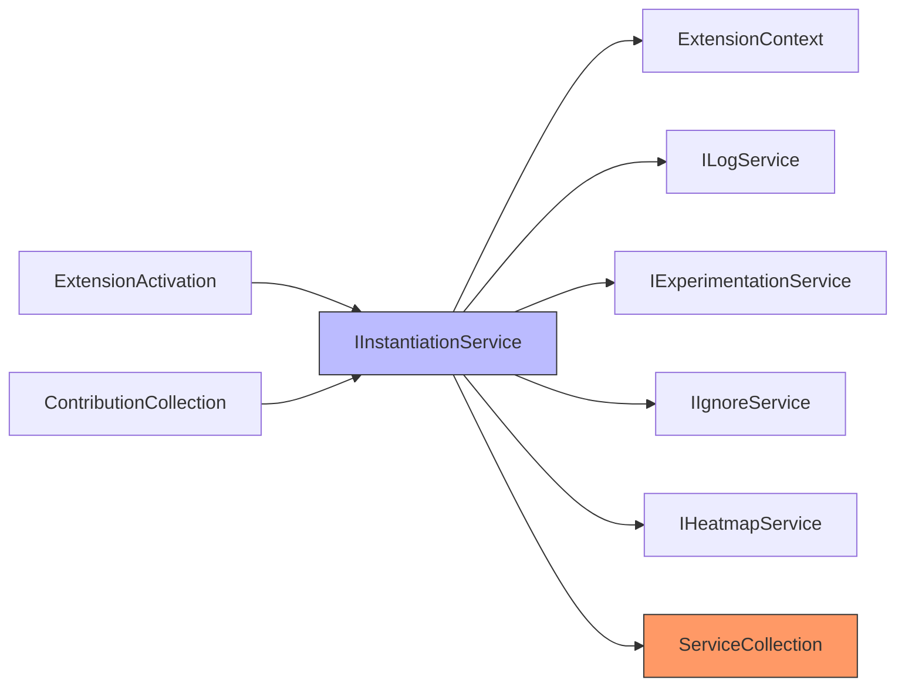

# Architecture Overview

<cite>
**Referenced Files in This Document**   
- [extension.ts](file://src/extension/extension/vscode/extension.ts)
- [package.json](file://package.json)
- [tsconfig.base.json](file://tsconfig.base.json)
- [services.ts](file://src/util/common/services.ts)
- [extensionContext.ts](file://src/platform/extContext/common/extensionContext.ts)
- [README.md](file://README.md)
</cite>

## Table of Contents
1. [Introduction](#introduction)
2. [Project Structure](#project-structure)
3. [Core Components](#core-components)
4. [Architecture Overview](#architecture-overview)
5. [Detailed Component Analysis](#detailed-component-analysis)
6. [Dependency Analysis](#dependency-analysis)
7. [Performance Considerations](#performance-considerations)
8. [Troubleshooting Guide](#troubleshooting-guide)
9. [Conclusion](#conclusion)

## Introduction
The GitHub Copilot Chat extension is an AI-powered programming assistant that integrates with Visual Studio Code to provide conversational AI assistance for software development. The extension enables developers to interact with AI models through chat interfaces, receive code suggestions, perform codebase searches, and execute various development tasks using natural language commands. The architecture is designed to support seamless integration with VS Code while maintaining separation between UI components, shared services, and utility functions.

**Section sources**
- [README.md](file://README.md#L1-L84)

## Project Structure
The project follows a modular organization with three main layers: extension (UI and VS Code integration), platform (shared services), and utilities (common helpers). The src/ directory contains the core implementation with extension/ for UI components and VS Code integration, platform/ for shared services across different environments, and util/ for common utility functions. The architecture separates platform-specific code (vscode-node, vscode) from common code to support different execution contexts while maintaining code reuse.

**Diagram sources **
- [package.json](file://package.json#L140-L800)
- [README.md](file://README.md#L1-L84)

**Section sources**
- [package.json](file://package.json#L1-L800)
- [README.md](file://README.md#L1-L84)

## Core Components
The core components of the GitHub Copilot Chat extension include the extension layer for UI and VS Code integration, platform layer for shared services, and utilities layer for common helpers. The architecture implements a services pattern for shared functionality, with dependency injection through the InstantiationService for managing component dependencies. The system uses a modular organization by feature, with separate directories for different capabilities like chat, authentication, configuration, and telemetry.

**Section sources**
- [extension.ts](file://src/extension/extension/vscode/extension.ts#L1-L113)
- [services.ts](file://src/util/common/services.ts#L1-L44)

## Architecture Overview
The GitHub Copilot Chat extension follows a layered architecture with clear separation between UI components, shared services, and utility functions. The system is built on TypeScript and Node.js, leveraging the VS Code Extension API for deep integration with the editor. The architecture supports multiple execution contexts (web and node.js) through platform-specific implementations while maintaining common functionality in shared modules. The design emphasizes maintainability and extensibility through modular organization and dependency injection.

**Diagram sources **
- [extension.ts](file://src/extension/extension/vscode/extension.ts#L1-L113)
- [package.json](file://package.json#L140-L800)

## Detailed Component Analysis

### Extension Layer Analysis
The extension layer handles UI components and VS Code integration, serving as the primary interface between users and the Copilot Chat functionality. This layer implements the activation logic for the extension and manages the registration of contributions to the VS Code interface. It depends on platform services for shared functionality while providing context-specific implementations for different execution environments.

**Diagram sources **
- [extension.ts](file://src/extension/extension/vscode/extension.ts#L1-L113)
- [services.ts](file://src/util/common/services.ts#L1-L44)

**Section sources**
- [extension.ts](file://src/extension/extension/vscode/extension.ts#L1-L113)

### Platform Services Analysis
The platform layer provides shared services that are used across different parts of the extension. These services include authentication, configuration management, logging, telemetry, and other cross-cutting concerns. The architecture separates platform-specific code from common code using directory structures like common/, vscode/, and vscode-node/ to maintain compatibility across different execution contexts while maximizing code reuse.

**Diagram sources **
- [extensionContext.ts](file://src/platform/extContext/common/extensionContext.ts#L1-L14)
- [services.ts](file://src/util/common/services.ts#L1-L44)

**Section sources**
- [extensionContext.ts](file://src/platform/extContext/common/extensionContext.ts#L1-L14)

## Dependency Analysis
The GitHub Copilot Chat extension uses a dependency injection pattern to manage component dependencies and promote loose coupling between components. The InstantiationService handles the creation and lifecycle management of services, allowing components to declare their dependencies without knowing the concrete implementations. This approach enhances testability and maintainability by enabling easy substitution of implementations and reducing direct dependencies between components.

**Diagram sources **
- [extension.ts](file://src/extension/extension/vscode/extension.ts#L1-L113)
- [services.ts](file://src/util/common/services.ts#L1-L44)

**Section sources**
- [extension.ts](file://src/extension/extension/vscode/extension.ts#L1-L113)
- [services.ts](file://src/util/common/services.ts#L1-L44)

## Performance Considerations
The architecture incorporates several performance optimizations, including lazy initialization of services, caching of frequently accessed data, and asynchronous initialization of non-critical components. The system minimizes startup time by deferring the initialization of non-essential services until they are needed. The use of efficient data structures and algorithms in utility functions helps maintain responsiveness during intensive operations like code analysis and search.

## Troubleshooting Guide
The extension includes comprehensive logging and telemetry capabilities to assist with troubleshooting and debugging. The logging system captures detailed information about extension activation, service initialization, and user interactions. Error handling is implemented consistently across components, with appropriate error reporting and recovery mechanisms. The architecture supports diagnostic tools and health checks to identify and resolve issues quickly.

**Section sources**
- [extension.ts](file://src/extension/extension/vscode/extension.ts#L1-L113)
- [package.json](file://package.json#L71-L73)

## Conclusion
The GitHub Copilot Chat extension demonstrates a well-structured architecture that balances functionality, maintainability, and extensibility. The layered design with clear separation between UI components, shared services, and utility functions enables efficient development and testing. The use of dependency injection and modular organization by feature supports long-term maintainability and makes it easier to add new capabilities. The architecture effectively addresses cross-cutting concerns like authentication, logging, and configuration management while providing a seamless user experience through deep integration with Visual Studio Code.