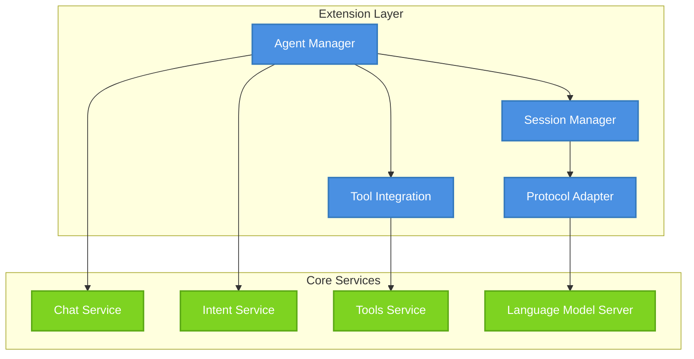
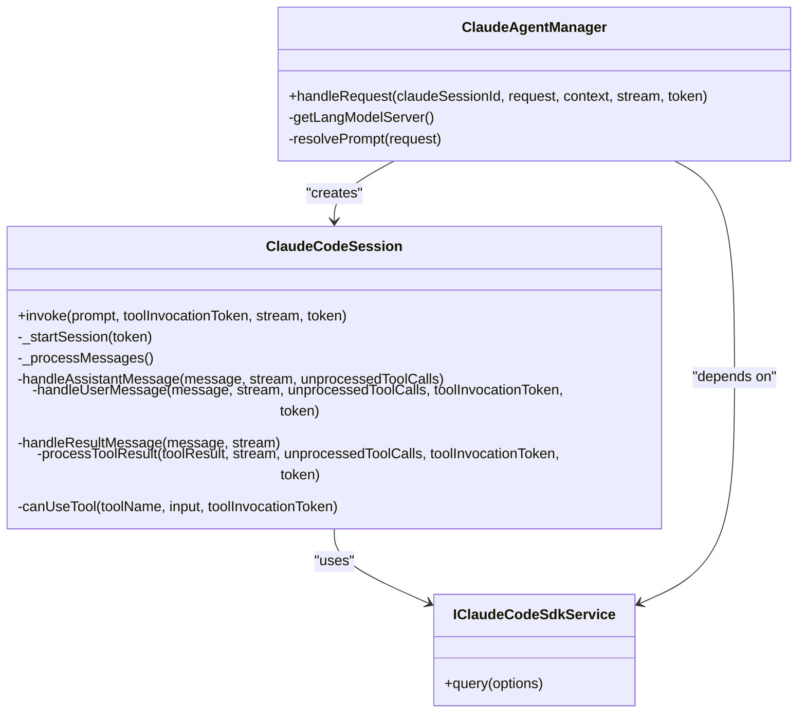
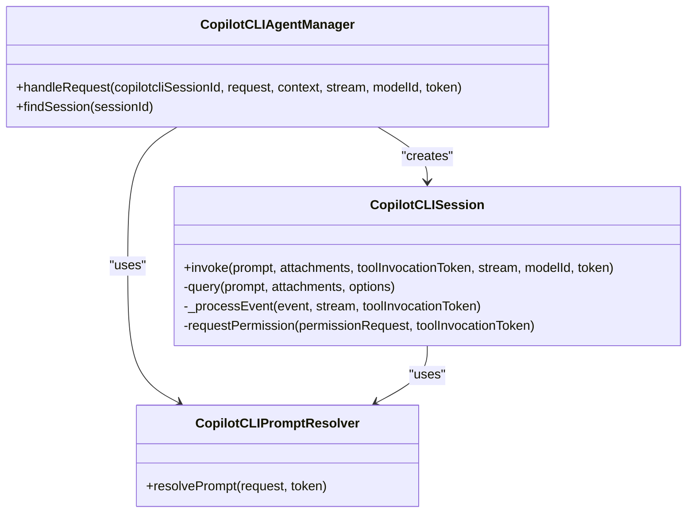
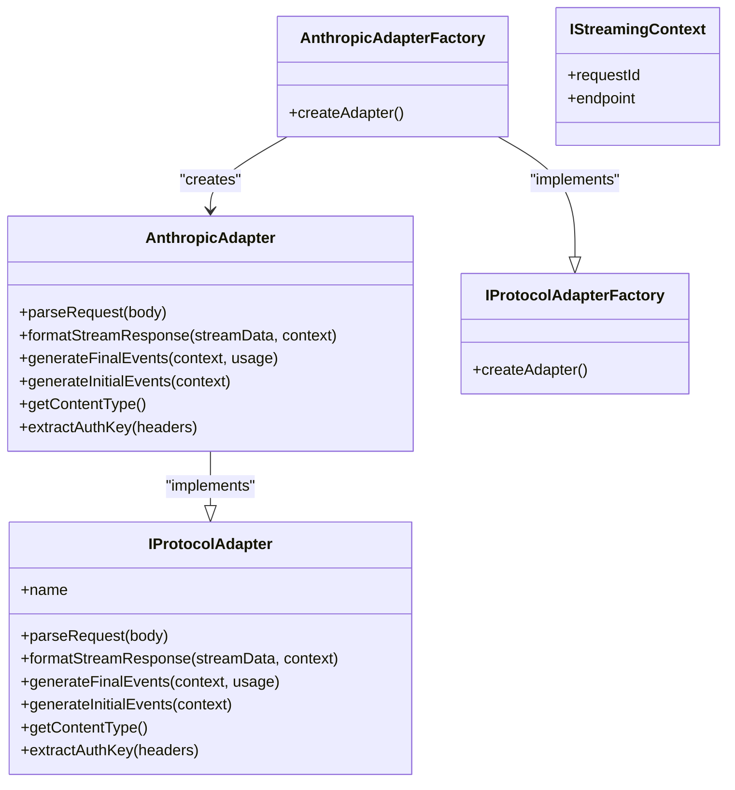
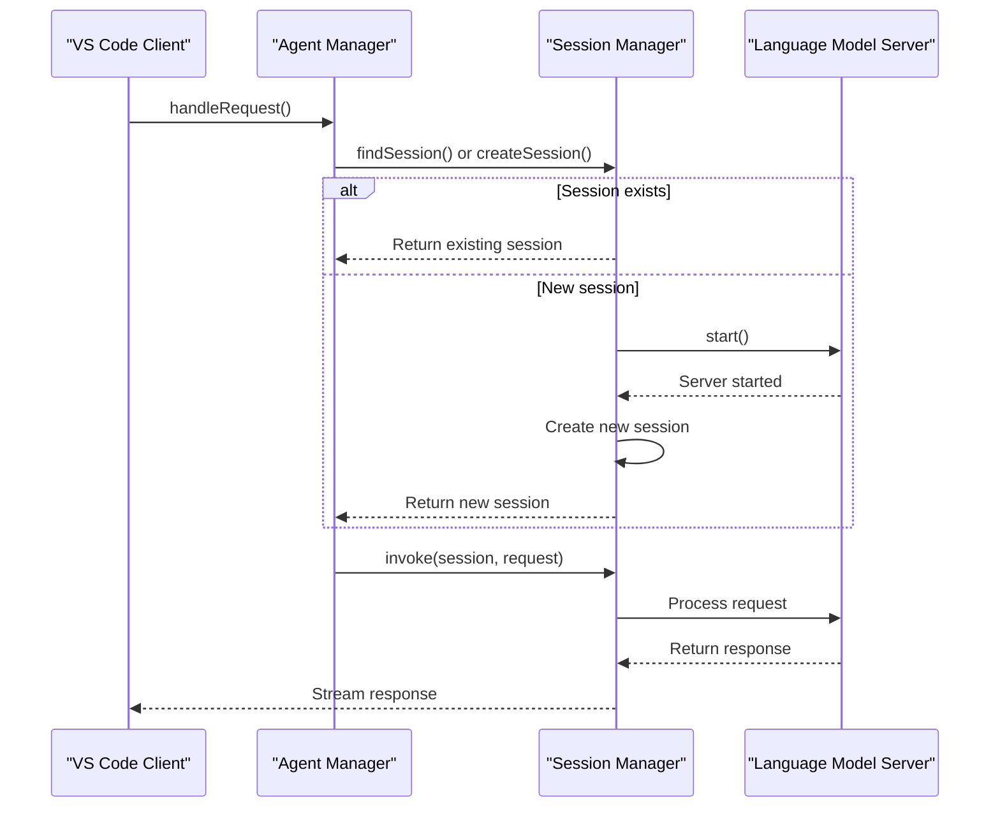
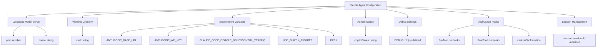
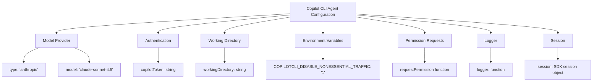
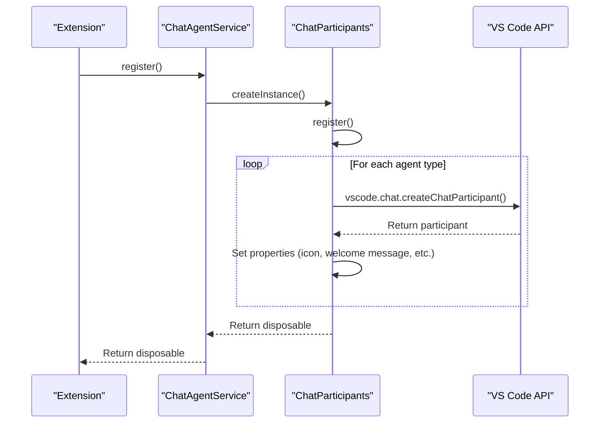
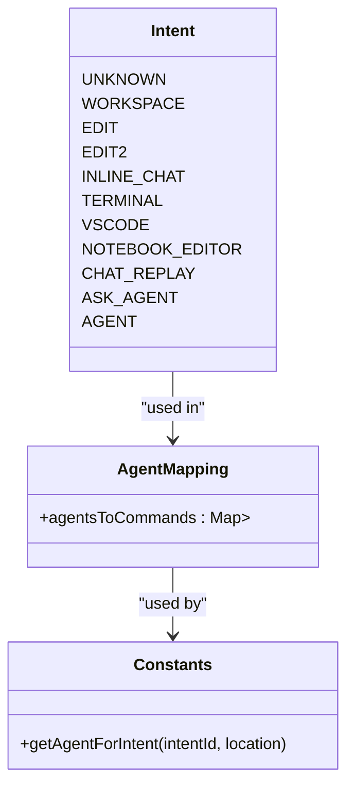

# Agents

<cite>
**Referenced Files in This Document**   
- [claudeCodeAgent.ts](file://src/extension/agents/claude/node/claudeCodeAgent.ts)
- [claudeCodeSdkService.ts](file://src/extension/agents/claude/node/claudeCodeSdkService.ts)
- [claudeTools.ts](file://src/extension/agents/claude/common/claudeTools.ts)
- [toolInvocationFormatter.ts](file://src/extension/agents/claude/common/toolInvocationFormatter.ts)
- [copilotcliAgentManager.ts](file://src/extension/agents/copilotcli/node/copilotcliAgentManager.ts)
- [copilotcliPromptResolver.ts](file://src/extension/agents/copilotcli/node/copilotcliPromptResolver.ts)
- [copilotcliToolInvocationFormatter.ts](file://src/extension/agents/copilotcli/node/copilotcliToolInvocationFormatter.ts)
- [anthropicAdapter.ts](file://src/extension/agents/node/adapters/anthropicAdapter.ts)
- [types.ts](file://src/extension/agents/node/adapters/types.ts)
- [chatParticipants.ts](file://src/extension/conversation/vscode-node/chatParticipants.ts)
- [constants.ts](file://src/extension/common/constants.ts)
</cite>

## Table of Contents
1. [Introduction](#introduction)
2. [Agent Architecture Overview](#agent-architecture-overview)
3. [Core Agent Implementations](#core-agent-implementations)
4. [Agent Management and Lifecycle](#agent-management-and-lifecycle)
5. [Language Model Integration Pattern](#language-model-integration-pattern)
6. [Conversation State Management](#conversation-state-management)
7. [Configuration and Parameters](#configuration-and-parameters)
8. [Integration with Chat Session Service](#integration-with-chat-session-service)
9. [Integration with Intent Processing System](#integration-with-intent-processing-system)
10. [Common Issues and Solutions](#common-issues-and-solutions)
11. [Extensibility and Customization](#extensibility-and-customization)

## Introduction

The Agents sub-component of the Extension Layer implements AI agent functionality for GitHub Copilot in Visual Studio Code. This system enables intelligent, context-aware interactions between developers and AI models through a plugin-based architecture. The agent system supports multiple AI models including Claude and Copilot CLI, with extensible node-based agents for additional language models.

Agents in this system are designed to handle complex coding tasks through multi-step reasoning, tool usage, and conversation management. They integrate with various VS Code services to provide seamless AI assistance for code editing, explanation, generation, and debugging. The architecture follows a plugin pattern that allows for flexible integration of different AI models while maintaining a consistent interface for agent management and interaction.

This documentation provides a comprehensive overview of the agent system, focusing on implementation details, architectural patterns, and integration points. It is designed to be accessible to beginners while providing sufficient technical depth for experienced developers who want to extend or customize the agent functionality.

## Agent Architecture Overview

The agent system in the Extension Layer follows a modular, service-oriented architecture that enables flexible integration of different AI models through a consistent interface. The core architectural components include agent managers, session services, protocol adapters, and tool integration systems.



**Diagram sources**
- [claudeCodeAgent.ts](file://src/extension/agents/claude/node/claudeCodeAgent.ts)
- [copilotcliAgentManager.ts](file://src/extension/agents/copilotcli/node/copilotcliAgentManager.ts)
- [chatParticipants.ts](file://src/extension/conversation/vscode-node/chatParticipants.ts)

The architecture is designed around several key principles:

- **Plugin Pattern**: Different AI models are integrated through pluggable components that implement a common interface
- **Session Management**: Agent sessions maintain conversation state and context across multiple interactions
- **Tool Integration**: Agents can use various tools for code editing, file operations, and system commands
- **Protocol Abstraction**: Communication with language models is abstracted through protocol adapters
- **Lifecycle Management**: Agents follow a consistent lifecycle for initialization, execution, and disposal

The system supports multiple agent types including Claude, Copilot CLI, and node-based agents, each with specific implementations tailored to their respective AI models. These agents are managed by agent managers that handle request routing, session creation, and lifecycle management.

**Section sources**
- [claudeCodeAgent.ts](file://src/extension/agents/claude/node/claudeCodeAgent.ts)
- [copilotcliAgentManager.ts](file://src/extension/agents/copilotcli/node/copilotcliAgentManager.ts)
- [chatParticipants.ts](file://src/extension/conversation/vscode-node/chatParticipants.ts)

## Core Agent Implementations

The agent system implements three primary agent types: Claude, Copilot CLI, and node-based agents. Each agent type has specific implementations that handle the unique requirements of their respective AI models.

### Claude Agent Implementation

The Claude agent implementation provides integration with the Claude AI model through the Claude Code SDK. It manages the lifecycle of Claude sessions and handles communication between VS Code and the Claude service.



**Diagram sources**
- [claudeCodeAgent.ts](file://src/extension/agents/claude/node/claudeCodeAgent.ts)
- [claudeCodeSdkService.ts](file://src/extension/agents/claude/node/claudeCodeSdkService.ts)

The Claude agent manager handles incoming chat requests and manages Claude sessions. When a request is received, it either reuses an existing session or creates a new one. The ClaudeCodeSession class manages the interaction with the Claude model, handling message processing, tool execution, and conversation state.

Key features of the Claude agent implementation include:

- Session persistence across multiple requests
- Tool usage hooks for pre and post tool execution
- Automatic approval for safe file operations
- Integration with the language model server
- Support for various Claude-specific tools like editing, bash commands, and file operations

### Copilot CLI Agent Implementation

The Copilot CLI agent implementation integrates with the Copilot CLI SDK to provide AI capabilities through the GitHub Copilot service. It manages sessions and handles communication between VS Code and the Copilot CLI.



**Diagram sources**
- [copilotcliAgentManager.ts](file://src/extension/agents/copilotcli/node/copilotcliAgentManager.ts)
- [copilotcliPromptResolver.ts](file://src/extension/agents/copilotcli/node/copilotcliPromptResolver.ts)

The Copilot CLI agent manager handles request routing and session management. It creates or reuses Copilot CLI sessions based on the request context. The CopilotCLISession class manages the interaction with the Copilot CLI SDK, handling query execution, event processing, and permission requests.

Key features of the Copilot CLI agent implementation include:

- Support for attachments in chat requests
- Permission request handling for tool execution
- Event-based processing of SDK responses
- Integration with authentication service for token management
- Support for various Copilot CLI tools like code editing, bash commands, and thinking

### Node-based Agent Implementation

The node-based agent implementation provides a flexible framework for integrating various language models through protocol adapters. It uses an adapter pattern to support different AI model protocols.



**Diagram sources**
- [anthropicAdapter.ts](file://src/extension/agents/node/adapters/anthropicAdapter.ts)
- [types.ts](file://src/extension/agents/node/adapters/types.ts)

The node-based agent system uses a factory pattern to create protocol adapters for different AI models. The AnthropicAdapterFactory creates instances of AnthropicAdapter, which implements the IProtocolAdapter interface. This adapter handles protocol-specific operations like request parsing, response formatting, and authentication.

Key features of the node-based agent implementation include:

- Support for multiple AI model protocols through adapters
- Flexible request parsing and response formatting
- Stream-based communication with language models
- Authentication key extraction from headers
- Content type management for different protocols

**Section sources**
- [claudeCodeAgent.ts](file://src/extension/agents/claude/node/claudeCodeAgent.ts)
- [copilotcliAgentManager.ts](file://src/extension/agents/copilotcli/node/copilotcliAgentManager.ts)
- [anthropicAdapter.ts](file://src/extension/agents/node/adapters/anthropicAdapter.ts)
- [types.ts](file://src/extension/agents/node/adapters/types.ts)

## Agent Management and Lifecycle

The agent system implements a comprehensive lifecycle management system that handles agent initialization, configuration, and disposal. This ensures consistent behavior across different agent types and proper resource management.

### Agent Initialization

Agent initialization follows a consistent pattern across different agent types, with specific implementations tailored to their respective AI models. The initialization process involves creating agent managers, setting up session services, and configuring protocol adapters.

For the Claude agent, initialization begins with the ClaudeAgentManager, which is responsible for handling incoming chat requests. When a request is received, the manager either reuses an existing session or creates a new one through the ClaudeCodeSession class. The session initialization involves starting the language model server and setting up the Claude Code SDK with appropriate configuration options.



**Diagram sources**
- [claudeCodeAgent.ts](file://src/extension/agents/claude/node/claudeCodeAgent.ts)
- [copilotcliAgentManager.ts](file://src/extension/agents/copilotcli/node/copilotcliAgentManager.ts)

The Copilot CLI agent follows a similar initialization pattern, with the CopilotCLIAgentManager handling request routing and session management. When a new session is needed, it creates a CopilotCLISession instance and initializes the Copilot CLI SDK with the appropriate configuration, including authentication tokens and working directory settings.

### Configuration Management

Agent configuration is managed through a combination of service dependencies and configuration options. Each agent type has specific configuration requirements that are injected through the dependency injection system.

The Claude agent configuration includes:
- Language model server settings (port, nonce)
- Working directory for the workspace
- Environment variables for the SDK
- Authentication tokens
- Debug settings
- Tool usage hooks

The Copilot CLI agent configuration includes:
- Model provider settings
- Authentication tokens
- Working directory
- Environment variables
- Permission request handlers
- Logger configuration

Configuration is injected into agent components through constructor parameters, following the dependency injection pattern used throughout the extension. This allows for easy testing and replacement of components.

### Lifecycle Management

The agent system implements a comprehensive lifecycle management system that ensures proper resource cleanup and state management. All agent components extend the Disposable class, which provides a consistent interface for cleanup operations.

When an agent session is disposed, the following cleanup operations are performed:
- Abort any ongoing requests
- Dispose of all child disposables
- Clear pending requests and promises
- Remove session references
- Clean up event listeners

The lifecycle management system ensures that resources are properly released when agents are no longer needed, preventing memory leaks and ensuring consistent behavior across different usage scenarios.

**Section sources**
- [claudeCodeAgent.ts](file://src/extension/agents/claude/node/claudeCodeAgent.ts)
- [copilotcliAgentManager.ts](file://src/extension/agents/copilotcli/node/copilotcliAgentManager.ts)

## Language Model Integration Pattern

The agent system implements a plugin pattern for integrating different AI models, allowing for flexible and extensible integration of various language models. This pattern provides a consistent interface for agent management while accommodating the unique requirements of different AI services.

### Plugin Architecture

The plugin architecture is based on a set of interfaces and abstract classes that define the contract for agent implementations. This allows different AI models to be integrated through pluggable components that implement the required interfaces.

The core interfaces include:
- IProtocolAdapter: Defines the contract for protocol-specific operations
- IProtocolAdapterFactory: Factory interface for creating protocol adapters
- IStreamingContext: Context information for streaming operations
- IParsedRequest: Structure for parsed request data

```mermaid
classDiagram
class IProtocolAdapter {
<<interface>>
+name : string
+parseRequest(body : string) : IParsedRequest
+formatStreamResponse(streamData : IAgentStreamBlock, context : IStreamingContext) : IStreamEventData[]
+generateFinalEvents(context : IStreamingContext, usage? : APIUsage) : IStreamEventData[]
+generateInitialEvents?(context : IStreamingContext) : IStreamEventData[]
+getContentType() : string
+extractAuthKey(headers : http.IncomingHttpHeaders) : string | undefined
}
class IProtocolAdapterFactory {
<<interface>>
+createAdapter() : IProtocolAdapter
}
class IStreamingContext {
+requestId : string
+endpoint : { modelId : string, modelMaxPromptTokens : number }
}
class IParsedRequest {
+model? : string
+messages : Raw.ChatMessage[]
+options? : IMakeChatRequestOptions['requestOptions']
+type? : string
}
class IAgentStreamBlock {
<<interface>>
}
class IAgentTextBlock {
+type : 'text'
+content : string
}
class IAgentToolCallBlock {
+type : 'tool_call'
+callId : string
+name : string
+input : object
}
IAgentStreamBlock <|-- IAgentTextBlock
IAgentStreamBlock <|-- IAgentToolCallBlock
IProtocolAdapter <|-- AnthropicAdapter
IProtocolAdapterFactory <|-- AnthropicAdapterFactory
```

**Diagram sources**
- [anthropicAdapter.ts](file://src/extension/agents/node/adapters/anthropicAdapter.ts)
- [types.ts](file://src/extension/agents/node/adapters/types.ts)

The plugin pattern allows new AI models to be integrated by implementing these interfaces and registering the adapter with the system. This approach provides several benefits:

- **Extensibility**: New AI models can be added without modifying existing code
- **Consistency**: All agents follow the same interface and behavior patterns
- **Testability**: Components can be easily mocked and tested in isolation
- **Maintainability**: Changes to one agent implementation don't affect others

### Protocol Adapters

Protocol adapters are the core components of the plugin pattern, responsible for translating between the generic agent interface and the specific requirements of each AI model. The AnthropicAdapter is a concrete implementation that handles communication with the Anthropic AI service.

The adapter implementation includes several key methods:

- **parseRequest**: Converts incoming request data into a standardized format
- **formatStreamResponse**: Transforms streaming data from the AI model into protocol-specific events
- **generateFinalEvents**: Creates the final events to close a streaming response
- **generateInitialEvents**: Optionally generates initial events to start a stream
- **getContentType**: Returns the content type for responses
- **extractAuthKey**: Extracts authentication information from request headers

These methods ensure that the agent system can communicate effectively with different AI models while maintaining a consistent interface for the rest of the extension.

### Integration Benefits

The plugin pattern for language model integration provides several key benefits:

- **Flexibility**: Supports multiple AI models with different protocols and requirements
- **Maintainability**: Isolates changes to specific adapter implementations
- **Testability**: Allows for easy mocking and testing of individual components
- **Scalability**: Enables the addition of new AI models without significant architectural changes
- **Consistency**: Provides a uniform interface for agent management across different models

This architecture allows the extension to support current AI models while remaining adaptable to future developments in the AI landscape.

**Section sources**
- [anthropicAdapter.ts](file://src/extension/agents/node/adapters/anthropicAdapter.ts)
- [types.ts](file://src/extension/agents/node/adapters/types.ts)

## Conversation State Management

The agent system implements sophisticated conversation state management to maintain context across multiple interactions. This ensures that agents can provide coherent and context-aware responses throughout a chat session.

### Session State Architecture

The conversation state management system is built around the concept of sessions, which maintain state information for ongoing interactions. Each agent type implements its own session management, but they follow a consistent pattern.

The Claude agent uses the ClaudeCodeSession class to manage conversation state. This class maintains several key pieces of state:

- **Prompt queue**: Stores incoming requests that are waiting to be processed
- **Current request**: Tracks the request currently being processed
- **Pending prompt**: Manages promises for requests that are waiting for processing
- **Ongoing edits**: Tracks edits that are in progress
- **Query generator**: Maintains the connection to the Claude Code SDK
- **Abort controller**: Provides cancellation functionality for ongoing operations

```mermaid
classDiagram
class ClaudeCodeSession {
-_queryGenerator : Query | undefined
-_promptQueue : QueuedRequest[]
-_currentRequest : CurrentRequest | undefined
-_pendingPrompt : DeferredPromise<QueuedRequest> | undefined
-_abortController : AbortController
-_ongoingEdits : Map<string, { complete : () => void, onDidComplete : Thenable<void> }>
+invoke(prompt, toolInvocationToken, stream, token)
-_startSession(token)
-_processMessages()
-_getNextRequest()
}
class QueuedRequest {
+prompt : string
+stream : ChatResponseStream
+toolInvocationToken : ChatParticipantToolToken
+token : CancellationToken
+deferred : DeferredPromise<void>
}
class CurrentRequest {
+stream : ChatResponseStream
+toolInvocationToken : ChatParticipantToolToken
+token : CancellationToken
}
ClaudeCodeSession --> QueuedRequest : "contains"
ClaudeCodeSession --> CurrentRequest : "references"
```

**Diagram sources**
- [claudeCodeAgent.ts](file://src/extension/agents/claude/node/claudeCodeAgent.ts)

The Copilot CLI agent uses a similar approach with the CopilotCLISession class, which maintains state for ongoing interactions with the Copilot CLI SDK. It tracks the SDK session, pending tool invocations, and event processing state.

### Message Processing

The message processing system handles the flow of information between the agent and the AI model. For the Claude agent, this involves a continuous loop that processes messages from the Claude Code SDK and routes them to the appropriate handlers.

The _processMessages method in the ClaudeCodeSession class implements this loop, which:
1. Iterates through messages from the query generator
2. Checks for cancellation requests
3. Routes messages to appropriate handlers based on message type
4. Manages request completion and cleanup

Different message types are handled by specialized methods:
- **Assistant messages**: Contain text content and tool use blocks, handled by handleAssistantMessage
- **User messages**: Contain tool results, handled by handleUserMessage
- **Result messages**: Indicate completion or errors, handled by handleResultMessage

This architecture ensures that conversation state is maintained consistently across multiple interactions, allowing the agent to build on previous context and provide more intelligent responses.

### State Persistence

The agent system implements state persistence across sessions through several mechanisms:

- **Session IDs**: Each session is assigned a unique ID that can be reused across requests
- **Resume functionality**: The Claude agent supports resuming previous sessions using the resume option
- **Configuration persistence**: Agent settings are stored and reused across sessions
- **Context preservation**: Conversation history and context are maintained throughout a session

This state management approach enables agents to provide more intelligent and context-aware responses, as they can build on previous interactions and maintain awareness of the conversation history.

**Section sources**
- [claudeCodeAgent.ts](file://src/extension/agents/claude/node/claudeCodeAgent.ts)
- [copilotcliAgentManager.ts](file://src/extension/agents/copilotcli/node/copilotcliAgentManager.ts)

## Configuration and Parameters

The agent system provides extensive configuration options that allow users and developers to customize agent behavior. These configurations are implemented through a combination of service dependencies, constructor parameters, and configuration settings.

### Agent Configuration Options

Each agent type has specific configuration options that control its behavior. These options are injected through the dependency injection system and can be modified through extension settings.

For the Claude agent, configuration options include:



**Diagram sources**
- [claudeCodeAgent.ts](file://src/extension/agents/claude/node/claudeCodeAgent.ts)

For the Copilot CLI agent, configuration options include:



**Diagram sources**
- [copilotcliAgentManager.ts](file://src/extension/agents/copilotcli/node/copilotcliAgentManager.ts)

### Parameter Management

Parameters are managed through a combination of constructor injection and configuration services. The dependency injection system ensures that components receive the appropriate configuration options when they are created.

Key parameter management patterns include:

- **Service dependencies**: Configuration services are injected through constructor parameters
- **Configuration keys**: Specific configuration options are accessed through well-defined keys
- **Default values**: Reasonable defaults are provided for optional parameters
- **Type safety**: Configuration options are strongly typed to prevent errors

The system uses the IConfigurationService to access configuration settings, allowing for user-customizable options that can be modified through VS Code settings.

### Return Values

Agent methods return structured data that provides information about the operation result and any state changes. The return values follow a consistent pattern across different agent types.

For the Claude agent, the handleRequest method returns:

```typescript
interface ChatResult {
    claudeSessionId?: string;
    errorDetails?: {
        message: string;
    };
}
```

For the Copilot CLI agent, the handleRequest method returns:

```typescript
interface ChatResult {
    copilotcliSessionId?: string;
}
```

These return values provide information about the session state and any errors that occurred during processing, allowing the calling code to handle the results appropriately.

**Section sources**
- [claudeCodeAgent.ts](file://src/extension/agents/claude/node/claudeCodeAgent.ts)
- [copilotcliAgentManager.ts](file://src/extension/agents/copilotcli/node/copilotcliAgentManager.ts)

## Integration with Chat Session Service

The agent system integrates closely with the chat session service to provide a seamless user experience. This integration enables agents to participate in chat sessions, maintain conversation history, and respond to user interactions.

### Chat Participant Registration

Agents are registered as chat participants through the ChatAgentService, which manages the registration and lifecycle of all chat participants. The ChatParticipants class handles the registration of different agent types.



**Diagram sources**
- [chatParticipants.ts](file://src/extension/conversation/vscode-node/chatParticipants.ts)

The registration process involves:
1. Creating a chat participant for each agent type
2. Setting participant properties like icons and welcome messages
3. Registering event handlers for feedback and user actions
4. Setting up title and summarizer providers

### Request Handling

The integration with the chat session service enables agents to handle incoming chat requests through a standardized interface. The getChatParticipantHandler method creates a request handler that processes incoming requests and routes them to the appropriate agent.

The request handling process includes:
- Waiting for authentication to complete
- Handling privacy confirmation for third-party models
- Switching to base models when quota is exhausted
- Determining the appropriate intent for the request
- Creating a request handler with the appropriate context

This integration ensures that agents can participate in chat sessions while respecting user privacy and quota limitations.

### Session Coordination

The agent system coordinates with the chat session service to maintain consistent state across multiple interactions. This includes:

- Sharing session IDs between agents and chat sessions
- Maintaining conversation history
- Preserving context across requests
- Handling session pausing and resumption

The integration allows agents to provide context-aware responses that build on previous interactions, creating a more natural and productive user experience.

**Section sources**
- [chatParticipants.ts](file://src/extension/conversation/vscode-node/chatParticipants.ts)

## Integration with Intent Processing System

The agent system integrates with the intent processing system to provide intelligent routing of user requests to the appropriate agent and command. This integration enables the system to understand user intent and respond appropriately.

### Intent Mapping

The intent processing system maps user requests to specific agents and commands based on the detected intent. The constants.ts file defines the mapping between intents and agents.



**Diagram sources**
- [constants.ts](file://src/extension/common/constants.ts)

The getAgentForIntent function determines which agent should handle a request based on the detected intent and location. This allows the system to route requests to the appropriate agent based on the context and user intent.

### Intent Detection

The intent processing system detects user intent through several mechanisms:

- **Command detection**: Slash commands in the request prompt
- **Context analysis**: Analysis of the current editor context
- **Configuration settings**: User preferences and settings
- **Model capabilities**: Capabilities of the selected language model

For example, the default agent uses a getter function to determine the appropriate intent based on configuration settings and model capabilities:

```typescript
const intentGetter = (request: vscode.ChatRequest) => {
    if (configurationService.getExperimentBasedConfig(ConfigKey.Internal.AskAgent, experimentationService) && 
        request.model.capabilities.supportsToolCalling && 
        configurationService.getNonExtensionConfig('chat.agent.enabled')) {
        return Intent.AskAgent;
    }
    return Intent.Unknown;
};
```

### Command Routing

The intent processing system routes commands to the appropriate agent based on the detected intent. The agentsToCommands mapping defines which commands are available for each agent.

When a user includes a command in their request (e.g., "/explain" or "/fix"), the system:
1. Detects the command from the request prompt
2. Maps the command to the appropriate intent
3. Routes the request to the agent that handles that intent
4. Executes the appropriate command within the agent

This integration enables a flexible and extensible command system that can be easily extended with new commands and agents.

**Section sources**
- [constants.ts](file://src/extension/common/constants.ts)
- [chatParticipants.ts](file://src/extension/conversation/vscode-node/chatParticipants.ts)

## Common Issues and Solutions

The agent system may encounter various issues during operation. This section documents common problems and their solutions to help users and developers troubleshoot effectively.

### Agent Initialization Failures

Agent initialization failures can occur due to several reasons:

**Authentication Issues**
- **Symptom**: Agent fails to initialize with authentication errors
- **Solution**: Ensure the user is signed in to GitHub Copilot and has a valid subscription
- **Debug steps**: Check authentication service status and token validity

**Language Model Server Issues**
- **Symptom**: Claude agent fails to start with server connection errors
- **Solution**: Verify that the language model server is running and accessible
- **Debug steps**: Check server logs and port configuration

**Dependency Loading Issues**
- **Symptom**: Agent fails to load with module import errors
- **Solution**: Ensure all required dependencies are installed and accessible
- **Debug steps**: Verify node_modules directory and package integrity

### Tool Permission Issues

Tool permission issues occur when agents request permission to perform actions:

**Permission Denial**
- **Symptom**: Tool execution is denied by the user
- **Solution**: Review the tool request and approve if appropriate
- **Debug steps**: Check the confirmation dialog content and user response

**Auto-approval Failures**
- **Symptom**: Safe operations are not auto-approved
- **Solution**: Verify file safety checks and configuration settings
- **Debug steps**: Check isFileOkForTool function and file validation logic

### Network and Connectivity Issues

Network issues can affect agent functionality:

**Timeout Errors**
- **Symptom**: Requests time out with no response
- **Solution**: Check network connectivity and firewall settings
- **Debug steps**: Verify API endpoint accessibility and network configuration

**Rate Limiting**
- **Symptom**: Requests are rejected due to rate limiting
- **Solution**: Implement request throttling and retry logic
- **Debug steps**: Check rate limit headers and adjust request frequency

### Configuration Issues

Configuration problems can prevent agents from working correctly:

**Incorrect Settings**
- **Symptom**: Agent behaves unexpectedly due to wrong settings
- **Solution**: Verify configuration settings and reset to defaults if needed
- **Debug steps**: Check configuration service values and user settings

**Missing Dependencies**
- **Symptom**: Agent fails to initialize with missing module errors
- **Solution**: Install missing dependencies and verify package.json
- **Debug steps**: Check node_modules and run npm install

These common issues and solutions provide a starting point for troubleshooting agent problems. The system includes comprehensive logging and error reporting to help diagnose and resolve issues effectively.

**Section sources**
- [claudeCodeAgent.ts](file://src/extension/agents/claude/node/claudeCodeAgent.ts)
- [copilotcliAgentManager.ts](file://src/extension/agents/copilotcli/node/copilotcliAgentManager.ts)
- [chatParticipants.ts](file://src/extension/conversation/vscode-node/chatParticipants.ts)

## Extensibility and Customization

The agent system is designed to be highly extensible and customizable, allowing developers to add new agents, modify existing behavior, and integrate with additional AI models.

### Adding New Agents

New agents can be added by implementing the appropriate interfaces and registering them with the system. The plugin pattern makes it straightforward to integrate new AI models.

To add a new agent:
1. Implement the IProtocolAdapter interface for the new AI model
2. Create a factory class that implements IProtocolAdapterFactory
3. Register the adapter with the system
4. Create an agent manager to handle request routing
5. Register the agent as a chat participant

### Customizing Agent Behavior

Existing agents can be customized through several mechanisms:

**Configuration Options**
- Modify agent behavior through configuration settings
- Extend configuration service with new options
- Use experiment-based configuration for feature flags

**Tool Integration**
- Add new tools to existing agents
- Modify tool behavior through hooks
- Implement custom tool approval logic

**Event Handling**
- Subscribe to agent events for custom processing
- Implement custom response formatting
- Add analytics and monitoring

### Integration Points

The agent system provides several integration points for customization:

**Service Replacement**
- Replace existing services with custom implementations
- Use dependency injection to inject custom components
- Extend base classes with additional functionality

**Event Hooks**
- Add pre and post processing hooks for requests
- Implement custom logging and monitoring
- Add validation and security checks

**UI Customization**
- Modify agent icons and visual elements
- Customize welcome messages and help text
- Extend chat participant interface

The extensibility features of the agent system enable developers to adapt the functionality to specific use cases and integrate with additional services and AI models.

**Section sources**
- [anthropicAdapter.ts](file://src/extension/agents/node/adapters/anthropicAdapter.ts)
- [types.ts](file://src/extension/agents/node/adapters/types.ts)
- [chatParticipants.ts](file://src/extension/conversation/vscode-node/chatParticipants.ts)