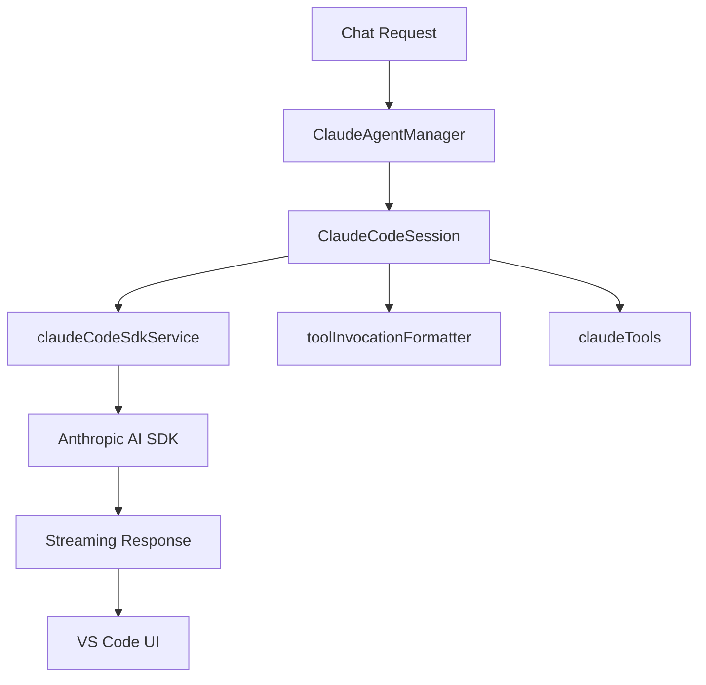
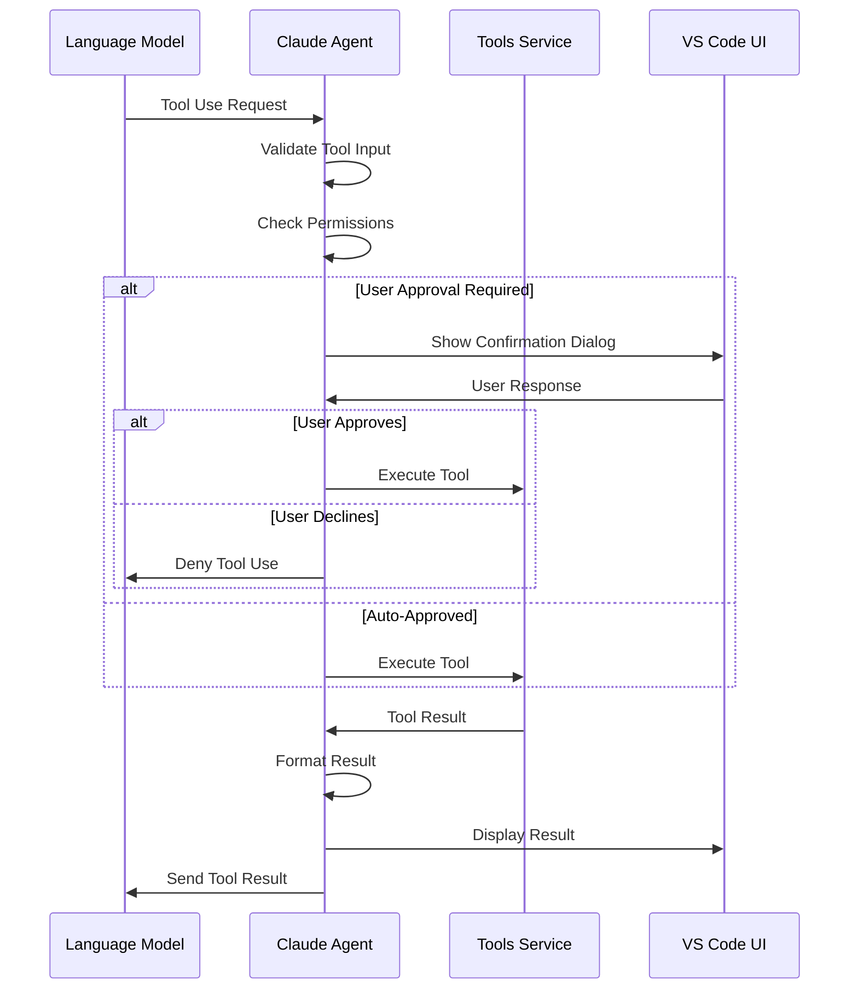
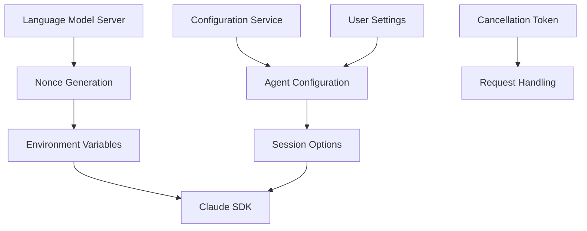

# Claude Agent

<cite>
**Referenced Files in This Document**   
- [claudeCodeAgent.ts](file://src/extension/agents/claude/node/claudeCodeAgent.ts)
- [claudeCodeSdkService.ts](file://src/extension/agents/claude/node/claudeCodeSdkService.ts)
- [claudeTools.ts](file://src/extension/agents/claude/common/claudeTools.ts)
- [toolInvocationFormatter.ts](file://src/extension/agents/claude/common/toolInvocationFormatter.ts)
- [mockClaudeCodeSdkService.ts](file://src/extension/agents/claude/node/test/mockClaudeCodeSdkService.ts)
</cite>

## Table of Contents
1. [Introduction](#introduction)
2. [Architecture Overview](#architecture-overview)
3. [Core Components](#core-components)
4. [Tool Invocation Pattern](#tool-invocation-pattern)
5. [Configuration and Authentication](#configuration-and-authentication)
6. [Streaming and Conversation Context](#streaming-and-conversation-context)
7. [Error Handling and Rate Limiting](#error-handling-and-rate-limiting)
8. [Integration with Chat Session Service](#integration-with-chat-session-service)
9. [Conclusion](#conclusion)

## Introduction

The Claude Agent implementation in the VSCode Copilot Chat extension provides an integration with the Anthropic AI SDK through the claudeCodeSdkService. This agent enables developers to leverage Claude's language model capabilities within the VSCode environment, supporting various tools and operations for code analysis, editing, and generation. The architecture is designed to handle streaming responses, maintain conversation context, and manage tool invocations efficiently.

**Section sources**
- [claudeCodeAgent.ts](file://src/extension/agents/claude/node/claudeCodeAgent.ts#L1-L607)

## Architecture Overview

The Claude Agent architecture consists of several key components working together to provide a seamless AI-powered coding experience. At the core is the ClaudeAgentManager, which manages the lifecycle of ClaudeCodeSession instances and handles incoming chat requests. Each session maintains its own state and processes requests sequentially, ensuring proper conversation context is preserved.

The agent integrates with the Anthropic AI SDK through the claudeCodeSdkService, which acts as a wrapper around the SDK's functionality. This service abstraction allows for easier testing and dependency injection. The architecture follows a layered approach with clear separation of concerns between session management, tool handling, and response processing.

**Diagram sources **
- [claudeCodeAgent.ts](file://src/extension/agents/claude/node/claudeCodeAgent.ts#L30-L85)
- [claudeCodeSdkService.ts](file://src/extension/agents/claude/node/claudeCodeSdkService.ts#L9-L38)

**Section sources**
- [claudeCodeAgent.ts](file://src/extension/agents/claude/node/claudeCodeAgent.ts#L30-L85)
- [claudeCodeSdkService.ts](file://src/extension/agents/claude/node/claudeCodeSdkService.ts#L9-L38)

## Core Components

The Claude Agent implementation consists of several core components that work together to provide AI-powered coding assistance. The ClaudeAgentManager serves as the entry point, handling incoming chat requests and managing session lifecycle. It creates and reuses ClaudeCodeSession instances based on session identifiers, ensuring conversation continuity across multiple interactions.

The ClaudeCodeSession class is responsible for maintaining conversation state and processing individual requests. It implements a queuing mechanism to handle multiple requests sequentially, preventing race conditions and ensuring proper context preservation. The session communicates with the Anthropic AI SDK through the claudeCodeService, passing prompts and receiving streaming responses.

Key components include:
- ClaudeAgentManager: Coordinates session creation and request handling
- ClaudeCodeSession: Manages conversation state and request processing
- IClaudeCodeSdkService: Interface for interacting with the Anthropic AI SDK
- Tool handling utilities: Process tool invocations and results

**Section sources**
- [claudeCodeAgent.ts](file://src/extension/agents/claude/node/claudeCodeAgent.ts#L30-L149)
- [claudeCodeSdkService.ts](file://src/extension/agents/claude/node/claudeCodeSdkService.ts#L9-L38)

## Tool Invocation Pattern

The tool invocation pattern in the Claude Agent implementation follows a structured approach for handling function calls between the extension and the language model. The system uses the claudeTools module to define available tools and their input schemas, while the toolInvocationFormatter handles the serialization and deserialization of tool calls.

When a tool is invoked by the language model, the agent processes it through several stages:
1. Pre-tool use hooks validate and prepare for execution
2. Permission checks determine if the tool can be executed
3. The tool is executed and results are formatted
4. Post-tool use hooks handle cleanup and state updates

The toolInvocationFormatter creates formatted tool invocation parts based on the tool type and input, ensuring consistent presentation in the UI. Special handling is provided for different tool types, with specific formatting for Bash commands, file operations, and other actions.

**Diagram sources **
- [claudeCodeAgent.ts](file://src/extension/agents/claude/node/claudeCodeAgent.ts#L258-L277)
- [toolInvocationFormatter.ts](file://src/extension/agents/claude/common/toolInvocationFormatter.ts#L15-L102)

**Section sources**
- [claudeTools.ts](file://src/extension/agents/claude/common/claudeTools.ts#L9-L60)
- [toolInvocationFormatter.ts](file://src/extension/agents/claude/common/toolInvocationFormatter.ts#L15-L102)
- [claudeCodeAgent.ts](file://src/extension/agents/claude/node/claudeCodeAgent.ts#L525-L553)

## Configuration and Authentication

The Claude Agent implementation includes comprehensive configuration and authentication mechanisms to ensure secure and reliable operation. Configuration is managed through the IConfigurationService, allowing users to customize various aspects of the agent's behavior. Key configuration options include debug mode, which enables detailed logging for troubleshooting.

Authentication is handled through a nonce-based system where the language model server provides a unique token for each session. This nonce is passed to the Anthropic AI SDK through environment variables, establishing a secure connection. The agent also configures the ANTHROPIC_BASE_URL to point to the local language model server, enabling communication with the Claude service.

Rate limiting considerations are addressed through the session management system, which processes requests sequentially and includes proper cancellation handling. The agent respects VS Code's cancellation tokens, allowing users to abort long-running operations when needed.

**Diagram sources **
- [claudeCodeAgent.ts](file://src/extension/agents/claude/node/claudeCodeAgent.ts#L240-L255)
- [claudeCodeSdkService.ts](file://src/extension/agents/claude/node/claudeCodeSdkService.ts#L9-L38)

**Section sources**
- [claudeCodeAgent.ts](file://src/extension/agents/claude/node/claudeCodeAgent.ts#L240-L255)
- [claudeCodeSdkService.ts](file://src/extension/agents/claude/node/claudeCodeSdkService.ts#L9-L38)

## Streaming and Conversation Context

The Claude Agent implementation handles streaming responses and maintains conversation context through a sophisticated queuing and session management system. When a user submits a request, it is added to a queue and processed sequentially, ensuring that conversation history is preserved and responses are delivered in the correct order.

Streaming responses from the language model are processed in real-time, with text content being immediately forwarded to the VS Code chat interface through the response stream. The agent maintains a reference to the current request, allowing it to associate streaming chunks with the appropriate response context.

Conversation context is preserved through the sessionId mechanism, where each chat session is assigned a unique identifier. When subsequent requests include this sessionId, the agent reuses the existing session, maintaining the conversation history and context. This enables multi-turn conversations where the language model can reference previous interactions.

The implementation also handles edge cases such as request cancellation and session disposal, ensuring proper cleanup of resources and graceful error handling.

**Section sources**
- [claudeCodeAgent.ts](file://src/extension/agents/claude/node/claudeCodeAgent.ts#L189-L232)
- [claudeCodeAgent.ts](file://src/extension/agents/claude/node/claudeCodeAgent.ts#L374-L409)

## Error Handling and Rate Limiting

The Claude Agent implementation includes robust error handling and rate limiting mechanisms to ensure reliable operation. Error handling is implemented at multiple levels, from individual tool execution to session management and request processing.

When errors occur during request processing, the agent captures the error, logs it for debugging purposes, and provides a user-friendly error message through the response stream. Known errors are handled with specific messages, while unexpected errors are wrapped in a generic error format to prevent exposing sensitive information.

Rate limiting is addressed through the sequential processing of requests within each session. The queuing system prevents overwhelming the language model service by ensuring only one request is processed at a time. The implementation also respects cancellation tokens, allowing users to abort long-running operations.

Token limit handling is managed through the language model server configuration and session options. When token limits are reached, the agent receives appropriate notifications from the SDK and can respond accordingly, such as by summarizing the conversation or requesting user input to continue.

**Section sources**
- [claudeCodeAgent.ts](file://src/extension/agents/claude/node/claudeCodeAgent.ts#L86-L94)
- [claudeCodeAgent.ts](file://src/extension/agents/claude/node/claudeCodeAgent.ts#L515-L519)

## Integration with Chat Session Service

The Claude Agent integrates with the core chat session service by implementing the language model chat API and managing session state. The agent acts as a bridge between VS Code's chat interface and the Anthropic AI SDK, translating between the two systems' data formats and protocols.

The integration is achieved through the ClaudeAgentManager, which handles incoming chat requests from VS Code and routes them to the appropriate ClaudeCodeSession. Each session maintains its own state and processes requests, returning results through the chat response stream.

The agent implements the necessary interfaces to work within VS Code's chat participant system, including support for tool invocation, streaming responses, and session persistence. It also handles the conversion between VS Code's chat message format and the format expected by the Anthropic AI SDK.

This integration allows the Claude Agent to participate in multi-turn conversations, maintain context across requests, and provide rich responses including text, code blocks, and tool execution results.

**Section sources**
- [claudeCodeAgent.ts](file://src/extension/agents/claude/node/claudeCodeAgent.ts#L50-L85)
- [claudeCodeAgent.ts](file://src/extension/agents/claude/node/claudeCodeAgent.ts#L189-L232)

## Conclusion

The Claude Agent implementation in the VSCode Copilot Chat extension provides a robust integration with the Anthropic AI SDK, enabling powerful AI-assisted coding capabilities. Through its well-structured architecture, the agent effectively manages conversation context, handles tool invocations, and provides streaming responses to users.

The implementation demonstrates thoughtful design patterns, including proper session management, error handling, and integration with VS Code's chat system. The use of dependency injection and service interfaces makes the codebase testable and maintainable.

For developers looking to customize or extend the agent's behavior, the modular design allows for targeted modifications to specific components such as tool handling, response formatting, or session configuration. The comprehensive error handling and rate limiting mechanisms ensure reliable operation even in challenging scenarios.