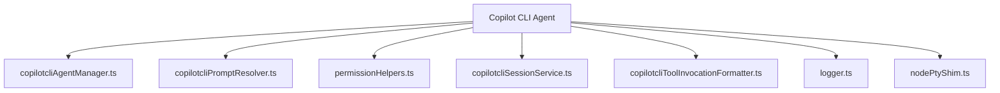
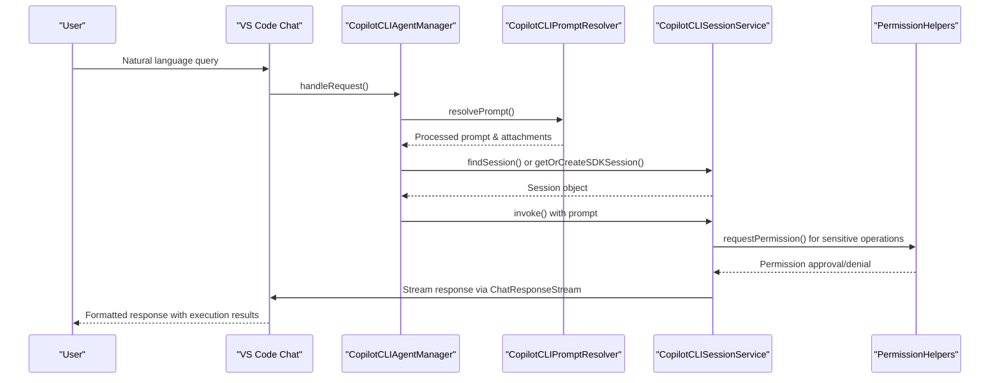
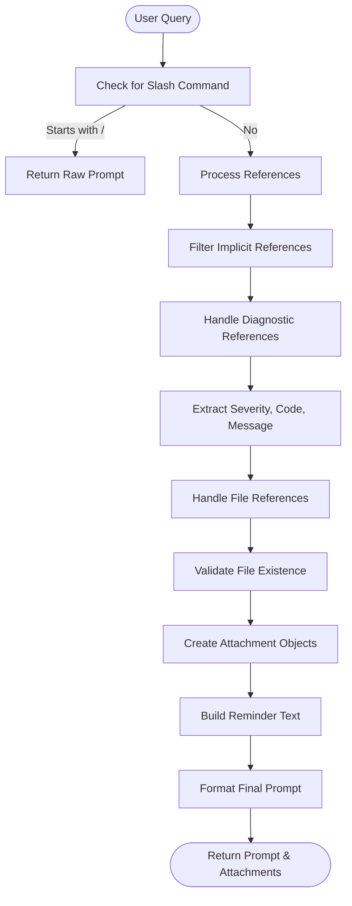
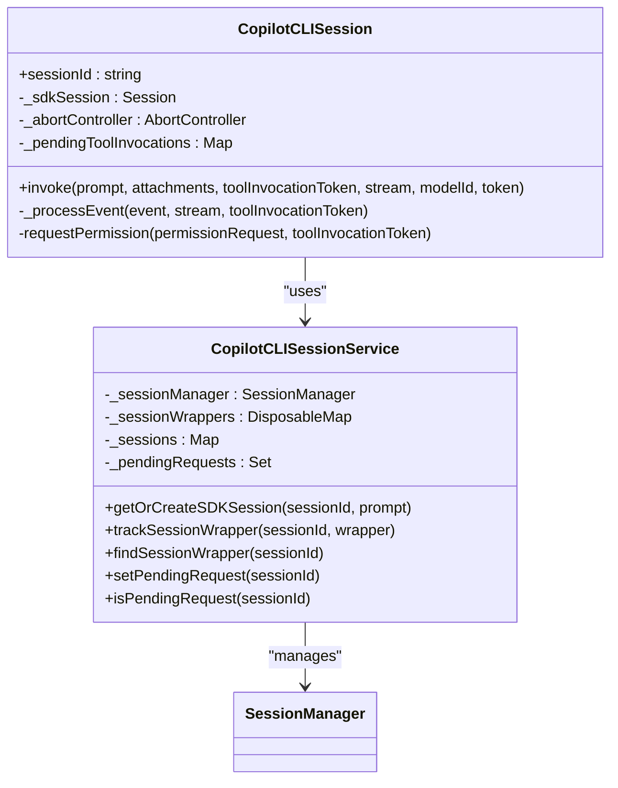
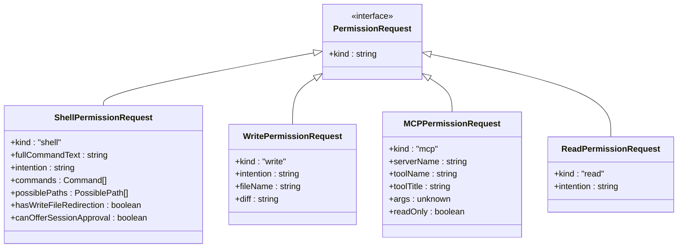
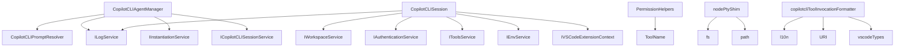

# Copilot CLI Agent

<cite>
**Referenced Files in This Document**   
- [copilotcliAgentManager.ts](file://src/extension/agents/copilotcli/node/copilotcliAgentManager.ts)
- [copilotcliPromptResolver.ts](file://src/extension/agents/copilotcli/node/copilotcliPromptResolver.ts)
- [permissionHelpers.ts](file://src/extension/agents/copilotcli/node/permissionHelpers.ts)
- [copilotcliSessionService.ts](file://src/extension/agents/copilotcli/node/copilotcliSessionService.ts)
- [copilotcliToolInvocationFormatter.ts](file://src/extension/agents/copilotcli/node/copilotcliToolInvocationFormatter.ts)
- [logger.ts](file://src/extension/agents/copilotcli/node/logger.ts)
- [nodePtyShim.ts](file://src/extension/agents/copilotcli/node/nodePtyShim.ts)
</cite>

## Table of Contents
1. [Introduction](#introduction)
2. [Project Structure](#project-structure)
3. [Core Components](#core-components)
4. [Architecture Overview](#architecture-overview)
5. [Detailed Component Analysis](#detailed-component-analysis)
6. [Dependency Analysis](#dependency-analysis)
7. [Performance Considerations](#performance-considerations)
8. [Troubleshooting Guide](#troubleshooting-guide)
9. [Conclusion](#conclusion)

## Introduction
The Copilot CLI Agent is a sophisticated component within the VS Code Copilot Chat extension that enables natural language interaction with command-line tools and system operations. This document provides a comprehensive analysis of its architecture and implementation, focusing on the agent management system, prompt resolution logic, session management, command execution, and security mechanisms. The agent serves as an intelligent interface between user queries and CLI operations, translating natural language requests into executable commands while maintaining security through permission validation.

## Project Structure
The Copilot CLI Agent implementation is organized within the `src/extension/agents/copilotcli/node/` directory of the VS Code Copilot Chat repository. This structure follows a modular design pattern with distinct components for agent management, prompt resolution, session handling, permission management, and tool execution formatting. The architecture separates concerns into specialized modules that work together to process user queries, manage sessions, and execute commands securely.

**Diagram sources**
- [copilotcliAgentManager.ts](file://src/extension/agents/copilotcli/node/copilotcliAgentManager.ts)
- [copilotcliPromptResolver.ts](file://src/extension/agents/copilotcli/node/copilotcliPromptResolver.ts)
- [permissionHelpers.ts](file://src/extension/agents/copilotcli/node/permissionHelpers.ts)

**Section sources**
- [copilotcliAgentManager.ts](file://src/extension/agents/copilotcli/node/copilotcliAgentManager.ts)
- [copilotcliPromptResolver.ts](file://src/extension/agents/copilotcli/node/copilotcliPromptResolver.ts)

## Core Components
The Copilot CLI Agent consists of several core components that work together to process natural language queries and execute CLI operations. The `CopilotCLIAgentManager` serves as the entry point for handling chat requests, managing agent sessions, and coordinating between components. The `CopilotCLIPromptResolver` processes user input and references to create structured prompts for the AI model. The `permissionHelpers` module ensures secure execution by validating permissions for sensitive operations. The `copilotcliSessionService` manages session lifecycle and state, while the `copilotcliToolInvocationFormatter` handles the formatting and presentation of tool execution results.

**Section sources**
- [copilotcliAgentManager.ts](file://src/extension/agents/copilotcli/node/copilotcliAgentManager.ts)
- [copilotcliPromptResolver.ts](file://src/extension/agents/copilotcli/node/copilotcliPromptResolver.ts)
- [permissionHelpers.ts](file://src/extension/agents/copilotcli/node/permissionHelpers.ts)

## Architecture Overview
The Copilot CLI Agent follows a layered architecture that separates concerns into distinct components with well-defined responsibilities. The agent receives user queries through the VS Code chat interface and processes them through a series of stages: prompt resolution, session management, command execution, and response formatting. The architecture is designed to be extensible, allowing for the addition of new tools and capabilities while maintaining security and performance.

**Diagram sources**
- [copilotcliAgentManager.ts](file://src/extension/agents/copilotcli/node/copilotcliAgentManager.ts)
- [copilotcliPromptResolver.ts](file://src/extension/agents/copilotcli/node/copilotcliPromptResolver.ts)
- [permissionHelpers.ts](file://src/extension/agents/copilotcli/node/permissionHelpers.ts)

## Detailed Component Analysis

### Agent Management System
The agent management system is implemented in `copilotcliAgentManager.ts` and serves as the central coordinator for handling chat requests and managing agent sessions. The `CopilotCLIAgentManager` class extends `Disposable` and implements the core logic for processing user queries. It receives chat requests from the VS Code chat interface and coordinates with other components to resolve prompts, manage sessions, and execute commands. The `handleRequest` method is the primary entry point that orchestrates the entire process, from prompt resolution to session invocation.

The agent manager maintains a reference to the `CopilotCLIPromptResolver` for processing user input and references, and uses dependency injection to access logging, instantiation, and session services. When a request is received, the manager first resolves the prompt using the prompt resolver, then either reuses an existing session or creates a new one through the session service. The manager handles both new and existing sessions, setting appropriate flags for pending requests and ensuring proper session tracking.

**Section sources**
- [copilotcliAgentManager.ts](file://src/extension/agents/copilotcli/node/copilotcliAgentManager.ts)

### Prompt Resolution Logic
The prompt resolution logic is implemented in `copilotcliPromptResolver.ts` and is responsible for transforming user queries into structured prompts that can be processed by the AI model. The `CopilotCLIPromptResolver` class processes the raw user input, extracts references to files, diagnostics, and other context, and formats them into a comprehensive prompt that includes relevant context while maintaining clarity.

The resolver handles several types of references, including file attachments, diagnostic information, and location references. It filters out implicit references like instructions while preserving user-provided context. For diagnostic references, it extracts severity, code, and message information to create informative summaries. The resolver also handles file references by validating their existence and creating appropriate attachment objects. The final prompt is enhanced with reminder tags that provide context to the AI model about the references while instructing it to only use relevant information.

**Diagram sources**
- [copilotcliPromptResolver.ts](file://src/extension/agents/copilotcli/node/copilotcliPromptResolver.ts)

**Section sources**
- [copilotcliPromptResolver.ts](file://src/extension/agents/copilotcli/node/copilotcliPromptResolver.ts)

### Session Management and Command Execution
The session management system is implemented across `copilotcliAgentManager.ts` and `copilotcliSessionService.ts`, providing a robust mechanism for maintaining conversation state and executing commands. The `CopilotCLISession` class represents an individual agent session and handles the invocation of commands through the Copilot SDK. Each session maintains its own state, including an abort controller for cancellation, pending tool invocations, and event processing.

The session service provides a centralized management system for all agent sessions, tracking their lifecycle and state. It interfaces with the Copilot SDK's session manager to create, retrieve, and delete sessions as needed. The service also maintains metadata about sessions, including labels, timestamps, and status information. When a new session is created, the service generates an appropriate label based on the first user message or prompt, providing meaningful identification in the UI.

Command execution is handled through the `invoke` method of the `CopilotCLISession` class, which sets up the necessary options for the Copilot SDK, including authentication tokens, working directory, environment variables, and permission request handlers. The method processes events from the SDK and forwards them to the chat response stream, handling different event types such as assistant messages, tool execution start and complete events, and errors.

**Diagram sources**
- [copilotcliAgentManager.ts](file://src/extension/agents/copilotcli/node/copilotcliAgentManager.ts)
- [copilotcliSessionService.ts](file://src/extension/agents/copilotcli/node/copilotcliSessionService.ts)

**Section sources**
- [copilotcliAgentManager.ts](file://src/extension/agents/copilotcli/node/copilotcliAgentManager.ts)
- [copilotcliSessionService.ts](file://src/extension/agents/copilotcli/node/copilotcliSessionService.ts)

### Permission and Security System
The permission and security system is implemented in `permissionHelpers.ts` and plays a critical role in ensuring safe execution of CLI operations. The system uses a declarative approach to map different types of permission requests to appropriate confirmation tools, providing a consistent interface for handling security decisions.

The `getConfirmationToolParams` function is the core of the permission system, mapping different permission request types (shell, write, MCP, read) to specific tool invocations with appropriate parameters. For shell commands, it maps to the `CoreTerminalConfirmationTool`, providing users with a clear view of the command to be executed. For file write operations, it uses the `CoreConfirmationTool` with a descriptive message about the file being modified. The system also handles MCP (Model Context Protocol) tool invocations, providing detailed information about the server, tool, and arguments.

The permission request types are defined with comprehensive metadata that enables informed decision-making. Shell permission requests include the full command text, intention summary, parsed commands, possible file paths, and indicators of write redirection. Write permission requests include the intention, filename, and diff of changes. MCP requests include server name, tool name, title, arguments, and read-only status. This rich metadata allows the UI to present meaningful information to users when requesting permission.

**Diagram sources**
- [permissionHelpers.ts](file://src/extension/agents/copilotcli/node/permissionHelpers.ts)

**Section sources**
- [permissionHelpers.ts](file://src/extension/agents/copilotcli/node/permissionHelpers.ts)

### Integration with VS Code Terminal Service
The integration with the VS Code terminal service is facilitated through the `nodePtyShim.ts` module, which enables the Copilot CLI agent to execute shell commands within the VS Code environment. The shim creates a compatibility layer that allows the Copilot SDK to import and use the `node-pty` library, which is bundled with VS Code but not directly accessible to extensions.

The `ensureNodePtyShim` function creates a dynamic module in the extension's node_modules directory that re-exports the VS Code bundled `node-pty` library. This is necessary because the Copilot SDK has hardcoded imports for `node-pty` that cannot be modified. The shim uses Node.js's `createRequire` function to load the VS Code bundled version at runtime, ensuring compatibility across different environments.

The integration allows the agent to execute shell commands and capture their output, which is then processed and presented to users through the chat interface. The output is formatted using the `copilotcliToolInvocationFormatter` to provide a clear and informative representation of command execution, including success status, error messages, and results.

**Section sources**
- [nodePtyShim.ts](file://src/extension/agents/copilotcli/node/nodePtyShim.ts)
- [copilotcliToolInvocationFormatter.ts](file://src/extension/agents/copilotcli/node/copilotcliToolInvocationFormatter.ts)

## Dependency Analysis
The Copilot CLI Agent has a well-defined dependency structure that follows dependency injection principles. The core components depend on platform services such as logging, authentication, workspace management, and environment services, which are injected through the constructor. This design promotes testability and loose coupling between components.

The agent manager depends on the prompt resolver, log service, instantiation service, and session service. The session depends on various platform services including logging, workspace, authentication, tools, environment, and extension context. The permission helpers have a minimal dependency on tool names, making them easy to test and maintain.

The architecture also includes dynamic dependencies through the use of the Copilot SDK, which is imported at runtime. This approach reduces the static dependency footprint and allows for more flexible version management. The node-pty shim creates a runtime dependency on VS Code's bundled terminal library, enabling shell command execution without requiring a separate installation.

**Diagram sources**
- [copilotcliAgentManager.ts](file://src/extension/agents/copilotcli/node/copilotcliAgentManager.ts)
- [copilotcliPromptResolver.ts](file://src/extension/agents/copilotcli/node/copilotcliPromptResolver.ts)
- [permissionHelpers.ts](file://src/extension/agents/copilotcli/node/permissionHelpers.ts)
- [nodePtyShim.ts](file://src/extension/agents/copilotcli/node/nodePtyShim.ts)
- [copilotcliToolInvocationFormatter.ts](file://src/extension/agents/copilotcli/node/copilotcliToolInvocationFormatter.ts)

**Section sources**
- [copilotcliAgentManager.ts](file://src/extension/agents/copilotcli/node/copilotcliAgentManager.ts)
- [copilotcliPromptResolver.ts](file://src/extension/agents/copilotcli/node/copilotcliPromptResolver.ts)
- [permissionHelpers.ts](file://src/extension/agents/copilotcli/node/permissionHelpers.ts)

## Performance Considerations
The Copilot CLI Agent implementation includes several performance optimizations to ensure responsive user experience. The session service caches sessions locally to avoid repeated calls to the SDK for session retrieval. The prompt resolver processes references in parallel using `Promise.all`, minimizing latency when handling multiple file attachments or diagnostics.

The agent uses streaming responses to provide immediate feedback to users, with the `ChatResponseStream` allowing incremental updates as the AI processes the request. This approach reduces perceived latency and provides users with real-time feedback during longer operations. The event processing in the session class is designed to be efficient, with minimal processing overhead for each event type.

Memory management is handled through the use of disposable patterns, with sessions and other resources properly disposed when no longer needed. The abort controller allows for cancellation of ongoing operations, preventing resource leaks when users interrupt requests. The implementation also includes error handling and logging to help diagnose performance issues and optimize critical paths.

**Section sources**
- [copilotcliAgentManager.ts](file://src/extension/agents/copilotcli/node/copilotcliAgentManager.ts)
- [copilotcliSessionService.ts](file://src/extension/agents/copilotcli/node/copilotcliSessionService.ts)
- [copilotcliPromptResolver.ts](file://src/extension/agents/copilotcli/node/copilotcliPromptResolver.ts)

## Troubleshooting Guide
When encountering issues with the Copilot CLI Agent, several common problems may arise. Permission errors typically occur when the agent attempts to execute commands that require user approval. These can be resolved by carefully reviewing the permission request and approving only commands that are safe and expected. If permission requests are not appearing, check that the `CoreTerminalConfirmationTool` and `CoreConfirmationTool` are properly registered and available.

CLI version compatibility issues may occur if the system has multiple versions of command-line tools installed. Ensure that the PATH environment variable includes the desired tool versions, and consider using full paths in commands when necessary. The agent uses the system's default shell environment, so any environment-specific configurations should be set in the appropriate shell configuration files.

If the agent fails to execute shell commands, verify that the node-pty shim is properly created. Check the extension's node_modules directory for the node-pty shim and ensure that it can access VS Code's bundled node-pty library. Permission issues with file system access may occur if the extension does not have the necessary permissions to read or write files in the workspace.

For debugging purposes, enable verbose logging to capture detailed information about agent operations. The log service provides trace, debug, info, warning, and error levels that can help identify the source of issues. Check the developer console for any JavaScript errors that may indicate problems with the extension's operation.

**Section sources**
- [permissionHelpers.ts](file://src/extension/agents/copilotcli/node/permissionHelpers.ts)
- [nodePtyShim.ts](file://src/extension/agents/copilotcli/node/nodePtyShim.ts)
- [logger.ts](file://src/extension/agents/copilotcli/node/logger.ts)

## Conclusion
The Copilot CLI Agent represents a sophisticated integration of AI capabilities with command-line operations in the VS Code environment. Its modular architecture separates concerns into distinct components that work together to provide a seamless natural language interface for system operations. The agent management system, prompt resolution logic, session handling, and security mechanisms work in concert to deliver a powerful yet safe experience for users.

The implementation demonstrates several best practices in software design, including dependency injection, separation of concerns, and proper resource management. The use of streaming responses and efficient event processing ensures a responsive user experience, while the comprehensive permission system maintains security and user control over operations.

For developers looking to extend the agent with custom CLI commands, the architecture provides clear extension points through the tool system and permission framework. By following the patterns established in the existing code, new capabilities can be added while maintaining the overall integrity and security of the system.