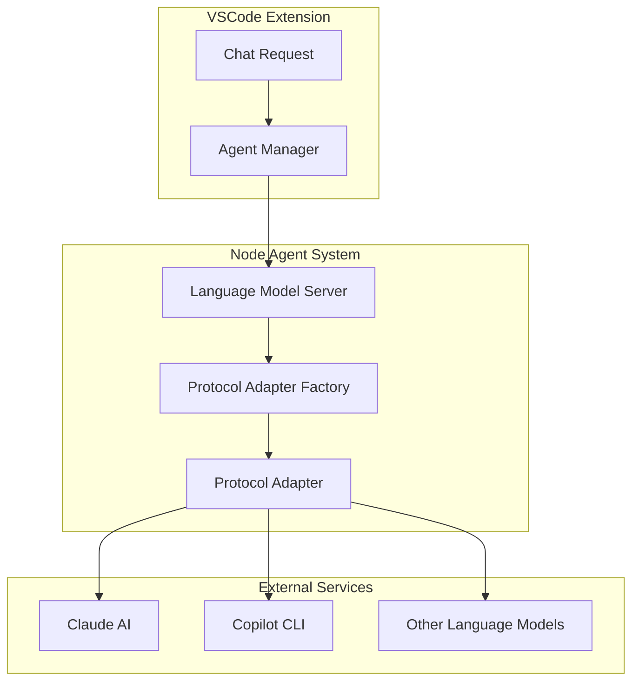
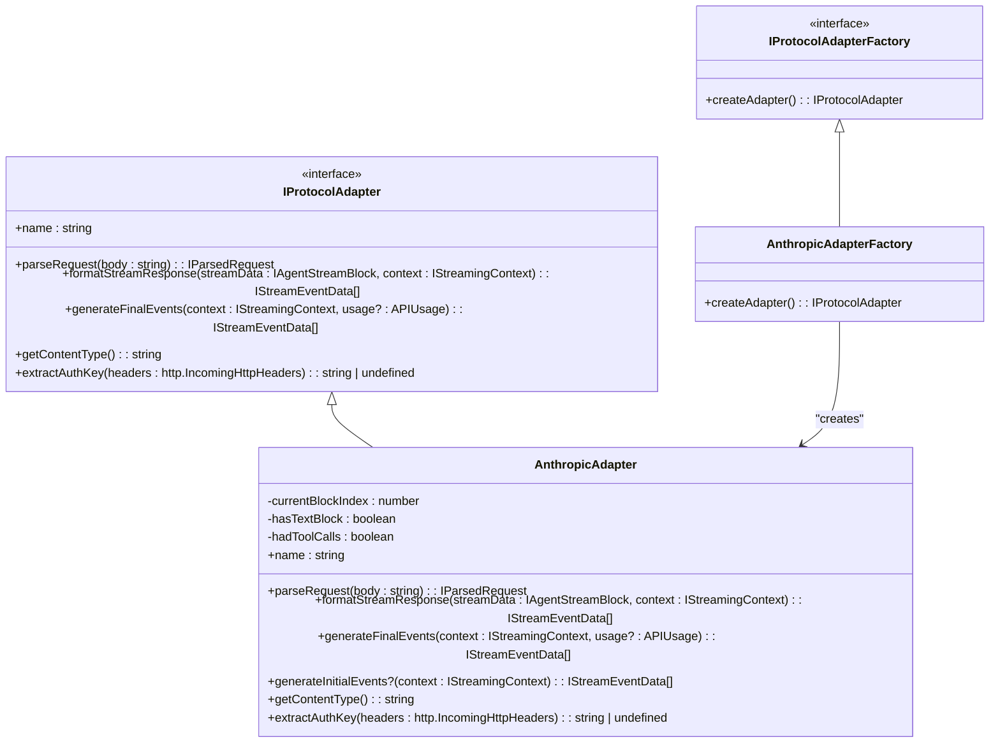
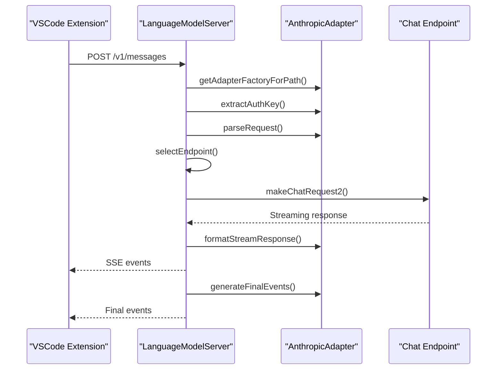
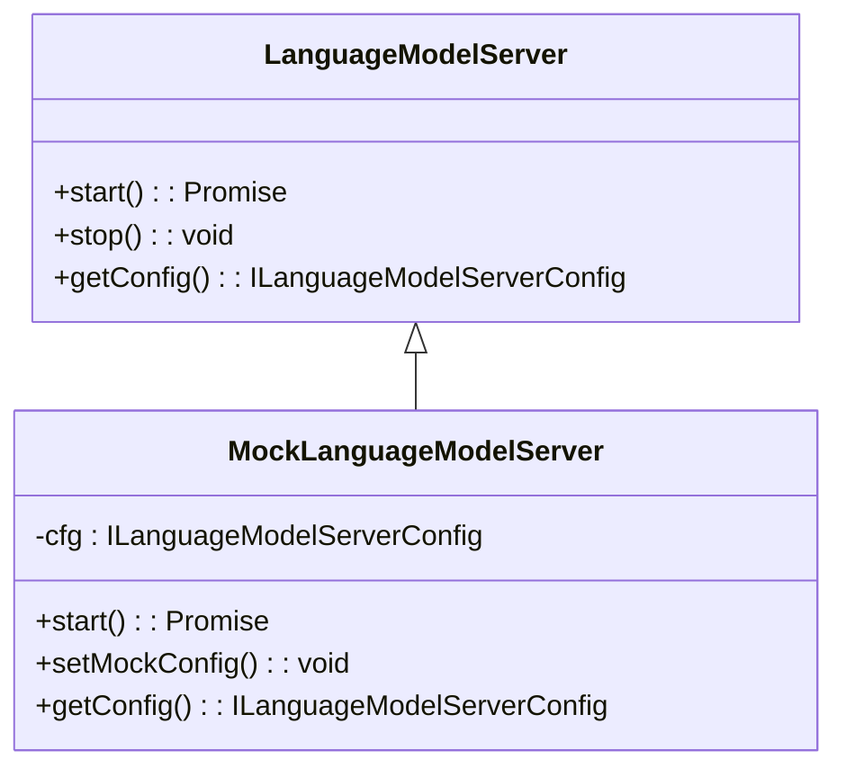

# Node Agent

<cite>
**Referenced Files in This Document**   
- [anthropicAdapter.ts](file://src/extension/agents/node/adapters/anthropicAdapter.ts)
- [types.ts](file://src/extension/agents/node/adapters/types.ts)
- [langModelServer.ts](file://src/extension/agents/node/langModelServer.ts)
- [mockLanguageModelServer.ts](file://src/extension/agents/node/test/mockLanguageModelServer.ts)
- [claudeCodeAgent.ts](file://src/extension/agents/claude/node/claudeCodeAgent.ts)
- [copilotcliAgentManager.ts](file://src/extension/agents/copilotcli/node/copilotcliAgentManager.ts)
</cite>

## Table of Contents
1. [Introduction](#introduction)
2. [Architecture Overview](#architecture-overview)
3. [Adapter Pattern Implementation](#adapter-pattern-implementation)
4. [Type System and Interfaces](#type-system-and-interfaces)
5. [Language Model Server](#language-model-server)
6. [Agent Integration in the Ecosystem](#agent-integration-in-the-ecosystem)
7. [Testing Strategy](#testing-strategy)
8. [Common Issues and Solutions](#common-issues-and-solutions)
9. [Conclusion](#conclusion)

## Introduction
The Node Agent implementation in the VSCode Copilot Chat extension provides a flexible foundation for integrating with various language models through a pluggable adapter system. This document thoroughly explains the architecture and implementation of this system, focusing on the anthropicAdapter and how it enables consistent interaction with different AI services. The agent system serves as a crucial component in the broader agent ecosystem, allowing for seamless integration of multiple AI providers while maintaining a unified interface for the extension.

**Section sources**
- [anthropicAdapter.ts](file://src/extension/agents/node/adapters/anthropicAdapter.ts#L1-L307)
- [langModelServer.ts](file://src/extension/agents/node/langModelServer.ts#L1-L330)

## Architecture Overview



**Diagram sources**
- [langModelServer.ts](file://src/extension/agents/node/langModelServer.ts#L33-L330)
- [anthropicAdapter.ts](file://src/extension/agents/node/adapters/anthropicAdapter.ts#L15-L307)

**Section sources**
- [langModelServer.ts](file://src/extension/agents/node/langModelServer.ts#L33-L330)
- [anthropicAdapter.ts](file://src/extension/agents/node/adapters/anthropicAdapter.ts#L15-L307)

## Adapter Pattern Implementation

The Node Agent system implements the adapter pattern to normalize interactions with different language model providers. The core of this implementation is the `IProtocolAdapter` interface, which defines a contract for converting between the extension's internal format and the specific protocol requirements of each AI service.

The `AnthropicAdapterFactory` creates instances of `AnthropicAdapter`, which handles the specific requirements of the Anthropic API. This adapter is responsible for parsing incoming requests, formatting streaming responses, and generating appropriate events that follow the Server-Sent Events (SSE) protocol. The adapter pattern allows the system to support multiple language models without requiring changes to the core agent logic.



**Diagram sources**
- [types.ts](file://src/extension/agents/node/adapters/types.ts#L37-L82)
- [anthropicAdapter.ts](file://src/extension/agents/node/adapters/anthropicAdapter.ts#L21-L307)

**Section sources**
- [anthropicAdapter.ts](file://src/extension/agents/node/adapters/anthropicAdapter.ts#L15-L307)
- [types.ts](file://src/extension/agents/node/adapters/types.ts#L37-L82)

## Type System and Interfaces

The Node Agent implementation features a well-defined type system that enables pluggable language model providers. The core interfaces are defined in the `types.ts` file and provide a consistent contract for all adapters.

The `IParsedRequest` interface represents a normalized request format that includes the model identifier, messages in the extension's internal format, and any additional options. This abstraction allows the system to handle requests from different sources consistently, regardless of the original format.

The streaming system is built around the `IAgentStreamBlock` type, which can be either text content or a tool call. This union type enables the system to handle both natural language responses and structured tool invocations through the same streaming mechanism.

```mermaid
classDiagram
class IParsedRequest {
+model? : string
+messages : Raw.ChatMessage[]
+options? : IMakeChatRequestOptions['requestOptions']
+type? : string
}
class IStreamEventData {
+event : string
+data : string
}
class IAgentTextBlock {
+type : 'text'
+content : string
}
class IAgentToolCallBlock {
+type : 'tool_call'
+callId : string
+name : string
+input : object
}
class IStreamingContext {
+requestId : string
+endpoint : {
+modelId : string
+modelMaxPromptTokens : number
}
}
IAgentStreamBlock <|-- IAgentTextBlock
IAgentStreamBlock <|-- IAgentToolCallBlock
```

**Diagram sources**
- [types.ts](file://src/extension/agents/node/adapters/types.ts#L11-L91)

**Section sources**
- [types.ts](file://src/extension/agents/node/adapters/types.ts#L11-L91)

## Language Model Server

The `LanguageModelServer` class implements a local HTTP server that acts as a proxy between the extension and various language model providers. This server is responsible for handling authentication, routing requests to the appropriate adapter, and managing the streaming response format.

The server uses a factory pattern to create protocol adapters based on the request path. Currently, it supports the Anthropic API through the `/v1/messages` endpoint, but the architecture allows for easy addition of new adapters for other language models.

When a request is received, the server verifies the authentication nonce, parses the request through the appropriate adapter, and then forwards the normalized request to the selected language model endpoint. The response is streamed back through the adapter, which formats it according to the specific protocol requirements.



**Diagram sources**
- [langModelServer.ts](file://src/extension/agents/node/langModelServer.ts#L33-L330)

**Section sources**
- [langModelServer.ts](file://src/extension/agents/node/langModelServer.ts#L33-L330)

## Agent Integration in the Ecosystem

The Node Agent system integrates with various components in the VSCode Copilot Chat extension through specialized agent managers. The `ClaudeAgentManager` and `CopilotCLIAgentManager` classes demonstrate how different AI services can be integrated using the same underlying infrastructure.

These agent managers handle the lifecycle of agent sessions, including creation, reuse, and cleanup. They also manage the translation between the extension's chat API and the specific requirements of each AI service. For example, the `ClaudeAgentManager` handles the conversion of VSCode chat requests into a format suitable for the Claude Code SDK.

The integration points include authentication services, workspace services, and tool services, allowing agents to access necessary context and capabilities while maintaining security boundaries.

```mermaid
classDiagram
class ClaudeAgentManager {
-langModelServer : LanguageModelServer
-sessions : DisposableMap<string, ClaudeCodeSession>
+handleRequest() : Promise<ChatResult>
}
class CopilotCLIAgentManager {
-promptResolver : CopilotCLIPromptResolver
-sessionService : ICopilotCLISessionService
+handleRequest() : Promise<{ copilotcliSessionId : string | undefined }>
}
class ClaudeCodeSession {
-queryGenerator : Query
-promptQueue : QueuedRequest[]
-currentRequest : CurrentRequest
-abortController : AbortController
+invoke() : Promise<void>
+_startSession() : Promise<void>
+_processMessages() : Promise<void>
}
class CopilotCLISession {
-sdkSession : Session
-abortController : AbortController
-pendingToolInvocations : Map<string, ChatToolInvocationPart>
+invoke() : Promise<void>
+query() : AsyncGenerator<SessionEvent>
}
ClaudeAgentManager --> LanguageModelServer : "uses"
CopilotCLIAgentManager --> CopilotCLIPromptResolver : "uses"
CopilotCLIAgentManager --> ICopilotCLISessionService : "uses"
ClaudeAgentManager --> ClaudeCodeSession : "creates"
CopilotCLIAgentManager --> CopilotCLISession : "creates"
```

**Diagram sources**
- [claudeCodeAgent.ts](file://src/extension/agents/claude/node/claudeCodeAgent.ts#L30-L607)
- [copilotcliAgentManager.ts](file://src/extension/agents/copilotcli/node/copilotcliAgentManager.ts#L25-L235)

**Section sources**
- [claudeCodeAgent.ts](file://src/extension/agents/claude/node/claudeCodeAgent.ts#L30-L607)
- [copilotcliAgentManager.ts](file://src/extension/agents/copilotcli/node/copilotcliAgentManager.ts#L25-L235)

## Testing Strategy

The Node Agent system employs a comprehensive testing strategy that includes unit tests with mocked components and integration tests with real services. The `MockLanguageModelServer` class provides a test double that avoids binding to actual sockets while returning deterministic configuration.

This mock implementation allows for reliable unit testing of agent behavior without requiring network connectivity or external service availability. Tests can verify the correct handling of requests, proper formatting of responses, and appropriate error conditions without the complexity and unpredictability of real network interactions.

The testing approach follows the principle of testing behavior rather than implementation details, focusing on the contract defined by the interfaces rather than the specific internal mechanisms.



**Diagram sources**
- [mockLanguageModelServer.ts](file://src/extension/agents/node/test/mockLanguageModelServer.ts#L12-L22)
- [langModelServer.ts](file://src/extension/agents/node/langModelServer.ts#L33-L330)

**Section sources**
- [mockLanguageModelServer.ts](file://src/extension/agents/node/test/mockLanguageModelServer.ts#L12-L22)

## Common Issues and Solutions

The Node Agent implementation addresses several common challenges in integrating with language models:

1. **Adapter Compatibility**: The system handles differences in model naming and capabilities through the `selectEndpoint` method, which maps requested models to available endpoints with appropriate fallbacks.

2. **Response Format Inconsistencies**: The adapter pattern normalizes response formats across different AI services, ensuring a consistent interface for the rest of the extension.

3. **Context Window Limitations**: The `adjustTokenUsageForContextWindow` method compensates for differences in context window sizes between what the agent assumes and what the actual model supports.

4. **Authentication and Security**: The system uses a nonce-based authentication mechanism to ensure that only authorized components can access the language model server.

5. **Error Handling**: Comprehensive error handling is implemented at multiple levels, from network errors to language model-specific errors, with appropriate fallbacks and user feedback.

These solutions demonstrate the system's robustness in handling the complexities of integrating with multiple AI services while maintaining a clean and consistent interface.

**Section sources**
- [langModelServer.ts](file://src/extension/agents/node/langModelServer.ts#L278-L304)
- [anthropicAdapter.ts](file://src/extension/agents/node/adapters/anthropicAdapter.ts#L227-L259)

## Conclusion
The Node Agent implementation in the VSCode Copilot Chat extension provides a flexible and extensible foundation for integrating with various language models. Through the use of the adapter pattern, a well-defined type system, and a local proxy server, the system enables seamless integration of multiple AI providers while maintaining a consistent interface for the extension.

The architecture supports pluggable language model providers, allowing for easy addition of new services without modifying the core agent logic. The testing strategy with mocked components ensures reliable unit testing of agent behavior, while the comprehensive error handling and compatibility features address common challenges in AI integration.

This implementation serves as a robust foundation for the broader agent ecosystem, enabling the extension to leverage multiple AI services while providing a consistent and reliable experience for users.