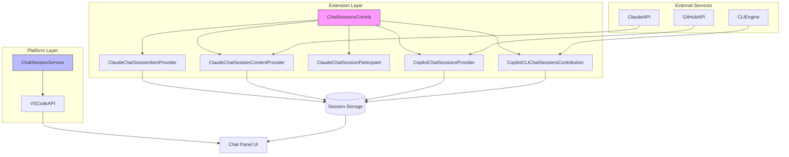
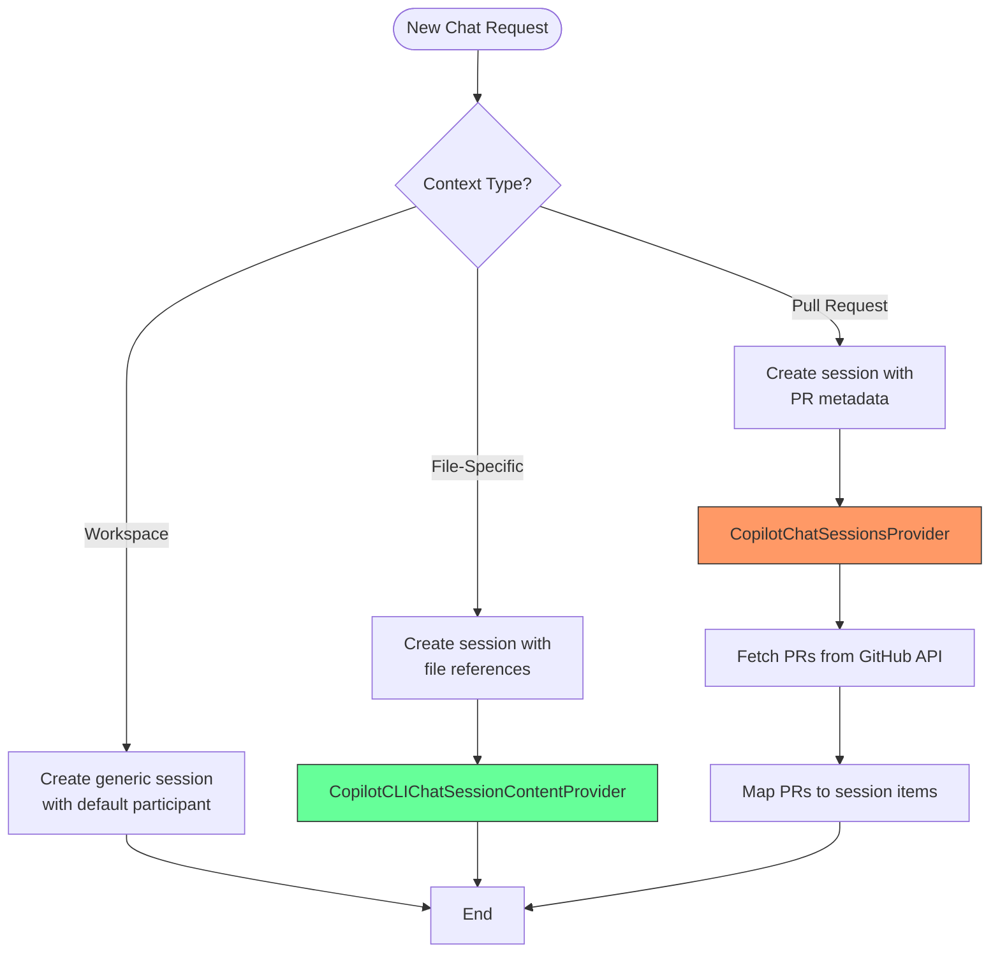
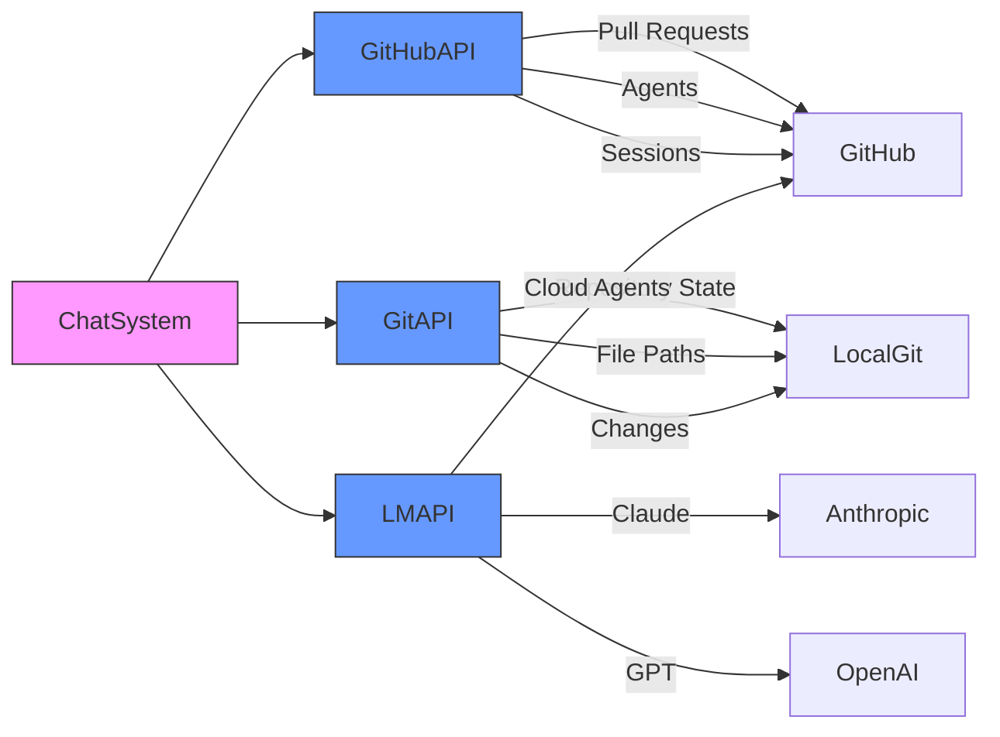

# Chat Sessions

<cite>
**Referenced Files in This Document**   
- [chatSessions.ts](file://src/extension/chatSessions/vscode-node/chatSessions.ts)
- [claudeChatSessionContentProvider.ts](file://src/extension/chatSessions/vscode-node/claudeChatSessionContentProvider.ts)
- [claudeChatSessionItemProvider.ts](file://src/extension/chatSessions/vscode-node/claudeChatSessionItemProvider.ts)
- [claudeChatSessionParticipant.ts](file://src/extension/chatSessions/vscode-node/claudeChatSessionParticipant.ts)
- [copilotCloudSessionsProvider.ts](file://src/extension/chatSessions/vscode-node/copilotCloudSessionsProvider.ts)
- [copilotCLIChatSessionsContribution.ts](file://src/extension/chatSessions/vscode-node/copilotCLIChatSessionsContribution.ts)
- [pullRequestFileChangesService.ts](file://src/extension/chatSessions/vscode-node/pullRequestFileChangesService.ts)
- [chatSessionService.ts](file://src/platform/chat/common/chatSessionService.ts)
- [chatSessionService.ts](file://src/platform/chat/vscode/chatSessionService.ts)
- [chatSessionsUriHandler.ts](file://src/extension/chatSessions/vscode/chatSessionsUriHandler.ts)
- [vscode.proposed.chatSessionsProvider.d.ts](file://src/extension/vscode.proposed.chatSessionsProvider.d.ts)
</cite>

## Table of Contents
1. [Introduction](#introduction)
2. [Architecture Overview](#architecture-overview)
3. [Core Components](#core-components)
4. [Session Creation and Management](#session-creation-and-management)
5. [Domain Model for Chat Sessions](#domain-model-for-chat-sessions)
6. [Context-Specific Session Handling](#context-specific-session-handling)
7. [Configuration Options](#configuration-options)
8. [Integration with External Systems](#integration-with-external-systems)
9. [Error Handling and Troubleshooting](#error-handling-and-troubleshooting)
10. [Extensibility and Advanced Integration](#extensibility-and-advanced-integration)

## Introduction

The Chat Sessions sub-component of the Extension Layer provides a comprehensive system for managing user interactions within the chat panel. This documentation details the implementation of conversation management, covering session creation, persistence, and state management across various contexts including workspace chats, file-specific conversations, and pull request discussions. The architecture is designed to support multiple chat participants including Claude Code, Copilot CLI, and cloud-based agents, with extensible interfaces for future participants.

The system leverages VS Code's proposed chat sessions API to provide a unified interface for chat session management while maintaining compatibility with different backend services and providers. It handles both local and remote session state, with mechanisms for synchronization, persistence, and recovery from various error conditions.

**Section sources**
- [chatSessions.ts](file://src/extension/chatSessions/vscode-node/chatSessions.ts#L1-L187)
- [vscode.proposed.chatSessionsProvider.d.ts](file://src/extension/vscode.proposed.chatSessionsProvider.d.ts#L1-L50)

## Architecture Overview

The chat session system follows a modular architecture with clear separation of concerns between session management, content provision, and participant handling. The core components work together through well-defined interfaces to provide a seamless chat experience.



**Diagram sources**
- [chatSessions.ts](file://src/extension/chatSessions/vscode-node/chatSessions.ts#L48-L187)
- [chatSessionService.ts](file://src/platform/chat/common/chatSessionService.ts#L9-L15)

## Core Components

The chat session system comprises several core components that work together to manage conversation state and user interactions. These components include session providers, content providers, participants, and supporting services.

The system implements the VS Code chat session interfaces through concrete classes that handle specific aspects of chat management. The `ChatSessionsContrib` class serves as the main contribution point, registering various session types and their corresponding providers. Each chat participant type (Claude, Copilot CLI, cloud agents) has its own set of provider classes that implement the necessary interfaces for session item management, content provision, and request handling.

Session state is managed through a combination of in-memory state and persistent storage, with mechanisms for synchronization between different components. The architecture supports multiple concurrent sessions of different types, with each session maintaining its own context and history.

**Section sources**
- [chatSessions.ts](file://src/extension/chatSessions/vscode-node/chatSessions.ts#L48-L187)
- [copilotCloudSessionsProvider.ts](file://src/extension/chatSessions/vscode-node/copilotCloudSessionsProvider.ts#L60-L800)
- [copilotCLIChatSessionsContribution.ts](file://src/extension/chatSessions/vscode-node/copilotCLIChatSessionsContribution.ts#L76-L417)

## Session Creation and Management

Session creation and management in the chat system follows a standardized pattern across different participant types. When a new chat session is initiated, the system creates a unique session identifier and associates it with the appropriate participant type. The session lifecycle is managed through a series of well-defined states including creation, active interaction, and completion.

For Claude Code sessions, the `ClaudeChatSessionItemProvider` handles session discovery by reading from the local file system at `~/.claude/projects/<folder-slug>/`, where each file represents a session with its name as a GUID. The provider implements the `provideChatSessionItems` method to enumerate available sessions and the `refresh` method to update the session list when changes occur.

Session management includes operations such as:
- Session creation with unique identifiers
- Session persistence to storage
- Session state tracking (active, completed, failed)
- Session cleanup and disposal
- Synchronization between UI and backend state

The system uses URI schemes to identify different session types, with schemes like `claude-code`, `copilotcli`, and `copilot-cloud-agent` providing namespace separation for different participant types.

```mermaid
sequenceDiagram
participant User
participant UI as Chat Panel UI
participant CSP as ChatSessionsContrib
participant Provider as SessionItemProvider
participant Service as SessionService
User->>UI : Start new chat session
UI->>CSP : Create session request
CSP->>Provider : Register session provider
Provider->>Service : Create session record
Service-->>Provider : Session ID
Provider-->>CSP : Session item
CSP-->>UI : Session reference
UI-->>User : Chat interface
User->>UI : Send message
UI->>CSP : Handle request
CSP->>Participant : Process request
Participant->>Service : Update session state
Service-->>Participant : Confirmation
Participant-->>UI : Response stream
UI-->>User : Display response
```

**Diagram sources**
- [claudeChatSessionItemProvider.ts](file://src/extension/chatSessions/vscode-node/claudeChatSessionItemProvider.ts#L15-L53)
- [chatSessions.ts](file://src/extension/chatSessions/vscode-node/chatSessions.ts#L63-L83)
- [copilotCLIChatSessionsContribution.ts](file://src/extension/chatSessions/vscode-node/copilotCLIChatSessionsContribution.ts#L76-L117)

## Domain Model for Chat Sessions

The domain model for chat sessions is built around several key interfaces and classes that define the structure and behavior of conversations. At the core is the `vscode.ChatSessionItem` interface, which represents a chat session in the UI with properties like resource URI, label, tooltip, timing, and status.

Each session type implements specific variations of this model:
- **Claude Code sessions**: Use the `claude-code` scheme with session IDs as GUIDs
- **Copilot CLI sessions**: Use the `copilotcli` scheme with session-specific URIs
- **Cloud agent sessions**: Use the `copilot-cloud-agent` scheme with pull request numbers as identifiers

The session content model includes:
- Request/response turns with text, markdown, and tool invocation parts
- Session history with chronological ordering
- Metadata including timestamps and status indicators
- Contextual information for different conversation types

For pull request discussions, the system extends the base session model with additional properties like pull request details, author information, and repository context. This allows the chat interface to display rich information about associated pull requests and provide contextual actions.

```mermaid
classDiagram
class ChatSessionItem {
+resource : Uri
+label : string
+tooltip : string
+timing : ChatSessionTiming
+status : ChatSessionStatus
+iconPath : Uri | ThemeIcon
+description : string | MarkdownString
}
class ChatSession {
+history : (ChatRequestTurn2 | ChatResponseTurn2)[]
+options : { [optionId : string] : string }
+activeResponseCallback : function
+requestHandler : ChatExtendedRequestHandler
}
class ChatRequestTurn2 {
+message : string
+prompt : string
+references : ChatPromptReference[]
+context : ChatContext
+command : string
+commandArgs : any[]
}
class ChatResponseTurn2 {
+parts : ChatResponsePart[]
+metadata : any
+errorDetails : ChatResultErrorDetails
}
class ChatResponsePart {
<<abstract>>
}
class ChatResponseMarkdownPart {
+value : MarkdownString
}
class ChatResponseToolInvocationPart {
+toolName : string
+args : any[]
+result : any
}
class ChatResponsePullRequestPart {
+uri : Uri
+title : string
+body : string
+author : string
+linkTag : string
}
class ChatResponseMultiDiffPart {
+diffEntries : ChatResponseDiffEntry[]
+title : string
+readOnly : boolean
}
ChatSessionItem --> ChatSession : "contains"
ChatSession --> ChatRequestTurn2 : "has"
ChatSession --> ChatResponseTurn2 : "has"
ChatResponseTurn2 --> ChatResponsePart : "contains"
ChatResponsePart <|-- ChatResponseMarkdownPart
ChatResponsePart <|-- ChatResponseToolInvocationPart
ChatResponsePart <|-- ChatResponsePullRequestPart
ChatResponsePart <|-- ChatResponseMultiDiffPart
```

**Diagram sources**
- [vscode.proposed.chatSessionsProvider.d.ts](file://src/extension/vscode.proposed.chatSessionsProvider.d.ts#L1-L50)
- [copilotCloudSessionsProvider.ts](file://src/extension/chatSessions/vscode-node/copilotCloudSessionsProvider.ts#L60-L800)
- [claudeChatSessionContentProvider.ts](file://src/extension/chatSessions/vscode-node/claudeChatSessionContentProvider.ts#L20-L126)

## Context-Specific Session Handling

The chat session system provides specialized handling for different conversation contexts, including workspace chats, file-specific discussions, and pull request collaborations. Each context type has its own session management logic and UI presentation.

### Workspace Chats
Workspace chats are general-purpose conversations that are not tied to specific files or pull requests. These sessions use the default participant type and maintain their state independently of other workspace elements. The system creates a new session with a unique identifier when a user opens a new chat panel.

### File-Specific Chats
File-specific chats are associated with particular files in the workspace. When a user initiates a chat from a file context, the system creates a session that includes references to the relevant file. The `CopilotCLIChatSessionContentProvider` handles these sessions by including file references in the session context and maintaining awareness of the associated file's state.

### Pull Request Discussions
Pull request discussions are tightly integrated with GitHub's pull request system. The `CopilotChatSessionsProvider` manages these sessions by:
- Synchronizing with GitHub's API to discover open pull requests
- Creating session items for each relevant pull request
- Displaying pull request metadata in the chat interface
- Providing actions to open pull requests in the browser or VS Code

For pull request sessions, the system uses the pull request number as the session identifier and maintains a mapping between session resources and pull request details. When a user interacts with a pull request session, the system can stream logs from the associated agent job and display file changes through the `PullRequestFileChangesService`.



**Diagram sources**
- [copilotCloudSessionsProvider.ts](file://src/extension/chatSessions/vscode-node/copilotCloudSessionsProvider.ts#L134-L209)
- [copilotCLIChatSessionsContribution.ts](file://src/extension/chatSessions/vscode-node/copilotCLIChatSessionsContribution.ts#L133-L179)
- [pullRequestFileChangesService.ts](file://src/extension/chatSessions/vscode-node/pullRequestFileChangesService.ts#L22-L84)

## Configuration Options

The chat session system provides several configuration options that control session behavior and user preferences. These options are exposed through the chat interface and can be modified on a per-session basis.

### Model Selection
For Copilot CLI sessions, users can select the language model to use through the model option group. The available models include:
- Claude Sonnet 4.5
- Claude Sonnet 4
- GPT-5

The selected model is stored in the session context and persisted to the user's global state using the `COPILOT_CLI_MODEL_MEMENTO_KEY`. This allows the system to remember the user's preference across sessions.

### Agent Selection
For cloud agent sessions, users can select which agent to use through the agents option group. The system fetches available custom agents from the GitHub API and presents them as selectable options. The default agent is always available, with custom agents listed below it.

### Session Persistence
Session state is persisted to storage with the following characteristics:
- Session metadata (ID, label, timestamp) is stored persistently
- Session history is maintained across VS Code restarts
- Model preferences are stored in global state
- Session status is updated in real-time

The configuration system uses VS Code's settings and state management APIs to store user preferences and session data. The `provideChatSessionProviderOptions` method returns the available options for a session type, while `provideHandleOptionsChange` processes changes to those options.

**Section sources**
- [copilotCLIChatSessionsContribution.ts](file://src/extension/chatSessions/vscode-node/copilotCLIChatSessionsContribution.ts#L134-L211)
- [copilotCloudSessionsProvider.ts](file://src/extension/chatSessions/vscode-node/copilotCloudSessionsProvider.ts#L89-L118)

## Integration with External Systems

The chat session system integrates with several external systems to provide enhanced functionality and context awareness. These integrations are implemented through service interfaces and API clients that abstract the underlying implementation details.

### GitHub Integration
The system integrates with GitHub through the `IOctoKitService` interface, which provides access to GitHub's API for:
- Pull request management
- Repository information
- Custom agent configuration
- Session state synchronization

The `CopilotChatSessionsProvider` uses this service to fetch pull requests, create new sessions, and update session state based on GitHub events.

### Git Integration
Git integration is provided through the `IGitService` and `IGitExtensionService` interfaces, which allow the system to:
- Detect repository state
- Identify uncommitted changes
- Provide file path resolution
- Support version control operations

The system uses git integration to warn users about uncommitted changes when delegating tasks to cloud agents, ensuring that the agent works with the intended code state.

### Language Model Services
The system integrates with language model services through participant-specific implementations:
- Claude Code uses the Anthropic SDK
- Copilot CLI supports multiple models through configuration
- Cloud agents use GitHub's agent infrastructure

These integrations are abstracted through service interfaces that allow for easy replacement or extension of the underlying models.



**Diagram sources**
- [copilotCloudSessionsProvider.ts](file://src/extension/chatSessions/vscode-node/copilotCloudSessionsProvider.ts#L74-L81)
- [pullRequestFileChangesService.ts](file://src/extension/chatSessions/vscode-node/pullRequestFileChangesService.ts#L25-L30)
- [chatSessions.ts](file://src/extension/chatSessions/vscode-node/chatSessions.ts#L7-L9)

## Error Handling and Troubleshooting

The chat session system implements comprehensive error handling to ensure reliability and provide meaningful feedback to users. Errors are categorized and handled at multiple levels of the system.

### Common Issues
The system addresses several common issues that can affect chat sessions:

#### Session Data Corruption
Session data corruption is prevented through:
- Atomic file operations for session storage
- Validation of session data on load
- Fallback mechanisms for corrupted sessions
- Regular cleanup of stale session data

When session data corruption is detected, the system logs the error and attempts to recover by creating a new session or loading from backup data.

#### Synchronization Problems
Synchronization problems between the UI and backend are handled through:
- Event-driven updates using `onDidChangeChatSessionItems`
- Polling mechanisms for remote state
- Conflict resolution strategies
- Retry logic for failed operations

The system uses the `refresh` method on session providers to force synchronization when needed, and implements debounce mechanisms to prevent excessive updates.

### Error Recovery
The system implements several error recovery strategies:
- Automatic retry of failed API calls with exponential backoff
- Graceful degradation when services are unavailable
- User notifications for critical errors
- Diagnostic logging for troubleshooting

Error handling is implemented consistently across components using try-catch blocks and promise rejection handlers. Errors are logged through the `ILogService` interface with appropriate severity levels, and user-facing messages are localized using VS Code's localization system.

**Section sources**
- [copilotCloudSessionsProvider.ts](file://src/extension/chatSessions/vscode-node/copilotCloudSessionsProvider.ts#L782-L788)
- [pullRequestFileChangesService.ts](file://src/extension/chatSessions/vscode-node/pullRequestFileChangesService.ts#L79-L81)
- [chatSessions.ts](file://src/extension/chatSessions/vscode-node/chatSessions.ts#L174-L176)

## Extensibility and Advanced Integration

The chat session system is designed with extensibility in mind, allowing for integration with external systems and customization of behavior. The architecture follows dependency injection principles, making it easy to replace or extend components.

### Service Interfaces
The system defines several service interfaces that can be implemented by external systems:
- `IChatSessionService`: Core session management
- `IPullRequestFileChangesService`: Pull request file change handling
- `ICopilotCLITerminalIntegration`: Terminal integration for CLI sessions

These interfaces allow external systems to integrate with the chat session functionality without modifying the core codebase.

### Participant Extension
New chat participants can be added by implementing the following components:
- Session item provider (`ChatSessionItemProvider`)
- Content provider (`ChatSessionContentProvider`)
- Participant handler (`ChatExtendedRequestHandler`)
- Optional contribution class

The `ChatSessionsContrib` class demonstrates how to register new participants through the `vscode.chat.registerChatSessionItemProvider` and `vscode.chat.registerChatSessionContentProvider` APIs.

### URI Handling
The system supports custom URI schemes for session types, allowing for deep linking and programmatic session access. The `chatSessionsUriHandler.ts` file implements URI handling for chat sessions, enabling features like:
- Opening specific sessions via URL
- Deep linking to session content
- Integration with external tools

This extensibility model allows the system to support new chat participants and integration scenarios while maintaining a consistent user experience across different session types.

**Section sources**
- [chatSessionService.ts](file://src/platform/chat/common/chatSessionService.ts#L9-L15)
- [chatSessionService.ts](file://src/platform/chat/vscode/chatSessionService.ts#L10-L16)
- [chatSessionsUriHandler.ts](file://src/extension/chatSessions/vscode/chatSessionsUriHandler.ts#L1-L50)
- [pullRequestFileChangesService.ts](file://src/extension/chatSessions/vscode-node/pullRequestFileChangesService.ts#L15-L20)