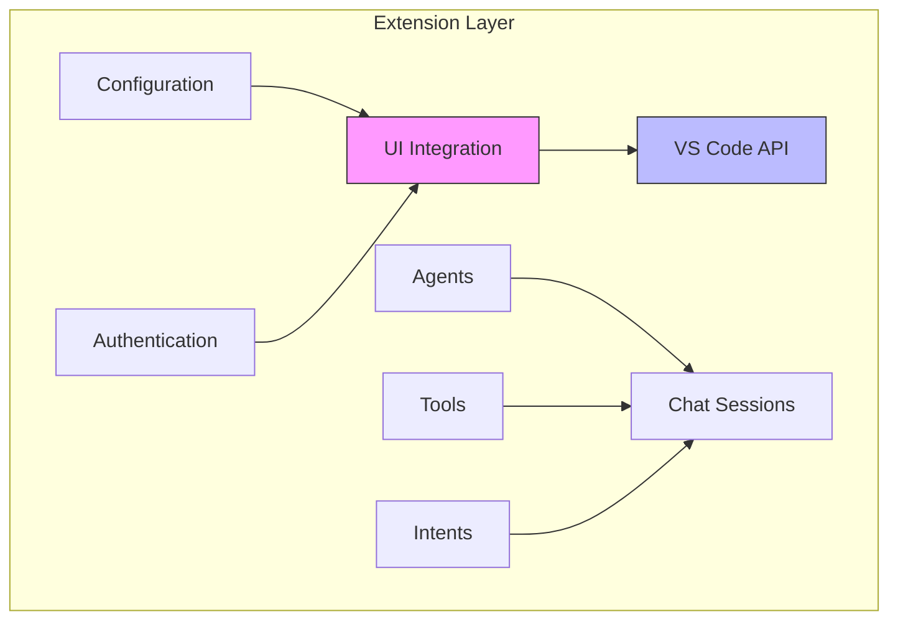
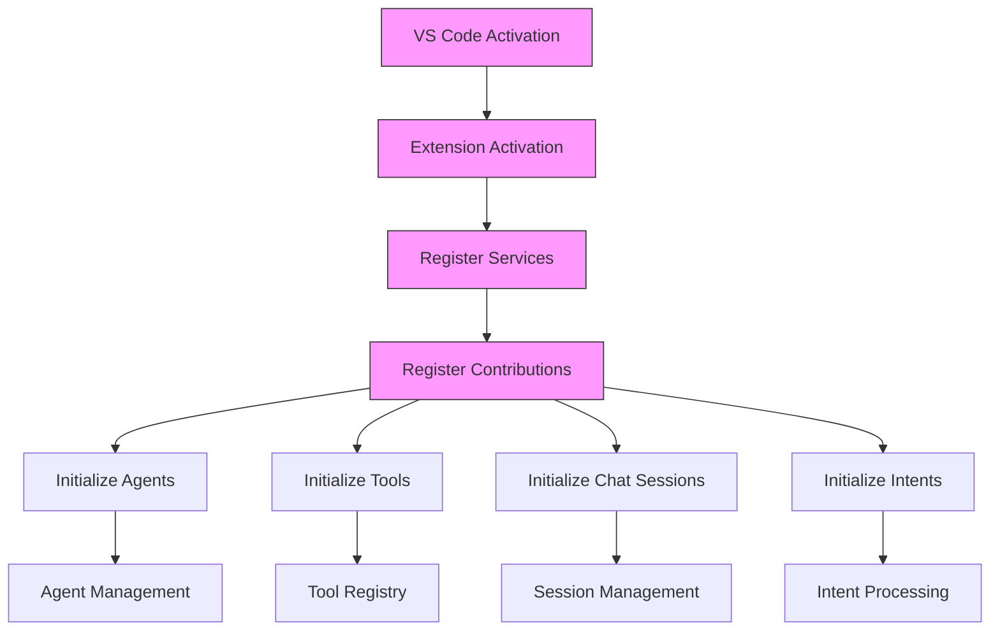
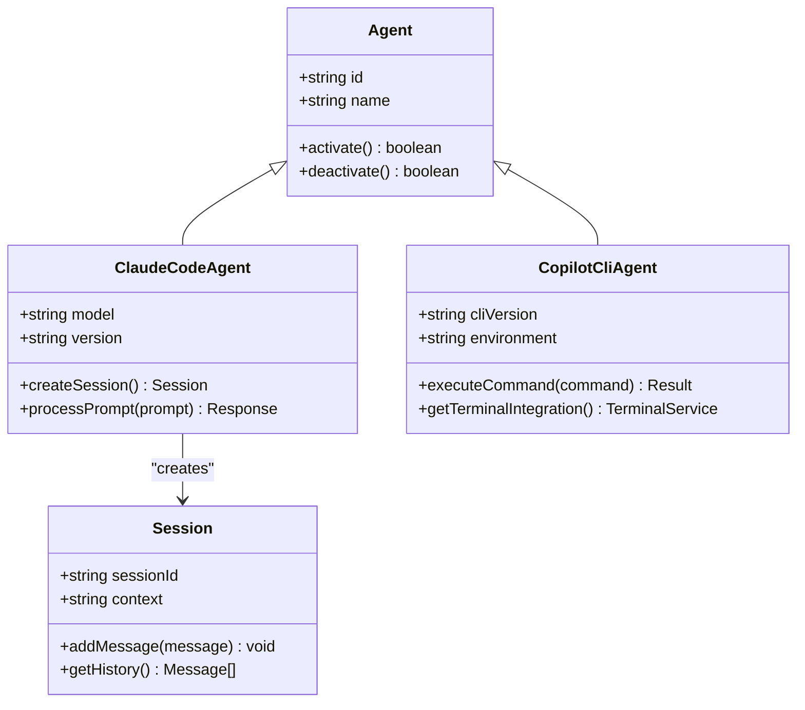
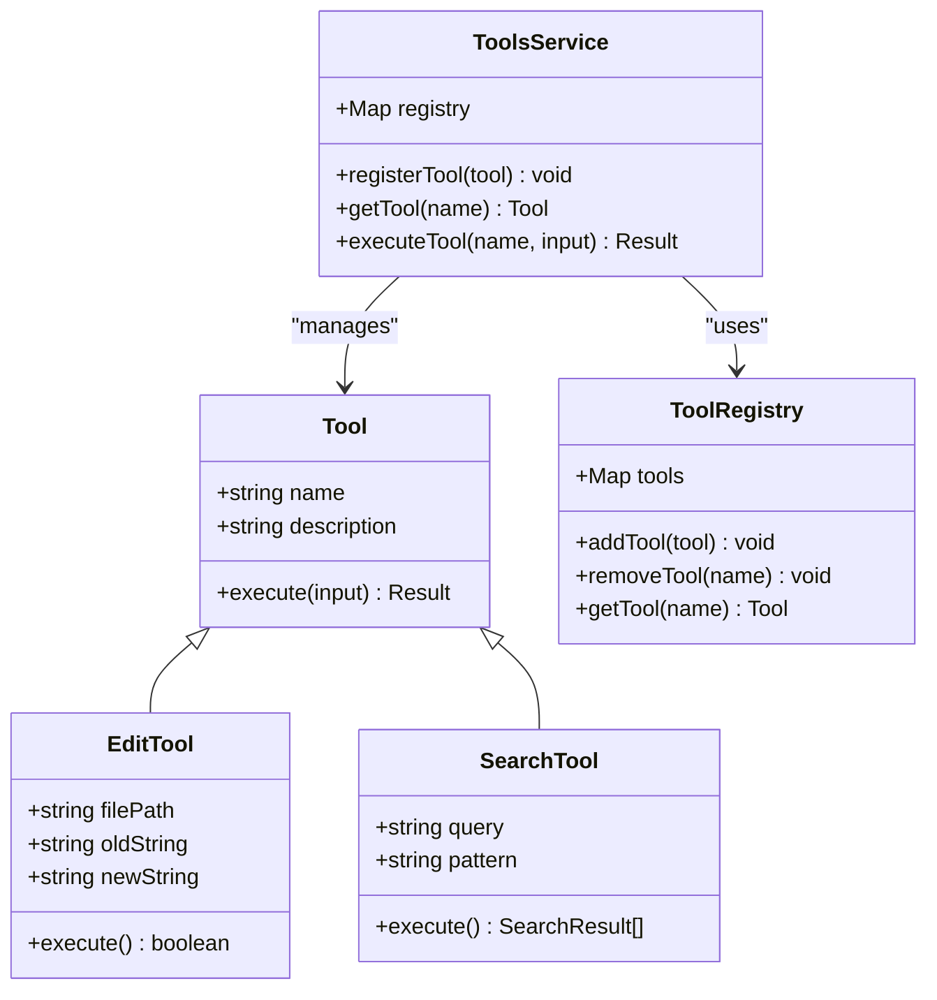
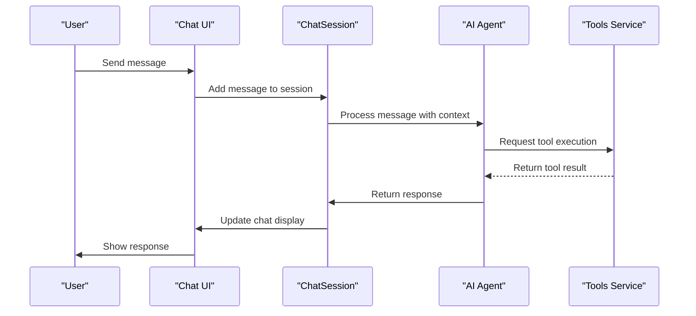
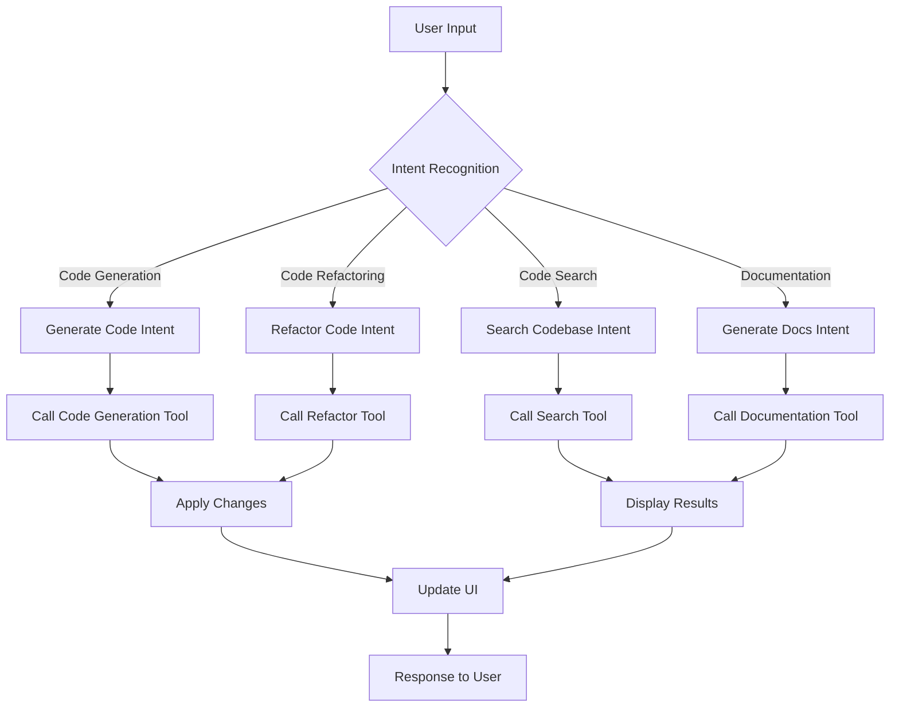
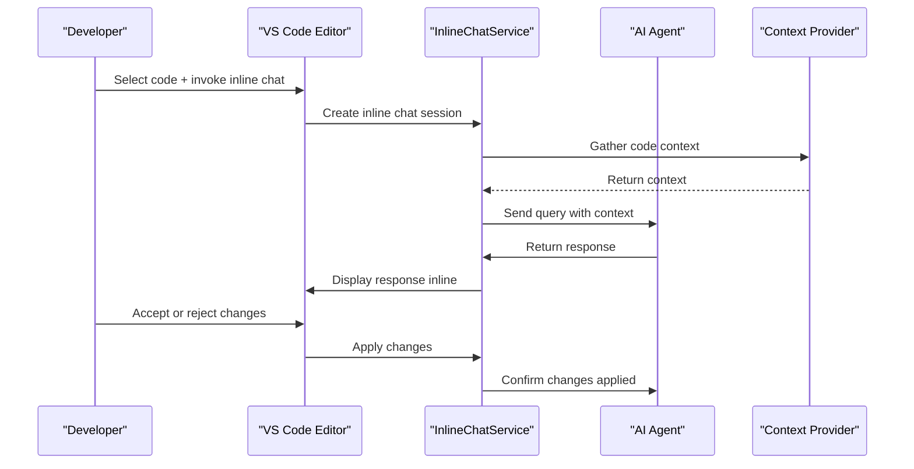
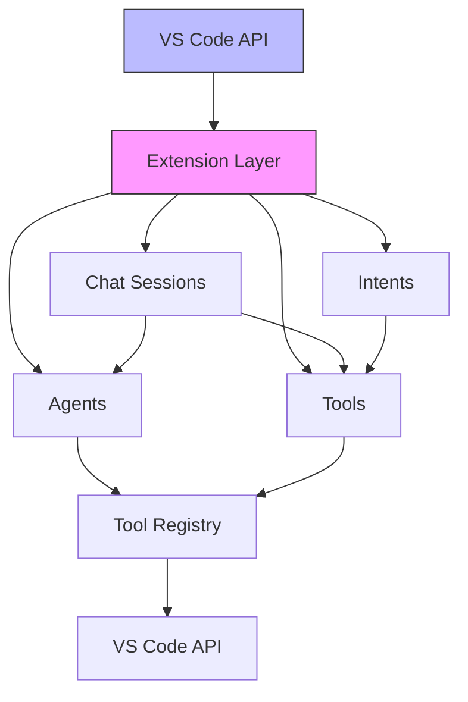

# Extension Layer

<cite>
**Referenced Files in This Document**   
- [package.json](file://package.json)
- [extension.ts](file://src/extension/extension/vscode-node/extension.ts)
- [contributions.ts](file://src/extension/common/contributions.ts)
- [extensionApi.ts](file://src/extension/api/vscode/extensionApi.ts)
- [claudeCodeAgent.ts](file://src/extension/agents/claude/node/claudeCodeAgent.ts)
- [toolsService.ts](file://src/extension/tools/common/toolsService.ts)
- [chatSessions.ts](file://src/extension/chatSessions/vscode-node/chatSessions.ts)
- [intentService.ts](file://src/extension/intents/node/intentService.ts)
- [inlineChatService.ts](file://src/extension/inlineChat/node/inlineChatService.ts)
</cite>

## Table of Contents
1. [Introduction](#introduction)
2. [Project Structure](#project-structure)
3. [Core Components](#core-components)
4. [Architecture Overview](#architecture-overview)
5. [Detailed Component Analysis](#detailed-component-analysis)
6. [Dependency Analysis](#dependency-analysis)
7. [Performance Considerations](#performance-considerations)
8. [Troubleshooting Guide](#troubleshooting-guide)
9. [Conclusion](#conclusion)

## Introduction
The Extension Layer of GitHub Copilot Chat serves as the UI and VS Code integration layer, responsible for user interaction and editor integration. This layer implements a plugin/extension pattern for different AI models and uses an event-driven architecture with activation events to manage interactions. It integrates with VS Code through the Extension API, handling activation events, contribution points, and UI elements such as the chat panel and inline chat. The architecture is designed to support various AI assistant implementations (agents), code manipulation capabilities (tools), conversation management (chat sessions), and user command processing (intents).

## Project Structure
The project structure follows a modular approach with clear separation of concerns. The core extension logic resides in the `src/extension` directory, which contains various subcomponents organized by functionality. The architecture supports multiple runtime environments (vscode, vscode-node, vscode-worker) and follows a layered design pattern with distinct components for agents, tools, chat sessions, and intents.

**Diagram sources**
- [package.json](file://package.json#L81-L87)
- [extension.ts](file://src/extension/extension/vscode-node/extension.ts)

**Section sources**
- [package.json](file://package.json#L1-L800)
- [extension.ts](file://src/extension/extension/vscode-node/extension.ts#L1-L44)

## Core Components
The Extension Layer consists of several core components that work together to provide AI-powered coding assistance within VS Code. These components include agents (AI assistant implementations), tools (code manipulation capabilities), chat sessions (conversation management), and intents (user command processing). The layer integrates with VS Code through the Extension API, handling activation events, contribution points, and UI elements like the chat panel and inline chat.

**Section sources**
- [package.json](file://package.json#L140-L750)
- [extension.ts](file://src/extension/extension/vscode-node/extension.ts#L35-L43)

## Architecture Overview
The Extension Layer follows an event-driven architecture with activation events that trigger various components. The architecture uses a plugin/extension pattern for different AI models, allowing for extensibility and support for multiple AI providers. The layer integrates with VS Code through the Extension API, handling activation events, contribution points, and UI elements.

**Diagram sources**
- [extension.ts](file://src/extension/extension/vscode-node/extension.ts#L35-L43)
- [contributions.ts](file://src/extension/common/contributions.ts#L33-L54)

## Detailed Component Analysis

### Agents Analysis
Agents represent AI assistant implementations that can perform various coding tasks. The architecture supports multiple agent types, including Claude and Copilot CLI agents. Each agent type has its own implementation with specific capabilities and integration points.

**Diagram sources**
- [claudeCodeAgent.ts](file://src/extension/agents/claude/node/claudeCodeAgent.ts)
- [copilotcliAgentManager.ts](file://src/extension/agents/copilotcli/node/copilotcliAgentManager.ts)

**Section sources**
- [claudeCodeAgent.ts](file://src/extension/agents/claude/node/claudeCodeAgent.ts#L1-L200)
- [copilotcliAgentManager.ts](file://src/extension/agents/copilotcli/node/copilotcliAgentManager.ts#L1-L150)

### Tools Analysis
Tools provide code manipulation capabilities that agents can use to interact with the codebase. The tools system follows a registry pattern where tools are registered and made available to agents through the Extension API.

**Diagram sources**
- [toolsService.ts](file://src/extension/tools/common/toolsService.ts)
- [toolNames.ts](file://src/extension/tools/common/toolNames.ts)

**Section sources**
- [toolsService.ts](file://src/extension/tools/common/toolsService.ts#L1-L300)
- [toolNames.ts](file://src/extension/tools/common/toolNames.ts#L1-L50)

### Chat Sessions Analysis
Chat sessions manage conversations between users and AI assistants. The session system handles context preservation, message history, and integration with VS Code UI elements.

**Diagram sources**
- [chatSessions.ts](file://src/extension/chatSessions/vscode-node/chatSessions.ts)
- [chatSessionsUriHandler.ts](file://src/extension/chatSessions/vscode/chatSessionsUriHandler.ts)

**Section sources**
- [chatSessions.ts](file://src/extension/chatSessions/vscode-node/chatSessions.ts#L1-L250)
- [chatSessionsUriHandler.ts](file://src/extension/chatSessions/vscode/chatSessionsUriHandler.ts#L1-L100)

### Intents Analysis
Intents handle user command processing, translating natural language commands into specific actions within the IDE.

**Diagram sources**
- [intentService.ts](file://src/extension/intents/node/intentService.ts)
- [newNotebookIntent.contribution.ts](file://src/extension/intents/node/newNotebookIntent.contribution.ts)

**Section sources**
- [intentService.ts](file://src/extension/intents/node/intentService.ts#L1-L200)
- [newNotebookIntent.contribution.ts](file://src/extension/intents/node/newNotebookIntent.contribution.ts#L1-L50)

### Inline Chat Analysis
Inline chat provides real-time interaction within the code editor, allowing users to get AI assistance without leaving their current context.

**Diagram sources**
- [inlineChatService.ts](file://src/extension/inlineChat/node/inlineChatService.ts)
- [inlineChat.contribution.ts](file://src/extension/inlineChat/vscode-node/inlineChat.contribution.ts)

**Section sources**
- [inlineChatService.ts](file://src/extension/inlineChat/node/inlineChatService.ts#L1-L180)
- [inlineChat.contribution.ts](file://src/extension/inlineChat/vscode-node/inlineChat.contribution.ts#L1-L60)

## Dependency Analysis
The Extension Layer has a well-defined dependency structure with clear separation between core functionality and VS Code integration points. The architecture follows a layered approach with dependencies flowing from higher-level components to lower-level services.

**Diagram sources**
- [package.json](file://package.json#L140-L750)
- [extensionApi.ts](file://src/extension/api/vscode/extensionApi.ts)

**Section sources**
- [package.json](file://package.json#L1-L800)
- [extensionApi.ts](file://src/extension/api/vscode/extensionApi.ts#L1-L200)

## Performance Considerations
The Extension Layer is designed with performance in mind, particularly regarding UI responsiveness and real-time interaction patterns. The architecture uses asynchronous operations and event-driven patterns to ensure the UI remains responsive during AI processing. Context management is optimized to minimize data transfer between the extension and AI services. The tool execution system is designed to handle potentially long-running operations without blocking the main thread.

## Troubleshooting Guide
Common issues in the Extension Layer typically relate to activation events, tool execution failures, or UI integration problems. The extension logs detailed information about activation and execution flows, which can be accessed through VS Code's developer tools. When troubleshooting, check the activation events in package.json to ensure they match the expected triggers. Verify that all required services are properly registered during extension activation. For tool execution issues, examine the tool input schemas and ensure they match the expected formats.

**Section sources**
- [extension.ts](file://src/extension/extension/vscode-node/extension.ts#L35-L43)
- [contributions.ts](file://src/extension/common/contributions.ts#L33-L54)

## Conclusion
The Extension Layer of GitHub Copilot Chat provides a robust foundation for AI-powered coding assistance within VS Code. Its modular architecture with clear separation of concerns allows for extensibility and maintainability. The event-driven design with activation events ensures efficient resource usage, while the plugin/extension pattern supports multiple AI models. The layer effectively integrates with VS Code through the Extension API, providing seamless user experiences through chat panels, inline chat, and other UI elements. The component breakdown into agents, tools, chat sessions, and intents creates a flexible system capable of handling complex coding tasks while maintaining performance and responsiveness.