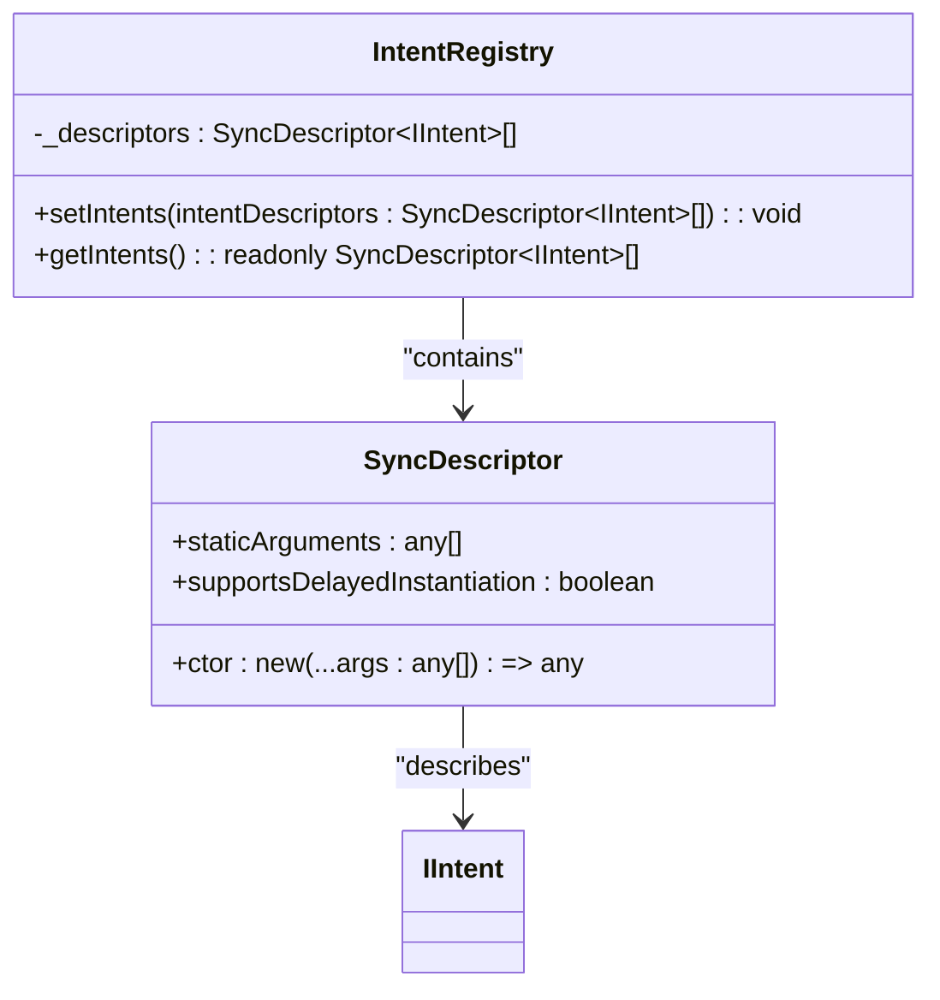
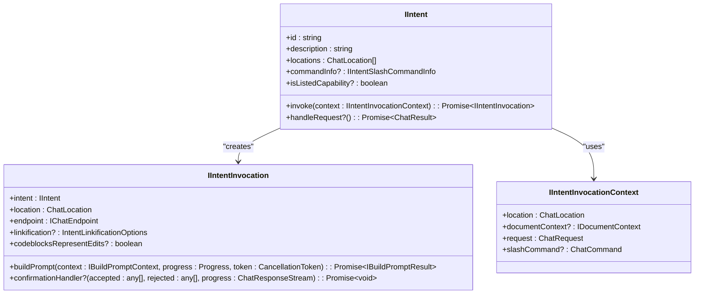
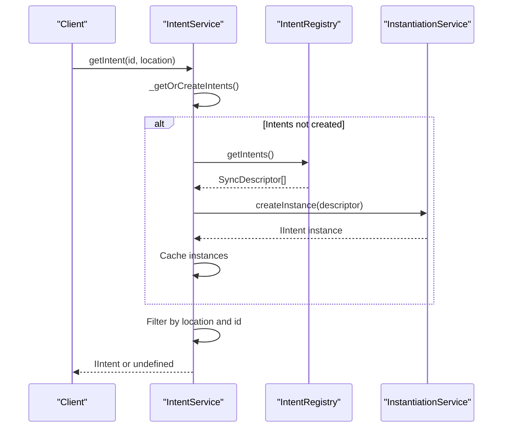
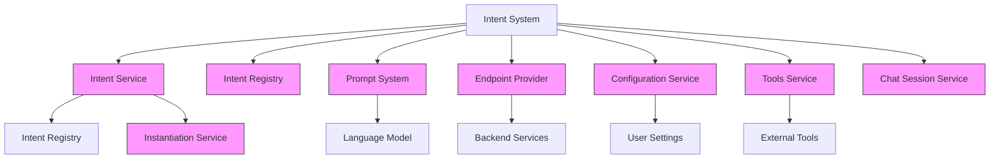

# Common Intents

<cite>
**Referenced Files in This Document**   
- [intents.ts](file://src/extension/intents/common/intents.ts)
- [allIntents.ts](file://src/extension/intents/node/allIntents.ts)
- [intentService.ts](file://src/extension/intents/node/intentService.ts)
- [intentRegistry.ts](file://src/extension/prompt/node/intentRegistry.ts)
- [intents.ts](file://src/extension/prompt/node/intents.ts)
- [explainIntent.ts](file://src/extension/intents/node/explainIntent.ts)
- [fixIntent.ts](file://src/extension/intents/node/fixIntent.ts)
- [generateCodeIntent.ts](file://src/extension/intents/node/generateCodeIntent.ts)
- [editCodeIntent2.ts](file://src/extension/intents/node/editCodeIntent2.ts)
- [unknownIntent.ts](file://src/extension/intents/node/unknownIntent.ts)
- [constants.ts](file://src/extension/common/constants.ts)
</cite>

## Table of Contents
1. [Introduction](#introduction)
2. [Core Intent Definitions](#core-intent-definitions)
3. [Intent Registry Architecture](#intent-registry-architecture)
4. [Domain Model for Intents](#domain-model-for-intents)
5. [Intent Registration and Discovery](#intent-registration-and-discovery)
6. [Configuration Options](#configuration-options)
7. [Component Relationships](#component-relationships)
8. [Common Issues](#common-issues)
9. [Extensibility and Custom Development](#extensibility-and-custom-development)
10. [Conclusion](#conclusion)

## Introduction
The Common Intents sub-component of the Intents system provides a structured framework for defining and managing user commands within the Copilot chat environment. This system enables the platform to interpret various user requests such as editing, explaining, generating, and fixing code through a well-defined architecture of intent definitions, registries, and execution contracts. The implementation supports multiple execution contexts including panel, inline editor, and notebook environments, allowing for context-aware processing of user commands. This document provides a comprehensive analysis of the intent system's architecture, core components, and integration points, making the information accessible to both beginners and experienced developers.

## Core Intent Definitions
The Common Intents system defines a comprehensive set of user commands through a structured interface that standardizes how different actions are implemented and executed. The core intent definitions establish a consistent pattern for handling user requests across various contexts.

The system defines several primary intents including edit, explain, generate, and fix, each representing a distinct user command category. These intents are implemented as classes that conform to the `IIntent` interface, which specifies the contract for intent behavior. Each intent has a unique identifier, description, supported locations (panel, editor, or notebook), and optional configuration for slash command integration.

The implementation follows a pattern where each intent class contains an `invoke` method that returns an `IIntentInvocation` object responsible for processing the specific request. This separation allows for specialized handling logic while maintaining a consistent interface. For example, the ExplainIntent handles code explanation requests, while the FixIntent addresses code correction scenarios.

**Section sources**
- [intents.ts](file://src/extension/prompt/node/intents.ts#L54-L104)
- [constants.ts](file://src/extension/common/constants.ts#L8-L35)

## Intent Registry Architecture
The Intent Registry serves as the central management system for all available intents within the application. It provides a mechanism for registering, storing, and retrieving intent definitions through a singleton pattern implementation.

The registry architecture is based on the `IntentRegistry` class, which maintains a collection of intent descriptors using a `SyncDescriptor` array. Intents are registered through the `setIntents` method, which appends new descriptors to the existing collection. The registry provides read-only access to the complete set of registered intents through the `getIntents` method.

This architecture enables a clean separation between intent definition and registration. The `allIntents.ts` file serves as the central registration point, importing all intent implementations and registering them with the registry in a single operation. This approach ensures that all intents are available throughout the application while maintaining a clear registration process.

The registry supports extensibility by allowing new intents to be added without modifying the core registry implementation. This design facilitates the addition of custom intents while maintaining system integrity.

**Diagram sources**
- [intentRegistry.ts](file://src/extension/prompt/node/intentRegistry.ts#L19-L30)
- [allIntents.ts](file://src/extension/intents/node/allIntents.ts#L34-L59)

**Section sources**
- [intentRegistry.ts](file://src/extension/prompt/node/intentRegistry.ts#L19-L30)
- [allIntents.ts](file://src/extension/intents/node/allIntents.ts#L6-L59)

## Domain Model for Intents
The domain model for intents establishes a comprehensive structure for representing user commands and their execution context. At the core of this model is the `IIntent` interface, which defines the essential properties and behaviors for all intents.

Each intent is characterized by several key attributes: a unique identifier (`id`), a descriptive text (`description`), supported locations (`locations`), and optional configuration for slash command integration (`commandInfo`). The model also includes metadata such as whether the intent should be listed as a capability in prompts.

The execution model is defined through the `IIntentInvocation` interface, which represents an active intent execution. This interface includes methods for building prompts, processing responses, and handling specialized scenarios like confirmation workflows. The invocation context provides access to essential information such as the chat location, document context, and request details.

For specific user commands, the system implements specialized intent classes:
- **Edit**: Modifies existing code based on user requests
- **Explain**: Provides explanations for selected code
- **Generate**: Creates new code based on specifications
- **Fix**: Identifies and corrects code issues

These intents are structured to handle both panel and inline execution contexts, with specialized invocation classes for each scenario.

**Diagram sources**
- [intents.ts](file://src/extension/prompt/node/intents.ts#L54-L209)
- [explainIntent.ts](file://src/extension/intents/node/explainIntent.ts#L68-L90)
- [fixIntent.ts](file://src/extension/intents/node/fixIntent.ts#L22-L64)

**Section sources**
- [intents.ts](file://src/extension/prompt/node/intents.ts#L54-L209)
- [explainIntent.ts](file://src/extension/intents/node/explainIntent.ts#L68-L90)
- [fixIntent.ts](file://src/extension/intents/node/fixIntent.ts#L22-L64)
- [generateCodeIntent.ts](file://src/extension/intents/node/generateCodeIntent.ts#L16-L39)
- [editCodeIntent2.ts](file://src/extension/intents/node/editCodeIntent2.ts#L63-L124)

## Intent Registration and Discovery
The intent registration and discovery system provides a robust mechanism for making intents available throughout the application and retrieving them based on specific criteria. This system enables dynamic intent resolution based on user context and request parameters.

Intent registration occurs through the `IntentRegistry` singleton, which collects all intent descriptors in the `allIntents.ts` file. Each intent is registered using a `SyncDescriptor` that captures the intent class and its instantiation requirements. This registration process happens at application startup, ensuring all intents are available when needed.

Intent discovery is handled by the `IntentService`, which provides methods for retrieving intents based on location and identifier. The service implements lazy initialization, creating intent instances only when first requested. This approach optimizes performance by avoiding unnecessary object creation.

The discovery process follows a two-step pattern: first retrieving all registered intent descriptors from the registry, then instantiating the specific intents needed using the dependency injection system. The `getIntent` method allows retrieval of a specific intent by ID and location, while `getIntents` returns all intents available for a given location.

This architecture supports efficient intent resolution while maintaining separation between registration and usage concerns.

**Diagram sources**
- [intentService.ts](file://src/extension/intents/node/intentService.ts#L24-L58)
- [intentRegistry.ts](file://src/extension/prompt/node/intentRegistry.ts#L19-L30)

**Section sources**
- [intentService.ts](file://src/extension/intents/node/intentService.ts#L14-L58)
- [allIntents.ts](file://src/extension/intents/node/allIntents.ts#L34-L59)

## Configuration Options
The intent system provides several configuration options that control how intents are registered, displayed, and behave during execution. These options are defined through the `IIntentSlashCommandInfo` interface and related configuration properties.

Key configuration parameters include:
- **hiddenFromUser**: Determines whether the intent appears in the slash command list
- **allowsEmptyArgs**: Specifies if the intent can be invoked without arguments (defaults to true)
- **defaultEnablement**: Controls whether the intent is enabled by default (defaults to true)
- **toolEquivalent**: Maps the intent to a corresponding tool name for integration purposes
- **isListedCapability**: Indicates whether the intent should be listed as a capability in prompts

These configuration options provide flexibility in how intents are presented to users and integrated with other system components. For example, the GenerateCodeIntent uses `hiddenFromUser: true` to prevent it from appearing in the slash command list, as it's primarily intended for internal use.

The system also supports location-specific configuration through the `locations` array, which specifies where each intent can be invoked (panel, editor, or notebook). This allows intents to be context-aware and adapt their behavior based on the execution environment.

**Section sources**
- [intents.ts](file://src/extension/prompt/node/intents.ts#L27-L35)
- [generateCodeIntent.ts](file://src/extension/intents/node/generateCodeIntent.ts#L23)
- [fixIntent.ts](file://src/extension/intents/node/fixIntent.ts#L29)

## Component Relationships
The Common Intents system integrates with several key components to provide a cohesive user experience. These relationships enable the intents to access necessary services and data while maintaining proper separation of concerns.

The primary integration points include:
- **Intent Service**: Manages intent discovery and instantiation
- **Chat Session Service**: Provides context for chat interactions
- **Language Model**: Processes natural language requests and generates responses
- **Endpoint Provider**: Manages connections to backend services
- **Configuration Service**: Provides access to user preferences and settings
- **Tools Service**: Enables integration with external tools and capabilities

The intent system follows a dependency injection pattern, with services injected through constructor parameters using the `@` decorator syntax. This approach promotes loose coupling and testability while ensuring components have access to the services they need.

The relationship between intents and prompts is particularly important, as intents use prompt classes to construct the input for the language model. This separation allows for specialized prompt templates while maintaining a consistent intent interface.

**Diagram sources**
- [intentService.ts](file://src/extension/intents/node/intentService.ts#L24-L58)
- [explainIntent.ts](file://src/extension/intents/node/explainIntent.ts#L77-L88)
- [fixIntent.ts](file://src/extension/intents/node/fixIntent.ts#L31-L34)

**Section sources**
- [intentService.ts](file://src/extension/intents/node/intentService.ts#L24-L58)
- [explainIntent.ts](file://src/extension/intents/node/explainIntent.ts#L77-L88)
- [fixIntent.ts](file://src/extension/intents/node/fixIntent.ts#L31-L34)
- [editCodeIntent2.ts](file://src/extension/intents/node/editCodeIntent2.ts#L69-L78)

## Common Issues
The Common Intents system addresses several common challenges in intent management, including intent collision and versioning concerns.

Intent collision occurs when multiple intents could potentially handle the same user request. The system mitigates this through explicit intent registration and location-based filtering. Each intent has a unique identifier, and the discovery process ensures only one intent is selected for a given request. The `agentsToCommands` mapping in constants.ts helps prevent conflicts by clearly defining which agent handles each intent.

Versioning challenges are addressed through the use of distinct intent IDs for different versions of similar functionality. For example, the system includes both `Edit` and `Edit2` intents, allowing for evolutionary improvements while maintaining backward compatibility. This approach enables gradual migration to new implementations without disrupting existing functionality.

Other common issues include:
- **Context awareness**: Ensuring intents behave appropriately in different execution contexts (panel vs. inline)
- **Error handling**: Providing meaningful feedback when intents cannot be executed
- **Performance**: Optimizing intent discovery and instantiation
- **Discoverability**: Making intents appropriately visible or hidden based on their intended use

The system addresses these through consistent patterns like the `unknownIntent` fallback and lazy initialization of intent instances.

**Section sources**
- [constants.ts](file://src/extension/common/constants.ts#L40-L70)
- [unknownIntent.ts](file://src/extension/intents/node/unknownIntent.ts#L17-L43)
- [intentService.ts](file://src/extension/intents/node/intentService.ts#L40-L47)

## Extensibility and Custom Development
The Common Intents system is designed to support extensibility and custom intent development through a well-defined architecture and clear implementation patterns.

To create a custom intent, developers should:
1. Define a new class that implements the `IIntent` interface
2. Implement the `invoke` method to return an appropriate `IIntentInvocation`
3. Register the intent in the `allIntents.ts` file
4. Configure any necessary options through the `commandInfo` property

The system provides several extension points:
- **Custom invocation logic**: Override the `invoke` method to implement specialized behavior
- **Context-specific handling**: Implement different invocation classes for panel and inline contexts
- **Prompt customization**: Use different prompt classes for various scenarios
- **Tool integration**: Connect intents to external tools through the `toolEquivalent` property

The dependency injection system allows custom intents to access necessary services through constructor injection. The use of interfaces rather than concrete implementations promotes loose coupling and makes the system more adaptable to changes.

Best practices for custom intent development include:
- Following the naming conventions used in existing intents
- Using appropriate location restrictions
- Providing clear descriptions
- Considering user experience in the design
- Testing across different execution contexts

**Section sources**
- [intents.ts](file://src/extension/prompt/node/intents.ts#L54-L104)
- [allIntents.ts](file://src/extension/intents/node/allIntents.ts#L34-L59)
- [explainIntent.ts](file://src/extension/intents/node/explainIntent.ts#L68-L90)

## Conclusion
The Common Intents sub-component provides a robust and extensible framework for managing user commands within the Copilot chat system. Through a well-defined architecture of intent definitions, registries, and execution contracts, the system enables consistent handling of various user requests across different contexts. The implementation demonstrates thoughtful design patterns including dependency injection, lazy initialization, and clear separation of concerns. By understanding the core components, domain model, and integration points, developers can effectively work with existing intents and create new ones to extend the system's capabilities. The architecture balances flexibility with maintainability, making it suitable for both beginners and experienced developers working with the intent system.