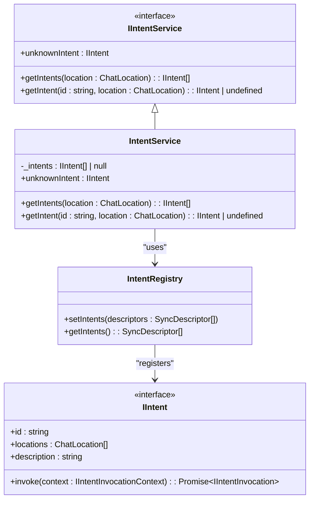
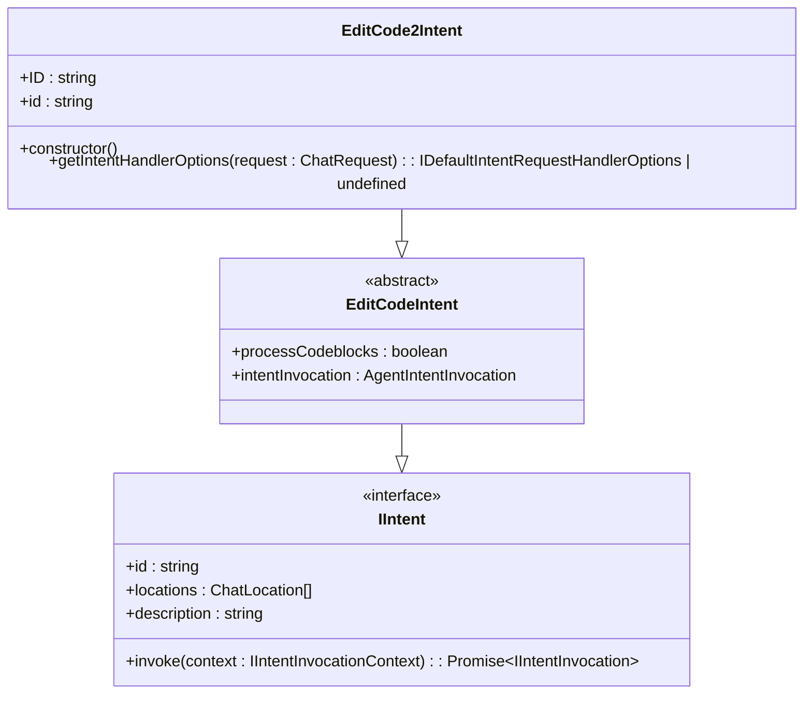
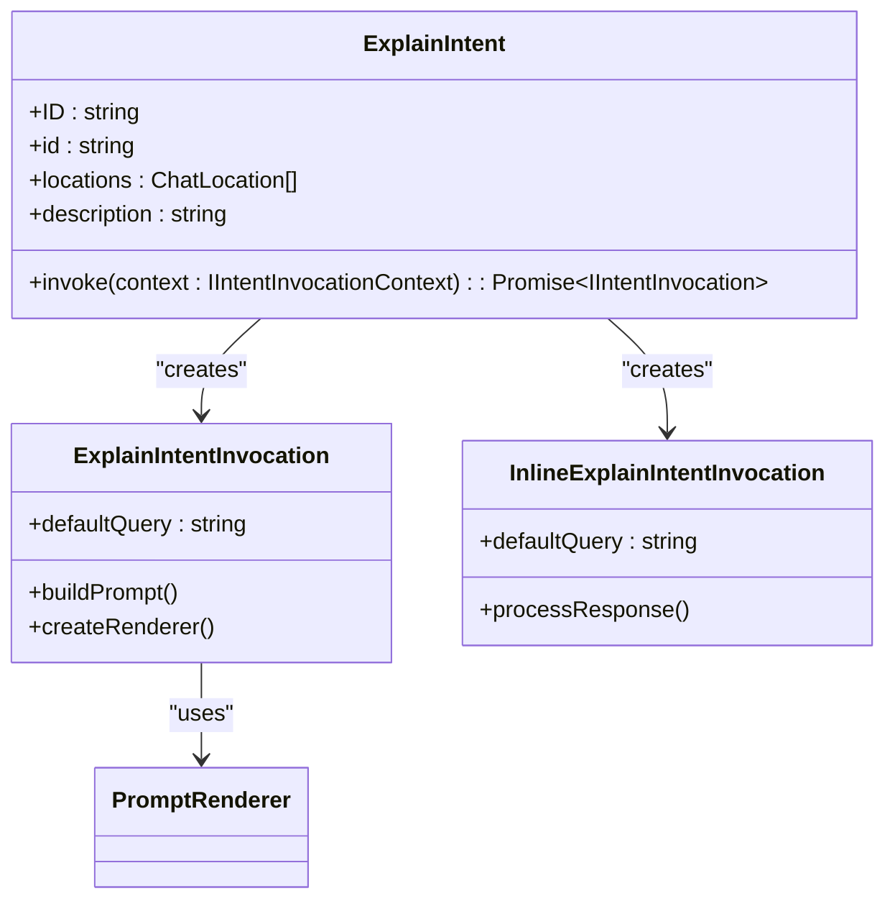
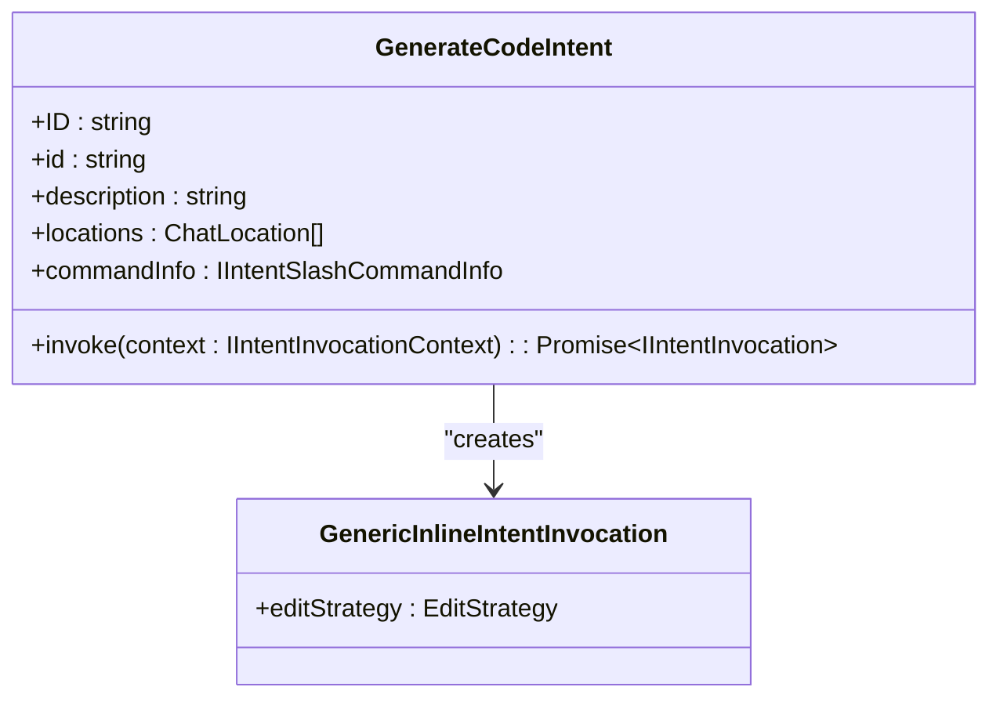
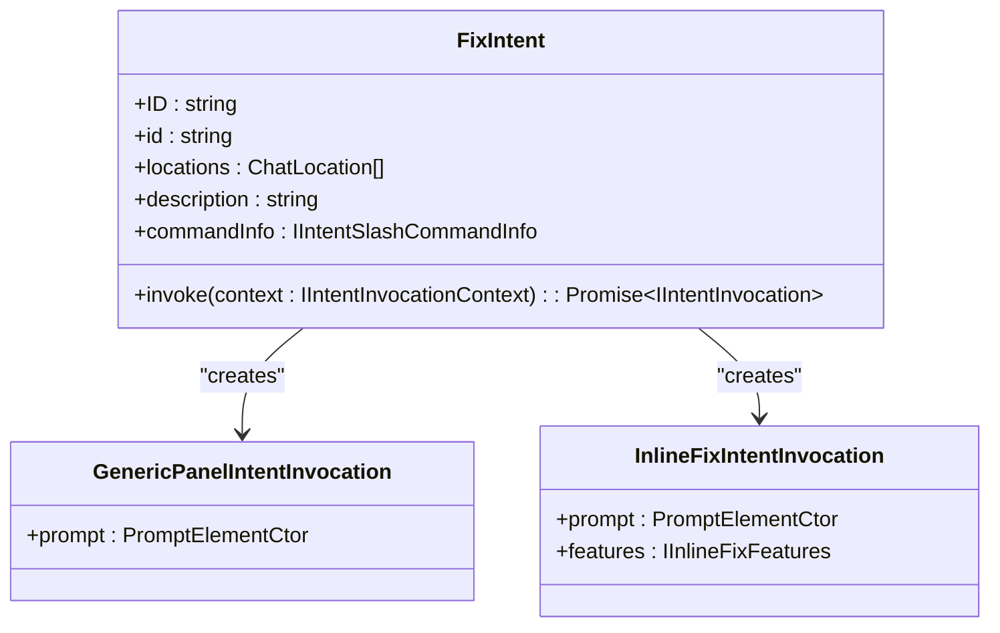
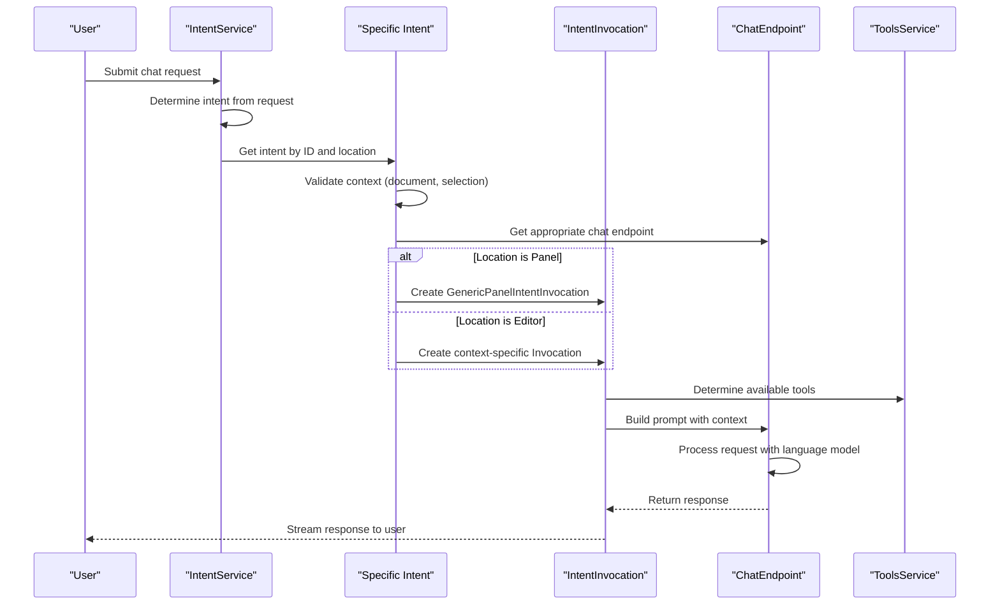

# Intents

<cite>
**Referenced Files in This Document**   
- [intents.ts](file://src/extension/intents/common/intents.ts)
- [intentService.ts](file://src/extension/intents/node/intentService.ts)
- [editCodeIntent2.ts](file://src/extension/intents/node/editCodeIntent2.ts)
- [explainIntent.ts](file://src/extension/intents/node/explainIntent.ts)
- [generateCodeIntent.ts](file://src/extension/intents/node/generateCodeIntent.ts)
- [fixIntent.ts](file://src/extension/intents/node/fixIntent.ts)
- [allIntents.ts](file://src/extension/intents/node/allIntents.ts)
</cite>

## Table of Contents
1. [Introduction](#introduction)
2. [Intent System Architecture](#intent-system-architecture)
3. [Core Intent Types](#core-intent-types)
4. [Intent Processing Flow](#intent-processing-flow)
5. [Configuration Options](#configuration-options)
6. [Component Relationships](#component-relationships)
7. [Common Issues and Resolution](#common-issues-and-resolution)
8. [Extensibility and Custom Intents](#extensibility-and-custom-intents)
9. [Conclusion](#conclusion)

## Introduction

The Intents sub-component of the Extension Layer serves as the core mechanism for translating natural language user commands into executable actions within the VS Code Copilot environment. This system enables users to perform various code-related tasks through conversational interfaces by recognizing user intent from their input and routing it to appropriate handlers. The intent system supports a wide range of operations including code editing, explanation, generation, and error fixing, providing a seamless bridge between user requests and code manipulation capabilities.

**Section sources**
- [intents.ts](file://src/extension/intents/common/intents.ts#L1-L30)
- [intentService.ts](file://src/extension/intents/node/intentService.ts#L1-L58)

## Intent System Architecture

The intent system follows a modular architecture centered around the IntentService, which manages registration, discovery, and execution of various intent types. The architecture implements a service-oriented design pattern where intents are registered in a central registry and instantiated through dependency injection.



**Diagram sources**
- [intentService.ts](file://src/extension/intents/node/intentService.ts#L14-L58)
- [allIntents.ts](file://src/extension/intents/node/allIntents.ts#L34-L59)

**Section sources**
- [intentService.ts](file://src/extension/intents/node/intentService.ts#L1-L58)
- [allIntents.ts](file://src/extension/intents/node/allIntents.ts#L1-L60)

## Core Intent Types

The system implements several core intent types that handle different categories of user commands. Each intent type is designed to process specific kinds of requests and route them to appropriate execution pathways.

### Edit Intent
The Edit intent (EditCode2Intent) handles requests for modifying existing code. It extends the base EditCodeIntent class and provides specialized functionality for code editing operations in the editing session context.



**Diagram sources**
- [editCodeIntent2.ts](file://src/extension/intents/node/editCodeIntent2.ts#L63-L124)

**Section sources**
- [editCodeIntent2.ts](file://src/extension/intents/node/editCodeIntent2.ts#L1-L124)

### Explain Intent
The Explain intent processes requests for code explanation. It provides different invocation strategies based on the chat location (panel vs. inline editor) and uses specialized prompt templates for generating explanations.



**Diagram sources**
- [explainIntent.ts](file://src/extension/intents/node/explainIntent.ts#L68-L91)

**Section sources**
- [explainIntent.ts](file://src/extension/intents/node/explainIntent.ts#L1-L91)

### Generate Intent
The Generate intent handles requests for creating new code. It operates primarily in the editor context and uses a generic inline invocation strategy with forced insertion edit strategy.



**Diagram sources**
- [generateCodeIntent.ts](file://src/extension/intents/node/generateCodeIntent.ts#L16-L39)

**Section sources**
- [generateCodeIntent.ts](file://src/extension/intents/node/generateCodeIntent.ts#L1-L39)

### Fix Intent
The Fix intent processes requests for correcting code issues. It supports multiple contexts (editor, panel, notebook) and selects appropriate prompts based on the document type and interaction context.



**Diagram sources**
- [fixIntent.ts](file://src/extension/intents/node/fixIntent.ts#L22-L64)

**Section sources**
- [fixIntent.ts](file://src/extension/intents/node/fixIntent.ts#L1-L64)

## Intent Processing Flow

The intent processing flow follows a consistent pattern across all intent types, from user input recognition to action execution. This flow ensures that user commands are properly interpreted and handled according to their context and requirements.



**Diagram sources**
- [intentService.ts](file://src/extension/intents/node/intentService.ts#L24-L58)
- [explainIntent.ts](file://src/extension/intents/node/explainIntent.ts#L82-L89)
- [fixIntent.ts](file://src/extension/intents/node/fixIntent.ts#L36-L63)

**Section sources**
- [intentService.ts](file://src/extension/intents/node/intentService.ts#L1-L58)
- [explainIntent.ts](file://src/extension/intents/node/explainIntent.ts#L1-L91)
- [fixIntent.ts](file://src/extension/intents/node/fixIntent.ts#L1-L64)

## Configuration Options

The intent system provides various configuration options that control its behavior and response characteristics. These options can be accessed through the configuration service and influence how intents are processed.

### Intent Handler Options
The getIntentHandlerOptions method in EditCode2Intent demonstrates key configuration parameters:

- **maxToolCallIterations**: Controls the maximum number of tool call iterations (default: 15)
- **temperature**: Influences the randomness of the language model responses
- **overrideRequestLocation**: Specifies the chat location context for processing

These options can be configured through the chat.agent.maxRequests setting or internal configuration keys.

**Section sources**
- [editCodeIntent2.ts](file://src/extension/intents/node/editCodeIntent2.ts#L80-L86)

## Component Relationships

The intent system integrates with several key components to provide comprehensive functionality. These relationships enable the system to access necessary context and execute actions effectively.

```mermaid
graph TD
subgraph "Intent System"
IntentService[IntentService]
Intent[Specific Intents]
Invocation[IntentInvocation]
end
subgraph "Core Services"
EndpointProvider[EndpointProvider]
ConfigurationService[ConfigurationService]
ToolsService[ToolsService]
WorkspaceService[WorkspaceService]
end
subgraph "Context Providers"
TabsAndEditors[TabsAndEditorsService]
Notebook[NotebookService]
CodeMapper[CodeMapperService]
end
subgraph "Prompt System"
PromptRenderer[PromptRenderer]
PromptRegistry[PromptRegistry]
end
IntentService --> Intent : "manages"
Intent --> Invocation : "creates"
Intent --> EndpointProvider : "uses"
Intent --> ConfigurationService : "uses"
Intent --> ToolsService : "uses"
Intent --> WorkspaceService : "uses"
Invocation --> TabsAndEditors : "uses"
Invocation --> Notebook : "uses"
Invocation --> CodeMapper : "uses"
Invocation --> PromptRenderer : "uses"
PromptRenderer --> PromptRegistry : "uses"
```

**Diagram sources**
- [intentService.ts](file://src/extension/intents/node/intentService.ts#L24-L58)
- [editCodeIntent2.ts](file://src/extension/intents/node/editCodeIntent2.ts#L69-L78)
- [explainIntent.ts](file://src/extension/intents/node/explainIntent.ts#L77-L80)

**Section sources**
- [intentService.ts](file://src/extension/intents/node/intentService.ts#L1-L58)
- [editCodeIntent2.ts](file://src/extension/intents/node/editCodeIntent2.ts#L1-L124)
- [explainIntent.ts](file://src/extension/intents/node/explainIntent.ts#L1-L91)

## Common Issues and Resolution

The intent system addresses several common challenges in natural language processing and command execution.

### Intent Misclassification
The system uses the IntentService to ensure proper intent routing based on the request context and location. The getIntents method filters available intents by location, preventing inappropriate intent activation.

### Ambiguous Command Resolution
For ambiguous commands, the system relies on context validation within each intent's invoke method. For example, the GenerateCodeIntent verifies that a document context exists before proceeding, throwing an error if requirements aren't met.

### Context Awareness
Intents are designed to be context-aware, with different behaviors based on location (panel vs. editor) and document type (regular file vs. notebook). The FixIntent, for instance, selects different prompts based on whether the context is a notebook cell or regular code file.

**Section sources**
- [generateCodeIntent.ts](file://src/extension/intents/node/generateCodeIntent.ts#L32-L34)
- [fixIntent.ts](file://src/extension/intents/node/fixIntent.ts#L50-L53)
- [intentService.ts](file://src/extension/intents/node/intentService.ts#L49-L52)

## Extensibility and Custom Intents

The intent system is designed to be extensible, allowing for the addition of custom intent types. New intents can be created by implementing the IIntent interface and registering them through the IntentRegistry.

To create a custom intent:
1. Implement the IIntent interface with appropriate properties and methods
2. Register the intent in the allIntents.ts file using SyncDescriptor
3. Ensure proper dependency injection through constructor parameters
4. Define appropriate locations where the intent should be available

The modular design allows new intents to leverage existing infrastructure for prompt rendering, tool integration, and response processing.

**Section sources**
- [allIntents.ts](file://src/extension/intents/node/allIntents.ts#L34-L59)
- [intentService.ts](file://src/extension/intents/node/intentService.ts#L24-L58)

## Conclusion

The Intents sub-component provides a robust framework for translating natural language commands into executable code actions. By implementing a service-oriented architecture with clear separation of concerns, the system effectively handles various user requests while maintaining extensibility and maintainability. The design patterns used—such as dependency injection, interface-based programming, and context-aware processing—ensure that the system can adapt to different scenarios and scale with new requirements. This architecture enables seamless integration between user intent and code manipulation capabilities, forming a critical part of the overall Copilot experience.