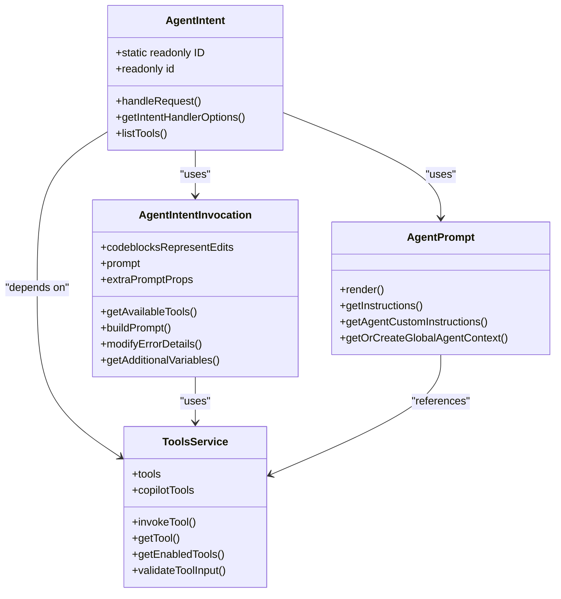
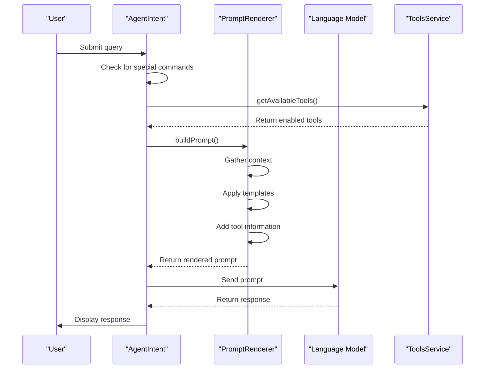
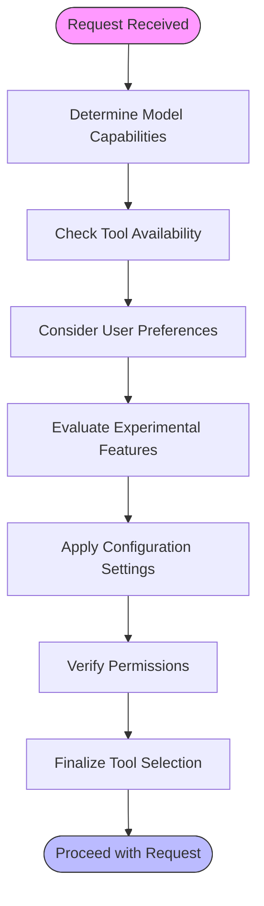
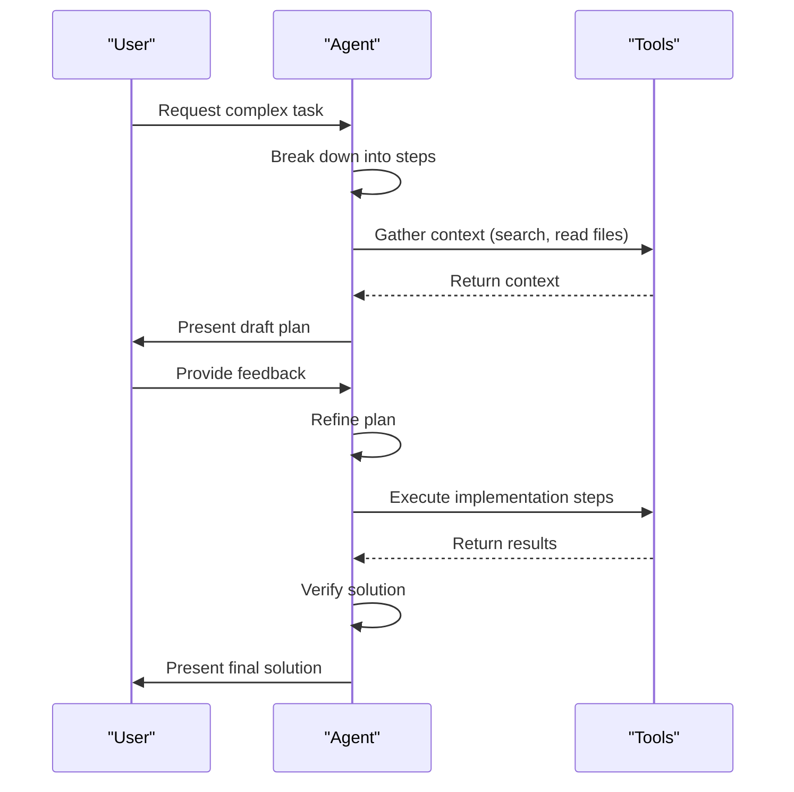
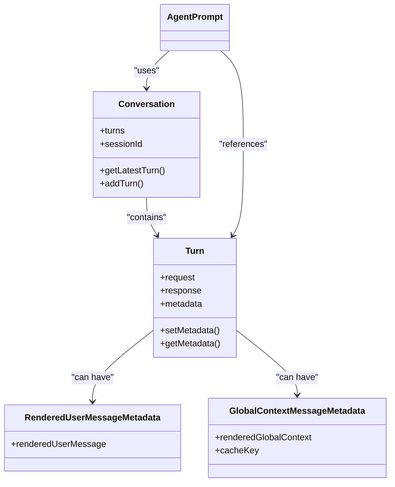
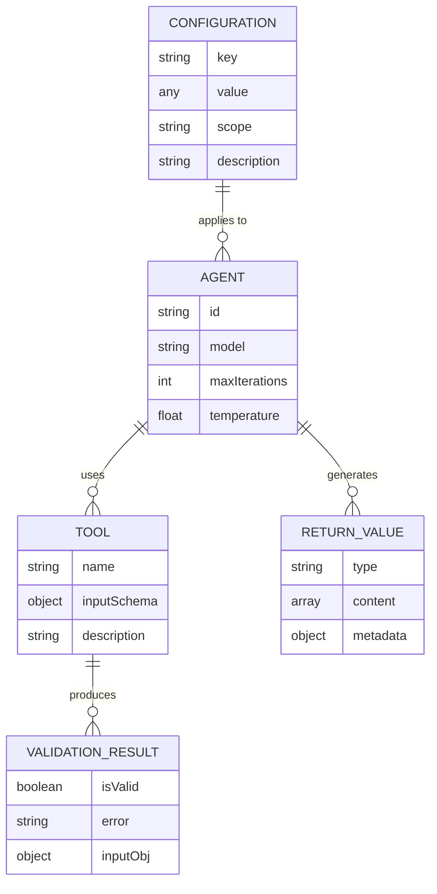
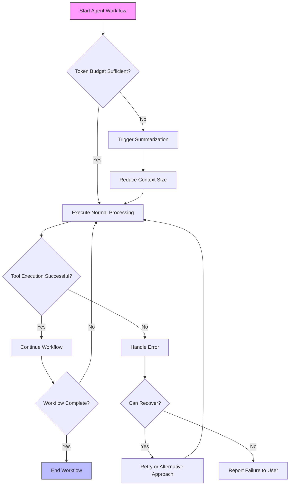

# Ask Agent Intent

<cite>
**Referenced Files in This Document**   
- [agentIntent.ts](file://src/extension/intents/node/agentIntent.ts)
- [agentPrompt.tsx](file://src/extension/prompts/node/agent/agentPrompt.tsx)
- [Plan.agent.md](file://assets/agents/Plan.agent.md)
- [toolsService.ts](file://src/extension/tools/common/toolsService.ts)
</cite>

## Table of Contents
1. [Introduction](#introduction)
2. [Core Components](#core-components)
3. [Agent Request Processing](#agent-request-processing)
4. [Agent Selection and Configuration](#agent-selection-and-configuration)
5. [Multi-Step Reasoning and Task Planning](#multi-step-reasoning-and-task-planning)
6. [Agent Integration with Conversation Management](#agent-integration-with-conversation-management)
7. [Configuration Options and Parameters](#configuration-options-and-parameters)
8. [Common Issues and Performance Considerations](#common-issues-and-performance-considerations)
9. [Conclusion](#conclusion)

## Introduction

The Ask Agent Intent handler in the Node.js context provides a sophisticated system for processing agent-based queries within the VS Code environment. This documentation thoroughly explains the implementation of agent querying functionality, focusing on how agent requests are processed, how agent selection is performed, and how multi-step reasoning is coordinated. The system integrates with the agent framework, conversation management, and task planning services to deliver a comprehensive solution for complex query resolution.

The agent system enables autonomous problem-solving by breaking down complex tasks into actionable steps, coordinating multiple tools, and maintaining context throughout extended conversations. This documentation will explain the technical implementation while making the concepts accessible to beginners and providing sufficient depth for experienced developers regarding agent intent extensibility and optimization.

**Section sources**
- [agentIntent.ts](file://src/extension/intents/node/agentIntent.ts#L1-L386)

## Core Components

The Ask Agent Intent system consists of several core components that work together to process agent requests and coordinate multi-step reasoning. The primary component is the `AgentIntent` class, which extends the `EditCodeIntent` class and serves as the main handler for agent-based queries. This class manages the entire lifecycle of agent requests, from initial processing to response generation and tool coordination.

The system also includes the `AgentPrompt` component, which is responsible for constructing the prompt that guides the agent's behavior. This prompt includes system instructions, user context, tool availability information, and various reminders to ensure the agent follows best practices. The prompt construction process takes into account the specific model being used, available tools, and conversation history to create an optimal context for the agent.

Another critical component is the tool management system, which handles the discovery, validation, and execution of various tools that agents can use to accomplish their tasks. This includes editing tools, search tools, testing tools, and other specialized utilities that extend the agent's capabilities.

**Diagram sources**
- [agentIntent.ts](file://src/extension/intents/node/agentIntent.ts#L128-L386)
- [agentPrompt.tsx](file://src/extension/prompts/node/agent/agentPrompt.tsx#L76-L877)
- [toolsService.ts](file://src/extension/tools/common/toolsService.ts#L46-L253)

**Section sources**
- [agentIntent.ts](file://src/extension/intents/node/agentIntent.ts#L128-L386)
- [agentPrompt.tsx](file://src/extension/prompts/node/agent/agentPrompt.tsx#L76-L877)
- [toolsService.ts](file://src/extension/tools/common/toolsService.ts#L46-L253)

## Agent Request Processing

The agent request processing pipeline begins when a user submits a query to the agent system. The `AgentIntent` class handles this request through its `handleRequest` method, which first checks if the request is a special command (like 'list') before proceeding with normal processing. For regular queries, the request is passed to the parent class's `handleRequest` method, which orchestrates the overall response generation process.

The request processing involves several key steps. First, the system determines which tools are available and enabled for the current request by calling `getAvailableTools`. This method evaluates the current model capabilities, user configuration, and experimental features to create a filtered list of appropriate tools. The tool selection process considers factors such as model compatibility, user permissions, and feature flags to ensure only suitable tools are made available.

Once the available tools are determined, the system constructs a prompt using the `AgentPrompt` component. This prompt includes the user's query, relevant context from the conversation history, information about available tools, and various instructions and reminders to guide the agent's behavior. The prompt construction process is adaptive, taking into account the specific model being used and the current conversation state.

**Diagram sources**
- [agentIntent.ts](file://src/extension/intents/node/agentIntent.ts#L146-L153)
- [agentPrompt.tsx](file://src/extension/prompts/node/agent/agentPrompt.tsx#L88-L142)

**Section sources**
- [agentIntent.ts](file://src/extension/intents/node/agentIntent.ts#L146-L153)
- [agentPrompt.tsx](file://src/extension/prompts/node/agent/agentPrompt.tsx#L88-L142)

## Agent Selection and Configuration

Agent selection in the system is a sophisticated process that considers multiple factors to determine the most appropriate tools and behaviors for a given request. The `getAgentTools` function plays a central role in this process, evaluating model capabilities, user preferences, and experimental features to create a tailored toolset for each agent invocation.

The selection process begins by assessing the current model's capabilities through various helper functions like `modelSupportsReplaceString`, `modelSupportsApplyPatch`, and `isHiddenModelB`. These functions determine which editing operations the model can effectively perform based on its architecture and training. The system also considers user-specific preferences, such as learned tool preferences from previous interactions, to personalize the agent experience.

Configuration options allow fine-tuning of agent behavior through various settings. The system checks configuration values like `chat.agent.maxRequests` to limit the number of tool call iterations and `Internal.AgentTemperature` to control the randomness of the agent's responses. These settings can be overridden by experimental features or specific request parameters, providing flexibility in agent behavior.

**Diagram sources**
- [agentIntent.ts](file://src/extension/intents/node/agentIntent.ts#L55-L126)

**Section sources**
- [agentIntent.ts](file://src/extension/intents/node/agentIntent.ts#L55-L126)

## Multi-Step Reasoning and Task Planning

The agent system excels at multi-step reasoning and task planning, enabling it to solve complex problems through coordinated sequences of actions. This capability is implemented through a combination of prompt engineering, tool coordination, and conversation management. The system guides the agent to break down complex tasks into manageable steps, execute them in an optimal order, and maintain context throughout the process.

For planning-oriented agents like the Plan agent, the system provides specific instructions and constraints to ensure proper behavior. The Plan agent is explicitly instructed to focus on planning rather than implementation, with stopping rules that prevent it from starting implementation tasks. The workflow involves comprehensive context gathering followed by presenting a concise plan to the user for iteration, ensuring that the planning process remains focused and productive.

The multi-step reasoning process is supported by various mechanisms in the prompt system. The `KeepGoingReminder` component encourages the agent to continue working until the problem is completely solved, while the `ToolReferencesHint` component helps the agent prioritize relevant tools. For models that support it, the system includes specific instructions about progress reporting cadence and tool batch prefaces to maintain clarity in extended interactions.

**Diagram sources**
- [Plan.agent.md](file://assets/agents/Plan.agent.md#L1-L73)
- [agentPrompt.tsx](file://src/extension/prompts/node/agent/agentPrompt.tsx#L720-L763)

**Section sources**
- [Plan.agent.md](file://assets/agents/Plan.agent.md#L1-L73)
- [agentPrompt.tsx](file://src/extension/prompts/node/agent/agentPrompt.tsx#L720-L763)

## Agent Integration with Conversation Management

The agent system is deeply integrated with the conversation management infrastructure, allowing it to maintain context across multiple turns and coordinate complex interactions. This integration is achieved through several mechanisms that preserve state, manage references, and handle conversation history effectively.

The system uses metadata to track important information across conversation turns. For example, the `RenderedUserMessageMetadata` class stores the rendered version of user messages, allowing the system to reuse frozen content instead of reprocessing it in subsequent turns. Similarly, the `GlobalContextMessageMetadata` class caches global agent context information, preventing redundant computation and ensuring consistency throughout the conversation.

Conversation history management is a critical aspect of the integration. The system employs different strategies based on the conversation length and complexity. For shorter conversations, it includes the full history, while for longer conversations, it may trigger summarization to stay within token limits. The `SummarizedConversationHistory` component handles this process, creating concise summaries that preserve essential information while reducing token usage.

**Diagram sources**
- [agentPrompt.tsx](file://src/extension/prompts/node/agent/agentPrompt.tsx#L29-L30)
- [agentPrompt.tsx](file://src/extension/prompts/node/agent/agentPrompt.tsx#L204-L229)

**Section sources**
- [agentPrompt.tsx](file://src/extension/prompts/node/agent/agentPrompt.tsx#L29-L30)
- [agentPrompt.tsx](file://src/extension/prompts/node/agent/agentPrompt.tsx#L204-L229)

## Configuration Options and Parameters

The agent system provides numerous configuration options that allow customization of agent behavior, tool availability, and interaction patterns. These options are accessed through the `IConfigurationService` and can be set at various levels, including user preferences, workspace settings, and experimental features.

Key configuration parameters include:
- `chat.agent.maxRequests`: Controls the maximum number of tool call iterations allowed
- `Internal.AgentTemperature`: Sets the randomness of the agent's responses
- `SummarizeAgentConversationHistory`: Enables or disables conversation history summarization
- `CurrentEditorAgentContext`: Determines whether to include current editor context in agent prompts
- `EnableAlternateGptPrompt`: Activates alternative prompt templates for GPT models

The system also supports dynamic configuration through request parameters and experimental features. For example, the `getRequestedToolCallIterationLimit` function checks for request-specific limits, allowing users to override the default maximum requests for specific queries. Experimental features can enable or disable various behaviors, such as alternative prompt templates or simplified patch instructions.

Return values from agent operations are structured to provide rich information about the results. Tool invocations return `LanguageModelToolResult2` objects containing content arrays, while validation operations return either `IValidatedToolInput` or `IToolValidationError` to indicate success or failure. The system uses these return values to coordinate subsequent actions and provide feedback to users.

**Diagram sources**
- [agentIntent.ts](file://src/extension/intents/node/agentIntent.ts#L187-L193)
- [toolsService.ts](file://src/extension/tools/common/toolsService.ts#L19-L34)

**Section sources**
- [agentIntent.ts](file://src/extension/intents/node/agentIntent.ts#L187-L193)
- [toolsService.ts](file://src/extension/tools/common/toolsService.ts#L19-L34)

## Common Issues and Performance Considerations

When executing multi-step agent workflows, several common issues and performance considerations must be addressed. One primary concern is token budget management, as complex agent interactions can quickly consume available tokens. The system handles this through adaptive prompt construction, conversation history summarization, and strategic use of frozen content to minimize redundant information.

Agent coordination challenges include ensuring proper tool selection, preventing circular dependencies between tools, and managing the execution order of interdependent operations. The system addresses these issues through careful tool filtering, dependency analysis, and sequential execution with proper error handling. The `getAgentTools` function plays a crucial role in coordination by ensuring only compatible and necessary tools are made available.

Performance optimization is achieved through several strategies:
- Prompt caching using cache breakpoints to avoid reprocessing unchanged content
- Efficient token counting and budget allocation across different prompt components
- Parallel execution of independent tool calls when possible
- Selective context inclusion based on relevance and token cost

Error handling is another critical consideration, with the system providing mechanisms for graceful recovery from tool invocation failures, validation errors, and model limitations. The `modifyErrorDetails` method in the `AgentIntentInvocation` class enhances error responses with appropriate confirmation buttons, allowing users to continue or retry operations when errors occur.

**Diagram sources**
- [agentIntent.ts](file://src/extension/intents/node/agentIntent.ts#L279-L316)
- [agentIntent.ts](file://src/extension/intents/node/agentIntent.ts#L356-L363)

**Section sources**
- [agentIntent.ts](file://src/extension/intents/node/agentIntent.ts#L279-L316)
- [agentIntent.ts](file://src/extension/intents/node/agentIntent.ts#L356-L363)

## Conclusion

The Ask Agent Intent system in the Node.js context provides a robust framework for processing agent-based queries with sophisticated multi-step reasoning capabilities. By integrating agent request processing, intelligent tool selection, and comprehensive conversation management, the system enables effective resolution of complex tasks through coordinated agent workflows.

The implementation demonstrates careful attention to performance considerations, error handling, and user experience, making it suitable for both simple queries and extended problem-solving sessions. The modular architecture allows for extensibility and customization, while the comprehensive configuration options provide flexibility in agent behavior.

For developers looking to extend or optimize the agent system, the key areas of focus include enhancing tool coordination algorithms, improving token efficiency in prompt construction, and expanding the range of supported agent types and capabilities. The system's design principles of modularity, adaptability, and user-centricity provide a solid foundation for future enhancements.