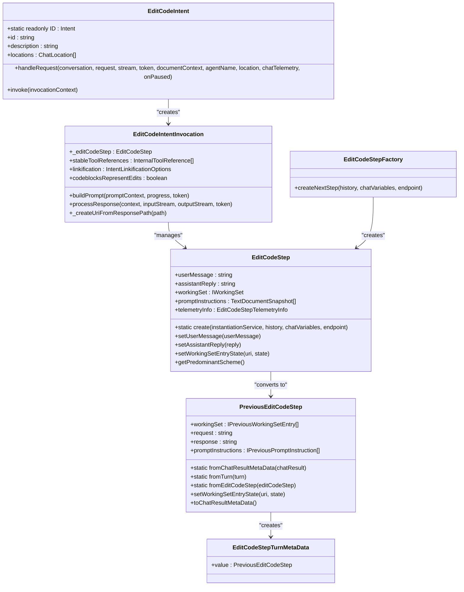
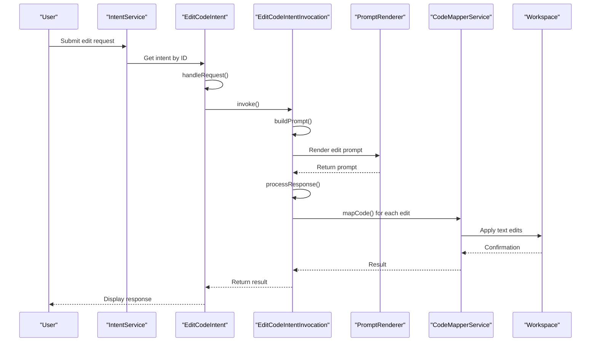
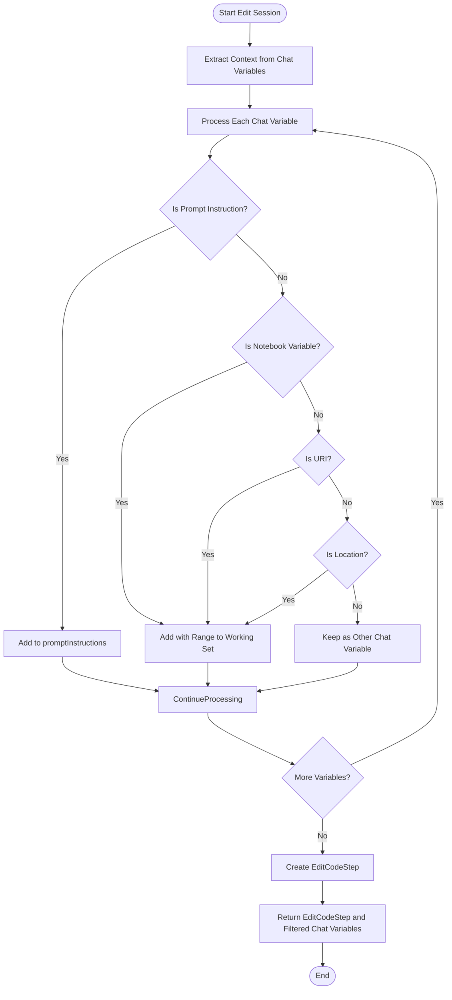
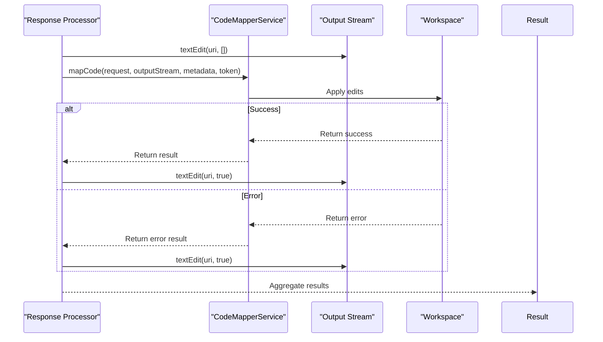
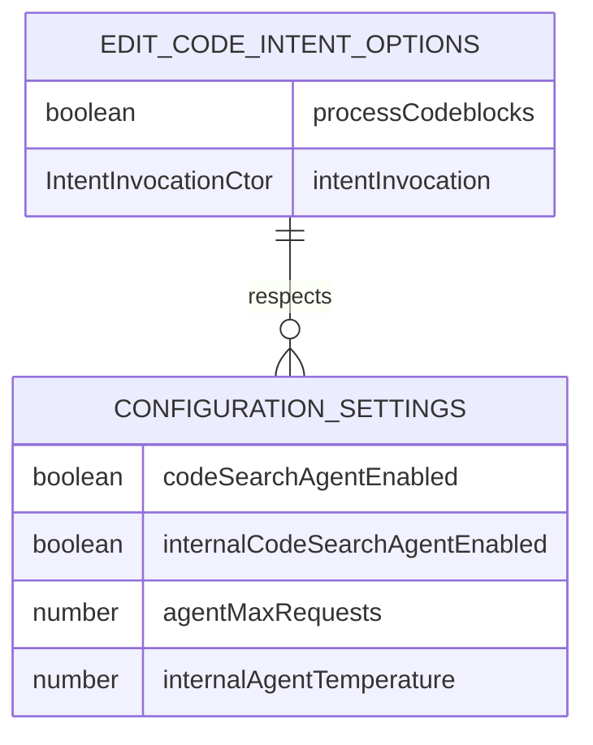
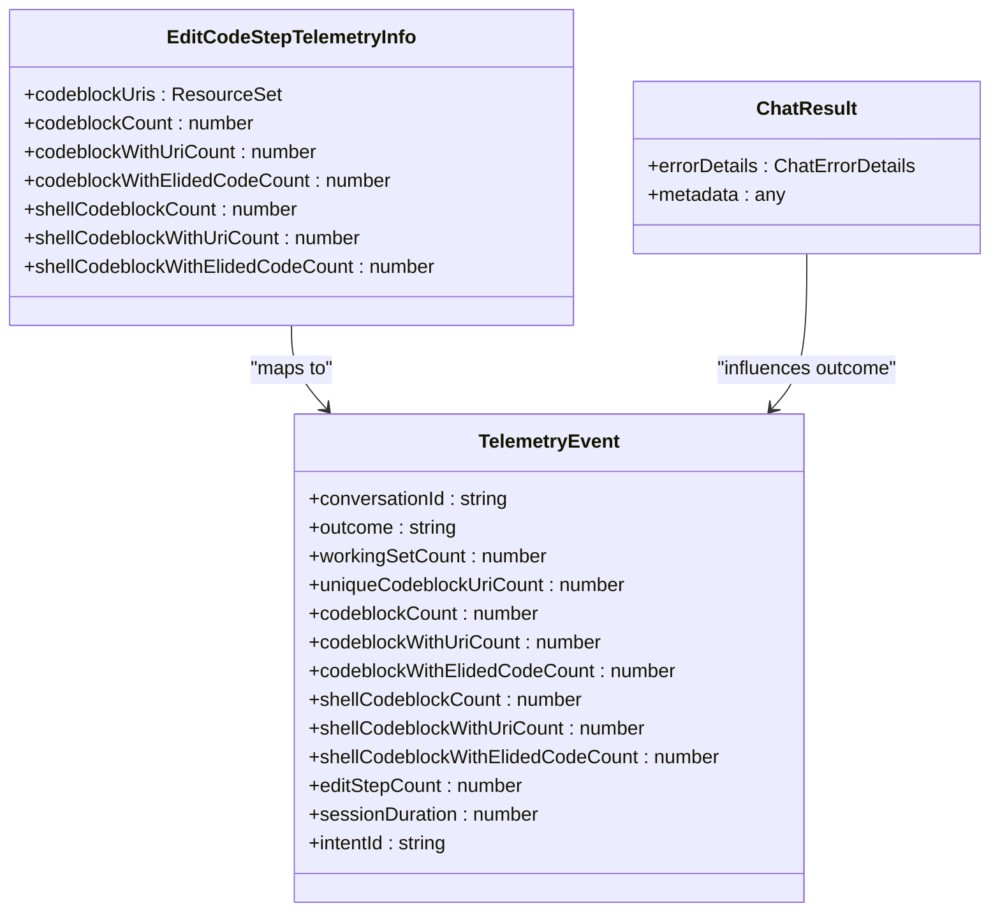

# Edit Code Intent

<cite>
**Referenced Files in This Document**   
- [editCodeIntent.ts](file://src/extension/intents/node/editCodeIntent.ts)
- [editCodeIntent2.ts](file://src/extension/intents/node/editCodeIntent2.ts)
- [editCodeStep.ts](file://src/extension/intents/node/editCodeStep.ts)
- [codeMapperService.ts](file://src/extension/prompts/node/codeMapper/codeMapperService.ts)
- [editCodePrompt.ts](file://src/extension/prompts/node/panel/editCodePrompt.ts)
- [editCodePrompt2.ts](file://src/extension/prompts/node/panel/editCodePrompt2.ts)
- [codeMapper.ts](file://src/extension/prompts/node/codeMapper/codeMapper.ts)
- [intentService.ts](file://src/extension/intents/node/intentService.ts)
</cite>

## Table of Contents
1. [Introduction](#introduction)
2. [Core Architecture](#core-architecture)
3. [Edit Command Processing Flow](#edit-command-processing-flow)
4. [Context Awareness and Working Set Management](#context-awareness-and-working-set-management)
5. [Code Parsing and Validation](#code-parsing-and-validation)
6. [Edit Execution and Workspace Services](#edit-execution-and-workspace-services)
7. [Configuration Options and Parameters](#configuration-options-and-parameters)
8. [Return Values and Telemetry](#return-values-and-telemetry)
9. [Common Issues and Error Handling](#common-issues-and-error-handling)
10. [Performance Considerations](#performance-considerations)
11. [Extensibility and Optimization](#extensibility-and-optimization)

## Introduction

The Edit Code Intent handler in the Node.js context provides a sophisticated system for processing, parsing, and executing code editing commands within the VS Code Copilot environment. This documentation details the implementation of the code editing functionality, focusing on how edit commands are processed with proper context awareness, integrated with code manipulation tools, and applied to the workspace. The system handles both single-file and multi-file editing scenarios, with comprehensive support for validation, tracking, and user confirmation workflows.

The Edit Code Intent system is designed to be extensible and performant, providing developers with a robust foundation for implementing intelligent code editing capabilities. It integrates seamlessly with the broader Copilot chat system, leveraging language models and tool calling capabilities to generate and apply code changes.

**Section sources**
- [editCodeIntent.ts](file://src/extension/intents/node/editCodeIntent.ts#L83-L194)
- [editCodeIntent2.ts](file://src/extension/intents/node/editCodeIntent2.ts#L63-L87)

## Core Architecture

The Edit Code Intent system follows a modular architecture with clear separation of concerns between intent handling, context management, and code manipulation services. The core components include the EditCodeIntent class, EditCodeStep for managing editing sessions, and the CodeMapperService for executing code transformations.



**Diagram sources **
- [editCodeIntent.ts](file://src/extension/intents/node/editCodeIntent.ts#L83-L194)
- [editCodeStep.ts](file://src/extension/intents/node/editCodeStep.ts#L156-L236)
- [editCodeIntent.ts](file://src/extension/intents/node/editCodeIntent.ts#L300-L334)

## Edit Command Processing Flow

The edit command processing flow follows a well-defined sequence from intent invocation to execution. When a user initiates an edit command, the system first determines the appropriate intent handler based on the context and location. The EditCodeIntent class serves as the primary entry point, handling requests from both the editor and panel locations.



**Diagram sources **
- [editCodeIntent.ts](file://src/extension/intents/node/editCodeIntent.ts#L166-L174)
- [editCodeIntent.ts](file://src/extension/intents/node/editCodeIntent.ts#L340-L425)
- [editCodeIntent.ts](file://src/extension/intents/node/editCodeIntent.ts#L511-L630)

## Context Awareness and Working Set Management

The Edit Code Intent system maintains context awareness through the WorkingSet concept, which tracks files and code segments relevant to the current editing session. The EditCodeStep class manages the working set, preserving state across multiple turns in a conversation.

The working set is constructed from chat variables, including file references, selections, and prompt instructions. Each entry in the working set has a state (Initial, Undecided, Accepted, Rejected) that reflects the user's decisions regarding proposed edits. This state is preserved between turns, allowing the system to maintain context throughout an editing session.



**Diagram sources **
- [editCodeStep.ts](file://src/extension/intents/node/editCodeStep.ts#L243-L369)
- [editCodeStep.ts](file://src/extension/intents/node/editCodeStep.ts#L255-L369)

## Code Parsing and Validation

The system parses and validates code blocks from the language model response through the getCodeBlocksFromResponse function. This function processes the response stream, identifying code blocks with associated file paths and validating their content.

The CodeBlockProcessor class handles the parsing of markdown content, extracting code blocks and resolving file paths. When a code block includes a file path in a heading (e.g., "### path/to/file.js"), the processor attempts to resolve this to a URI using the prompt path representation service. The system also handles remote development scenarios by properly constructing URIs with the appropriate authority.

```mermaid
flowchart TD
Start([Response Stream]) --> ProcessText["Process Text Stream"]
ProcessText --> ContainsCodeBlock{"Contains Code Block?"}
ContainsCodeBlock --> |No| EmitText["Emit Text to Output"]
ContainsCodeBlock --> |Yes| ExtractCodeBlock["Extract Code Block"]
ExtractCodeBlock --> HasResource{"Has Resource Path?"}
HasResource --> |No| EmitCodeBlock["Emit Code Block without URI"]
HasResource --> |Yes| ResolvePath["Resolve Path to URI"]
ResolvePath --> PathResolved{"Path Resolved?"}
PathResolved --> |No| CreateUntitled["Create Untitled URI"]
PathResolved --> |Yes| CheckWorkspace["In Workspace?"}
CheckWorkspace --> |Yes| UseResolvedURI["Use Resolved URI"]
CheckWorkspace --> |No| CreateUntitled
CreateUntitled --> WarnUser["Warn User about External File"]
UseResolvedURI --> EmitCodeBlockWithURI["Emit Code Block with URI"]
EmitCodeBlockWithURI --> TrackTelemetry["Track Telemetry"]
EmitCodeBlock --> ContinueProcessing
EmitText --> ContinueProcessing
ContinueProcessing --> MoreText{"More Text?"}
MoreText --> |Yes| ProcessText
MoreText --> |No| End([End])
```

**Diagram sources **
- [editCodeIntent.ts](file://src/extension/intents/node/editCodeIntent.ts#L662-L712)
- [editCodeIntent.ts](file://src/extension/intents/node/editCodeIntent.ts#L532-L594)

## Edit Execution and Workspace Services

The edit execution process is managed by the CodeMapperService, which applies the proposed code changes to the workspace. When the system detects a code block with a valid URI, it initiates the edit process by signaling the start of edits to that file through the outputStream.textEdit() method.

The actual code mapping is performed asynchronously, with each edit request processed in parallel. The system handles both text document edits and notebook edits, using appropriate output stream methods (textEdit for text documents, notebookEdit for notebooks). After the edit operation completes, the system signals completion and handles any errors or annotations.



**Diagram sources **
- [editCodeIntent.ts](file://src/extension/intents/node/editCodeIntent.ts#L569-L588)
- [editCodeIntent.ts](file://src/extension/intents/node/editCodeIntent.ts#L571-L587)

## Configuration Options and Parameters

The Edit Code Intent system supports various configuration options that control its behavior. The EditCodeIntentOptions interface defines the primary configuration parameters, including whether to process code blocks and the intent invocation constructor to use.

The system also respects various configuration settings from the IConfigurationService, such as code search agent enablement and agent temperature settings. These configurations allow fine-tuning of the edit behavior based on user preferences and experimental features.



**Diagram sources **
- [editCodeIntent.ts](file://src/extension/intents/node/editCodeIntent.ts#L75-L81)
- [editCodeIntent2.ts](file://src/extension/intents/node/editCodeIntent2.ts#L80-L85)

## Return Values and Telemetry

The Edit Code Intent system returns structured results through the vscode.ChatResult interface, including error details when applicable. The system also generates comprehensive telemetry data to track usage patterns and performance metrics.

Telemetry is collected at multiple levels, including prompt rendering duration, code block statistics, and edit session outcomes. This data helps monitor system performance and identify areas for improvement. The telemetry includes measurements such as working set count, code block counts, and session duration.



**Diagram sources **
- [editCodeIntent.ts](file://src/extension/intents/node/editCodeIntent.ts#L236-L271)
- [editCodeIntent.ts](file://src/extension/intents/node/editCodeIntent.ts#L428-L441)

## Common Issues and Error Handling

The system handles several common issues that arise during code editing, including edit conflicts, readonly file modifications, and syntax preservation. When a proposed edit targets a readonly file, the system prompts the user for confirmation before proceeding.

The code mapper service handles cancellation through the CancellationToken, allowing users to abort long-running edit operations. The system also tracks annotations from the code mapping process, reporting errors and warnings back to the user interface.

For edit conflicts, the system relies on the underlying workspace service to handle version conflicts when applying text edits. If multiple edits target the same file region, the order of application may affect the final result, so the system processes edits in the order they appear in the response.

**Section sources**
- [editCodeIntent.ts](file://src/extension/intents/node/editCodeIntent.ts#L489-L509)
- [editCodeIntent.ts](file://src/extension/intents/node/editCodeIntent.ts#L607-L619)

## Performance Considerations

The Edit Code Intent system incorporates several performance optimizations to ensure responsive behavior. The prompt rendering process is optimized by pre-processing chat variables and maintaining stable tool references across turns.

The system uses asynchronous processing for code block extraction and edit application, allowing it to handle large responses efficiently. Code blocks are processed as a stream, enabling incremental rendering of the response while edit operations are prepared.

The working set management is optimized to minimize file I/O operations by reusing document snapshots and only loading files when necessary. The system also implements efficient URI resolution and path representation to reduce processing overhead.

**Section sources**
- [editCodeIntent.ts](file://src/extension/intents/node/editCodeIntent.ts#L403-L406)
- [editCodeIntent.ts](file://src/extension/intents/node/editCodeIntent.ts#L518-L528)

## Extensibility and Optimization

The Edit Code Intent system is designed for extensibility, with several extension points for customizing behavior. The EditCodeIntent class can be extended to create specialized edit handlers, as demonstrated by the EditCode2Intent class which adds agent mode capabilities.

The system supports custom tool integration through the IToolsService interface, allowing new editing capabilities to be added without modifying the core intent handling logic. The code mapper service can also be extended to support additional code transformation types beyond simple text replacement.

For optimization, the system could be enhanced with more sophisticated conflict resolution strategies, batched edit operations for improved performance, and intelligent edit ordering based on file dependencies.

**Section sources**
- [editCodeIntent2.ts](file://src/extension/intents/node/editCodeIntent2.ts#L63-L87)
- [editCodeIntent.ts](file://src/extension/intents/node/editCodeIntent.ts#L58-L59)