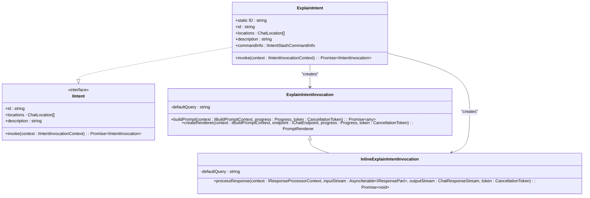

# Explain Intent

<cite>
**Referenced Files in This Document**   
- [explainIntent.ts](file://src/extension/intents/node/explainIntent.ts)
- [explain.tsx](file://src/extension/prompts/node/panel/explain.tsx)
- [currentSelection.tsx](file://src/extension/prompts/node/panel/currentSelection.tsx)
- [symbolDefinitions.tsx](file://src/extension/prompts/node/panel/symbolDefinitions.tsx)
- [symbolAtCursor.tsx](file://src/extension/prompts/node/panel/symbolAtCursor.tsx)
- [terminalExplainIntent.ts](file://src/extension/intents/node/terminalExplainIntent.ts)
- [explain.stest.ts](file://test/e2e/explain.stest.ts)
- [explain.0.conversation.json](file://test/scenarios/test-explain/explain.0.conversation.json)
- [functions.ts](file://test/scenarios/test-explain/functions.ts)
- [foo.ts](file://test/scenarios/test-explain/foo.ts)
</cite>

## Table of Contents
1. [Introduction](#introduction)
2. [Core Components](#core-components)
3. [Architecture Overview](#architecture-overview)
4. [Detailed Component Analysis](#detailed-component-analysis)
5. [Context Gathering Mechanisms](#context-gathering-mechanisms)
6. [Configuration Options](#configuration-options)
7. [Response Processing](#response-processing)
8. [Performance Considerations](#performance-considerations)
9. [Troubleshooting Guide](#troubleshooting-guide)
10. [Conclusion](#conclusion)

## Introduction
The Explain Intent handler in the Node.js context provides code explanation functionality that helps developers understand code by generating detailed explanations of selected code segments. This system integrates with language models, code analysis tools, and context providers to deliver comprehensive code insights. The implementation supports multiple locations including the chat panel, editor, and notebook interfaces, making it accessible in various development contexts.

## Core Components
The Explain Intent system consists of several key components that work together to process explanation requests, gather contextual information, and generate responses. The core implementation is centered around the ExplainIntent class which handles the invocation and routing of explanation requests based on the current context and location.

**Section sources**
- [explainIntent.ts](file://src/extension/intents/node/explainIntent.ts#L68-L90)
- [terminalExplainIntent.ts](file://src/extension/intents/node/terminalExplainIntent.ts#L21-L42)

## Architecture Overview
The Explain Intent architecture follows a modular design pattern where different components handle specific aspects of the explanation process. The system receives explanation requests, processes them through various context providers, and generates responses using language models.

**Diagram sources**
- [explainIntent.ts](file://src/extension/intents/node/explainIntent.ts#L68-L90)
- [explain.tsx](file://src/extension/prompts/node/panel/explain.tsx#L41-L105)
- [currentSelection.tsx](file://src/extension/prompts/node/panel/currentSelection.tsx#L29-L109)
- [symbolDefinitions.tsx](file://src/extension/prompts/node/panel/symbolDefinitions.tsx#L46-L149)
- [symbolAtCursor.tsx](file://src/extension/prompts/node/panel/symbolAtCursor.tsx#L54-L256)

## Detailed Component Analysis

### Explain Intent Implementation
The ExplainIntent class serves as the main entry point for code explanation functionality. It implements the IIntent interface and handles the creation of appropriate invocation instances based on the location from which the explanation request originates.

**Diagram sources**
- [explainIntent.ts](file://src/extension/intents/node/explainIntent.ts#L68-L90)

**Section sources**
- [explainIntent.ts](file://src/extension/intents/node/explainIntent.ts#L68-L90)

### Prompt Rendering System
The prompt rendering system constructs the context for the language model by combining various contextual elements. The ExplainPrompt class orchestrates the inclusion of relevant code context, user instructions, and additional information to create a comprehensive prompt.

**Diagram sources**
- [explain.tsx](file://src/extension/prompts/node/panel/explain.tsx#L41-L105)
- [currentSelection.tsx](file://src/extension/prompts/node/panel/currentSelection.tsx#L29-L109)
- [symbolDefinitions.tsx](file://src/extension/prompts/node/panel/symbolDefinitions.tsx#L46-L149)
- [symbolAtCursor.tsx](file://src/extension/prompts/node/panel/symbolAtCursor.tsx#L54-L256)

**Section sources**
- [explain.tsx](file://src/extension/prompts/node/panel/explain.tsx#L41-L105)

## Context Gathering Mechanisms

### Current Selection Context
The CurrentSelection component gathers the currently selected code in the active editor and includes it in the explanation context. It performs token budget checks to ensure the selection doesn't exceed the model's context window.

**Diagram sources**
- [currentSelection.tsx](file://src/extension/prompts/node/panel/currentSelection.tsx#L29-L109)

**Section sources**
- [currentSelection.tsx](file://src/extension/prompts/node/panel/currentSelection.tsx#L29-L109)

### Symbol Definitions Context
The SymbolDefinitions component identifies relevant function implementations, class declarations, and type declarations related to the selected code. It uses tree-sitter parsing to analyze code structure and find related symbols.

**Diagram sources**
- [symbolDefinitions.tsx](file://src/extension/prompts/node/panel/symbolDefinitions.tsx#L46-L149)

**Section sources**
- [symbolDefinitions.tsx](file://src/extension/prompts/node/panel/symbolDefinitions.tsx#L46-L149)

### Symbol at Cursor Context
The SymbolAtCursor component provides context about symbols at the cursor position, including definitions and references. It supports both explicit scope selection and automatic detection of relevant code blocks.

**Diagram sources**
- [symbolAtCursor.tsx](file://src/extension/prompts/node/panel/symbolAtCursor.tsx#L54-L256)

**Section sources**
- [symbolAtCursor.tsx](file://src/extension/prompts/node/panel/symbolAtCursor.tsx#L54-L256)

## Configuration Options
The Explain Intent system provides configuration options that control the depth and scope of explanations. These options are managed through the configuration service and can be customized by users.

**Diagram sources**
- [symbolAtCursor.tsx](file://src/extension/prompts/node/panel/symbolAtCursor.tsx#L54-L256)
- [explainIntent.ts](file://src/extension/intents/node/explainIntent.ts#L68-L90)

**Section sources**
- [symbolAtCursor.tsx](file://src/extension/prompts/node/panel/symbolAtCursor.tsx#L54-L256)

## Response Processing
The response processing system handles the streaming of responses from the language model and interprets them for display to the user. The InlineExplainIntentInvocation class uses a StreamingMarkdownReplyInterpreter to process responses.

**Diagram sources**
- [explainIntent.ts](file://src/extension/intents/node/explainIntent.ts#L58-L66)

**Section sources**
- [explainIntent.ts](file://src/extension/intents/node/explainIntent.ts#L58-L66)

## Performance Considerations
The Explain Intent system includes several performance optimizations to handle complex codebases efficiently. These include token budget management, asynchronous context gathering, and timeout mechanisms for expensive operations.

**Diagram sources**
- [currentSelection.tsx](file://src/extension/prompts/node/panel/currentSelection.tsx#L29-L109)
- [symbolDefinitions.tsx](file://src/extension/prompts/node/panel/symbolDefinitions.tsx#L46-L149)
- [symbolAtCursor.tsx](file://src/extension/prompts/node/panel/symbolAtCursor.tsx#L54-L256)

**Section sources**
- [currentSelection.tsx](file://src/extension/prompts/node/panel/currentSelection.tsx#L29-L109)
- [symbolDefinitions.tsx](file://src/extension/prompts/node/panel/symbolDefinitions.tsx#L46-L149)
- [symbolAtCursor.tsx](file://src/extension/prompts/node/panel/symbolAtCursor.tsx#L54-L256)

## Troubleshooting Guide
Common issues with the Explain Intent system include context limitations, explanation accuracy, and performance problems with large codebases. The following guidance addresses these issues:

**Context Limitations**: When the selected code exceeds the token budget, the system drops the selection and notifies the user. Users should reduce their selection to the most relevant part of the code.

**Explanation Accuracy**: The system may provide inaccurate explanations when it lacks sufficient context about the code. Ensuring relevant files are open and properly indexed can improve accuracy.

**Performance Issues**: For large codebases, the context gathering process may be slow. The system uses timeouts to prevent blocking operations, but users may experience delays in receiving explanations.

**Section sources**
- [currentSelection.tsx](file://src/extension/prompts/node/panel/currentSelection.tsx#L29-L109)
- [symbolDefinitions.tsx](file://src/extension/prompts/node/panel/symbolDefinitions.tsx#L46-L149)
- [symbolAtCursor.tsx](file://src/extension/prompts/node/panel/symbolAtCursor.tsx#L54-L256)

## Conclusion
The Explain Intent handler provides a comprehensive code explanation system that integrates with various context providers to deliver detailed insights about code functionality. By leveraging language models, code analysis tools, and intelligent context gathering, the system helps developers understand complex codebases more effectively. The modular architecture allows for extensibility and optimization, making it adaptable to different development scenarios and code complexity levels.