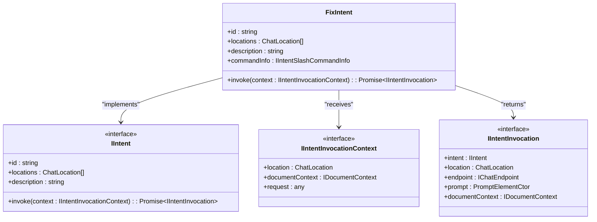
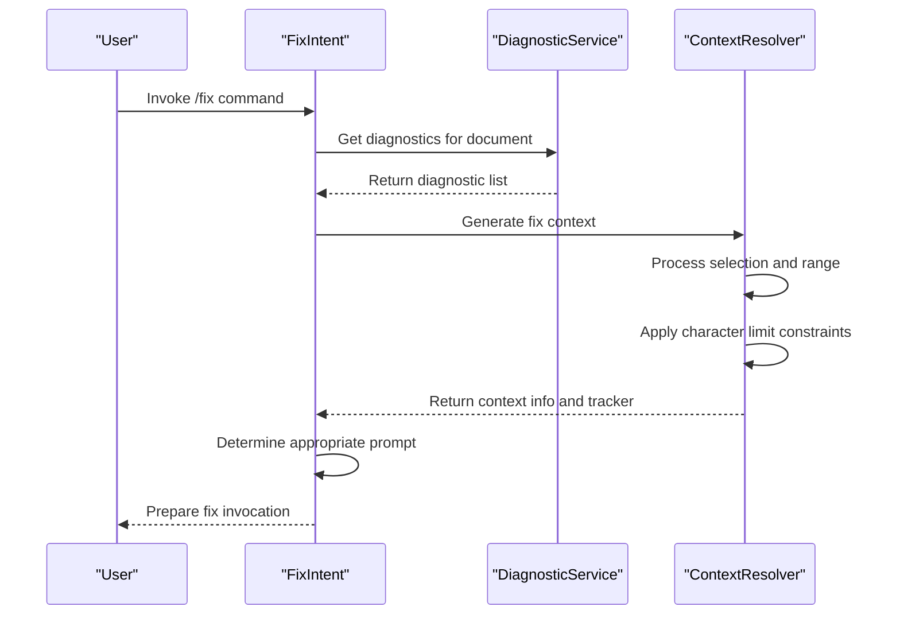
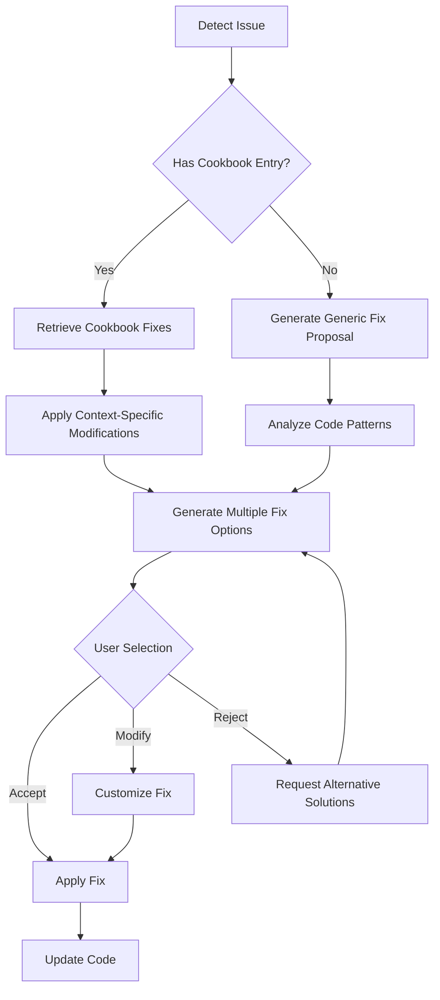
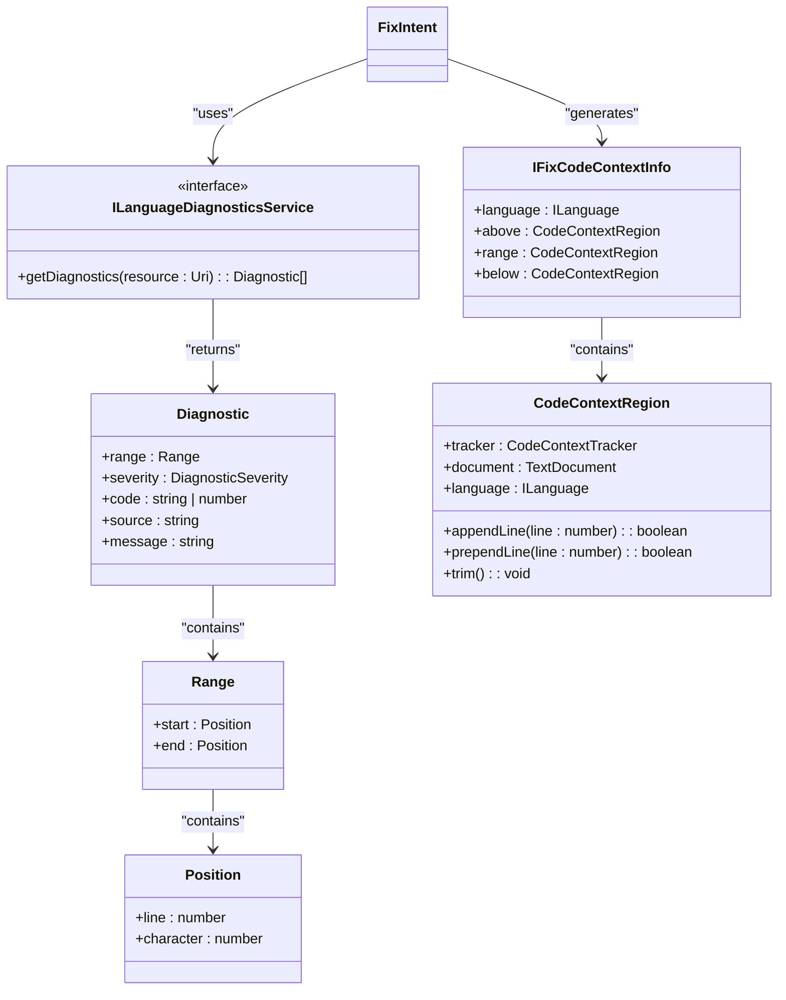
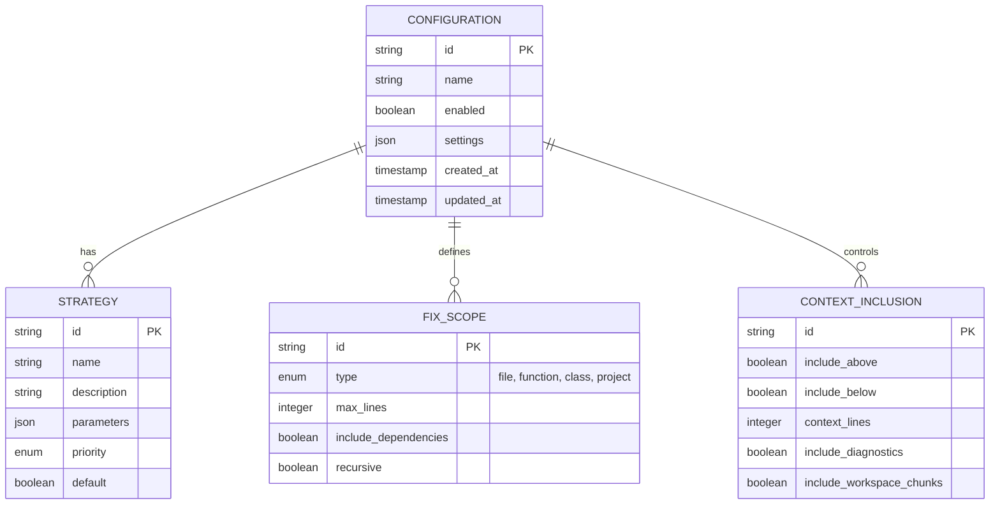
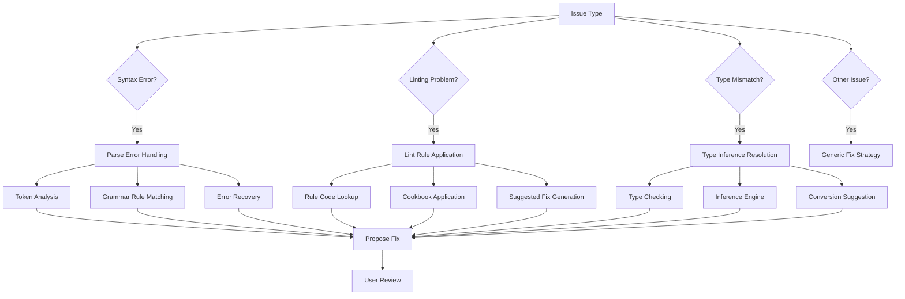
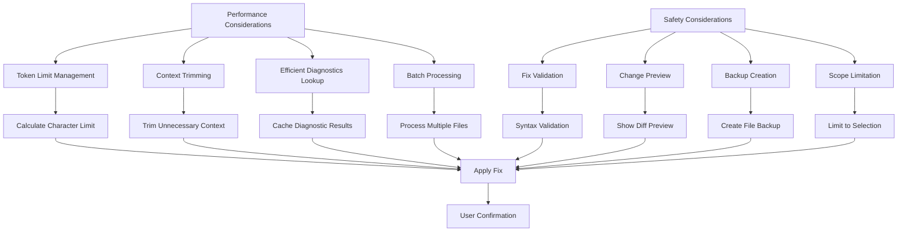
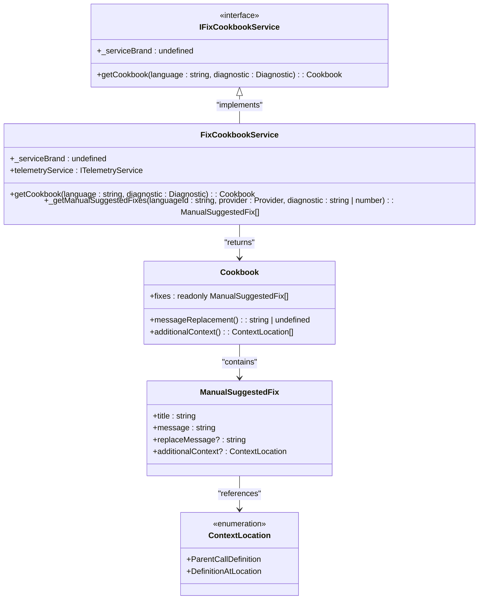

# Fix Intent

<cite>
**Referenced Files in This Document**   
- [fixIntent.ts](file://src/extension/intents/node/fixIntent.ts)
- [fixSelection.ts](file://src/extension/context/node/resolvers/fixSelection.ts)
- [fixCookbookService.ts](file://src/extension/prompts/node/inline/fixCookbookService.ts)
- [pythonCookbookData.ts](file://src/extension/prompts/node/inline/pythonCookbookData.ts)
- [fixing.stest.ts](file://test/inline/fixing.stest.ts)
- [fixTestFailureContributions.ts](file://src/extension/intents/vscode-node/fixTestFailureContributions.ts)
</cite>

## Table of Contents
1. [Introduction](#introduction)
2. [Fix Intent Architecture](#fix-intent-architecture)
3. [Issue Detection and Diagnostic Gathering](#issue-detection-and-diagnostic-gathering)
4. [Fix Proposal and Application](#fix-proposal-and-application)
5. [Integration with Diagnostic Services](#integration-with-diagnostic-services)
6. [Configuration Options and Strategies](#configuration-options-and-strategies)
7. [Handling Different Issue Types](#handling-different-issue-types)
8. [Performance and Safety Considerations](#performance-and-safety-considerations)
9. [Extensibility and Optimization](#extensibility-and-optimization)
10. [Conclusion](#conclusion)

## Introduction
The Fix Intent handler in the Node.js context provides an intelligent code fixing capability that detects issues, gathers diagnostic information, and proposes appropriate fixes. This documentation thoroughly explains the implementation of the code fixing functionality, including how different types of issues are identified and resolved, the integration with diagnostic services and code analysis tools, and the configuration options available for fix strategies.

**Section sources**
- [fixIntent.ts](file://src/extension/intents/node/fixIntent.ts#L22-L63)

## Fix Intent Architecture
The Fix Intent implementation follows a modular architecture with distinct components responsible for different aspects of the code fixing process. The core component is the `FixIntent` class that implements the `IIntent` interface, serving as the entry point for the fix functionality.

**Diagram sources**
- [fixIntent.ts](file://src/extension/intents/node/fixIntent.ts#L22-L63)

**Section sources**
- [fixIntent.ts](file://src/extension/intents/node/fixIntent.ts#L22-L63)

## Issue Detection and Diagnostic Gathering
The Fix Intent handler detects issues through integration with the diagnostic services and gathers relevant context information to understand the problem fully. The diagnostic gathering process involves identifying the specific code region that needs fixing and collecting surrounding context.

**Diagram sources**
- [fixIntent.ts](file://src/extension/intents/node/fixIntent.ts#L36-L62)
- [fixSelection.ts](file://src/extension/context/node/resolvers/fixSelection.ts#L24-L64)

**Section sources**
- [fixSelection.ts](file://src/extension/context/node/resolvers/fixSelection.ts#L24-L120)

## Fix Proposal and Application
The fix proposal system analyzes detected issues and suggests appropriate solutions based on predefined patterns and heuristics. The system uses a cookbook-based approach to map diagnostic codes to potential fixes, providing multiple solution options when applicable.

**Diagram sources**
- [fixCookbookService.ts](file://src/extension/prompts/node/inline/fixCookbookService.ts#L33-L104)
- [pythonCookbookData.ts](file://src/extension/prompts/node/inline/pythonCookbookData.ts#L9-L313)

**Section sources**
- [fixCookbookService.ts](file://src/extension/prompts/node/inline/fixCookbookService.ts#L13-L110)
- [pythonCookbookData.ts](file://src/extension/prompts/node/inline/pythonCookbookData.ts#L9-L313)

## Integration with Diagnostic Services
The Fix Intent handler integrates seamlessly with various diagnostic services to identify and resolve code issues. It works with language-specific diagnostic providers such as ESLint, TypeScript compiler (TSC), and Ruff for Python, among others.

**Diagram sources**
- [fixSelection.ts](file://src/extension/context/node/resolvers/fixSelection.ts#L7-L21)
- [fixIntent.ts](file://src/extension/intents/node/fixIntent.ts#L7-L11)

**Section sources**
- [fixSelection.ts](file://src/extension/context/node/resolvers/fixSelection.ts#L7-L120)

## Configuration Options and Strategies
The Fix Intent system provides various configuration options and strategies to customize the fix behavior according to user preferences and project requirements. These options control aspects such as fix scope, context inclusion, and retry behavior.

**Diagram sources**
- [fixIntent.ts](file://src/extension/intents/node/fixIntent.ts#L57-L60)
- [fixSelection.ts](file://src/extension/context/node/resolvers/fixSelection.ts#L54-L59)

**Section sources**
- [fixIntent.ts](file://src/extension/intents/node/fixIntent.ts#L56-L61)

## Handling Different Issue Types
The Fix Intent system handles various types of issues including syntax errors, linting problems, and type mismatches. Each issue type is processed according to its specific characteristics and requirements.

**Diagram sources**
- [fixing.stest.ts](file://test/inline/fixing.stest.ts#L18-L800)
- [fixCookbookService.ts](file://src/extension/prompts/node/inline/fixCookbookService.ts#L119-L235)

**Section sources**
- [fixing.stest.ts](file://test/inline/fixing.stest.ts#L18-L800)

## Performance and Safety Considerations
The Fix Intent implementation includes several performance and safety considerations to ensure efficient operation and prevent unintended code modifications. These considerations address issues such as false positives, fix safety, and performance at scale.

**Diagram sources**
- [fixSelection.ts](file://src/extension/context/node/resolvers/fixSelection.ts#L31-L33)
- [fixIntent.ts](file://src/extension/intents/node/fixIntent.ts#L56-L60)

**Section sources**
- [fixSelection.ts](file://src/extension/context/node/resolvers/fixSelection.ts#L31-L64)

## Extensibility and Optimization
The Fix Intent system is designed to be extensible and optimizable, allowing for the addition of new fix patterns and improvement of existing ones. The cookbook-based approach enables easy extension of fix capabilities.

**Diagram sources**
- [fixCookbookService.ts](file://src/extension/prompts/node/inline/fixCookbookService.ts#L13-L37)
- [pythonCookbookData.ts](file://src/extension/prompts/node/inline/pythonCookbookData.ts#L9-L313)

**Section sources**
- [fixCookbookService.ts](file://src/extension/prompts/node/inline/fixCookbookService.ts#L13-L110)

## Conclusion
The Fix Intent handler in the Node.js context provides a comprehensive solution for detecting and resolving code issues. By integrating with diagnostic services, leveraging cookbook-based fix patterns, and providing configurable strategies, it offers a powerful tool for improving code quality. The system's architecture supports extensibility and optimization, making it adaptable to various coding standards and project requirements. With careful attention to performance and safety considerations, the Fix Intent handler delivers reliable code fixes while minimizing the risk of unintended consequences.