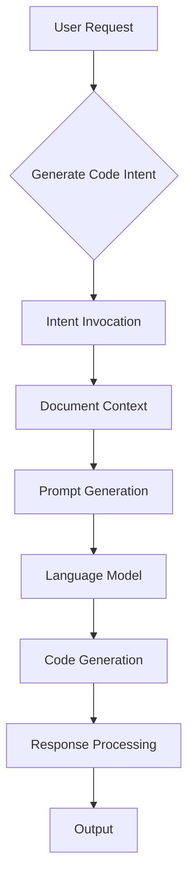
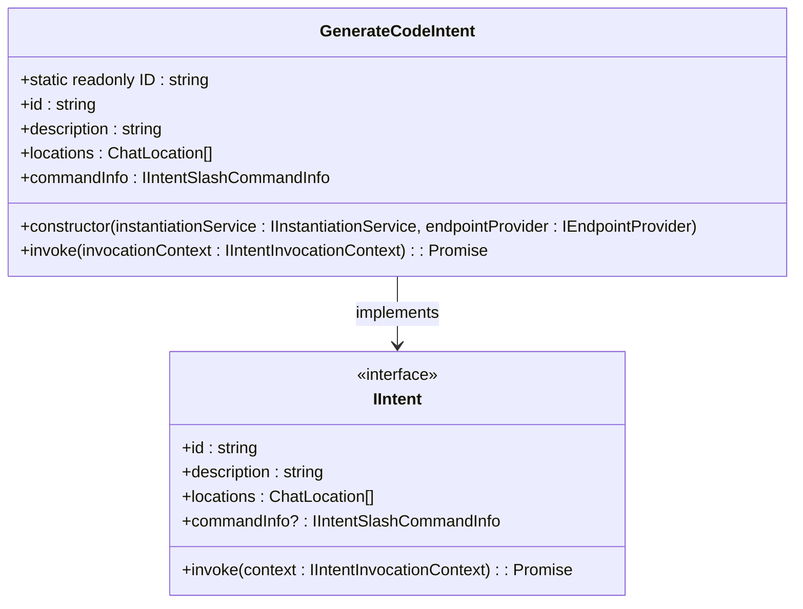
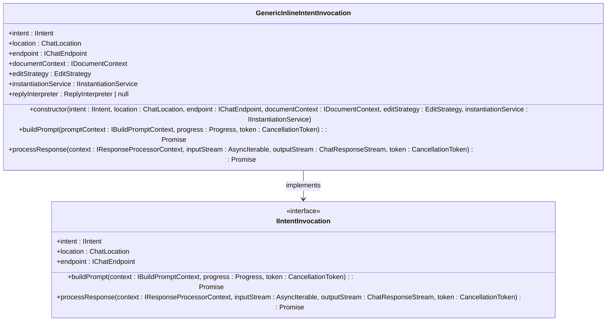
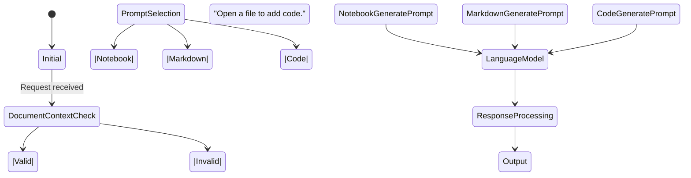
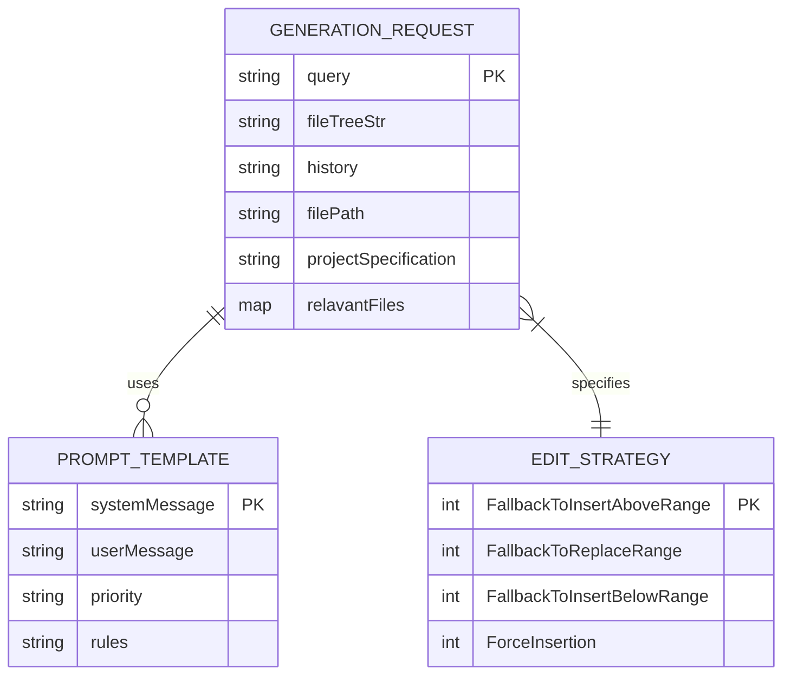
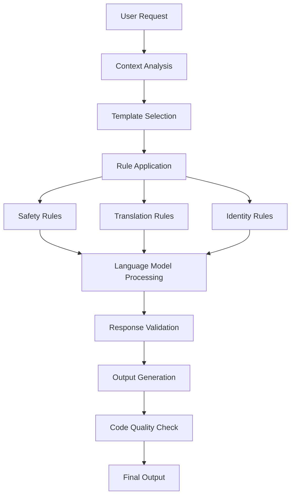

# Generate Code Intent

<cite>
**Referenced Files in This Document**   
- [generateCodeIntent.ts](file://src/extension/intents/node/generateCodeIntent.ts)
- [generateNewWorkspaceContent.ts](file://src/extension/intents/node/generateNewWorkspaceContent.ts)
- [intents.ts](file://src/extension/prompt/node/intents.ts)
- [genericInlineIntentInvocation.ts](file://src/extension/context/node/resolvers/genericInlineIntentInvocation.ts)
- [editGeneration.ts](file://src/extension/prompt/node/editGeneration.ts)
- [newWorkspaceContents.tsx](file://src/extension/prompts/node/panel/newWorkspace/newWorkspaceContents.tsx)
- [inlineChatGenerateCodePrompt.tsx](file://src/extension/prompts/node/inline/inlineChatGenerateCodePrompt.tsx)
</cite>

## Table of Contents
1. [Introduction](#introduction)
2. [Core Components](#core-components)
3. [Architecture Overview](#architecture-overview)
4. [Detailed Component Analysis](#detailed-component-analysis)
5. [Code Generation Patterns](#code-generation-patterns)
6. [Configuration and Parameters](#configuration-and-parameters)
7. [Performance and Quality Considerations](#performance-and-quality-considerations)
8. [Troubleshooting Guide](#troubleshooting-guide)
9. [Conclusion](#conclusion)

## Introduction
The Generate Code Intent handler in the Node.js context provides a sophisticated system for generating code based on user requirements. This documentation details the implementation of code generation functionality, including how generation requests are processed, templates are selected, and code is produced with proper context awareness. The system integrates with language models, code templates, and workspace creation tools to deliver accurate and contextually appropriate code generation capabilities.

## Core Components

The Generate Code Intent system consists of several key components that work together to process code generation requests. The main components include the GenerateCodeIntent class, which handles intent invocation, and various prompt generation classes that create the appropriate context for code generation. The system also includes specialized generators for different types of content, such as file contents and project specifications.

**Section sources**
- [generateCodeIntent.ts](file://src/extension/intents/node/generateCodeIntent.ts#L1-L39)
- [generateNewWorkspaceContent.ts](file://src/extension/intents/node/generateNewWorkspaceContent.ts#L1-L95)

## Architecture Overview

The Generate Code Intent system follows a modular architecture that separates concerns between intent handling, prompt generation, and code generation. When a user requests code generation, the system processes the request through a series of components that prepare the appropriate context and invoke the language model with the correct parameters.

**Diagram sources**
- [generateCodeIntent.ts](file://src/extension/intents/node/generateCodeIntent.ts#L1-L39)
- [intents.ts](file://src/extension/prompt/node/intents.ts#L1-L397)

## Detailed Component Analysis

### Generate Code Intent Implementation

The GenerateCodeIntent class implements the IIntent interface and serves as the entry point for code generation requests. It validates the document context and creates an appropriate invocation instance based on the request parameters.

**Diagram sources**
- [generateCodeIntent.ts](file://src/extension/intents/node/generateCodeIntent.ts#L1-L39)

**Section sources**
- [generateCodeIntent.ts](file://src/extension/intents/node/generateCodeIntent.ts#L1-L39)

### Prompt Generation System

The prompt generation system creates contextually appropriate prompts for code generation based on the document type and user requirements. Different prompt classes are used for different scenarios, such as generating code in regular files, markdown files, or notebook cells.

**Diagram sources**
- [genericInlineIntentInvocation.ts](file://src/extension/context/node/resolvers/genericInlineIntentInvocation.ts#L1-L86)

**Section sources**
- [genericInlineIntentInvocation.ts](file://src/extension/context/node/resolvers/genericInlineIntentInvocation.ts#L1-L86)

## Code Generation Patterns

The system supports different code generation patterns based on the context and user requirements. The EditStrategy enum defines various approaches for handling code generation, with ForceInsertion being the primary strategy for code generation requests.

**Diagram sources**
- [editGeneration.ts](file://src/extension/prompt/node/editGeneration.ts#L1-L85)
- [genericInlineIntentInvocation.ts](file://src/extension/context/node/resolvers/genericInlineIntentInvocation.ts#L1-L86)

**Section sources**
- [editGeneration.ts](file://src/extension/prompt/node/editGeneration.ts#L1-L85)

## Configuration and Parameters

The code generation system supports various configuration options that affect how code is generated. These include parameters for controlling the generation process, specifying file types, and defining project structures.

**Diagram sources**
- [newWorkspaceContents.tsx](file://src/extension/prompts/node/panel/newWorkspace/newWorkspaceContents.tsx#L1-L144)
- [editGeneration.ts](file://src/extension/prompt/node/editGeneration.ts#L1-L85)

**Section sources**
- [newWorkspaceContents.tsx](file://src/extension/prompts/node/panel/newWorkspace/newWorkspaceContents.tsx#L1-L144)

## Performance and Quality Considerations

The code generation system includes several features to ensure code quality and performance. These include safety rules, response translation rules, and identity rules that guide the language model's output to produce high-quality, consistent code.

**Diagram sources**
- [newWorkspaceContents.tsx](file://src/extension/prompts/node/panel/newWorkspace/newWorkspaceContents.tsx#L1-L144)
- [intents.ts](file://src/extension/prompt/node/intents.ts#L1-L397)

**Section sources**
- [newWorkspaceContents.tsx](file://src/extension/prompts/node/panel/newWorkspace/newWorkspaceContents.tsx#L1-L144)

## Troubleshooting Guide

When encountering issues with code generation, consider the following common problems and solutions:

1. **No document context**: Ensure a file is open when requesting code generation
2. **Incorrect template selection**: Verify the file type and extension match the expected format
3. **Poor code quality**: Check that safety and translation rules are properly configured
4. **Performance issues**: Monitor the complexity of generation requests and consider breaking them into smaller parts

**Section sources**
- [generateCodeIntent.ts](file://src/extension/intents/node/generateCodeIntent.ts#L1-L39)
- [intents.ts](file://src/extension/prompt/node/intents.ts#L1-L397)

## Conclusion

The Generate Code Intent handler provides a robust framework for generating code in the Node.js context. By leveraging a modular architecture, context-aware prompt generation, and comprehensive rule systems, the system delivers high-quality code generation capabilities that adapt to various scenarios and requirements. The integration with language models and workspace tools enables developers to efficiently generate code while maintaining consistency and quality standards.