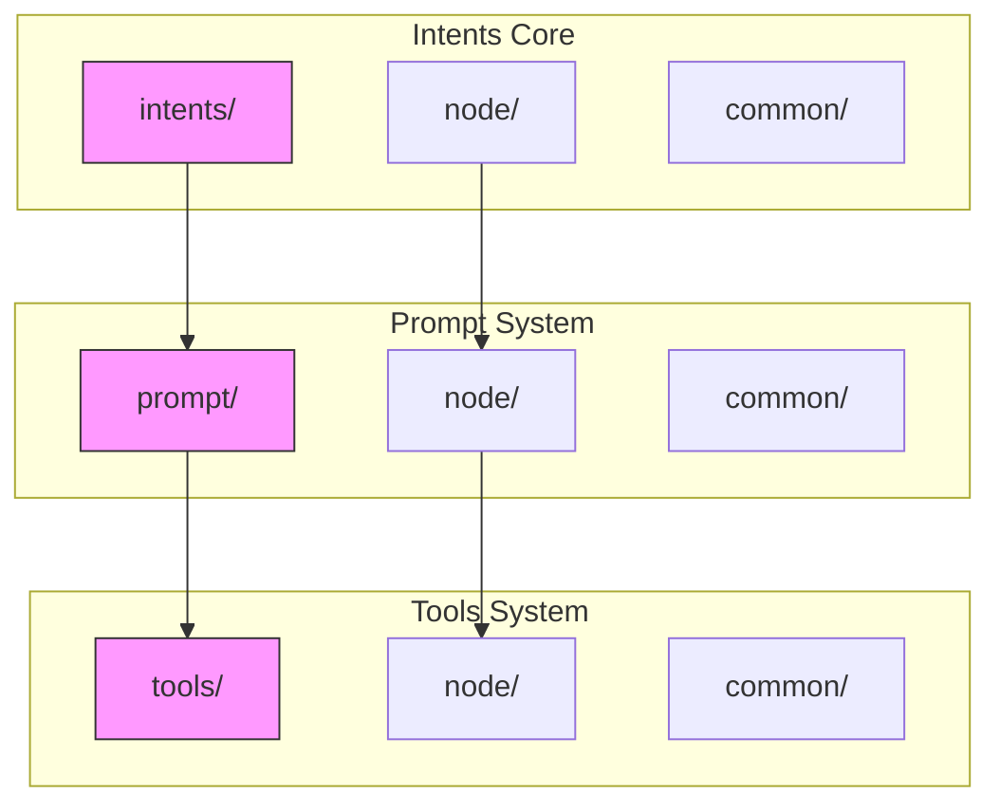
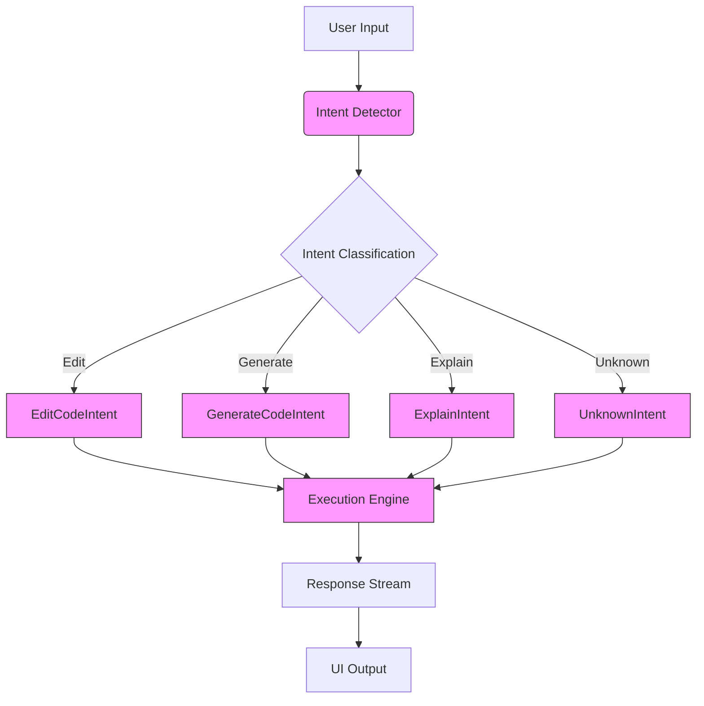
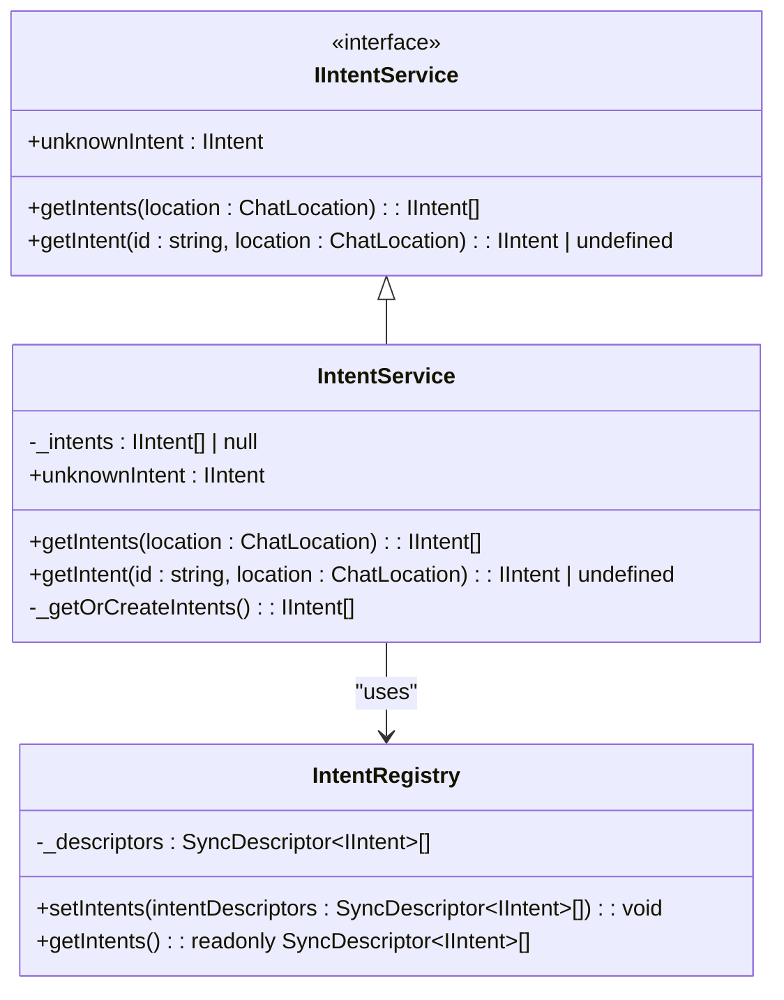
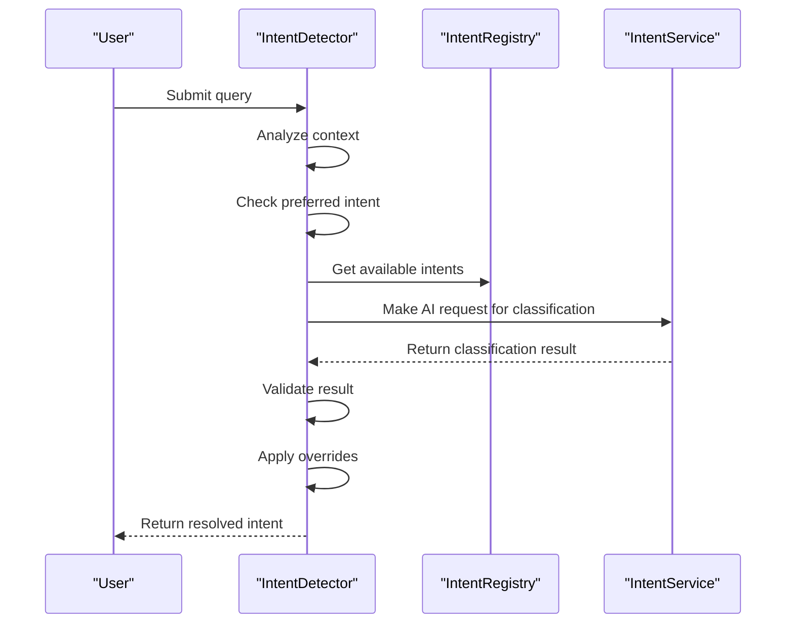
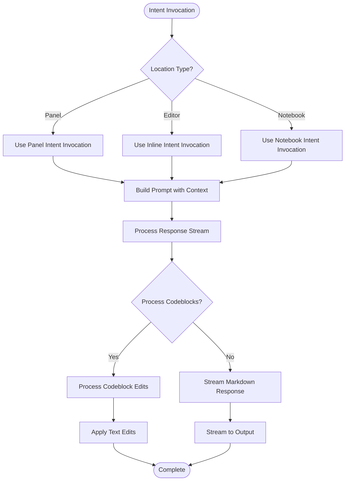
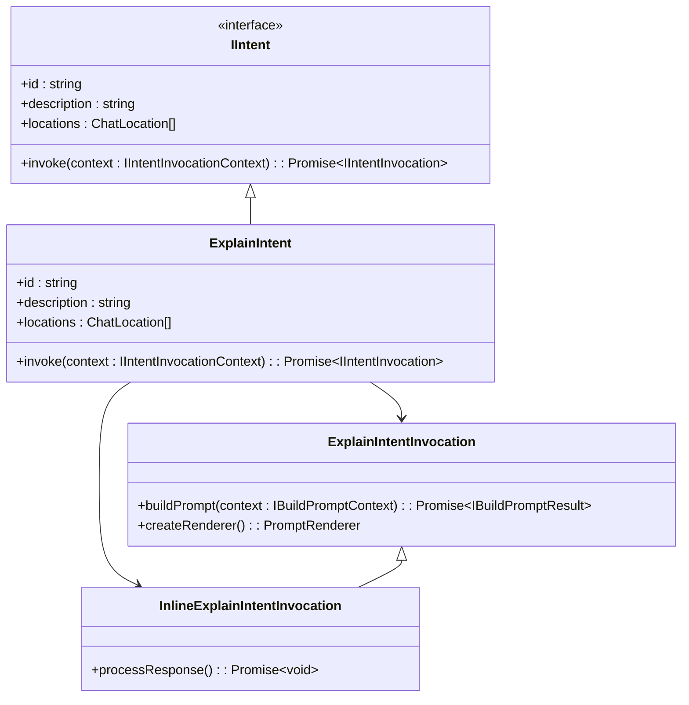
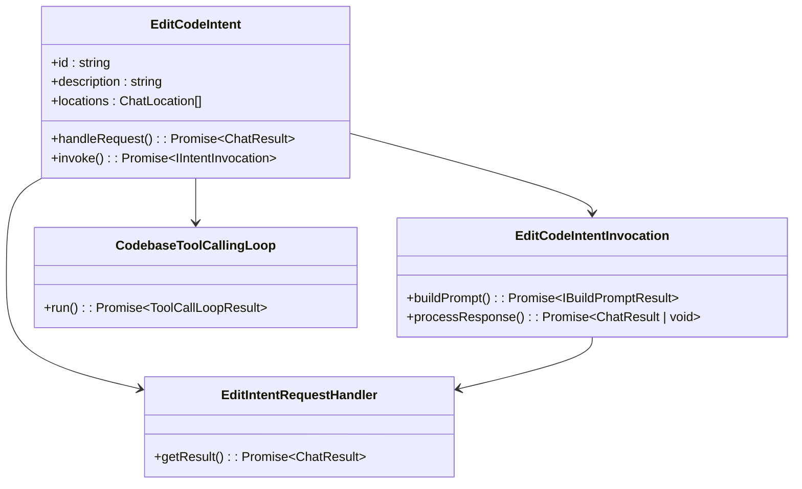

# Intent Service

<cite>
**Referenced Files in This Document**   
- [intentService.ts](file://src/extension/intents/node/intentService.ts)
- [intentDetector.tsx](file://src/extension/prompt/node/intentDetector.tsx)
- [intentRegistry.ts](file://src/extension/prompt/node/intentRegistry.ts)
- [intents.ts](file://src/extension/prompt/node/intents.ts)
- [unknownIntent.ts](file://src/extension/intents/node/unknownIntent.ts)
- [explainIntent.ts](file://src/extension/intents/node/explainIntent.ts)
- [editCodeIntent.ts](file://src/extension/intents/node/editCodeIntent.ts)
- [generateCodeIntent.ts](file://src/extension/intents/node/generateCodeIntent.ts)
- [allIntents.ts](file://src/extension/intents/node/allIntents.ts)
- [constants.ts](file://src/extension/common/constants.ts)
</cite>

## Table of Contents
1. [Introduction](#introduction)
2. [Project Structure](#project-structure)
3. [Core Components](#core-components)
4. [Architecture Overview](#architecture-overview)
5. [Detailed Component Analysis](#detailed-component-analysis)
6. [Dependency Analysis](#dependency-analysis)
7. [Performance Considerations](#performance-considerations)
8. [Troubleshooting Guide](#troubleshooting-guide)
9. [Conclusion](#conclusion)

## Introduction
The Intent Service in the Node.js context is a core component of the Copilot chat system that handles the routing and execution of user commands based on detected intents. This service analyzes user input to determine the appropriate action, such as code explanation, editing, or generation, and routes the request to the corresponding handler. The system uses a combination of rule-based detection and AI-powered classification to accurately identify user intentions and execute them within the appropriate context (panel, inline editor, or notebook). This documentation provides a comprehensive analysis of the intent routing and execution engine, including its architecture, lifecycle management, error handling, and integration with other systems.

## Project Structure
The Intent Service is organized within the extension's directory structure with a clear separation between common interfaces, Node.js implementations, and VS Code-specific contributions. The core intent system is located in the `src/extension/intents/` directory, with additional related components in the `prompt/` and `tools/` directories.



**Diagram sources**
- [intentService.ts](file://src/extension/intents/node/intentService.ts)
- [intentDetector.tsx](file://src/extension/prompt/node/intentDetector.tsx)
- [intents.ts](file://src/extension/prompt/node/intents.ts)

**Section sources**
- [intentService.ts](file://src/extension/intents/node/intentService.ts)
- [intentDetector.tsx](file://src/extension/prompt/node/intentDetector.tsx)

## Core Components
The Intent Service consists of several key components that work together to parse, match, and execute user commands. The core functionality is provided by the `IntentService` class which implements the `IIntentService` interface, allowing for dependency injection and service orientation. The system uses an `IntentRegistry` to manage available intents and their configurations, and an `IntentDetector` to analyze user input and determine the appropriate intent. Each intent type (Edit, Generate, Explain, etc.) has its own implementation that defines how the command should be processed and executed.

**Section sources**
- [intentService.ts](file://src/extension/intents/node/intentService.ts)
- [intentRegistry.ts](file://src/extension/prompt/node/intentRegistry.ts)
- [intents.ts](file://src/extension/prompt/node/intents.ts)

## Architecture Overview
The Intent Service follows a modular architecture with clear separation of concerns between intent detection, routing, and execution. The system uses a service-oriented design pattern with dependency injection to manage component relationships and lifecycle.



**Diagram sources**
- [intentService.ts](file://src/extension/intents/node/intentService.ts)
- [intentDetector.tsx](file://src/extension/prompt/node/intentDetector.tsx)
- [intents.ts](file://src/extension/prompt/node/intents.ts)

## Detailed Component Analysis

### Intent Service Implementation
The Intent Service is implemented as a service class that provides methods for retrieving and managing intents. It uses lazy initialization to create intent instances only when needed, improving startup performance.



**Diagram sources**
- [intentService.ts](file://src/extension/intents/node/intentService.ts)
- [intentRegistry.ts](file://src/extension/prompt/node/intentRegistry.ts)

**Section sources**
- [intentService.ts](file://src/extension/intents/node/intentService.ts)
- [intentRegistry.ts](file://src/extension/prompt/node/intentRegistry.ts)

### Intent Detection and Routing
The intent detection system uses a combination of rule-based logic and AI-powered classification to determine user intent. The `IntentDetector` class implements the `ChatParticipantDetectionProvider` interface and processes user input to identify the appropriate intent.



**Diagram sources**
- [intentDetector.tsx](file://src/extension/prompt/node/intentDetector.tsx)
- [intentService.ts](file://src/extension/intents/node/intentService.ts)

**Section sources**
- [intentDetector.tsx](file://src/extension/prompt/node/intentDetector.tsx)

### Intent Execution Engine
The intent execution system follows a hierarchical pattern where each intent type has its own implementation that defines how commands should be processed. The execution engine handles the lifecycle of intent processing, from initial invocation to response streaming.



**Diagram sources**
- [intents.ts](file://src/extension/prompt/node/intents.ts)
- [editCodeIntent.ts](file://src/extension/intents/node/editCodeIntent.ts)
- [generateCodeIntent.ts](file://src/extension/intents/node/generateCodeIntent.ts)

**Section sources**
- [intents.ts](file://src/extension/prompt/node/intents.ts)
- [editCodeIntent.ts](file://src/extension/intents/node/editCodeIntent.ts)

### Specific Intent Implementations

#### Explain Intent
The Explain Intent provides code explanation functionality, generating natural language descriptions of selected code. It uses different invocation strategies based on the chat location.



**Diagram sources**
- [explainIntent.ts](file://src/extension/intents/node/explainIntent.ts)
- [intents.ts](file://src/extension/prompt/node/intents.ts)

**Section sources**
- [explainIntent.ts](file://src/extension/intents/node/explainIntent.ts)

#### Edit Code Intent
The Edit Code Intent handles code modification requests, supporting both single-file and multi-file edits. It integrates with the codebase tool system for advanced code search and modification capabilities.



**Diagram sources**
- [editCodeIntent.ts](file://src/extension/intents/node/editCodeIntent.ts)
- [intents.ts](file://src/extension/prompt/node/intents.ts)

**Section sources**
- [editCodeIntent.ts](file://src/extension/intents/node/editCodeIntent.ts)

#### Generate Code Intent
The Generate Code Intent handles code creation requests, specifically designed for inline editor contexts where new code should be inserted at the cursor position.

```mermaid
classDiagram
class GenerateCodeIntent {
+id : string
+description : string
+locations : ChatLocation[]
+invoke() : Promise~IIntentInvocation~
}
class GenericInlineIntentInvocation {
+buildPrompt() : Promise~IBuildPromptResult~
+processResponse() : Promise~void~
}
GenerateCodeIntent --> GenericInlineIntentInvocation
GenerateCodeIntent -.-> EditStrategy : "uses"
class EditStrategy {
<<enumeration>>
+ForceInsertion
+FallbackToReplaceRange
}
```

**Diagram sources**
- [generateCodeIntent.ts](file://src/extension/intents/node/generateCodeIntent.ts)
- [intents.ts](file://src/extension/prompt/node/intents.ts)

**Section sources**
- [generateCodeIntent.ts](file://src/extension/intents/node/generateCodeIntent.ts)

## Dependency Analysis
The Intent Service has a well-defined dependency structure that follows the inversion of control principle. Core services are injected through the constructor, allowing for better testability and modularity.

```mermaid
graph TD
A[IntentService] --> B[IInstantiationService]
A --> C[IntentRegistry]
D[IntentDetector] --> E[ILogService]
D --> F[IEndpointProvider]
D --> G[ITelemetryService]
D --> H[IConfigurationService]
D --> I[IIntentService]
D --> J[IInstantiationService]
K[EditCodeIntent] --> L[IInstantiationService]
K --> M[IEndpointProvider]
K --> N[IConfigurationService]
K --> O[IExperimentationService]
K --> P[ICodeMapperService]
K --> Q[IWorkspaceService]
classDef service fill:#bbf,stroke:#333,color:#fff;
class B,C,E,F,G,H,I,J,L,M,N,O,P,Q service;
```



**Diagram sources**
- [intentService.ts](file://src/extension/intents/node/intentService.ts)
- [intentDetector.tsx](file://src/extension/prompt/node/intentDetector.tsx)
- [editCodeIntent.ts](file://src/extension/intents/node/editCodeIntent.ts)

**Section sources**
- [intentService.ts](file://src/extension/intents/node/intentService.ts)
- [intentDetector.tsx](file://src/extension/prompt/node/intentDetector.tsx)
- [editCodeIntent.ts](file://src/extension/intents/node/editCodeIntent.ts)

## Performance Considerations
The Intent Service is designed with performance in mind, using lazy initialization and caching to minimize startup overhead. The system employs several optimization strategies:

1. **Lazy Initialization**: Intent instances are created only when first accessed, reducing memory usage and startup time.
2. **Caching**: The IntentService caches the list of available intents after the first retrieval.
3. **Efficient Detection**: The intent detection process uses both rule-based shortcuts and AI classification, with fallback mechanisms to ensure responsiveness.
4. **Stream Processing**: Response processing is handled as a stream, allowing for incremental rendering and reducing perceived latency.

The system also includes telemetry collection to monitor performance metrics and identify potential bottlenecks in the intent detection and execution pipeline.

## Troubleshooting Guide
When troubleshooting issues with the Intent Service, consider the following common scenarios:

**Section sources**
- [intentService.ts](file://src/extension/intents/node/intentService.ts)
- [intentDetector.tsx](file://src/extension/prompt/node/intentDetector.tsx)
- [intents.ts](file://src/extension/prompt/node/intents.ts)

## Conclusion
The Intent Service provides a robust framework for handling user commands in the Node.js context, with a well-structured architecture that supports extensibility and maintainability. The system effectively combines rule-based logic with AI-powered classification to accurately detect user intentions and route them to the appropriate handlers. Its modular design, clear separation of concerns, and comprehensive error handling make it a reliable component of the Copilot chat system. The service's integration with the chat session and tool systems enables rich functionality while maintaining performance and responsiveness.