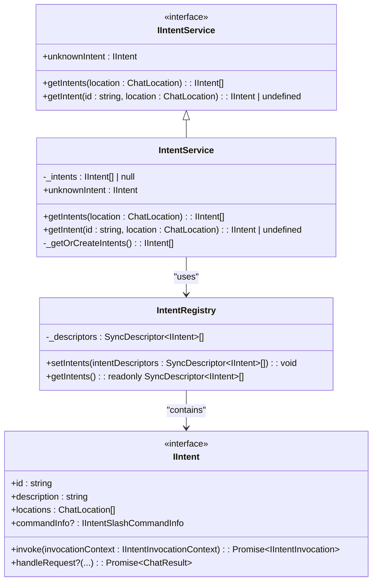
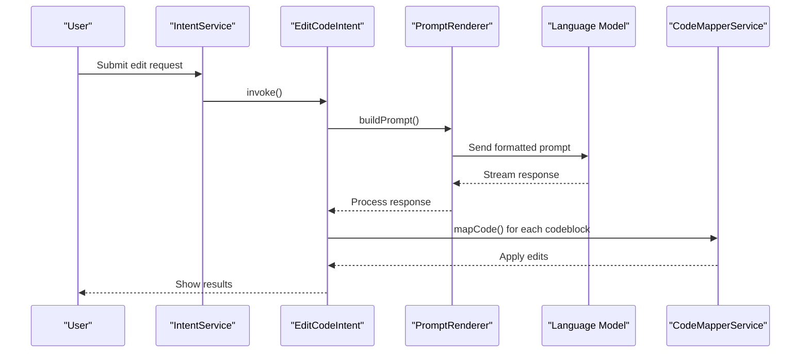
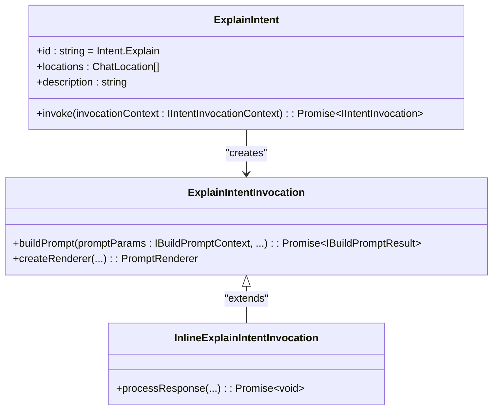
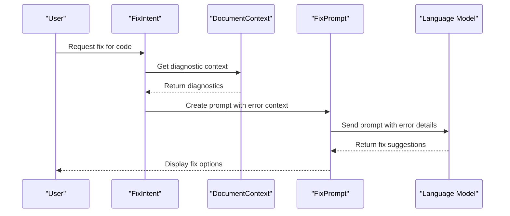
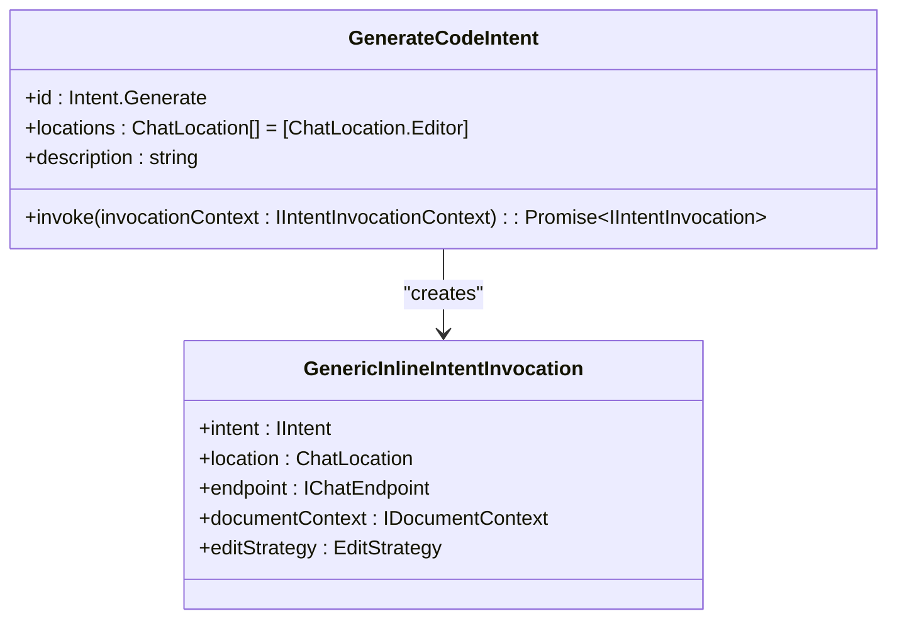
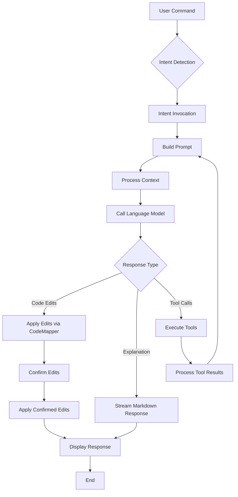
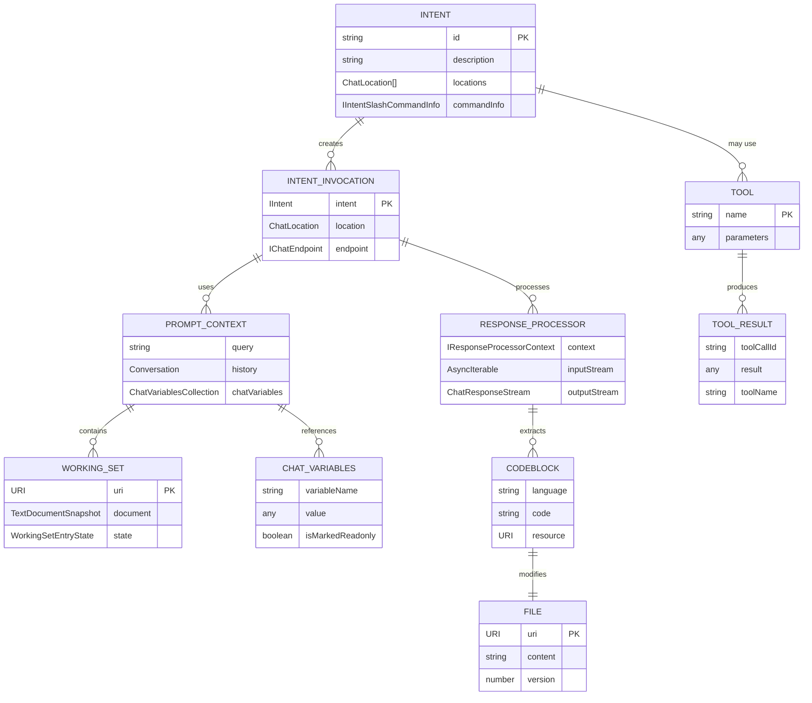
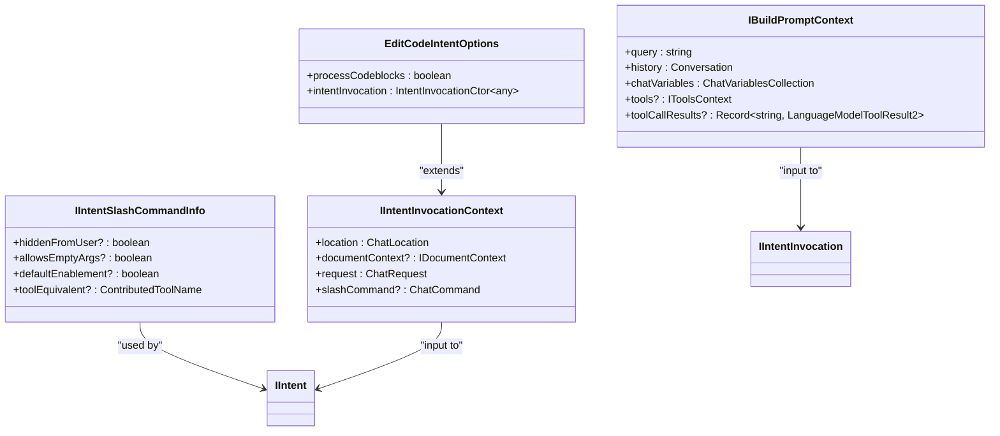
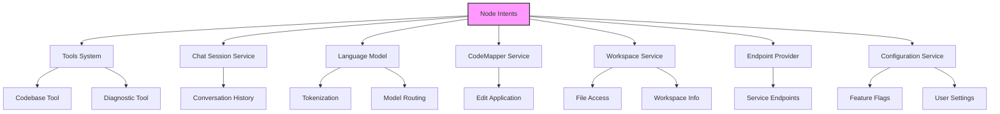
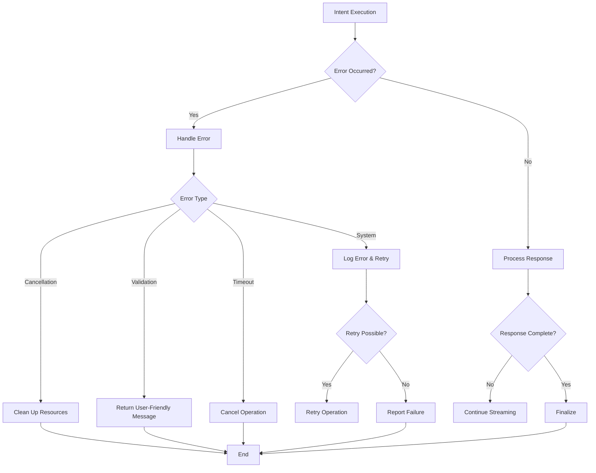

# Node Intents

<cite>
**Referenced Files in This Document**   
- [intentService.ts](file://src/extension/intents/node/intentService.ts)
- [allIntents.ts](file://src/extension/intents/node/allIntents.ts)
- [explainIntent.ts](file://src/extension/intents/node/explainIntent.ts)
- [editCodeIntent.ts](file://src/extension/intents/node/editCodeIntent.ts)
- [fixIntent.ts](file://src/extension/intents/node/fixIntent.ts)
- [generateCodeIntent.ts](file://src/extension/intents/node/generateCodeIntent.ts)
- [intents.ts](file://src/extension/prompt/node/intents.ts)
- [intentRegistry.ts](file://src/extension/prompt/node/intentRegistry.ts)
- [editCodeStep.ts](file://src/extension/intents/node/editCodeStep.ts)
- [explain.tsx](file://src/extension/prompts/node/panel/explain.tsx)
- [intentTest.ts](file://test/intent/intentTest.ts)
</cite>

## Table of Contents
1. [Introduction](#introduction)
2. [Intent Service Architecture](#intent-service-architecture)
3. [Core Intent Implementations](#core-intent-implementations)
4. [Intent Execution Pipeline](#intent-execution-pipeline)
5. [Domain Model for Node-Based Intents](#domain-model-for-node-based-intents)
6. [Configuration Options](#configuration-options)
7. [Component Relationships](#component-relationships)
8. [Error Handling and Execution Timeouts](#error-handling-and-execution-timeouts)
9. [Conclusion](#conclusion)

## Introduction

The Node Intents sub-component of the Intents system provides a robust framework for handling user commands within the Node.js context. This system enables the processing, routing, and execution of various user intents such as edit, explain, generate, and fix operations on code. The architecture is designed to be extensible, allowing for the addition of new intent types while maintaining a consistent execution model.

The system operates by registering intent handlers that respond to specific user commands, processing these commands with appropriate context, and coordinating with other components like the tools system, chat session service, and language model. This documentation provides a comprehensive overview of the implementation details, execution flow, and configuration options for the Node Intents system.

## Intent Service Architecture

The Intent Service architecture is centered around the `IIntentService` interface and its implementation `IntentService`, which serves as the central registry and dispatcher for all intent handlers in the system.

**Diagram sources**
- [intentService.ts](file://src/extension/intents/node/intentService.ts#L14-L57)
- [intentRegistry.ts](file://src/extension/prompt/node/intentRegistry.ts#L19-L30)
- [intents.ts](file://src/extension/prompt/node/intents.ts#L54-L87)

The `IntentService` class implements the `IIntentService` interface and provides methods to retrieve intents based on location and ID. It uses lazy initialization to create intent instances from the `IntentRegistry`, which stores intent constructors as `SyncDescriptor` objects. This design allows for dependency injection and proper instantiation of intent handlers with their required services.

The service architecture follows a registry pattern where all intents are registered at startup through the `allIntents.ts` file, which calls `IntentRegistry.setIntents()` with an array of intent descriptors. This centralized registration makes it easy to add new intent types and ensures that all intents are available through the service interface.

**Section sources**
- [intentService.ts](file://src/extension/intents/node/intentService.ts#L14-L57)
- [intentRegistry.ts](file://src/extension/prompt/node/intentRegistry.ts#L19-L30)
- [allIntents.ts](file://src/extension/intents/node/allIntents.ts#L34-L58)

## Core Intent Implementations

The Node Intents system implements several core intent types that handle common user commands for code manipulation and analysis. Each intent follows a consistent pattern of implementation while providing specialized behavior for its specific use case.

### Edit Intent

The `EditCodeIntent` class handles requests to modify existing code. It supports both panel and editor locations and processes codeblocks in the response to apply edits to the appropriate files.

**Diagram sources**
- [editCodeIntent.ts](file://src/extension/intents/node/editCodeIntent.ts#L83-L193)
- [editCodeStep.ts](file://src/extension/intents/node/editCodeStep.ts#L156-L236)

### Explain Intent

The `ExplainIntent` class handles requests to explain code functionality. It provides different invocation types for panel and inline contexts, with specialized response processing for each scenario.

**Diagram sources**
- [explainIntent.ts](file://src/extension/intents/node/explainIntent.ts#L68-L90)
- [explain.tsx](file://src/extension/prompts/node/panel/explain.tsx#L41-L104)

### Fix Intent

The `FixIntent` class handles requests to fix code issues. It integrates with diagnostic tools and provides context-aware suggestions based on detected problems in the code.

**Diagram sources**
- [fixIntent.ts](file://src/extension/intents/node/fixIntent.ts#L22-L63)
- [editCodeIntent.ts](file://src/extension/intents/node/editCodeIntent.ts#L103-L130)

### Generate Intent

The `GenerateCodeIntent` class handles requests to generate new code. It operates primarily in the editor context and uses specific edit strategies to insert generated code at the appropriate location.

**Diagram sources**
- [generateCodeIntent.ts](file://src/extension/intents/node/generateCodeIntent.ts#L16-L38)
- [editCodeIntent.ts](file://src/extension/intents/node/editCodeIntent.ts#L189-L192)

## Intent Execution Pipeline

The intent execution pipeline follows a standardized flow from command invocation to tool integration, ensuring consistent processing across all intent types.

**Diagram sources**
- [intentService.ts](file://src/extension/intents/node/intentService.ts#L181-L193)
- [editCodeIntent.ts](file://src/extension/intents/node/editCodeIntent.ts#L166-L174)
- [intents.ts](file://src/extension/prompt/node/intents.ts#L189-L193)

The pipeline begins with intent detection, where the system determines which intent handler should process the user's command. Once the appropriate intent is identified, it is invoked with the necessary context, including the request, location, and document context.

The next step is prompt building, where the intent constructs a formatted prompt for the language model. This involves gathering relevant context such as the current document, selection, workspace information, and any referenced files. The prompt is then sent to the language model for processing.

When the response is received, it is processed according to the intent type. For edit intents, the system extracts codeblocks from the response and applies them to the appropriate files using the CodeMapper service. For explanation intents, the response is streamed directly to the user as markdown. If the response includes tool calls, these are executed and their results are incorporated into the conversation.

**Section sources**
- [intentService.ts](file://src/extension/intents/node/intentService.ts#L181-L193)
- [editCodeIntent.ts](file://src/extension/intents/node/editCodeIntent.ts#L340-L425)
- [intents.ts](file://src/extension/prompt/node/intents.ts#L266-L284)

## Domain Model for Node-Based Intents

The domain model for node-based intents defines the core entities and their relationships that enable the system to process user commands effectively.

**Diagram sources**
- [intents.ts](file://src/extension/prompt/node/intents.ts#L54-L209)
- [editCodeStep.ts](file://src/extension/intents/node/editCodeStep.ts#L156-L236)
- [editCodeIntent.ts](file://src/extension/intents/node/editCodeIntent.ts#L300-L334)

The domain model centers around the `IIntent` interface, which defines the contract for all intent handlers. Each intent can create one or more `IIntentInvocation` instances, which represent a specific execution of the intent with its associated context.

The `IBuildPromptContext` provides the data needed to construct a prompt for the language model, including the user query, conversation history, and chat variables. The working set tracks files that are relevant to the current operation, with their state indicating whether they have been accepted, rejected, or are still pending review.

Response processing is handled by implementations of the `IResponseProcessor` interface, which extract codeblocks from the language model's response and apply them to the appropriate files. The system also supports tool integration, allowing intents to leverage additional capabilities beyond the core language model.

**Section sources**
- [intents.ts](file://src/extension/prompt/node/intents.ts#L54-L209)
- [editCodeStep.ts](file://src/extension/intents/node/editCodeStep.ts#L1-L429)
- [editCodeIntent.ts](file://src/extension/intents/node/editCodeIntent.ts#L1-L787)

## Configuration Options

The Node Intents system provides several configuration options that control intent execution behavior, parameters, and return values.

### Intent Configuration Parameters

**Diagram sources**
- [editCodeIntent.ts](file://src/extension/intents/node/editCodeIntent.ts#L75-L77)
- [intents.ts](file://src/extension/prompt/node/intents.ts#L27-L35)
- [intents.ts](file://src/extension/prompt/node/intents.ts#L37-L52)

The system supports configuration at multiple levels:

1. **Intent-level options**: Each intent can define its own configuration options, such as `EditCodeIntentOptions` which controls whether codeblocks should be processed and which invocation constructor to use.

2. **Slash command configuration**: The `IIntentSlashCommandInfo` interface defines how intents are exposed as slash commands, including visibility, argument requirements, and tool equivalents.

3. **Prompt context configuration**: The `IBuildPromptContext` interface provides parameters for prompt construction, including the user query, conversation history, and available tools.

4. **Invocation context**: The `IIntentInvocationContext` contains runtime information about the invocation, including location, document context, and the original request.

These configuration options allow for flexible customization of intent behavior while maintaining a consistent interface across all intent types.

**Section sources**
- [editCodeIntent.ts](file://src/extension/intents/node/editCodeIntent.ts#L75-L77)
- [intents.ts](file://src/extension/prompt/node/intents.ts#L27-L52)

## Component Relationships

The Node Intents system integrates with several other components to provide a comprehensive code assistance experience.

**Diagram sources**
- [editCodeIntent.ts](file://src/extension/intents/node/editCodeIntent.ts#L94-L100)
- [explainIntent.ts](file://src/extension/intents/node/explainIntent.ts#L78-L80)
- [fixIntent.ts](file://src/extension/intents/node/fixIntent.ts#L32-L34)

The Node Intents system has the following key relationships:

1. **Tools System**: Intents can leverage various tools such as the codebase tool for semantic search and diagnostic tools for error analysis. The tools system provides additional capabilities beyond the core language model.

2. **Chat Session Service**: The system maintains conversation history and state across multiple interactions, allowing for context-aware responses and multi-turn workflows.

3. **Language Model**: The core processing is performed by language models, with the intents system responsible for formatting prompts and processing responses.

4. **CodeMapper Service**: This service handles the application of code edits, managing the transformation of suggested changes into actual file modifications.

5. **Workspace Service**: Provides access to workspace files and information, enabling intents to reference and modify code across the project.

6. **Endpoint Provider**: Manages connections to backend services, handling authentication and routing to appropriate endpoints.

7. **Configuration Service**: Provides access to user settings and feature flags that control intent behavior and availability.

These relationships enable the Node Intents system to provide rich, context-aware code assistance that integrates seamlessly with the development environment.

**Section sources**
- [editCodeIntent.ts](file://src/extension/intents/node/editCodeIntent.ts#L94-L100)
- [explainIntent.ts](file://src/extension/intents/node/explainIntent.ts#L78-L80)
- [fixIntent.ts](file://src/extension/intents/node/fixIntent.ts#L32-L34)

## Error Handling and Execution Timeouts

The Node Intents system implements comprehensive error handling and timeout management to ensure reliable operation in the node context.

**Diagram sources**
- [editCodeIntent.ts](file://src/extension/intents/node/editCodeIntent.ts#L511-L630)
- [intents.ts](file://src/extension/prompt/node/intents.ts#L113-L122)
- [editCodeIntent.ts](file://src/extension/intents/node/editCodeIntent.ts#L166-L174)

The system handles errors through several mechanisms:

1. **IntentError class**: A specialized error type that can be thrown from intent invocations to signal user-facing errors with detailed error information.

2. **Cancellation handling**: All async operations support cancellation tokens, allowing operations to be cancelled gracefully when the user stops the request or switches contexts.

3. **Timeout management**: Long-running operations are monitored for responsiveness, with timeouts triggering cancellation to prevent hanging operations.

4. **Retry logic**: For transient errors, the system may automatically retry operations with appropriate backoff.

5. **Resource cleanup**: When errors occur, the system ensures that resources are properly cleaned up to prevent memory leaks.

6. **User feedback**: Errors are translated into user-friendly messages that explain what went wrong and suggest possible solutions.

The system also implements defensive programming practices, such as validating inputs and handling edge cases, to minimize the occurrence of errors. When errors do occur, they are logged with appropriate telemetry to help diagnose and fix issues.

**Section sources**
- [editCodeIntent.ts](file://src/extension/intents/node/editCodeIntent.ts#L511-L630)
- [intents.ts](file://src/extension/prompt/node/intents.ts#L113-L122)

## Conclusion

The Node Intents system provides a robust and extensible framework for handling user commands in the Node.js context. By implementing a consistent architecture across intent types, the system ensures reliable processing of various code manipulation requests while maintaining flexibility for future enhancements.

Key strengths of the system include its modular design, comprehensive error handling, and seamless integration with other components like the tools system and language model. The domain model clearly defines the relationships between intents, context, and execution, making it easier to understand and extend the system.

For developers looking to extend the system, the architecture supports adding new intent types by implementing the `IIntent` interface and registering them with the `IntentRegistry`. Performance can be optimized by minimizing unnecessary context gathering and leveraging caching where appropriate.

The system effectively balances ease of use for beginners with sufficient technical depth for experienced developers, making it a powerful tool for code assistance and productivity enhancement.