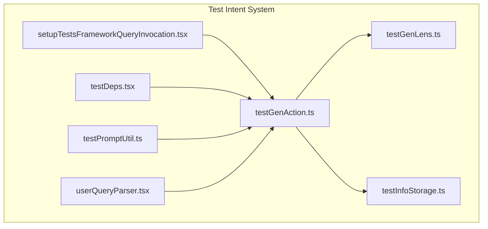
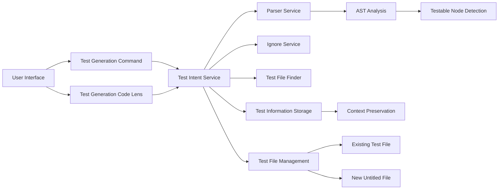
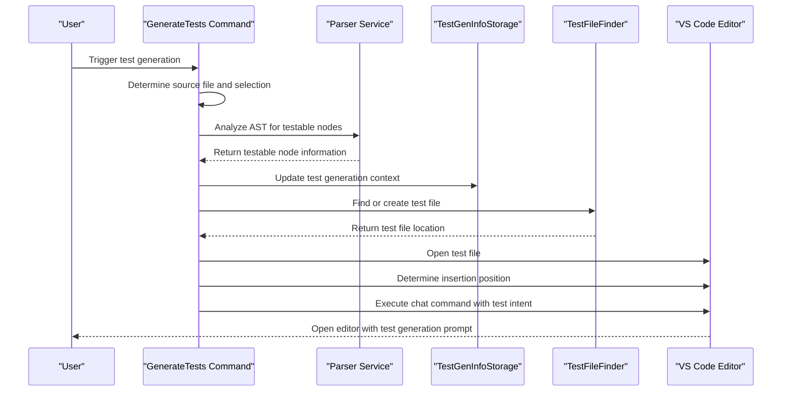
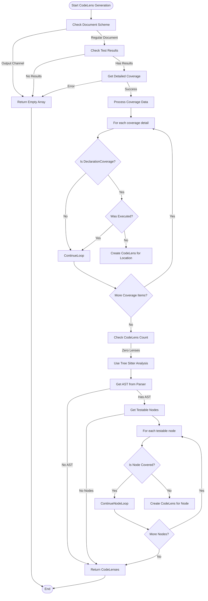
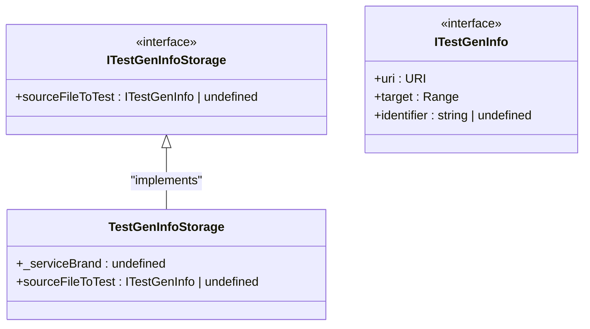
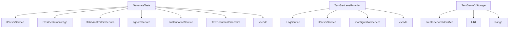

# Test Intent

<cite>
**Referenced Files in This Document**   
- [testGenAction.ts](file://src/extension/intents/vscode-node/testGenAction.ts)
- [testGenLens.ts](file://src/extension/intents/vscode-node/testGenLens.ts)
- [testInfoStorage.ts](file://src/extension/intents/node/testIntent/testInfoStorage.ts)
- [setupTestsFrameworkQueryInvocation.tsx](file://src/extension/intents/node/testIntent/setupTestsFrameworkQueryInvocation.tsx)
- [testDeps.tsx](file://src/extension/intents/node/testIntent/testDeps.tsx)
- [testPromptUtil.ts](file://src/extension/intents/node/testIntent/testPromptUtil.ts)
- [userQueryParser.tsx](file://src/extension/intents/node/testIntent/userQueryParser.tsx)
- [contributions.ts](file://src/extension/extension/vscode-node/contributions.ts)
</cite>

## Table of Contents
1. [Introduction](#introduction)
2. [Project Structure](#project-structure)
3. [Core Components](#core-components)
4. [Architecture Overview](#architecture-overview)
5. [Detailed Component Analysis](#detailed-component-analysis)
6. [Dependency Analysis](#dependency-analysis)
7. [Performance Considerations](#performance-considerations)
8. [Troubleshooting Guide](#troubleshooting-guide)
9. [Conclusion](#conclusion)

## Introduction
The Test Intent system in the Node.js context provides intelligent test generation capabilities that help developers create comprehensive test suites for their code. This system integrates with various testing frameworks and code analysis tools to automatically detect testable code elements, suggest appropriate test locations, and generate well-structured test code with proper coverage. The implementation supports multiple test types including unit, integration, and end-to-end tests across various programming languages and frameworks.

## Project Structure
The Test Intent system is organized within the extension's intents module, with specific components separated by environment (Node.js vs. VS Code). The core functionality resides in the `src/extension/intents/node/testIntent` directory, while VS Code-specific integration points are located in `src/extension/intents/vscode-node`.

**Diagram sources**
- [testGenAction.ts](file://src/extension/intents/vscode-node/testGenAction.ts)
- [testGenLens.ts](file://src/extension/intents/vscode-node/testGenLens.ts)
- [testInfoStorage.ts](file://src/extension/intents/node/testIntent/testInfoStorage.ts)

**Section sources**
- [testGenAction.ts](file://src/extension/intents/vscode-node/testGenAction.ts)
- [testGenLens.ts](file://src/extension/intents/vscode-node/testGenLens.ts)

## Core Components
The Test Intent system consists of several key components that work together to provide test generation capabilities. The system includes action handlers for test generation commands, code lens providers for UI integration, and storage mechanisms for maintaining test generation context across different components.

**Section sources**
- [testGenAction.ts](file://src/extension/intents/vscode-node/testGenAction.ts)
- [testGenLens.ts](file://src/extension/intents/vscode-node/testGenLens.ts)
- [testInfoStorage.ts](file://src/extension/intents/node/testIntent/testInfoStorage.ts)

## Architecture Overview
The Test Intent system follows a modular architecture that separates concerns between command execution, UI integration, and state management. The system integrates with the VS Code editor through code lenses and commands, while leveraging code analysis tools to identify testable elements and determine optimal test placement.

**Diagram sources**
- [testGenAction.ts](file://src/extension/intents/vscode-node/testGenAction.ts)
- [testGenLens.ts](file://src/extension/intents/vscode-node/testGenLens.ts)
- [testInfoStorage.ts](file://src/extension/intents/node/testIntent/testInfoStorage.ts)

## Detailed Component Analysis

### Test Generation Action Analysis
The GenerateTests class serves as the primary entry point for test generation functionality, handling both direct command execution and context-aware test generation based on user selection.

#### For API/Service Components:

**Diagram sources**
- [testGenAction.ts](file://src/extension/intents/vscode-node/testGenAction.ts)
- [testInfoStorage.ts](file://src/extension/intents/node/testIntent/testInfoStorage.ts)

### Test Generation Lens Analysis
The TestGenLensProvider implements VS Code's CodeLensProvider interface to display "Generate tests using Copilot" suggestions directly in the editor for untested code elements.

#### For Complex Logic Components:

**Diagram sources**
- [testGenLens.ts](file://src/extension/intents/vscode-node/testGenLens.ts)
- [testInfoStorage.ts](file://src/extension/intents/node/testIntent/testInfoStorage.ts)

### Test Information Storage Analysis
The TestGenInfoStorage component provides a centralized storage mechanism for test generation context, enabling data flow between different parts of the system.

#### For Object-Oriented Components:

**Diagram sources**
- [testInfoStorage.ts](file://src/extension/intents/node/testIntent/testInfoStorage.ts)

## Dependency Analysis
The Test Intent system has well-defined dependencies on various services and components within the extension ecosystem. These dependencies enable the system to integrate seamlessly with the editor, code analysis tools, and configuration system.

**Diagram sources**
- [testGenAction.ts](file://src/extension/intents/vscode-node/testGenAction.ts)
- [testGenLens.ts](file://src/extension/intents/vscode-node/testGenLens.ts)
- [testInfoStorage.ts](file://src/extension/intents/node/testIntent/testInfoStorage.ts)

**Section sources**
- [testGenAction.ts](file://src/extension/intents/vscode-node/testGenAction.ts)
- [testGenLens.ts](file://src/extension/intents/vscode-node/testGenLens.ts)
- [testInfoStorage.ts](file://src/extension/intents/node/testIntent/testInfoStorage.ts)

## Performance Considerations
The Test Intent system is designed with performance in mind, minimizing unnecessary computations and leveraging caching where appropriate. The code lens provider only activates when test results are available, and the AST analysis is performed on-demand rather than continuously. The system also respects user configuration settings, allowing users to disable code lenses if they impact editor performance.

## Troubleshooting Guide
When encountering issues with the Test Intent system, consider the following common problems and solutions:

**Section sources**
- [testGenAction.ts](file://src/extension/intents/vscode-node/testGenAction.ts)
- [testGenLens.ts](file://src/extension/intents/vscode-node/testGenLens.ts)
- [testInfoStorage.ts](file://src/extension/intents/node/testIntent/testInfoStorage.ts)

## Conclusion
The Test Intent system provides a comprehensive solution for automated test generation in the Node.js context. By integrating with the VS Code editor through code lenses and commands, analyzing code structure through AST parsing, and maintaining context through shared storage, the system offers a seamless experience for developers looking to improve their test coverage. The modular architecture allows for easy extension and customization, while the performance-conscious design ensures minimal impact on the development workflow.