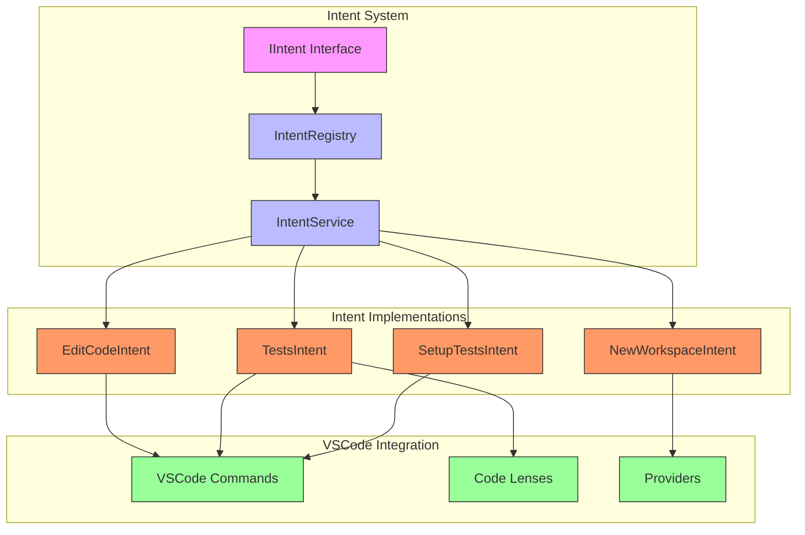
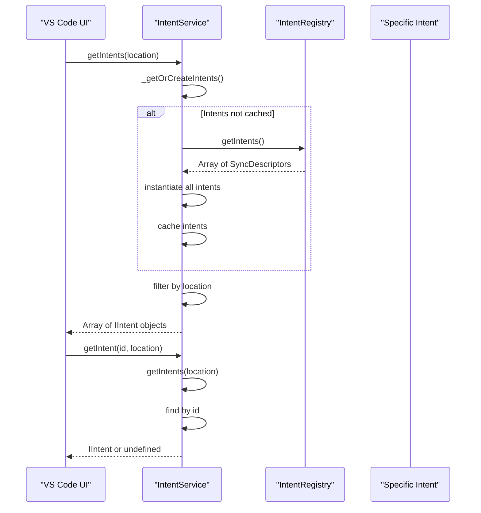
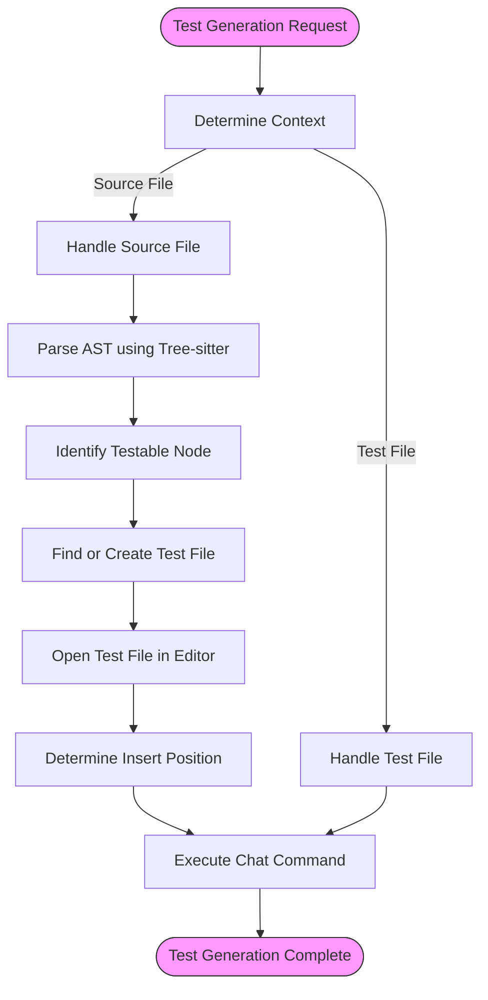
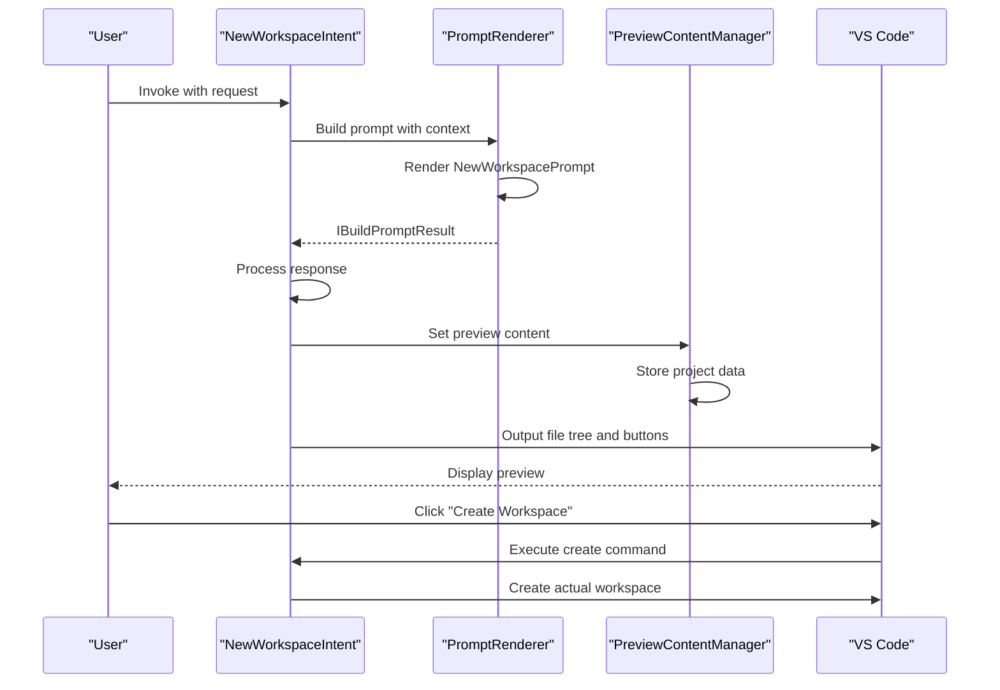

# VSCode Node Intents

<cite>
**Referenced Files in This Document**   
- [intents.ts](file://src/extension/intents/common/intents.ts)
- [allIntents.ts](file://src/extension/intents/node/allIntents.ts)
- [intentService.ts](file://src/extension/intents/node/intentService.ts)
- [testGenAction.ts](file://src/extension/intents/vscode-node/testGenAction.ts)
- [testGenLens.ts](file://src/extension/intents/vscode-node/testGenLens.ts)
- [testIntent.tsx](file://src/extension/intents/node/testIntent/testIntent.tsx)
- [editCodeIntent.ts](file://src/extension/intents/node/editCodeIntent.ts)
- [setupTests.ts](file://src/extension/intents/node/setupTests.ts)
- [newIntent.ts](file://src/extension/intents/node/newIntent.ts)
</cite>

## Table of Contents
1. [Introduction](#introduction)
2. [Intent Architecture Overview](#intent-architecture-overview)
3. [Intent Registration and Service](#intent-registration-and-service)
4. [Editor-Integrated Intent Implementation](#editor-integrated-intent-implementation)
5. [Test Generation Intent](#test-generation-intent)
6. [Workspace Setup Intent](#workspace-setup-intent)
7. [New Workspace Intent](#new-workspace-intent)
8. [Configuration and Parameters](#configuration-and-parameters)
9. [Relationships with Editor Services](#relationships-with-editor-services)
10. [UI Responsiveness and State Management](#ui-responsiveness-and-state-management)
11. [Conclusion](#conclusion)

## Introduction

The VSCode Node Intents sub-component is a core part of the Intents system that enables deep integration between Copilot's AI capabilities and VS Code's editor and workspace services. This system allows users to perform complex coding tasks through natural language commands, with the results seamlessly integrated into the editor environment. The intents system bridges the gap between user requests and editor actions, providing a powerful interface for code generation, modification, and workspace management.

The implementation follows a modular architecture where each intent represents a specific user action or command that can be executed within the VS Code environment. These intents are exposed to the UI through various mechanisms including commands, code lenses, and providers, creating a cohesive experience that feels native to the editor. The system is designed to work in both panel and editor contexts, adapting its behavior based on the current location and available editor state.

This documentation provides a comprehensive overview of the VSCode Node Intents implementation, focusing on how intents integrate with editor services, their contribution architecture, and practical examples of their usage in real-world scenarios.

## Intent Architecture Overview

The VSCode Node Intents system follows a well-defined architecture that separates concerns between intent definition, registration, and execution. At its core, the system is built around the concept of intent handlers that respond to user commands and coordinate with various VS Code services to produce the desired outcome.

The architecture consists of several key components:
- **Intent interfaces** that define the contract for all intents
- **Intent implementations** that provide specific functionality for different commands
- **Intent registry** that manages all available intents
- **Intent service** that provides access to intents based on context
- **VSCode-specific contributions** that expose intents through UI elements

The system is designed to be extensible, allowing new intents to be added without modifying the core infrastructure. Each intent is self-contained and responsible for handling its specific domain, while adhering to the common interfaces defined in the system. This modular approach enables maintainability and makes it easier to understand and modify individual components.

**Diagram sources**
- [intents.ts](file://src/extension/intents/common/intents.ts)
- [allIntents.ts](file://src/extension/intents/node/allIntents.ts)
- [intentService.ts](file://src/extension/intents/node/intentService.ts)

**Section sources**
- [intents.ts](file://src/extension/intents/common/intents.ts)
- [allIntents.ts](file://src/extension/intents/node/allIntents.ts)

## Intent Registration and Service

The intent registration and service system provides the foundation for discovering and executing intents within the VS Code environment. The IntentRegistry serves as a central repository for all available intents, while the IntentService provides a clean interface for accessing these intents based on the current context.

Intent registration occurs in the allIntents.ts file, where all intents are registered using SyncDescriptor objects. This approach allows for lazy instantiation of intents, improving startup performance by only creating intent instances when they are actually needed. The registration process uses dependency injection to ensure that each intent receives the services it requires, such as the instantiation service, endpoint provider, and workspace service.

The IntentService implements the IIntentService interface and provides methods for retrieving intents based on location and ID. It maintains a cache of instantiated intents to avoid repeated creation, and it filters intents based on their supported locations (panel, editor, etc.). This location-based filtering ensures that only relevant intents are available in each context, providing a focused user experience.

**Diagram sources**
- [allIntents.ts](file://src/extension/intents/node/allIntents.ts)
- [intentService.ts](file://src/extension/intents/node/intentService.ts)

**Section sources**
- [allIntents.ts](file://src/extension/intents/node/allIntents.ts)
- [intentService.ts](file://src/extension/intents/node/intentService.ts)

## Editor-Integrated Intent Implementation

Editor-integrated intents are implemented as specialized classes that extend the base IIntent interface and provide specific functionality for different user commands. These implementations follow a consistent pattern where each intent handles both the invocation and execution phases of the command lifecycle.

The implementation pattern includes several key aspects:
- **Location specification**: Each intent declares which locations it supports (panel, editor, etc.)
- **Description and metadata**: Human-readable descriptions and configuration options
- **Invocation logic**: Methods for creating intent invocations based on context
- **Request handling**: Processing of chat requests and generation of responses

The system uses dependency injection to provide each intent with the services it needs, such as the endpoint provider for accessing AI models, the workspace service for file operations, and the log service for diagnostics. This approach promotes loose coupling and makes the intents easier to test and maintain.

A key aspect of the implementation is the separation between the intent definition and its execution context. The intent itself is responsible for determining what action should be taken, while the invocation handles the specifics of how that action is executed in the current editor context. This separation allows the same intent to behave differently depending on whether it's being used in the panel or inline in the editor.

**Section sources**
- [editCodeIntent.ts](file://src/extension/intents/node/editCodeIntent.ts)
- [testIntent.tsx](file://src/extension/intents/node/testIntent/testIntent.tsx)

## Test Generation Intent

The test generation intent provides a comprehensive solution for creating unit tests for code in the workspace. This intent is implemented as the TestsIntent class and supports both generating tests for source files and enhancing existing test files. The implementation integrates with VS Code's editor services to provide a seamless experience for test creation.

The intent supports multiple invocation methods:
- **Command execution**: Using the "Generate tests using Copilot" command
- **Code lenses**: Automatic detection of untested code with clickable lenses
- **Chat interface**: Direct invocation through the chat panel

When invoked, the test generation intent analyzes the current editor context to determine the appropriate action. For source files, it identifies testable code elements and creates a new test file or opens an existing one. For test files, it provides suggestions for additional test cases. The intent uses tree-sitter based AST analysis to accurately identify testable nodes in the code.

The implementation includes sophisticated logic for determining where to insert new tests in existing files, ensuring that the generated code follows the structure and conventions of the existing test suite. It also handles edge cases such as ignored files and readonly documents, providing appropriate feedback to the user.

**Diagram sources**
- [testIntent.tsx](file://src/extension/intents/node/testIntent/testIntent.tsx)
- [testGenAction.ts](file://src/extension/intents/vscode-node/testGenAction.ts)

**Section sources**
- [testIntent.tsx](file://src/extension/intents/node/testIntent/testIntent.tsx)
- [testGenAction.ts](file://src/extension/intents/vscode-node/testGenAction.ts)

## Workspace Setup Intent

The workspace setup intent enables users to configure testing frameworks and related tools for their projects. Implemented as the SetupTestsIntent class, this intent provides a guided experience for setting up test infrastructure in a workspace. The intent is specifically designed for the panel location, where it can provide a rich interactive experience.

The setup process follows a two-step pattern:
1. **Framework detection**: If no specific framework is requested, the intent queries the user to select a testing framework
2. **Configuration generation**: Once a framework is selected, the intent generates the necessary configuration files and setup code

The intent integrates with the setup tests detector to identify when test setup might be beneficial and can proactively suggest it to the user. This proactive suggestion capability enhances the user experience by reducing the need for explicit commands while still respecting user preferences.

The implementation handles various testing frameworks and can adapt its behavior based on the project's language and existing dependencies. It also manages the state of the setup process, ensuring that partially completed setups can be resumed and that users are not prompted repeatedly for the same configuration.

**Section sources**
- [setupTests.ts](file://src/extension/intents/node/setupTests.ts)

## New Workspace Intent

The new workspace intent allows users to scaffold new projects and files within their workspace. Implemented as the NewWorkspaceIntent class, this intent provides a powerful way to create new code structures based on natural language descriptions. The intent supports both creating entire projects and individual files, adapting its behavior based on the user's request.

The implementation uses a multi-step process:
- **Prompt processing**: Analyzing the user's request to understand the desired project structure
- **File tree generation**: Creating a hierarchical representation of the files and directories
- **Content generation**: Generating the actual code content for each file
- **Preview and creation**: Providing a preview of the generated workspace and allowing the user to create it

The intent integrates with various content managers to handle different types of workspace creation:
- **Copilot content manager**: For workspaces generated entirely by Copilot
- **GitHub content manager**: For workspaces based on GitHub repositories
- **File content manager**: For individual files

The system uses custom URI schemes to represent preview workspaces, allowing users to explore the generated structure before committing to creation. This preview capability enhances the user experience by providing immediate feedback and reducing the risk of unwanted changes.

**Diagram sources**
- [newIntent.ts](file://src/extension/intents/node/newIntent.ts)

**Section sources**
- [newIntent.ts](file://src/extension/intents/node/newIntent.ts)

## Configuration and Parameters

The VSCode Node Intents system provides several configuration options that control the behavior of intents and their integration with the editor. These configurations are defined using the ConfigKey enum and can be accessed through the configuration service.

Key configuration options include:
- **GenerateTestsCodeLens**: Controls whether code lenses for test generation are displayed
- **CodeSearchAgentEnabled**: Enables or disables code search capabilities in edit intents
- **UseProjectTemplates**: Determines whether project templates are used for new workspace creation
- **Internal.CodeSearchAgentEnabled**: Internal flag for code search agent functionality

Each intent may have specific configuration requirements and can define default enablement states. For example, the SetupTestsIntent is only enabled in pre-release versions by default, reflecting its experimental nature. The configuration system allows users to customize the behavior of intents to match their workflow preferences.

The parameters for intent execution are passed through the request object, which contains the user's prompt, references to relevant files, and any additional context. The intent implementation is responsible for parsing these parameters and using them to guide the response generation process. Return values from intents typically include chat results, error details, and metadata about the execution.

**Section sources**
- [testGenLens.ts](file://src/extension/intents/vscode-node/testGenLens.ts)
- [editCodeIntent.ts](file://src/extension/intents/node/editCodeIntent.ts)
- [newIntent.ts](file://src/extension/intents/node/newIntent.ts)

## Relationships with Editor Services

The VSCode Node Intents system maintains close relationships with various editor services to provide a seamless integration experience. These relationships enable intents to access and modify editor state, respond to user actions, and provide context-aware responses.

Key service relationships include:
- **Editor service**: Provides access to active text editors, selections, and document state
- **Workspace service**: Enables file operations, workspace folder management, and text document access
- **Language model service**: Facilitates communication with AI models for response generation
- **Parser service**: Supports AST-based code analysis for accurate context understanding

The intents use dependency injection to receive instances of these services, promoting loose coupling and making the system more maintainable. For example, the test generation intent uses the parser service to analyze code structure and identify testable nodes, while the edit intent uses the workspace service to open and modify files.

These service relationships enable sophisticated behaviors such as:
- Context-aware code suggestions based on the current editor state
- Automatic file creation and opening in appropriate editor groups
- Preservation of user preferences for editor layout and organization
- Integration with VS Code's built-in features like code lenses and references

The system is designed to respect the boundaries of these services, using their public APIs and following VS Code's extension guidelines to ensure stability and compatibility.

**Section sources**
- [testGenAction.ts](file://src/extension/intents/vscode-node/testGenAction.ts)
- [editCodeIntent.ts](file://src/extension/intents/node/editCodeIntent.ts)
- [newIntent.ts](file://src/extension/intents/node/newIntent.ts)

## UI Responsiveness and State Management

The VSCode Node Intents system employs several strategies to ensure UI responsiveness and proper state management during intent execution. Given the potentially long-running nature of AI-powered operations, the system is designed to provide immediate feedback while operations are in progress.

Key aspects of UI responsiveness include:
- **Progress indicators**: Displaying progress messages during long-running operations
- **Streaming responses**: Processing and displaying responses incrementally as they arrive
- **Cancellation support**: Allowing users to cancel ongoing operations
- **Error handling**: Providing clear feedback when operations fail

State management is handled through a combination of local state within intent invocations and shared state through services. Each intent invocation maintains its own state, including the current progress, intermediate results, and any user interactions. This state is preserved throughout the lifecycle of the invocation, allowing for consistent behavior even if the operation is paused or resumed.

The system also manages state across multiple turns in a conversation, preserving context and allowing for iterative refinement of results. For example, in an edit session, the system maintains a working set of files and changes, allowing users to make multiple modifications before applying them all at once.

Special attention is paid to editor state management, ensuring that operations like file opening and selection changes are handled in a way that respects user preferences and maintains a coherent editing experience. The system uses VS Code's tab and editor APIs to determine the appropriate location for opening new files, typically placing them adjacent to the current editor group.

**Section sources**
- [testGenAction.ts](file://src/extension/intents/vscode-node/testGenAction.ts)
- [editCodeIntent.ts](file://src/extension/intents/node/editCodeIntent.ts)
- [newIntent.ts](file://src/extension/intents/node/newIntent.ts)

## Conclusion

The VSCode Node Intents sub-component provides a robust framework for integrating AI-powered capabilities with the VS Code editor. Through a well-designed architecture of intent handlers, service integrations, and UI contributions, the system enables users to perform complex coding tasks using natural language commands.

The implementation demonstrates several best practices in extension development:
- **Modular design**: Clear separation of concerns between intent definition, registration, and execution
- **Service integration**: Effective use of VS Code's services for editor and workspace operations
- **User experience**: Attention to responsiveness, state management, and context awareness
- **Extensibility**: A framework that allows for easy addition of new intents and capabilities

The system successfully bridges the gap between AI capabilities and editor functionality, providing a seamless experience that feels native to VS Code. By leveraging the editor's existing features like commands, code lenses, and providers, the intents become an integral part of the development workflow rather than a separate tool.

For developers looking to extend the system, the architecture provides clear entry points for new intents and integration points with editor services. The use of dependency injection and well-defined interfaces makes it easier to understand and modify the system while maintaining stability and compatibility.