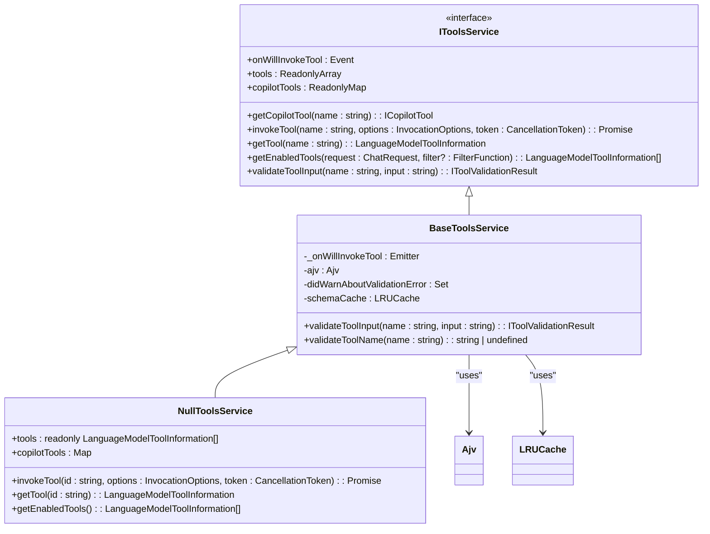
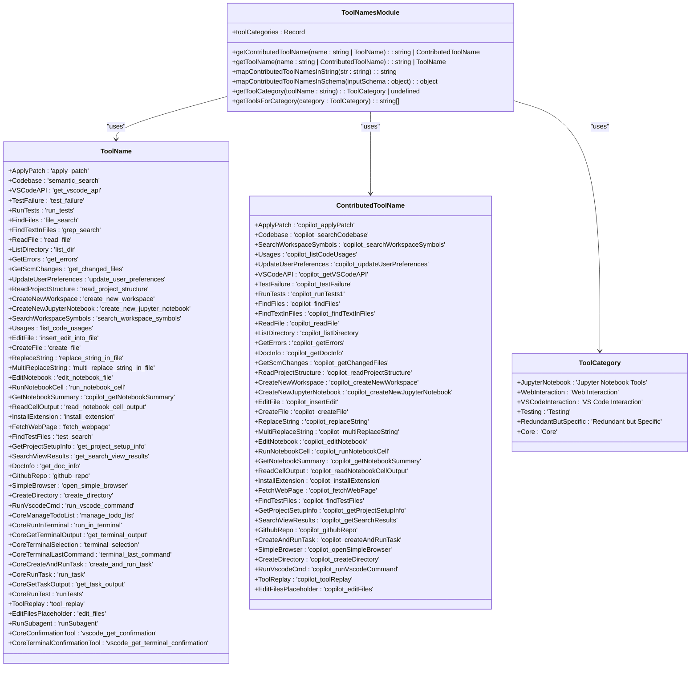
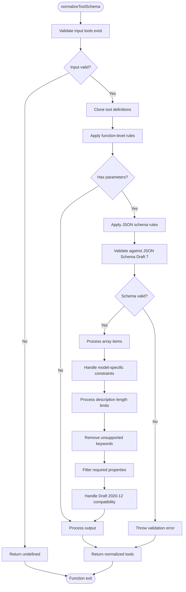
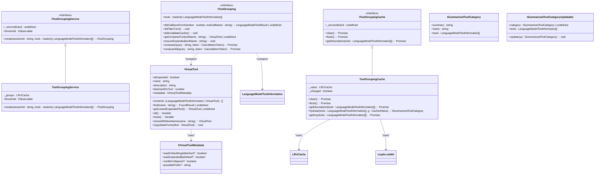
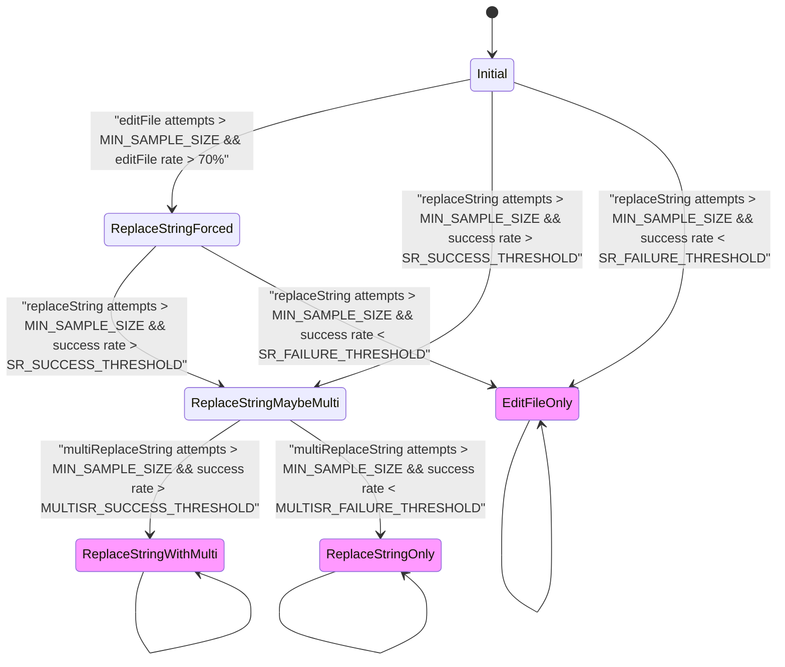
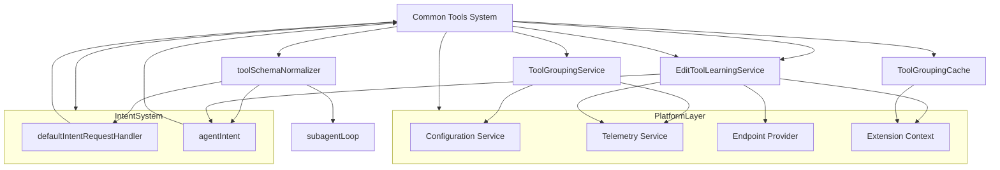

# Common Tools

<cite>
**Referenced Files in This Document**   
- [toolNames.ts](file://src/extension/tools/common/toolNames.ts)
- [toolsRegistry.ts](file://src/extension/tools/common/toolsRegistry.ts)
- [toolSchemaNormalizer.ts](file://src/extension/tools/common/toolSchemaNormalizer.ts)
- [editToolLearningService.ts](file://src/extension/tools/common/editToolLearningService.ts)
- [editToolLearningStates.ts](file://src/extension/tools/common/editToolLearningStates.ts)
- [virtualTool.ts](file://src/extension/tools/common/virtualTools/virtualTool.ts)
- [toolGroupingService.ts](file://src/extension/tools/common/virtualTools/toolGroupingService.ts)
- [virtualToolGroupCache.ts](file://src/extension/tools/common/virtualTools/virtualToolGroupCache.ts)
- [virtualToolTypes.ts](file://src/extension/tools/common/virtualTools/virtualToolTypes.ts)
- [toolsService.ts](file://src/extension/tools/common/toolsService.ts)
</cite>

## Table of Contents
1. [Introduction](#introduction)
2. [Tools Registry and Service Layer](#tools-registry-and-service-layer)
3. [Domain Model for Tool Registration and Discovery](#domain-model-for-tool-registration-and-discovery)
4. [Tool Schema Normalization](#tool-schema-normalization)
5. [Virtual Tools System](#virtual-tools-system)
6. [Edit Tool Learning Service](#edit-tool-learning-service)
7. [Integration with Other Components](#integration-with-other-components)
8. [Conclusion](#conclusion)

## Introduction

The Common Tools sub-component of the Tools system provides a shared infrastructure for tool management, discovery, and execution within the Copilot ecosystem. This document details the implementation of key components including the tools registry, service layer, virtual tools framework, and personalization services. The system enables consistent tool behavior across different execution contexts while providing advanced features like tool grouping, pre-computed embeddings, and user interaction tracking for personalization.

The architecture is designed to support extensibility while maintaining performance and usability, particularly when dealing with large numbers of available tools. The virtual tools system addresses the challenge of tool overload by grouping related tools and providing intelligent activation based on context and user behavior.

**Section sources**
- [toolNames.ts](file://src/extension/tools/common/toolNames.ts#L1-L250)
- [toolsRegistry.ts](file://src/extension/tools/common/toolsRegistry.ts#L1-L76)

## Tools Registry and Service Layer

The tools registry and service layer form the foundation of the Common Tools system, providing the infrastructure for tool registration, discovery, and invocation. The `ToolRegistry` class serves as a central repository for all tool constructors, allowing for dynamic registration and retrieval of tools through the `registerTool` and `getTools` methods.

The service layer, implemented through the `IToolsService` interface and `BaseToolsService` abstract class, provides a comprehensive API for tool management. This includes methods for tool validation, invocation, and enabling/disabling based on context. The service handles input validation using AJV for JSON schema validation, with a LRU cache to optimize schema compilation performance.

Key components of the service layer include:
- Tool validation with automatic parsing of nested JSON strings
- Event emission for tool invocation monitoring
- Input schema validation with error recovery mechanisms
- Tool enabling logic that can be customized through filter functions

The implementation separates concerns between tool information (metadata) and tool implementation (behavior), allowing for flexible tool management while maintaining type safety through TypeScript interfaces.

**Diagram sources **
- [toolsService.ts](file://src/extension/tools/common/toolsService.ts#L46-L253)

**Section sources**
- [toolsService.ts](file://src/extension/tools/common/toolsService.ts#L1-L253)
- [toolsRegistry.ts](file://src/extension/tools/common/toolsRegistry.ts#L1-L76)

## Domain Model for Tool Registration and Discovery

The domain model for tool registration and discovery is centered around the `ToolName` enum and related categorization system defined in `toolNames.ts`. This file establishes a comprehensive taxonomy for all available tools, with each tool having both a model-facing name (used by the LLM) and a contributed tool name (used in the extension).

The model includes several key components:

1. **Tool Categories**: Tools are organized into categories such as Jupyter Notebook Tools, Web Interaction, VS Code Interaction, Testing, and Core tools. This categorization enables intelligent grouping and presentation of tools based on their functionality.

2. **Tool Name Mapping**: The system maintains bidirectional mappings between `ToolName` and `ContributedToolName` enums, allowing for seamless translation between internal and external tool representations.

3. **Category Assignment**: Each tool is explicitly assigned to a category through the `toolCategories` constant, which provides compile-time safety and ensures that all tools are properly categorized.

4. **Utility Functions**: The module provides functions for retrieving tools by category, mapping tool names in strings and schemas, and determining the appropriate category for a given tool.

This domain model enables the system to organize tools logically, making it easier for both users and the AI system to discover and use appropriate tools for specific tasks. The categorization also supports the virtual tools system by providing the foundation for tool grouping.

**Diagram sources **
- [toolNames.ts](file://src/extension/tools/common/toolNames.ts#L1-L250)

**Section sources**
- [toolNames.ts](file://src/extension/tools/common/toolNames.ts#L1-L250)

## Tool Schema Normalization

The `toolSchemaNormalizer.ts` module provides critical functionality for ensuring tool schemas are compatible with various language models and their constraints. This normalization process is essential for maintaining reliability when working with different model families that have varying schema requirements and limitations.

The normalization system operates through two main sets of rules:
1. **Function-level rules**: These address issues with the overall tool definition, such as ensuring parameters are properly structured as objects and providing default descriptions when missing.
2. **JSON schema rules**: These handle schema-specific issues, including validation against JSON Schema Draft 7, handling array items, and addressing model-specific limitations.

Key normalization features include:
- **Model-specific adaptations**: The system applies different rules based on the model family (e.g., GPT-4, Claude), truncating descriptions that exceed length limits and removing unsupported schema keywords.
- **Validation and error handling**: The module uses AJV for schema validation and provides detailed error messages when validation fails, helping identify problematic tools.
- **Recursive processing**: The `forEachSchemaNode` function enables deep traversal of schema structures, allowing normalization rules to be applied at all levels of nested schemas.
- **Draft 2020-12 compatibility**: Special handling for array schemas with multiple item types, converting them to `anyOf` structures that are compatible with newer JSON Schema drafts.

The normalization process is invoked through the `normalizeToolSchema` function, which clones the input tools and applies all relevant rules, providing a clean, compatible schema set for use with language models.

**Diagram sources **
- [toolSchemaNormalizer.ts](file://src/extension/tools/common/toolSchemaNormalizer.ts#L1-L241)

**Section sources**
- [toolSchemaNormalizer.ts](file://src/extension/tools/common/toolSchemaNormalizer.ts#L1-L241)

## Virtual Tools System

The virtual tools system provides an advanced mechanism for managing tool complexity through grouping, pre-computed embeddings, and intelligent activation. This system addresses the challenge of tool overload by organizing related tools into logical groups and providing context-aware access to them.

### Core Architecture

The virtual tools system is built around several key components:

1. **VirtualTool Class**: Represents a virtual tool that can contain other tools or virtual tools, forming a hierarchical structure. Virtual tools have names prefixed with "activate_" and maintain state about their expansion status and usage recency.

2. **Tool Grouping Service**: Manages the creation and lifecycle of tool groupings, using an LRU cache to store groupings by session ID for performance optimization.

3. **Virtual Tool Group Cache**: Persists summarized tool category information in global state, using SHA-256 hashing of tool names and descriptions to create cache keys.

4. **Tool Categorization Interface**: Defines the contract for adding groups and recomputing embedding rankings based on query context.

### Key Features

**Tool Grouping**: Tools are grouped by category (e.g., Jupyter Notebook Tools, Web Interaction) as defined in the `toolCategories` mapping. This allows related tools to be presented as a single unit, reducing cognitive load.

**Pre-computed Embeddings**: The system supports an "embeddings" group that can be pre-activated based on context, bringing relevant tools to the forefront when they are likely to be needed.

**State Management**: Virtual tools track their expansion state and last usage time, enabling intelligent collapsing of infrequently used groups to maintain a clean interface.

**Caching Mechanism**: The virtual tool group cache stores summarized tool category information, including names and summaries, to avoid recomputing these values. The cache uses base64-encoded SHA-256 hashes of tool data as keys and is persisted in global state.

**Configuration**: The system includes a configurable threshold (via `github.copilot.chat.virtualTools.threshold`) that determines when virtual tools should be used, allowing for dynamic adjustment based on the number of available tools.

**Diagram sources **
- [virtualTool.ts](file://src/extension/tools/common/virtualTools/virtualTool.ts#L1-L125)
- [toolGroupingService.ts](file://src/extension/tools/common/virtualTools/toolGroupingService.ts#L1-L42)
- [virtualToolGroupCache.ts](file://src/extension/tools/common/virtualTools/virtualToolGroupCache.ts#L1-L95)
- [virtualToolTypes.ts](file://src/extension/tools/common/virtualTools/virtualToolTypes.ts#L1-L123)

**Section sources**
- [virtualTool.ts](file://src/extension/tools/common/virtualTools/virtualTool.ts#L1-L125)
- [toolGroupingService.ts](file://src/extension/tools/common/virtualTools/toolGroupingService.ts#L1-L42)
- [virtualToolGroupCache.ts](file://src/extension/tools/common/virtualTools/virtualToolGroupCache.ts#L1-L95)
- [virtualToolTypes.ts](file://src/extension/tools/common/virtualTools/virtualToolTypes.ts#L1-L123)

## Edit Tool Learning Service

The `editToolLearningService.ts` module implements a sophisticated personalization system that tracks user interactions with edit tools to optimize tool selection over time. This service learns from user behavior and tool success rates to adaptively recommend the most effective tools for a given model and context.

### Architecture and Implementation

The service is built around several key components:

1. **State Machine**: The system uses a finite state machine with six states (Initial, ReplaceStringForced, ReplaceStringMaybeMulti, EditFileOnly, ReplaceStringOnly, ReplaceStringWithMulti) that represent different tool selection strategies.

2. **Learning Data Model**: For each model, the service tracks:
   - Success/failure history for each edit tool using a bitset window
   - Total attempts for each tool
   - Current state in the learning process

3. **Transition Logic**: State transitions are determined by success rate thresholds and sample size requirements, ensuring that decisions are based on statistically significant data.

### Key Features

**Adaptive Tool Selection**: The service dynamically adjusts which edit tools are recommended based on their historical success rates. For example, if `replace_string` consistently succeeds, the system will prioritize it over `insert_edit_into_file`.

**Forced Exploration**: When a model shows a strong preference for a suboptimal tool (e.g., using `insert_edit_into_file` more than 70% of the time), the system can force the use of alternative tools to gather more data.

**Hierarchical Learning**: The system first determines whether to use `replace_string` vs `insert_edit`, and then decides whether to include `multi_replace_string` based on performance.

**Hardcoded Preferences**: The service includes hardcoded preferences for certain model families (e.g., GPT models prefer `apply_patch`, Sonnet models prefer `replace_string` variants).

**Caching and Persistence**: Learning data is cached in memory using an LRU cache and persisted to global state, ensuring that learning is maintained across sessions.

The service integrates with the telemetry system to track state transitions, providing valuable insights into the effectiveness of the learning algorithm.

**Diagram sources **
- [editToolLearningService.ts](file://src/extension/tools/common/editToolLearningService.ts#L1-L225)
- [editToolLearningStates.ts](file://src/extension/tools/common/editToolLearningStates.ts#L1-L137)

**Section sources**
- [editToolLearningService.ts](file://src/extension/tools/common/editToolLearningService.ts#L1-L225)
- [editToolLearningStates.ts](file://src/extension/tools/common/editToolLearningStates.ts#L1-L137)

## Integration with Other Components

The Common Tools system integrates with several other components in the architecture, creating a cohesive ecosystem for tool management and usage.

### Intent Processing System

The tools system is tightly integrated with the intent processing system, particularly through the `defaultIntentRequestHandler.ts` and `agentIntent.ts` files. The virtual tools system provides tool grouping information to the intent processor, which uses this to determine which tools should be available for a given request.

The `IToolGrouping` interface is used by the intent processor to compute the appropriate set of tools based on the current query and conversation state. The `ensureExpanded` method allows the intent system to guarantee that specific tools are available when needed.

### Platform Layer Services

The tools system leverages several platform layer services:

1. **Configuration Service**: Used by the `ToolGroupingService` to access the `github.copilot.chat.virtualTools.threshold` setting that controls when virtual tools are activated.

2. **Telemetry Service**: Used for tracking tool usage, validation errors, and state transitions in the edit tool learning system.

3. **Endpoint Provider**: Used by the `EditToolLearningService` to associate learning data with specific language model endpoints.

4. **Extension Context**: Used for persistent storage of learning data and virtual tool group cache.

### Other Integrations

The `toolSchemaNormalizer` is used by several components including:
- `inlineChatIntent.ts`: Normalizes tool schemas for inline chat requests
- `defaultIntentRequestHandler.ts`: Normalizes tool schemas for standard intent requests
- `subagentLoop.ts`: Normalizes tool schemas for subagent operations

The edit tool learning service is injected into the agent intent system, allowing it to influence tool selection based on learned preferences.

**Diagram sources **
- [editToolLearningService.ts](file://src/extension/tools/common/editToolLearningService.ts#L1-L225)
- [toolSchemaNormalizer.ts](file://src/extension/tools/common/toolSchemaNormalizer.ts#L1-L241)
- [toolGroupingService.ts](file://src/extension/tools/common/virtualTools/toolGroupingService.ts#L1-L42)
- [virtualToolGroupCache.ts](file://src/extension/tools/common/virtualTools/virtualToolGroupCache.ts#L1-L95)
- [agentIntent.ts](file://src/extension/intents/node/agentIntent.ts#L1-L100)
- [defaultIntentRequestHandler.ts](file://src/extension/prompt/node/defaultIntentRequestHandler.ts#L1-L700)
- [subagentLoop.ts](file://src/extension/prompt/node/subagentLoop.ts#L1-L100)

**Section sources**
- [editToolLearningService.ts](file://src/extension/tools/common/editToolLearningService.ts#L1-L225)
- [toolSchemaNormalizer.ts](file://src/extension/tools/common/toolSchemaNormalizer.ts#L1-L241)
- [toolGroupingService.ts](file://src/extension/tools/common/virtualTools/toolGroupingService.ts#L1-L42)
- [virtualToolGroupCache.ts](file://src/extension/tools/common/virtualTools/virtualToolGroupCache.ts#L1-L95)
- [agentIntent.ts](file://src/extension/intents/node/agentIntent.ts#L1-L100)
- [defaultIntentRequestHandler.ts](file://src/extension/prompt/node/defaultIntentRequestHandler.ts#L1-L700)
- [subagentLoop.ts](file://src/extension/prompt/node/subagentLoop.ts#L1-L100)

## Conclusion

The Common Tools sub-component provides a robust and extensible infrastructure for tool management in the Copilot ecosystem. Through its comprehensive tools registry, service layer, and virtual tools framework, the system enables efficient tool discovery, execution, and personalization.

Key strengths of the implementation include:
- A well-defined domain model for tool registration and categorization
- Sophisticated schema normalization that ensures compatibility across different language models
- An advanced virtual tools system that manages complexity through intelligent grouping and caching
- A learning-based approach to edit tool selection that adapts to user behavior and tool effectiveness
- Seamless integration with other system components like the intent processor and platform services

The architecture balances flexibility with performance, using caching mechanisms and LRU data structures to maintain responsiveness even with large numbers of tools. The system's extensibility allows for new tools to be added easily while maintaining consistency through standardized interfaces and normalization processes.

For developers extending the system, the clear separation of concerns between tool definition, execution, and presentation provides a solid foundation for adding new functionality while maintaining system integrity.