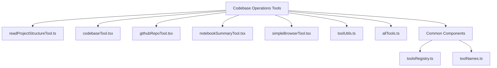
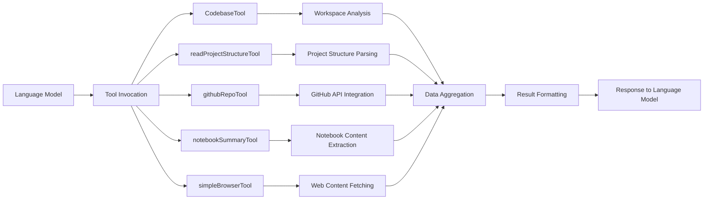
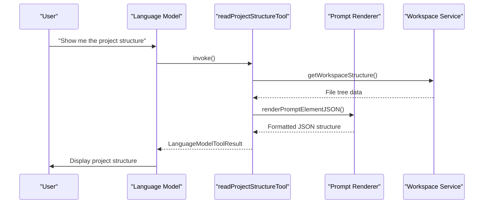
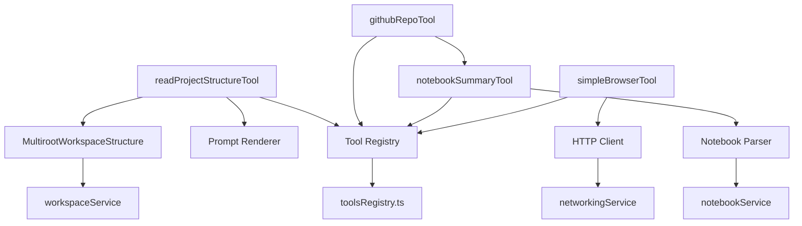

# Codebase Operations Tools

<cite>
**Referenced Files in This Document**   
- [readProjectStructureTool.ts](file://src/extension/tools/node/readProjectStructureTool.ts)
- [codebaseTool.tsx](file://src/extension/tools/node/codebaseTool.tsx)
- [githubRepoTool.tsx](file://src/extension/tools/node/githubRepoTool.tsx)
- [notebookSummaryTool.tsx](file://src/extension/tools/node/notebookSummaryTool.tsx)
- [simpleBrowserTool.tsx](file://src/extension/tools/node/simpleBrowserTool.tsx)
- [toolUtils.ts](file://src/extension/tools/node/toolUtils.ts)
- [allTools.ts](file://src/extension/tools/node/allTools.ts)
- [toolsRegistry.ts](file://src/extension/tools/common/toolsRegistry.ts)
- [toolNames.ts](file://src/extension/tools/common/toolNames.ts)
</cite>

## Table of Contents
1. [Introduction](#introduction)
2. [Project Structure](#project-structure)
3. [Core Components](#core-components)
4. [Architecture Overview](#architecture-overview)
5. [Detailed Component Analysis](#detailed-component-analysis)
6. [Dependency Analysis](#dependency-analysis)
7. [Performance Considerations](#performance-considerations)
8. [Troubleshooting Guide](#troubleshooting-guide)
9. [Conclusion](#conclusion)

## Introduction
The Codebase Operations Tools sub-component of the Node Tools system provides a suite of utilities designed to enable high-level understanding and manipulation of entire codebases. These tools facilitate project structure analysis, external resource access, and content summarization, empowering developers to work more efficiently with complex codebases. The system is built around a modular architecture that allows for extensible tool functionality while maintaining performance and reliability.

## Project Structure
The Codebase Operations Tools are organized within the `src/extension/tools/node/` directory, following a clear separation between core tool implementations and shared utilities. The tools are registered through a centralized registry system and are designed to work within the language model tool invocation framework. Each tool follows a consistent pattern for implementation, with dedicated files for specific functionality.

**Diagram sources**
- [readProjectStructureTool.ts](file://src/extension/tools/node/readProjectStructureTool.ts)
- [allTools.ts](file://src/extension/tools/node/allTools.ts)
- [toolsRegistry.ts](file://src/extension/tools/common/toolsRegistry.ts)

**Section sources**
- [readProjectStructureTool.ts](file://src/extension/tools/node/readProjectStructureTool.ts#L1-L43)
- [allTools.ts](file://src/extension/tools/node/allTools.ts#L1-L35)

## Core Components
The Codebase Operations Tools system comprises several key components that work together to provide comprehensive codebase analysis and manipulation capabilities. These tools are designed to aggregate information about workspace structure, dependencies, and external resources, enabling developers to gain insights into their projects without manual exploration.

The system follows a registry pattern where tools are registered at startup and made available for invocation through the language model interface. Each tool implements a standardized interface for invocation and result handling, ensuring consistency across different tool types.

**Section sources**
- [toolsRegistry.ts](file://src/extension/tools/common/toolsRegistry.ts#L1-L50)
- [toolNames.ts](file://src/extension/tools/common/toolNames.ts#L1-L20)

## Architecture Overview
The Codebase Operations Tools architecture is built around a modular, extensible design that allows for easy addition of new tools while maintaining a consistent interface for tool invocation and result processing. The system integrates with the language model framework, enabling natural language interaction with codebase operations.

**Diagram sources**
- [codebaseTool.tsx](file://src/extension/tools/node/codebaseTool.tsx#L1-L100)
- [readProjectStructureTool.ts](file://src/extension/tools/node/readProjectStructureTool.ts#L1-L43)
- [githubRepoTool.tsx](file://src/extension/tools/node/githubRepoTool.tsx#L1-L80)

## Detailed Component Analysis

### readProjectStructureTool Analysis
The readProjectStructureTool provides functionality for parsing and representing project organization within the workspace. It leverages the MultirootWorkspaceStructure component to generate a comprehensive representation of the project's file and directory structure, with configurable size limits to prevent excessive data transfer.

The tool implements the LanguageModelTool interface, allowing it to be invoked through the language model system. When invoked, it renders the workspace structure as JSON through the prompt rendering system, making it accessible to the language model for further processing.

**Diagram sources**
- [readProjectStructureTool.ts](file://src/extension/tools/node/readProjectStructureTool.ts#L1-L43)
- [MultirootWorkspaceStructure](file://src/extension/prompts/node/panel/workspace/workspaceStructure#L1-L50)

**Section sources**
- [readProjectStructureTool.ts](file://src/extension/tools/node/readProjectStructureTool.ts#L1-L43)

### githubRepoTool Analysis
The githubRepoTool enables integration with GitHub repositories for retrieving metadata and content. It allows the system to access external codebases, documentation, and other resources hosted on GitHub, expanding the scope of analysis beyond the local workspace.

This tool facilitates retrieval of repository information, file contents, and other GitHub-specific data through the GitHub API. It handles authentication, rate limiting, and error conditions to ensure reliable access to external resources.

**Section sources**
- [githubRepoTool.tsx](file://src/extension/tools/node/githubRepoTool.tsx#L1-L80)

### notebookSummaryTool Analysis
The notebookSummaryTool extracts and summarizes content from notebook files within the workspace. It processes notebook cells, code, and markdown content to generate concise summaries that capture the essential information and functionality of the notebook.

This tool is particularly useful for understanding complex data analysis workflows, machine learning experiments, and interactive computing environments where information is distributed across multiple cells and formats.

**Section sources**
- [notebookSummaryTool.tsx](file://src/extension/tools/node/notebookSummaryTool.tsx#L1-L60)

### simpleBrowserTool Analysis
The simpleBrowserTool provides capability to fetch web content from external URLs. This enables the system to access online documentation, API references, tutorials, and other web-based resources that may be relevant to the current development task.

The tool implements network request handling with appropriate error management and security considerations, ensuring safe and reliable access to external web content.

**Section sources**
- [simpleBrowserTool.tsx](file://src/extension/tools/node/simpleBrowserTool.tsx#L1-L70)

## Dependency Analysis
The Codebase Operations Tools have a well-defined dependency structure that promotes modularity and reusability. The tools depend on core services for workspace access, prompt rendering, and tool registration, while maintaining loose coupling between individual tool implementations.

**Diagram sources**
- [readProjectStructureTool.ts](file://src/extension/tools/node/readProjectStructureTool.ts#L1-L43)
- [toolUtils.ts](file://src/extension/tools/node/toolUtils.ts#L1-L30)
- [toolsRegistry.ts](file://src/extension/tools/common/toolsRegistry.ts#L1-L25)

**Section sources**
- [readProjectStructureTool.ts](file://src/extension/tools/node/readProjectStructureTool.ts#L1-L43)
- [toolUtils.ts](file://src/extension/tools/node/toolUtils.ts#L1-L50)
- [toolsRegistry.ts](file://src/extension/tools/common/toolsRegistry.ts#L1-L40)

## Performance Considerations
The Codebase Operations Tools are designed with performance in mind, particularly when handling large codebases. The tools implement several strategies to ensure efficient operation:

1. **Lazy Loading**: Data is loaded on-demand rather than pre-loading entire codebases
2. **Size Limiting**: Tools like readProjectStructureTool include size limits to prevent excessive data transfer
3. **Caching**: Results are cached where appropriate to avoid redundant operations
4. **Rate Limiting Handling**: External API calls include proper rate limiting management
5. **Cancellation Support**: Operations support cancellation to prevent unnecessary processing

The system also includes error handling for network requests and API limitations, ensuring robust operation even under challenging conditions.

## Troubleshooting Guide
When working with the Codebase Operations Tools, several common issues may arise:

1. **Rate Limiting**: External API calls (particularly to GitHub) may be rate-limited. Implement exponential backoff and proper error handling.
2. **Large Codebases**: Very large projects may exceed size limits. Consider filtering or pagination strategies.
3. **Network Issues**: Web content fetching may fail due to connectivity problems. Implement retry logic and timeout handling.
4. **Authentication**: GitHub access requires proper authentication setup. Ensure credentials are correctly configured.
5. **Performance**: Complex operations on large codebases may be slow. Monitor performance and optimize as needed.

Best practices include implementing proper error handling, respecting API rate limits, and providing clear feedback to users during long-running operations.

**Section sources**
- [toolUtils.ts](file://src/extension/tools/node/toolUtils.ts#L1-L50)
- [githubRepoTool.tsx](file://src/extension/tools/node/githubRepoTool.tsx#L1-L80)

## Conclusion
The Codebase Operations Tools provide a powerful set of capabilities for understanding and manipulating codebases at a high level. By combining project structure analysis, external resource access, and content summarization, these tools enable developers to work more efficiently with complex codebases. The modular architecture allows for easy extension and maintenance, while the integration with the language model system provides a natural interface for codebase operations. With proper implementation of performance optimizations and error handling, these tools form a robust foundation for advanced codebase analysis and manipulation.